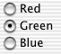
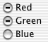

> 导航：[总目录](../../../README.md) · [documentation](../../../_indexes/documentation.md) · [Button Programming Topics](Introduction%20to%20Buttons.md)


[Next](Querying%20Button%20Matrices.md)[Previous](Using%20Checkboxes.md)

# Using Radio Buttons

A radio button displays the setting of something in your application and is part of a group in which only one button can be on at a time. Use a group of radio buttons to choose among several options which are mutually exclusive.

A standard radio button is a small circle followed by a line of text. If the button’s off, the circle is empty. If the button is on, the circle is filled in. If the button is mixed-state, the circle has a dash in it.

For example, this group of buttons displays that all the selected objects are green:



And this group displays that some of the selected objects are red and some are green:



A group of radio buttons is implemented with an `NSMatrix` object that contains several `NSButtonCell` instances and has a tracking mode of `NSRadioModeMatrix`. Whenever one of the matrix’s buttons is clicked, the matrix turns off the previously selected button and turns on the newly clicked one.

It’s easiest to create a group of switch buttons in Interface Builder. You can also make one programmatically by allocating an `NSMatrix` object and initializing it (in an invocation of [initWithFrame:mode:prototype:numberOfRows:numberOfColumns:](https://developer.apple.com/documentation/appkit/nsmatrix/1436386-initwithframe)) with a prototype cell and a tracking mode of `NSRadioModeMatrix`. For the prototype object, create a `NSButtonCell` object with a type of `NSRadioButton`. Listing 1 illustrates how you might do this.

__Listing 1__  Creating a radio-button matrix programmatically

```objc
- (void)awakeFromNib {

    NSButtonCell *prototype = [[NSButtonCell alloc] init];
    [prototype setTitle:@"Watermelons"];
    [prototype setButtonType:NSRadioButton];
    NSRect matrixRect = NSMakeRect(20.0, 20.0, 125.0, 125.0);
    NSMatrix *myMatrix = [[NSMatrix alloc] initWithFrame:matrixRect
                                                    mode:NSRadioModeMatrix
                                               prototype:(NSCell *)prototype
                                            numberOfRows:3
                                         numberOfColumns:1];
    [[[typeField window] contentView] addSubview:myMatrix];
    NSArray *cellArray = [myMatrix cells];
    [[cellArray objectAtIndex:0] setTitle:@"Apples"];
    [[cellArray objectAtIndex:1] setTitle:@"Oranges"];
    [[cellArray objectAtIndex:2] setTitle:@"Pears"];
    [prototype release];
    [myMatrix release];
}
```


You can also have a radio button that’s an icon button; that is, one that’s primarily identified by its icon and has little or no text. If the button’s off, it appears to be sticking in. If the button’s on, it appears to be pressed in. (An icon button cannot display the mixed state.)

You can create an group of icon radio buttons in either Interface Builder or programmatically. If you use Interface Builder, start with a matrix of push buttons. If you create it programmatically, create an matrix of buttons. Then change the matrix’s tracking mode to `NSRadioModeMatrix`. Change the buttons’ types to `NSPushOnPushOffButton`, their image positions to `NSImageOnly`, their bezel types to a square bezel type. Finally set their images to what you want.

[Next](Querying%20Button%20Matrices.md)[Previous](Using%20Checkboxes.md)

