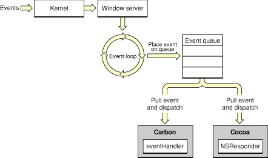
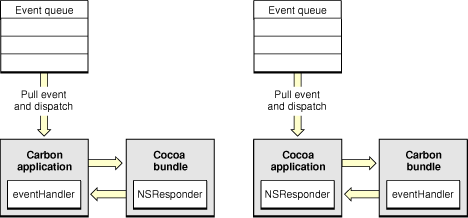

> 导航：[总目录](../../../README.md) · [documentation](../../../_indexes/documentation.md) · [Carbon-Cocoa Integration Guide](Introduction%20to%20Carbon-Cocoa%20Integration%20Guide.md)

[Next](Preprocessing%20Mixed-Language%20Code.md)[Previous](Introduction%20to%20Carbon-Cocoa%20Integration%20Guide.md)

# Carbon and Cocoa User Interface Communication

Prior to Mac OS X version 10.2, using Carbon windows in a Cocoa application or using Cocoa windows in a Carbon application posed a challenge because of the way user events are generated and forwarded to applications. This article provides an overview of event handling and outlines how Carbon and Cocoa communicate user events to each other.

Figure 1 shows the path of a user event (such as a click or a keypress) through the system to the Carbon and Cocoa application environments. The event originates when the device driver that controls an input device such as a mouse detects a user action and passes it to the window server.

__Figure 1__  The path of user events in Mac OS X

When the window server receives the event, it consults a database of currently open windows. It then sends the event to the event port of the run loop belonging to the process that owns the window in which the event occurred. The event manager gets the event from the run-loop port, packages the event in an appropriate form, and passes it to the event-handling mechanism specific to the application environment of the process. This mechanism ensures that the event is handled by the function or method associated with the control that is clicked (or key that is pressed).

Prior to Mac OS X version 10.2, events were passed to the application environment of the process. So when a Carbon application tried to use a Cocoa window, events for the Cocoa window were passed to the Carbon application. But because the Carbon application did not have a handler for events in the Cocoa window and had no way to communicate the event to the Cocoa environment that created the window, the event was dropped. The reverse was true for a Carbon window in a Cocoa application. Events for the Carbon window were passed to the Cocoa application, but the Cocoa application did not have a handler for the Carbon window and had no way to communicate the event to the Carbon environment.

Starting with Mac OS X version 10.2, the system automatically installs the appropriate handlers to allow Cocoa and Carbon to communicate events between the two environments. Figure 2 shows the communication path between Carbon and Cocoa environments for a Carbon application that uses a Cocoa source (on the left in the figure) and for a Cocoa application that uses a Carbon source (on the right in the figure).

Let’s first look at how communicating user events works for a Cocoa window used in a Carbon application. The system automatically installs Carbon event handlers for the Cocoa window using a `WindowRef` object created for that purpose. When a user event (for example, a button click) occurs in the Cocoa window, the user event is passed to the Carbon application. The Carbon application dispatches the user event to the event handler for the `WindowRef` object for the Cocoa window. The system-supplied event handler knows how to package the event as a Cocoa NSEvent object. It then passes the NSEvent object to the window for processing using the normal Cocoa event-processing mechanisms, including the responder chain for events not targeted at a specific control. In the case of a button click, the button receives the button-click event and handles it using the normal Cocoa target-action mechanism.

__Figure 2__  Events communicated between Carbon and Cocoa

Conversely, for a Carbon window used in a Cocoa application, the system automatically creates a Cocoa NSWindow object to represent the Carbon window. When a user clicks a button in the Carbon window, an NSEvent object for the button click is passed to the Cocoa application. Cocoa’s normal event-handling mechanisms pass the event to the system-supplied NSWindow object that corresponds to the Carbon window. The NSWindow object knows how to create a Carbon event and pass it to the event handler of the Carbon window. From there, the event is processed through the Carbon event target containment hierarchy.

In summary, Carbon and Cocoa can share the same window because Mac OS X has mechanisms for automatically translating between Cocoa and Carbon events at the user interface element level, rather than just at the application level.

For more information on application environments and the system architecture, see _[Mac Technology Overview](../../Mac%20OSX/Mac%20Technology%20Overview/About%20Developing%20for%20Mac.md#apple-f4xwc4dqnrsv64tfmyxwi33df52wszbpkridimbqgaytanrx)_. For more information on Carbon events, see _[Carbon Event Manager Programming Guide](../../Carbon/Carbon%20Event%20Manager%20Programming%20Guide/Introduction%20to%20Carbon%20Event%20Manager%20Programming%20Guide.md#apple-f4xwc4dqnrsv64tfmyxwi33df52wszbpkridgmbqgaydsobz)_. For more information on Cocoa events, see the Cocoa programming topic _[Cocoa Event Handling Guide](../Cocoa%20Event%20Handling%20Guide/Introduction.md#apple-f4xwc4dqnrsv64tfmyxwi33df52wszbpgeydambqga3da2i)_.

[Next](Preprocessing%20Mixed-Language%20Code.md)[Previous](Introduction%20to%20Carbon-Cocoa%20Integration%20Guide.md)

