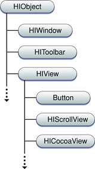
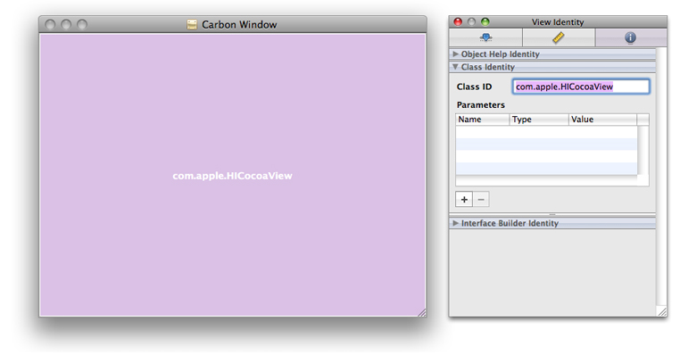
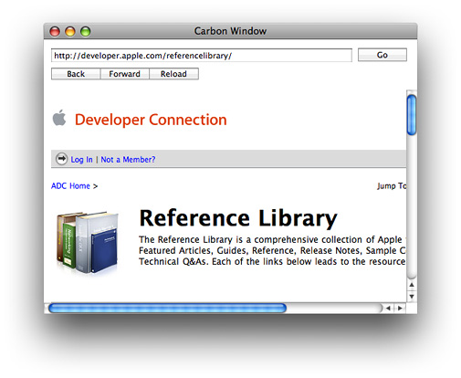

> 导航：[总目录](../../../README.md) · [documentation](../../../_indexes/documentation.md) · [Carbon-Cocoa Integration Guide](Introduction%20to%20Carbon-Cocoa%20Integration%20Guide.md)


[Next](Using%20Cocoa%20in%20a%20Navigation%20Services%20Dialog.md)[Previous](Using%20a%20Carbon%20User%20Interface%20in%20a%20Cocoa%20Application.md)

# HICocoaView: Using Cocoa Views in Carbon Windows

Cocoa provides views that are either not currently available in HIToolbox or are available without full support. These include views such as [WebView](https://developer.apple.com/documentation/webkit/webview), [PDFView](https://developer.apple.com/documentation/pdfkit/pdfview), `QTMovieView`, and [NSTokenField](https://developer.apple.com/documentation/appkit/nstokenfield). In addition, the Cocoa and Carbon control hierarchies are incompatible, so it has been difficult or impossible to have views from both frameworks embedded within the same window.

A new type of HIView called HICocoaView solves these problems. In Mac OS X v10.5 and later, you can embed a Cocoa view (any subclass of `NSView`) inside the HIView control hierarchy in a Carbon window. This is accomplished by associating the Cocoa view with a Carbon wrapper view called HICocoaView, a subclass of HIView. You can use standard HIView functions to manipulate the wrapper view, and you can use Cocoa methods to manipulate the associated Cocoa view.

Figure 1 shows how HICocoaView fits into the HIObject class hierarchy.

__Figure 1__  HICocoaView class hierarchy



Because HICocoaView is a subclass of HIView, you can use HIView functions to manipulate a wrapper view. For example, you can use `HIViewFindByID` to find the view in a window’s view hierarchy. If the view needs to be made visible, you can call `HIViewSetVisible`. If it needs to be redrawn, you can call `HIViewSetNeedsDisplay`. If you need more control over your view, you can also intercept any of the Carbon control events and implement them yourself. Note that you don’t need to handle the `kEventControlDraw` event; the wrapper view takes care of drawing its Cocoa view.

There are no restrictions on the type of Cocoa view you can wrap. A wrapped Cocoa view may also contain other Cocoa views. To gain access to the functionality of a wrapped Cocoa view, you can use any of its methods. To invoke these methods, you will need to use Objective-C to create and send messages to the Cocoa view. For example, if you want a `PDFView` object associated with a Carbon wrapper view to advance to the next page, you need to send the message `goToNextPage:` to the object.

When you modify the state of a Carbon wrapper view, adjustments are automatically made to the state of the associated Cocoa view. This is a one-way process, however—messages sent to the Cocoa view do not necessarily change the state of the wrapper view. For example, sending the `setFrame:` message to the Cocoa view does not reposition the wrapper view within its parent view.

When you embed a wrapper view inside a window, there are some limitations:

- The wrapper view must be embedded inside the content view of the window.
- The wrapper view cannot overlap other wrapper views.
- The wrapper view cannot contain any other Carbon views. (This restriction does not apply to the wrapped Cocoa view, which is allowed to contain other Cocoa views.)

The next section describes how to incorporate HICocoaView into your application.

The HICocoaView API is easy to understand and use. There are three functions:

|  |  |
| --- | --- |
| `HICocoaViewCreate` | Creates a Carbon view that serves as a wrapper for a Cocoa view. |
| `HICocoaViewSetView` | Associates a Cocoa view with a Carbon wrapper view. |
| `HICocoaViewGetView` | Returns the Cocoa view associated with a Carbon wrapper view. |

This section explains when and how to use these functions.

Before you can use the HICocoaView feature, you need to take the following steps to prepare your Carbon project to use Objective-C and Cocoa:

- Add the appropriate Cocoa frameworks to your project target. For example, if you’re going to use a Cocoa web view, add `Cocoa.framework` and `WebKit.framework` to the list of frameworks to link against.
- Import the necessary Cocoa headers. For example, if you’re going to use a Cocoa web view, you would add the following code to your source file:

```objc
#import <Cocoa/Cocoa.h>
#import <WebKit/WebKit.h>
```
- In functions where you’re using Cocoa, allocate and initialize an [NSAutoreleasePool](https://developer.apple.com/library/archive/documentation/LegacyTechnologies/WebObjects/WebObjects_3.5/Reference/Frameworks/ObjC/Foundation/Classes/NSAutoreleasePool/Description.html#//apple_ref/occ/cl/NSAutoreleasePool) object and release it when it is no longer needed. (If your application is running in Mac OS X v10.4 or later, you don’t need to use autorelease pools in functions that are called, directly or indirectly, by the toolbox.)
- Prepare your Carbon application to use Cocoa by calling the [NSApplicationLoad](https://developer.apple.com/documentation/appkit/1428475-nsapplicationload) function. Typically, you do this in your main function before executing any other Cocoa code.
- Use the Objective-C or Objective-C++ compiler to build those parts of your project that use Cocoa. The article [Preprocessing Mixed-Language Code](Preprocessing%20Mixed-Language%20Code.md#apple-f4xwc4dqnrsv64tfmyxwi33df52wszbpgiydambsgqydalktk4yq) describes how to configure an Xcode project to use the appropriate compiler.

To create a Carbon wrapper view and add it to the view hierarchy of a Carbon window, you use one of two approaches:

- Call the `HICocoaViewCreate` function to create the wrapper view at runtime, specifying the Cocoa view you want to wrap. Then embed the wrapper view inside the window’s view hierarchy. For information about embedding and positioning views in a view hierarchy, see _[HIView Programming Guide](../../Carbon/HIView%20Programming%20Guide/Introduction%20to%20HIView%20Programming%20Guide.md#apple-f4xwc4dqnrsv64tfmyxwi33df52wszbpkridgmbqgaydsmrt)_.
- Use the Interface Builder application to design a nib-based Carbon window that contains a placeholder for the wrapper view. Interface Builder does not provide a way to associate a Cocoa view with the wrapper view, so you’ll need to make this association at runtime. When you instantiate the window, the system creates an empty wrapper view for you and adds it to the window’s view hierarchy.

The following code example shows how to use `HICocoaViewCreate` to create a wrapped Cocoa view that can be embedded inside the content view of a Carbon window:

```
NSView *myCocoaView = [[SomeNSView alloc] init];
HIViewRef myHICocoaView;
HICocoaViewCreate (myCocoaView, 0, &myHICocoaView);
[myCocoaView release];
```


If you’re using Interface Builder, the first step is to add an HIView to your Carbon window by dragging an HIView object from the Carbon Objects palette into the window. If you like, resize the view to fill a larger area of the window. Now select the view and use the Inspector window to assign the class ID `"com.apple.HICocoaView"` to the view. You also need to assign a control signature and ID; you’ll use these values to find the view at runtime.

Figure 2 shows how a nib-based Carbon window that contains a wrapper view might look in Interface Builder.

__Figure 2__  A Carbon wrapper view in Interface Builder



To associate a Cocoa view with an existing Carbon wrapper view, you use the `HICocoaViewSetView` function. There are two occasions for using this function:

- You have an empty wrapper view, and now you’re ready to use it to wrap a Cocoa view. Typically, this happens when you use Interface Builder to create a wrapper view as a placeholder until a Cocoa view can be associated with it at runtime.
- You have a wrapper view with an associated Cocoa view, and you want to replace this Cocoa view with a new one.

The following code example shows how to find a wrapper view in a window’s content view hierarchy and associate a Cocoa web view with the wrapper view:

```
const HIViewID kMyHICocoaViewID = { 'Test', 1 };
HIViewRef myHICocoaView = NULL;
HIViewFindByID (HIViewGetRoot(myWindow), kMyHICocoaViewID, &myHICocoaView);
if (myHICocoaView != NULL) {
   WebView *myWebView = [[WebView alloc] init];
   HICocoaViewSetView (myHICocoaView, myWebView);
   [myWebView release];
}
```


If you have a Carbon wrapper view with an associated Cocoa view, you can use the `HICocoaViewGetView` function to get a pointer to the Cocoa view. Typically, you use this function when you want to send a message to the Cocoa view.

The following code example shows how to obtain a Cocoa web view from an existing wrapper view and load a webpage:

```
NSString *urlText = @"http://developer.apple.com/referencelibrary/";
WebView *myWebView = (WebView*) HICocoaViewGetView (myHICocoaView);
if (myWebView != NULL)
   [[myWebView mainFrame] loadRequest:[NSURLRequest requestWithURL:[NSURL URLWithString:urlText]]];
```


If you use a Cocoa nib file to specify a more complex user interface, your Carbon application needs to load the nib at runtime in order to embed the Cocoa user interface in an HICocoaView. One way to do this is to use a custom controller object to load the nib and access the UI. You can use the [NSViewController](https://developer.apple.com/documentation/appkit/nsviewcontroller) class to simplify this task. `NSViewController` makes it easy to load a nib and get access to the `NSView`-based user interface inside. The approach described here is adapted from a working sample application called _[HIView-NSView](../../../samplecode/HIView-NSView/HIView-NSView.md#apple-f4xwc4dqnrsv64tfmyxwi33df52wszbpirkfgmjqgaydimbqgu)_. The sample uses a subclass of `NSViewController` called `WebViewController` to implement some features in the user interface.

Listing 1 shows how to implement a wrapper function that creates a nib-based Carbon window, creates a nib-based Cocoa view that contains the user interface for a simple web browser, and embeds the user interface in an HICocoaView. An explanation for each numbered line of code follows the listing.

__Listing 1__  Using a nib-based Cocoa user interface in a Carbon window

```
static OSStatus MyNewWindow (void)
{
    OSStatus status = noErr;

    NSAutoreleasePool* pool = [[NSAutoreleasePool alloc] init]; // 1

    status = CreateWindowFromNib (gMainNibRef, CFSTR("MainWindow"), &gWindow); // 2
    require_noerr(status, CantCreateWindow);

    WebViewController* controller =
        [[WebViewController alloc] initWithNibName:@"WebView" bundle:nil]; // 3
    SetWRefCon(gWindow, (SRefCon)controller); // 4

    HIViewRef carbonView;
    status = HIViewFindByID (HIViewGetRoot(window), kMyHICocoaViewID, &carbonView); // 5
    require_noerr(status, CantFindHICocoaView);

    NSView* cocoaView = [controller view]; // 6
    if (cocoaView != nil)
        status = HICocoaViewSetView (carbonView, cocoaView); // 7

    ShowWindow(gWindow); // 8

CantCreateWindow:
CantFindHICocoaView:

    [pool release]; // 9
    return status;
}
```

Here’s what the code does:

1. Creates a local autorelease pool. This step is necessary because this function is not being called by the toolbox.
2. Creates a nib-based Carbon window. In this example, global variables are used for both the main nib object and the new window object.
3. Creates a Cocoa view controller to gain access to the nib-based Cocoa view and to implement the Cocoa view’s UI.
4. Stores the Cocoa view controller as window data. This information is used later to release the controller when the window is closed.
5. Finds the HICocoaView wrapper view in the Carbon window.
6. Retrieves the Cocoa view from the view controller.
7. Embeds the Cocoa view in the HICocoaView wrapper view.
8. Makes the Carbon window visible.
9. Drains and releases the local autorelease pool.

Figure 3 illustrates a simple Cocoa web browser view displayed inside a Carbon window.

__Figure 3__  Cocoa user interface inside a Carbon window



To learn how to write an `NSViewController` subclass that implements the user interface in Figure 3, see the sample application _[HIView-NSView](../../../samplecode/HIView-NSView/HIView-NSView.md#apple-f4xwc4dqnrsv64tfmyxwi33df52wszbpirkfgmjqgaydimbqgu)_.

[Next](Using%20Cocoa%20in%20a%20Navigation%20Services%20Dialog.md)[Previous](Using%20a%20Carbon%20User%20Interface%20in%20a%20Cocoa%20Application.md)

