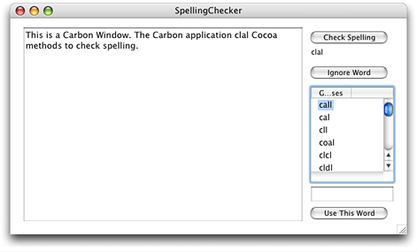

> 导航：[总目录](../../../README.md) · [documentation](../../../_indexes/documentation.md) · [Carbon-Cocoa Integration Guide](Introduction%20to%20Carbon-Cocoa%20Integration%20Guide.md)


[Next](Using%20Carbon%20Functionality%20in%20a%20Cocoa%20Application.md)[Previous](Using%20Carbon%20and%20Cocoa%20in%20the%20Same%20Application.md)

# Using Cocoa Functionality in a Carbon Application

This article describes how a Carbon application can use Cocoa functionality that is unrelated to the user interface. You can access Cocoa functionality in a Carbon application in Mac OS X version 10.1 and later. You need to perform two major tasks to use Cocoa functionality in a Carbon application:

- Write a C-callable wrapper function for any Cocoa method whose functionality you want to access from your Carbon application. See [Writing the Cocoa Source](#apple-f4xwc4dqnrsv64tfmyxwi33df52wszbpgiydambsgqydeljygyytaobv) for details.
- Write Carbon code that calls the C-wrapper function that initializes Cocoa. See [Calling C-Wrapper Functions From Your Carbon Application](#apple-f4xwc4dqnrsv64tfmyxwi33df52wszbpgiydambsgqydeljygyztknzq) for details.

The tasks described in the following sections are illustrated using sample code taken from a working application called Spelling Checker. The sample application uses Cocoa’s spell checking functionality. See [About the Spelling Checker Application](#apple-f4xwc4dqnrsv64tfmyxwi33df52wszbpgiydambsgqydeljygeztombz) for a description of the application. You can download the code for _[SpellingChecker-CarbonCocoa](../../../samplecode/SpellingChecker-CarbonCocoa/SpellingChecker-CarbonCocoa.md#apple-f4xwc4dqnrsv64tfmyxwi33df52wszbpirkfgmjqgaydanzsg4)_.

Although a lot of the code from the Spelling Checker application is shown in the listings in this article, not all of the code is included or explained. For example, none of the code that handles the Carbon window has been included. To see exactly how the Carbon and Cocoa pieces fit together, you should download the project.

The sample Carbon application, Spelling Checker, provides spelling checking functionality for text typed into a window. The user interface is shown in [Figure 1](#apple-f4xwc4dqnrsv64tfmyxwi33df52wszbpgiydambsgqydeljygy2damzwfvkfawcsivddcnrz). The Spelling Checker window is a Carbon window, created with Interface Builder. The user can type text into the large text box on the left side of the window.

To check spelling, the user clicks the Check Spelling button. The first misspelled word is displayed below the button, as shown in Figure 1 (“clal”). Suggestions for a replacement word are shown in the Guesses list. The user can choose to:

- Ignore the misspelled word by clicking the Ignore Word button.
- Replace the misspelled word by selecting a word from the list of guesses and double-clicking.
- Specify another word to use by typing a word and clicking the Use This Word button.

__Figure 1__  The user interface for the Spelling Checker application



Spelling checking functionality is provided by the Cocoa frameworks and accessed through C-callable wrapper functions, but called from the Carbon application.

Writing the Cocoa source requires performing the tasks described in the following sections:

- [Creating a New Cocoa Source File Using Xcode](#apple-f4xwc4dqnrsv64tfmyxwi33df52wszbpgiydambsgqydeljygyytcmzy)
- [Identifying Cocoa Methods](#apple-f4xwc4dqnrsv64tfmyxwi33df52wszbpgiydambsgqydeljygyytenbt)
- [Writing C-Callable Wrapper Functions](#apple-f4xwc4dqnrsv64tfmyxwi33df52wszbpgiydambsgqydeljygyztgmrq)

To make a Cocoa source file using Xcode, do the following:

1. Open your Carbon project in Xcode.
2. Choose File > New File.
3. Select Empty File in Project in the New File window and click the Next button.
4. Name the file so it has the appropriate `.m` extension. The sample code filename is `SpellCheck.m`.

   Recall from [Preprocessing Mixed-Language Code](Preprocessing%20Mixed-Language%20Code.md#apple-f4xwc4dqnrsv64tfmyxwi33df52wszbpgiydambsgqydalkukayq) that the `.m` extension indicates to the compiler that the code is Objective-C.
5. Add the following statements to your new file:

```c
#include <Carbon/Carbon.h>
#include <Cocoa/Cocoa.h>
```

As long as you create your source file using Xcode, you should not need to modify build settings and property list values.

You need to identify the Cocoa methods that provide the functionality your Carbon application needs. For each of the methods you identify, you’ll need to write a C-callable wrapper function.

The Spelling Checker application requires the functionality provided by the following methods:

- `uniqueSpellDocumentTag` returns a tag for a document. This tag is guaranteed to be unique. Using a tag with each document ensures that the spelling checking operation is unique for a document.
- `checkSpellingOfString:startingAt:` starts the search for a misspelled word in a string, starting at the specified location. This method returns the range of the first misspelled word.
- `checkSpellingOfString:startingAt:language:wrap:inSpellDocumentWithTag:wordCount:` starts the search for a misspelled word in a string, starting at the specified location and using a number of other options. This method returns the range of the first misspelled word.
- `ignoreWord:inSpellDocumentWithTag:` adds a word to the list of words to be ignored when checking a document’s spelling.
- `setIgnoredWords:inSpellDocumentWithTag:` initializes the list of ignored words for a document to an array of words to ignore.
- `ignoredWordsInSpellDocumentWithTag:` returns the array of ignored words for a document.
- `guessesForWord:` returns an array of suggested spellings for a misspelled word.
- `closeSpellDocumentWithTag:` is called when a document closes to make sure the ignored-word list associated with the document is cleaned up.

For additional information, see _[NSSpellChecker Class Reference](https://developer.apple.com/documentation/appkit/nsspellchecker)_.

You also need to identify any other methods that are needed to implement the Cocoa functionality. For example, the class method `sharedSpellChecker` returns an instance of NSSpellChecker.

After you have identified the Cocoa methods that provide the functionality you want to use, you need to write C-callable wrapper functions for those methods.

For the Spelling Checker application, there are eight Cocoa methods (see [Identifying Cocoa Methods](#apple-f4xwc4dqnrsv64tfmyxwi33df52wszbpgiydambsgqydeljygyytenbt)) that provide functionality to manage and check spelling in a document. In order for the Carbon portion of the application to access the Cocoa methods, you need to write C-callable wrapper functions and put them in the Cocoa source file. You also need to declare the functions in a shared header file. Table 1 lists the names of the C-callable wrapper functions in the Spelling Checker application.

__Table 1__  C-callable wrapper functions for Cocoa methods

| C-callable wrapper function | Cocoa method |
| `UniqueSpellDocumentTag` | `uniqueSpellDocumentTag` |
| `CloseSpellDocumentWithTag` | `closeSpellDocumentWithTag:` |
| `CheckSpellingOfString` | `checkSpellingOfString:startingAt:` |
| `CheckSpellingOfStringWithOptions` | `checkSpellingOfString:startingAt: language:wrap:inSpellDocumentWithTag: wordCount:` |
| `IgnoreWord` | `ignoreWord:inSpellDocumentWithTag:` |
| `SetIgnoredWords` | `setIgnoredWords:inSpellDocumentWithTag:` |
| `CopyIgnoredWordsInSpellDocumentWithTag` | `ignoredWordsInSpellDocumentWithTag:` |
| `GuessesForWords` | `guessesForWord:` |

Listing 1 shows the C-callable wrapper function `UniqueSpellDocumentTag`. Note the code for the autorelease pool. For a Cocoa method used by a Carbon application, you must set up an autorelease pool each time it’s used.

__Listing 1__  A C-callable wrapper function for the uniqueSpellDocumentTag: method

```
int     UniqueSpellDocumentTag ()
{
    int  tag;

    NSAutoreleasePool* pool = [[NSAutoreleasePool alloc] init];
    tag  = [NSSpellChecker uniqueSpellDocumentTag];
    [pool release];

    return (tag);
}
```

All the other C-callable wrapper functions for the Spelling Checker application are written in the same manner as shown in Listing 1, using these guidelines:

- The C-wrapper function must have parameters that match what’s needed by the Cocoa method. For examples, see Listing 2. The C-wrapper function parameters `stringToCheck` and `startingOffset` match the two parameters required by the `checkSpellingOfString:startingAt:` method.
- The C-wrapper function must allocate and initialize an NSAutoreleasePool object and then release it when it is no longer needed. This is a requirement for a Cocoa method that’s used by a Carbon application. You can see examples of this in Listing 1 and Listing 2.
- The C-wrapper function must return the data returned by the Cocoa method it wraps. For example, the `UniqueSpellDocumentTag` function in Listing 1 returns the tag value obtained from the `uniqueSpellDocumentTag` method; the `CheckSpellingOfString` function in Listing 2 returns the range obtained from the `checkSpellingOfString:startingAt:` method.
- Where appropriate, the C-wrapper function can use toll-free bridged (interchangeable) data types. For example, the C-wrapper function in Listing 2 takes a `CFStringRef` value as a parameter, but casts it to `NSString *` when passing the string to the Cocoa method.

__Listing 2__  A C-callable wrapper function for the checkSpellingOfString:startingAt: method

```
CFRange  CheckSpellingOfString (CFStringRef stringToCheck,
                        int startingOffset)
{
    NSRange range = {0,0};

    NSAutoreleasePool* pool = [[NSAutoreleasePool alloc] init];
    range = [[NSSpellChecker sharedSpellChecker]
                    checkSpellingOfString:(NSString *) stringToCheck
                    startingAt:startingOffset];
    [pool release];
    return ( *(CFRange*)&range );
}
```

You will also want to create a header file that contains the C-callable wrapper function declarations that can be included in the appropriate source files.

The code for the rest of the C-callable wrapper functions needed for the Spelling Checker application are in the `SpellCheck.m` Cocoa source file. You can download the code for _[SpellingChecker-CarbonCocoa](../../../samplecode/SpellingChecker-CarbonCocoa/SpellingChecker-CarbonCocoa.md#apple-f4xwc4dqnrsv64tfmyxwi33df52wszbpirkfgmjqgaydanzsg4)_.

You can use the C-callable wrapper functions as needed in your Carbon application. Listing 3 shows how to call a C-callable wrapper function (`CheckSpellingOfString`) from your Carbon application’s event handler. (You can see this code in context by downloading the Spelling Checker application from the developer sample code website.) A detailed explanation of each numbered line of code appears following the listing.

__Listing 3__  Calling a C-wrapper function from your Carbon application

```swift
if (command.commandID == 'Spel') // 1
{
    GetControlByID (window, &controlID, &control); // 2
    err = GetControlData (control, 0,
               kControlStaticTextCFStringTag,
               sizeof(CFStringRef),
               &stringToSpellCheck,
               &count); // 3
    if (err == noErr)
    {
        windowInfo->range = CheckSpellingOfString (stringToSpellCheck, 0); // 4
        if (windowInfo->range.length > 0) // 5
            SetMisspelledWord (window, stringToSpellCheck, &windowInfo->range);
        else
            windowInfo->range.location = 0;
    }
}
```

Here’s what the code does:

1. Checks to see if the command ID is the one that’s issued when the user clicks the Check Spelling button.
2. Calls the Control Manager function `GetControlByID` to obtain the `ControlRef` of the Unicode TextEdit control. This is the text box that contains the text typed by the user that needs to have its spelling checked. See [Figure 1](#apple-f4xwc4dqnrsv64tfmyxwi33df52wszbpgiydambsgqydeljygy2damzwfvkfawcsivddcnrz).
3. Calls the Control Manager function `GetControlData` to obtain the string that the user typed in the text box.
4. Calls the C-wrapper function `CheckSpellingOfString`. Recall that this C-wrapper function wraps the Cocoa method `checkSpellingOfString:startingAt:`.
5. Uses the location information returned from the C-wrapper function to set the location of the misspelled word if one is found.

[Next](Using%20Carbon%20Functionality%20in%20a%20Cocoa%20Application.md)[Previous](Using%20Carbon%20and%20Cocoa%20in%20the%20Same%20Application.md)

