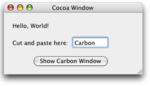
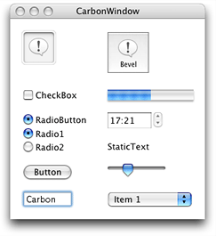

> 导航：[总目录](../../../README.md) · [documentation](../../../_indexes/documentation.md) · [Carbon-Cocoa Integration Guide](Introduction%20to%20Carbon-Cocoa%20Integration%20Guide.md)


[Next](HICocoaView-%20Using%20Cocoa%20Views%20in%20Carbon%20Windows.md)[Previous](Using%20a%20Cocoa%20User%20Interface%20in%20a%20Carbon%20Application.md)

# Using a Carbon User Interface in a Cocoa Application

This article describes how you can use a Carbon user interface in a Cocoa application. In Mac OS X version 10.2 and later, the system provides code that allows Cocoa and Carbon to communicate user events to each other. Communication between the two application environments is what enables a Cocoa application to use a Carbon user interface.

It is important to recognize that embedding a Carbon control inside a Cocoa window is not supported.

Using a Carbon interface in a Cocoa application requires you to perform the following major tasks:

- [Creating the Carbon User Interface](#apple-f4xwc4dqnrsv64tfmyxwi33df52wszbpgiydambsgqydkljygeytcmrq). You use Interface Builder to create a Carbon window and add controls and other items to the window.
- [Setting Up the Cocoa Application to Use the Carbon User Interface](#apple-f4xwc4dqnrsv64tfmyxwi33df52wszbpgiydambsgqydkljygeytcmzt). You load the nib file that specifies the Carbon window, create an NSWindow to allow management of the Carbon window with Cocoa methods, and show the window.

The tasks described in the following sections are illustrated using sample code taken from a working application, CarbonInCocoa. See [About the CarbonInCocoa Application](#apple-f4xwc4dqnrsv64tfmyxwi33df52wszbpgiydambsgqydkljygeytcmbw) for a description of the application. You can download the code for _[CarbonInCocoa](../../../samplecode/CarbonInCocoa/CarbonInCocoa.md#apple-f4xwc4dqnrsv64tfmyxwi33df52wszbpirkfgmjqgaydamzyge)_.

Although most of the code from the CarbonInCocoa application is shown in the listings in this article, not all of the code is included. You should download the CarbonInCocoa Xcode project for a more complete picture of how the Cocoa and Carbon pieces fit together.

As you read the subsequent sections it may be helpful to have an idea of how the CarbonInCocoa application behaves and what the user interface looks like. When the application is launched, the window shown in Figure 1 appears. This window is a Cocoa window created with Interface Builder.

__Figure 1__  The Cocoa user interface for the CarbonInCocoa application



When the user clicks the Show Carbon Window button, the window shown in Figure 2 opens and becomes the frontmost and active window. The window in Figure 2 is a Carbon window created with Interface Builder. When the user clicks in one of the windows, that window becomes the active window. The user can type text in the text field in either window, copy the text from one window to the other, or cut the text from either window.

__Figure 2__  The Carbon user interface for the CarbonInCocoa application



The CarbonInCocoa application is simple. Its purpose is to show how little code you need to provide to use a Carbon user interface in a Cocoa application.

You should use Interface Builder to create the Carbon user interface. Follow these steps to create a Carbon window:

1. Open Interface Builder.
2. Under Carbon in the Starting Point dialog, select Window and click New.
3. When the window appears, drag items form the Carbon palette to the window to create the interface.

   See _[Interface Builder](../../Developer%20Tools/Interface%20Builder/Introduction%20to%20Interface%20Builder.md#apple-f4xwc4dqnrsv64tfmyxwi33df52wszbpgeydambqge3ts2i)_, or Interface Builder help from within Interface Builder, for details on how to use Interface Builder.

   See _Apple Human Interface Guidelines_ for information on making an Aqua-compliant interface.
4. Save the file.

   Interface Builder saves the interface in a nib file. (The “ib” in “nib” represents Interface Builder.) A nib file contains an archive of the interface. When you want to show the interface, you need to unarchive the nib file. You’ll see how to do this in [Loading the Nib File](#apple-f4xwc4dqnrsv64tfmyxwi33df52wszbpgiydambsgqydkljyge2tqmzq).

You must perform the following tasks to enable your Cocoa application to use the Carbon user interface:

- [Adding the Nib File that Specifies the Carbon Interface](#apple-f4xwc4dqnrsv64tfmyxwi33df52wszbpgiydambsgqydkljyge2tqmjx)
- [Declaring the Interface for the Controller](#apple-f4xwc4dqnrsv64tfmyxwi33df52wszbpgiydambsgqydkljyge2tsnbx)
- [Loading the Nib File](#apple-f4xwc4dqnrsv64tfmyxwi33df52wszbpgiydambsgqydkljyge2tqmzq)
- [Creating an NSWindow Object for the Carbon Window](#apple-f4xwc4dqnrsv64tfmyxwi33df52wszbpgiydambsgqydkljyge2tqnjs)
- [Showing the Carbon Window](#apple-f4xwc4dqnrsv64tfmyxwi33df52wszbpgiydambsgqydkljyge2tqnzq)

To add the nib file that specifies the Carbon interface, do the following:

1. Open the Xcode project for your Cocoa application.
2. Choose Project > Add Files.
3. Locate the nib file you just created and double-click its name.
4. Click Add in the dialog that appears.

   If your Cocoa application has more than one target, you need to choose the appropriate target before you click Add.

Your controller for the CarbonInCocoa application has two instance variables: a `WindowRef` structure for the Carbon window and an NSWindow object. The NSWindow object allows management of the Carbon window using Cocoa methods. (See [Showing the Carbon Window](#apple-f4xwc4dqnrsv64tfmyxwi33df52wszbpgiydambsgqydkljyge2tqnzq).)

The sample application’s controller has no other instance variables, but your application would need to declare any other instance variables that are appropriate. Listing 1 shows the declaration for the controller in the CarbonInCocoa application.

__Listing 1__  The declaration for the controller

```objc
@interface MyController : NSObject
{
    WindowRef   window;
    NSWindow    *cocoaFromCarbonWin;
}
@end
```


The Cocoa nib file is loaded automatically when the Cocoa application is launched; however, you must explicitly load the nib file that contains the Carbon interface. For the CarbonInCocoa application, the nib file is loaded when the user clicks the Show Carbon Window button in the Cocoa window.

Listing 2 shows the code needed to load the Carbon nib file at runtime. An explanation of each numbered line of code appears following the listing.

__Listing 2__  Loading a nib file for a Carbon window

```
    CFBundleRef bundleRef;
    IBNibRef    nibRef;
    OSStatus    err;

    bundleRef = CFBundleGetMainBundle();                                // 1
    err = CreateNibReferenceWithCFBundle (bundleRef,
                    CFSTR("SampleWindow"),
                    &nibRef);                                          // 2
    if (err!=noErr)
                NSLog(@"failed to create carbon nib reference");

    err = CreateWindowFromNib (nibRef,
                            CFSTR("CarbonWindow"),
                            &window);                                  // 3
    if (err!=noErr)
                NSLog(@"failed to create carbon window from nib");

    DisposeNibReference (nibRef);                                       // 4
```

Here’s what the code does:

1. Calls the Core Foundation opaque type CFBundle function `CFBundleGetMainBundle` to obtain an instance of the application's main bundle. You need this reference for the next call.
2. Calls the Interface Builder Services function `CreateNibReferenceWithCFBundle` to create a reference to the Carbon window’s nib file. The Core Foundation string you provide must be the name of the nib file, but without the `.nib` extension.
3. Calls the Interface Builder Services function `CreateWindowFromNib` to unarchive the Carbon window from the nib file. On return, `window` is a `WindowRef` to the Carbon window. Recall from [Declaring the Interface for the Controller](#apple-f4xwc4dqnrsv64tfmyxwi33df52wszbpgiydambsgqydkljyge2tsnbx) that `window` is a controller instance variable.
4. Calls the Interface Builder Services function `DisposeNibReference` to dispose of the reference to the nib file. You should call this function immediately after you have finished unarchiving an object.

You do not need to create an NSWindow object for the Carbon window; however, doing so lets you use Cocoa methods rather than Carbon functions to manage the Carbon window, which may be desirable in some applications and is what the CarbonInCocoa application does.

You can create an NSWindow object for a Carbon window by allocating an NSWindow object and then initializing the object using the `initWithWindowRef:` method, as shown in the following line of code:

```
cocoaFromCarbonWin = [[NSWindow alloc] initWithWindowRef:window];
```

Recall from [Loading the Nib File](#apple-f4xwc4dqnrsv64tfmyxwi33df52wszbpgiydambsgqydkljyge2tqmzq) that `window` is a reference to the Carbon window.

You can find more information about the NSWindow object and the `initWithWindowRef:` method in _[NSWindow Class Reference](https://developer.apple.com/documentation/appkit/nswindow)_.

Because you created an NSWindow object for the Carbon window, you can call the `makeKeyAndOrderFront:` method to show the window instead of calling the Carbon function `ShowWindow`. You show the Carbon window with the following line of code:

```
 [cocoaFromCarbonWin makeKeyAndOrderFront:nil];
```


[Next](HICocoaView-%20Using%20Cocoa%20Views%20in%20Carbon%20Windows.md)[Previous](Using%20a%20Cocoa%20User%20Interface%20in%20a%20Carbon%20Application.md)

