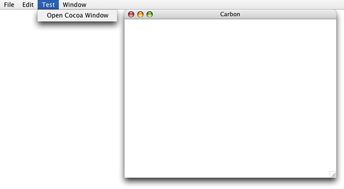
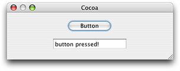
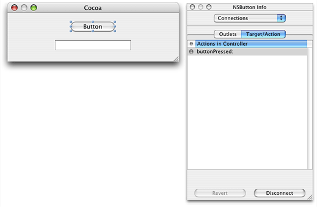

> 导航：[总目录](../../../README.md) · [documentation](../../../_indexes/documentation.md) · [Carbon-Cocoa Integration Guide](Introduction%20to%20Carbon-Cocoa%20Integration%20Guide.md)


[Next](Using%20a%20Carbon%20User%20Interface%20in%20a%20Cocoa%20Application.md)[Previous](Using%20Carbon%20Functionality%20in%20a%20Cocoa%20Application.md)

# Using a Cocoa User Interface in a Carbon Application

You can use a Cocoa user interface in a Carbon application starting with Mac OS X version 10.2. The system provides code that allows Cocoa and Carbon to communicate user events to each other, so there are only a few tasks you must perform to enable the Cocoa user interface to work properly in Carbon. Most tasks are similar to what you would do to use non-UI Cocoa functionality in a Carbon application—that is, writing C-callable wrapper functions and calling them. (See [Using Cocoa Functionality in a Carbon Application](Using%20Cocoa%20Functionality%20in%20a%20Carbon%20Application.md#apple-f4xwc4dqnrsv64tfmyxwi33df52wszbpgiydambsgqydelkukayq).)

It is important to recognize that embedding a Cocoa NSView inside a Carbon window is not supported in Mac OS X version 10.4 and earlier. For more information, see [HICocoaView: Using Cocoa Views in Carbon Windows](HICocoaView-%20Using%20Cocoa%20Views%20in%20Carbon%20Windows.md#apple-f4xwc4dqnrsv64tfmyxwi33df52wszbpkridimbqga2domrufvjvomi).

To use a Cocoa user interface in a Carbon application, you need to perform two major tasks:

- Write a Cocoa source file that contains the interface you want to use, the Cocoa methods that support the interface, and C-callable wrapper functions that allow access to the Cocoa functionality needed by the Carbon application. This is described in detail in [Writing the Cocoa Source Files](#apple-f4xwc4dqnrsv64tfmyxwi33df52wszbpgiydambsgqydiljxhazdqmjy).
- Write Carbon code that provides handlers, as appropriate, for the interface. See [Setting Up the Carbon Application to Use the Cocoa Interface](#apple-f4xwc4dqnrsv64tfmyxwi33df52wszbpgiydambsgqydiljxha2dmmrr) for details.

The tasks described in the following sections are illustrated using sample code taken from a working application called CocoaInCarbon. See [About the CocoaInCarbon Application](#apple-f4xwc4dqnrsv64tfmyxwi33df52wszbpgiydambsgqydiljyga4dkmrs) for a description of the application. You can download the code for _[CocoaInCarbon](../../../samplecode/CocoaInCarbon/CocoaInCarbon.md#apple-f4xwc4dqnrsv64tfmyxwi33df52wszbpirkfgmjqgaydamzygu)_.

Keep in mind that many parts of the CocoaInCarbon application are specific to the sample application; you need to customize the code for your own purposes. Although most of the code from the CocoaInCarbon application is shown in the listings in this article, not all of the code is included.

When you look at the code in the subsequent sections, it may be helpful to have an idea of how the CocoaInCarbon application behaves and what the user interface looks like. When the application is launched, an empty window appears. This window, shown in Figure 1, is a Carbon window defined in a nib file created with Interface Builder. The application provides a Test menu, that contains one command, Open Cocoa Window.

__Figure 1__  The Carbon user interface for the CocoaInCarbon application



When the user chooses Open Cocoa Window from the Test menu, the application calls the C-wrapper function that opens the Cocoa window (shown in Figure 2) and makes the window active.

__Figure 2__  The Cocoa window for the CocoaInCarbon application



When the user clicks the button shown in Figure 2, the mouse event is received by the Carbon application, which automatically dispatches the event to Cocoa. Specifically, the button receives the mouse event and sends its action method. The action method triggers a button command handler provided by the Carbon application. The button command handler calls a C-wrapper function that sends the text “button pressed!” to the text field below the button, as shown in Figure 2.

Although the sample application is obviously a contrived example, it illustrates the extent to which Carbon and Cocoa can communicate with each other.

Writing the Cocoa source requires performing the tasks described in the following sections:

- [Creating a Cocoa Source File Using Xcode](#apple-f4xwc4dqnrsv64tfmyxwi33df52wszbpgiydambsgqydiljxhazdqoju)
- [Writing a Common Header File](#apple-f4xwc4dqnrsv64tfmyxwi33df52wszbpgiydambsgqydiljxhe3tgnjz)
- [Implementing the Controller](#apple-f4xwc4dqnrsv64tfmyxwi33df52wszbpgiydambsgqydiljxhe3dgobv)
- [Declaring the Controller Interface](#apple-f4xwc4dqnrsv64tfmyxwi33df52wszbpgiydambsgqydiljygyydmmjy)
- [Writing C-Callable Wrapper Functions](#apple-f4xwc4dqnrsv64tfmyxwi33df52wszbpgiydambsgqydiljygyydomzx)
- [Creating the Cocoa Window in Interface Builder](#apple-f4xwc4dqnrsv64tfmyxwi33df52wszbpgiydambsgqydiljygyzdinru)

You need to make a Cocoa source file that contains all the Cocoa functionality needed by your Carbon application. Follow these steps to create a Cocoa source file:

1. Open your Carbon project in Xcode.
2. Choose File > New File.
3. Select Empty File in Project in the New File window and click the Next button.
4. Name the file so it has the appropriate `.m` extension. The sample code filename is `Controller.m`.

   Recall from [Preprocessing Mixed-Language Code](Preprocessing%20Mixed-Language%20Code.md#apple-f4xwc4dqnrsv64tfmyxwi33df52wszbpgiydambsgqydalktk4yq) that the `.m` extension indicates to the compiler that the code is Objective-C.
5. Create any other files you need for the application. For example, the Cocoa source created for the CocoaInCarbon application has an interface file, `Controller.h`. You must create this file and import it to the `Controller.m` file by adding an import statement to the `Controller.m` file.

As long as you create your source file using Xcode, you should not need to modify build settings and property list values.

Both the Cocoa and the Carbon sources need to have a copy of the header file that declares any constants used to communicate events between them. The constant that defines the button-press event in the CocoaInCarbon application is one such constant. The C-callable wrapper function declarations could also be in this shared file. Listing 1 shows the contents of the header file (`CocoaStuff.h`) that must be included in both the Cocoa and the Carbon source for the CocoaInCarbon project.

__Listing 1__  The contents of the common header for Cocoa and Carbon

```
enum {
    kEventButtonPressed = 1
};

//Declare the wrapper functions
OSStatus initializeCocoa(OSStatus (*callBack)(int));
OSStatus orderWindowFront(void);
OSStatus changeText(CFStringRef message);
```


The code to implement the controller for the Cocoa source in the CocoaInCarbon application is shown in Listing 2. The critical item in this code is the use of the [NSApplicationLoad](https://developer.apple.com/documentation/appkit/1428475-nsapplicationload) function (in the line numbered 2). A Carbon application cannot access the Cocoa interface unless the application includes a call to `NSApplicationLoad`. This function is not needed for Cocoa applications, but it is mandatory for Carbon applications that use Cocoa. The `NSApplicationLoad` function is available starting with Mac OS X v10.2. `NSApplicationLoad` should be called after Carbon is initialized.

A detailed explanation of each numbered line of code in Listing 2 follows the listing.

__Listing 2__  Implementing the controller in the Cocoa source file

```objc
#import "Controller.h"

static Controller *sharedController;

@implementation Controller

+ (Controller *) sharedController
{
    return sharedController;
}

- (id) init                                                             // 1
{
    self = [super init];
    NSApplicationLoad();                                                // 2
    if (![NSBundle loadNibNamed:@"MyWindow" owner:self]) {
        NSLog(@"failed to load MyWindow nib");
    }
    sharedController = self;
    return self;
}

- (void) setCallBack:(CallBackType) callBack                            // 3
{
    _callBack = callBack;
}

- (void) showWindow                                                     // 4
{
    [window makeKeyAndOrderFront:nil];
}

- (void) changeText:(NSString *)text                                    // 5
{
    [textField setStringValue:text];
}

- (IBAction) buttonPressed:(id)sender                                   // 6
{
    (*_callBack) (kEventButtonPressed);
}

@end
```

Here’s what the code does:

1. Defines the method that initializes Cocoa. You’ll write a C-callable wrapper function for this method later. See [Writing C-Callable Wrapper Functions](#apple-f4xwc4dqnrsv64tfmyxwi33df52wszbpgiydambsgqydiljygyydomzx).
2. Calls `NSApplicationLoad` as required. This entry point is needed for Carbon applications using Cocoa API but is a no-op for Cocoa applications.
3. Sets a callback for the controller. The callback (as you’ll see later) is provided by the Carbon application to handle the button-press event.
4. Shows the Cocoa window and makes it active and frontmost. You’ll write a C-callable wrapper function for this method later. See [Writing C-Callable Wrapper Functions](#apple-f4xwc4dqnrsv64tfmyxwi33df52wszbpgiydambsgqydiljygyydomzx).
5. Displays a string in the text field of the Cocoa window. You’ll write a C-callable wrapper function for this method later. See [Writing C-Callable Wrapper Functions](#apple-f4xwc4dqnrsv64tfmyxwi33df52wszbpgiydambsgqydiljygyydomzx).
6. Defines the Interface Builder action associated with the button in the Cocoa window. It invokes the callback (provided by Carbon) that handles the button-press event. You’ll connect the action method to its button target later. See [Creating the Cocoa Window in Interface Builder](#apple-f4xwc4dqnrsv64tfmyxwi33df52wszbpgiydambsgqydiljygyzdinru).

The code to declare the interface for the controller (`Controller.h`) is shown in Listing 3. The item of note in this listing is the `_callBack` instance variable. The Carbon application provides the callback function that’s assigned to this variable.

__Listing 3__  Declaring the interface for the controller

```objc
#import <Cocoa/Cocoa.h>
#import "CocoaStuff.h"

typedef OSStatus (*CallBackType)(int);

@interface Controller : NSObject
{
    id window;
    id textField;
    CallBackType _callBack;
}

- (void)setCallBack:(CallBackType)callBack;
- (void)showWindow;
+ (id)sharedController;
@end
```


Listing 4 shows the C-callable wrapper functions that are part of the Cocoa source file. These functions are in the `Controller.m` file in the CocoaInCarbon project. Each function in Listing 4 wraps around one of the methods shown in [Listing 2](#apple-f4xwc4dqnrsv64tfmyxwi33df52wszbpgiydambsgqydiljyga4dqojyfvbuuqsdjjeuesi).

One of the critical items in this code is the use of and NSAutoreleasePool object. For Cocoa API used by a Carbon application, you must set up autorelease pools as needed. A detailed explanation of each numbered line of code appears following the listing.

__Listing 4__  C-callable wrapper functions for the Cocoa API

```
OSStatus initializeCocoa (OSStatus (*callBack)(int))                    // 1
{
    Controller *controller;
    NSAutoreleasePool *localPool;

    localPool = [[NSAutoreleasePool alloc] init];                       // 2
    controller = [[Controller alloc] init];                             // 3
    [controller setCallBack:callBack];                                  // 4
    [localPool release];                                                // 5
    return noErr;
}

OSStatus orderWindowFront(void)                                         // 6
{
    NSAutoreleasePool *localPool;

    localPool = [[NSAutoreleasePool alloc] init];
    [[Controller sharedController] showWindow];
    [localPool release];
    return noErr;
}

OSStatus changeText (CFStringRef message)                               // 7
{
    NSAutoreleasePool *localPool;

    localPool = [[NSAutoreleasePool alloc] init];
    [[Controller sharedController] changeText:(NSString *)message];     // 8
    [localPool release];
    return noErr;
}
```

Here’s what the code does:

1. Defines a C-callable wrapper function that must be called by the Carbon application to initialize Cocoa.
2. Allocates and initializes an autorelease pool, as required. You must do this for each C- callable wrapper function. See [Using Carbon and Cocoa in the Same Application](Using%20Carbon%20and%20Cocoa%20in%20the%20Same%20Application.md#apple-f4xwc4dqnrsv64tfmyxwi33df52wszbpgiydambsgm4tqlkukayq) for more information.
3. Calls the `init` method. Recall that this method makes the required call to `NSApplicationLoad`.
4. Assigns the callback function provided by the Carbon application to the controller’s callback instance variable.
5. Releases the local autorelease pool.
6. Defines a C-callable wrapper function for the `showWindow` method.
7. Defines a C-callable wrapper function for the `changeText:` method.
8. Casts a `CFStringRef` value to NSString \*. Recall from [Interchangeable Data Types](Interchangeable%20Data%20Types.md#apple-f4xwc4dqnrsv64tfmyxwi33df52wszbpgiydambsgqydclkukayq) that the `CFString` data type is toll-free bridged to the NSString class.

You must use Interface Builder to add the Cocoa window to the appropriate nib file and connect targets to the appropriate actions. A nib file contains the definition of a set of user-interface elements. When the button in the sample application is pressed, it triggers the `buttonPressed` action method (see Figure 3). Recall from [Listing 2](#apple-f4xwc4dqnrsv64tfmyxwi33df52wszbpgiydambsgqydiljyga4dqojyfvbuuqsdjjeuesi) that the `buttonPressed` method calls the callback function assigned to the controller. In the CocoaInCarbon application, the callback is provided by the Carbon application.

__Figure 3__  Connecting a button to a button-pressed action



For more information on creating a Cocoa window in Interface Builder, see _Cocoa Application Tutorial_.

Your Carbon application must perform a number of tasks to use the interface provided by the Cocoa. These tasks are described in the following sections:

- [Including the Common Header File](#apple-f4xwc4dqnrsv64tfmyxwi33df52wszbpgiydambsgqydiljyga3tsmry)
- [Writing a Command Handler](#apple-f4xwc4dqnrsv64tfmyxwi33df52wszbpgiydambsgqydiljxhe4tsobr)

Both the Cocoa and the Carbon source files need to have a copy of the header file that declares any constants used to communicate events. [Listing 1](#apple-f4xwc4dqnrsv64tfmyxwi33df52wszbpgiydambsgqydiljyga4dqnjzfvbuuqseivcumqq) shows the header file (`CocoaStuff.h`) that needs to be included with both the Cocoa and the Carbon source files for the CocoaInCarbon project. See [Writing a Common Header File](#apple-f4xwc4dqnrsv64tfmyxwi33df52wszbpgiydambsgqydiljxhe3tgnjz) for details.

The Carbon code in the CocoaInCarbon application provides a function (`handleCommand`) that is passed as a parameter to the C-wrapper function that initializes Cocoa. When the user presses the button in the Cocoa window, the action method associated with the button invokes the `handleCommand` function. In the CocoaInCarbon application, this function just sends a string back to the Cocoa method, so it is not really necessary. However, the `handleCommand` function does illustrate how a more complex application could be notified of user actions in the Cocoa source.

The `handleCommand` function is shown in Listing 5. A detailed explanation of each numbered line of code appears following the listing.

__Listing 5__  A Carbon function that handles a Cocoa button press

```
static OSStatus handleCommand (int commandID)
{
    OSStatus osStatus = noErr;
    if (commandID == kEventButtonPressed)                               // 1
    {
        osStatus = changeText (CFSTR("button pressed!"));               // 2
        require_noerr (osStatus, CantCallFunction);
    }
CantCallFunction:
    return osStatus;
}
```

Here’s what the code does:

1. Checks to make sure the event is a button-press event, the only event handled by the function.
2. Calls the `changeText` C-wrapper function with the string “button pressed!”.

[Next](Using%20a%20Carbon%20User%20Interface%20in%20a%20Cocoa%20Application.md)[Previous](Using%20Carbon%20Functionality%20in%20a%20Cocoa%20Application.md)

