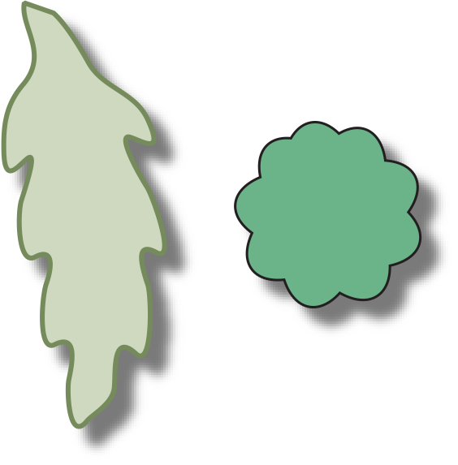
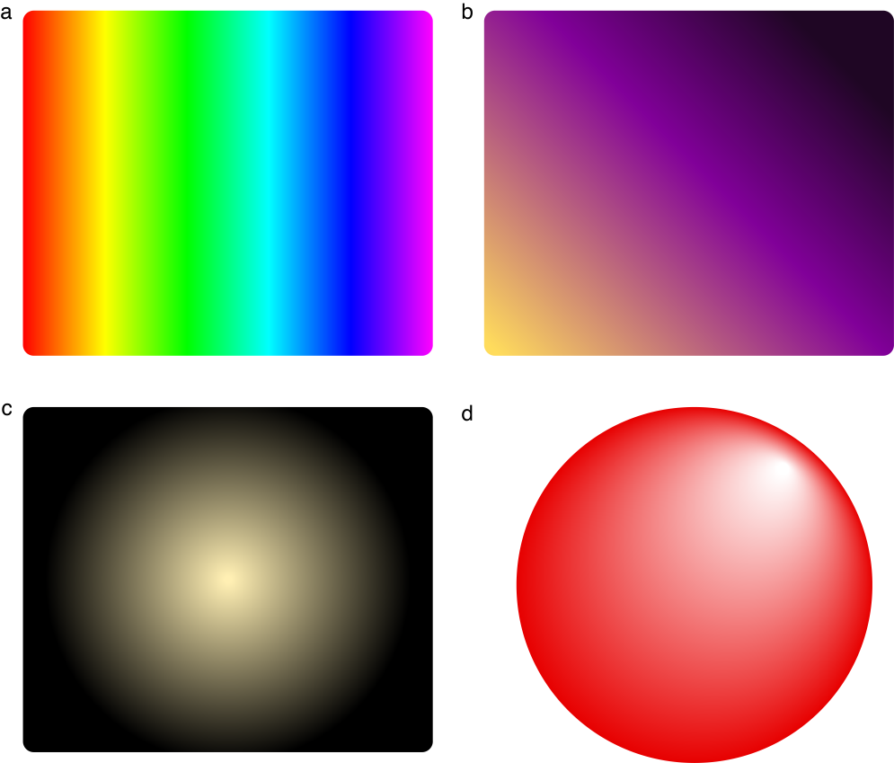
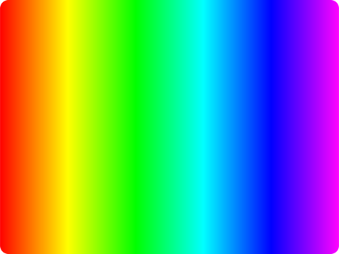
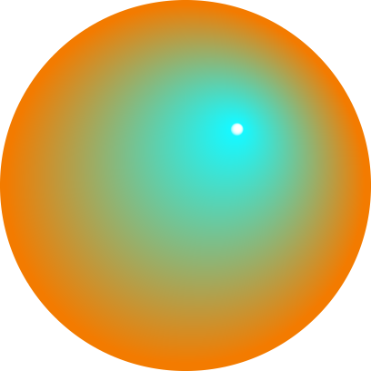

> 导航：[总目录](../../../README.md) · [documentation](../../../_indexes/documentation.md) · [Cocoa Drawing Guide](Introduction%20to%20Cocoa%20Drawing%20Guide.md)


[Next](Text.md)[Previous](Images.md)

# Advanced Drawing Techniques

Creating an effective and beautiful Mac app often requires the use of many different techniques. Beyond the basic drawing of paths and images in views, there are other ways to create more complex imagery for your application. The following sections cover many of the most commonly used techniques supported by Cocoa.

Cocoa provides support for shadows through the [NSShadow](https://developer.apple.com/documentation/uikit/nsshadow) class. A shadow mimics a light source cast on the object, making paths appear as if they’re floating above the surface of the view. Figure 6-1 shows the effect created by a shadow for a few paths.

__Figure 6-1__  Shadows cast by rendered paths



A shadow effect consists of horizontal and vertical offset values, a blur value, and the shadow color. These effects combine to give the illusion that there is a light above the canvas that is shining down on the shapes below. The offset and blur values effectively determine the position of the light and the height of the shapes above the canvas.

Shadow positions always use the base coordinate system of the view, ignoring any transforms you apply to the shapes in your view. This means that no matter how you manipulate the shapes in a view, the apparent position of the light generating the shadows never changes. If you want to change the apparent position of the light, you must change the shadow object attributes and apply the updated shadow object to the current graphics context before drawing your content.

To create a shadow, you create an `NSShadow` object and call its methods to set the desired shadow attributes. If you anticipate one or more paths overlapping each other, you should be sure to choose a color that has an alpha value; otherwise, shadows that intersect other objects might look flat and ruin the effect. To apply the shadow, invoke its `set` method.

Listing 6-1 shows the code used to create the shadow for the paths in [Figure 6-1](#apple-f4xwc4dqnrsv64tfmyxwi33df52wszbpkridimbqgazteojqfvbuqmrqg4wugsscjfcuqqkh). A partially transparent color is used to allow for overlapping paths and shadows.

__Listing 6-1__  Adding a shadow to a path

```
[NSGraphicsContext saveGraphicsState];

// Create the shadow below and to the right of the shape.
NSShadow* theShadow = [[NSShadow alloc] init];
[theShadow setShadowOffset:NSMakeSize(10.0, -10.0)];
[theShadow setShadowBlurRadius:3.0];

// Use a partially transparent color for shapes that overlap.
[theShadow setShadowColor:[[NSColor blackColor]
             colorWithAlphaComponent:0.3]];

[theShadow set];

// Draw your custom content here. Anything you draw
// automatically has the shadow effect applied to it.

[NSGraphicsContext restoreGraphicsState];
[theShadow release];
```

Shadow effects are stored as part of the graphics state, so once set, they affect all subsequent rendering commands in the current context. This is an important thing to remember because it might force you to think about the order in which you draw your content. For example, if you set up a shadow, fill a path, and then stroke the same path, you do not get a single shape with an outline, fill color, and shadow. Instead, you get two shapes—an outline and a fill shape—and two shadows, one for each shape. If you stroke the path after filling it, the shadow for the stroked path appears on top of the filled shape. In [Figure 6-1](#apple-f4xwc4dqnrsv64tfmyxwi33df52wszbpkridimbqgazteojqfvbuqmrqg4wugsscjfcuqqkh), the desired effect was achieved by applying the shadow to only the fill shape of each path.

A gradient fill (also referred to as a _shading_ in Quartz) is a pattern that gradually changes from one color to another. Unlike the image-based patterns supported by `NSColor`, a gradient fill does not tile colors to fill the target shape. Instead, it uses a mathematical function to compute the color at individual points along the gradient. Because they are mathematical by nature, gradients are resolution independent and scale readily to any device.

Figure 6-2 shows some simple gradient fill patterns. Gradients a and b show linear gradients filling different Bezier shapes and aligned along different angles while gradients c and d show radial gradients. In the case of gradient c, the gradient was set to draw before and after the gradient’s starting and ending locations, thus creating both a white circle in the very center of the gradient and a black border surrounding the gradient. For gradient d, the center points of the circles used to draw the gradient are offset, creating a different sort of shading effect.

__Figure 6-2__  Different types of gradients



In OS X v10.5 and later, Cocoa provides support for drawing gradients using the [NSGradient](https://developer.apple.com/documentation/appkit/nsgradient) class. If your software runs on earlier versions of OS X, you must use Quartz or Core Image to perform gradient fills.

In OS X v10.5 and later, you can use the [NSGradient](https://developer.apple.com/documentation/appkit/nsgradient) class to create complex gradient fill patterns without having to write your own color computation function. Gradient objects are immutable objects that store information about the colors in the gradient and provide an interface for drawing those colors to the current context. When you create an `NSGradient` object, you specify one or more `NSColor` objects and a set of optional location parameters. During drawing, the gradient object uses this information to compute the color transitions for the gradient.

The `NSGradient` class supports both high-level and primitive drawing methods. The high-level methods provide a simple interface for drawing gradients as a fill pattern for a Bezier path or rectangle. If you need additional control over the final shape and appearance of the gradient fill, you can set up the clipping path your self and use the primitive drawing methods of `NSGradient` to do your drawing.

The `NSGradient` class uses color stops to determine the position of color changes in its gradient fill. A _color stop_ is a combination of an `NSColor` object and a floating-point number in the range 0.0 to 1.0. The floating point number represents the relative position of the associated color along the drawing axis of the gradient, which can be either radial or axial.

By definition, gradients must have at least two color stops. Typically, these color stops represent the start and end points of the gradient. Although the start point is often located at 0.0 and the end point at 1.0, that may not always be the case. You can position the start and end points anywhere along the gradient’s drawing axis. As it creates the gradient, the gradient object fills the area prior to the start point with the start color and similarly fills the area after the end point with the end color.

You can use the same gradient object to draw multiple gradient fills and you can freely mix the creation of radial and axial gradients using the same gradient object. Although you configure the colors of a gradient when you create the gradient object, you configure the drawing axis of the gradient only when you go to draw it. The `NSGradient` class defines the following methods for configuring the colors and color stops of a gradient.

- [initWithStartingColor:endingColor:](https://developer.apple.com/documentation/appkit/nsgradient/1525448-init)
- [initWithColors:](https://developer.apple.com/documentation/appkit/nsgradient/1535315-initwithcolors)
- [initWithColorsAndLocations:](https://developer.apple.com/documentation/appkit/nsgradient/1555387-initwithcolorsandlocations)
- [initWithColors:atLocations:colorSpace:](https://developer.apple.com/documentation/appkit/nsgradient/1524459-init)

Although you cannot change the colors of a gradient object after you initialize it, you can get information about the colors it contains using accessor methods. The [numberOfColorStops](https://developer.apple.com/documentation/appkit/nsgradient/1535846-numberofcolorstops) method returns the number of colors that the gradient uses to draw itself and the [getColor:location:atIndex:](https://developer.apple.com/documentation/appkit/nsgradient/1533505-getcolor) method retrieves the color stop information for each of those colors. If you want to know what color would be drawn for the gradient in between two color stops, you can use the [interpolatedColorAtLocation:](https://developer.apple.com/documentation/appkit/nsgradient/1526409-interpolatedcolor) method to get it.

The `NSGradient` class defines several convenience methods for drawing both radial and axial gradients:

- [drawInRect:angle:](https://developer.apple.com/documentation/appkit/nsgradient/1529086-draw)
- [drawInRect:relativeCenterPosition:](https://developer.apple.com/documentation/appkit/nsgradient/1533703-drawinrect)
- [drawInBezierPath:angle:](https://developer.apple.com/documentation/appkit/nsgradient/1534785-draw)
- [drawInBezierPath:relativeCenterPosition:](https://developer.apple.com/documentation/appkit/nsgradient/1530168-drawinbezierpath)

These convenience methods are easily identified by the fact that they take either an `NSBezierPath` or a rectangle as their first parameter. This parameter is used as a clipping region for the gradient when it is drawn. You might use these methods to draw a gradient fill inside an existing shape in your interface.

Listing 6-2 shows some code that draws an axial gradient pattern. The `NSBezierPath` object containing the rounded rectangle shape acts as the clipping region for the gradient when it is drawn. [Figure 6-3](#apple-f4xwc4dqnrsv64tfmyxwi33df52wszbpkridimbqgazteojqfvbuqmrqg4wvgvzy) shows the resulting gradient.

__Listing 6-2__  Clipping an axial gradient to a rounded rectangle

```objc
- (void)drawRect:(NSRect)rect
{
    NSRect        bounds = [self bounds];

    NSBezierPath*    clipShape = [NSBezierPath bezierPath];
    [clipShape appendBezierPathWithRoundedRect:bounds xRadius:40 yRadius:30];


    NSGradient* aGradient = [[[NSGradient alloc]
                    initWithColorsAndLocations:[NSColor redColor], (CGFloat)0.0,
                                            [NSColor orangeColor], (CGFloat)0.166,
                                            [NSColor yellowColor], (CGFloat)0.33,
                                            [NSColor greenColor], (CGFloat)0.5,
                                            [NSColor blueColor], (CGFloat)0.75,
                                            [NSColor purpleColor], (CGFloat)1.0,
                                            nil] autorelease];

    [aGradient drawInBezierPath:clipShape angle:0.0];
}
```


__Figure 6-3__  Axial gradient drawn inside a Bezier path



In addition to the high-level convenience methods, the `NSGradient` class defines two primitive methods for drawing gradients:

- [drawFromPoint:toPoint:options:](https://developer.apple.com/documentation/appkit/nsgradient/1532511-drawfrompoint)
- [drawFromCenter:radius:toCenter:radius:options:](https://developer.apple.com/documentation/appkit/nsgradient/1530677-drawfromcenter)

These methods give you more flexibility over the gradient parameters, including the ability to extend the gradient colors beyond their start and end points. Unlike the high-level routines, these methods do not change the clip region prior to drawing. If you do not set up a custom clip region prior to drawing, the resulting gradient could potentially expand to fill your entire view, depending on the gradient options.

Listing 6-3 shows the code for drawing a radial gradient in a view using the primitive drawing routine of `NSGradient`. The second circle in the gradient is offset from the first one by 60 points in both the horizontal and vertical directions, causing the overall gradient to skew towards the upper-right of the circle. Because the code passes the value 0 for the `options` parameter, the gradient does not draw beyond the start and end colors and therefore does not fill the entire view. [Figure 6-4](#apple-f4xwc4dqnrsv64tfmyxwi33df52wszbpkridimbqgazteojqfvbuqmrqg4wvgvzw) shows the gradient resulting from this code.

__Listing 6-3__  Drawing a radial gradient using primitive routine

```objc
- (void)drawRect:(NSRect)rect
{
    NSRect bounds = [self bounds];
    NSGradient* aGradient = [[[NSGradient alloc]
                                    initWithStartingColor:[NSColor orangeColor]
                                    endingColor:[NSColor cyanColor]] autorelease];

    NSPoint centerPoint = NSMakePoint(NSMidX(bounds), NSMidY(bounds));
    NSPoint otherPoint = NSMakePoint(centerPoint.x + 60.0, centerPoint.y + 60.0);
    CGFloat firstRadius = MIN( ((bounds.size.width/2.0) - 2.0),
                               ((bounds.size.height/2.0) -2.0) );
    [aGradient drawFromCenter:centerPoint radius:firstRadius
                toCenter:otherPoint radius:5.0
                options:0];
}
```


__Figure 6-4__  Gradient created using primitive drawing method



Because the `NSGradient` class is available only in OS X v10.5 and later, software that runs on earlier versions of OS X must use Quartz or Core Image to draw gradient fills. Quartz supports the creation of both radial and axial gradients in different color spaces using a mathematical computation function you provide. The use of a mathematical function means that the gradients you create using Quartz scale well to any resolution. Core Image, on the other hand, provides filters for creating a fixed-resolution image consisting of a radial, axial, or Gaussian gradient. Because the end result is an image, however, Core Image gradients may be less desirable for PDF and other print-based drawing.

To draw a Quartz shading in your Cocoa program, you would do the following from your `drawRect:` method:

1. Get a [CGContextRef](https://developer.apple.com/documentation/coregraphics/cgcontextref) using the [graphicsPort](https://developer.apple.com/documentation/appkit/nsgraphicscontext/1524914-graphicsport) method of `NSGraphicsContext`. (You will pass this reference to other Quartz functions.)
2. Create a [CGShadingRef](https://developer.apple.com/documentation/coregraphics/cgshadingref) using Quartz; see [Gradients](https://developer.apple.com/library/archive/documentation/GraphicsImaging/Conceptual/drawingwithquartz2d/dq_shadings/dq_shadings.html#//apple_ref/doc/uid/TP30001066-CH207) in _[Quartz 2D Programming Guide](../../Graphics%20Imaging/Quartz%202D%20Programming%20Guide/Introduction.md#apple-f4xwc4dqnrsv64tfmyxwi33df52wszbpkridgmbqgaytanrw)_.
3. Configure the current clipping path to the desired shape for your shading; see [Setting the Clipping Region](Graphics%20Contexts.md#apple-f4xwc4dqnrsv64tfmyxwi33df52wszbpkridimbqgazteojqfvbuqmrqgmwueq2jjfauiqsd).
4. Draw the shading using [CGContextDrawShading](https://developer.apple.com/documentation/coregraphics/cgcontext/1456643-drawshading).

For information on using Core Image to create images with gradient fills, see _[Core Image Programming Guide](../../Graphics%20Imaging/Core%20Image%20Programming%20Guide/About%20Core%20Image.md#apple-f4xwc4dqnrsv64tfmyxwi33df52wszbpkridgmbqgaytcobv)_.

If you want to take over the entire screen for your drawing, you can do so from a Cocoa application. Entering full-screen drawing mode is a two-step process:

1. Capture the desired screen (or screens) for drawing.
2. Configure your drawing environment.

After capturing the screen, the way you configure your drawing environment depends on whether you are using Cocoa or OpenGL to draw. In OpenGL, you create an [NSOpenGLContext](https://developer.apple.com/documentation/appkit/nsopenglcontext) object and invoke several of its methods to enter full-screen mode. In Cocoa, you have to create a window that fills the screen and configure that window.

Cocoa does not provide direct support for capturing and releasing screens. The `NSScreen` class provides read-only access to information about the available screens. To capture or manipulate a screen, you must use the functions found in Quartz Services.

To capture all of the available screens, you can simply call the [CGCaptureAllDisplays](https://developer.apple.com/documentation/coregraphics/1455221-cgcapturealldisplays) function. To capture an individual display, you must get the ID of the desired display and call the [CGDisplayCapture](https://developer.apple.com/documentation/coregraphics/1456259-cgdisplaycapture) function to capture it. The following example shows how to use information provided by an `NSScreen` object to capture the main screen of a system.

```objc
- (BOOL) captureMainScreen
{
    // Get the ID of the main screen.
    NSScreen* mainScreen = [NSScreen mainScreen];
    NSDictionary* screenInfo = [mainScreen deviceDescription];
    NSNumber* screenID = [screenInfo objectForKey:@"NSScreenNumber"];

    // Capture the display.
    CGDisplayErr err = CGDisplayCapture([screenID longValue]);
    if (err != CGDisplayNoErr)
        return NO;

    return YES;
}
```

To release a display you previously captured, use the [CGDisplayRelease](https://developer.apple.com/documentation/coregraphics/1455685-cgdisplayrelease) function. If you captured all of the active displays, you can release them all by calling the [CGReleaseAllDisplays](https://developer.apple.com/documentation/coregraphics/1454901-cgreleasealldisplays) function.

For more information about capturing and manipulating screens, see _[Quartz Display Services Reference](https://developer.apple.com/documentation/coregraphics/quartz_display_services)_.

Applications that do full-screen drawing tend to be graphics intensive and thus use OpenGL to improve rendering speed. Creating a full-screen context using OpenGL is easy to do from Cocoa. After capturing the desired displays, create and configure an [NSOpenGLContext](https://developer.apple.com/documentation/appkit/nsopenglcontext) object and then invoke its [setFullScreen](https://developer.apple.com/documentation/appkit/nsopenglcontext/1436221-setfullscreen) and [makeCurrentContext](https://developer.apple.com/documentation/appkit/nsopenglcontext/1436212-makecurrentcontext) methods. After invoking these methods, your application goes immediately to full-screen mode and you can start drawing content.

When requesting a full-screen context in OpenGL, the pixel format for your context should include the following attributes:

- [NSOpenGLPFAFullScreen](https://developer.apple.com/documentation/appkit/1436213-opengl_pixel_format_attributes/nsopenglpfafullscreen)
- [NSOpenGLPFAScreenMask](https://developer.apple.com/documentation/appkit/1436213-opengl_pixel_format_attributes/nsopenglpfascreenmask)
- [NSOpenGLPFAAccelerated](https://developer.apple.com/documentation/appkit/nsopenglpfaaccelerated)
- [NSOpenGLPFANoRecovery](https://developer.apple.com/documentation/appkit/1436213-opengl_pixel_format_attributes/nsopenglpfanorecovery) (only if your OpenGL graphics context is shared)

Listing 6-4 shows the basic steps for capturing all displays and setting up the OpenGL context for full-screen drawing. For information on how to create an `NSOpenGLContext` object, see [Creating an OpenGL Graphics Context](Incorporating%20Other%20Drawing%20Technologies.md#apple-f4xwc4dqnrsv64tfmyxwi33df52wszbpkridimbqgazteojqfvbuqmrrgewueqkbjfdegrsb).

__Listing 6-4__  Creating an OpenGL full-screen context

```
NSOpenGLContext* CreateScreenContext()
{
    CGDisplayErr err;

    err = CGCaptureAllDisplays();
    if (err != CGDisplayNoErr)
        return nil;

    // Create the context object.
    NSOpenGLContext* glContext = CreateMyGLContext();

    // If the context is bad, release the displays.
    if (!glContext)
    {
        CGReleaseAllDisplays();
        return nil;
    }

    // Go to full screen mode.
    [glContext setFullScreen];

    // Make this context current so that it receives OpenGL calls.
    [glContext makeCurrentContext];

    return glContext;
}
```

Once you go into full-screen mode with your graphics context, your application has full control of the screen. To exit full-screen mode, invoke the [clearDrawable](https://developer.apple.com/documentation/appkit/nsopenglcontext/1436114-cleardrawable) method of your OpenGL context and call the [CGReleaseAllDisplays](https://developer.apple.com/documentation/coregraphics/1454901-cgreleasealldisplays) function to release the screens back to the system.

For detailed sample code showing you how to enter full-screen mode using OpenGL and Cocoa, see the NSOpenGL Fullscreen sample in [Sample Code > Graphics & Imaging > OpenGL](https://developer.apple.com/library/archive/navigation/redirect.html#//apple_ref/doc/uid/TP30000925-TP30000424-TP30000549).

All Cocoa drawing occurs in a window, but for full screen drawing, the window you create is a little different. Instead of a bordered window with a title bar, you need to create a borderless window that spans the entire screen area.

Although you create a full-screen window using Cocoa classes, you still have to use Quartz Services to capture the display and configure the window properly. The capture process is described in [Capturing the Screen](#apple-f4xwc4dqnrsv64tfmyxwi33df52wszbpkridimbqgazteojqfvbuqmrqg4wugssci5begqsi). Once you capture the screen, the window server puts up a shield window that hides most other content. To make your full-screen window visible, you must adjust its level to sit above this shield. You can get the shield level using the [CGShieldingWindowLevel](https://developer.apple.com/documentation/coregraphics/1456352-cgshieldingwindowlevel) function and pass the returned value to the [setLevel:](https://developer.apple.com/documentation/appkit/nswindow/1419511-level) method of your window.

Listing 6-5 shows an action method defined in a subclass of `NSDocument`. The document object uses this method to capture the main display and create the window to fill that screen space. The window itself contains a single view (of type `MyFullScreenView`) for drawing content. (In your own code, you would replace this view with your own custom drawing view.) A reference to the window is stored in the `myScreenWindow` class instance variable, which is initialized to `nil` when the class is first instantiated.

__Listing 6-5__  Creating a Cocoa full-screen context

```objc
- (IBAction)goFullScreen:(id)sender
{
    // Get the screen information.
    NSScreen* mainScreen = [NSScreen mainScreen];
    NSDictionary* screenInfo = [mainScreen deviceDescription];
    NSNumber* screenID = [screenInfo objectForKey:@"NSScreenNumber"];

    // Capture the screen.
    CGDirectDisplayID displayID = (CGDirectDisplayID)[screenID longValue];
    CGDisplayErr err = CGDisplayCapture(displayID);
    if (err == CGDisplayNoErr)
    {
        // Create the full-screen window if it doesn’t already  exist.
        if (!myScreenWindow)
        {
            // Create the full-screen window.
            NSRect winRect = [mainScreen frame];
            myScreenWindow = [[NSWindow alloc] initWithContentRect:winRect
                    styleMask:NSBorderlessWindowMask
                    backing:NSBackingStoreBuffered
                    defer:NO
                    screen:[NSScreen mainScreen]];

            // Establish the window attributes.
            [myScreenWindow setReleasedWhenClosed:NO];
            [myScreenWindow setDisplaysWhenScreenProfileChanges:YES];
            [myScreenWindow setDelegate:self];

            // Create the custom view for the window.
            MyFullScreenView* theView = [[MyFullScreenView alloc]
                                             initWithFrame:winRect];
            [myScreenWindow setContentView:theView];
            [theView setNeedsDisplay:YES];
            [theView release];
        }

        // Make the screen window the current document window.
        // Be sure to retain the previous window if you want to  use it again.
        NSWindowController* winController = [[self windowControllers]
                                                 objectAtIndex:0];
        [winController setWindow:myScreenWindow];

        // The window has to be above the level of the shield window.
        int32_t     shieldLevel = CGShieldingWindowLevel();
        [myScreenWindow setLevel:shieldLevel];

        // Show the window.
        [myScreenWindow makeKeyAndOrderFront:self];
    }
}
```

To exit full screen mode using Cocoa, simply release the captured display, resize your window so that it does not occupy the entire screen, and set its level back to [NSNormalWindowLevel](https://developer.apple.com/documentation/appkit/nsnormalwindowlevel). For more information about the shield window, see _[Quartz Display Services Reference](https://developer.apple.com/documentation/coregraphics/quartz_display_services)_.

You can disable and reenable all screen flushes using the [NSDisableScreenUpdates](https://developer.apple.com/documentation/appkit/1473676-nsdisablescreenupdates) and [NSEnableScreenUpdates](https://developer.apple.com/documentation/appkit/1473669-nsenablescreenupdates) functions. (In OS X v10.4 and later, you can also use the [disableScreenUpdatesUntilFlush](https://developer.apple.com/documentation/appkit/nswindow/1419483-disablescreenupdatesuntilflush) method of `NSWindow`.) You can use this technique to synchronize flushes to both a parent and child window. As soon as you reenable screen updates, all windows are flushed simultaneously (or at least close to it).

To prevent the system from appearing frozen, the system may automatically reenable screen updates if your application leaves them disabled for a prolonged period of time. If you leave screen updates disabled for more than 1 second, the system automatically reenables them.

By default, Cocoa sends a [drawRect:](https://developer.apple.com/documentation/appkit/nsview/1483686-draw) message to your views only when a user action causes something to change. If your view contains animated content, you probably want to update that content at more regular intervals. For both indeterminate-length and finite-length animations, you can do this using timers.

The [NSTimer](https://developer.apple.com/library/archive/documentation/LegacyTechnologies/WebObjects/WebObjects_3.5/Reference/Frameworks/ObjC/Foundation/Classes/NSTimer/Description.html#//apple_ref/occ/cl/NSTimer) class provides a mechanism for generating periodic events in your application. When a preset time is reached, the timer object sends a message to your application, giving you the chance to perform any desired actions. For animations, you would use a timer to tell your application that it is time to draw the next frame.

There are two steps involved with getting a timer to run. The first step is to create the `NSTimer` object itself and specify the object to notify, the message to send, the time interval for the notification, and whether the timer repeats. The second step is to install that timer object on the run loop of your thread. The methods [scheduledTimerWithTimeInterval:invocation:repeats:](https://developer.apple.com/library/archive/documentation/LegacyTechnologies/WebObjects/WebObjects_3.5/Reference/Frameworks/ObjC/Foundation/Classes/NSTimer/Description.html#//apple_ref/occ/clm/NSTimer/scheduledTimerWithTimeInterval:invocation:repeats:) and [scheduledTimerWithTimeInterval:target:selector:userInfo:repeats:](https://developer.apple.com/library/archive/documentation/LegacyTechnologies/WebObjects/WebObjects_3.5/Reference/Frameworks/ObjC/Foundation/Classes/NSTimer/Description.html#//apple_ref/occ/clm/NSTimer/scheduledTimerWithTimeInterval:target:selector:userInfo:repeats:) perform both of these steps for you. Other methods of `NSTimer` create the timer but do not install it on the run loop.

For information and examples on how to create and use timers, see _[Timer Programming Topics](../Timer%20Programming%20Topics/Introduction%20to%20Timers.md#apple-f4xwc4dqnrsv64tfmyxwi33df52wszbpgeydambqga3dc2i)_.

The [NSAnimation](https://developer.apple.com/documentation/appkit/nsanimation) and [NSViewAnimation](https://developer.apple.com/documentation/appkit/nsviewanimation) classes provide sophisticated behavior for animations that occur over a finite length of time. OS X uses animation objects to implement transition animations for user interface elements. You can define custom animation objects to implement animations for your own code. Unlike `NSTimer`, animation notifications can occur at irregular intervals, allowing you to create animations that appear to speed up or slow down.

For information about how to use Cocoa animation objects, see _[Animation Programming Guide for Cocoa](../Animation%20Programming%20Guide%20for%20Cocoa/Introduction%20to%20Animation%20Programming%20Guide%20for%20Cocoa.md#apple-f4xwc4dqnrsv64tfmyxwi33df52wszbpkridimbqgaztkojs)_.

The following sections provide some basic guidance for improving the overall performance of your drawing code. These are the things that you should definitely be doing in your code. For a more comprehensive list of drawing optimization techniques, see _[Drawing Performance Guidelines](../../Performance/Drawing%20Performance%20Guidelines/Introduction%20to%20Drawing%20Performance%20Guidelines.md#apple-f4xwc4dqnrsv64tfmyxwi33df52wszbpgeydambqge2tc2i)_.

Even with modern graphics hardware, drawing is still an expensive operation. The best way to reduce the amount of time spent in your drawing code is to draw only what is needed in the first place.

During a view update, the `drawRect:` method receives a rectangle that specifies the portion of the view that needs to be updated. This rectangle is always limited to the portion of the view that is currently visible and in some cases may be even smaller. Your drawing code should pay attention to this rectangle and avoid drawing content outside of it. Because the rectangle passed to `drawRect:` might be a union of several smaller rectangles, an even better approach is to call the view’s [getRectsBeingDrawn:count:](https://developer.apple.com/documentation/appkit/nsview/1483772-getrectsbeingdrawn) method and constrain your drawing to the exact list of rectangles returned by that method.

When invalidating portions of your views, you should avoid using the `display` family of methods to force an immediate update. These methods cause the system to send a `drawRect:` message to the affected view (and potentially other views in the hierarchy) immediately rather than wait until the next regular update cycle. If there are several areas to update, this may result in a lot of extra work for your drawing code.

Instead, you should use the [setNeedsDisplay:](https://developer.apple.com/documentation/appkit/nsview/1483360-needsdisplay) and [setNeedsDisplayInRect:](https://developer.apple.com/documentation/appkit/nsview/1483475-setneedsdisplayinrect) methods to mark areas as needing an update. When you call these methods, the system collects the rectangles you specify and coalesces them into a combined update region, which it then draws during the next update cycle.

If you are creating animated content, you should also be careful not to trigger visual updates more frequently than the screen refresh rate allows. Updating faster than the refresh rate results in your code drawing frames that are never seen by the user. In addition, updating faster than the refresh rate is not allowed in OS X v10.4 and later. If you try to update the screen faster than the refresh rate, the window server may block the offending thread until the next update cycle.

If you have objects that you plan to use more than once, consider caching them for later use. Caching saves time by eliminating the need to recreate objects each time you want to draw them. Of course, caching requires more memory, so be judicious about what you cache. It is faster to recreate an object in memory than page it in from disk.

Many objects are cached automatically by Cocoa and do not need to be cached in your own code. For example, Cocoa caches `NSColor` objects representing commonly used colors as those colors are requested.

Every time you save the graphics state, you incur a small performance penalty. Whenever you have objects with the same rendering attributes, try to draw them all at the same time. If you save and restore the graphics state for each object, you may waste some CPU cycles.

With Cocoa, methods and functions that draw right away usually involve a change in graphics state. For example, when you call the [stroke](https://developer.apple.com/documentation/appkit/nsbezierpath/1520739-stroke) method of `NSBezierPath`, the object automatically saves the graphics state and applies the options associated with that path. While you are building the path, however, the graphics state does not change. Thus, if you want to draw several shapes using the same graphics attributes, it is advantageous to fill a single `NSBezierPath` with all of the shapes and then draw them all as a group.

[Next](Text.md)[Previous](Images.md)

