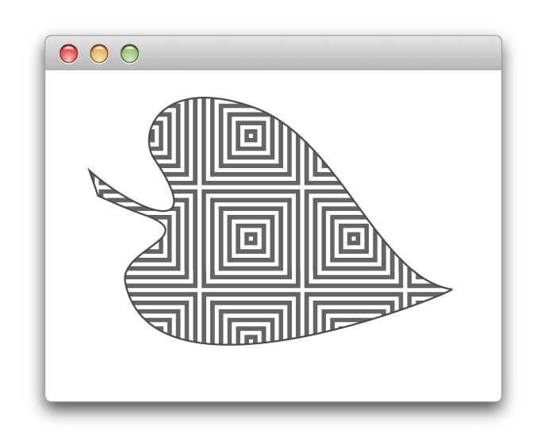

> 导航：[总目录](../../../README.md) · [documentation](../../../_indexes/documentation.md) · [Cocoa Drawing Guide](Introduction%20to%20Cocoa%20Drawing%20Guide.md)


[Next](Images.md)[Previous](Coordinate%20Systems%20and%20Transforms.md)

# Color and Transparency

One of the keys to creating interesting graphics is the effective use of color and transparency. In OS X, both are used to convey information and provide an inherent appeal to your creations. Good color usage usually results in an interface that is pleasing to the user and helps call out information when it is needed.

Support for color in Cocoa is built on top of Quartz. The [NSColor](https://developer.apple.com/documentation/appkit/nscolor) class provides the interface for creating and manipulating colors in a variety of color spaces. Other classes provide color and color space management. Cocoa also provides classes that present a user interface for selecting colors.

For a more thorough explanation of color, color theory, and color management in OS X, see _[Color Management Overview](../../Graphics%20Imaging/Color%20Management%20Overview/Introduction%20to%20Color%20Management%20Overview.md#apple-f4xwc4dqnrsv64tfmyxwi33df52wszbpkridgmbqgaytcnby)_ and _[Color Programming Topics](../Color%20Programming%20Topics/Introduction%20to%20Color%20Programming%20Topics%20for%20Cocoa.md#apple-f4xwc4dqnrsv64tfmyxwi33df52wszbpgeydambqga4de2i)_.

The human eye perceives photons in a fairly narrow band of the electromagnetic spectrum. Each photon vibrates at a frequency that defines the color of the light represented by that photon. The biology of the eye makes it particularly receptive to red, blue, and green light and these primary colors are often mixed together to create a broad range of perceptible colors.

A _color model_ is a geometric or mathematical framework that attempts to describe the colors seen by the eye. Each model contains one or more dimensions, which together represent the visible spectrum of color. Numerical values are pinned to each dimension making it possible to describe colors in the color model numerically. Having a numerical representation makes it possible to describe, classify, compare, and order those colors.

A _color space_ is a practical adaptation of a color model. It specifies the gamut (or range) of colors that can be produced using a particular color model. While the color model determines the relationship between values in each dimension, the color space defines the absolute meaning of those values as colors. Cocoa supports the same color spaces as Quartz 2D, although accessor methods of [NSColor](https://developer.apple.com/documentation/appkit/nscolor) focus on the following color spaces:

- RGB
- CMYK
- Gray

In Cocoa, the [NSColorSpace](https://developer.apple.com/documentation/appkit/nscolorspace) class handles the information associated with a particular color space. You can create instances of this class to represent individual color spaces. Cocoa provides methods for retrieving color space objects representing the standard color spaces. You can also create custom color space objects using a ColorSync profile reference or International Color Consortium (ICC) profile data.

For detailed information about color spaces and color models in OS X, see _[Color Management Overview](../../Graphics%20Imaging/Color%20Management%20Overview/Introduction%20to%20Color%20Management%20Overview.md#apple-f4xwc4dqnrsv64tfmyxwi33df52wszbpkridgmbqgaytcnby)_.

The [NSColor](https://developer.apple.com/documentation/appkit/nscolor) class in Cocoa provides the interface you need to create and manage individual colors. The `NSColor` class is itself a factory class for creating the actual color objects. The class methods of `NSColor` create color objects that are actually based on specific subclasses of `NSColor`, where each subclass implements the behavior for a specific color space.

Because a color object must represent a single color space, you cannot use all of the methods of `NSColor` from the same object. For a given color object, you can use only the methods that are relevant to colors in that object’s color space. For example, if you create an CMYK-based color object, you cannot use the [getRed:green:blue:alpha:](https://developer.apple.com/documentation/appkit/nscolor/1527848-getred) method to retrieve RGB values. Methods that are unsupported in the current color space raise an exception.

For more information on how to create and use colors, see [Creating Colors](#apple-f4xwc4dqnrsv64tfmyxwi33df52wszbpkridimbqgazteojqfvbuqmrqguwueqkkijcesrsd).

In Cocoa, color space values, called components, are specified as floating-point values in the range 0.0 to 1.0. When working with other color values from other systems, you must convert any values that do not fall into the supported range. For example, if you use a color system whose components have values in the range 0 to 255, you must divide each component value by 255 to get the appropriate value for Cocoa.

You can retrieve the component values of a color object using any of several methods in [NSColor](https://developer.apple.com/documentation/appkit/nscolor). Several methods exist for retrieving the color values of known color spaces, such as RGB, CMYK, HSV (also known as HSB), and gray. If you do not know the number of components in the color’s color space, you can use the [numberOfComponents](https://developer.apple.com/documentation/appkit/nscolor/1531308-numberofcomponents) method to find out. You can then use the [getComponents:](https://developer.apple.com/documentation/appkit/nscolor/1524600-getcomponents) method to retrieve the component values.

In addition to the component values used to identify a particular color in a color space, OS X colors also support an alpha component for identifying the transparency of that color.

Transparency is a powerful effect used to give the illusion of light passing through a particular area instead of reflecting off of it. When you render an object using a partially transparent color, the object picks up some color from the object directly underneath it. The amount of color it picks up depends on the value of the color’s alpha component and the compositing mode.

Like color components, the alpha component is specified as a floating-point value in the range 0.0 to 1.0. You can think of the alpha component as specifying the amount of light being reflected back from the object’s surface. An alpha value of 1.0 represents a 100% reflection of all light and is equivalent to the object being opaque. An alpha value of 0.0 represents 0% reflection of light and all color coming from the content underneath. An alpha value of 0.5 represents 50% reflection, with half the color being reflected off the object and half coming from the content underneath.

You specify transparency when you create a color object. If you create a color using component values, you can specify an alpha value directly. If you have an existing color object, you can use the [colorWithAlphaComponent:](https://developer.apple.com/documentation/appkit/nscolor/1526906-withalphacomponent) method to create a new color object with the same color components as the original but with the alpha value you specify.

In addition to creating monochromatic colors, you can also create pattern colors using images. Pattern colors are most applicable as fill colors but can be used as stroke colors as well. When rendered, the image you specify is drawn on the path or its fill area instead of a solid color. If an image is too small to fill the given area, it is tiled vertically and horizontally, as shown in Figure 4-1.

__Figure 4-1__  Drawing with a pattern



For information on how to create pattern colors, see [Creating Colors](#apple-f4xwc4dqnrsv64tfmyxwi33df52wszbpkridimbqgazteojqfvbuqmrqguwueqkkijcesrsd).

A color list is a dictionary-like object (implemented by the [NSColorList](https://developer.apple.com/documentation/appkit/nscolorlist) class) that contains an ordered list of `NSColor` objects, identified by keys. You can retrieve colors from the color list by key. You can also organize the colors by placing them at specific indexes in the list.

Color lists are available as a tool to help you manage any document-specific colors. They are also used to customize the list of colors displayed in a color panel. You can use the [attachColorList:](https://developer.apple.com/documentation/appkit/nscolorpanel/1531970-attachcolorlist) method of `NSColorPanel` to add any colors your application uses to the panel.

For more information about using color lists and color panels, see _[Color Programming Topics](../Color%20Programming%20Topics/Introduction%20to%20Color%20Programming%20Topics%20for%20Cocoa.md#apple-f4xwc4dqnrsv64tfmyxwi33df52wszbpgeydambqga4de2i)_.

Cocoa provides automatic color matching whenever possible using ColorSync. Color matching ensures that the colors you use to draw your content look the same on different devices.

Cocoa provides full support for creating and getting color profile information using the [NSColorSpace](https://developer.apple.com/documentation/appkit/nscolorspace) class. Cocoa supports both ColorSync profile references and ICC profiles as well as calibrated and device-specific profiles for the RGB, CMYK, and gray color spaces. Because color matching is automatic, there is nothing to do in your code except use the colors you want.

For information about ColorSync, see _[ColorSync Manager Reference](https://developer.apple.com/documentation/applicationservices/colorsync_manager)_. For information on ICC profiles, see the International Color Consortium website: [http://www.color.org/](http://www.color.org/).

The [NSColor](https://developer.apple.com/documentation/appkit/nscolor) class supports the creation of several different types of color objects:

- Commonly used colors, such as red, green, black, or white
- System colors, such as the current control color or highlight color, whose values are set by user preferences
- Calibrated colors belonging to a designated color space
- Device colors belonging to the designated device color space
- Pattern colors

To create most color objects, simply use the appropriate class method of `NSColor`. The class defines methods for creating preset colors or for creating colors with the values you specify. To create a pattern color, load or create the desired image and pass it to the [colorWithPatternImage:](https://developer.apple.com/documentation/appkit/nscolor/1527422-colorwithpatternimage) method of `NSColor`. For more information, see the `NSColor` class reference. For information on how to load and create images, see [Images](Images.md#apple-f4xwc4dqnrsv64tfmyxwi33df52wszbpkridimbqgazteojqfvbuqmrqhawueq2jijbemr2k).

In OS X v10.5 and later, Cocoa provides support for gradient fill patterns through the [NSGradient](https://developer.apple.com/documentation/appkit/nsgradient) class. Prior to version 10.5, if you want to use a gradient to fill or stroke a path, you must use Quartz instead. For examples of how to create and use gradients, see [Creating Gradient Fills](Advanced%20Drawing%20Techniques.md#apple-f4xwc4dqnrsv64tfmyxwi33df52wszbpkridimbqgazteojqfvbuqmrqg4wvgvzz).

Once you have an [NSColor](https://developer.apple.com/documentation/appkit/nscolor) object, you can apply it to the stroke or fill color of the current context. Once set, any shapes you draw in the current context take on that color. You can also use the color component information in any calculations you might need for your program.

Stroke and fill colors modify the appearance of path-based shapes, such as those drawn with the [NSBezierPath](https://developer.apple.com/documentation/appkit/nsbezierpath) class or functions such as [NSRectFill](https://developer.apple.com/documentation/appkit/1473652-nsrectfill). The stroke color applies to the path itself, and the fill color applies to the area bounded by that path.

To set the current stroke or fill attributes, you use one of the `NSColor` methods listed in Table 4-1.

__Table 4-1__  Methods for changing color attributes

| NSColor method | Description |
| `set` | Sets both the stroke and fill color to the same value. |
| [setFill](https://developer.apple.com/documentation/appkit/nscolor/1524755-setfill) | Sets the fill color. |
| [setStroke](https://developer.apple.com/documentation/appkit/nscolor/1531019-setstroke) | Sets the stroke color. |

For example, the following code sets the stroke color to black and the fill color to the background color for controls.

```
[[NSColor blackColor] setStroke];
[[NSColor controlBackgroundColor] setFill];
```

All subsequent drawing operations in the current context would use the specified colors. If you do not want any color to be drawn for the stroke or fill, you can set the current stroke or fill to a completely transparent color, which you can get by calling the [clearColor](https://developer.apple.com/documentation/appkit/nscolor/1527217-clearcolor) method of `NSColor`. You can also create a transparent color by setting the alpha of any other color to `0`.

Unlike many graphics operations, text is not drawn using the current stroke and fill colors. Instead, to apply color to text, you must apply color attributes to the characters of the corresponding string object.

To apply color to a range of characters in an [NSAttributedString](https://developer.apple.com/library/archive/documentation/LegacyTechnologies/WebObjects/WebObjects_3.5/Reference/Frameworks/ObjC/Foundation/Classes/NSAttributedStrngClstr/Description.html#//apple_ref/occ/cl/NSAttributedString) object, you apply the [NSForegroundColorAttributeName](https://developer.apple.com/documentation/uikit/nsforegroundcolorattributename) attribute to the characters. This attribute takes a corresponding `NSColor` object as its value.

To apply color to the characters of an [NSString](https://developer.apple.com/library/archive/documentation/LegacyTechnologies/WebObjects/WebObjects_3.5/Reference/Frameworks/ObjC/Foundation/Classes/NSStringClassCluster/Description.html#//apple_ref/occ/cl/NSString) object, you apply the `NSForegroundColorAttributeName` attribute just as you would for an `NSAttributedString` object. The difference in application is that attributes applied to an `NSString` object affect the entire string and not a specified range of characters.

The set of available attributes for both string types is listed in NSAttributedString Application Kit Additions Reference in the _[Application Kit Framework Reference](https://developer.apple.com/documentation/appkit)_. For an example of how to change the attributes of an attributed string, see [Changing an Attributed String](https://developer.apple.com/library/archive/documentation/Cocoa/Conceptual/TextAttributes/ChangingAttrStrings.html#//apple_ref/doc/uid/20000162) in _[Attributed String Programming Guide](../Attributed%20String%20Programming%20Guide/Introduction%20to%20Attributed%20String%20Programming%20Guide.md#apple-f4xwc4dqnrsv64tfmyxwi33df52wszbpgeydambqgaztm2i)_. For more information about drawing text, see [Text](Text.md#apple-f4xwc4dqnrsv64tfmyxwi33df52wszbpkridimbqgazteojqfvbuqmrqhewueq2jivcusr2d).

If your program manipulates colors in any way, you may want to know the component values for the colors you use. `NSColor` provides the following accessor methods for retrieving component values of a color:

- [numberOfComponents](https://developer.apple.com/documentation/appkit/nscolor/1531308-numberofcomponents)
- [getComponents:](https://developer.apple.com/documentation/appkit/nscolor/1524600-getcomponents)
- [getRed:green:blue:alpha:](https://developer.apple.com/documentation/appkit/nscolor/1527848-getred)
- [getCyan:magenta:yellow:black:alpha:](https://developer.apple.com/documentation/appkit/nscolor/1531348-getcyan)
- [getHue:saturation:brightness:alpha:](https://developer.apple.com/documentation/appkit/nscolor/1534060-gethue)
- [getWhite:alpha:](https://developer.apple.com/documentation/appkit/nscolor/1532613-getwhite)

The `NSColor` class also provides methods for accessing individual component values, rather than all of the components together. For more information, see the `NSColor` class reference.

Applications that need to present a color picker interface to the user can use either a color well or a color panel. A color well is a control that displays a single color. You can embed this control in your windows and use it to show a currently selected color. When clicked, a color well displays the system color panel, which provides an interface for picking a color. You can also use the color panel on its own to prompt the user for a color.

For information about how to use color wells and the color panel in your application, see _[Color Programming Topics](../Color%20Programming%20Topics/Introduction%20to%20Color%20Programming%20Topics%20for%20Cocoa.md#apple-f4xwc4dqnrsv64tfmyxwi33df52wszbpgeydambqga4de2i)_.

Color spaces help your program maintain color fidelity throughout the creation and rendering process. Although most programs may never need to worry about color spaces, you might need to know the current color space in some situations, such as prior to manipulating color component values.

You can convert between color spaces using the [colorUsingColorSpaceName:](https://developer.apple.com/documentation/appkit/nscolor/1534332-usingcolorspacename) method of `NSColor`. This method creates a new color object representing the same color but using the color space you specify. To convert a color from RGB to CMYK, you could use code similar to the following:

```
NSColor* rgbColor = [NSColor colorWithCalibratedRed:1.0 green: 0.5  blue: 0.5  alpha:0.75];

NSColor* cmykColor = [rgbColor colorUsingColorSpace:[NSColorSpace  genericCMYKColorSpace]];
```


The range of colors (or gamut) that can be physically displayed on an output device differs from device to device. During rendering, Cocoa attempts to match the colors you specify in your code as closely as it can to the colors available in the target device. Sometimes, though, it maps colors in a different way so as to emphasize different aspects of a color that might be more important when reproducing that color. The mapping used for colors is referred to as the _rendering intent_ and it is something most developers rarely need to change.

Because most developers should not need to change the rendering intent, you cannot set the attribute directly from Cocoa. If your application needs more control over the color management, you must use Quartz to change the rendering intent. Table 4-2 lists the rendering intents supported by Quartz.

__Table 4-2__  Quartz rendering intents

| Rendering intent | Description |
| [kCGRenderingIntentDefault](https://developer.apple.com/documentation/coregraphics/cgcolorrenderingintent/kcgrenderingintentdefault) | Use the default rendering intent settings. In this mode, Quartz uses the relative colorimetric intent for all drawing except that of sampled images; for sampled images, Quartz uses the perceptual rendering intent. |
| [kCGRenderingIntentAbsoluteColorimetric](https://developer.apple.com/documentation/coregraphics/cgcolorrenderingintent/kcgrenderingintentabsolutecolorimetric) | This rendering intent performs no white point adjustment to the colors. A color that appears to be white on a screen display may be reproduced on a printed medium as a bluish color (because a white color on a screen actually has a bluish cast). This intent is useful for simulating one device on another or for rendering logos where exact color reproduction is important. |
| [kCGRenderingIntentRelativeColorimetric](https://developer.apple.com/documentation/coregraphics/cgcolorrenderingintent/kcgrenderingintentrelativecolorimetric) | This rendering intent uses the white point information from the source and destination and adjusts the color information so that the white point of the source maps into the white point of the destination. In-gamut colors are also adjusted accordingly. This intent is typically used for line art graphics. |
| [kCGRenderingIntentPerceptual](https://developer.apple.com/documentation/coregraphics/cgcolorrenderingintent/perceptual) | This rendering intent produces pleasing visual results and preserves the relationship between colors at the expense of the absolute color reproduction. This intent is typically used for photographic images. |
| [kCGRenderingIntentSaturation](https://developer.apple.com/documentation/coregraphics/cgcolorrenderingintent/kcgrenderingintentsaturation) | This rendering intent attempts to maximize the saturation of colors. This intent is mostly used for business charts or graphics. |

To change the rendering intent, you must get a Quartz graphics context for the current drawing environment and call the [CGContextSetRenderingIntent](https://developer.apple.com/documentation/coregraphics/1455544-cgcontextsetrenderingintent) function, as shown in the following example:

```objc
- (void) drawRect:(NSRect)rect
{
    CGContextRef theCG = [[NSGraphicsContext currentContext] graphicsPort];

    // Change the rendering intent.
    CGContextSetRenderingIntent(theCG, kCGRenderingIntentPerceptual);

    // Draw your content.
}
```

[Next](Images.md)[Previous](Coordinate%20Systems%20and%20Transforms.md)

