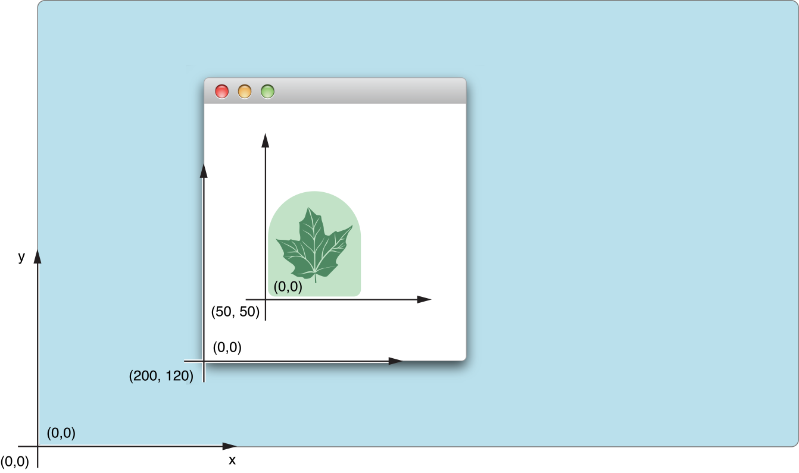
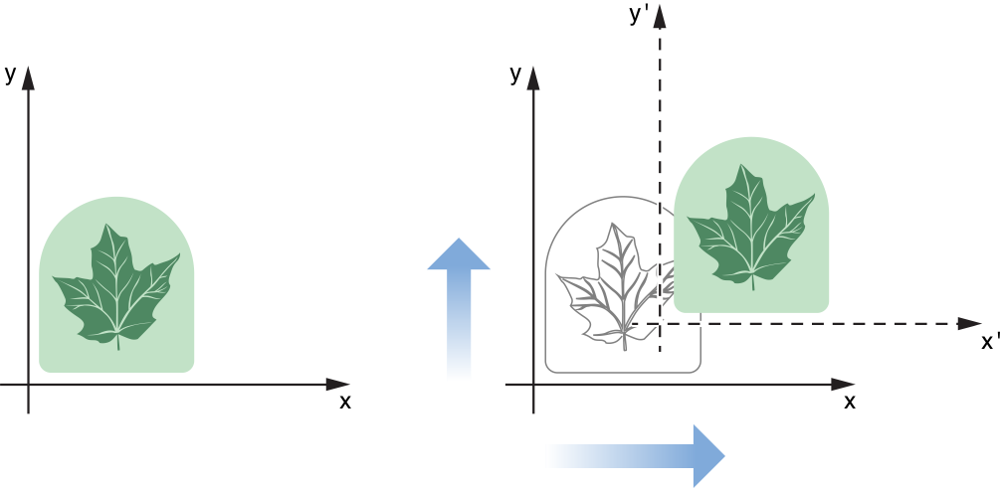
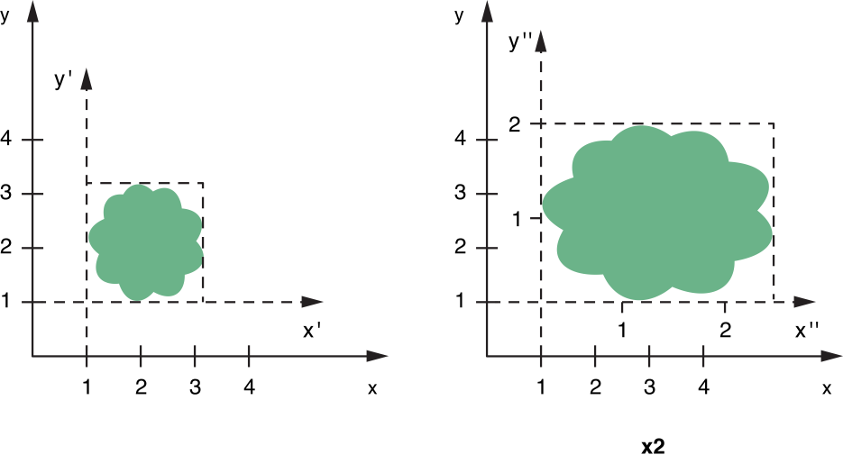
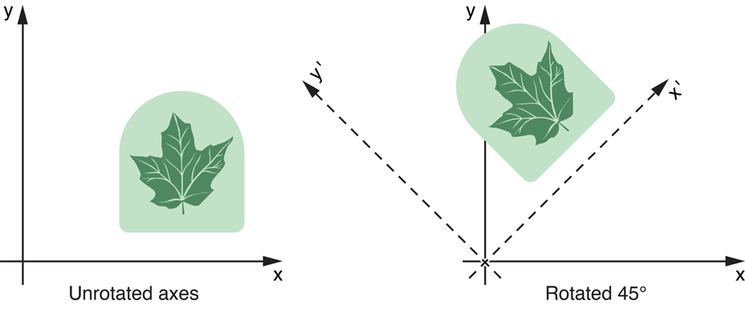
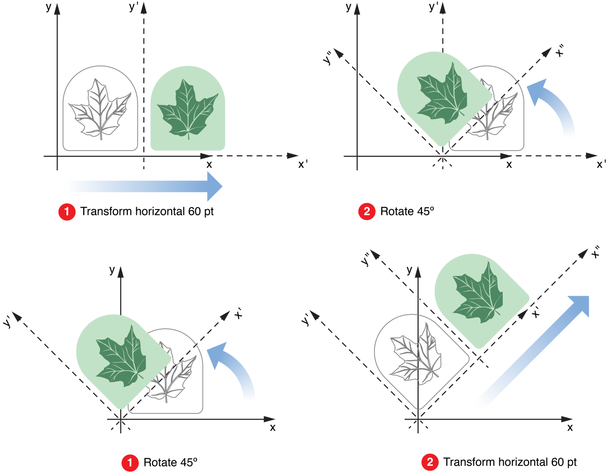
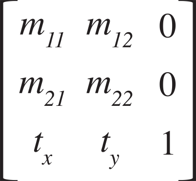
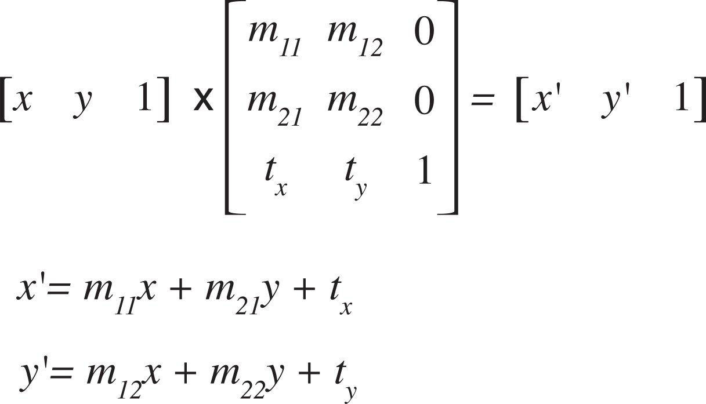
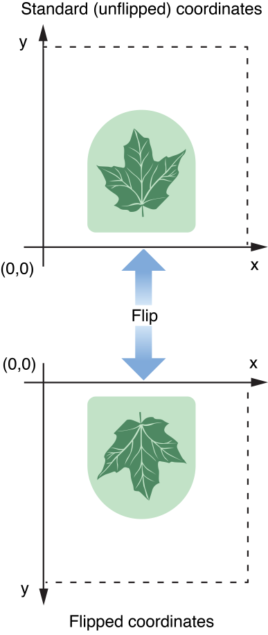
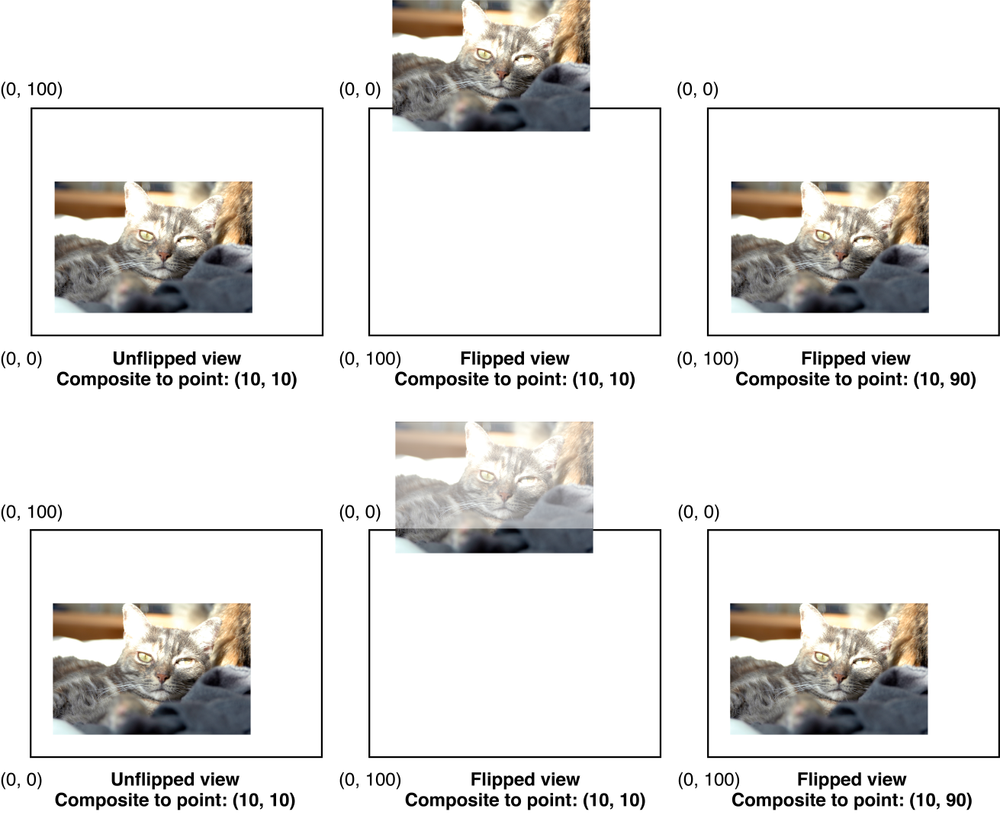

> 导航：[总目录](../../../README.md) · [documentation](../../../_indexes/documentation.md) · [Cocoa Drawing Guide](Introduction%20to%20Cocoa%20Drawing%20Guide.md)


[Next](Color%20and%20Transparency.md)[Previous](Graphics%20Contexts.md)

# Coordinate Systems and Transforms

Coordinate spaces simplify the drawing code required to create complex interfaces. In a standard Mac app, the window represents the base coordinate system for drawing, and all content must eventually be specified in that coordinate space when it is sent to the window server. For even simple interfaces, however, it is rarely convenient to specify coordinates relative to the window origin. Even the location of fixed items can change and require recalculation when the window resizes. This is where Cocoa makes things simple.

Each Cocoa view you add to a window maintains its own local coordinate system for drawing. Rather than convert coordinate values to window coordinates, you simply draw using the local coordinate system, ignoring any changes to the position of the view. Before sending your drawing commands to the window server, Cocoa automatically corrects coordinate values and puts them in the base coordinate space.

Even with the presence of local coordinate spaces, it is often necessary to change the coordinate space temporarily to affect certain behaviors. Changing the coordinate space is done using mathematical transformations (also known as transforms). Transforms convert coordinate values from one coordinate space to another. You can use transforms to alter the coordinate system of a view in a way that affects subsequent rendering calls, or you can use them to determine the location of points in the window or another view.

The following sections provide information about how Cocoa manages the local coordinate systems of your views and how you can use transforms to affect your drawing environment.

Cocoa and Quartz use the same base coordinate system model. Before you can draw effectively, you need to understand this coordinate space and how it affects your drawing commands. It also helps to know the ways in which you can modify the coordinate space to simplify your drawing code.

Cocoa uses a Cartesian coordinate system as its basic model for specifying coordinates. The origin in this system is located in the lower-left corner of the current drawing space, with positive values extending along the axes up and to the right of the origin point. The root origin for the entire system is located in the lower-left corner of the screen containing the menu bar.

If you were forced to draw all your content in _screen coordinates_—the coordinate system whose origin is located at the lower-left corner of the computer’s primary screen—your code would be quite complex. To simplify things, Cocoa sets up a local coordinate system whose origin is equal to the origin of the window or view that is about to draw. Subsequent drawing calls inside the window or view take place relative to this local coordinate system. Once the code finishes drawing, Cocoa and the underlying graphics system convert coordinates in the local coordinates back to screen coordinates so that the content can be composited with content from other applications and sent to the graphics hardware.

Figure 3-1 shows the coordinate-system origin points of the screen, a window, and a view. In each case, the value to the bottom-left of each point is the coordinate measured in its parent coordinate system. (The screen does not have a parent coordinate system, so both coordinate values are 0). The window’s parent is the screen and the view’s parent is the window.

__Figure 3-1__  Screen, window, and view coordinate systems on the screen



Mapping from screen coordinates to local window or view coordinates takes place in the current transformation matrix (CTM) of the Cocoa graphics context object. Cocoa applies the CTM automatically to any drawing calls you make, so you do not need to convert coordinate values yourself. You can modify the CTM though to change the position and orientation of the coordinate axes inside your view. (For more information, see [Transformation Operations](#apple-f4xwc4dqnrsv64tfmyxwi33df52wszbpkridimbqgazteojqfvbuqmrqgqwueq2ji5cuuscf).)

The drawing system in OS X is based on a PDF drawing model, which is a vector-based drawing model. Compared to a raster-based drawing model, where drawing commands operate on individual pixels, drawing commands in OS X are specified using a fixed-scale drawing space, known as the user coordinate space. The system then maps the coordinates in this drawing space onto the actual pixels of the corresponding target device, such as a monitor or printer. The advantage of this model is that graphics drawn using vector commands scale nicely to any resolution device. As the device resolution increases, the system is able to use any extra pixels to create a crisper look to the graphics.

In order to maintain the precision inherent with a vector-based drawing system, drawing coordinates are specified using floating-point values instead of integers. The use of floating-point values for OS X coordinates makes it possible for you to specify the location of your program's content very precisely. For the most part, you do not have to worry about how those values are eventually mapped to the screen or other output device. Instead, Cocoa takes care of this mapping for you.

Even though the drawing model is based on PDF, there are still times when you need to render pixel-based content. Bitmap images are a common way to create user interfaces, and your drawing code may need to make special adjustments to ensure that any bitmap images are drawn correctly on different resolution devices. Similarly, you may want to ensure that even your vector-based graphics align properly along pixel boundaries so that they do not have an anti-aliased appearance. OS X provides numerous facilities to help you draw pixel-based content the way you want it.

The following sections provide more detail about the coordinate spaces used for drawing and rendering content. There also follows some tips on how to deal with pixel-specific rendering in your drawing code.

The user coordinate space in Cocoa is the environment you use for all your drawing commands. It represents a fixed scale coordinate space, which means that the drawing commands you issue in this space result in graphics whose size is consistent regardless of the resolution of the underlying device.

Units in the user space are based on the printer's point, which was used in the publishing industry to measure the size of content on the printed page. A single _point_ is equivalent to 1/72 of an inch. Points were adopted by earlier versions of Mac OS as the standard resolution for content on the screen. OS X continues to use the same effective “resolution” for user-space drawing.

Although a single point often corresponded directly to a pixel in the past, in OS X, that may not be the case. Points are not tied to the resolution of any particular device. If you draw a rectangle whose width and height are exactly three points, that does not mean it will be rendered on the screen as a three-pixel by three-pixel rectangle. On a 144 dpi screen, the rectangle might be rendered using six pixels per side, and on a 600-dpi printer, the rectangle would require 25 pixels per side. The actual translation from points to pixels is device dependent and handled for you automatically by OS X.

For all practical purposes, the user coordinate space is the only coordinate space you need to think about. There are some exceptions to this rule, however, and those are covered in [Doing Pixel-Exact Drawing](#apple-f4xwc4dqnrsv64tfmyxwi33df52wszbpkridimbqgazteojqfvbuqmrqgqwueq2jineuuqkk).

The device coordinate space refers to the native coordinate space used by the target device, whether it be a screen, printer, file, or some other device. Units in the device coordinate space are specified using pixels and the resolution of this space is device dependent. For example, most monitors have resolutions in the 100 dpi range but printers may have resolutions exceeding 600 dpi. There are some devices that do not have a fixed resolution, however. For example, PDF and EPS files are resolution independent and can scale their content to any resolution.

For Cocoa users, the device coordinate space is something you rarely have to worry about. Whenever you generate drawing commands, you always specify positions using user space coordinates. The only time that you might need to know about device space coordinates is when you are adjusting your drawn content to map more cleanly to a specific target device. For example, you might use device coordinates to align a path or image to specific pixel boundaries in order to prevent unwanted anti-aliasing. In such a situation, you can adjust your user space coordinates based on the resolution of the underlying device. For information on how to do this, see [Doing Pixel-Exact Drawing](#apple-f4xwc4dqnrsv64tfmyxwi33df52wszbpkridimbqgazteojqfvbuqmrqgqwueq2jineuuqkk)

In OS X v10.4 and earlier, Quartz and Cocoa always treated screen devices as if their resolution were always 72 dpi, regardless of their actual resolution. This meant that for screen-based drawing, one point in user space was always equal to one pixel in device space. As screens advanced well past 100 dpi in resolution, the assumption that one point equaled one pixel began to cause problems. Most noticeably, everything became much smaller. In OS X v10.4, the first steps at decoupling the point-pixel relationship took place.

In OS X v10.4, support was added for resolution independence in application user interfaces. The initial implementation of this feature provides a way for you to decouple your application’s user space from the underlying device space manually. You do this by choosing a scale factor for your user interface. The scale factor causes user space content to be scaled by the specified amount. Code that is implemented properly for resolution independence should look fine (albeit bigger). Code that is not implemented properly may see alignment problems or pixel cracks along shape boundaries. To enable resolution independence in your application, launch Quartz Debug and choose Tools > Show User Interface Resolution, then set your scale factor. After changing the resolution, relaunch your application to see how it responds to the new resolution.

For the most part, Cocoa applications should not have to do anything special to handle resolution-independent UI. If you use the standard Cocoa views and drawing commands to draw your content, Cocoa automatically scales any content you draw using the current scale factor. For path-based content, your drawing code should require little or no changes. For images, though, you may need to take steps to make sure those images look good at higher scale factors. For example, you might need to create higher-resolution versions to take advantage of the increased screen resolution. You might also need to adjust the position of images to avoid pixel cracks caused by images being drawn on non-integral pixel boundaries.

For tips on how to make sure your content draws well at any resolution, see [Doing Pixel-Exact Drawing](#apple-f4xwc4dqnrsv64tfmyxwi33df52wszbpkridimbqgazteojqfvbuqmrqgqwueq2jineuuqkk). For more information about resolution independence and how it affects your code, see _[High Resolution Guidelines for OS X](../../Graphics%20Animation/High%20Resolution%20Guidelines%20for%20OS%20X/About%20High%20Resolution%20for%20OS%20X.md#apple-f4xwc4dqnrsv64tfmyxwi33df52wszbpkridimbqgezdgmbs)_.

Transforms are a tool for manipulating coordinates (and coordinate systems) quickly and easily in your code. Consider a rectangle whose origin is at (0, 0). If you wanted to change the origin of this rectangle to (10, 3), it would be fairly simple to modify the rectangle’s origin and draw it. Suppose, though, that you wanted to change the origin of a complex path that incorporated dozens of points and several Bezier curves with their associated control points. How easy would it be to recalculate the position of each point in that path? It would probably take a lot of time and require some pretty sophisticated calculations. Enter transforms.

A transform is two-dimensional mathematical array used to map points from one coordinate space to another. Using transforms, you can scale, rotate, and translate content freely in two-dimensional space using only a few methods and undo your changes just as quickly.

Support for transforms in Cocoa is provided by the [NSAffineTransform](https://developer.apple.com/documentation/foundation/nsaffinetransform) class. The following sections provide background information about transforms and their effects. For additional information about how to use transforms in your code, see [Using Transforms in Your Code](#apple-f4xwc4dqnrsv64tfmyxwi33df52wszbpkridimbqgazteojqfvbuqmrqgqwueq2jjffeoqkh).

The simplest type of transform is the identity transform. An identity transform maps any point to itself—that is, it does not transform the point at all. You always start with an identity transform and add transformations to it. Starting with the identity transform guarantees that you start from a known state. To create an identity transform, you would use the following code:

```
NSAffineTransform* identityXform = [NSAffineTransform transform];
```


For two-dimensional drawing, you can transform content in several different ways, including translating, scaling, and rotating. Transforms modify the coordinate system for the current drawing environment and affect all subsequent drawing operations. Before applying a transform, it is recommended that you save the current graphics state.

The following sections describe each type of transformation and how it affects rendered content.

Translation involves shifting the origin of the current coordinate system horizontally and vertically by a specific amount. Translation is probably used the most because it can be used to position graphic elements in the current view. For example, if you create a path whose starting point is always (0, 0), you could use a translation transform to move that path around your view, as shown in Figure 3-2.

__Figure 3-2__  Translating content



To translate content, use the [translateXBy:yBy:](https://developer.apple.com/documentation/foundation/nsaffinetransform/1417196-translatexby) method of `NSAffineTransform`. The following example changes the origin of the current context from (0, 0) to (50, 20) in the view's coordinate space:

```
NSAffineTransform* xform = [NSAffineTransform transform];
[xform translateXBy:50.0 yBy:20.0];
[xform concat];
```


Scaling lets you stretch or shrink the units of the user space along the x and y axes independently. Normally, one unit in user space is equal to 1/72 of an inch. If you multiple the scale of either axis by 2, one unit on that axis becomes equal to 2/72 of an inch. This makes content drawn with scale factors greater than 1 appear magnified and content drawn with scale factors less than 1 appear shrunken.

Figure 3-3 shows the effects of scaling on content. In the figure, a translation transform has already been applied so that the origin is located at (1, 1) in the original user space coordinate system. After applying the scaling transform, you can see the modified coordinate system and how it maps to the original coordinate system.

__Figure 3-3__  Scaling content



Although you might normally scale proportionally by applying the same scale factor to both the horizontal and vertical axes, you can assign different scale factors to each axis to create a stretched or distorted image. To scale content proportionally, use the [scaleBy:](https://developer.apple.com/documentation/foundation/nsaffinetransform/1413649-scaleby) method of `NSAffineTransform`. To scale content differently along the X and Y axes, use the [scaleXBy:yBy:](https://developer.apple.com/documentation/foundation/nsaffinetransform/1411806-scalexby) method. The following example demonstrates the scale factors shown in Figure 3-3:

```
NSAffineTransform* xform = [NSAffineTransform transform];
[xform scaleXBy:2.0 yBy:1.5];
[xform concat];
```


Rotation changes the orientation of the coordinate axes by rotating them around the current origin, as shown in Figure 3-4. You can change the orientation through a full circle of motion.

__Figure 3-4__  Rotated content



To rotate content, use the [rotateByDegrees:](https://developer.apple.com/documentation/foundation/nsaffinetransform/1407401-rotatebydegrees) or [rotateByRadians:](https://developer.apple.com/documentation/foundation/nsaffinetransform/1411353-rotate) methods of `NSAffineTransform`. Positive rotation values proceed counterclockwise around the current origin. For example, to rotate the current coordinate system 45 degrees around the current origin point (as shown in Figure 3-4), you would use the following code:

```
NSAffineTransform* xform = [NSAffineTransform transform];
[xform rotateByDegrees:45];
[xform concat];
```


The implementation of transforms uses matrix multiplication to map an incoming coordinate point to a modified coordinate space. Although the mathematics of matrices are covered in [Transform Mathematics](#apple-f4xwc4dqnrsv64tfmyxwi33df52wszbpkridimbqgazteojqfvbuqmrqgqwueq2jjfeugssj), an important factor to note is that matrix multiplication is not always a commutative operation—that is, `a` times `b` does not always equal `b` times `a`. Therefore, the order in which you apply transforms is often crucial to achieving the desired results.

Figure 3-5 shows the two transformations applied to a path in two different ways. In the top part of the figure, the content is translated by 60 points along the X axis and then rotated 45 degrees. In the bottom part of the figure, the exact same transformations are reversed with the rotation preceding the translation. The end result is two different coordinate systems.

__Figure 3-5__  Transform ordering



The preceding figure demonstrates the key aspect of transformation ordering. Each successive transformation is applied to the coordinate system created by the previous transformations. When you translate and then rotate, the rotation begins around the origin of the translated coordinate system. Similarly, when you rotate and then translate, the translation occurs along the axes of the rotated coordinate system.

For transformations of the same type, the order of the transformations does not matter. For example, three rotations in a row creates a coordinate system whose final rotation is equal to the final sum of the three rotation angles. There may be other cases (such as scaling by 1.0) where the order of the transforms does not matter, but you should generally assume that order is significant.

All transform operations contribute to the building of a mathematical matrix that is then used by the graphics system to compute the screen location of individual points. The [NSAffineTransform](https://developer.apple.com/documentation/foundation/nsaffinetransform) class uses a 3 x 3 matrix to store the transform values. Figure 3-6 shows this matrix and identifies the key factors used to apply transforms. The _m11_, _m12_, _m21_, and _m22_ values control both the scaling and rotation factors while tx and ty control translation.

__Figure 3-6__  Basic transformation matrix



Using linear algebra, it is possible to multiply a coordinate vector through the transform matrix to obtain a new coordinate vector whose position is equal to the original point in the new coordinate system. Figure 3-7 shows the matrix multiplication process and the resulting linear equations.

__Figure 3-7__  Mathematical conversion of coordinates



If you are already familiar with transform structures and the mathematics, you can set the values of a transform matrix directly using the [setTransformStruct:](https://developer.apple.com/documentation/foundation/nsaffinetransform/1414485-transformstruct) method of `NSAffineTransform`. This method replaces the six key transform values with the new ones you specify. Replacing all of the values at once is much faster than applying individual transformations one at a time. It does require you to precompute the matrix values, however.

For more information about the mathematics behind matrix multiplications, see _[Quartz 2D Programming Guide](../../Graphics%20Imaging/Quartz%202D%20Programming%20Guide/Introduction.md#apple-f4xwc4dqnrsv64tfmyxwi33df52wszbpkridgmbqgaytanrw)_.

When it is time to draw, the code in your view’s `drawRect:` method must determine where to draw individual pieces of content. The position of some elements, such as images and rectangles, can be specified easily, but for complex elements like paths, transforms are an easy way to change the current drawing location.

To create a new transform object, call the [transform](https://developer.apple.com/documentation/foundation/nsaffinetransform/1589057-transform) class method of `NSAffineTransform`. The returned transform object is set to the identity transform automatically. After you have added all of the desired transformations to the transform object, you call the `concat` method to apply them to the current context. Calling [concat](https://developer.apple.com/documentation/foundation/nsaffinetransform/1462135-concat) adds your transformations to the CTM of the current graphics context. The modifications stay in effect until you explicitly undo them, as described in [Undoing a Transformation](#apple-f4xwc4dqnrsv64tfmyxwi33df52wszbpkridimbqgazteojqfvbuqmrqgqwueq2jjjduiqkb), or a previous graphics state is restored.

The following example creates a new transform object and adds several transformations to it.

```
NSAffineTransform* xform = [NSAffineTransform transform];

// Add the transformations
[xform translateXBy:50.0 yBy:20.0];
[xform rotateByDegrees:90.0]; // counterclockwise rotation
[xform scaleXBy:1.0 yBy:2.0];

// Apply the changes
[xform concat];
```


Once applied, a transform affects all subsequent drawing calls in the current context. To undo a set of transformations, you can either restore a previous graphics state or apply an inverse transform. Both techniques have their advantages and disadvantages, so you should choose a technique based on your needs and the available information.

Restoring a previous graphics state is the simplest way to undo a transformation but has other side effects. In addition to undoing the transform, restoring the graphics state reverts all other attributes in the current drawing environment back to their previous state.

If you want to undo only the current transformation, you can add an inverse transform to the CTM. An inverse transform negates the effects of a given set of transformations using a complementary set of transformations. To create an inverse transform object, you use the [invert](https://developer.apple.com/documentation/foundation/nsaffinetransform/1412434-invert) method of the desired transform object. You then apply this modified transform object to the current context, as shown in the following example:

```
NSAffineTransform* xform = [NSAffineTransform transform];

// Add the transformations
[xform translateXBy:50.0 yBy:20.0];
[xform rotateByDegrees:90.0]; // counterclockwise rotation
[xform concat];

// Draw content...

// Remove the transformations by applying the inverse transform.
[xform invert];
[xform concat];
```

You might use this latter technique to draw multiple items using the same drawing attributes but at different positions in your view. Depending on the type of transformations you use, you might also be able to do incremental transformations. For example, if you are calling [translateXBy:yBy:](https://developer.apple.com/documentation/foundation/nsaffinetransform/1417196-translatexby) only to reposition the origin, you could move the origin incrementally for each successive item. The following example, shows how you might position one item at (10, 10) and the next at (15, 10):

```
[NSAffineTransform* xform = [NSAffineTransform transform];
// Draw item 1
[xform translateXBy:10.0 yBy:10.0];
[xform concat];
[item1 draw];

//Draw item 2
[xform translateXBy:5.0 yBy:0.0]; // Translate relative to the previous  element.
[xform concat];
[item2 draw];
```

Remember that the preceding techniques are used in cases where you do not want to modify your original items directly. Cocoa provides ways to modify geometric coordinates without modifying the current transformation matrix. For more information, see [Transforming Coordinates](#apple-f4xwc4dqnrsv64tfmyxwi33df52wszbpkridimbqgazteojqfvbuqmrqgqwueq2jjjceiqsb).

It is also worth noting that the effectiveness of an inverse transform is limited by mathematical precision. For rotation transforms, which involve taking sines and cosines of the desired rotation angle, an inverse transform may not be precise enough to undo the original rotation completely. In such a situation, you may want to simply save and restore the graphics state to undo the transform.

If you do not want to change the coordinate system of the current drawing environment, but do want to change the position or orientation of a single object, you have several options. The [NSAffineTransform](https://developer.apple.com/documentation/foundation/nsaffinetransform) class includes the [transformPoint:](https://developer.apple.com/documentation/foundation/nsaffinetransform/1411619-transformpoint) and [transformSize:](https://developer.apple.com/documentation/foundation/nsaffinetransform/1416692-transform) methods for changing coordinate values directly. Using these methods does not change the CTM of the current graphics context.

If you want to alter the coordinates in a path, you can do so using the [transformBezierPath:](https://developer.apple.com/documentation/foundation/nsaffinetransform/1462131-transform) method of `NSAffineTransform`. This method returns a transformed copy of the specified Bezier path object. This method differs slightly from the [transformUsingAffineTransform:](https://developer.apple.com/documentation/appkit/nsbezierpath/1520635-transform) method of `NSBezierPath`, which modifies the original object.

Events sent to your view by the operating system are sent using the coordinate system of the window. Before your view can use any coordinate values included with the event, it must convert those coordinates to its own local coordinate space. The `NSView` class provides several functions to facilitate the conversion of [NSPoint](https://developer.apple.com/library/archive/documentation/LegacyTechnologies/WebObjects/WebObjects_3.5/Reference/Frameworks/ObjC/Foundation/TypesAndConstants/FoundationTypesConstants/Description.html#//apple_ref/c/tdef/NSPoint), [NSSize](https://developer.apple.com/library/archive/documentation/LegacyTechnologies/WebObjects/WebObjects_3.5/Reference/Frameworks/ObjC/Foundation/TypesAndConstants/FoundationTypesConstants/Description.html#//apple_ref/c/tdef/NSSize), and [NSRect](https://developer.apple.com/library/archive/documentation/LegacyTechnologies/WebObjects/WebObjects_3.5/Reference/Frameworks/ObjC/Foundation/TypesAndConstants/FoundationTypesConstants/Description.html#//apple_ref/c/tdef/NSRect) structures. Among these methods are [convertPoint:fromView:](https://developer.apple.com/documentation/appkit/nsview/1483269-convertpoint) and [convertPoint:toView:](https://developer.apple.com/documentation/appkit/nsview/1483406-convertpoint), which convert points to and from the view’s local coordinate system. For a complete list of conversion methods, see _[NSView Class Reference](https://developer.apple.com/documentation/appkit/nsview)_.

The following example converts the mouse location of a mouse event from window coordinates to the coordinates of the local view. To convert to the view’s local coordinate space, you use the `convertPoint:fromView:` method. The second parameter to this method specifies the view in whose coordinate system the point is currently specified. Specifying `nil` for the second parameter tells the current view to convert the point from the window’s coordinate system.

```
NSPoint  mouseLoc = [theView convertPoint:[theEvent locationInWindow] fromView:nil];
```


One topic that comes up frequently in Cocoa and Quartz is the use of flipped coordinate systems for drawing. By default, Cocoa uses a standard Cartesian coordinate system, where positive values extend up and to the right of the origin. It is possible, however, to “flip” the coordinate system, so that positive values extend down and to the right of the origin and the origin itself is positioned in the top-left corner of the current view or window, as shown in Figure 3-8.

__Figure 3-8__  Normal and flipped coordinate axes



Flipping the coordinate system can make drawing easier in some situations. Text systems in particular use flipped coordinates to simplify the placement of text lines, which flow from top to bottom in most writing systems. Although you are encouraged to use the standard Cartesian (unflipped) coordinate system whenever possible, you can use flipped coordinates if doing so is easier to support in your code.

Configuring a view to use flipped coordinates affects only the content you draw directly in that view. Flipped coordinate systems are not inherited by child views. The content you draw in a view, however, must be oriented correctly based on the current orientation of the view. Failing to take into account the current view orientation may result in incorrectly positioned content or content that is upside down.

The following sections provide information about Cocoa support for flipped coordinates and some of the issues you may encounter when using flipped coordinate systems. Wherever possible, these sections also offer guidance on how to solve issues that arise due to flipped coordinate systems.

The first step you need to take to implement flipped coordinates is to decide the default orientation of your view. If you prefer to use flipped coordinates, there are two ways to configure your view’s coordinate system prior to drawing:

- Override your view’s [isFlipped](https://developer.apple.com/documentation/appkit/nsview/1483532-isflipped) method and return `YES`.
- Apply a flip transform to your content immediately prior to rendering.

If you plan to draw all of your view’s content using flipped coordinates, overriding the view’s `isFlipped` method is by far the preferred option. Overriding this method lets Cocoa know that your view wants to use flipped coordinates by default. When a view’s `isFlipped` method returns `YES`, Cocoa automatically makes several adjustments for you. The most noticeable change is that Cocoa adds the appropriate conversion transform to the CTM before calling your view’s `drawRect:` method. This behavior eliminates the need for your drawing code to apply a flip transform manually. In addition, many Cocoa objects automatically adjust their drawing code to account for the coordinate system of the current view. For example, the `NSFont` object automatically takes the orientation of the coordinate system into account when setting the current font. This prevents text from appearing upside down when drawn in your view.

If you draw only a subset of your view’s content using flipped coordinates, you can use a flip transform (instead of overriding `isFlipped`) to modify the coordinate system manually. A flip transform lets you adjust the current coordinate system temporarily and then undo that adjustment when it is no longer needed. You would apply this transform to your view’s coordinate system immediately prior to drawing the relevant flipped content. For information on how to create a flip transform, see [Creating a Flip Transform](#apple-f4xwc4dqnrsv64tfmyxwi33df52wszbpkridimbqgazteojqfvbuqmrqgqwueq2jjbcecskk).

Most of the work you do to support flipped coordinates occurs within your application’s drawing code. If you chose to use flipped coordinates in a particular view, chances are it was because it made your drawing code easier to implement. Drawing in a flipped coordinate system requires you to position elements differently relative to the screen but is otherwise fairly straightforward. The following sections provide some tips to help you ensure any rendered content appears the way you want it.

There are no real issues with drawing shape primitives in flipped coordinate systems. Shape primitives, such as rectangles, ovals, arcs, and Bezier curves can be drawn just as easily in flipped or unflipped coordinate systems. The only differences between the two coordinate systems is where the shapes are positioned and their vertical orientation. Laying out your shapes in advance to determine their coordinate points should solve any orientation issues you encounter.

The Application Kit framework contains numerous functions for quickly drawing specific content. Among these functions are [NSRectFill](https://developer.apple.com/documentation/appkit/1473652-nsrectfill), [NSFrameRect](https://developer.apple.com/documentation/appkit/1473582-nsframerect), [NSDrawGroove](https://developer.apple.com/documentation/appkit/1473644-nsdrawgroove), [NSDrawLightBezel](https://developer.apple.com/documentation/appkit/1473680-nsdrawlightbezel), and so on. When drawing with these functions, Cocoa takes into account the orientation of the target view. Thus, if your view uses flipped coordinates, these functions continue to render correctly in that flipped coordinate space.

When rendering images in your custom views, you must pay attention to the relative orientation of your view and any images you draw in that view. If you draw an image in a flipped view using the [drawInRect:fromRect:operation:fraction:](https://developer.apple.com/documentation/appkit/nsimage/1520067-drawinrect) method, your image would appear upside down in your view. You could fix this problem using one of several techniques:

- You could apply a flip transform immediately prior to drawing the image; see [Creating a Flip Transform](#apple-f4xwc4dqnrsv64tfmyxwi33df52wszbpkridimbqgazteojqfvbuqmrqgqwueq2jjbcecskk).
- You could use one of the `compositeToPoint` methods of [NSImage](https://developer.apple.com/documentation/appkit/nsimage) to do the drawing.
- You could invert the image data itself. (Although a suitable fix, this is usually not very practical.)

Using a flip transform to negate the effects of a flipped view ensures that your image contents are rendered correctly in all cases. This technique retains any previous transformations to the coordinate system, including scales and rotations, but removes the inversion caused by the view being flipped. You should especially use this technique if you needed to draw your image using the `drawInRect:fromRect:operation:fraction:` method of `NSImage`. This method lets you scale your image to fit the destination rectangle and is one of the more commonly used drawing methods for images.

Although the `compositeToPoint` methods of `NSImage` provide you with a way to orient images properly without a flip transform, their use is not recommended. There are some side effects that make drawing with these methods more complicated. The `compositeToPoint` methods work by removing any custom scaling or rotation factors that you applied to the CTM. These methods also remove any scaling (but not translations) applied by any flip transforms, whether the transform was supplied by you or by Cocoa. (The methods also do not remove the scale factor in effect from resolution independence.) Any custom translation factors you applied to the CTM are retained, however. Although this behavior is designed to ensure that images are not clipped by your view’s bounding rectangle, if you do not compensate for the flip transform’s translation factor, clipping may still occur.

Figure 3-9 shows what happens when you render an image in an unflipped view, and then in a flipped view, using the [compositeToPoint:fromRect:operation:](https://developer.apple.com/documentation/appkit/nsimage/1520046-compositetopoint) method. In the unflipped view, the image renders as expected at the specified point in the view. In the flipped view, the scale factor for the y-axis is removed but the translation factor is not, which results in the image being clipped because it appears partially outside the view’s visible bounds. To compensate, you would need to adjust the y-origin of the image by subtracting the original value from the view height to get the adjusted position.

__Figure 3-9__  Compositing an image to a flipped view



The issues related to the drawing of images in a flipped coordinate system are essentially independent of how you create those images in the first place. Images use a separate coordinate system internally to orient the image data. Whether you load the image data from an existing file or create the image by locking focus on it, once the image data is loaded or you unlock focus, the image data is set. At that point, you must choose the appropriate drawing method or adjust the coordinate system yourself prior to drawing to correct for flipped orientation issues.

For more information about images and their internal coordinate systems, see [Image Coordinate Systems](Images.md#apple-f4xwc4dqnrsv64tfmyxwi33df52wszbpkridimbqgazteojqfvbuqmrqhawueq2jijbuqqsb).

The text rendering facilities in Cocoa take their cues for text orientation from the current view. If your view’s [isFlipped](https://developer.apple.com/documentation/appkit/nsview/1483532-isflipped) method returns `YES`, Cocoa automatically inverts the text drawn in that view to compensate for its flipped coordinate system. If you apply a flip transform manually from your drawing code, however, Cocoa does not know to compensate when drawing text. Any text you render after applying a flip transform manually therefore appears upside down in your view. These rules apply whether you are using the Cocoa text system or the drawing facilities of `NSString` to draw your text.

If you lock focus on an image and draw some text into it, Cocoa uses the internal coordinate system of the `NSImage` object to determine the correct orientation for the text. As with other image content, if you subsequently render the image in a flipped view, the text you drew is flipped along with the rest of the image data.

For more information about working with text, see [Text](Text.md#apple-f4xwc4dqnrsv64tfmyxwi33df52wszbpkridimbqgazteojqfvbuqmrqhewueq2jivcusr2d).

If you want to flip the coordinate system of your view temporarily, you can create a flip transform and apply it to the current graphics context. A flip transform is an [NSAffineTransform](https://developer.apple.com/documentation/foundation/nsaffinetransform) object configured with two transformations: a scale transformation and a translate transformation. The flip transform works by flipping the direction of the y axis (using the scale transformation) and then translating the origin to the top of the view.

Listing 3-1 shows a `drawRect:` method that creates a flip transform and applies it to the current context. The flip transform shown here translates the origin first before reversing the direction of the vertical axis. You could also implement this transform by reversing the vertical axis first and then translating the origin in the negative direction—that is, using the negated value of the frame height.

__Listing 3-1__  Flipping the coordinate system manually

```objc
- (void)drawRect:(NSRect)rect
{
    NSRect frameRect = [self bounds];
    NSAffineTransform* xform = [NSAffineTransform transform];
    [xform translateXBy:0.0 yBy:frameRect.size.height];
    [xform scaleXBy:1.0 yBy:-1.0];
    [xform concat];

    // Draw flipped content.
}
```

The flip transform merely toggles the orientation of the current coordinate system. If your view already draws using flipped coordinates, because its [isFlipped](https://developer.apple.com/documentation/appkit/nsview/1483532-isflipped) method returns `YES`, applying a flip transform reverts the coordinate system back to the standard orientation.

Some Cocoa classes inherently support flipped coordinates and some do not. If you are using unmodified Cocoa views and controls in your user interface, it should not matter to your code whether those views and controls use flipped coordinates. If you are subclassing, however, it is important to know the coordinate system orientation. The following controls and views currently use flipped coordinates by default:

- [NSButton](https://developer.apple.com/documentation/appkit/nsbutton)
- [NSMatrix](https://developer.apple.com/documentation/appkit/nsmatrix)
- [NSProgressIndicator](https://developer.apple.com/documentation/appkit/nsprogressindicator)
- [NSScrollView](https://developer.apple.com/documentation/appkit/nsscrollview)
- [NSSlider](https://developer.apple.com/documentation/appkit/nsslider)
- [NSSplitView](https://developer.apple.com/documentation/appkit/nssplitview)
- [NSTabView](https://developer.apple.com/documentation/appkit/nstabview)
- [NSTableHeaderView](https://developer.apple.com/documentation/appkit/nstableheaderview)
- [NSTableView](https://developer.apple.com/documentation/appkit/nstableview)
- [NSTextField](https://developer.apple.com/documentation/appkit/nstextfield)
- [NSTextView](https://developer.apple.com/documentation/appkit/nstextview)

Some Cocoa classes support flipped coordinates but do not use them all the time. The following list includes the known cases where flipped-coordinate support depends on other mitigating factors.

- Images do not use flipped coordinates by default; however, you can flip the image’s internal coordinate system manually using the [setFlipped:](https://developer.apple.com/documentation/appkit/nsimage/1520044-setflipped) method of `NSImage`. All representations of an `NSImage` object use the same orientation. For more information about images and flipped coordinates, see [Image Coordinate Systems](Images.md#apple-f4xwc4dqnrsv64tfmyxwi33df52wszbpkridimbqgazteojqfvbuqmrqhawueq2jijbuqqsb).
- The Cocoa text system takes cues from the current context to determine whether text should be flipped. If the text is to be displayed in an `NSTextView` object, text system objects (such as `NSFont`) also uses flipped coordinates to ensure that text is rendered right-side up. If you are drawing text in a custom view that uses standard coordinate, the text system objects do not use flipped coordinates.
- An [NSClipView](https://developer.apple.com/documentation/appkit/nsclipview) object determines whether to use flipped coordinates by looking at the coordinate system of its document view. If the document view uses flipped coordinates, so does the clip view. Using the same coordinate system ensures that the scroll origin matches the bounds origin of the document view.
- Graphics convenience functions, such as those declared in `NSGraphics.h`, take flipped coordinate systems into account when drawing. For information about the available graphics convenience functions, see _[Application Kit Functions Reference](https://developer.apple.com/documentation/appkit/functions)_.

As new controls and views are introduced in Cocoa, those objects may also support flipped coordinates. Check the class reference documentation for any subclassing notes on whether a class supports flipped coordinates. You can also invoke the view’s [isFlipped](https://developer.apple.com/documentation/appkit/nsview/1483532-isflipped) method at runtime to determine if it uses flipped coordinates.

Although it is possible to create applications using only the views, controls, and images provided by Cocoa, it is common for applications to use one or more custom views or images. And although Cocoa provides default behavior for laying out custom content, there are many times when you may want to adjust the position of individual views or images to avoid visual artifacts. This is especially true when tiling or drawing bitmap images on high-resolution devices (such as printers) or devices where resolution independent scale factors are in effect.

The following sections provide guidelines and practical advice for how to prevent visual artifacts that can occur during high-resolution drawing. For additional information on resolution independence and how to adapt your code to support different scale factors, see _[High Resolution Guidelines for OS X](../../Graphics%20Animation/High%20Resolution%20Guidelines%20for%20OS%20X/About%20High%20Resolution%20for%20OS%20X.md#apple-f4xwc4dqnrsv64tfmyxwi33df52wszbpkridimbqgezdgmbs)_.

Cocoa applications provide a tremendous amount of support for rendering to high-resolution devices. Although much of this support is automatic, you still need to do some work to ensure your content looks good. The following list includes some approaches to take when designing your interface:

- Use high-resolution images.
- During layout, make sure views and images are positioned on integral pixel boundaries.
- When creating tiled background images for custom controls, use the [NSDrawThreePartImage](https://developer.apple.com/documentation/appkit/1524633-nsdrawthreepartimage) and [NSDrawNinePartImage](https://developer.apple.com/documentation/appkit/1526394-nsdrawninepartimage) methods to draw your background rather than trying to draw it yourself.
- Use antialiased text rendering modes for non-integral scale factors and be sure to lay out your text views on pixel boundaries.
- Test your applications with non-integral scale factors such as 1.25 and 1.5. These factors tend to generate odd numbers of pixels, which can reveal potential pixel cracks.

If you are using OpenGL for drawing, you should also be aware that in OS X v10.5, the bounding rectangle of a view drawn into an [NSOpenGLContext](https://developer.apple.com/documentation/appkit/nsopenglcontext) is measured in pixels and not in points (as it is in non OpenGL situations). This support may change in the future, however, so OpenGL developers should be sure to convert coordinates directly using the coordinate conversion methods of [NSView](https://developer.apple.com/documentation/appkit/nsview). For example, the following conversion code for a view object is guaranteed to return the correct values needed by OpenGL.

```
NSSize boundsInPixelUnits = [self convertRect:[self bounds] toView:nil];
glViewport(0, 0, boundsInPixelUnits.size.width, boundsInPixelUnits.size.height);
```

For more information about resolution independence and how it affects rendered content, see _[High Resolution Guidelines for OS X](../../Graphics%20Animation/High%20Resolution%20Guidelines%20for%20OS%20X/About%20High%20Resolution%20for%20OS%20X.md#apple-f4xwc4dqnrsv64tfmyxwi33df52wszbpkridimbqgezdgmbs)_.

Knowing the current scale factor can help you make decisions about how best to render your content. The [NSWindow](https://developer.apple.com/documentation/appkit/nswindow) and [NSScreen](https://developer.apple.com/documentation/appkit/nsscreen) classes both include a `userSpaceScaleFactor` method that you can call to obtain the current scale factor, if any, for your application. In OS X v10.5 and earlier, this method usually returns 1.0, indicating that the user space and device space have the same resolution (where one point equals one pixel). At some point though, this method may return a value that is greater than 1.0. For example, a value of 1.25 would indicate a screen resolution of approximately 90 dpi, while a value of 2.0 would indicate a screen resolution of 144 dpi.

If you want to know the actual resolution of a particular screen, the `NSScreen` class includes information about the display resolution in its device description dictionary (accessed using the [deviceDescription](https://developer.apple.com/documentation/appkit/nsscreen/1388360-devicedescription) method). You can use this information (instead of multiplying scale factors) to determine the appropriate resolution to use for your images.

Because screens are relatively low-resolution devices, drawing glitches are often more noticeable on a screen than they are on higher-resolution devices such as printers. Drawing glitches can occur when you render content in a way that requires tweaking to match the underlying pixels sent to the screen. For example, images and shapes drawn on non-pixel boundaries might require aliasing and therefore might appear less crisp than those drawn exactly on pixel boundaries. In addition, scaling an image to fit into a different-sized area requires interpolation, which can introduce artifacts and graininess.

Although pixel-alignment issues can occur on any version of OS X, they are more likely to occur as the operating system changes to support resolution independence. Under resolution independence, units in the user coordinate space and device coordinate space are no longer required to maintain a one-to-one relationship. For high-resolution screens, this means that a single unit in user space may be backed by multiple pixels in device space. So even if your user-space coordinates fall on integral unit boundaries, they may still be misaligned in device space. The presence of extra pixels can also lead to pixel cracks, which occur when misaligned shapes leave small gaps because they do not fill the intended drawing area entirely.

If your images or shapes are not drawing the way you expect, or if your graphics content displays evidence of pixel cracks, you can remove many of these issues by adjusting the coordinate values you use to draw your content. The following steps are not required if the current scale factor is 1.0 but would be required for other scale factors.

1. Convert the user-space point, size, or rectangle value to device space coordinates.
2. Normalize the value in device space so that it is aligned to the appropriate pixel boundary.
3. Convert the normalized value back to user space.
4. Draw your content using the adjusted value.

The best way to get the correct device-space rectangle is to use the [centerScanRect:](https://developer.apple.com/documentation/appkit/nsview/1483725-centerscanrect) method of `NSView`. This method takes a rectangle in user space coordinates, performs the needed calculations to adjust the position of rectangles based on the current scale factor and device, and returns the resulting user space rectangle. For layout, you can also use the methods described in [Converting Coordinate Values](#apple-f4xwc4dqnrsv64tfmyxwi33df52wszbpkridimbqgazteojqfvbuqmrqgqwvgvzsgu).

If you want more control over the precise layout of items in device space, you can also adjust coordinates yourself. OS X provides several functions for normalizing coordinate values once they are in device space, including the [NSIntegralRect](https://developer.apple.com/library/archive/documentation/LegacyTechnologies/WebObjects/WebObjects_3.5/Reference/Frameworks/ObjC/Foundation/Functions/FoundationFunctions/Description.html#//apple_ref/c/func/NSIntegralRect) and [CGRectIntegral](https://developer.apple.com/documentation/coregraphics/cgrect/1456348-integral) functions. You can also use the [ceil](https://developer.apple.com/library/archive/documentation/System/Conceptual/ManPages_iPhoneOS/man3/ceil.3.html#//apple_ref/doc/man/3/ceil) and [floor](https://developer.apple.com/library/archive/documentation/System/Conceptual/ManPages_iPhoneOS/man3/floor.3.html#//apple_ref/doc/man/3/floor) functions in `math.h` to round device space coordinates up or down as needed.

In OS X v10.5, several methods were added to [NSView](https://developer.apple.com/documentation/appkit/nsview) to simplify the conversion between user space and device space coordinates:

- [convertPointToBase:](https://developer.apple.com/documentation/appkit/nsview/1483362-convertpointtobase)
- [convertSizeToBase:](https://developer.apple.com/documentation/appkit/nsview/1483349-convertsizetobase)
- [convertRectToBase:](https://developer.apple.com/documentation/appkit/nsview/1483331-convertrecttobase)
- [convertPointFromBase:](https://developer.apple.com/documentation/appkit/nsview/1483778-convertpointfrombase)
- [convertSizeFromBase:](https://developer.apple.com/documentation/appkit/nsview/1483357-convertsizefrombase)
- [convertRectFromBase:](https://developer.apple.com/documentation/appkit/nsview/1483591-convertrectfrombase)

These convenience methods make it possible to convert values to and from the base (device) coordinate system. They take into account the current backing store configuration for the view, including whether it is backed by a layer.

To change the coordinate values of an [NSPoint](https://developer.apple.com/library/archive/documentation/LegacyTechnologies/WebObjects/WebObjects_3.5/Reference/Frameworks/ObjC/Foundation/TypesAndConstants/FoundationTypesConstants/Description.html#//apple_ref/c/tdef/NSPoint) structure, the beginning of your view’s `drawRect:` method might have code similar to the following:

```objc
- (void)drawRect:(NSRect)rect
{
    NSPoint myPoint = NSMakePoint(1.0, 2.0);
    CGFloat scaleFactor = [[self window] userSpaceScaleFactor];
    if (scaleFactor != 1.0)
    {
        NSPoint    tempPoint = [self convertPointToBase:myPoint];
        tempPoint.x = floor(tempPoint.x);
        tempPoint.y = floor(tempPoint.y);
        myPoint = [self convertPointFromBase:tempPoint];
    }
    // Draw the content at myPoint
}
```

It is up to you to determine which normalization function is best suited for your drawing code. The preceding example uses the `floor` function to normalize the origin of the given shape but you might use a combination of `floor` and `ceil` depending on the position of other content in your view.

[Next](Color%20and%20Transparency.md)[Previous](Graphics%20Contexts.md)

