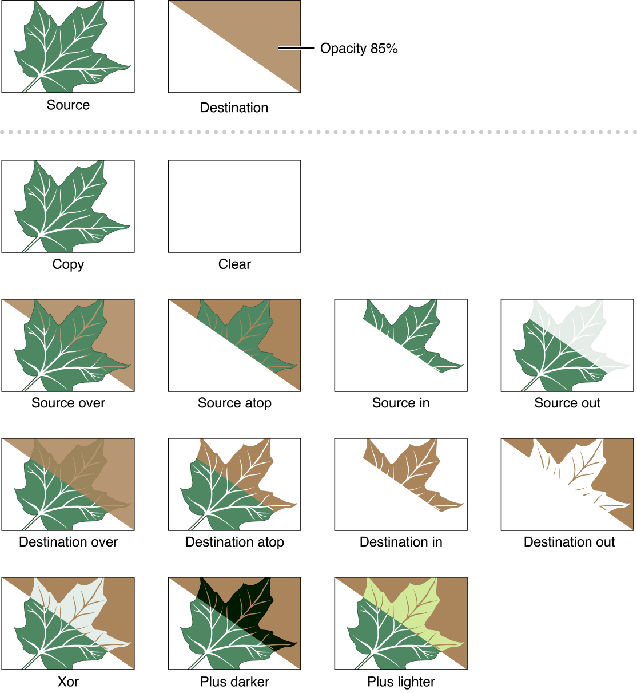
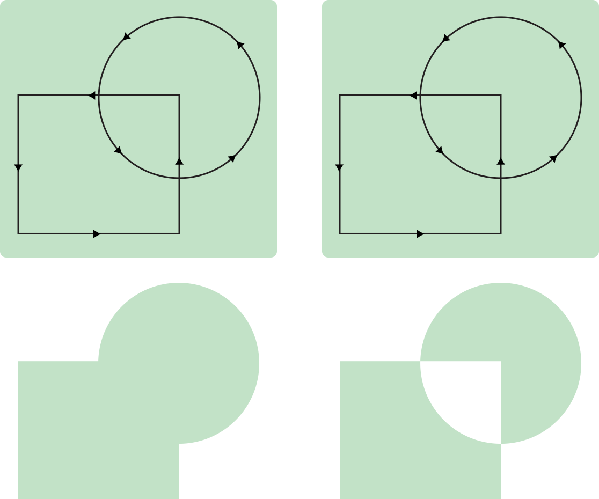
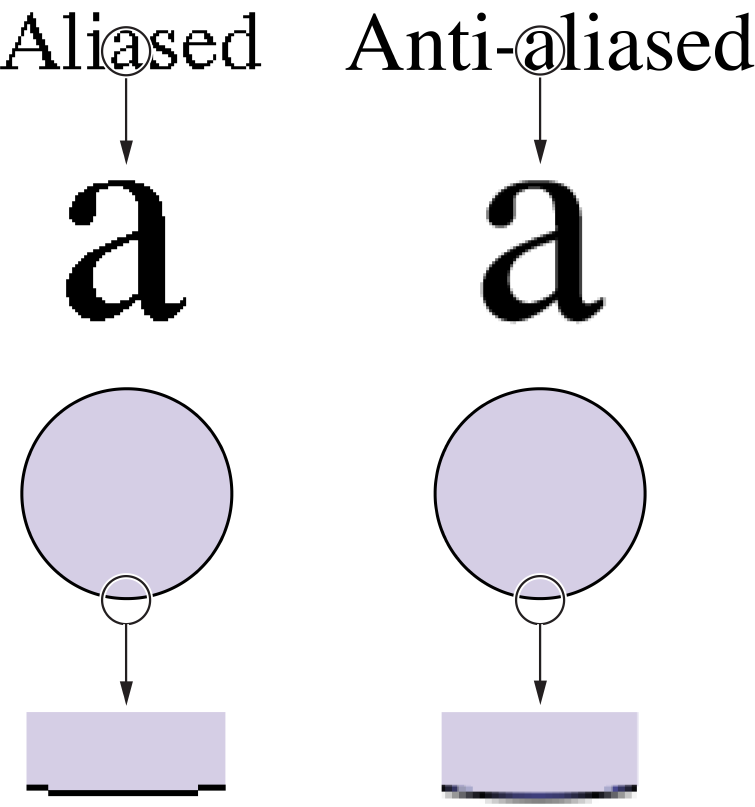

> 导航：[总目录](../../../README.md) · [documentation](../../../_indexes/documentation.md) · [Cocoa Drawing Guide](Introduction%20to%20Cocoa%20Drawing%20Guide.md)


[Next](Coordinate%20Systems%20and%20Transforms.md)[Previous](Overview%20of%20Cocoa%20Drawing.md)

# Graphics Contexts

Graphics contexts are a fundamental part of the drawing infrastructure in Cocoa applications. As the name suggests, a graphics context provides the context for subsequent drawing operations. It identifies the current drawing destination (screen, printer, file, and so on), the coordinate system and boundaries for the underlying canvas, and any graphics attributes associated with the destination.

For most of the drawing you do in Cocoa, you never need to create a graphics context yourself. The normal drawing cycle in Cocoa automatically creates and configures a graphics context for you to use. For some advanced drawing, however, you may need to create your own graphics context prior to drawing.

In a Cocoa application, graphics contexts for nearly all types of canvas are represented by the [NSGraphicsContext](https://developer.apple.com/documentation/appkit/nsgraphicscontext) class. You use graphics context objects to manipulate graphics attributes and to get information about the current drawing environment.

This chapter provides an overview of Cocoa graphics contexts and how you use them in your application. It includes information on how to create custom graphics contexts and when it might be appropriate to do so.

The primary job of any graphics context object is to maintain information about the current state of the drawing environment. In Quartz, the graphics context object is associated with a window, bitmap, PDF file, or other output device and maintains information for that device. The same is true for a Cocoa graphics context, but because Cocoa drawing is view-based, some additional changes are made to the drawing environment before your view’s [drawRect:](https://developer.apple.com/documentation/appkit/nsview/1483686-draw) method is called.

By the time your view’s `drawRect:` method is called, Cocoa has made sure that any drawing calls you make stay within the confines of your view. It saves the graphics state to simplify the process of undoing its changes later. It adds an appropriate transform to the current transformation matrix to place the drawing origin at the origin of your view. It also sets the clipping region to your view's visible boundaries, preventing any rendered content from straying into other views. Your view is effectively the star of the show, at least until another view’s `drawRect:` method is called.

While the current context is focused on your view, you can draw paths, images, text, or any other content you want. You can also change the attributes of the current drawing environment to achieve the appearance you want for your content. Eventually, the content you draw is sent to the Quartz Compositor, where it is combined with the content from other views in the window and flushed to the screen or output device.

After your `drawRect:` method returns, Cocoa goes through the process of resetting the drawing environment for the next view. It reverts any changes you made to the drawing environment and sets up the coordinate transform and clipping region for the next view, giving it its own pristine environment in which to work. This process then repeats itself during each update cycle in your application.

Each thread in a Cocoa application has its own graphics context object for a given window. You can access this object from your code using the [currentContext](https://developer.apple.com/documentation/appkit/nsgraphicscontext/1535352-currentcontext) method of [NSGraphicsContext](https://developer.apple.com/documentation/appkit/nsgraphicscontext), as shown in the following example:

```
NSGraphicsContext* aContext = [NSGraphicsContext currentContext];
```

The `currentContext` method always returns the Cocoa graphics context object that is appropriate for the current drawing environment. This object keeps track of the current graphics state, lets you save and restore graphics state information, and lets you modify many graphics state attributes. The changes you make to the graphics state affect all subsequent drawing calls. If you change an attribute more than once, only the most recent setting is used.

To save the current graphics state, you use the [saveGraphicsState](https://developer.apple.com/documentation/appkit/nsgraphicscontext/1533887-savegraphicsstate) method of `NSGraphicsContext`. This method essentially pushes a copy of the current state onto a stack, leaving you free to make changes to the current state. When you want to revert back to the previous state, you simply call the [restoreGraphicsState](https://developer.apple.com/documentation/appkit/nsgraphicscontext/1525118-restoregraphicsstate) method to pop the current graphics state (including all changes since the last save) off of the stack and restore the previous state.

If you plan to change the current graphics state significantly, it is a good idea to save the current state before making your changes. Modifying one or two attributes usually may not merit saving the graphics state, since you can reset or change those individual attributes easily. However, if you are changing more than one or two attributes, it is usually easier to save and restore the entire graphics state. You can call the `saveGraphicsState` method as often as needed in your code to save snapshots of the current graphics state, but you must be sure to balance each call with a matching call to `restoreGraphicsState`.

The following example shows a simple `drawRect:` method that iterates over an array of developer-defined objects, each of which is drawn with a different set of attributes. The graphics state is saved and restored during each loop iteration, ensuring that each object starts from the same graphics state.

```objc
- (void)drawRect:(NSRect)rect
{
    NSGraphicsContext* theContext = [NSGraphicsContext currentContext];

    int i;
    int numObjects = [myObjectArray count];

    // Iterate over an array of objects
    // Set the attributes for each before drawing
    for (i = 0; i < numObjects; i++)
    {
        [theContext saveGraphicsState];

        // Set the drawing attributes

        // Draw the object

        [theContext restoreGraphicsState];
    }
}
```


Each Cocoa graphics context object maintains information about the current state of the drawing environment. This information ranges from the global rendering settings to the attributes used to render the current path and is the same state information saved by Quartz. Whenever you save the current graphics state, you save a copy of the settings listed in Table 2-1.

__Table 2-1__  Graphics state information

| Attribute | Description |
| Current transformation matrix (CTM) | Maps points in the view’s coordinate system to points in the destination device's coordinate system. Cocoa modifies the CTM before calling your view’s `drawRect:` method. You can use an [NSAffineTransform](https://developer.apple.com/documentation/foundation/nsaffinetransform) object to modify the CTM further to change the drawing origin, scale the canvas, or rotate the coordinate system. For more information, see [Coordinate Systems and Transforms](Coordinate%20Systems%20and%20Transforms.md#apple-f4xwc4dqnrsv64tfmyxwi33df52wszbpkridimbqgazteojqfvbuqmrqgqwueq2jirfeuqsj). |
| Clipping area | Specifies the area of the canvas that can be painted by drawing calls. Cocoa modifies the clipping region to the visible area of your view before calling its `drawRect:` method. You can use an [NSBezierPath](https://developer.apple.com/documentation/appkit/nsbezierpath) object to further clip the visible area. For more information, see [Setting the Clipping Region](#apple-f4xwc4dqnrsv64tfmyxwi33df52wszbpkridimbqgazteojqfvbuqmrqgmwueq2jjfauiqsd). |
| Line width | Specifies the width of paths. The default line width is `1.0` but you can modify this value using an `NSBezierPath` object. For more information, see [Line Width](Paths.md#apple-f4xwc4dqnrsv64tfmyxwi33df52wszbpkridimbqgazteojqfvbuqmrqgywueqsdivbuessd). |
| Line join style | Specifies how two connected lines are joined together. The default join style is [NSMiterLineJoinStyle](https://developer.apple.com/documentation/appkit/nsmiterlinejoinstyle) but you can modify this value using an `NSBezierPath` object. For more information, see [Line Join Styles](Paths.md#apple-f4xwc4dqnrsv64tfmyxwi33df52wszbpkridimbqgazteojqfvbuqmrqgywueqsdizcekskf). |
| Line cap style | Specifies the appearance of an open end point on a path. The default line cap style is [NSButtLineCapStyle](https://developer.apple.com/documentation/appkit/nsbuttlinecapstyle) but you can modify this value using an `NSBezierPath` object. For more information, see [Line Cap Styles](Paths.md#apple-f4xwc4dqnrsv64tfmyxwi33df52wszbpkridimbqgazteojqfvbuqmrqgywueqsdiveuissj). |
| Line dash style | Defines a broken pattern for lines, including the initial phase for the style. There is no default dash style, resulting in solid lines. You modify dash styles for a path using an `NSBezierPath` object. For more information, see [Setting Path Attributes](#apple-f4xwc4dqnrsv64tfmyxwi33df52wszbpkridimbqgazteojqfvbuqmrqgmwueq2jivbesskc). |
| Line miter limit | Determines when lines should be joined with a bevel instead of a miter. Applies only when the line join style is set to `NSMiterLineJoinStyle`. The length of the miter is divided by the line width. If the resulting value is greater than the miter limit, a bevel is used. The default value is `10.0` but you can modify this value using an `NSBezierPath` object. For more information, see [Miter Limits](Paths.md#apple-f4xwc4dqnrsv64tfmyxwi33df52wszbpkridimbqgazteojqfvbuqmrqgywueqsdizeekskg). |
| Flatness value | Specifies the accuracy with which curves are rendered. (It is also the maximum error tolerance, measured in pixels.) Smaller numbers result in smoother curves at the expense of more calculations. The interpretation of this value may vary slightly on different rendering devices. The default value is `0.6` but you can modify this value using an `NSBezierPath` object. For more information, see [Line Flatness](Paths.md#apple-f4xwc4dqnrsv64tfmyxwi33df52wszbpkridimbqgazteojqfvbuqmrqgywueqsdijbeqskh). |
| Stroke color | Specifies the color used for rendering paths. This color applies only to the path line itself, not the area the path encompasses. You can specify colors using any of the system-supported color spaces. This value includes alpha information. Color information is managed by the [NSColor](https://developer.apple.com/documentation/appkit/nscolor) class. For more information, see [Setting Colors and Patterns](#apple-f4xwc4dqnrsv64tfmyxwi33df52wszbpkridimbqgazteojqfvbuqmrqgmwueq2jirdegr2e). |
| Fill color | Specifies the color used to fill the area enclosed by a path. You can specify colors using any of the system-supported color spaces. This value includes alpha information. Color information is managed by the `NSColor` class. For more information, see [Setting Colors and Patterns](#apple-f4xwc4dqnrsv64tfmyxwi33df52wszbpkridimbqgazteojqfvbuqmrqgmwueq2jirdegr2e). |
| Shadow | Specifies the shadow attributes to apply to rendered content. You set shadows using the [NSShadow](https://developer.apple.com/documentation/uikit/nsshadow) class. For more information, see [Adding Shadows to Drawn Paths](Advanced%20Drawing%20Techniques.md#apple-f4xwc4dqnrsv64tfmyxwi33df52wszbpkridimbqgazteojqfvbuqmrqg4wvgvzr). |
| Rendering intent | Specifies the technique used to map in-gamut colors to the gamut of the current color space. Cocoa does not support setting this attribute directly. Instead, you must use Quartz. For more information, see [Mapping Physical Colors to a Color Space](Color%20and%20Transparency.md#apple-f4xwc4dqnrsv64tfmyxwi33df52wszbpkridimbqgazteojqfvbuqmrqguwueqkkivbegrsg). |
| Font name | Specifies the font to use when drawing text. You modify font information using the [NSFont](https://developer.apple.com/documentation/appkit/nsfont) class. For more information on drawing text, see [Text Attributes](Text.md#apple-f4xwc4dqnrsv64tfmyxwi33df52wszbpkridimbqgazteojqfvbuqmrqhewueq2jjbbegqkh). |
| Font size | Specifies the font size to use when drawing text. You modify font information using the `NSFont` class. For more information on drawing text, see [Text Attributes](Text.md#apple-f4xwc4dqnrsv64tfmyxwi33df52wszbpkridimbqgazteojqfvbuqmrqhewueq2jjbbegqkh). |
| Font character spacing | Specifies the character spacing to use when drawing text. (This attribute is supported only indirectly by Cocoa.) For more information on drawing text, see [Text Attributes](Text.md#apple-f4xwc4dqnrsv64tfmyxwi33df52wszbpkridimbqgazteojqfvbuqmrqhewueq2jjbbegqkh). |
| Text drawing mode | Specifies how to render the text. (This attribute is supported only indirectly by Cocoa.) For more information on drawing text, see [Text Attributes](Text.md#apple-f4xwc4dqnrsv64tfmyxwi33df52wszbpkridimbqgazteojqfvbuqmrqhewueq2jjbbegqkh). |
| Image interpolation quality | Specifies the process used to interpolate images during rendering. You use the [NSGraphicsContext](https://developer.apple.com/documentation/appkit/nsgraphicscontext) class to change this setting. For more information, see [Image Size and Resolution](Images.md#apple-f4xwc4dqnrsv64tfmyxwi33df52wszbpkridimbqgazteojqfvbuqmrqhawvgvzs) |
| Compositing operation | Specifies the process used to composite source and destination material together. (The compositing operations supported by Cocoa are related to the Quartz blend modes but differ in their usage and behavior.) You use the `NSGraphicsContext` class to set the default value for this setting. Some rendering methods and functions may let you specify a different option. For more information, see [Setting Compositing Options](#apple-f4xwc4dqnrsv64tfmyxwi33df52wszbpkridimbqgazteojqfvbuqmrqgmwueq2jirbekrkc). |
| Global alpha | Specifies a global alpha (transparency) value to apply in addition to the alpha value for a given color. Cocoa does not support this attribute directly. If you want to set it, you must use the [CGContextSetAlpha](https://developer.apple.com/documentation/coregraphics/cgcontext/1456404-setalpha) function in Quartz. |
| Anti-aliasing setting | Specifies whether paths use aliasing to smooth lines as they cross pixel boundaries. You use the `NSGraphicsContext` class to change this setting. For more information, see [Setting the Anti-aliasing Options](#apple-f4xwc4dqnrsv64tfmyxwi33df52wszbpkridimbqgazteojqfvbuqmrqgmwueq2jjjfegqsc). |

In a broad sense, Cocoa graphics context objects serve two types of canvases: screen-based canvases and print-based canvases. A screen-based graphics context renders content to a window, view, or image with the results usually appearing on a screen. A print-based graphics context is used to render content to a printer spool file, PDF file, PostScript file, EPS file, or other medium usually associated with the printing system.

For nearly all screen-based and print-based drawing, Cocoa provides an appropriate graphics context object automatically. Cocoa provides a graphics context object during all view updates and in response to the user printing a document. There are situations, however, where you must create a graphics context object manually, including the following:

- Using OpenGL commands to render your view content
- Drawing to an offscreen bitmap
- Creating PDF or EPS data
- Initiating a print job programmatically

Using the class methods of [NSGraphicsContext](https://developer.apple.com/documentation/appkit/nsgraphicscontext), you can create graphics context objects for drawing to screen-based canvases. You cannot use these methods for print-based canvas, however. Cocoa routes all printing operations through the Cocoa printing system, which handles the task of setting up the graphics context object for you. This means that if you want to generate PDF data, EPS data, or print to a printer, you must use the methods of the [NSPrintOperation](https://developer.apple.com/documentation/appkit/nsprintoperation) class to create a print job for your target. It also means that your views should provide some minimal printing support if you want to produce well-formatted output for print-based canvases.

You can determine the type of canvas being managed by the current graphics context using the [isDrawingToScreen](https://developer.apple.com/documentation/appkit/nsgraphicscontext/1524673-isdrawingtoscreen) instance method or [currentContextDrawingToScreen](https://developer.apple.com/documentation/appkit/nsgraphicscontext/1525944-currentcontextdrawingtoscreen) class method of `NSGraphicsContext`. For print-based canvases, you can use the [attributes](https://developer.apple.com/documentation/appkit/nsgraphicscontext/1528254-attributes) method to get additional information about the canvas, such as whether it is being used to generate a PDF or EPS file.

For more information about obtaining contexts for both screen-based and print-based canvases, see [Creating Graphics Contexts](#apple-f4xwc4dqnrsv64tfmyxwi33df52wszbpkridimbqgazteojqfvbuqmrqgmwueq2ji5cesqkb).

The [NSGraphicsContext](https://developer.apple.com/documentation/appkit/nsgraphicscontext) class in Cocoa is a wrapper for a Quartz graphics context ([CGContextRef](https://developer.apple.com/documentation/coregraphics/cgcontextref) data type). Both types manage the same basic information, and in fact, many methods of `NSGraphicsContext` simply call their Quartz equivalents. This relationship makes it easy to perform any Quartz-related drawing in your application. It also means that any time you have a Cocoa graphics context (an instance of the `NSGraphicsContext` class), you have a Quartz graphics context as well.

For information on how to use Cocoa graphics contexts to call Quartz functions, see [Using Quartz in Your Application](Incorporating%20Other%20Drawing%20Technologies.md#apple-f4xwc4dqnrsv64tfmyxwi33df52wszbpkridimbqgazteojqfvbuqmrrgewueqkbjjcemr2k).

In your view’s `drawRect:` method, one of the first things you may want to do is modify the current drawing environment. For example, you might want to configure the current drawing colors, modifying the clipping region, transform the coordinate system, and so on. Many attributes can be set directly using the methods of [NSGraphicsContext](https://developer.apple.com/documentation/appkit/nsgraphicscontext) but some require the use of other objects. The following sections list the available drawing attributes and how you modify them.

Cocoa provides support for colors in a variety of different color spaces. The [NSColor](https://developer.apple.com/documentation/appkit/nscolor) class supports RGB, CMYK, and grayscale color spaces by default but can also support custom color spaces defined by ICC and ColorSync profiles. The colors you specify include the color channels appropriate for the color space and an optional alpha component to define the transparency of the color.

To set the current stroke or fill attributes, create an `NSColor` object and send it a `set`, [setStroke](https://developer.apple.com/documentation/appkit/nscolor/1531019-setstroke), or [setFill](https://developer.apple.com/documentation/appkit/nscolor/1524755-setfill) message. The stroke and fill attributes define the color or pattern for paths and the areas they enclose. The current stroke and fill colors affect all drawn content except text, which requires the application of text attributes; see [Applying Color to Text](Color%20and%20Transparency.md#apple-f4xwc4dqnrsv64tfmyxwi33df52wszbpkridimbqgazteojqfvbuqmrqguwueqkkjfbemr2d).

For more information about colors and how to create them, see [Color and Transparency](Color%20and%20Transparency.md#apple-f4xwc4dqnrsv64tfmyxwi33df52wszbpkridimbqgazteojqfvbuqmrqguwueqkkirdesrsf).

To modify the value of path attributes, you use the [NSBezierPath](https://developer.apple.com/documentation/appkit/nsbezierpath) class. Using the methods of this class, you can set the line width, line join style, line dash style, line cap style, miter limit, flatness, and winding rule attributes. All of these attributes affect the way paths are rendered by Cocoa.

Path attributes come in two flavors: global and path-specific. When you use the class methods in `NSBezierPath` to set the "default" value for an attribute, you are setting the global attribute. Global attributes are global to path objects (as opposed to the graphics state), so setting a global attribute affects all paths you render using the `NSBezierPath` class, but does not affect Quartz-based paths. To override a global attribute for an individual path object, you should set a path-specific value. For example, to set the global line width, you use the `setDefaultLineWidth:` class method of `NSBezierPath`. To set the line width for a specific `NSBezierPath` object, you use its [setLineWidth:](https://developer.apple.com/documentation/appkit/nsbezierpath/1520655-linewidth) instance method.

For information on how to set both default and path-specific attributes, and to see the resulting appearance of rendered content, see [Path Attributes](Paths.md#apple-f4xwc4dqnrsv64tfmyxwi33df52wszbpkridimbqgazteojqfvbuqmrqgywueqsdircuur2e).

For most string-based drawing in Cocoa, you apply text attributes directly to the strings, rather than relying on the global font settings. The Cocoa string objects and the Cocoa text system both support the use of attributes for modifying the appearance of string. For [NSAttributedString](https://developer.apple.com/library/archive/documentation/LegacyTechnologies/WebObjects/WebObjects_3.5/Reference/Frameworks/ObjC/Foundation/Classes/NSAttributedStrngClstr/Description.html#//apple_ref/occ/cl/NSAttributedString) objects, you apply the attributes directly to character ranges in the string. For regular [NSString](https://developer.apple.com/library/archive/documentation/LegacyTechnologies/WebObjects/WebObjects_3.5/Reference/Frameworks/ObjC/Foundation/Classes/NSStringClassCluster/Description.html#//apple_ref/occ/cl/NSString) objects, you apply the attributes to the entire string when you draw it.

If you want to set the global font settings stored in the graphics state, perhaps for drawing strings using Quartz, you can use the [NSFont](https://developer.apple.com/documentation/appkit/nsfont) object to set the font family and size. After creating a font object, you use its set method to apply the font information to the current graphics state.

For more information about drawing options for text, see [Text](Text.md#apple-f4xwc4dqnrsv64tfmyxwi33df52wszbpkridimbqgazteojqfvbuqmrqhewueq2jivcusr2d). For more information about the Cocoa text system, see _[Cocoa Text Architecture Guide](../../Cocoa%20Text%20Architecture%20Guide/About%20the%20Cocoa%20Text%20System.md#apple-f4xwc4dqnrsv64tfmyxwi33df52wszbpkridimbqga4tinjz)_.

When you render each visual element, you need to decide how that element interacts with any surrounding content. You might want the element to be layered on top of or behind the current content or be merged with it in interesting ways. You specify this behavior using different compositing options.

Compositing options specify how the colors in source content are blended with the existing content in the drawing destination. With fully opaque colors, most compositing options simply mask or overlay different parts of the source and destination content. With partially transparent colors, however, you can achieve interesting blending effects.

The Cocoa compositing options differ from the blend modes used in Quartz, although the two perform basically the same task. The Cocoa options are inherited from the NextStep environment, whereas the Quartz blend modes are part of the newer PDF-based rendering model. Despite their historical legacy, the Cocoa options are still a very powerful way to composite content, and may even be a little easier to understand than their Quartz counterparts.

Figure 2-1 shows the Cocoa compositing options and how they affect rendered content. At the top of the figure are the source and destination content being rendered. The veins of the leaf are completely transparent while the rest of the leaf is opaque. In the destination image, the color is rendered at partial opacity. Below that are the results for each of the supported compositing operations.

__Figure 2-1__  Compositing operations in Cocoa



Table 2-2 lists the mathematical equations used to compute pixel colors during compositing operations. In each equation, `R` is the resulting (premultiplied) color, `S` is the source color, `D` is the destination color, `Sa` is the alpha value of the source color, and `Da` is the alpha value of the destination color. All color component values and alpha values are in the range 0 to 1 for these computations.

__Table 2-2__  Mathematical equations for compositing colors

| Para | Para |
| [NSCompositeClear](https://developer.apple.com/documentation/appkit/nscompositeclear) | `R = 0` |
| [NSCompositeCopy](https://developer.apple.com/documentation/appkit/nscompositecopy) | `R = S` |
| [NSCompositeSourceOver](https://developer.apple.com/documentation/appkit/nscompositesourceover) | `R = S + D*(1 - Sa)` |
| [NSCompositeSourceIn](https://developer.apple.com/documentation/appkit/nscompositesourcein) | `R = S*Da` |
| [NSCompositeSourceOut](https://developer.apple.com/documentation/appkit/nscompositesourceout) | `R = S*(1 - Da)` |
| [NSCompositeSourceAtop](https://developer.apple.com/documentation/appkit/nscompositesourceatop) | `R = S*Da + D*(1 - Sa)` |
| [NSCompositeDestinationOver](https://developer.apple.com/documentation/appkit/nscompositedestinationover) | `R = S*(1 - Da) + D` |
| [NSCompositeDestinationIn](https://developer.apple.com/documentation/appkit/nscompositedestinationin) | `R = D*Sa` |
| [NSCompositeDestinationOut](https://developer.apple.com/documentation/appkit/nscompositedestinationout) | `R = D*(1 - Sa)` |
| [NSCompositeDestinationAtop](https://developer.apple.com/documentation/appkit/nscompositedestinationatop) | `R = S*(1 - Da) + D*Sa` |
| [NSCompositeXOR](https://developer.apple.com/documentation/appkit/nscompositexor) | `R = S*(1 - Da) + D*(1 - Sa)` |
| [NSCompositePlusDarker](https://developer.apple.com/documentation/appkit/nscompositeplusdarker) | `R = MAX(0, (1 - D) + (1 - S))` |
| [NSCompositePlusLighter](https://developer.apple.com/documentation/appkit/nscompositepluslighter) | `R = MIN(1, S + D)` |

To set the current compositing operation, you use the [setCompositingOperation:](https://developer.apple.com/documentation/appkit/nsgraphicscontext/1525984-compositingoperation) method of [NSGraphicsContext](https://developer.apple.com/documentation/appkit/nsgraphicscontext). This sets the global compositing option to use if no other operator is specified. The default compositing option is `NSCompositeSourceOver`.

The clipping region is a useful way to limit drawing to a specific portion of your view. Instead of creating complex graphics offscreen and then compositing them precisely in your view, you can use a clipping region to mask out the portions of your view you do not want modified. For example, you might use a clipping region to prevent drawing commands from drawing over some already rendered content. Similarly, you might use a clipping region to cut out specific portions of an image you want to render.

Before invoking your view’s `drawRect:` method, Cocoa configures the clipping region of the current graphics context to match the visible area of your view. This prevents your view's drawing code from rendering content outside of your view's boundaries, possibly on top of other views.

You can restrict the drawable region of your view even further by adding shapes to the current clipping region. Whenever you add a new shape to the current clipping region, Cocoa determines the intersection of the shape with the current clipping region and uses the result as the new clipping region. This behavior means that you should generally add only one shape to the clip region before doing your drawing. The shape you add can be a single rectangle, multiple rectangles, or a combination of multiple complex subpaths in a single `NSBezierPath` object.

For simple rectangular shapes, the easiest way to clip is using the [NSRectClip](https://developer.apple.com/documentation/appkit/1473759-nsrectclip) function. To specify multiple rectangular regions, use the [NSRectClipList](https://developer.apple.com/documentation/appkit/1473692-nsrectcliplist) function instead. To clip your view to a nonrectangular region, you must use an `NSBezierPath` object. The path you create can be arbitrarily complex and include multiple rectangular and nonrectangular regions. Once you have the path you want, use the object’s [addClip](https://developer.apple.com/documentation/appkit/nsbezierpath/1520634-addclip) method to add the resulting shape to the current clipping region. (For information on how to create paths, see [Drawing Fundamental Shapes](Paths.md#apple-f4xwc4dqnrsv64tfmyxwi33df52wszbpkridimbqgazteojqfvbuqmrqgywvgvzu).)

Figure 2-2 shows the effects of applying a clipping path to an image. The top images show the image to be clipped and the path to use for the clip shape, which in this case consists of two shapes inside a single `NSBezierPath` object. Although the clip shape is the same in both cases, the resulting clip region is different. This is because clipping takes into account the current winding rule when calculating the clipping region.

__Figure 2-2__  Clipping paths and winding rules



The following example shows you how to create the clip region shown in Figure 2-2. The clip region is composed of an overlapping square and circle, so you simply add a rectangle and oval with the appropriate sizes to a Bezier path object and call the `addClip` method.

```
// If you plan to do more drawing later, it's a good idea
// to save the graphics state before clipping.
[NSGraphicsContext saveGraphicsState];

// Create the path and add the shapes
NSBezierPath* clipPath = [NSBezierPath bezierPath];
[clipPath appendBezierPathWithRect:NSMakeRect(0.0, 0.0, 100.0, 100.0)];
[clipPath appendBezierPathWithOvalInRect:NSMakeRect(50.0, 50.0, 100.0,  100.0)];

// Add the path to the clip shape.
[clipPath addClip];

// Draw the image.

[NSGraphicsContext restoreGraphicsState];
```


Cocoa graphics contexts support anti-aliasing in the same way that their Quartz counterparts do. _Anti-aliasing_ is the process of artificially correcting the jagged (or aliased) edges surrounding text or shapes in bitmap images. These jagged edges occur primarily in lower-resolution bitmaps where it is easier to see individual pixels. To remove the jagged edges, Cocoa uses different colors for the pixels that surround a shape’s outline. The colors it uses are a blend of the original pixel color and the color of the shape’s outline. By blending colors in this way, the edges of the shape appear much smoother. Figure 2-3 shows the same image aliased and anti-aliased.

__Figure 2-3__  A comparison of aliased and anti-aliased content



To enable or disable anti-aliasing, use the [setShouldAntialias:](https://developer.apple.com/documentation/appkit/nsgraphicscontext/1529486-shouldantialias) method of [NSGraphicsContext](https://developer.apple.com/documentation/appkit/nsgraphicscontext). Even with anti-aliasing disabled, it may still appears as if Cocoa is drawing content using aliasing. When drawing content on non-pixel boundaries, Cocoa may opt to split the line over multiple pixels, which can give the impression of aliasing. For more information about how to avoid this situation, see [Doing Pixel-Exact Drawing](Coordinate%20Systems%20and%20Transforms.md#apple-f4xwc4dqnrsv64tfmyxwi33df52wszbpkridimbqgazteojqfvbuqmrqgqwueq2jineuuqkk).

The type of drawing you do in your application will determine whether you need to create any graphics context objects explicitly or simply use the one Cocoa provides you. If all you do is draw in your views, you can probably just use the Cocoa-provided context. This is true both for screen-based and print-based drawing. If your application performs any other type of drawing, however, you may need to create a graphics context yourself.

The following sections provide information on how and when to create Cocoa graphics contexts for your content.

If you want to do any drawing outside of the normal update cycle of your view, you must create a graphics context object explicitly. You might use this technique to draw in an offscreen window or bitmap and then copy the resulting bits elsewhere. You could also use it to draw to a window from a secondary thread. The [NSGraphicsContext](https://developer.apple.com/documentation/appkit/nsgraphicscontext) class includes methods for creating new graphics context objects specifically for windows and bitmap images.

To draw to a window, you can use the [graphicsContextWithWindow:](https://developer.apple.com/documentation/appkit/nsgraphicscontext/1532883-graphicscontextwithwindow) method of `NSGraphicsContext`. The context you get back is initialized to the window itself, and not to a specific view. In fact, you may not want to use this technique if the window contains many subviews. In order to draw the views properly, you would need to walk the list of subviews manually and configure the drawing environment for each one, which is not recommended. Instead, you would use this technique for drawing to an offscreen buffer.

To draw to a bitmap, you have two options. If your code runs in OS X v10.4 and later, you can use the [graphicsContextWithBitmapImageRep:](https://developer.apple.com/documentation/appkit/nsgraphicscontext/1529827-init) method to create a context object focused on an [NSBitmapImageRep](https://developer.apple.com/documentation/appkit/nsbitmapimagerep) object. The drawing you do is then rendered directly to the bitmap. If your code must run on earlier versions of OS X, you must either lock focus on a view or use an offscreen window and then capture the contents of the view or window. For information and examples on how to create bitmaps, see [Creating a Bitmap](Images.md#apple-f4xwc4dqnrsv64tfmyxwi33df52wszbpkridimbqgazteojqfvbuqmrqhawueq2jineemr2b)

Unlike screen-based contexts, if you want to create a graphics context for a PDF, EPS, or print-based canvas, you do not do so directly. All print-based operations must go through the Cocoa printing system, which handles the work required for setting up the printed pages and running the print job.

The simplest way to create a PDF or EPS file is to use the [dataWithPDFInsideRect:](https://developer.apple.com/documentation/appkit/nsview/1483797-datawithpdf) and [dataWithEPSInsideRect:](https://developer.apple.com/documentation/appkit/nsview/1483735-datawithepsinsiderect) methods of `NSView`. These methods configure a print job automatically and use your view's existing drawing code to generate the PDF or EPS data. For more information and an example of how to use these methods, see [Creating a PDF or EPS Image Representation](Images.md#apple-f4xwc4dqnrsv64tfmyxwi33df52wszbpkridimbqgazteojqfvbuqmrqhawvgvzr).

To create a print job manually, you use the [NSPrintOperation](https://developer.apple.com/documentation/appkit/nsprintoperation) class. This class offers several class methods for creating print jobs for a particular view and outputting the job to a printer, PDF file, or EPS file. Once you have an instance of the `NSPrintOperation` class, you can set the print information and use the [runOperation](https://developer.apple.com/documentation/appkit/nsprintoperation/1532039-runoperation) method to start the print job, at which point Cocoa takes over.

During the execution of a print job, Cocoa calls several methods of your view to handle page layout and drawing. These methods are called for all printing paths, so implementing them for printing will also support PDF and EPS. For information on how to implement these methods, see _[Printing Programming Guide for Mac](../Printing%20Programming%20Guide%20for%20Mac/About%20Printing%20on%20the%20Mac.md#apple-f4xwc4dqnrsv64tfmyxwi33df52wszbpgeydambqga4dg2i)_.

The Application Kit maintains a unique graphics context for each window and thread combination. Because each thread has its own graphics context object for a given window, it is possible to use secondary threads to draw to that window. There are some caveats, however.

During the normal update cycle for windows, all drawing requests are sent to your application’s main thread for processing. The normal update cycle happens when a user event triggers a change in your user interface. In this situation, you would call the [setNeedsDisplay:](https://developer.apple.com/documentation/appkit/nsview/1483360-needsdisplay) or [setNeedsDisplayInRect:](https://developer.apple.com/documentation/appkit/nsview/1483475-setneedsdisplayinrect) method (or the `display` family of methods) from your application’s main thread to invalidate the portions of your view that require redrawing. You should not call these methods from any secondary threads.

If you want to update a window or view from a secondary thread, you must manually lock focus on the window or view and initiate drawing yourself. Locking focus configures the drawing environment for that window's graphics context. Once locked, you can configure the drawing environment, issue your drawing commands as usual, and then flush the contents of the graphics context to the window buffer.

In order to draw regularly on a secondary thread, you must notify the thread yourself. The simplest way to send regular notifications is using an [NSTimer](https://developer.apple.com/library/archive/documentation/LegacyTechnologies/WebObjects/WebObjects_3.5/Reference/Frameworks/ObjC/Foundation/Classes/NSTimer/Description.html#//apple_ref/occ/cl/NSTimer) or [NSAnimation](https://developer.apple.com/documentation/appkit/nsanimation) object. For more information on how to animate content, see [Advanced Drawing Techniques](Advanced%20Drawing%20Techniques.md#apple-f4xwc4dqnrsv64tfmyxwi33df52wszbpkridimbqgazteojqfvbuqmrqg4wugsscizcukssb).

Creating bitmaps on secondary threads is one way to thread your drawing code. Because bitmaps are self-contained entities, they can be created safely on secondary threads. From your thread, you would need to create the graphics context object explicitly (as described in [Creating a Screen-Based Context](#apple-f4xwc4dqnrsv64tfmyxwi33df52wszbpkridimbqgazteojqfvbuqmrqgmwvgvzr)) and then issue drawing calls to draw into the bitmap buffer. For more information on how to create bitmaps, including sample code, see [Creating a Bitmap](Images.md#apple-f4xwc4dqnrsv64tfmyxwi33df52wszbpkridimbqgazteojqfvbuqmrqhawueq2jineemr2b).

[Next](Coordinate%20Systems%20and%20Transforms.md)[Previous](Overview%20of%20Cocoa%20Drawing.md)

