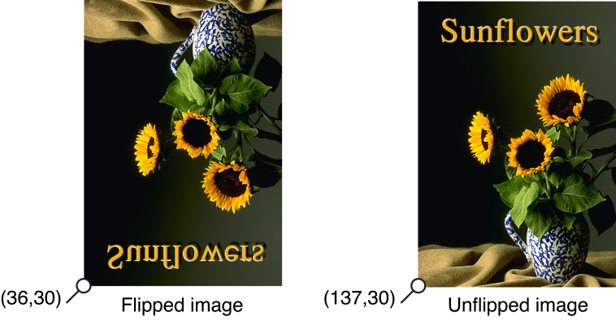
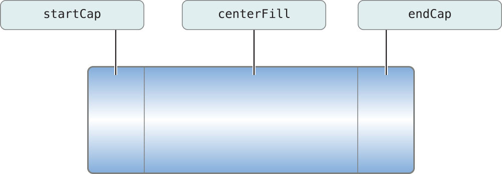
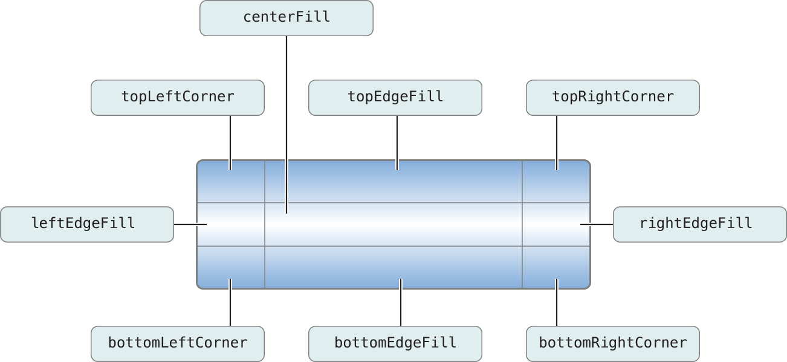

> 导航：[总目录](../../../README.md) · [documentation](../../../_indexes/documentation.md) · [Cocoa Drawing Guide](Introduction%20to%20Cocoa%20Drawing%20Guide.md)


[Next](Advanced%20Drawing%20Techniques.md)[Previous](Color%20and%20Transparency.md)

# Images

Images are an important part of any Mac app. In Cocoa, images play a very important, but flexible, role in your user interface. You can use images to render preexisting content or act as a buffer for your application's drawing commands. At the heart of Cocoa's image manipulation code is the [NSImage](https://developer.apple.com/documentation/appkit/nsimage) class. This class manages everything related to image data and is used for the following tasks:

- Loading existing images from disk.
- Drawing image data into your views.
- Creating new images.
- Scaling and resizing images.
- Converting images to any of several different formats.

You can use images in your program for a variety of tasks. You can load images from existing image files (such as JPEG, GIF, PDF, and EPS files) to draw elements of your user interface that might be too difficult (or too inefficient) to draw using primitive shapes. You can also use images as offscreen or temporary buffers and capture a sequence of drawing commands that you want to use at a later time.

Although bitmaps are one of the most common types of image, it is important not to think of the `NSImage` class as simply managing photographic or bitmap data. The `NSImage` class in Cocoa is capable of displaying a variety of image types and formats. It provides support for photograph and bitmap data in many standard formats. It also provides support for vector, or command-based data, such as PDF, EPS, and PICT. You can even use the `NSImage` class to represent an image created with the Core Image framework.

The [NSImage](https://developer.apple.com/documentation/appkit/nsimage) class provides the high-level interface for manipulating images in many different formats. Because it provides the high-level interface, `NSImage` knows almost nothing about managing the actual image data. Instead, the `NSImage` class manages one or more image representation objects—objects derived from the [NSImageRep](https://developer.apple.com/documentation/appkit/nsimagerep) class. Each image representation object understands the image data for a particular format and is capable of rendering that data to the current context.

The following sections provide insight into the relationship between image objects and image representations.

An image representation object represents an image at a specific size, using a specific color space, and in a specific data format. Image representations are used by an [NSImage](https://developer.apple.com/documentation/appkit/nsimage) object to manage image data. An image representation object knows how to read image data from a file, write that data back to a file, and convert the image data to a raw bitmap that can then be rendered to the current context. Some image representations also provide an interface for manipulating the image data directly.

For file-based images, `NSImage` creates an image representation object for each separate image stored in the file. Although most image formats support only a single image, formats such as TIFF allow multiple images to be stored. For example, a TIFF file might store both a full size version of an image and a thumbnail.

If you are creating images dynamically, you are responsible for creating the image representation objects you need for your image. As with file-based images, most of the images you create need only a single image representation. Because `NSImage` is adept at scaling and adjusting images to fit the target canvas, it is usually not necessary to create different image representations at different resolutions. You might create multiple representations in the following situations, however:

- For printing, you might want to create a PDF representation or high-resolution bitmap of your image.
- You want to provide different content for your image when it is scaled to different sizes.

When you draw an image, the `NSImage` object chooses the representation that is best suited for the target canvas. This choice is based on several factors, which are explained in [How an Image Representation Is Chosen](#apple-f4xwc4dqnrsv64tfmyxwi33df52wszbpkridimbqgazteojqfvbuqmrqhawueq2ji5cusrsg). If you want to ensure that a specific image representation is used, you can use the [drawRepresentation:inRect:](https://developer.apple.com/documentation/appkit/nsimage/1519904-drawrepresentation) method of `NSImage`.

Every image representation object is based on a subclass of [NSImageRep](https://developer.apple.com/documentation/appkit/nsimagerep). Cocoa defines several specific subclasses to handle commonly used formats. Table 5-1 lists the class and the image types it supports.

__Table 5-1__  Image representation classes

| Class | Supported types | Description |
| [NSBitmapImageRep](https://developer.apple.com/documentation/appkit/nsbitmapimagerep) | TIFF, BMP, JPEG, GIF, PNG, DIB, ICO, among others | Handles bitmap data. Several common bitmap formats are supported directly. For custom image formats, you may have to decode the image data yourself before creating your image representation. An `NSBitmapImageRep` object uses any available color profile data (ICC or ColorSync) when rendering. |
| [NSCachedImageRep](https://developer.apple.com/documentation/appkit/nscachedimagerep) | Rendered data | This class is used internally by Cocoa to cache images for drawing to the screen. You should not need to use this class directly. |
| [NSCIImageRep](https://developer.apple.com/documentation/appkit/nsciimagerep) | N/A | Provides a representation for a [CIImage](https://developer.apple.com/documentation/coreimage/ciimage) object, which itself supports most bitmap formats. |
| [NSPDFImageRep](https://developer.apple.com/documentation/appkit/nspdfimagerep) | PDF | Handles the display of PDF data. |
| [NSEPSImageRep](https://developer.apple.com/documentation/appkit/nsepsimagerep) | EPS | Handles the display of PostScript or encapsulated PostScript data. |
| [NSCustomImageRep](https://developer.apple.com/documentation/appkit/nscustomimagerep) | Custom | Handles custom image data by passing it to a delegate object you provide. |
| [NSPICTImageRep](https://developer.apple.com/documentation/appkit/nspictimagerep) | PICT | Handles the display of PICT format version 1, version 2, and extended version 2 pictures. The PICT format is a legacy format described in the Carbon QuickDraw Manager documentation. |

In most situations, you do not need to know how an image representation is created. For example, if you load an existing image from a file, `NSImage` automatically determines which type of image representation to create based on the file data. All you have to do is draw the image in your view.

If you want to support new image formats, you can create a new image representation class. The `NSImage` class and its `NSImageRep` subclasses do not follow the class cluster model found in several other Cocoa classes. Creating new image representations is relatively straightforward and is explained in [Creating New Image Representation Classes](#apple-f4xwc4dqnrsv64tfmyxwi33df52wszbpkridimbqgazteojqfvbuqmrqhawueq2jizfeer2d).

When you tell an [NSImage](https://developer.apple.com/documentation/appkit/nsimage) object to draw itself, it searches its list of image representations for the one that best matches the attributes of the destination device. In determining which image representation to choose, it follows a set of ordered rules that compare the color space, image resolution, bit depth, and image size to the corresponding values in the destination device. The rules are applied in the following order:

1. Choose an image representation whose color space most closely matches the color space of the device. If the device is color, choose a color image representation. If the device is monochrome, choose a gray-scale image representation.
2. Choose an image representation that has at least as many pixels as the destination rectangle on both the horizontal and vertical axes. If no image representation matches exactly, choose the one that has more pixels than the destination.

   By default, any image representation with a resolution that’s an integer multiple of the device resolution is considered a match. If more than one representation matches, `NSImage` chooses the one that’s closest to the device resolution. You can force resolution matches to be exact by passing `NO` to the [setMatchesOnMultipleResolution:](https://developer.apple.com/documentation/appkit/nsimage/1519963-matchesonmultipleresolution) method. You can force resolution matches to be exact on only one dimension by setting the `setMatchesOnlyOnBestFittingAxis:` property to `YES`.

   This rule prefers TIFF and bitmap representations, which have a defined resolution, over EPS representations, which do not. You can use the [setUsesEPSOnResolutionMismatch:](https://developer.apple.com/documentation/appkit/nsimage/1519868-usesepsonresolutionmismatch) method to cause `NSImage` to choose an EPS representation in case a resolution match is not possible.
3. Choose a representation whose bit depth (bits per sample) matches the depth of the device. If no representation matches, choose the one with the highest number of bits per sample.

You can change the order in which these rules are applied using the methods of `NSImage`. For example, if you want to invert the first and second rules, pass `NO` to the [setPrefersColorMatch:](https://developer.apple.com/documentation/appkit/nsimage/1520010-preferscolormatch) method. Doing so causes `NSImage` to match the resolution before the color space.

If these rules fail to narrow the choice to a single representation—for example, if the `NSImage` object has two color TIFF representations with the same resolution and depth—the chosen representation is operating-system dependent.

The [NSImage](https://developer.apple.com/documentation/appkit/nsimage) class incorporates an internal caching scheme aimed at improving your application’s drawing performance. This caching scheme is an important part of image management and is enabled by default for all image objects; however, you can change the caching options for a particular image using the [setCacheMode:](https://developer.apple.com/documentation/appkit/nsimage/1519850-cachemode) method of `NSImage`. Table 5-2 lists the available caching modes.

__Table 5-2__  Image caching modes

| Mode | Description |
| [NSImageCacheDefault](https://developer.apple.com/documentation/appkit/nsimagecachemode/nsimagecachedefault) | Use the default caching mode appropriate for the image representation. This is the default value. For more information, see [Table 5-3](#apple-f4xwc4dqnrsv64tfmyxwi33df52wszbpkridimbqgazteojqfvbuqmrqhawueq2ji5dueq2e). |
| [NSImageCacheAlways](https://developer.apple.com/documentation/appkit/nsimage/cachemode/always) | Always caches a version of the image. |
| [NSImageCacheBySize](https://developer.apple.com/documentation/appkit/nsimage/cachemode/bysize) | Creates a cached version of the image if the size set for the image is smaller than the size of the actual image data. |
| [NSImageCacheNever](https://developer.apple.com/documentation/appkit/nsimage/cachemode/never) | Does not cache the image. The image data is rasterized every time it is drawn. |

Table 5-3 lists the behavior of each image representation when its cache mode is set to `NSImageCacheDefault`.

__Table 5-3__  Implied cache settings

| Image representation | Cache behavior |
| [NSBitmapImageRep](https://developer.apple.com/documentation/appkit/nsbitmapimagerep) | Behaves as if the `NSImageCacheBySize` setting were in effect. Creates a cached copy if the bitmap depth does not match the screen depth or if the bitmap resolution is greater than 72 dpi. |
| [NSCachedImageRep](https://developer.apple.com/documentation/appkit/nscachedimagerep) | Not applicable. This class is used to implement caching. |
| [NSCIImageRep](https://developer.apple.com/documentation/appkit/nsciimagerep) | Behaves as if the `NSImageCacheBySize` setting were in effect. Creates a cached copy if the bitmap depth does not match the screen depth or if the bitmap resolution is greater than 72 dpi. |
| [NSPDFImageRep](https://developer.apple.com/documentation/appkit/nspdfimagerep) | Behaves as if the `NSImageCacheAlways` setting were in effect. |
| [NSEPSImageRep](https://developer.apple.com/documentation/appkit/nsepsimagerep) | Behaves as if the `NSImageCacheAlways` setting were in effect. |
| [NSCustomImageRep](https://developer.apple.com/documentation/appkit/nscustomimagerep) | Behaves as if the `NSImageCacheAlways` setting were in effect. |
| [NSPICTImageRep](https://developer.apple.com/documentation/appkit/nspictimagerep) | Behaves as if the `NSImageCacheBySize` setting were in effect. Creates a cached copy of the PICT image if it contains a bitmap whose depth does not match the screen depth or if that bitmap resolution is greater than 72 dpi. |

Caching is a useful step toward preparing an image for display on the screen. When first loaded, the data for an image representation may not be in a format that can be rendered directly to the screen. For example, PDF data, when loaded into a PDF image representation, must be rasterized before it can be sent to the graphics card for display. With caching enabled, a `NSPDFImageRep` object rasterizes the PDF data before drawing it to the screen. The image representation then saves the raster data to alleviate the need to recreate it later. If you disable caching for such images, the rasterization process occurs each time you render the image, which can lead to a considerable performance penalty.

For bitmap image representations, the decision to cache is dependent on the bitmap image data. If the bitmap’s color space, resolution, and bit depth match the corresponding attributes in the destination device, the bitmap may be used directly without any caching. If any of these attributes varies, however, the bitmap image representation may create a cached version instead.

If you change the contents of an image representation object directly, you should invoke the [recache](https://developer.apple.com/documentation/appkit/nsimage/1519890-recache) method of the owning `NSImage` object when you are done and want the changes to be reflected on the screen. Cocoa does not automatically track the changes you make to your image representation objects. Instead, it continues to use the cached version of your image representation until you explicitly clear that cache using the `recache` method.

Because caching can lead to multiple copies of the image data in memory, [NSImage](https://developer.apple.com/documentation/appkit/nsimage) usually dismisses the original image data once a cached copy is created. Dismissing the original image data saves memory and improves performance and is appropriate in situations where you do not plan on changing the image size or attributes. If you do plan on changing the image size or attributes, you may want to disable this behavior. Enabling data retention prevents image degradation by basing changes on the original image data, as opposed to the currently cached copy.

To retain image data for a specific image, you must send a [setDataRetained:](https://developer.apple.com/documentation/appkit/nsimage/1519999-setdataretained) message to the `NSImage` object. Preferably, you should send this message immediately after creating the image object. If you send the message after rendering the image or locking focus on it, Cocoa may need to read the image data more than once.

To improve performance, most caching of an application’s images occurs in one or more offscreen windows. These windows act as image repositories for the application and are not shared by other applications. Cocoa manages them automatically and assigns images to them based on the current image attributes.

By default, Cocoa tries to reduce the number of offscreen windows by putting multiple images into a single window. For images whose size does not change frequently, this technique is usually faster than storing each image in its own window. For images whose size does change frequently, it may be better to cache the image separately by sending a [setCachedSeparately:](https://developer.apple.com/documentation/appkit/nsimage/1520009-setcachedseparately) message to the image object.

Both [NSImage](https://developer.apple.com/documentation/appkit/nsimage) and [NSImageRep](https://developer.apple.com/documentation/appkit/nsimagerep) define methods for getting and setting the size of an image. The meaning of sizes can differ for each type of object, however. For `NSImage`, the size is always specified in units of the user coordinate space. Thus, an image that is 72 by 72 points is always rendered in a 1-inch square. For `NSImageRep`, the size is generally tied to the size of the native or cached bitmap. For resolution-independent image representations, a cached bitmap is created whose size matches that returned by `NSImage`. For true bitmap images, however, the size is equal to the width and height (in pixels) of the bitmap image.

If you create your image from a data object or file, the `NSImage` object takes its image size information from the provided data. For example, with EPS data, the size is taken from the bounding rectangle, whereas with TIFF data, the size is taken from the `ImageLength` and `ImageWidth` fields. If you create a blank image, you must set the image size yourself when you initialize the `NSImage` object.

You can change the size of an image at any time using the `setSize:` method of either `NSImage` or `NSImageRep`. The size returned by the `NSImage` version of the method represents the dimensions of the image in the user coordinate space. Changing this value therefore changes the size of the image as it is drawn in one of your views. This change typically affects only the cached copy of the image data, if one exists. Changing the size of an image representation object changes the actual number of bits used to hold the image data. This change primarily affects bitmap images, and can result in a loss of data for your in-memory copy of the image.

If the size of the data in an image representation is smaller than the rectangle into which it will be rendered, the image must be scaled to fit the target rectangle. For resolution-independent images, such as PDF images, scaling is less of an issue. For bitmap images, however, pixel values in the bitmap must be interpolated to fill in the extra space. Table 5-4 lists the available interpolation settings.

__Table 5-4__  Image interpolation constants

| Interpolation constant | Description |
| [NSImageInterpolationDefault](https://developer.apple.com/documentation/appkit/nsimageinterpolation/default) | Use the context’s default interpolation. |
| [NSImageInterpolationNone](https://developer.apple.com/documentation/appkit/nsimageinterpolation/none) | No interpolation. |
| [NSImageInterpolationLow](https://developer.apple.com/documentation/appkit/nsimageinterpolation/low) | Fast, low-quality interpolation. |
| [NSImageInterpolationMedium](https://developer.apple.com/documentation/appkit/nsimageinterpolation/nsimageinterpolationmedium) | Medium quality, slower than low-quality interpolation. |
| [NSImageInterpolationHigh](https://developer.apple.com/documentation/appkit/nsimageinterpolation/nsimageinterpolationhigh) | Highest quality, slower than medium-quality interpolation. |

The preceding interpolation settings control both the quality and the speed of the interpolation algorithm. To change the current interpolation setting, use the [setImageInterpolation:](https://developer.apple.com/documentation/appkit/nsgraphicscontext/1529711-imageinterpolation) method of `NSGraphicsContext`.

With data retention disabled in an image, scaling the image multiple times can seriously degrade the resulting image quality. Making an image smaller through scaling is a lossy operation. If you subsequently make the image larger again by scaling, the results are based on the scaled-down version of the image.

If you need several different sizes of an image, you might want to create multiple image representation objects, one for each size, to avoid any lossy behavior. Alternatively, you can use the [setDataRetained:](https://developer.apple.com/documentation/appkit/nsimage/1519999-setdataretained) method to ensure that the caching system has access to the original image data.

Like views, [NSImage](https://developer.apple.com/documentation/appkit/nsimage) objects use their own coordinate system to manage their content, which in this case is the image data itself. This internal coordinate system is independent of any containing views into which the image is drawn. Although you might think understanding this coordinate system is important for drawing images in your views, it actually is not. The purpose of the internal coordinate system is to orient the image data itself. As a result, the only time you should ever need to know about this internal coordinate system is when you create a new image by locking focus on an `NSImage` object and drawing into it.

Image objects have two possible orientations: standard and flipped. When you create a new, empty `NSImage` object, you can set the orientation based on how you want to draw the image data. By default, images use the standard Cartesian (unflipped) coordinate system, but you can force them to use a flipped coordinate system by calling the [setFlipped:](https://developer.apple.com/documentation/appkit/nsimage/1520044-setflipped) method of `NSImage` prior to drawing. You must always set the image orientation before you lock focus on the image and start drawing though. Changing the orientation of the coordinate system after a [lockFocus](https://developer.apple.com/documentation/appkit/nsimage/1519891-lockfocus) call has no effect. In addition, calling the `setFlipped:` method after you unlock focus again may not have the desired results and should be avoided.

When drawing images in your view, you can think of the image as just a rectangle with some data in it. Regardless of the orientation of its internal coordinate system, you always place an image relative to the current view’s coordinate system. Figure 5-1 shows two images drawn in an unflipped view. The code used to draw each image uses the coordinate points shown in the figure, which are in the view’s (unflipped) coordinate system. Because the first image uses a flipped coordinate system internally, however, it draws its content upside down.

__Figure 5-1__  Image orientation in an unflipped view



The [NSImage](https://developer.apple.com/documentation/appkit/nsimage) class offers different groups of methods to facilitate drawing your images to the current context. The two main groups of methods can be generally categorized as the “drawing” versus “compositing” methods. There are three “drawing” methods of `NSImage`:

- [drawAtPoint:fromRect:operation:fraction:](https://developer.apple.com/documentation/appkit/nsimage/1519981-draw)
- [drawInRect:fromRect:operation:fraction:](https://developer.apple.com/documentation/appkit/nsimage/1520067-drawinrect)
- [drawRepresentation:inRect:](https://developer.apple.com/documentation/appkit/nsimage/1519904-drawrepresentation)

The drawing methods are among the most commonly-used methods of `NSImage` because of their basic safety. Images are typically rendered in offscreen windows and then copied to the screen as needed. In some cases, several images may be composited into the same window for efficiency reasons. The draw methods use extra safety checking to ensure that only the contents of the current image are ever drawn in one of your views. The same is not true of compositing methods, of which there are the following:

- [compositeToPoint:operation:](https://developer.apple.com/documentation/appkit/nsimage/1519867-compositetopoint)
- [compositeToPoint:fromRect:operation:](https://developer.apple.com/documentation/appkit/nsimage/1520046-compositetopoint)
- [compositeToPoint:fromRect:operation:fraction:](https://developer.apple.com/documentation/appkit/nsimage/1520026-compositetopoint)
- [compositeToPoint:operation:fraction:](https://developer.apple.com/documentation/appkit/nsimage/1519932-compositetopoint)

These methods can be more efficient than the drawing methods because they perform fewer checks on the image bounds. These methods do have other behaviors that you need to understand, however. The most important behavior is that the compositing methods undo any scale or rotation factors (but not translation factors) applied to the CTM prior to drawing. If you are drawing in a flipped view or manually applied scaling or rotation values to the current context, these methods will ignore those transformations. Although this might seem like a problem, it actually can be a very useful tool. For example, if your program is scaling a graphic element, you might want to add a scale value to your transform to do the scaling (at least temporarily). If your element uses image-based selection handles, you could use the compositing methods to prevent those handles from being scaled along with the rest of your graphic element.

The other thing to remember about the compositing methods is that none of them allow you to scale your image to a target rectangle. Cocoa composites the entire image (or designated portion thereof) bit-for-bit to the specified location. This is in contrast to the `drawInRect:fromRect:operation:fraction:` method, which lets you scale all or part of your image to the designated target rectangle in your view.

Cocoa supports many common image formats internally and can import image data from many more formats through the use of the Image I/O framework (`ImageIO.framework`).

Table 5-5 lists the formats supported natively by Cocoa. (Uppercase versions of the filename extensions are also recognized.)

__Table 5-5__  Cocoa supported file formats

| Format | Filename extensions | UTI |
| Portable Document Format (PDF) | `.pdf` | `com.adobe.pdf` |
| Encapsulated PostScript (EPS) | `.eps`, `.epi`, `.epsf`, `.epsi`, `.ps` |  |
| Tagged Image File Format (TIFF) | `.tiff`, `.tif` | `public.tiff` |
| Joint Photographic Experts Group (JPEG), JPEG-2000 | `.jpg`, `.jpeg`, `.jpe` | `public.jpeg`, `public.jpeg-2000` |
| Graphic Interchange Format (GIF) | `.gif` | `com.compuserve.gif` |
| Portable Network Graphic (PNG) | `.png` | `public.png` |
| Macintosh Picture Format (PICT) | `.pict`, `.pct`, `.pic` | `com.apple.pict` |
| Windows Bitmap Format (DIB) | `.bmp`, `.BMPf` | `com.microsoft.bmp` |
| Windows Icon Format | `.ico` | `com.microsoft.ico` |
| Icon File Format | `.icns` | `com.apple.icns` |

TIFF images can be read from compressed data, as long as the compression algorithm is one of the four schemes described in Table 5-6.

__Table 5-6__  TIFF compression settings

| Compression | Description |
| LZW | Compresses and decompresses without information loss, achieving compression ratios up to 5:1. It may be somewhat slower to compress and decompress than the PackBits scheme. |
| PackBits | Compresses and decompresses without information loss, but may not achieve the same compression ratios as LZW. |
| JPEG | JPEG compression is no longer supported in TIFF files, and this factor is ignored. |
| CCITTFAX | Compresses and decompresses 1 bit gray-scale images using international fax compression standards CCITT3 and CCITT4. |

An `NSImage` object can also produce compressed TIFF data using any of these schemes. To get the TIFF data, use the [TIFFRepresentationUsingCompression:factor:](https://developer.apple.com/documentation/appkit/nsimage/1519949-tiffrepresentationusingcompressi) method of `NSImage`.

In OS X v10.4 and later, [NSImage](https://developer.apple.com/documentation/appkit/nsimage) supports many additional file formats using the Image I/O framework. To get a complete list of supported filename extensions, use the [imageFileTypes](https://developer.apple.com/documentation/appkit/nsimage/1519989-imagefiletypes) class method of `NSImage`. The list of supported file formats continues to grow but Table 5-7 lists some of the more common formats that can be imported.

__Table 5-7__  Additional formats supported by Cocoa

| Type | Filename extension |
| Adobe RAW | `.dng` |
| Canon 2 RAW | `.cr2` |
| Canon RAW | `.crw` |
| FlashPix | `.fpx`, `.fpix` |
| Fuji RAW | `.raf` |
| Kodak RAW | `.dcr` |
| MacPaint | `.ptng`, `.pnt`, `.mac` |
| Minolta RAW | `.mrw` |
| Nikon RAW | `.nef` |
| Olympus RAW | `.orf` |
| OpenEXR | `.exr` |
| Photoshop | `.psd` |
| QuickTime Import Format | `.qti`, `.qtif` |
| Radiance | `.hdr` |
| SGI | `.sgi` |
| Sony RAW | `.srf` |
| Targa | `.targa`, `.tga` |
| Windows Cursor | `.cur` |
| XWindow bitmap | `.xbm` |

The Image I/O framework is part of Quartz, although the actual framework is part of the Application Services framework. Image I/O handles the importing and exporting of many file formats. To use Quartz directly, you read image data using the [CGImageSourceRef](https://developer.apple.com/documentation/imageio/cgimagesource) opaque type and write using the [CGImageDestinationRef](https://developer.apple.com/documentation/imageio/cgimagedestinationref) type. For more information on using the Image I/O framework to read and write images, see _[CGImageSource Reference](https://developer.apple.com/documentation/imageio/cgimagesource-r84)_ and _[CGImageDestination Reference](https://developer.apple.com/documentation/imageio/cgimagedestination)_.

Here are some guidelines to help you work with images more effectively:

- Use the [NSImage](https://developer.apple.com/documentation/appkit/nsimage) interface whenever possible. The goal of `NSImage` is to simplify your interactions with image data. Working directly with image representations should be done only as needed.
- Treat `NSImage` and its image representations as immutable objects. The goal of `NSImage` is to provide an efficient way to display images on the target canvas. Avoid manipulating the data of an image representation directly, especially if there are alternatives to manipulating the data, such as compositing the image and some other content into a new image object.
- For screen-based drawing, it is best to use the built-in caching mechanism of `NSImage`. Using an `NSCachedImageRep` object is more efficient than an `NSBitmapImageRep` object with the same data. Cached image representations store image data using a `CGImageRef` object, which can be stored directly on the video card by Quartz.
- There is little benefit to storing multiple representations of the same image (possibly at different sizes) in a single `NSImage`. Modern hardware is powerful enough to resize and scale images quickly. The only reason to consider storing multiple representations is if each of those representations contains a customized version of the image or if your app supports high-resolution displays.
- If caching is enabled and you modify an image representation object directly, be sure to invoke the `recache` method of the owning `NSImage` object. Cocoa relies on cached content wherever possible to improve performance and does not automatically recreate its caches when you modify image representations. You must tell the image object to recreate its caches explicitly.
- Avoid recreating art that is already provided by the system. OS X makes several standard pieces of artwork available for inclusion in your own interfaces. This artwork ranges from standard icons to other elements you can integrate into your controls. You load standard images using the `imageNamed:` method. For a list of standard artwork, see the constants section in _[NSImage Class Reference](https://developer.apple.com/documentation/appkit/nsimage)_.
- If your app supports high resolution displays, follow the guidelines in _[High Resolution Guidelines for OS X](../../Graphics%20Animation/High%20Resolution%20Guidelines%20for%20OS%20X/About%20High%20Resolution%20for%20OS%20X.md#apple-f4xwc4dqnrsv64tfmyxwi33df52wszbpkridimbqgezdgmbs)_ for providing and naming standard- and high-resolution versions of image resources. That document also outlines additions and changes to the `NSImage` class as of OS X v10.7.4.

OS X defines several technologies for working with images. Although the `NSImage` class is a good general purpose class for creating, manipulating, and drawing images, there may be times when it might be easier or more efficient to use other imaging technologies. For example, rather than manually dissolving from one image to another by drawing partially transparent versions of each image over time, it would be more efficient to use Core Image to perform the dissolve operation for you. For information about other image technologies, and when you might use them, see [Choosing the Right Imaging Technology](Incorporating%20Other%20Drawing%20Technologies.md#apple-f4xwc4dqnrsv64tfmyxwi33df52wszbpkridimbqgazteojqfvbuqmrrgewvgvzs).

Before you can draw an image, you have to create or load the image data. Cocoa supports several techniques for creating new images and loading existing images.

For existing images, you can load the image directly from a file or URL using the methods of [NSImage](https://developer.apple.com/documentation/appkit/nsimage). When you open an image file, `NSImage` automatically creates an image representation that best matches the type of data in that file. Cocoa supports numerous file formats internally. In OS X v10.4 and later, Cocoa supports even more file formats using the Image I/O framework. For information on supported file types, see [Supported Image File Formats](#apple-f4xwc4dqnrsv64tfmyxwi33df52wszbpkridimbqgazteojqfvbuqmrqhawueq2jjfdeessh).

The following example shows how to load an existing image from a file. It is important to remember that images loaded from an existing file are intended primarily for rendering. If you want to manipulate the data directly, copy it to an offscreen window or other local data structure and manipulate it there.

```
NSString* imageName = [[NSBundle mainBundle]
                    pathForResource:@"image1" ofType:@"JPG"];
NSImage* tempImage = [[NSImage alloc] initWithContentsOfFile:imageName];
```


For frequently used images, you can use the Application Kit’s named image registry to load and store them. This registry provides a fast and convenient way to retrieve images without creating a new `NSImage` object each time. You can add images to this registry explicitly or you can use the registry itself to load known system or application-specific images, such as the following:

- System images stored in the `Resources` directory of the Application Kit framework
- Your application’s icon or other images located in the `Resources` directory of your main bundle.

To retrieve images from the registry, you use the [imageNamed:](https://developer.apple.com/documentation/appkit/nsimage/1520015-imagenamed) class method of `NSImage`. This method looks in the registry for an image associated with the name you provide. If none is found, it looks for the image among the Application Kit's shared resources. After that, it looks for a file in the `Resources` directory of your application bundle, and finally it checks the Application Kit bundle. If it finds an image file, it loads the image, adds it to the registry, and returns the corresponding `NSImage` object. As long as the corresponding image object is retained somewhere by your code, subsequent attempts to retrieve the same image file return the already-loaded `NSImage` object.

To retrieve your application icon, ask for an image with the constant, `NSImageNameApplicationIcon` (on versions of OS X before v10.6, you can use the string `@"NSApplicationIcon"`). Your application's custom icon is returned, if it has one; otherwise, Cocoa returns the generic application icon provided by the system. For a list of image names you can use to load other standard system images, see the constants section in _[NSImage Class Reference](https://developer.apple.com/documentation/appkit/nsimage)_.

In addition to loading existing image files, you can also add images to the registry explicitly by sending a [setName:](https://developer.apple.com/documentation/appkit/nsimage/1520025-setname) message to an `NSImage` object. The `setName:` method adds the image to the registry under the designated name. You might use this method in cases where the image was created dynamically or is not located in your application bundle.

It is possible to create images programmatically by locking focus on an [NSImage](https://developer.apple.com/documentation/appkit/nsimage) object and drawing other images or paths into the image context. This technique is most useful for creating images that you intend to render to the screen, although you can also save the resulting image data to a file.

Listing 5-1 shows you how to create a new empty image and configure it for drawing. When creating a blank image, you must specify the size of the new image in pixels. If you lock focus on an image that contains existing content, the new content is composited with the old content. When drawing, you can use any routines that you would normally use when drawing to a view.

__Listing 5-1__  Drawing to an image

```
NSImage* anImage = [[NSImage alloc] initWithSize:NSMakeSize(100.0,  100.0)];
[anImage lockFocus];

// Do your drawing here...

[anImage unlockFocus];

// Draw the image in the current context.
[anImage drawAtPoint:NSMakePoint(0.0, 0.0)
            fromRect: NSMakeRect(0.0, 0.0, 100.0, 100.0)
            operation: NSCompositeSourceOver
            fraction: 1.0];
```

Drawing to an image creates an [NSCachedImageRep](https://developer.apple.com/documentation/appkit/nscachedimagerep) object or uses an existing cached image representation, if one exists. Even when you use the [lockFocusOnRepresentation:](https://developer.apple.com/documentation/appkit/nsimage/1519950-lockfocusonrepresentation) method to lock onto a specific image representation, you do not lock onto the representation itself. Instead, you lock onto the cached offscreen window associated with that image representation. This behavior might seem confusing but reinforces the notion of the immutability of images and their image representations.

Images and their representations are considered immutable for efficiency and safety reasons. If you consider the image files stored in your application bundle, would you really want to make permanent changes to the original image? Rather than change the original image data, `NSImage` and its image representations modify a copy of that data. Modifying a cached copy of the data is also more efficient for screen-based drawing because the data is already in a format ready for display on the screen.

If your app uses the `lockFocus` and `unlockFocus` methods of the `NSImage` class for offscreen drawing, consider using the method `imageWithSize:flipped:drawingHandler:` instead (available in OS X v10.8). If you use the lock focus methods for drawing, you can get unexpected results—either you’ll get a low resolution `NSImage` object that looks incorrect when drawn, or you’ll get a 2x image that has more pixels in its bitmap than you are expecting.

Using the `imageWithSize:flipped:drawingHandler:` method ensures you’ll get correct results under standard and high resolution. The drawing handler is a block that can be invoked whenever the image is drawn to, and on whatever thread the drawing occurs. You should make sure that any state you access within the block is done in a thread-safe manner.

The code in the block should be the same code that you would use between the `lockFocus` and `unlockFocus` methods.

There are a few different ways to create bitmaps in Cocoa. Some of these techniques are more convenient than others and some may not be available in all versions of OS X, so you should consider each one carefully. The following list summarizes the most common techniques and the situations in which you might use them:

- To create a bitmap from the contents of an existing `CIImage` object (in OS X v10.5 and later), use the [initWithCIImage:](https://developer.apple.com/documentation/appkit/nsbitmapimagerep/1395587-initwithciimage) method of `NSBitmapImageRep`.
- To create a bitmap from the contents of a Quartz image (in OS X v10.5 and later), use the [initWithCGImage:](https://developer.apple.com/documentation/appkit/nsbitmapimagerep/1395423-initwithcgimage) method of `NSBitmapImageRep`. When initializing bitmaps using this method, you should treat the returned bitmap as a read-only object. In addition, you should avoid accessing the bitmap data directly, as doing so requires the unpacking of the [CGImageRef](https://developer.apple.com/documentation/coregraphics/cgimageref) data into a separate set of buffers.
- To capture the contents of an existing view or image, use one of the following techniques:

  - Lock focus on the desired object and use the [initWithFocusedViewRect:](https://developer.apple.com/documentation/appkit/nsbitmapimagerep/1395550-initwithfocusedviewrect) method of `NSBitmapImageRep`.
  - In OS X v10.4 and later, use the [bitmapImageRepForCachingDisplayInRect:](https://developer.apple.com/documentation/appkit/nsview/1483440-bitmapimagerepforcachingdisplay) and [cacheDisplayInRect:toBitmapImageRep:](https://developer.apple.com/documentation/appkit/nsview/1483552-cachedisplayinrect) methods of `NSView`. The first method creates a bitmap image representation suitable for use in capturing the view's contents while the second draws the view contents to the bitmap. You can reuse the bitmap image representation object to update the view contents periodically, as long as you remember to clear the old bitmap before capturing a new one.
- To draw directly into a bitmap, create a new `NSBitmapImageRep` object with the parameters you want and use the [graphicsContextWithBitmapImageRep:](https://developer.apple.com/documentation/appkit/nsgraphicscontext/1529827-init) method of `NSGraphicsContext` to create a drawing context. Make the new context the current context and draw. This technique is available only in OS X v10.4 and later.

  Alternatively, you can create an `NSImage` object (or an offscreen window), draw into it, and then capture the image contents. This technique is supported in all versions of OS X.
- To create the bitmap bit-by-bit, create a new `NSBitmapImageRep` object with the parameters you want and manipulate the pixels directly. You can use the [bitmapData](https://developer.apple.com/documentation/appkit/nsbitmapimagerep/1395421-bitmapdata) method to get the raw pixel buffer. `NSBitmapImageRep` also defines methods for getting and setting individual pixel values. This technique is the most labor intensive but gives you the most control over the bitmap contents. For example, you might use it if you want to decode the raw image data yourself and transfer it to the bitmap image representation.

The sections that follow provide examples on how to use the first two techniques from the preceding list. For information on how to manipulate a bitmap, see _[NSBitmapImageRep Class Reference](https://developer.apple.com/documentation/appkit/nsbitmapimagerep)_.

A simple way to create a bitmap is to capture the contents of an existing view or image. When capturing a view, the view can either belong to an onscreen window or be completely detached and not onscreen at all. When capturing an image, Cocoa chooses the image representation that provides the best match for your target bitmap.

Before attempting to capture the contents of a view, you should consider invoking the view’s [canDraw](https://developer.apple.com/documentation/appkit/nsview/1483277-candraw) method to see if the view should be drawn. Cocoa views return `NO` from this method in situations where the view is currently hidden or not associated with a valid window. If you are trying to capture the current state of a view, you might use the `canDraw` method to prevent your code from capturing the view when it is hidden.

Once you have your view or image, lock focus on it and use the [initWithFocusedViewRect:](https://developer.apple.com/documentation/appkit/nsbitmapimagerep/1395550-initwithfocusedviewrect) method of `NSBitmapImageRep` to capture the contents. When using this method, you specify the exact rectangle you want to capture from the view or image. Thus, you can capture all of the contents or only a portion; you cannot scale the content you capture. The `initWithFocusedViewRect:` method captures the bits exactly as they appear in the focused image or view.

Listing 5-2 shows how to create a bitmap representation from an existing image. The example gets the image to capture from a custom routine, locks focus on it, and creates the `NSBitmapImageRep` object. Your own implementation would need to replace the call to `myGetCurrentImage` with the code to create or get the image used by your program.

__Listing 5-2__  Capturing the contents of an existing image

```
NSImage* image = [self myGetCurrentImage];
NSSize size = [image size];
[image lockFocus];

NSBitmapImageRep* rep = [[NSBitmapImageRep alloc] initWithFocusedViewRect:
                        NSMakeRect(0,0,size.width,size.height)];

[image unlockFocus];
```

To capture the content of an onscreen view, you would use code very much like the preceding example. After locking focus on the view, you would create your `NSBitmapImageRep` object using the `initWithFocusedViewRect:` method.

To capture the content of a detached (offscreen) view, you must create an offscreen window for the view before you try to capture its contents. The window object provides a backing buffer in which to hold the view’s rendered content. As long as you do not order the window onto the screen, the origin you specify for your window does not really matter. The example in Listing 5-3 uses large negative values for the origin coordinates (just to make sure the window is not visible) but could just as easily use the coordinate (0, 0).

__Listing 5-3__  Drawing to an offscreen window

```
NSRect offscreenRect = NSMakeRect(-10000.0, -10000.0,
                            windowSize.width, windowSize.height);
NSWindow* offscreenWindow = [[NSWindow alloc]
                initWithContentRect:offscreenRect
                styleMask:NSBorderlessWindowMask
                backing:NSBackingStoreRetained
                defer:NO];

[offscreenWindow setContentView:myView];
[[offscreenWindow contentView] display]; // Draw to the backing  buffer

// Create the NSBitmapImageRep
[[offscreenWindow contentView] lockFocus];
NSBitmapImageRep* rep = [[NSBitmapImageRep alloc] initWithFocusedViewRect:
                NSMakeRect(0, 0, windowSize.width, windowSize.height)];

// Clean up and delete the window, which is no longer needed.
[[offscreenWindow contentView] unlockFocus];
[offscreenWindow release];
```


In OS X v10.4 and later, it is possible to create a bitmap image representation object and draw to it directly. This technique is simple and does not require the creation of any extraneous objects, such as an image or window. If your code needs to run in earlier versions of OS X, however, you cannot use this technique.

Listing 5-4, creates a new `NSBitmapImageRep` object with the desired bit depth, resolution, and color space. It then creates a new graphics context object using the bitmap and makes that context the current context.

__Listing 5-4__  Drawing directly to a bitmap

```
NSRect offscreenRect = NSMakeRect(0.0, 0.0, 500.0, 500.0);
NSBitmapImageRep* offscreenRep = nil;

offscreenRep = [[NSBitmapImageRep alloc] initWithBitmapDataPlanes:nil
                        pixelsWide:offscreenRect.size.width
                        pixelsHigh:offscreenRect.size.height
                        bitsPerSample:8
                        samplesPerPixel:4
                        hasAlpha:YES
                        isPlanar:NO
                        colorSpaceName:NSCalibratedRGBColorSpace
                        bitmapFormat:0
                        bytesPerRow:(4 * offscreenRect.size.width)
                        bitsPerPixel:32];

[NSGraphicsContext saveGraphicsState];
[NSGraphicsContext setCurrentContext:[NSGraphicsContext
                        graphicsContextWithBitmapImageRep:offscreenRep]];

// Draw your content...

[NSGraphicsContext restoreGraphicsState];
```

Once drawing is complete, you can add the bitmap image representation object to an `NSImage` object and display it like any other image. You can use this image representation object as a texture in your OpenGL code or examine the bits of the bitmap using the methods of `NSBitmapImageRep`.

The process for creating an image representation for PDF or EPS data is the same for both. In both cases, you use a custom `NSView` object together with the Cocoa printing system to generate the desired data. From the generated data, you then create an image representation of the desired type.

The `NSView` class defines two convenience methods for generating data based on the contents of the view:

- For PDF data, use the [dataWithPDFInsideRect:](https://developer.apple.com/documentation/appkit/nsview/1483797-datawithpdf) method of `NSView`.
- For EPS data, use the [dataWithEPSInsideRect:](https://developer.apple.com/documentation/appkit/nsview/1483735-datawithepsinsiderect) method of `NSView`.

When you send one of these messages to your view, Cocoa launches the printing system, which drives the data generation process. The printing system handles most of the data generation process, sending appropriate messages to your view object as needed. For example, Cocoa sends a `drawRect:` message to your view for each page that needs to be drawn. The printing system also invokes other methods to compute page ranges and boundaries.

After the printing system finishes, the code that called either [dataWithPDFInsideRect:](https://developer.apple.com/documentation/appkit/nsview/1483797-datawithpdf) or [dataWithEPSInsideRect:](https://developer.apple.com/documentation/appkit/nsview/1483735-datawithepsinsiderect) receives an `NSData` object with the PDF or EPS data. You must then pass this object to the `imageRepWithData:` method of either [NSEPSImageRep](https://developer.apple.com/documentation/appkit/nsepsimagerep) or [NSPDFImageRep](https://developer.apple.com/documentation/appkit/nspdfimagerep) to initialize a new image representation object, which you can then add to your `NSImage` object.

Listing 5-5 shows the basic steps for creating a PDF image from some view content. The view itself must be one that knows how to draw the desired content. This can be a detached view designed solely for drawing the desired content with any desired pagination, or it could be an existing view in one of your windows.

__Listing 5-5__  Creating PDF data from a view

```
MyPDFView* myView = GetMyPDFRenderView();
NSRect viewBounds = [myView bounds];

NSData* theData = [myView dataWithPDFInsideRect:viewBounds];
NSPDFImageRep* pdfRep = [NSPDFImageRep imageRepWithData:theData];

// Create a new image to hold the PDF representation.
NSImage* pdfImage = [[NSImage alloc] initWithSize:viewBounds.size];
[pdfImage addRepresentation:pdfRep];
```

If you choose to use an existing onscreen view, your view’s drawing code should distinguish between content drawn for the screen or for the printing system and adjust content accordingly. Use the [currentContextDrawingToScreen](https://developer.apple.com/documentation/appkit/nsgraphicscontext/1525944-currentcontextdrawingtoscreen) class method or the [isDrawingToScreen](https://developer.apple.com/documentation/appkit/nsgraphicscontext/1524673-isdrawingtoscreen) instance method of `NSGraphicsContext` to determine whether the current context is targeted for the screen or a print-based canvas. These methods return `NO` for operations that generate PDF or EPS data.

The [NSImage](https://developer.apple.com/documentation/appkit/nsimage) class does not provide any direct means for wrapping data from a Quartz image object. If you have a [CGImageRef](https://developer.apple.com/documentation/coregraphics/cgimageref) object, the simplest way to create a corresponding Cocoa image is to lock focus on an `NSImage` object and draw your Quartz image using the [CGContextDrawImage](https://developer.apple.com/documentation/coregraphics/1454845-cgcontextdrawimage) function. The basic techniques for how to do this are covered in [Drawing to an Image by Locking Focus](#apple-f4xwc4dqnrsv64tfmyxwi33df52wszbpkridimbqgazteojqfvbuqmrqhawueq2jijdemskj).

Once you have an image, there are many ways you can use it. The simplest thing you can do is draw it into a view as part of your program’s user interface. You can also process the image further by modifying it in any number of ways. The following sections show you how to perform several common tasks associated with images.

The `NSImage` class defines several methods for drawing an image into the current context. The two most commonly used methods are:

- [drawAtPoint:fromRect:operation:fraction:](https://developer.apple.com/documentation/appkit/nsimage/1519981-draw)
- [drawInRect:fromRect:operation:fraction:](https://developer.apple.com/documentation/appkit/nsimage/1520067-drawinrect)

These methods offer a simple interface for rendering your images, but more importantly, they ensure that only your image content is drawn. Other methods, such as the [compositeToPoint:operation:](https://developer.apple.com/documentation/appkit/nsimage/1519867-compositetopoint) method and its variants, are fast at drawing images but they do not check the image’s boundaries before drawing. If the drawing rectangle strays outside of the image bounds, it is possible to draw content not belonging to your image. If the image resides on a shared offscreen window, which many do, it is even possible to draw portions of other images. For more information about the differences between these methods, see [Drawing Versus Compositing](#apple-f4xwc4dqnrsv64tfmyxwi33df52wszbpkridimbqgazteojqfvbuqmrqhawvgvzx).

With one exception, all of the drawing and compositing methods choose the image representation that is best suited for the target canvas—see [How an Image Representation Is Chosen](#apple-f4xwc4dqnrsv64tfmyxwi33df52wszbpkridimbqgazteojqfvbuqmrqhawueq2ji5cusrsg). The one exception is the [drawRepresentation:inRect:](https://developer.apple.com/documentation/appkit/nsimage/1519904-drawrepresentation) method, which uses the image representation object you specify. For more information about the use of these methods, see the `NSImage` reference.

Images support the same set of compositing options as other Cocoa content, with the same results. For a complete list of compositing options and an illustration of their effects, see [Setting Compositing Options](Graphics%20Contexts.md#apple-f4xwc4dqnrsv64tfmyxwi33df52wszbpkridimbqgazteojqfvbuqmrqgmwueq2jirbekrkc).

If you are implementing a resizable custom control and want the control to have a textured background that does not distort as the control is resized, you would typically break up the background portion into several different images and composite them together. Although some of the images would contain fixed size content, others would need to be designed to present a smooth texture even after being resized or tiled. When it comes time to draw the images, however, you should avoid doing the drawing yourself. Instead, you should use the following AppKit functions, which were introduced in OS X v10.5:

- [NSDrawThreePartImage](https://developer.apple.com/documentation/appkit/1524633-nsdrawthreepartimage)
- [NSDrawNinePartImage](https://developer.apple.com/documentation/appkit/1526394-nsdrawninepartimage)

Drawing multipart images cleanly on high-resolution screens can be very challenging. If you are not careful about aligning images correctly on integral boundaries, the resulting texture might contain pixel cracks or other visual artifacts. The AppKit functions take into account all of the factors required to draw multipart images correctly in any situation, including situations where resolution independence scale factors other than 1.0 are in use.

Figure 5-2 shows how you assemble a three-part image for a horizontally resizable control. The two end caps are fixed size images that provide the needed decoration for the edges of the background. The center fill portion then resizes appropriately to fit the bounding rectangle you pass into the `NSDrawThreePartImage` function. (If you wanted the control to be resizable in the vertical direction, you would stack these images vertically instead of horizontally.) After drawing the background with this function, you would then layer any additional content on top of the background as needed.

__Figure 5-2__  Drawing a three-part image



Figure 5-3 shows you how to assemble a nine-part image for a control that can be resized both vertically and horizontally. In this case, the size of the corner pieces stays fixed but the five remaining fill images vary in size to fit the current bounding rectangle.

__Figure 5-3__  Drawing a nine-part image



For more information about these functions, see their descriptions in _[Application Kit Functions Reference](https://developer.apple.com/documentation/appkit/functions)_.

In OpenGL, a texture is one way to paint the surface of an object. For complex or photorealistic surfaces, it may be easier to apply a texture than render the same content using primitive shapes. Almost any view or image in Cocoa can be used to create an OpenGL texture. From a view or image, you create a bitmap image representation object (as described in [Capturing the Contents of a View or Image](#apple-f4xwc4dqnrsv64tfmyxwi33df52wszbpkridimbqgazteojqfvbuqmrqhawueq2jjfeuursc)) and then use that object to create your texture.

Listing 5-6 shows a self-contained method for creating a texture from an `NSImage` object. After creating the `NSBitmapImageRep` object, this method configures some texture-related parameters, creates a new texture object, and then associates the bitmap data with that object. This method handles 24-bit RGB and 32-bit RGBA images, but you could readily modify it to support other image formats. You must pass in a pointer to a valid `GLuint` variable for `texName` but the value stored in that parameter can be `0`. If you specify a nonzero value, your identifier is associated with the texture object and can be used to identify the texture later; otherwise, an identifier is returned to you in the `texName` parameter.

__Listing 5-6__  Creating an OpenGL texture from an image

```objc
- (void)textureFromImage:(NSImage*)theImg textureName:(GLuint*)texName
{
    NSBitmapImageRep* bitmap = [NSBitmapImageRep alloc];
    int samplesPerPixel = 0;
    NSSize imgSize = [theImg size];

    [theImg lockFocus];
    [bitmap initWithFocusedViewRect:
                    NSMakeRect(0.0, 0.0, imgSize.width, imgSize.height)];
    [theImg unlockFocus];

    // Set proper unpacking row length for bitmap.
    glPixelStorei(GL_UNPACK_ROW_LENGTH, [bitmap pixelsWide]);

    // Set byte aligned unpacking (needed for 3 byte per pixel bitmaps).
    glPixelStorei (GL_UNPACK_ALIGNMENT, 1);

    // Generate a new texture name if one was not provided.
    if (*texName == 0)
        glGenTextures (1, texName);
    glBindTexture (GL_TEXTURE_RECTANGLE_EXT, *texName);

    // Non-mipmap filtering (redundant for texture_rectangle).
    glTexParameteri(GL_TEXTURE_RECTANGLE_EXT, GL_TEXTURE_MIN_FILTER,  GL_LINEAR);
    samplesPerPixel = [bitmap samplesPerPixel];

    // Nonplanar, RGB 24 bit bitmap, or RGBA 32 bit bitmap.
    if(![bitmap isPlanar] &&
        (samplesPerPixel == 3 || samplesPerPixel == 4))
    {
        glTexImage2D(GL_TEXTURE_RECTANGLE_EXT, 0,
            samplesPerPixel == 4 ? GL_RGBA8 : GL_RGB8,
            [bitmap pixelsWide],
            [bitmap pixelsHigh],
            0,
            samplesPerPixel == 4 ? GL_RGBA : GL_RGB,
            GL_UNSIGNED_BYTE,
            [bitmap bitmapData]);
    }
    else
    {
        // Handle other bitmap formats.
    }

    // Clean up.
    [bitmap release];
}
```

In the preceding code, there are some additional points worth mentioning:

- `GL_TEXTURE_RECTANGLE_EXT` is used for non–power-of-two texture support, which is not supported on the Rage 128 hardware.
- The `gluScaleImage()` function can be used to scale non-PoT textures into PoT dimensions for hardware that doesn't support `GL_TEXTURE_RECTANGLE_EXT`.
- When you call this method, the current context must be a valid OpenGL context. For more information about OpenGL graphics contexts, see [Using OpenGL in Your Application](Incorporating%20Other%20Drawing%20Technologies.md#apple-f4xwc4dqnrsv64tfmyxwi33df52wszbpkridimbqgazteojqfvbuqmrrgewueqkbivbuurck).
- Upon completion, the texture is bound to the value in `texName`. If you specified 0 for the `texName` parameter, a new texture ID is generated for you and returned in `texName`.

For more information on Apple's support for OpenGL, see _[OpenGL Programming Guide for Mac](../../Graphics%20Imaging/OpenGL%20Programming%20Guide%20for%20Mac/About%20OpenGL%20for%20OS%20X.md#apple-f4xwc4dqnrsv64tfmyxwi33df52wszbpkridimbqgaytsobx)_.

In OS X v10.4 and later, Core Image filters are a fast and efficient way to modify an image without changing the image itself. Core Image filters use graphics acceleration to apply real-time effects such as Gaussian blurs, distortions, and color corrections to an image. Because the filters are applied when content is composited to the screen, they do not modify the actual image data.

Core Image filters operate on [CIImage](https://developer.apple.com/documentation/coreimage/ciimage) objects. If you have an existing `CIImage` object, you can simply apply any desired filters to it and use it to create an [NSCIImageRep](https://developer.apple.com/documentation/appkit/nsciimagerep) object. You can then add this image representation object to an `NSImage` object and draw the results in your view. In OS X v10.5 and later, you can also use the [initWithCIImage:](https://developer.apple.com/documentation/appkit/nsbitmapimagerep/1395587-initwithciimage) method of `NSBitmapImageRep` to render already-processed images directly to a bitmap representation.

If you do not already have a `CIImage` object, you need to create one using your program’s existing content. The first step is to create a bitmap image representation for the content you want to modify, the process for which is described in [Creating a Bitmap](#apple-f4xwc4dqnrsv64tfmyxwi33df52wszbpkridimbqgazteojqfvbuqmrqhawueq2jineemr2b). Once you have an `NSBitmapImageRep` object, use the [initWithBitmapImageRep:](https://developer.apple.com/documentation/coreimage/ciimage/1535335-init) method of `CIImage` to create a Core Image image object.

For information on how to apply Core Image filters to a `CIImage` object, see Using Core Image Filters in _[Core Image Programming Guide](../../Graphics%20Imaging/Core%20Image%20Programming%20Guide/About%20Core%20Image.md#apple-f4xwc4dqnrsv64tfmyxwi33df52wszbpkridgmbqgaytcobv)_.

Every `NSBitmapImageRep` object contains a dictionary that defines the bitmap’s associated properties. These properties identify important information about the bitmap, such as how it was compressed, its color profile (if any), its current gamma level, its associated EXIF data, and so on. When you create a new `NSBitmapImageRep` from an existing image file, many of these properties are set automatically. You can also access and modify these properties using the [valueForProperty:](https://developer.apple.com/documentation/appkit/nsbitmapimagerep/1395492-value) and [setProperty:withValue:](https://developer.apple.com/documentation/appkit/nsbitmapimagerep/1395486-setproperty) methods of `NSBitmapImageRep`.

For a complete list of properties you can get and set for a bitmap, see _[NSBitmapImageRep Class Reference](https://developer.apple.com/documentation/appkit/nsbitmapimagerep)_.

The `NSBitmapImageRep` class provides built-in support for converting bitmap data to several standard formats. To convert bitmap images to other formats, you can use any of the following methods:

- +[TIFFRepresentationOfImageRepsInArray:](https://developer.apple.com/documentation/appkit/nsbitmapimagerep/1395561-tiffrepresentationofimagereps)
- +[TIFFRepresentationOfImageRepsInArray:usingCompression:factor:](https://developer.apple.com/documentation/appkit/nsbitmapimagerep/1395456-tiffrepresentationofimagerepsina)
- -[TIFFRepresentation](https://developer.apple.com/documentation/appkit/nsbitmapimagerep/1395557-tiffrepresentation)
- -[TIFFRepresentationUsingCompression:factor:](https://developer.apple.com/documentation/appkit/nsbitmapimagerep/1395524-tiffrepresentation)
- +[representationOfImageRepsInArray:usingType:properties:](https://developer.apple.com/documentation/appkit/nsbitmapimagerep/1395520-representationofimagereps)
- -[representationUsingType:properties:](https://developer.apple.com/documentation/appkit/nsbitmapimagerep/1395458-representation)

The first set of methods generate TIFF data for the bitmap. For all other supported formats, you use the [representationOfImageRepsInArray:usingType:properties:](https://developer.apple.com/documentation/appkit/nsbitmapimagerep/1395520-representationofimagereps) and [representationUsingType:properties:](https://developer.apple.com/documentation/appkit/nsbitmapimagerep/1395458-representation) methods. These methods support the conversion of bitmap data to BMP, GIF, JPEG, PNG, and TIFF file formats.

All of the preceding methods return an `NSData` object with the formatted image data. You can write this data out to a file or use it to create a new`NSBitmapImageRep` object.

You can associate a custom ColorSync profile with a `NSBitmapImageRep` object containing pixel data produced by decoding a TIFF, JPEG, GIF or PNG file. To associate the data with the bitmap image representation, you use the [setProperty:withValue:](https://developer.apple.com/documentation/appkit/nsbitmapimagerep/1395486-setproperty) method of `NSBitmapImageRep` and the [NSImageColorSyncProfileData](https://developer.apple.com/documentation/appkit/nsbitmapimagerep/propertykey/1395476-colorsyncprofiledata) property. Listing 5-7 shows an example of how to load the ColorSync data and associate it with a bitmap image representation.

__Listing 5-7__  Adding a ColorSync profile to an image

```objc
@implementation NSBitmapImageRep (MoreColorMethods)
- (NSBitmapImageRep *) imageRepWithProfileAtPath:(NSString *) pathToProfile
{
    id result = [self copy];

    // Build an NSData object using the specified ColorSync profile
    id profile = [NSData dataWithContentsOfFile: pathToProfile];

    // Set the ColorSync profile for the object
    [result setProperty:NSImageColorSyncProfileData withValue:profile];

    return [result autorelease];
}
@end
```

In OS X v10.5, it is also possible to associate a custom ICC color profile with an `NSBitmapImageRep` object. To do so, you must initialize your `NSBitmapImageRep` instance using the calibrated RGB colorspace ([NSCalibratedRGBColorSpace](https://developer.apple.com/documentation/appkit/nscalibratedrgbcolorspace)). After that, you load the profile and associate the corresponding data object with the `NSImageColorSyncProfileData` key exactly as you would for a ColorSync profile.

Cocoa does not provide any direct ways to convert images from one color space to another. Although Cocoa fully supports color spaces included with existing image files, there is no way to convert image data directly using `NSImage`. Instead, you must use a combination of Quartz and Cocoa to convert the image data.

Converting the color space of an existing image requires the use of Quartz to establish a drawing context that uses the target color space. Once you have a [CGContextRef](https://developer.apple.com/documentation/coregraphics/cgcontextref) object with the desired color space, you can use it to configure the Cocoa drawing environment and draw your image.

Listing 5-8 shows you how to create a Quartz bitmap context using a custom color space. This function receives a [CMProfileRef](https://developer.apple.com/documentation/applicationservices/cmprofileref) object, which you can get from the ColorSync Manager or from the [colorSyncProfile](https://developer.apple.com/documentation/appkit/nscolorspace/1412076-colorsyncprofile) method of `NSColorSpace`. It uses the color profile to determine the number of channels in the color space. Once it knows the total number of channels (including alpha) needed for the bitmap, it creates and returns a matching bitmap context.

__Listing 5-8__  Creating a bitmap with a custom color profile

```
CGContextRef CreateCGBitmapContextWithColorProfile(size_t width,
                size_t height,
                CMProfileRef profile,
                CGImageAlphaInfo alphaInfo)
{
    size_t bytesPerRow = 0;
    size_t alphaComponent = 0;

    // Get the type of the color space.
    CMAppleProfileHeader header;
    if (noErr != CMGetProfileHeader(profile, &header))
        return nil;

    // Get the color space info from the profile.
    CGColorSpaceRef csRef = CGColorSpaceCreateWithPlatformColorSpace(profile);
    if (csRef == NULL)
        return NULL;

    // Add 1 channel if there is an alpha component.
    if (alphaInfo != kCGImageAlphaNone)
        alphaComponent = 1;

    // Check the major color spaces.
    OSType space = header.cm2.dataColorSpace;
    switch (space)
    {
        case cmGrayData:
            bytesPerRow = width;

            // Quartz doesn’t support alpha for grayscale bitmaps.
            alphaInfo = kCGImageAlphaNone;
            break;

        case cmRGBData:
            bytesPerRow = width * (3 + alphaComponent);
            break;

        case cmCMYKData:
            bytesPerRow = width * 4;

            // Quartz doesn’t support alpha for CMYK bitmaps.
            alphaInfo = kCGImageAlphaNone;
            break;

        default:
            return NULL;
    }

    // Allocate the memory for the bitmap.
    void*   bitmapData = malloc(bytesPerRow * height);

    CGContextRef    theRef = CGBitmapContextCreate(bitmapData, width,
                                    height, 8,  bytesPerRow,
                                    csRef, alphaInfo);

    // Cleanup if an error occurs; otherwise, the caller is responsible
    // for releasing the bitmap data.
    if ((!theRef) && bitmapData)
        free(bitmapData);

    CGColorSpaceRelease(csRef);
    return theRef;
}
```

Once you have a Quartz bitmap context, you can create a new Cocoa graphics context object and use it for drawing. To create the `NSGraphicsContext` object, you use the [graphicsContextWithGraphicsPort:flipped:](https://developer.apple.com/documentation/appkit/nsgraphicscontext/1529263-graphicscontextwithgraphicsport) method, which takes a `CGContextRef` object as a parameter. You then use the `setCurrentContext:` method to make it current and begin drawing. When you are done drawing, you use Quartz to create a `CGImageRef` object containing the results. Listing 5-9 shows this process.

__Listing 5-9__  Converting a bitmap to a different color space

```objc
- (CGImageRef) convertBitmapImageRep:(NSBitmapImageRep*)theRep toColorSpace:(NSColorSpace*)colorspace
{
    if (!theRep)
        return nil;

    // Map the Cocoa constants returned by -bitmapFormat to their
    // Quartz equivalents.
    CGImageAlphaInfo alphaInfo = GetAlphaInfoFromBitmapImageRep(theRep);

    // Get the rest of the image info.
    NSSize imageSize = [theRep size];
    size_t width = imageSize.width;
    size_t height = imageSize.height;
    CMProfileRef profile = (CMProfileRef)[colorspace colorSyncProfile];

    // Create a new 8-bit bitmap context based on the image info.
    CGContextRef cgContext = CreateCGBitmapContextWithColorProfile(width,
                                     height, profile, alphaInfo);

    if (cgContext == NULL)
        return NULL;

    // Create an NSGraphicsContext that draws into the CGContext.
    NSGraphicsContext *graphicsContext = [NSGraphicsContext
             graphicsContextWithGraphicsPort:cgContext flipped:NO];

    // Make the NSGraphicsContext current and draw into it.
    [NSGraphicsContext saveGraphicsState];
    [NSGraphicsContext setCurrentContext:graphicsContext];

    // Create a new image for rendering the original bitmap.
    NSImage*  theImage = [[[NSImage alloc] initWithSize:imageSize] autorelease];
    [theImage addRepresentation:theRep];

    // Draw the original image in the Quartz bitmap context.
    NSRect imageRect = NSMakeRect(0.0, 0.0, imageSize.width, imageSize.height);
    [theImage drawAtPoint:NSMakePoint(0.0, 0.0)
                fromRect:imageRect
                operation: NSCompositeSourceOver
                fraction: 1.0];
    [NSGraphicsContext restoreGraphicsState];

    // Create a CGImage from the CGContext's contents.
    CGImageRef cgImage = CGBitmapContextCreateImage(cgContext);

    // Release the context. Note that this does not release the bitmap data.
    CGContextRelease(cgContext);

    return cgImage;
}
```

There are two ways to get an `NSImage` object from a `CGImageRef` type. In OS X v10.5 and later, you can create an [NSBitmapImageRep](https://developer.apple.com/documentation/appkit/nsbitmapimagerep) object using its [initWithCGImage:](https://developer.apple.com/documentation/appkit/nsbitmapimagerep/1395423-initwithcgimage) method and then add that image representation to an `NSImage` object. If your code needs to run in versions of OS X v10.4 or earlier, however, you can lock focus on an `NSImage` object and use the [CGContextDrawImage](https://developer.apple.com/documentation/coregraphics/1454845-cgcontextdrawimage) function to draw the Quartz image into the image. This latter technique creates a copy of the image data and requires more effort than using the `initWithCGImage:` method but is available on all versions of OS X. Listing 5-10 shows a sample method that demonstrates both approaches but always uses the best approach available for the target platform.

__Listing 5-10__  Using a CGImageRef object to create an NSImage object

```objc
- (NSImage*)imageFromCGImageRef:(CGImageRef)image
{
    NSImage* newImage = nil;

#if MAC_OS_X_VERSION_MAX_ALLOWED >= MAC_OS_X_VERSION_10_5
    NSBitmapImageRep*    newRep = [[NSBitmapImageRep alloc] initWithCGImage:image];
    NSSize imageSize;

    // Get the image dimensions.
    imageSize.height = CGImageGetHeight(image);
    imageSize.width = CGImageGetWidth(image);

    newImage = [[NSImage alloc] initWithSize:imageSize];
    [newImage addRepresentation:newRep];

#else

    NSRect imageRect = NSMakeRect(0.0, 0.0, 0.0, 0.0);
    CGContextRef imageContext = nil;

    // Get the image dimensions.
    imageRect.size.height = CGImageGetHeight(image);
    imageRect.size.width = CGImageGetWidth(image);

    // Create a new image to receive the Quartz image data.
    newImage = [[NSImage alloc] initWithSize:imageRect.size];
    [newImage lockFocus];

    // Get the Quartz context and draw.
    imageContext = (CGContextRef)[[NSGraphicsContext currentContext] graphicsPort];
    CGContextDrawImage(imageContext, *(CGRect*)&imageRect, image);
    [newImage unlockFocus];

#endif

    return [newImage autorelease];
}
```


If you have an existing ICC profile and want to associate that profile with an image, you must do so using the ColorSync Manager. If you are working with Quartz graphic contexts, you use the ICC profile to obtain the color space information needed to create a `CGImageRef` object. You can then use that color space information to create an appropriate context for rendering your image.

Listing 5-11 shows you how to create a [CGColorSpaceRef](https://developer.apple.com/documentation/coregraphics/cgcolorspaceref) object from an ICC profile. This code uses several ColorSync Manager functions to create a [CMProfileRef](https://developer.apple.com/documentation/applicationservices/cmprofileref) object, from which you can then extract the color space object. OS X includes several standard ICC profiles in the `/System/Library/ColorSync/Profiles/` directory.

__Listing 5-11__  Creating a color space from a custom color profile

```
CGColorSpaceRef CreateColorSpaceForProfileAtPath(NSString* path)
{
    CMProfileLocation profileLoc;
    CMProfileRef profileRef;
    CGColorSpaceRef csRef = NULL;

    // Specify where the ICC profile data file is located.
    profileLoc.locType = cmPathBasedProfile;
    strncpy(profileLoc.u.pathLoc.path, [path fileSystemRepresentation],  255);

    // Get the ColorSync profile information from the data file.
    CMOpenProfile(&profileRef, &profileLoc);

    // Use the profile to create the color space object.
    csRef = CGColorSpaceCreateWithPlatformColorSpace(profileRef);
    CMCloseProfile(profileRef);

    return csRef;
}
```

For more information on ColorSync and its functions, see _[ColorSync Manager Reference](https://developer.apple.com/documentation/applicationservices/colorsync_manager)_.

Although premultiplying alpha values used to be a common way to improve performance when rendering bitmaps, the technique is not recommended for programs running in OS X. Premultiplication involves multiplying values in the bitmap’s alpha channel with the corresponding pixel values and storing the results back to the bitmap’s source file. The goal of pre-multiplication is to reduce the number of calculations performed when the bitmap is composited with other content. In OS X, premultiplication can actually result in more calculations.

In OS X, color correction is integral to the operating system. In order to process colors correctly, ColorSync needs the original pixel color values. If a bitmap contains premultiplied color values, ColorSync must undo the premultiplication before it can check the colors. This extra step adds a significant amount of work to the system because it must be performed every time the colors are checked.

The only reason to consider premultiplication of alpha values for your bitmaps is if your data is already premultiplied and leaving it that way is beneficial to your program’s data model. Even so, you should do some performance tests to see if using premultiplied bitmaps hurts your overall application performance. Cocoa incorporates color management into many parts of the framework. If your code paths use these parts of the framework, you might find it beneficial to change your model.

If you want to add support for new image formats or generate images from other types of source information, you may want to subclass [NSImageRep](https://developer.apple.com/documentation/appkit/nsimagerep). Although Cocoa supports many image formats directly, and many more indirectly through the Image IO framework, subclassing `NSImageRep` gives you control over the handling of image data while at the same time maintaining a tight integration with the [NSImage](https://developer.apple.com/documentation/appkit/nsimage) class. If you decide to subclass, you should provide implementations for the following methods:

- [imageUnfilteredTypes](https://developer.apple.com/documentation/appkit/nsimagerep/1534816-imageunfilteredtypes)
- [canInitWithData:](https://developer.apple.com/documentation/appkit/nsimagerep/1535427-caninitwithdata)
- [initWithData:](https://developer.apple.com/documentation/appkit/nsimage/1519941-initwithdata)
- [draw](https://developer.apple.com/documentation/appkit/nsimagerep/1526674-draw)

These methods provide the basic interface that the parent `NSImageRep` class needs to interact with your subclass. The methods provide information about what image data formats your class supports along with entry points for initializing your object and drawing the image.

Before your subclass can be used, it must be registered with the Application Kit. You should do this early in your application’s execution by invoking the [registerImageRepClass:](https://developer.apple.com/documentation/appkit/nsimagerep/1535393-registerimagerepclass) class method of `NSImageRep`. Registering your class lets Cocoa know that your class exists and that it can handle a specific set of file types. Your implementation of the [imageUnfilteredTypes](https://developer.apple.com/documentation/appkit/nsimagerep/1534816-imageunfilteredtypes) method should return an array of UTI types corresponding to the image file types your class supports directly.

Another method you should always override is the `canInitWithData:` method. Once your image representation class has been identified as handling a particular type of data, Cocoa may notify it when data of the appropriate type is received. At that time, Cocoa passes a data object to your `canInitWithData:` method. Your implementation of this method should examine the data quickly and verify that it can really handle the format.

Once your class is chosen to handle the image data, Cocoa looks for an `initWithData:` method and uses it to initialize your object with the image data. Your implementation of this method should retain the data and use it to initialize the object. At some point later, your [draw](https://developer.apple.com/documentation/appkit/nsimagerep/1526674-draw) method may be called to render the data in the current context. Your `draw` method should render the data at the current origin point and with the current size and settings specified by the `NSImageRep` parent class.

[Next](Advanced%20Drawing%20Techniques.md)[Previous](Color%20and%20Transparency.md)

