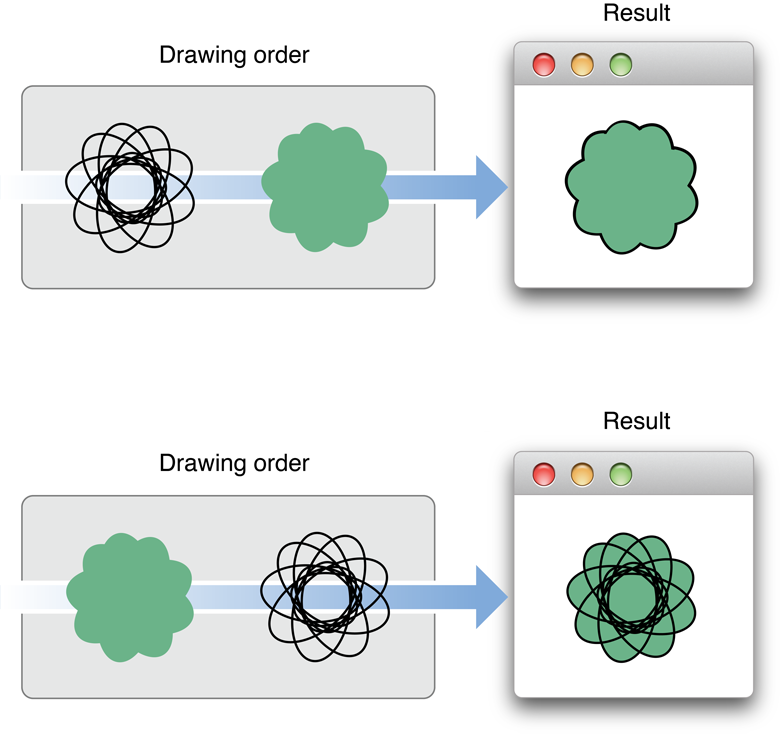
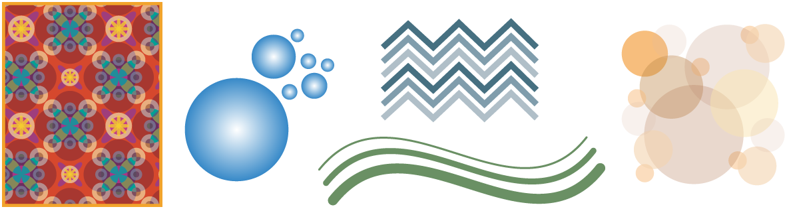
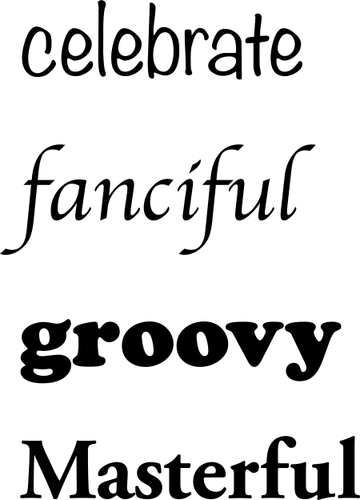

> 导航：[总目录](../../../README.md) · [documentation](../../../_indexes/documentation.md) · [Cocoa Drawing Guide](Introduction%20to%20Cocoa%20Drawing%20Guide.md)


[Next](Graphics%20Contexts.md)[Previous](Introduction%20to%20Cocoa%20Drawing%20Guide.md)

# Overview of Cocoa Drawing

Drawing is a fundamental part of most Cocoa applications. If your application uses only standard system controls, then Cocoa does all of the drawing for you. If you use custom views or controls, though, then it is up to you to create their appearance using drawing commands.

The following sections provide a quick tour of the drawing-related features available in Cocoa. Subsequent chapters provide more details about each feature, and also include examples for many common tasks you might perform during drawing.

The Cocoa drawing environment is available to all applications built on top of the Application Kit framework (`AppKit.framework`). This framework defines numerous classes and functions for drawing everything from primitive shapes to complex images and text. Cocoa drawing also relies on some primitive data types found in the Foundation framework (`Foundation.framework`).

The Cocoa drawing environment is compatible with all of the other drawing technologies in OS X, including Quartz, OpenGL, Core Image, Core Video, Quartz Composer, PDF Kit, and QuickTime. In fact, most Cocoa classes use Quartz extensively in their implementations to do the actual drawing. In cases where you find Cocoa does not have the features you need, it is no problem to integrate other technologies where necessary to achieve the desired effects.

Because it is based on Quartz, the Application Kit framework provides most of the same features found in Quartz, but in an object-oriented wrapper. Among the features supported directly by the Application Kit are the following:

- Path-based drawing (also known as vector-based drawing)
- Image creation, loading and display
- Text layout and display
- PDF creation and display
- Transparency
- Shadows
- Color management
- Transforms
- Printing support
- Anti-aliased rendering
- OpenGL support

Like Quartz, the Cocoa drawing environment takes advantage of graphics hardware wherever possible to accelerate drawing operations. This support is automatic. You do not have to enable it explicitly in your code.

For information about the classes available in Cocoa, see _[Application Kit Framework Reference](https://developer.apple.com/documentation/appkit)_ and _[Foundation Framework Reference](https://developer.apple.com/documentation/foundation)_. For information on how to integrate C-based technologies into your Cocoa application, see [Incorporating Other Drawing Technologies](Incorporating%20Other%20Drawing%20Technologies.md#apple-f4xwc4dqnrsv64tfmyxwi33df52wszbpkridimbqgazteojqfvbuqmrrgewueqkbireesqkg).

Like Quartz, Cocoa drawing uses the painter’s model for imaging. In the painter’s model, each successive drawing operation applies a layer of “paint” to an output “canvas.” As new layers of paint are added, previously painted elements may be obscured (either partially or totally) or modified by the new paint. This model allows you to construct extremely sophisticated images from a small number of powerful primitives.

Figure 1-1 shows how the painter’s model works and demonstrates how important drawing order can be when rendering content. In the first result, the wireframe shape on the left is drawn first, followed by the solid shape, obscuring all but the perimeter of the wireframe shape. When the shapes are drawn in the opposite order, the results are very different. Because the wireframe shape has more holes in it, parts of the solid shape show through those holes.

__Figure 1-1__  The painter’s model



The drawing environment encompasses the digital canvas and graphics settings that determine the final look of your content. The canvas determines where your content is drawn, while the graphics settings control every aspect of drawing, including the size, color, quality, and orientation of your content.

You can think of a graphics context as a drawing destination. A _graphics context_ encapsulates all of the information needed to draw to an underlying canvas, including the current drawing attributes and a device-specific representation of the digital paint on the canvas. In Cocoa, graphics contexts are represented by the [NSGraphicsContext](https://developer.apple.com/documentation/appkit/nsgraphicscontext) class and are used to represent the following drawing destinations:

- Windows (and their views)
- Images (including bitmaps of all kinds)
- Printers
- Files (PDF, EPS)
- OpenGL surfaces

By far, the most common drawing destination is your application's windows, and by extension its views. Cocoa maintains graphics context objects on a per-window, per-thread basis for your application. This means that for a given window, there are as many graphics contexts for that window as there are threads in your application. Although most drawing occurs on your application's main thread, the additional graphics context objects make it possible to draw from secondary threads as well.

For most other drawing operations, Cocoa creates graphics contexts as needed and configures them before calling your drawing code. In some cases, actions you take may create a graphics context indirectly. For example, when creating a PDF file, you might simply request the PDF data for a certain portion of your view object. Behind the scenes, Cocoa actually creates a graphics context object and calls your view's drawing code to generate the PDF data.

You can also create graphics contexts explicitly to handle drawing in special situations. For example, one way to create a bitmap image is to create the bitmap canvas and then create a graphics context that draws directly to that canvas. There are other ways to create graphics context objects explicitly, although most involve drawing to the screen or to an image. It is very rare that you would ever create a graphics context object for printing or generating PDF or EPS data.

For information about graphics contexts, see [Graphics Contexts](Graphics%20Contexts.md#apple-f4xwc4dqnrsv64tfmyxwi33df52wszbpkridimbqgazteojqfvbuqmrqgmwueq2jjjdeessk).

In addition to managing the drawing destination, an [NSGraphicsContext](https://developer.apple.com/documentation/appkit/nsgraphicscontext) object also manages the graphics state associated with the current drawing destination. The graphics state consists of attributes that affect the way content is drawn, such as the line width, stroke color, and fill color. The current graphics state can be saved on a stack that is maintained by the current graphics context object. Any subsequent changes to the graphics state can then be undone quickly by simply restoring the previous graphics state. This ability to save and restore the graphics state provides a simple way for your drawing code to return to a known set of attributes.

Cocoa manages some attributes of the graphics state in a slightly different way than Quartz does. For example, the current stroke and fill color are set using the [NSColor](https://developer.apple.com/documentation/appkit/nscolor) class, and most path-based parameters are set using the [NSBezierPath](https://developer.apple.com/documentation/appkit/nsbezierpath) class. This shift of responsibility reflects the more object-oriented nature of Cocoa.

For more information about the attributes that comprise the current graphics state, and the objects that manage them, see [Graphics State Information](Graphics%20Contexts.md#apple-f4xwc4dqnrsv64tfmyxwi33df52wszbpkridimbqgazteojqfvbuqmrqgmwueq2jjbduiqki).

The coordinate system supported by Cocoa is identical to the one used in Quartz-based applications. All coordinates are specified using floating-point values instead of integers. Your code draws in the user coordinate space. Your drawing commands are converted to the device coordinate space where they are then rendered to the target device.

The _user coordinate space_ uses a fixed scale for coordinate values. In this coordinate space, one unit is effectively equal to 1/72 of an inch. Although it seems like this might imply a 72 dots-per-inch (dpi) resolution for drawing, it is a mistake to assume that. In fact, the user coordinate space has no inherent notion of pixels or dpi. The use of floating-point values makes it possible for you to do precise layout in the user coordinate space and let Cocoa worry about converting your coordinates to the device space.

As the name implies, the _device coordinate space_ refers to the native coordinate space used by the target device, usually a monitor or printer. Unlike the user coordinate space, whose units are effectively fixed, the units of the device coordinate space are tied to the resolution of the target device, which can vary. Cocoa handles the conversion of coordinates from user space to the device space automatically during rendering, so you rarely need to work with device coordinates directly.

For more information about coordinate systems in Cocoa, see [Coordinate Systems Basics](Coordinate%20Systems%20and%20Transforms.md#apple-f4xwc4dqnrsv64tfmyxwi33df52wszbpkridimbqgazteojqfvbuqmrqgqwueq2jizbussck).

A transform is a mathematical construct used to manipulate coordinates in two-dimensional space. Transforms are used extensively in graphics-based computing to simplify the drawing process. Coordinate values are multiplied through the transform's mathematical matrix to obtain a modified coordinate that reflects the transform's properties.

In Cocoa, the [NSAffineTransform](https://developer.apple.com/documentation/foundation/nsaffinetransform) class implements the transform behavior. You use this class to apply the following effects to the current coordinate system:

- Translation
- Scaling
- Rotation

You can combine the preceding effects in different combinations to achieve interesting results. During drawing, Cocoa applies the effects to the content you draw, imparting those characteristics on your shapes and images. Because all coordinates are multiplied through a transform at some point during rendering, the addition of these effects has little effect on performance. In fact, manipulating your shapes using transforms is often faster than manipulating your source data directly.

For more information about transforms, including how they affect your content and how you use them, see [Coordinate Systems and Transforms](Coordinate%20Systems%20and%20Transforms.md#apple-f4xwc4dqnrsv64tfmyxwi33df52wszbpkridimbqgazteojqfvbuqmrqgqwueq2jirfeuqsj).

Color is an important part of drawing. Before drawing any element, you must choose the colors to use when rendering that element. Cocoa provides complete support for specifying color information in any of several different color spaces. Support is also provided for creating colors found in International Color Consortium (ICC) and ColorSync profiles.

Transparency is another factor that influences the appearance of colors. In OS X, transparency is used to render realistic-looking content and aesthetically appealing effects. Cocoa provides full support for adding transparency to colors.

In Cocoa, the [NSColor](https://developer.apple.com/documentation/appkit/nscolor) and [NSColorSpace](https://developer.apple.com/documentation/appkit/nscolorspace) classes provide the implementation for color objects and color space objects. For more information on how to work with colors in Cocoa, see [Color and Transparency](Color%20and%20Transparency.md#apple-f4xwc4dqnrsv64tfmyxwi33df52wszbpkridimbqgazteojqfvbuqmrqguwueqkkirdesrsf).

The creation of complex graphics often has a simple beginning. In Cocoa, everything you draw is derived from a set of basic elements that you assemble in your drawing code. These elements are fundamental to all drawing operations and are described in the following sections.

Cocoa provides its own data structures for manipulating basic geometric information such as points and rectangles. Cocoa defines the data types listed in Table 1-1. The member fields in each of these data structures are floating-point values.

__Table 1-1__  Primitive data types

| Type | Description |
| [NSPoint](https://developer.apple.com/library/archive/documentation/LegacyTechnologies/WebObjects/WebObjects_3.5/Reference/Frameworks/ObjC/Foundation/TypesAndConstants/FoundationTypesConstants/Description.html#//apple_ref/c/tdef/NSPoint) | A point data type consists of an `x` and `y` value. Points specify the coordinates for a rendered element. For example, you use points to define lines, to specify the start of a rectangle, to specify the angle of an arc, and so on. |
| [NSSize](https://developer.apple.com/library/archive/documentation/LegacyTechnologies/WebObjects/WebObjects_3.5/Reference/Frameworks/ObjC/Foundation/TypesAndConstants/FoundationTypesConstants/Description.html#//apple_ref/c/tdef/NSSize) | A size data type consists of a `width` and `height` field. Sizes are used to specify dimensions of a target. For example, a size data type specifies the width and height of a rectangle or ellipse. |
| [NSRect](https://developer.apple.com/library/archive/documentation/LegacyTechnologies/WebObjects/WebObjects_3.5/Reference/Frameworks/ObjC/Foundation/TypesAndConstants/FoundationTypesConstants/Description.html#//apple_ref/c/tdef/NSRect) | A rectangle data type is a compound structure composed of an origin point and a size. The `origin` field specifies the location of the rectangle’s bottom-left corner in the current coordinate system. The `size` field specifies the rectangle’s height and width relative to the origin point and extending up and to the right. (Note, in flipped coordinate spaces, the origin point is in the upper-left corner and the rectangle’s height and width extend down and to the right.) |

For information on how to manipulate point, rectangle, and size data types, see [Manipulating Geometric Types](Paths.md#apple-f4xwc4dqnrsv64tfmyxwi33df52wszbpkridimbqgazteojqfvbuqmrqgywueqsdi5bumqsh).

Cocoa provides support for drawing shape primitives with the [NSBezierPath](https://developer.apple.com/documentation/appkit/nsbezierpath) class. You can use this class to create the following basic shapes, some of which are shown in Figure 1-2.

- Lines
- Rectangles
- Ovals and circles
- Arcs
- Bezier cubic curves

__Figure 1-2__  Examples of shape primitives



Bezier path objects store vector-based path information, making them compact and resolution independent. You can create paths with any of the simple shapes or combine the basic shapes together to create more complex paths. To render those shapes, you set the drawing attributes for the path and then stroke or fill it to “paint” the path to your view.

For more information about drawing shapes, see [Paths](Paths.md#apple-f4xwc4dqnrsv64tfmyxwi33df52wszbpkridimbqgazteojqfvbuqmrqgywueqsdjbdeussh).

Support for images is provided by the [NSImage](https://developer.apple.com/documentation/appkit/nsimage) class and its associated image representation classes ([NSImageRep](https://developer.apple.com/documentation/appkit/nsimagerep) and subclasses). The `NSImage` class contains the basic interface for creating and managing image-related data. The image representation classes provide the infrastructure used by `NSImage` to manipulate the underlying image data.

Images can be loaded from existing files or created on the fly. Figure 1-3 shows some bitmap images loaded from files.

__Figure 1-3__  Examples of bitmap images


Cocoa supports many different image formats, either directly or indirectly. Some of the formats Cocoa supports directly include the following:

- Bitmap images, including the following image formats:

  - BMP
  - GIF
  - JPEG
  - JPEG 2000
  - PNG
  - TIFF
- Images based on Encapsulated PostScript (EPS) data
- Images based on Portable Document Format (PDF) data
- Images based on PICT data
- Core Image images

Because they support many types of data, you should not think of image objects strictly as bitmaps. Image objects can also store path-based drawing commands found in EPS, PDF, and PICT files. They can render data provided to them by Core Image. They can interpolate image data as needed and render the image at different resolutions as needed.

For detailed information about Cocoa support for images and the ways to use images in your code, see [Images](Images.md#apple-f4xwc4dqnrsv64tfmyxwi33df52wszbpkridimbqgazteojqfvbuqmrqhawueq2jijbemr2k).

In OS X v10.5 and later, you can use the [NSGradient](https://developer.apple.com/documentation/appkit/nsgradient) class to create gradient fill patterns.

Cocoa provides an advanced text system for drawing everything from simple strings to formatted text flows. Figure 1-4 shows some basic examples of stylized text that you can create.

__Figure 1-4__  Examples of text



Because text layout and rendering using the Cocoa text system is a very complicated process, it is already well documented elsewhere and is not covered in great detail in this document. For basic information about drawing text and for links to more advanced text-related documents, see [Text](Text.md#apple-f4xwc4dqnrsv64tfmyxwi33df52wszbpkridimbqgazteojqfvbuqmrqhewueq2jivcusr2d).

Nearly all drawing in Cocoa is done inside views. Views are objects that represent a visual portion of a window. Each view object is responsible for displaying some visual content and responding to user events in its visible area. A view may also be responsible for one or more subviews.

The [NSView](https://developer.apple.com/documentation/appkit/nsview) class is the base class for all view-related objects. Cocoa defines several types of views for displaying standard content, including text views, split views, tab views, ruler views, and so on. Cocoa controls are also based on the `NSView` class and implement interface elements such as buttons, scrollers, tables, and text fields.

In addition to the standard views and controls, you can also create your own custom views. You create custom views in cases where the behavior you are looking for is not provided by any of the standard views. Cocoa notifies your view that it needs to draw itself by sending your view a [drawRect:](https://developer.apple.com/documentation/appkit/nsview/1483686-draw) message. Your implementation of the `drawRect:` method is where all of your drawing code goes.

By default, window updates occur only in response to user actions. This means that your view’s `drawRect:` method is called only when something about your view has changed. For example, Cocoa calls the method when a scrolling action causes a previously hidden part of your view to be exposed. Cocoa also calls it in response to requests from your own code. If the information displayed by your custom view changes, you must tell Cocoa explicitly that you want the appropriate parts of your view updated. You do so by invalidating parts of your view’s visible area. Cocoa collects the invalidated regions together and generates appropriate `drawRect:` messages to redraw the content.

Although there are numerous ways to draw, a basic `drawRect:` method has the following structure:

```objc
- (void)drawRect:(NSRect)rect
{
    // Draw your content
}
```

That's it! By the time your `drawRect:` method is called, Cocoa has already locked the drawing focus on your view, saved the graphics state, adjusted the current transform matrix to your view's origin, and adjusted the clipping rectangle to your view's frame. All you have to do is draw your content.

In reality, your `drawRect:` method is often much more complicated. Your own method might use several other objects and methods to handle the actual drawing. You also might need to save and restore the graphics state one or more times. Because this single method is used for all of your view's drawing, it also has to handle several different situations. For example, you might want to do more precise drawing during printing or use heavily optimized code during a live resizing operation. The options are numerous and covered in more detail in subsequent chapters.

For additional information about views and live resizing, see _[View Programming Guide](../View%20Programming%20Guide/Introduction%20to%20View%20Programming%20Guide%20for%20Cocoa.md#apple-f4xwc4dqnrsv64tfmyxwi33df52wszbpkridimbqgazdsnzy)_. For more information about printing in Cocoa, see Customizing a View’s Drawing for Printing in _[Printing Programming Guide for Mac](../Printing%20Programming%20Guide%20for%20Mac/About%20Printing%20on%20the%20Mac.md#apple-f4xwc4dqnrsv64tfmyxwi33df52wszbpgeydambqga4dg2i)_.

Table 1-2 lists some of the common tasks related to drawing the content of your view and offers advice on how to accomplish those tasks.

__Table 1-2__  Common tasks and solutions

| Task | How to accomplish |
| Draw the content for a custom view. | Implement a `drawRect:` method in your custom view. Use your implementation of this method to draw content using paths, images, text, or any other tools available to you in Cocoa, Quartz, or OpenGL. |
| Update a custom view to reflect changed content. | Send a [setNeedsDisplayInRect:](https://developer.apple.com/documentation/appkit/nsview/1483475-setneedsdisplayinrect) or [setNeedsDisplay:](https://developer.apple.com/documentation/appkit/nsview/1483360-needsdisplay) message to the view. Sending either of these messages marks part or all of the view as invalid and in need of an update. Cocoa responds by sending a `drawRect:` message to your view during the next update cycle. |
| Animate some content in a view. | Use Core Animation, set up a timer, or use the [NSAnimation](https://developer.apple.com/documentation/appkit/nsanimation) or [NSViewAnimation](https://developer.apple.com/documentation/appkit/nsviewanimation) classes, to generate notifications at a desired frame rate. Upon receiving the timer notification, invalidate part or all of your view to force an update. For information about Core Animation, see _[Core Animation Programming Guide](../Core%20Animation%20Programming%20Guide/About%20Core%20Animation.md#apple-f4xwc4dqnrsv64tfmyxwi33df52wszbpkridimbqga2dkmju)_. For more information about animating with timers, see [Using NSTimer for Animated Content](Advanced%20Drawing%20Techniques.md#apple-f4xwc4dqnrsv64tfmyxwi33df52wszbpkridimbqgazteojqfvbuqmrqg4wugsscjfdusr2h). For information about using `NSAnimation` objects, see [Using Cocoa Animation Objects](Advanced%20Drawing%20Techniques.md#apple-f4xwc4dqnrsv64tfmyxwi33df52wszbpkridimbqgazteojqfvbuqmrqg4wugssci5beorck). |
| Draw during a live resize. | Use the [inLiveResize](https://developer.apple.com/documentation/appkit/nsview/1483267-inliveresize) method of [NSView](https://developer.apple.com/documentation/appkit/nsview) to determine if a live resize is happening. If it is, draw as little as possible while ensuring your view has the look you want. For more information about live resizing optimizations, see _[Drawing Performance Guidelines](../../Performance/Drawing%20Performance%20Guidelines/Introduction%20to%20Drawing%20Performance%20Guidelines.md#apple-f4xwc4dqnrsv64tfmyxwi33df52wszbpgeydambqge2tc2i)_. |
| Draw during a printing operation. | Use the [currentContextDrawingToScreen](https://developer.apple.com/documentation/appkit/nsgraphicscontext/1525944-currentcontextdrawingtoscreen) class method or [isDrawingToScreen](https://developer.apple.com/documentation/appkit/nsgraphicscontext/1524673-isdrawingtoscreen) instance method of [NSGraphicsContext](https://developer.apple.com/documentation/appkit/nsgraphicscontext) to determine if a print operation is underway. Use the [attributes](https://developer.apple.com/documentation/appkit/nsgraphicscontext/1528254-attributes) method of `NSGraphicsContext` to retrieve (as needed) any additional information about the current print job. Draw images at the best possible resolution. Adjust your graphics in any other ways you think are appropriate to achieve the best possible appearance on the target device. For more information about printing, see _[Printing Programming Guide for Mac](../Printing%20Programming%20Guide%20for%20Mac/About%20Printing%20on%20the%20Mac.md#apple-f4xwc4dqnrsv64tfmyxwi33df52wszbpgeydambqga4dg2i)_. |
| Create PDF or EPS data from a view. | Use the [dataWithPDFInsideRect:](https://developer.apple.com/documentation/appkit/nsview/1483797-datawithpdf) or [dataWithEPSInsideRect:](https://developer.apple.com/documentation/appkit/nsview/1483735-datawithepsinsiderect) method to obtain the data. In your `drawRect:` method use the `currentContextDrawingToScreen` class method or `isDrawingToScreen` instance method of `NSGraphicsContext` to determine if a print operation is underway. |

[Next](Graphics%20Contexts.md)[Previous](Introduction%20to%20Cocoa%20Drawing%20Guide.md)

