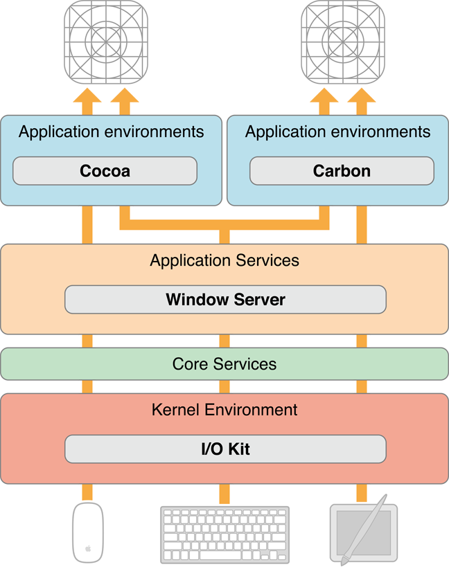
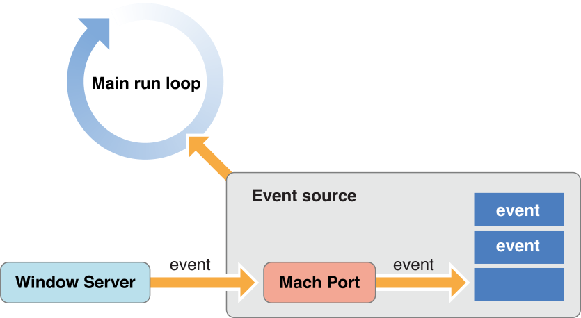
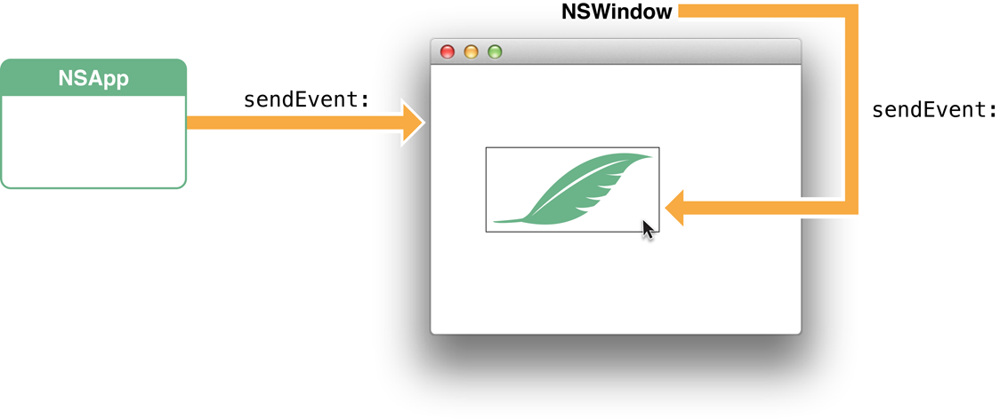
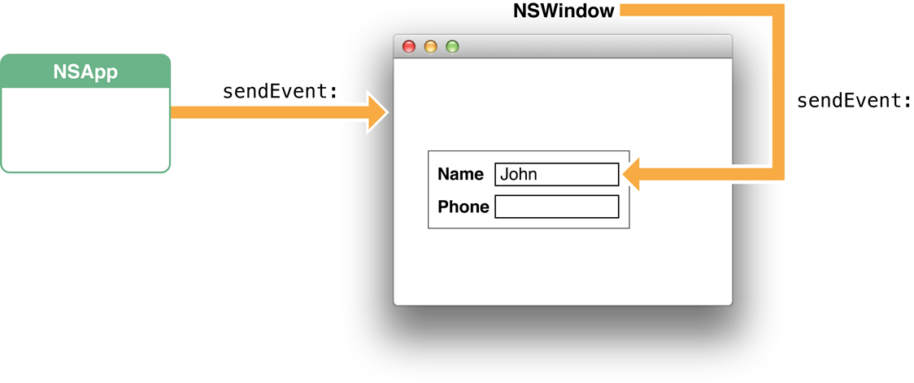
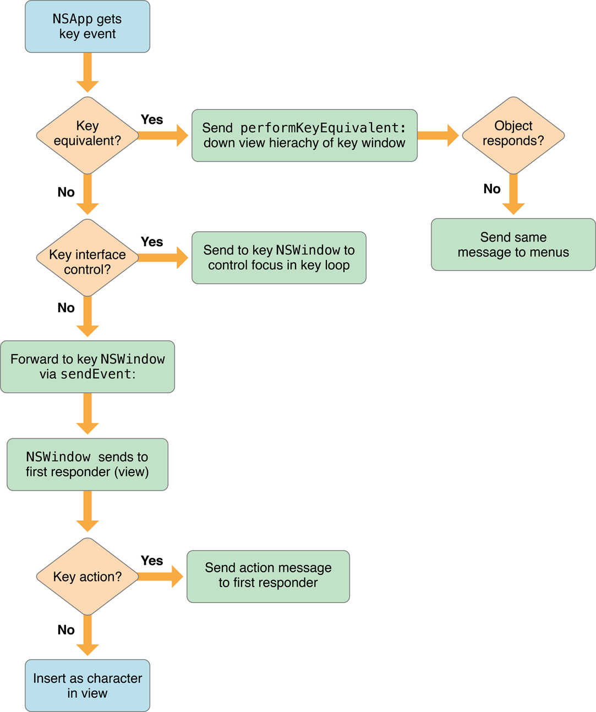
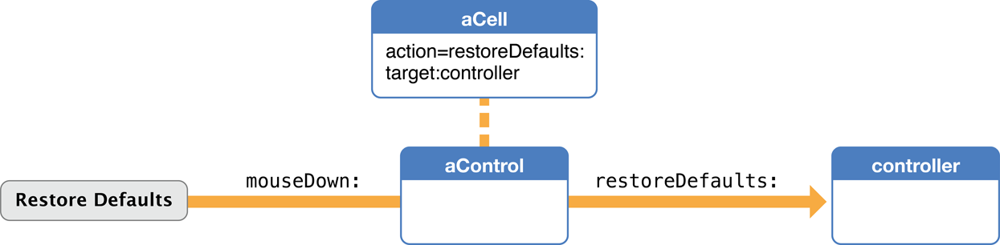
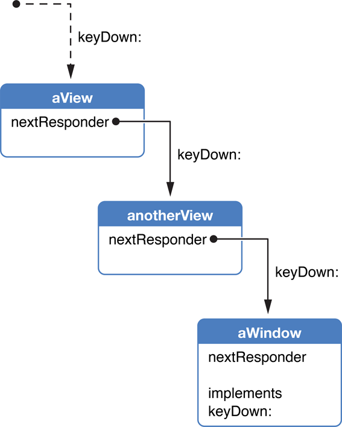
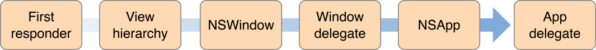
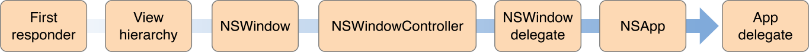
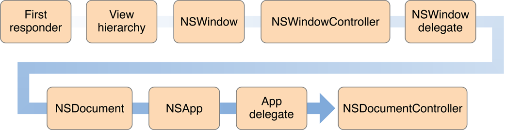

> 导航：[总目录](../../../README.md) · [documentation](../../../_indexes/documentation.md) · [Cocoa Event Handling Guide](Introduction.md)


[Next](Event%20Objects%20and%20Types.md)[Previous](Introduction.md)

# Event Architecture

The path taken by an event to the object in a Cocoa application that finally handles it can be a complicated one. This chapter traces the possible paths of events of various types and describes the mechanisms and architectural designs for handling events in the Application Kit.

For further background, [About OS X App Design](https://developer.apple.com/library/archive/documentation/General/Conceptual/MOSXAppProgrammingGuide/Introduction/Introduction.html#//apple_ref/doc/uid/TP40010543-CH1) in _[Mac App Programming Guide](../../General/Mac%20App%20Programming%20Guide/About%20OS%20X%20App%20Design.md#apple-f4xwc4dqnrsv64tfmyxwi33df52wszbpkridimbqgeydknbt)_ is recommended reading.

An event is a low-level record of a user action that is usually routed to the application in which the action occurred. A typical event in OS X originates when the user manipulates an input device attached to a computer system, such as a keyboard, mouse, or tablet stylus. When the user presses a key or clicks a button or moves a stylus, the device detects the action and initiates a transfer of data to the device driver associated with it. Through the I/O Kit, the device driver creates a low-level event, puts it in the window server's event queue, and notifies the window server. The window server dispatches the event to the appropriate run-loop port of the target process. From there the event is forwarded to the event-handling mechanism appropriate to the application environment. Figure 1-1 depicts this event-delivery system.

__Figure 1-1__  The event stream



Before it dispatches an event to an application, the window server processes it in various ways; it time-stamps it, annotates it with the associated window and process port, and possibly performs other tasks as well. As an example, consider what happens when a user presses a key. The device driver translates the raw scan code into a virtual key code which it then passes off (along with other information about the key-press) to the window server in an event record. The window server has a translation facility that converts the virtual key code into a Unicode character.

In OS X, events are delivered as an asynchronous stream. This event stream proceeds “upward” (in an architectural sense) through the various levels of the system—the hardware to the window server to the Event Manager—until each event reaches its final destination: an application. As it passes through each subsystem, an event may change structure but it still identifies a specific user action.

Every application has a mechanism specific to its environment for receiving events from the window server. For a Cocoa application, that mechanism is called the main event loop. A run loop, which in Cocoa is an [NSRunLoop](https://developer.apple.com/library/archive/documentation/LegacyTechnologies/WebObjects/WebObjects_3.5/Reference/Frameworks/ObjC/Foundation/Classes/NSRunLoop/Description.html#//apple_ref/occ/cl/NSRunLoop) object, enables a process to receive input from various sources. By default, every thread in OS X has its own run loop, and the run loop of the main thread of a Cocoa application is called the main event loop. What especially distinguishes the main event loop is an input source called the event source, which is constructed when the [global](https://developer.apple.com/library/archive/documentation/General/Conceptual/DevPedia-CocoaCore/Singleton.html#//apple_ref/doc/uid/TP40008195-CH49) [NSApplication](https://developer.apple.com/documentation/appkit/nsapplication) object ([NSApp](https://developer.apple.com/documentation/appkit/nsapp)) is initialized. The event source consists of a port for receiving events from the window server and a FIFO queue—the event queue—for holding those events until the application can process them, as shown in Figure 1-2.

__Figure 1-2__  The main event loop, with event source



A Cocoa application is event driven: It fetches an event from the queue, dispatches it to an appropriate object, and, after the event is handled, fetches the next event. With some exceptions (such as modal event loops) an application continues in this pattern until the user quits it. The following section, Event Dispatch, describes how an application fetches and dispatches events.

Events delivered via the event source are not the only kinds of events that enter Cocoa applications. An application can also respond to Apple events, high-level interprocess events typically sent by other processes such as the Finder and Launch Services. For example, when users double-click an application icon to open the application or double-click a document to open the document, an Apple event is sent to the target application. An application also fetches Apple events from the queue but it does not convert them into `NSEvent` objects. Instead an Apple event is handled directly by an event handler. When an application launches, it automatically registers several event handlers for this purpose. For more on Apple events and event handlers, see _[Apple Events Programming Guide](../../Apple%20Script/Apple%20Events%20Programming%20Guide/Introduction%20to%20Apple%20Events%20Programming%20Guide.md#apple-f4xwc4dqnrsv64tfmyxwi33df52wszbpkridimbqgaytinbz)_.

In the main event loop, the application object (`NSApp`) continuously gets the next (topmost) event in the event queue, converts it to an [NSEvent](https://developer.apple.com/documentation/appkit/nsevent) object, and dispatches it toward its final destination. It performs this fetching of events by invoking the [nextEventMatchingMask:untilDate:inMode:dequeue:](https://developer.apple.com/documentation/appkit/nsapplication/1428485-nexteventmatchingmask) method in a closed loop. When there are no events in the event queue, this method blocks, resuming only when there are more events to process.

After fetching and converting an event, `NSApp` performs the first stage of event dispatching in the [sendEvent:](https://developer.apple.com/documentation/appkit/nsapplication/1428359-sendevent) method. In most cases `NSApp` merely forwards the event to the window in which the user action occurred by invoking the [sendEvent:](https://developer.apple.com/documentation/appkit/nswindow/1419228-sendevent) method of that `NSWindow` object. The window object then dispatches most events to the [NSView](https://developer.apple.com/documentation/appkit/nsview) object associated with the user action in an `NSResponder` message such as [mouseDown:](https://developer.apple.com/documentation/appkit/nsresponder/1524634-mousedown) or [keyDown:](https://developer.apple.com/documentation/appkit/nsresponder/1525805-keydown). An event message includes as its sole argument an [NSEvent](https://developer.apple.com/documentation/appkit/nsevent) object describing the event.

The object receiving an event message differs slightly by type of event. For mouse and tablet events, the [NSWindow](https://developer.apple.com/documentation/appkit/nswindow) object dispatches the event to the view over which the user pressed the mouse or stylus button. It dispatches most key events to the first responder of the key window. Figure 1-3 and Figure 1-4 illustrate these different general delivery paths. The destination view may decide not to handle the event, instead passing it up the responder chain (see [The Responder Chain](#apple-f4xwc4dqnrsv64tfmyxwi33df52wszbpgeydambqga3da2jninedglktk4za)).

__Figure 1-3__  Path of a mouse event



__Figure 1-4__  Path of a key event (character to insert)



In the preceding paragraph you might have noticed the use of qualifiers such as “in most cases” and “usually.“ The delivery of an event (and especially a key event) in Cocoa can take many different paths depending on the particular kind of event. Some events, many of which are defined by the Application Kit (type [NSAppKitDefined](https://developer.apple.com/documentation/appkit/nsappkitdefined)), have to do with actions controlled by a window or the application object itself. Examples of these events are those related to activating, deactivating, hiding, and showing the application. `NSApp` filters out these events early in its dispatch routine and handles them itself.

The following sections describe the different paths of the events that can reach your view objects. For detailed information on these event types, read [Event Objects and Types](Event%20Objects%20and%20Types.md#apple-f4xwc4dqnrsv64tfmyxwi33df52wszbpgeydambqga3da2jninedilktk42a).

As noted above, an `NSWindow` object in its [sendEvent:](https://developer.apple.com/documentation/appkit/nswindow/1419228-sendevent) method forwards mouse events to the view over which the user action involving the mouse occurred. It identifies the view to receive the event by invoking the `NSView` method [hitTest:](https://developer.apple.com/documentation/appkit/nsview/1483364-hittest), which returns the lowest descendant that contains the cursor location of the event (this is usually the topmost view displayed). The window object forwards the mouse event to this view by sending it a mouse-related `NSResponder` message specific to its exact type, such as [mouseDown:](https://developer.apple.com/documentation/appkit/nsresponder/1524634-mousedown), [mouseDragged:](https://developer.apple.com/documentation/appkit/nsresponder/1527420-mousedragged), or [rightMouseUp:](https://developer.apple.com/documentation/appkit/nsresponder/1526309-rightmouseup), On (left) mouse-down events, the window object also asks the receiving view whether it is willing to become first responder for subsequent key events and action messages.

A view object can receive mouse events of three general types: mouse clicks, mouse drags, and mouse movements. Mouse-click events are further categorized—as specific [NSEventType](https://developer.apple.com/documentation/appkit/nsevent/eventtype) constants and `NSResponder` methods—by mouse button (left, right, or other) and direction of click (up or down). Mouse-dragged and mouse-up events are typically sent to the same view that received the most recent mouse-down event. Mouse-moved events are sent to the first responder. Mouse-down, mouse-dragged, mouse-up, and mouse-moved events can occur only in certain situations relative to other mouse events:

- Each mouse-up event must be preceded by a mouse-down event.
- Mouse-dragged events occur only between a mouse-down event and a mouse-up event.
- Mouse-moved events do not occur between a mouse-down and a mouse-up event.

Mouse-down events are sent when a user presses the mouse button while the cursor is over a view object. If the window containing the view is not the key window, the window becomes the key window and discards the mouse-down event. However, a view can circumvent this default behavior by overriding the [acceptsFirstMouse:](https://developer.apple.com/documentation/appkit/nsview/1483410-acceptsfirstmouse) method of `NSView` to return `YES`.

Views automatically receive mouse-clicked and mouse-dragged events, but because mouse-moved events occur so often and can bog down the event queue, a view object must explicitly request its window to watch for them using the `NSWindow` method [setAcceptsMouseMovedEvents:](https://developer.apple.com/documentation/appkit/nswindow/1419340-acceptsmousemovedevents). Tracking rectangles, described in [Other Event Dispatching](#apple-f4xwc4dqnrsv64tfmyxwi33df52wszbpgeydambqga3da2jninedglktk43a), are a less expensive way of following the mouse’s location.

In its implementation of an `NSResponder` mouse-event method, a subclass of [NSView](https://developer.apple.com/documentation/appkit/nsview) can interpret a mouse event as a cue to perform a certain action, such as sending a target-action message, selecting a graphic element, redrawing itself at a different location, and so on. Each event method includes as its sole parameter an [NSEvent](https://developer.apple.com/documentation/appkit/nsevent) object from which the view can obtain information about the event. For example, the view can use the [locationInWindow](https://developer.apple.com/documentation/appkit/nsevent/1529068-locationinwindow) to locate the mouse cursor’s hot spot in the coordinate system of the receiver’s window. To convert it to the view’s coordinate system, use [convertPoint:fromView:](https://developer.apple.com/documentation/appkit/nsview/1483269-convertpoint) with a `nil` view argument. From here, you can use [mouse:inRect:](https://developer.apple.com/documentation/appkit/nsview/1483237-ismousepoint) to determine whether the click occurred in an interesting area.

Tablet events take a path to delivery to a view that is similar to that for mouse events. The `NSWindow` object representing the window in which the tablet event occurred forwards the event to the view under the cursor. However, there are two kinds of tablet events, proximity events and pointer events. The former are generally native tablet events (of type [NSTabletProximity](https://developer.apple.com/documentation/appkit/nstabletproximity)) generated when the stylus moves into and out of proximity to the tablet. Tablet pointer events occur between proximity-entering and proximity-leaving tablet events and indicate such things as stylus direction, pressure, and button click. Pointer events are generally subtypes of mouse events. Refer to [Handling Tablet Events](Handling%20Tablet%20Events.md#apple-f4xwc4dqnrsv64tfmyxwi33df52wszbpgeydambqga3da2jninedcmbnknltc) for more information.

For the paths taken by mouse-tracking and cursor-update events, see [Other Event Dispatching](#apple-f4xwc4dqnrsv64tfmyxwi33df52wszbpgeydambqga3da2jninedglktk43a).

Processing keyboard input is by far the most complex part of event dispatch. The Application Kit goes to great lengths to ease this process for you, and in fact handling the key events that get to your custom objects is fairly straightforward. However, a lot happens to those events on their way from the hardware to the responder chain. Of particular interest are the types of key events that arrive in a Cocoa application as [NSEvent](https://developer.apple.com/documentation/appkit/nsevent) objects and the order and way these types of events are handled.

A Cocoa application evaluates each key event to determine what kind of key event it is and then handles in an appropriate way. The path a key event can take before it is handled can be quite long. Figure 1-5 shows these potential paths.

__Figure 1-5__  Possible path of a key event



The following list describes in detail the possible paths for key events, in the order in which an application evaluates each key event;

1. _Key equivalents_. A key equivalent is a key or key combination (usually a key modified by the Command key) that is bound typically to some menu item or control object in the application. Pressing the key combination simulates the action of clicking the control or choosing the menu item.

   The application object handles key equivalents by going _down_ the view hierarchy in the key window, sending each object a [performKeyEquivalent:](https://developer.apple.com/documentation/appkit/nsresponder/1524690-performkeyequivalent) message until an object returns `YES`. If the message isn’t handled by an object in the view hierarchy, `NSApp` then sends it to the menus in the menu bar. Some Cocoa classes, such as [NSButton](https://developer.apple.com/documentation/appkit/nsbutton), [NSMenu](https://developer.apple.com/documentation/appkit/nsmenu), [NSMatrix](https://developer.apple.com/documentation/appkit/nsmatrix), and [NSSavePanel](https://developer.apple.com/documentation/appkit/nssavepanel) provide default implementations.

   For more information, see [Handling Key Equivalents](Handling%20Key%20Events.md#apple-f4xwc4dqnrsv64tfmyxwi33df52wszbpgeydambqga3da2jninedolktk4ytc).
2. _Keyboard interface control_. A keyboard interface control event manipulates the input focus among objects in a user interface. In the key window, [NSWindow](https://developer.apple.com/documentation/appkit/nswindow) interprets certain keys as commands to move control to a different interface object, to simulate a mouse click on it, and so on. For example, pressing the Tab key moves input focus to the next object; Shift-Tab reverses the direction; pressing the space bar simulates a click on a button. The order of interface objects controlled through this mechanism is specified by a key view loop. You can set up the key view loop in Interface Builder and you can manipulate the key view loop programmatically through the [setNextKeyView:](https://developer.apple.com/documentation/appkit/nsview/1483465-nextkeyview) and [nextKeyView](https://developer.apple.com/documentation/appkit/nsview/1483465-nextkeyview) methods of `NSView`.

   For more information, see [Keyboard Interface Control](Handling%20Key%20Events.md#apple-f4xwc4dqnrsv64tfmyxwi33df52wszbpgeydambqga3da2jninedolktk44q).
3. __Keyboard action__. Unlike the action messages that controls send to their targets (see [Action Messages](#apple-f4xwc4dqnrsv64tfmyxwi33df52wszbpgeydambqga3da2jninedglktk43q)), keyboard actions are commands (represented by methods defined by the [NSResponder](https://developer.apple.com/documentation/appkit/nsresponder) class) that are per-view functional interpretations of physical keystrokes (as identified by the constant returned by the [characters](https://developer.apple.com/documentation/appkit/nsevent/1534183-characters) method of `NSEvent`). In other words, keyboard actions are bound to physical keys through the key bindings mechanism described in [Text System Defaults and Key Bindings](Text%20System%20Defaults%20and%20Key%20Bindings.md#apple-f4xwc4dqnrsv64tfmyxwi33df52wszbpgiydambqgq3dqlkdjjbeirkbirda). For example, `pageDown:`, `moveToBeginningOfLine:`, and `capitalizeWord:` are methods invoked by keyboard actions when the bound key is pressed. Such actions are sent to the first responder, and the methods handling these actions can be implemented in that view or in a superview further up the responder chain.

   See [Overriding the keyDown: Method](Handling%20Key%20Events.md#apple-f4xwc4dqnrsv64tfmyxwi33df52wszbpgeydambqga3da2jninedolktk4za) for more information about the handling of keyboard actions.
4. __Character (or characters) for insertion as text__.

If the application object processes a key event and it turns out _not_ to be a key equivalent or a key interface control event, it then sends it to the key window in a [sendEvent:](https://developer.apple.com/documentation/appkit/nswindow/1419228-sendevent) message. The window object invokes the [keyDown:](https://developer.apple.com/documentation/appkit/nsresponder/1525805-keydown) method in the first responder, from whence the key event travels _up_ the responder chain until it is handled. At this point, the key event can be either one or more Unicode character to be inserted into a view’s displayed text , a key or key combination to be specially interpreted, or a keyboard-action event.

See [Handling Key Events](Handling%20Key%20Events.md#apple-f4xwc4dqnrsv64tfmyxwi33df52wszbpgeydambqga3da2jninedolktk4yq) for more information about how key events are dispatched and handled.

An `NSWindow` object monitors tracking-rectangle events and dispatches these events directly to the owning object in [mouseEntered:](https://developer.apple.com/documentation/appkit/nsresponder/1529306-mouseentered) and [mouseExited:](https://developer.apple.com/documentation/appkit/nsresponder/1527561-mouseexited) messages. The owner is specified in the second parameter of the `NSTrackingArea` method [initWithRect:options:owner:userInfo:](https://developer.apple.com/documentation/appkit/nstrackingarea/1524488-initwithrect) and the `NSView` method[addTrackingRect:owner:userData:assumeInside:](https://developer.apple.com/documentation/appkit/nsview/1483668-addtrackingrect). [Using Tracking-Area Objects](Using%20Tracking-Area%20Objects.md#apple-f4xwc4dqnrsv64tfmyxwi33df52wszbpgeydambqga3da2jninedqlktk4yq) describes how to set up tracking rectangles and handle the related events.

Periodic events (type [NSPeriodic](https://developer.apple.com/documentation/appkit/nsperiodic)) are generated by the application at a specified frequency and placed in the event queue. However, unlike most other types of events, periodic events aren’t dispatched using the [sendEvent:](https://developer.apple.com/documentation/appkit/nsapplication/1428359-sendevent) mechanism of [NSApplication](https://developer.apple.com/documentation/appkit/nsapplication) and [NSWindow](https://developer.apple.com/documentation/appkit/nswindow). Instead the object registering for the periodic events typically retrieves them in a modal event loop using the [nextEventMatchingMask:untilDate:inMode:dequeue:](https://developer.apple.com/documentation/appkit/nsapplication/1428485-nexteventmatchingmask) method. See [Other Types of Events](Event%20Objects%20and%20Types.md#apple-f4xwc4dqnrsv64tfmyxwi33df52wszbpgeydambqga3da2jninedilktk43a) for more information about periodic events.

The discussion so far has focused on event messages: messages arising from an device-related event such as a mouse click or a key-press. The Application Kit sends an event message of the appropriate form—for example, [mouseDown:](https://developer.apple.com/documentation/appkit/nsresponder/1524634-mousedown) and [keyDown:](https://developer.apple.com/documentation/appkit/nsresponder/1525805-keydown)—to an [NSResponder](https://developer.apple.com/documentation/appkit/nsresponder) object for handling.

But `NSResponder` objects are also expected to handle another kind of message: action messages. Actions are commands that objects, usually [NSControl](https://developer.apple.com/documentation/appkit/nscontrol) or [NSMenu](https://developer.apple.com/documentation/appkit/nsmenu) objects, give to the application object to dispatch as messages to a particular target or to any target that’s willing to respond to them. The methods invoked by action messages have a specific signature: a single parameter holding a reference to the object initiating the action message; by convention, the name of this parameter is _sender_. For example,

```objc
- (void)moveToEndOfLine:(id)sender; // from NSResponder.h
```

Event and action methods are dispatched in different ways, by different methods. Nearly all events enter an application from the window server and are dispatched automatically by the [sendEvent:](https://developer.apple.com/documentation/appkit/nsapplication/1428359-sendevent) method of `NSApplication`. Action messages, on the other hand, are dispatched by the [sendAction:to:from:](https://developer.apple.com/documentation/appkit/nsapplication/1428509-sendaction) method of the global application object (`NSApp`) to their proper destinations.

As illustrated in Figure 1-6, action messages are generally sent as a secondary effect of an event message. When a user clicks a control object such as a button, two event messages (`mouseDown:` and `mouseUp:`) are sent as a result. The control and its associated cell handle the `mouseUp:` message (in part) by sending the application object a `sendAction:to:from:` message. The first argument is the [selector](https://developer.apple.com/library/archive/documentation/General/Conceptual/DevPedia-CocoaCore/Selector.html#//apple_ref/doc/uid/TP40008195-CH48) identifying the action method to invoke. The second is the intended recipient of the message, called the target, which can be `nil`. The final argument is usually the object invoking `sendAction:to:from:`, thus indicating which object initiated the action message. The target of an action message can send messages back to _sender_ to get further information. A similar sequence occurs for menus and menu items. For more on the architecture of controls and cells (and menus and menu items) see [The Core App Design](https://developer.apple.com/library/archive/documentation/General/Conceptual/MOSXAppProgrammingGuide/CoreAppDesign/CoreAppDesign.html#//apple_ref/doc/uid/TP40010543-CH3) in _[Mac App Programming Guide](../../General/Mac%20App%20Programming%20Guide/About%20OS%20X%20App%20Design.md#apple-f4xwc4dqnrsv64tfmyxwi33df52wszbpkridimbqgeydknbt)_.

__Figure 1-6__  From event message to action message



The target of an action message is handled by the Application Kit in a special way. If the intended target isn’t `nil`, the action is simply sent directly to that object; this is called a targeted action message. In the case of an untargeted action message (that is, the target parameter is `nil`), `sendAction:to:from:` searches up the full responder chain (starting with the first responder) for an object that implements the action method specified. If it finds one, it sends the message to that object with the initiator of the action message as the sole argument. The receiver of the action message can then query the sender for additional information. You can find the recipient of an untargeted action message without actually sending the message using `targetForAction:`.

Event messages form a well-known set, so `NSResponder` provides declarations and default implementations for all of them. Most action messages, however, are defined by custom classes and can’t be predicted. However, `NSResponder` does declare a number of keyboard action methods, such as `pageDown:`, `moveToBeginningOfDocument:`, and `cancelOperation:`. These action methods are typically bound to specific keys using the key-bindings mechanism and are meant to perform cursor movement, text operations, and similar operations.

A more general mechanism of action-message dispatch is provided by the `NSResponder` method [tryToPerform:with:](https://developer.apple.com/documentation/appkit/nsresponder/1524516-trytoperform). This method checks the receiver to see if it responds to the selector provided, if so invoking the message. If not, it sends `tryToPerform:with:` to its next responder. `NSWindow` and `NSApplication` [override](https://developer.apple.com/library/archive/documentation/General/Conceptual/DevPedia-CocoaCore/MethodOverriding.html#//apple_ref/doc/uid/TP40008195-CH57) this method to include their delegates, but they don’t link individual responder chains in the way that the `sendAction:to:from:` method does. Similar to `tryToPerform:with:` is `doCommandBySelector:`, which takes a method selector and tries to find a responder that implements it. If none is found, the method causes the hardware to beep.

A responder is an object that can receive events, either directly or through the responder chain, by virtue of its inheritance from the [NSResponder](https://developer.apple.com/documentation/appkit/nsresponder) class. [NSApplication](https://developer.apple.com/documentation/appkit/nsapplication), [NSWindow](https://developer.apple.com/documentation/appkit/nswindow), [NSDrawer](https://developer.apple.com/documentation/appkit/nsdrawer), [NSWindowController](https://developer.apple.com/documentation/appkit/nswindowcontroller), [NSView](https://developer.apple.com/documentation/appkit/nsview) and the many descendants of these classes in the Application Kit inherit from `NSResponder`. This class defines the programmatic interface for the reception of event messages and many action messages. It also defines the general structure of responder behavior. Within the responder chain there is a first responder and a sequence of next responders

For more on the responder chain, see [The Responder Chain](#apple-f4xwc4dqnrsv64tfmyxwi33df52wszbpgeydambqga3da2jninedglktk4za).

A first responder is typically a user-interface object that the user selects or activates with the mouse or keyboard. It is usually the first object in a responder chain to receive an event or action message. An `NSWindow` object’s first responder is initially itself; however, you can set, programmatically and in Interface Builder, the object that is made first responder when the window is first placed on-screen.

When an `NSWindow` object receives a mouse-down event, it automatically tries to make the [NSView](https://developer.apple.com/documentation/appkit/nsview) object under the event the first responder. It does so by asking the view whether it wants to become first responder, using the [acceptsFirstResponder](https://developer.apple.com/documentation/appkit/nsresponder/1528708-acceptsfirstresponder) method defined by this class. This method returns `NO` by default; responder subclasses that need to be first responder must override it to return `YES`. The [acceptsFirstResponder](https://developer.apple.com/documentation/appkit/nsresponder/1528708-acceptsfirstresponder) method is also invoked when the user changes the first responder through the keyboard interface control feature.

You can programmatically change the first responder by sending [makeFirstResponder:](https://developer.apple.com/documentation/appkit/nswindow/1419366-makefirstresponder) to an `NSWindow` object. This message initiates a kind of protocol in which one object loses its first responder status and another gains it. See [Setting the First Responder](Event%20Handling%20Basics.md#apple-f4xwc4dqnrsv64tfmyxwi33df52wszbpgeydambqga3da2jninedklktk4za) for further information.

An [NSPanel](https://developer.apple.com/documentation/appkit/nspanel) object presents a variation of first-responder behavior that permits panels to present a user interface that doesn’t take away key focus from the main window. If the panel object representing an inactive window and returning `YES` from [becomesKeyOnlyIfNeeded](https://developer.apple.com/documentation/appkit/nspanel/1528836-becomeskeyonlyifneeded) receives a mouse-down event, it attempts to make the view object under the mouse pointer the first responder, but _only_ if that object returns `YES` in [acceptsFirstResponder](https://developer.apple.com/documentation/appkit/nsresponder/1528708-acceptsfirstresponder) and [needsPanelToBecomeKey](https://developer.apple.com/documentation/appkit/nsview/1483512-needspaneltobecomekey).

Mouse-moved events (type [NSMouseMoved](https://developer.apple.com/documentation/appkit/nsmousemoved)) are always sent to the first responder, not to the view under the mouse.

Every responder object has a built-in capability for getting the next responder up the responder chain. The [nextResponder](https://developer.apple.com/documentation/appkit/nsresponder/1528245-nextresponder) method, which returns this object, is the essential mechanism of the responder chain. Figure 1-7 shows the sequence of next responders.

__Figure 1-7__  The chain of next responders



A view’s next responder is always its superview—most of the responder chain, in fact, comprises the views from a window’s first responder up to its content view. When you create a window or add subviews to existing views, either programmatically or in Interface Builder, the Application Kit automatically hooks up the next responders in the responder chain. The [addSubview:](https://developer.apple.com/documentation/appkit/nsview/1483783-addsubview) method of `NSView` automatically sets the receiver as the new subview’s superview. If you interpose a different responder between views, be sure to verify and potentially fix the responder chain after adding or removing views from the view hierarchy.

The responder chain is a linked series of responder objects to which an event or action message is applied. When a given responder object doesn’t handle a particular message, the object passes the message to its successor in the chain (that is, its next responder). This allows responder objects to delegate responsibility for handling the message to other, typically higher-level objects. The Application Kit automatically constructs the responder chain as described below, but you can insert custom objects into parts of it using the [NSResponder](https://developer.apple.com/documentation/appkit/nsresponder) method [setNextResponder:](https://developer.apple.com/documentation/appkit/nsresponder/1528245-nextresponder) and you can examine it (or traverse it) with [nextResponder](https://developer.apple.com/documentation/appkit/nsresponder/1528245-nextresponder).

An application can contain any number of responder chains, but only one is active at any given time. The responder chain is different for event messages and action messages, as described in the following sections.

Nearly all event messages apply to a single window’s responder chain—the window in which the associated user event occurred. The default responder chain for event messages begins with the view that the [NSWindow](https://developer.apple.com/documentation/appkit/nswindow) object first delivers the message to. The default responder chain for a key event message begins with the first responder in a window; the default responder chain for a mouse or tablet event begins with the view on which the user event occurred. From there the event, if not handled, proceeds up the view hierarchy to the [NSWindow](https://developer.apple.com/documentation/appkit/nswindow) object representing the window itself. The first responder is typically the “selected” view object within the window, and its next responder is its containing view (also called its superview), and so on up to the `NSWindow` object. If an [NSWindowController](https://developer.apple.com/documentation/appkit/nswindowcontroller) object is managing the window, it becomes the final next responder. You can insert other responders between [NSView](https://developer.apple.com/documentation/appkit/nsview) objects and even above the `NSWindow` object near the top of the chain. These inserted responders receive both event and action messages. If no object is found to handle the event, the last responder in the chain invokes [noResponderFor:](https://developer.apple.com/documentation/appkit/nsresponder/1534197-noresponderfor), which for a key-down event simply beeps. Event-handling objects (subclasses of `NSWindow` and `NSView`) can override this method to perform additional steps as needed.

For action messages, the Application Kit constructs a more elaborate responder chain that varies according to two factors:

- Whether the application is based on the document architecture and, if it isn't, whether it uses [NSWindowController](https://developer.apple.com/documentation/appkit/nswindowcontroller) objects for its windows
- Whether the application is currently displaying a key window as well as a main window

Action messages have a more elaborate responder chain than do event messages because actions require a more flexible runtime mechanism for determining their targets. They are not restricted to a single window, as are event messages.

The simplest case is an active non-document-based window that has no associated panel or secondary window displayed—in other words, a main window that is also the key window. In this case, the responder chain is the following:

1. The main window’s first responder and the successive responder objects up the view hierarchy
2. The main window itself
3. The main window’s [delegate](https://developer.apple.com/library/archive/documentation/General/Conceptual/DevPedia-CocoaCore/Delegation.html#//apple_ref/doc/uid/TP40008195-CH14) (which need not inherit from [NSResponder](https://developer.apple.com/documentation/appkit/nsresponder))
4. The application object, `NSApp`
5. The application object’s delegate (which need not inherit from `NSResponder`)

This chain is shown graphically in Figure 1-8.

__Figure 1-8__  Responder chain of a non-document-based application for action messages



As this sequence indicates, the `NSWindow` object and the `NSApplication` object give their delegates a chance to handle action messages as though they were responders, even though a delegate isn’t formally in the responder chain (that is, a `nextResponder` message to a window or application object doesn’t return the delegate).

When an application is displaying both a main window and a key window, the responder chains of both windows can be involved in an action message. As explained in [Window Layering and Types of Windows](https://developer.apple.com/library/archive/documentation/Cocoa/Conceptual/WinPanel/Concepts/ChangingMainKeyWindow.html#//apple_ref/doc/uid/20000236), the main window is the frontmost document or application window. Often main windows also have key status, meaning they are the current focus of user input. But a main window can have a secondary window or panel associated with it, such as the Find panel or a Info window showing details of a selection in the document window. When this secondary window is the focus of user input, then it is the key window.

When an application has a main window _and_ a separate key window displayed, the responder chain of the key window gets first crack at action messages, and the responder chain of the main window follows. The full responder chain comprises these responders and delegates:

1. The key window’s first responder and the successive responder objects up the view hierarchy
2. The key window itself
3. The key window’s [delegate](https://developer.apple.com/library/archive/documentation/General/Conceptual/DevPedia-CocoaCore/Delegation.html#//apple_ref/doc/uid/TP40008195-CH14) (which need not inherit from `NSResponder`)
4. The main window’s first responder and the successive responder objects up the view hierarchy
5. The main window itself
6. The main window’s delegate (which need not inherit from `NSResponder`)
7. The application object, `NSApp`
8. The application object’s delegate (which need not inherit from `NSResponder`)

As you can see, the responder chains for the key window and the main window are identical with the [global](https://developer.apple.com/library/archive/documentation/General/Conceptual/DevPedia-CocoaCore/Singleton.html#//apple_ref/doc/uid/TP40008195-CH49) application object and its [delegate](https://developer.apple.com/library/archive/documentation/General/Conceptual/DevPedia-CocoaCore/Delegation.html#//apple_ref/doc/uid/TP40008195-CH14) being the responders at the end of the main window's responder chain. This design is true for the responder chains of the other kinds of applications: those based on the document architecture and those that use an `NSWindowController` object for window management. In the latter case, the default main-window responder chain consists of the following responders and delegates:

1. The main window’s first responder and the successive responder objects up the view hierarchy
2. The main window itself
3. The window's `NSWindowController` object (which inherits from `NSResponder`)
4. The main window’s delegate
5. The application object, `NSApp`
6. The application object's delegate

Figure 1-9 shows the responder chain of non-document-based application that uses an NSWindowController object.

__Figure 1-9__  Responder chain of a non-document application with an `NSWindowController` object (action messages)



For document-based applications, the default responder chain for the main window consists of the following responders and delegates:

1. The main window’s first responder and the successive responder objects up the view hierarchy
2. The main window itself
3. The window's `NSWindowController` object (which inherits from `NSResponder`)
4. The main window’s [delegate](https://developer.apple.com/library/archive/documentation/General/Conceptual/DevPedia-CocoaCore/Delegation.html#//apple_ref/doc/uid/TP40008195-CH14).
5. The `NSDocument` object (if different from the main window’s delegate)
6. The application object, `NSApp`
7. The application object's delegate
8. The application's document controller (an [NSDocumentController](https://developer.apple.com/documentation/appkit/nsdocumentcontroller) object, which does not inherit from `NSResponder`)

Figure 1-10 shows the responder chain of a document-based application.

__Figure 1-10__  Responder chain of a document-based application for action messages



The responder chain is used by three other mechanisms in the Application Kit:

- __Automatic menu item and toolbar item enabling__: In automatically enabling and disabling a menu item with a `nil` target, an [NSMenu](https://developer.apple.com/documentation/appkit/nsmenu) searches different responder chains depending on whether the menu object represents the application menu or a context menu. For the application menu, `NSMenu` consults the full responder chain—that is, first key, then main window—to find an object that implements the menu item’s action method and (if it implements it) returns `YES` from [validateMenuItem:](https://developer.apple.com/documentation/objectivec/nsobject/1518160-validatemenuitem). For a context menu, the search is restricted to the responder chain of the window in which the context menu was displayed, starting with the associated view.

  Enabling and disabling of toolbar items makes use of the responder chain in a fashion identical to that of menu items. In this case, the key validation method is `validateToolbarItem:`.

  For more on automatic menu-item enabling, see [Enabling Menu Items](https://developer.apple.com/library/archive/documentation/Cocoa/Conceptual/MenuList/Articles/EnablingMenuItems.html#//apple_ref/doc/uid/20000261); for more on validation of toolbar items, see [Validating Toolbar Items](https://developer.apple.com/library/archive/documentation/Cocoa/Conceptual/Toolbars/Tasks/ValidatingTBItems.html#//apple_ref/doc/uid/20000753).
- __Services eligibility__: Similarly, the Services facility passes [validRequestorForSendType:returnType:](https://developer.apple.com/documentation/appkit/nsresponder/1524638-validrequestor) messages along the full responder chain to check for objects that are eligible for services offered by other applications.

  For further information, see _[Services Implementation Guide](../Services%20Implementation%20Guide/Introduction.md#apple-f4xwc4dqnrsv64tfmyxwi33df52wszbpgeydambqgeydc2i)_.
- __Error presentation__: The Application Kit uses a modified version of the responder chain for error handling and error presentation, centered upon the `NSResponder` methods [presentError:modalForWindow:delegate:didPresentSelector:contextInfo:](https://developer.apple.com/documentation/appkit/nsresponder/1534705-presenterror) and [presentError:](https://developer.apple.com/documentation/appkit/nsresponder/1531294-presenterror).

  For more information on the error-responder chain, see _[Error Handling Programming Guide](../Error%20Handling%20Programming%20Guide/Introduction%20to%20Error%20Handling%20Programming%20Guide%20For%20Cocoa.md#apple-f4xwc4dqnrsv64tfmyxwi33df52wszbpkridimbqgaytqmbw)_.

[Next](Event%20Objects%20and%20Types.md)[Previous](Introduction.md)

