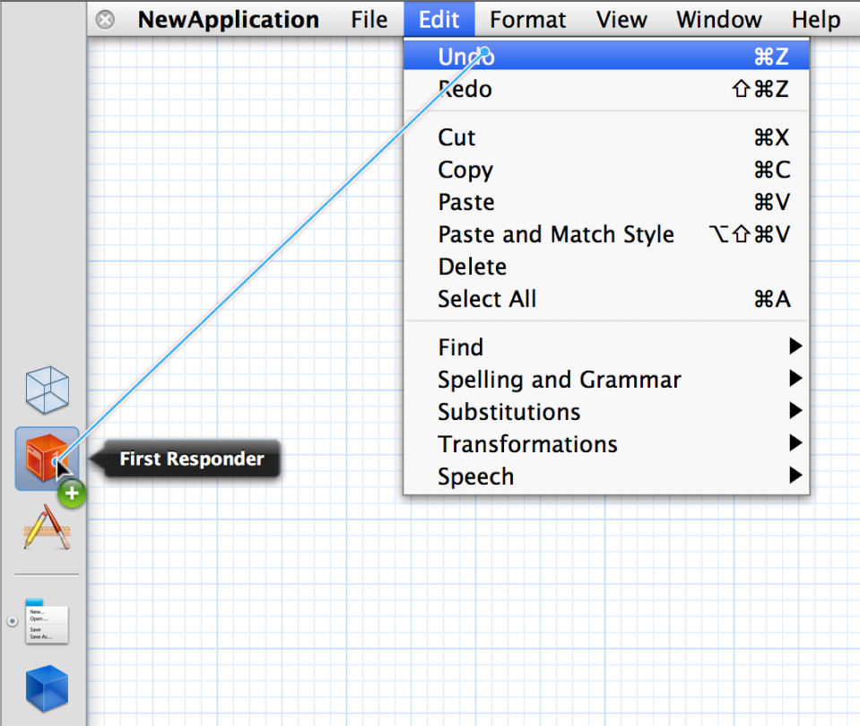
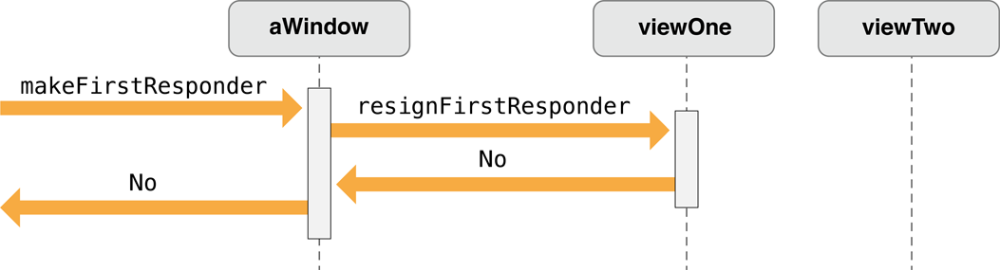
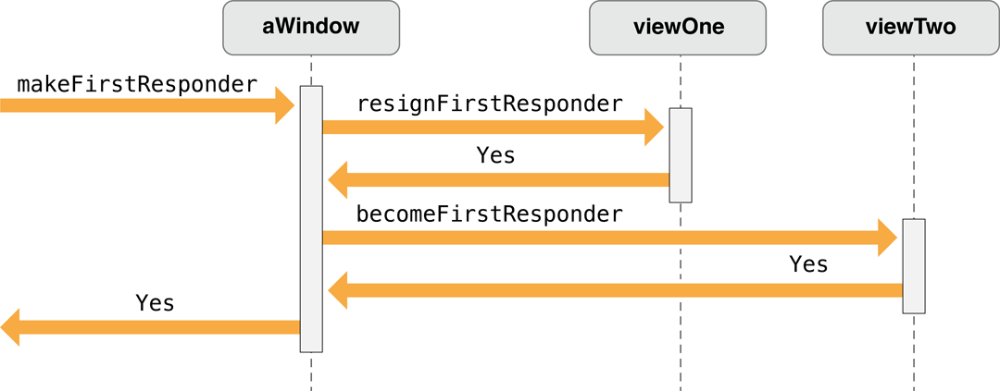

> 导航：[总目录](../../../README.md) · [documentation](../../../_indexes/documentation.md) · [Cocoa Event Handling Guide](Introduction.md)


[Next](Handling%20Mouse%20Events.md)[Previous](Event%20Objects%20and%20Types.md)

# Event Handling Basics

Some tasks found in event-handling code are common to events of more than one type. The following sections describe these basic event-handling tasks. Some of the information presented in this chapter is discussed at length, but using different examples, in the [Creating a Custom View](https://developer.apple.com/library/archive/documentation/Cocoa/Conceptual/CocoaViewsGuide/SubclassingNSView/SubclassingNSView.html#//apple_ref/doc/uid/TP40002978-CH7) chapter of _[View Programming Guide](../View%20Programming%20Guide/Introduction%20to%20View%20Programming%20Guide%20for%20Cocoa.md#apple-f4xwc4dqnrsv64tfmyxwi33df52wszbpkridimbqgazdsnzy)_.

Although any type of responder object can handle events, [NSView](https://developer.apple.com/documentation/appkit/nsview) objects are by far the most common recipient of events. They are typically the first objects to respond to both mouse events and key events, often changing their appearance in reaction to those events. Many Application Kit classes are implemented to handle events, but by itself [NSView](https://developer.apple.com/documentation/appkit/nsview) does not. When you create your own custom view and you want it to respond to events, you have to add event-handling capabilities to it.

The bare-minimum steps required for this are few:

- If your custom view should be first responder for key events or action messages, [override](https://developer.apple.com/library/archive/documentation/General/Conceptual/DevPedia-CocoaCore/MethodOverriding.html#//apple_ref/doc/uid/TP40008195-CH57) [acceptsFirstResponder](https://developer.apple.com/documentation/appkit/nsresponder/1528708-acceptsfirstresponder).
- Implement one or more [NSResponder](https://developer.apple.com/documentation/appkit/nsresponder) methods to handle events of particular types.
- If your view is to handle action messages passed to it via the responder chain, implement the appropriate action methods.

A view that is first responder accepts key events and action messages before other objects in a window. It also typically takes part in the key loop (see [Keyboard Interface Control](Handling%20Key%20Events.md#apple-f4xwc4dqnrsv64tfmyxwi33df52wszbpgeydambqga3da2jninedolktk44q)). By default, view objects refuse first-responder status by returning `NO` in [acceptsFirstResponder](https://developer.apple.com/documentation/appkit/nsresponder/1528708-acceptsfirstresponder). If you want your custom view to respond to key events and actions, your class must override this method to return `YES`:


```objc
- (BOOL)acceptsFirstResponder {
    return YES;
}
```

The second item in the list above—overriding an `NSResponder` method to handle an event—is of course a large subject and what most remaining chapters in this document are about. But there are a few basic guidelines to consider for event messages:

- If necessary, examine the passed-in `NSEvent` object to verify that it’s an event you handle and, if so, find out how to handle it.

  Call the appropriate `NSEvent` methods to help make this determination. For example, you might see which modifier keys were pressed ([modifierFlags](https://developer.apple.com/documentation/appkit/nsevent/1534405-modifierflags)), find out whether a mouse-down event is a double- or triple-click ([clickCount](https://developer.apple.com/documentation/appkit/nsevent/1528200-clickcount)), or, for key events, get the associated characters ([characters](https://developer.apple.com/documentation/appkit/nsevent/1534183-characters) and [charactersIgnoringModifiers](https://developer.apple.com/documentation/appkit/nsevent/1524605-charactersignoringmodifiers)).
- If your implementation of an `NSResponder` method such as [mouseDown:](https://developer.apple.com/documentation/appkit/nsresponder/1524634-mousedown) completely handles an event it should not invoke the superclass implementation of that method.

  `NSView` inherits the `NSResponder` implementations of the methods for handling mouse events; in these methods, `NSResponder` simply passes the message up the responder chain. One of these objects in the responder chain can implement a method in a way that ensures your custom view won’t see subsequent related mouse events. Because of this, custom `NSView` objects should not invoke `super` in their implementations of `NSResponder` mouse-event-handling methods such as `mouseDown:`, `mouseDragged:` and `mouseUp:` unless it is known that the inherited implementation provides some needed functionality.
- If you do not handle the event, pass it on up the responder chain. Although you can directly forward the message to the next responder, it’s generally better to forward the message to your superclass. If your superclass doesn’t handle the event, it forwards the message to its superclass, and so on, until `NSResponder` is reached. By default `NSResponder` passes all event messages up the responder chain. For example, instead of this:

```objc
- (void)mouseDown:(NSEvent *)theEvent {
    // determine if I handle theEvent
    // if not...
    [[self nextResponder] mouseDown:theEvent];
}
```

  do this:

```objc
- (void)mouseDown:(NSEvent *)theEvent {
    // determine if I handle theEvent
    // if not...
    [super mouseDown:theEvent];
}
```
- If your subclass needs to handle particular events some of the time—only some typed characters, perhaps—then it must override the event method to handle the cases it’s interested in and to invoke the superclass implementation otherwise. This allows a superclass to catch the cases it’s interested in, and ultimately allows the event to continue on its way along the responder chain if it isn’t handled.
- If you deliberately want to bypass the superclass implementation of an `NSResponder` method—say your superclass is `NSForm`—and yet pass an event up the responder chain, resend the message to `[self nextResponder]`.

Action messages are typically sent by [NSMenuItem](https://developer.apple.com/documentation/appkit/nsmenuitem) objects or by [NSControl](https://developer.apple.com/documentation/appkit/nscontrol) objects. The latter objects usually work together with one or more [NSCell](https://developer.apple.com/documentation/appkit/nscell) objects. The cell object stores a method [selector](https://developer.apple.com/library/archive/documentation/General/Conceptual/DevPedia-CocoaCore/Selector.html#//apple_ref/doc/uid/TP40008195-CH48) identifying the action message to be sent and a reference to the target object. (A menu item encapsulates its own action and target data.) When a menu item or control object is clicked or otherwise manipulated, it gets the action selector and target object—in the control’s case, from one of its cells—and sends the message to the target.

You can set the action selector and target programmatically using, respectively, the methods [setAction:](https://developer.apple.com/documentation/appkit/nsactioncell/1531427-action) and [setTarget:](https://developer.apple.com/documentation/appkit/nsactioncell/1535837-target) (declared by `NSActionCell`, `NSMenuItem`, and other classes). However, you typically specify these in Interface Builder. In this application, you connect a control object to another object (the target) in the nib file by Control-dragging from the control object to the target and then selecting the action method of the target to invoke. If you want the action message to be untargeted, you can either set the target to `nil` programmatically or, in Interface Builder, make a connection between the menu item or control and the First Responder icon in the nib file window, as shown in Figure 3-1.

__Figure 3-1__  Connecting an untargeted action in Interface Builder



From Interface Builder you can generate a header file and implementation file for your Xcode project that include a declaration and skeletal implementation, respectively, for each action method defined for a class. These Interface Builder–defined methods have a return “value” of `IBAction`, which acts as a tag to indicated that the target-action connection is archived in a nib file. You can also add the declarations and skeletal implementations of action methods yourself; in this case, the return type is `void`.) The remaining required part of the signature is a single parameter typed as `id` and named (by convention) `sender`.

Listing 3-1 illustrates a straightforward implementation of an action method that toggles a clock’s AM-PM indicator when a user clicks a button.

__Listing 3-1__  Simple implementation of an action method

```objc
- (IBAction)toggleAmPm:(id)sender {
    [self incrementHour:12 andMinute: 0];
}
```

Action methods, unlike [NSResponder](https://developer.apple.com/documentation/appkit/nsresponder) event methods, don’t have default implementations, so responder subclasses shouldn’t blindly forward action messages to `super`. The passing of action messages up the responder chain in the Application Kit is predicated merely on whether an object responds to the method, unlike with the passing of event messages. Of course, if you know that a superclass does in fact implement the method, you can pass it on up from your subclass, but otherwise don’t.

An important feature of action messages is that you can send messages back to `sender` to get further information or associated data. For example, the menu items in a given menu might have represented objects assigned to them; for example, a menu item with a title of “Red” might have a represented object that is an [NSColor](https://developer.apple.com/documentation/appkit/nscolor) object. You can access this object by sending [representedObject](https://developer.apple.com/documentation/appkit/nsmenuitem/1514834-representedobject) to `sender`.

You can take the messaging-back feature of action methods one step further by using it to dynamically change `sender`’s target, action, title, and similar attributes. Here is a simple test case: You want to control a progress indicator (an [NSProgressIndicator](https://developer.apple.com/documentation/appkit/nsprogressindicator) object) with a single button; one click of the button starts the indicator and changes the button’s title to “Stop”, and then the next click stops the indicator and changes the title to back to “Start”. Listing 3-2 shows one way to do this.

__Listing 3-2__  Resetting target and action of `sender`—good implementation

```objc
- (IBAction)controlIndicator:(id)sender
{
    [[sender cell] setTarget:indicator]; // indicator is NSProgressIndicator
    if ( [[sender title] isEqualToString:@"Start"] ) {
        [[sender cell] setAction:@selector(startAnimation:)];
        [sender setTitle:@"Stop"];
    } else {
        [[sender cell] setAction:@selector(stopAnimation:)];
        [sender setTitle:@"Start"];
    }
    [[sender cell] performClick:self];
    // set target and action back to what they were
    [[sender cell] setAction:@selector(controlIndicator:)];
    [[sender cell] setTarget:self];
}
```

However, this implementation requires that the target and action information be set back to what they were after the redirected action message is sent via [performClick:](https://developer.apple.com/documentation/appkit/nscell/1534984-performclick). You could simplify this implementation by invoking directly [sendAction:to:from:](https://developer.apple.com/documentation/appkit/nsapplication/1428509-sendaction), the method used by the application object (`NSApp`) to dispatch action messages (see Listing 3-3).

__Listing 3-3__  Resetting target and action of `sender`—better implementation

```objc
- (IBAction)controlIndicator:(id)sender
{
    SEL theSelector;
    if ( [[sender title] isEqualToString:@"Start"] ) {
        theSelector = @selector(startAnimation:);
        [sender setTitle:@"Stop"];
    } else {
        theSelector = @selector(stopAnimation:);
        [sender setTitle:@"Start"];
    }
    [NSApp sendAction:theSelector to:indicator from:sender];
}
```

In keyboard action messages, an action method is invoked as a result of a particular key-press being interpreted through the key bindings mechanism. Because such messages are so closely connected to specific key events, the implementation of the action method can get the event by sending [currentEvent](https://developer.apple.com/documentation/appkit/nsapplication/1428668-currentevent) to `NSApp` and then query the [NSEvent](https://developer.apple.com/documentation/appkit/nsevent) object for details. [Listing 3-7](#apple-f4xwc4dqnrsv64tfmyxwi33df52wszbpgeydambqga3da2jninedklktk4zq) gives an example of this technique. See [The Path of Key Events](Event%20Architecture.md#apple-f4xwc4dqnrsv64tfmyxwi33df52wszbpgeydambqga3da2jninedglktk4yta) for a summary of keyboard action messages; also see [Key Bindings](Text%20System%20Defaults%20and%20Key%20Bindings.md#apple-f4xwc4dqnrsv64tfmyxwi33df52wszbpgiydambqgq3dqljwgeytambv) for a description of that mechanism.

You can get the location of a mouse or tablet-pointer event by sending [locationInWindow](https://developer.apple.com/documentation/appkit/nsevent/1529068-locationinwindow) to an `NSEvent` object. But, as the name of the method denotes, this location (an [NSPoint](https://developer.apple.com/library/archive/documentation/LegacyTechnologies/WebObjects/WebObjects_3.5/Reference/Frameworks/ObjC/Foundation/TypesAndConstants/FoundationTypesConstants/Description.html#//apple_ref/c/tdef/NSPoint) structure) is in the base coordinate system of a window, not in the coordinate system of the view that typically handles the event. Therefore a view must convert the point to its own coordinate system using the method [convertPoint:fromView:](https://developer.apple.com/documentation/appkit/nsview/1483269-convertpoint), as shown in Listing 3-4.

__Listing 3-4__  Converting a mouse-dragged location to be in a view’s coordinate system

```objc
- (void)mouseDragged:(NSEvent *)event {
    NSPoint eventLocation = [event locationInWindow];
    center = [self convertPoint:eventLocation fromView:nil];
    [self setNeedsDisplay:YES];
}
```

The second parameter of `convertPoint:fromView:` is `nil` to indicate that the conversion is from the window’s base coordinate system.

Keep in mind that the `locationInWindow` method is not appropriate for key events, periodic events, or any other type of event other than mouse and tablet-pointer events.

On occasion you might need to discover the type of an event. However, you do not need to do this within an event-handling method of `NSResponder` because the type of the event is apparent from the method name: [rightMouseDragged:](https://developer.apple.com/documentation/appkit/nsresponder/1529135-rightmousedragged), [keyDown:](https://developer.apple.com/documentation/appkit/nsresponder/1525805-keydown), [tabletProximity:](https://developer.apple.com/documentation/appkit/nsresponder/1527018-tabletproximity), and so on. But from elsewhere in an application you can always obtain the currently handled event by sending [currentEvent](https://developer.apple.com/documentation/appkit/nsapplication/1428668-currentevent) to `NSApp`. To find out what type of event this is, send [type](https://developer.apple.com/documentation/appkit/nsevent/1528439-type) to the `NSEvent` object and then compare the returned value with one of the [NSEventType](https://developer.apple.com/documentation/appkit/nsevent/eventtype) constants. Listing 3-5 gives an example of this.

__Listing 3-5__  Testing for event type

```
NSEvent *currentEvent = [NSApp currentEvent];
NSPoint mousePoint = [controlView convertPoint: [currentEvent locationInWindow] fromView:nil];
switch ([currentEvent type]) {
    case NSLeftMouseDown:
    case NSLeftMouseDragged:
        [self doSomethingWithEvent:currentEvent];
        break;
    default:
        // If we find anything other than a mouse down or dragged we are done.
         return YES;
}
```

A common test performed in event-handling methods is finding out whether specific modifier keys were pressed at the same moment as a key-press, mouse click, or similar user action. The modifier key usually imparts special significance to the event. The code example in Listing 3-6 shows an implementation of `mouseDown:` that determines whether the Command key was pressed while the mouse was clicked. If it was, it rotates the receiver (a view) 90 degrees. The identification of modifier keys requires the event handler to send [modifierFlags](https://developer.apple.com/documentation/appkit/nsevent/1534405-modifierflags) to the passed-in event object and then perform a bitwise-AND operation on the returned value using one or more of the modifier mask constants declared in `NSEvent.h`.

__Listing 3-6__  Testing for modifier keys pressed—event method

```objc
- (void)mouseDown:(NSEvent *)theEvent {

    //  if Command-click rotate 90 degrees
    if ([theEvent modifierFlags] & NSCommandKeyMask) {
        [self setFrameRotation:[self frameRotation]+90.0];
        [self setNeedsDisplay:YES];
    }
}
```

You can test an event object to find out if any from a set of modifier keys was pressed by performing a bitwise-OR with the modifier-mask constants, as in Listing 3-7. (Note also that this example shows the use of the `currentEvent` method in a keyboard action method.)

__Listing 3-7__  Testing for modifier keys pressed—action method

```objc
- (void)moveLeft:(id)sender {
    // Use left arrow to decrement the time.  If a shift key is down, use a big step size.
    BOOL shiftKeyDown = ([[NSApp currentEvent] modifierFlags] &
        (NSShiftKeyMask | NSAlphaShiftKeyMask)) !=0;
    [self incrementHour:0 andMinute:-(shiftKeyDown ? 15 : 1)];
}
```

Further, you can look for certain modifier-key combinations by linking the individual modifier-key tests together with the logical AND operator (`&&`). For example, if the example method in [Listing 3-6](#apple-f4xwc4dqnrsv64tfmyxwi33df52wszbpgeydambqga3da2jninedklktk42a) were to look for Command-Shift-click rather than Command-click, the complete test would be the following:

```
    if ( ( [theEvent modifierFlags] & NSCommandKeyMask ) &&
        ( [theEvent modifierFlags] & NSShiftKeyMask ) )
```

In addition to testing an `NSEvent` object for individual event types, you can also restrict the events fetched from the event queue to specified types. You can perform this filtering of event types in the [nextEventMatchingMask:untilDate:inMode:dequeue:](https://developer.apple.com/documentation/appkit/nsapplication/1428485-nexteventmatchingmask) method (`NSApplication` and `NSWindow`) or the [nextEventMatchingMask:](https://developer.apple.com/documentation/appkit/nswindow/1419304-nextevent) method of `NSWindow`. The second parameter of all these methods takes one or more of the event-type mask constants declared in `NSEvent.h`—for example `NSLeftMouseDraggedMask`, `NSFlagsChangedMask`, and `NSTabletProximityMask`. You can either specify these constants individually or perform a bitwise-OR on them.

Because the [nextEventMatchingMask:untilDate:inMode:dequeue:](https://developer.apple.com/documentation/appkit/nsapplication/1428485-nexteventmatchingmask) method is used almost exclusively in closed loops for processing a related series of mouse events, the use of it is described in [Handling Mouse Events](Handling%20Mouse%20Events.md#apple-f4xwc4dqnrsv64tfmyxwi33df52wszbpgeydambqga3da2jninedmlktk4yq).

The following sections describe tasks related to the first-responder status of objects.

Usually an [NSResponder](https://developer.apple.com/documentation/appkit/nsresponder) object can always determine if it's currently the first responder by asking its window (or itself, if it's an [NSWindow](https://developer.apple.com/documentation/appkit/nswindow) object) for the first responder and then comparing itself to that object. You ask an `NSWindow` object for the first responder by sending it a [firstResponder](https://developer.apple.com/documentation/appkit/nswindow/1419440-firstresponder) message. For an [NSView](https://developer.apple.com/documentation/appkit/nsview) object, this comparison would look like the following bit of code:

```
if ([[self window] firstResponder] == self) {
      // do something based upon first-responder status
}
```

A complication of this simple scenario occurs with text fields. When a text field has input focus, it is not the first responder. Instead, the field editor for the window is the first responder; if you send `firstResponder` to the `NSWindow` object, an [NSTextView](https://developer.apple.com/documentation/appkit/nstextview) object (the field editor) is what is returned. To determine if a given `NSTextField` is currently active, retrieve the first responder from the window and find out it is an `NSTextView` object and if its [delegate](https://developer.apple.com/library/archive/documentation/General/Conceptual/DevPedia-CocoaCore/Delegation.html#//apple_ref/doc/uid/TP40008195-CH14) is equal to the `NSTextField` object. Listing 3-8 shows how you might do this.

__Listing 3-8__  Determining if a text field is first responder

```
if ( [[[self window] firstResponder] isKindOfClass:[NSTextView class]] &&
   [window fieldEditor:NO forObject:nil] != nil ) {
        NSTextField *field = [[[self window] firstResponder] delegate];
        if (field == self) {
            // do something based upon first-responder status
        }
}
```

The control that a field editor is editing is always the current delegate of the field editor, so (as the example shows) you can obtain the text field by asking for the field editor's delegate. For more on the field editor, see [Text Fields, Text Views, and the Field Editor](https://developer.apple.com/library/archive/documentation/TextFonts/Conceptual/CocoaTextArchitecture/TextFieldsAndViews/TextFieldsAndViews.html#//apple_ref/doc/uid/TP40009459-CH8).

You can programmatically change the first responder by sending [makeFirstResponder:](https://developer.apple.com/documentation/appkit/nswindow/1419366-makefirstresponder) to an `NSWindow` object; the argument of this message must be a responder object (that is, an object that inherits from [NSResponder](https://developer.apple.com/documentation/appkit/nsresponder)). This message initiates a kind of protocol in which one object loses its first responder status and another gains it.

1. `makeFirstResponder:` always asks the current first responder if it is ready to resign its status by sending it [resignFirstResponder](https://developer.apple.com/documentation/appkit/nsresponder/1532115-resignfirstresponder).
2. If the current first responder returns `NO` when sent this message, `makeFirstResponder:` fails and likewise returns `NO`.

   A view object or other responder may decline to resign first responder status for many reasons, such as when an action is incomplete.
3. If the current first responder returns `YES` to `resignFirstResponder`, then the new first responder is sent a [becomeFirstResponder](https://developer.apple.com/documentation/appkit/nsresponder/1526750-becomefirstresponder) message to inform it that it can be the first responder.
4. This object can return `NO` to reject the assignment, in which case the `NSWindow` itself becomes the first responder.

Figure 3-2 and Figure 3-3 illustrate two possible outcomes of this protocol.

__Figure 3-2__  Making a view a first responder—current view refuses to resign status



__Figure 3-3__  Making a view a first responder—new view becomes first responder



Listing 3-9 shows a custom [NSCell](https://developer.apple.com/documentation/appkit/nscell) class (in this case a subclass of [NSActionCell](https://developer.apple.com/documentation/appkit/nsactioncell)) implementing `resignFirstResponder` and `becomeFirstResponder` to manipulate the keyboard focus ring of its superclass.

__Listing 3-9__  Resigning and becoming first responder

```objc
- (BOOL)becomeFirstResponder {
    BOOL okToChange = [super becomeFirstResponder];
    if (okToChange) [self setKeyboardFocusRingNeedsDisplayInRect: [self bounds]];
    return okToChange;
}

- (BOOL)resignFirstResponder {
    BOOL okToChange = [super resignFirstResponder];
    if (okToChange) [self setKeyboardFocusRingNeedsDisplayInRect: [self bounds]];
    return okToChange;
}
```

You can also set the _initial_ first responder for a window—that is, the first responder set when the window is first placed onscreen. You can set the initial first responder programmatically by sending [setInitialFirstResponder:](https://developer.apple.com/documentation/appkit/nswindow/1419479-initialfirstresponder) to an `NSWindow` object. You can also set it when you create a user interface in Interface Builder. To do this, complete the following steps.

1. Control-drag from the window icon in the nib file window to an `NSView` object in the user interface.
2. In the Connections pane of the inspector, select the `initialFirstResponder` outlet and click Connect.

After `awakeFromNib` is called for all objects in a nib file, `NSWindow` makes the first responder whatever was set as initial first responder in the nib file. Note that you should not send `setInitialFirstResponder:` to an `NSWindow` object in `awakeFromNib` and expect the message to be effective.

[Next](Handling%20Mouse%20Events.md)[Previous](Event%20Objects%20and%20Types.md)

