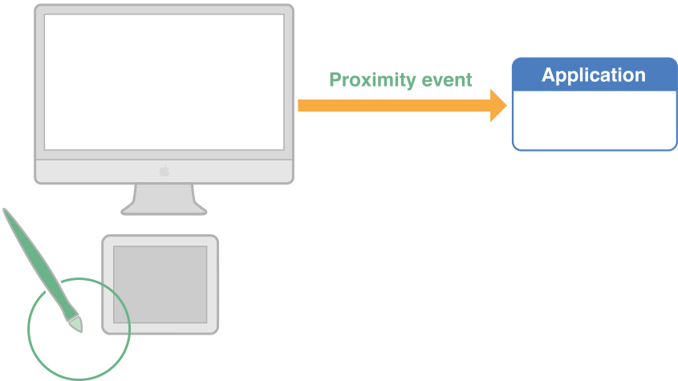
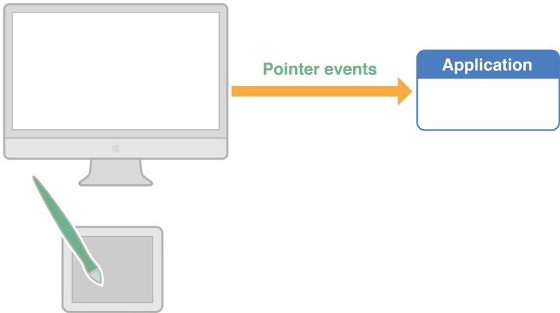
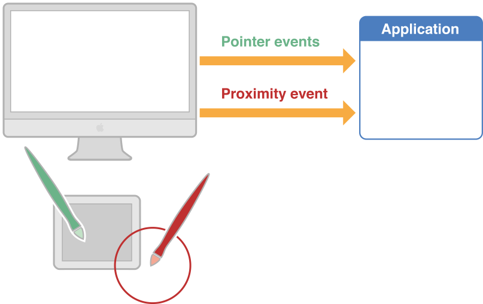
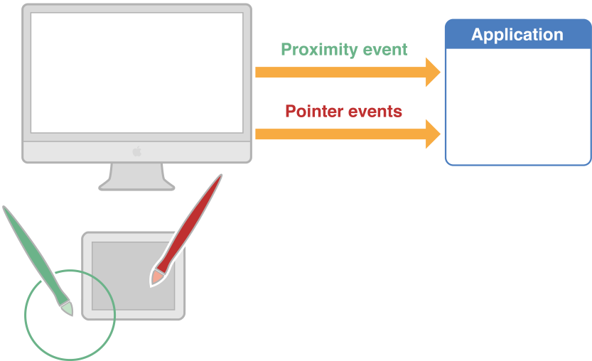

> 导航：[总目录](../../../README.md) · [documentation](../../../_indexes/documentation.md) · [Cocoa Event Handling Guide](Introduction.md)

[Next](Event%20Handling%20Basics.md)[Previous](Event%20Architecture.md)

# Event Objects and Types

Almost all events in a Cocoa application are represented by objects of the [NSEvent](https://developer.apple.com/documentation/appkit/nsevent) class. (Exceptions include Apple events, notifications, and similar items.) Each `NSEvent` object more narrowly represents a particular type of event, each with its own requirements for handling. The following sections describe the characteristics of an `NSEvent` object and the possible event types.

An `NSEvent` object—or, simply, an event object—contains pertinent information about an input action such as a mouse click or a key press. It stores such details as where the mouse was located or which character was typed. As described in [How an Event Enters a Cocoa Application](Event%20Architecture.md#apple-f4xwc4dqnrsv64tfmyxwi33df52wszbpgeydambqga3da2jninedglktk4yq), the window server associates each user action with a window and reports the event (in a lower-level form) to the application that created the window. The application temporarily places each event in a buffer called the event queue. When the application is ready to process an event, the application object ([NSApp](https://developer.apple.com/documentation/appkit/nsapp)) takes one from the queue (usually the topmost one in the queue) and converts it to an `NSEvent` object before dispatching it to the appropriate objects in an application.

Responder objects of an application receive the currently dispatched event object through the parameter of an event method declared by the [NSResponder](https://developer.apple.com/documentation/appkit/nsresponder) class (such as [mouseDown:](https://developer.apple.com/documentation/appkit/nsresponder/1524634-mousedown)). In addition, other methods of the Application Kit let any object retrieve the current event or fetch the next event (or next event of a specific type) from the event queue. See [Event Objects in Methods of Other Classes](#apple-f4xwc4dqnrsv64tfmyxwi33df52wszbpgeydambqga3da2jninedilktk4yq) for more information about these methods.

An `NSEvent` object is largely a read-only repository of information related to a specific event. Most methods of the [NSEvent](https://developer.apple.com/documentation/appkit/nsevent) class are [accessor methods](https://developer.apple.com/library/archive/documentation/General/Conceptual/DevPedia-CocoaCore/AccessorMethod.html#//apple_ref/doc/uid/TP40008195-CH2) for getting the values of event [attributes](https://developer.apple.com/library/archive/documentation/General/Conceptual/DevPedia-CocoaCore/ObjectModeling.html#//apple_ref/doc/uid/TP40008195-CH41). (`NSEvent` has no corresponding “setter” accessor methods, although you can specify certain attributes when creating an event object using various class factory methods.) An object such as a responder typically uses the accessor methods to get the details of an event and thus know how to handle it.

Some `NSEvent` attributes (and their corresponding accessor methods) are common to all types of events while others are specific to certain types of events. For example, the `clickCount` method pertains only to mouse events and the `characters` method pertains only to key events. Tablet events have a number of accessor methods that apply only to them. Some of the more important accessor methods of `NSEvent` are the following:

**[type](https://developer.apple.com/documentation/appkit/nsevent/1528439-type)**
: The type of event; see [Event Types](#apple-f4xwc4dqnrsv64tfmyxwi33df52wszbpgeydambqga3da2jninedilktk4za).

**[window](https://developer.apple.com/documentation/appkit/nsevent/1530808-window)**
: The [NSWindow](https://developer.apple.com/documentation/appkit/nswindow) object representing the window in which the event occurred. With [windowNumber](https://developer.apple.com/documentation/appkit/nsevent/1531361-windownumber) you can also obtain the number assigned by the window server to the window. Most but not all events are associated with a window; when no window is associated, `window` returns `nil`.

**[locationInWindow](https://developer.apple.com/documentation/appkit/nsevent/1529068-locationinwindow)**
: The location of the event within the window’s base coordinate system.

**[modifierFlags](https://developer.apple.com/documentation/appkit/nsevent/1534405-modifierflags)**
: An indication of which modifier keys (Command, Control, Shift, and so on) the user held down while the event occurred.

**[characters](https://developer.apple.com/documentation/appkit/nsevent/1534183-characters)**
: The Unicode characters generated by a key event. You can also use [charactersIgnoringModifiers](https://developer.apple.com/documentation/appkit/nsevent/1524605-charactersignoringmodifiers) to obtain the key-event characters minus those generated by modifier keys.

**[timestamp](https://developer.apple.com/documentation/appkit/nsevent/1528239-timestamp)**
: The time the event occurred (in seconds since system startup).

**[clickCount](https://developer.apple.com/documentation/appkit/nsevent/1528200-clickcount)**
: For mouse events within a certain time threshold, the number of clicks associated with a particular event. (This enables the detection of double- or triple-clicking.)

Though you rarely need do so, you can create an event object from scratch and either insert it into the event queue for distribution or send it directly to its destination in an event message. The `NSEvent` class includes [class methods](https://developer.apple.com/library/archive/documentation/General/Conceptual/DevPedia-CocoaCore/ClassMethod.html#//apple_ref/doc/uid/TP40008195-CH8) for [creating](https://developer.apple.com/library/archive/documentation/General/Conceptual/DevPedia-CocoaCore/ObjectCreation.html#//apple_ref/doc/uid/TP40008195-CH39) event objects of a specific type; for example, for creating a mouse-type event object, you can use the class method [mouseEventWithType:location:modifierFlags:timestamp:windowNumber:context:eventNumber:clickCount:pressure:](https://developer.apple.com/documentation/appkit/nsevent/1532495-mouseeventwithtype). You add event objects to the event queue by invoking the `NSWindow` method [postEvent:atStart:](https://developer.apple.com/documentation/appkit/nswindow/1419376-postevent) or the identically named method of the [NSApplication](https://developer.apple.com/documentation/appkit/nsapplication) class.

Another `NSEvent` class method, [mouseLocation](https://developer.apple.com/documentation/appkit/nsevent/1533380-mouselocation), returns the current location of the mouse. It differs in a few important respects from the instance method `locationInWindow`. Being a class method, it doesn’t require an event object to send the message to; it returns the location in screen coordinates rather than base (window) coordinates; and it returns the current mouse location, which might be different from that of the current or any pending mouse event.

[NSEvent](https://developer.apple.com/documentation/appkit/nsevent) objects are scattered throughout the Application Kit. For example, the classes [NSCell](https://developer.apple.com/documentation/appkit/nscell), [NSCursor](https://developer.apple.com/documentation/appkit/nscursor), [NSClipView](https://developer.apple.com/documentation/appkit/nsclipview), [NSMenu](https://developer.apple.com/documentation/appkit/nsmenu), [NSSlider](https://developer.apple.com/documentation/appkit/nsslider), and [NSTableView](https://developer.apple.com/documentation/appkit/nstableview) all have methods with event objects as return values or parameters. However, a few Application Kit methods that deal with event objects are particularly important.

Although most events are distributed automatically through the responder chain, sometimes an object needs to retrieve events explicitly—for example, while mouse tracking. Both [NSWindow](https://developer.apple.com/documentation/appkit/nswindow) and `NSApplication` define the method [nextEventMatchingMask:untilDate:inMode:dequeue:](https://developer.apple.com/documentation/appkit/nsapplication/1428485-nexteventmatchingmask), which allows an object to retrieve events of specific types from the event queue.

`NSApplication` and `NSWindow` also both define the [currentEvent](https://developer.apple.com/documentation/appkit/nswindow/1419298-currentevent) method, which fetches the last event object retrieved from the event queue. These methods are a great convenience because they enable any object in an application to learn about the event currently being handled in the main event loop.

Finally, both `NSWindow` and `NSApplication` define the [sendEvent:](https://developer.apple.com/documentation/appkit/nsapplication/1428359-sendevent) method. The implementations of these methods are critical for event dispatch. Because these methods are funnel points for events in an application, you may override them in certain circumstances to learn about events earlier in the event stream or to augment or modify the native event-dispatch behavior. Event Dispatch talks about the role played by the `sendEvent:` methods.

The [type](https://developer.apple.com/documentation/appkit/nsevent/1528439-type) method of `NSEvent` returns an [NSEventType](https://developer.apple.com/documentation/appkit/nsevent/eventtype) value that identifies the sort of event. The type of an event determines to a large extent how it is to be handled. The different types of events fall into six groups:

- Mouse events
- key events
- Tracking-rectangle and cursor-update events
- Tablet events
- Periodic events
- Other events

Some of these groups comprise several `NSEventType` constants, others only one. Some event types might have subtypes, which are described in the following sections. `NSEventType` constants are declared in `NSEvent.h`.

The `NSApplication` and [NSWindow](https://developer.apple.com/documentation/appkit/nswindow) methods that allow you to selectively fetch and discard events from the event queue—[nextEventMatchingMask:untilDate:inMode:dequeue:](https://developer.apple.com/documentation/appkit/nsapplication/1428485-nexteventmatchingmask) and [discardEventsMatchingMask:beforeEvent:](https://developer.apple.com/documentation/appkit/nsapplication/1428652-discardevents)—take one or more event-type mask constants in the first parameter. These constants are also declared in `NSEvent.h`.

Mouse events are generated by changes in the state of the mouse buttons and by changes in the position of the mouse cursor on the screen. They fall into two subcategories, one related to mouse clicks and movements and the other related to mouse tracking and cursor updates.

The larger category of mouse events includes those where the mouse button is pressed or released and where the mouse is moved without being tracked. It consists of the following mouse-event types corresponding to the specified user actions:

**[NSLeftMouseDown](https://developer.apple.com/documentation/appkit/nsleftmousedown), [NSLeftMouseUp](https://developer.apple.com/documentation/appkit/nsleftmouseup), `NSRightMouseDown`, `NSRightMouseUp`, `NSOtherMouseDown`, `NSOtherMouseUp`**
: The user clicked a mouse button. Constants with “MouseDown” in their names mean the user pressed the button; “MouseUp” means the user released it. If the mouse has just one button, only left mouse events are generated. By sending a [clickCount](https://developer.apple.com/documentation/appkit/nsevent/1528200-clickcount) message to the event, you can determine whether the mouse event was a single click, double click, and so on. A mouse with more than two buttons can generate the “OtherMouse” events.

**`NSLeftMouseDragged`, `NSRightMouseDragged`, `NSOtherMouseDragged`**
: The user dragged the mouse. More specifically, the user moved the mouse while pressing one or more buttons. `NSLeftMouseDragged` events are generated when the mouse is moved with its left mouse button down or with both buttons down, `NSRightMouseDragged` events are generated when the mouse is moved with just the right button down, and `NSOtherMouseDragged` when the device has more than two buttons. A mouse with a single button generates only left mouse-dragged events. A series of mouse-dragged events is always preceded by a mouse-down event and followed by a mouse-up event.

**`NSMouseMoved`**
: The user moved the mouse without holding down either mouse button. Mouse-moved events are normally not tracked, as they quickly flood the event queue; use the `NSWindow` method `setAcceptsMouseMovedEvents:` to turn on tracking of mouse movements.

**`NSScrollWheel`**
: The user manipulated the mouse’s scroll wheel. Use the `NSEvent` methods `deltaX`, `deltaY`, and `deltaZ` to find out how much it moved. If the mouse has no scroll wheel, this event is never generated.

__Note:__ Beginning with OS X v10.5, `NSScrollWheel` events are sent to the window under the mouse, whether the window is active or inactive. In earlier versions of the operating system, scroll-wheel events are sent to the window under the mouse only if that window has key focus (with the exception of utility windows, which receive those events even if they are inactive).

Mouse-dragged and mouse-moved events are generated repeatedly as long as the user keeps moving the mouse. If the mouse is stationary, neither type of event is generated until the mouse moves again.

See [Handling Mouse Events](Handling%20Mouse%20Events.md#apple-f4xwc4dqnrsv64tfmyxwi33df52wszbpgeydambqga3da2jninedmlktk4yq) for more information on mouse events.

Because following the mouse’s movements precisely is an expensive operation, the Application Kit provides a less intensive mechanism for tracking the location of the mouse. It does this by allowing the application to define regions of a window, called tracking rectangles, that generate events when the cursor enters or leaves them. The event types are [NSMouseEntered](https://developer.apple.com/documentation/appkit/nsmouseentered) and [NSMouseExited](https://developer.apple.com/documentation/appkit/nsmouseexited) and they’re generated when the application has asked the window server to set a tracking rectangle in a window, typically by using [NSTrackingArea](https://developer.apple.com/documentation/appkit/nstrackingarea) objects or the `NSView` method [addTrackingRect:owner:userData:assumeInside:](https://developer.apple.com/documentation/appkit/nsview/1483668-addtrackingrect). A window can have any number of tracking rectangles; the `NSEvent` method [trackingNumber](https://developer.apple.com/documentation/appkit/nsevent/1533974-trackingnumber) identifies the rectangle that triggered the event.

A special kind of tracking event is the [NSCursorUpdate](https://developer.apple.com/documentation/appkit/nscursorupdate) event. This type is used to implement the cursor-rectangle mechanism of the `NSView` class. An `NSCursorUpdate` event is generated when the cursor has crossed the boundary of a predefined rectangular area. `NSApplication` typically handles `NSCursorUpdate` events and does not dispatch them.

See [Using Tracking-Area Objects](Using%20Tracking-Area%20Objects.md#apple-f4xwc4dqnrsv64tfmyxwi33df52wszbpgeydambqga3da2jninedqlktk4yq) for more information.

Among the most common events sent to an application are direct reports of the user’s keyboard actions, identified by these [NSEventType](https://developer.apple.com/documentation/appkit/nsevent/eventtype) constants:

**`NSKeyDown`**
: The user generated a character or characters by pressing a key.

**`NSKeyUp`**
: The user released a key. This event is always preceded by a `NSKeyDown` event.

**`NSFlagsChanged`**
: The user pressed or released a modifier key, or turned Caps Lock on or off.

Of these, key-down events are the most useful to an application. When the type of an event is `NSKeyDown`, the next step is typically to get the characters generated by the key-down using the [characters](https://developer.apple.com/documentation/appkit/nsevent/1534183-characters) method.

Key-up events are used less frequently since they follow almost automatically when there’s been a key-down event. And because the NSEvent [modifierFlags](https://developer.apple.com/documentation/appkit/nsevent/1534405-modifierflags) method returns the state of the modifier keys regardless of the type of event, applications normally don’t need to receive flags-changed events; they’re useful only for applications that have to keep track of the state of these keys at all times.

Some key presses generate key events that do not represent characters to be inserted as text. Instead they represent key equivalents, keyboard interface control commands, or keyboard actions. Key equivalents and keyboard interface control commands are typically handled by the application object and do not invoke the `NSResponder` method associated with `NSKeyDown` events, [keyDown:](https://developer.apple.com/documentation/appkit/nsresponder/1525805-keydown). See [The Path of Key Events](Event%20Architecture.md#apple-f4xwc4dqnrsv64tfmyxwi33df52wszbpgeydambqga3da2jninedglktk4yta) for more information.

For more information on key events, see [Handling Key Events](Handling%20Key%20Events.md#apple-f4xwc4dqnrsv64tfmyxwi33df52wszbpgeydambqga3da2jninedolktk4yq).

Tablet devices generate low-level events that a Cocoa application receives as `NSEvent` objects. The following sections describe tablet devices, the characteristics of tablet events, and how the Application Kit supports tablet events.

A tablet with a stylus is an input device that generates more accurate and detailed data than does a mouse. It enables a user to draw, write, or make selections by manipulating the stylus over a surface (the tablet); an application can then capture and process those movements, reflecting them in its user interface. The tablet is generally a USB device connected to a computer system and the stylus is a wireless transducer. A signal is sent from the tablet to the transducer, which then sends a signal back to the tablet. The tablet uses this signal to determine the position of the transducer on the tablet. The stylus actually can be any pointing device, such as a pen, an airbrush, or even a puck.

In addition to the stylus location at any given moment, a stylus transducer can report many other pieces of data, such as the tilt of a pen, the rotation of a puck, and the pressure applied to the stylus. Pressure is particularly important because, with just this small piece of data, a user can tell an application to vary the thickness of a line being drawn, or its opacity, or its color. Some stylus devices also have buttons that can furnish an application with additional information.

OS X supports tablet devices from several manufacturers. Some of these tablets can respond to multiple pointing devices on their surfaces at the same time.

There are two types of tablet events in the Application Kit: proximity events and pointer events. The following sections describe what they are, how they are related to each other, and the sequence of proximity and pointer events in a typical tablet session.

A proximity event is an event that a tablet device generates when a pointing transducer (for example, a stylus) comes near or moves away from the tablet surface. It indicates the start or the end of a related series of pointer events (a session). A proximity event is an `NSEvent` object of type [NSTabletProximity](https://developer.apple.com/documentation/appkit/nstabletproximity). An application can determine whether a tablet-pointer session is beginning or ending by sending `isEnteringProximity` to the event object.

The main purpose of a proximity event is to provide an application with a set of identifiers for associating items of tablet hardware—entire tablet devices or individual transducers—with the current pointing session. A proximity tablet event can also furnish an application with information about the capabilities of a specific device.

A proximity-type tablet event carries with it a set of identifiers and device attributes that an application can fetch with accessor methods. These include the following:

- Device ID—The main identifier of a tablet device, used to associate pointer-type events with proximity events. All tablet pointer events in a session have the same device ID.

  Accessor: [deviceID](https://developer.apple.com/documentation/appkit/nsevent/1530014-deviceid)
- Pointing devices—To help an application distinguish among pointing devices, you can ask a proximity event for the device’s serial number, its type (for example, pen or eraser), and, for tablets that support multiple concurrent pointing devices, its device ID.

  Accessors: [pointingDeviceSerialNumber](https://developer.apple.com/documentation/appkit/nsevent/1533420-pointingdeviceserialnumber), [pointingDeviceType](https://developer.apple.com/documentation/appkit/nsevent/1535573-pointingdevicetype), [pointingDeviceID](https://developer.apple.com/documentation/appkit/nsevent/1528818-pointingdeviceid)
- Tablets—You can ask a proximity event for a tablet’s identifier (which is its USB model number) and, if there are multiple tablets connected to a system, its system tablet ID.

  Accessors: [tabletID](https://developer.apple.com/documentation/appkit/nsevent/1527003-tabletid), [systemTabletID](https://developer.apple.com/documentation/appkit/nsevent/1528299-systemtabletid)
- Vendor information—An `NSEvent` object with a proximity type may contain an identifier of the vendor and an identifier of a pointing device within a vendor’s selection of devices.

  Accessors: [vendorID](https://developer.apple.com/documentation/appkit/nsevent/1525177-vendorid), `vendorPointingDeviceType`
- Capabilities—A bit mask whose set bits indicate the capabilities of a tablet device. It is vendor-specific.

  Accessor: [capabilityMask](https://developer.apple.com/documentation/appkit/nsevent/1534648-capabilitymask)

Generally, when an application receives a proximity event, it stores the device ID and any other identifier that is needed to distinguish among various items of tablet hardware involved in the session. It then refers to these identifiers when handling pointer events to ensure it is processing the right events. An application can also extract device information from proximity events (for example, tablet capabilities or pointer type) and use this information to configure how it deals with pointer events.

A pointer event is an event that a tablet device generates after a stylus has entered proximity of the tablet. It indicates a change in the state of the transducer. For example, if the user moves a stylus transducer over the surface of the tablet or increases pressure or tilts the pointing device, a pointer event is generated. A pointer event is an `NSEvent` object of type [NSTabletPoint](https://developer.apple.com/documentation/appkit/nstabletpoint) or an object representing a mouse-down, mouse-dragged, or mouse-up event with a subtype of [NSTabletPointEventSubtype](https://developer.apple.com/documentation/appkit/nstabletpointeventsubtype).

Applications generally use pointer events for drawing or user-interface manipulation. Although you can obtain the absolute three-dimensional coordinates of the current pointer location, these coordinates are in full tablet resolution and require you to scale them to the screen location. It is much simpler to use the `NSEvent` instance method [locationInWindow](https://developer.apple.com/documentation/appkit/nsevent/1529068-locationinwindow) or the class method [mouseLocation](https://developer.apple.com/documentation/appkit/nsevent/1533380-mouselocation).

In addition to pointer location, the information obtainable from pointer events include the following:

- Pressure, as a value between 0.0 and 1.0; you might use the pressure attribute to set the opacity of a color.

  Accessor: [pressure](https://developer.apple.com/documentation/appkit/nsevent/1534543-pressure)
- Rotation, in degrees; you might use the rotation attribute to simulate a calligraphy pen.

  Accessor: [rotation](https://developer.apple.com/documentation/appkit/nsevent/1526249-rotation)
- Tilt, an [NSPoint](https://developer.apple.com/library/archive/documentation/LegacyTechnologies/WebObjects/WebObjects_3.5/Reference/Frameworks/ObjC/Foundation/TypesAndConstants/FoundationTypesConstants/Description.html#//apple_ref/c/tdef/NSPoint) structure, with both axes ranging from -1 to 1; you might use the tilt attribute to supply different colors, depending on the angle and direction of tilt.

  Accessor: [tilt](https://developer.apple.com/documentation/appkit/nsevent/1534226-tilt)
- Tangential pressure, as a value between -1.0 and 1.0 (only on certain devices).

  Accessor: [tangentialPressure](https://developer.apple.com/documentation/appkit/nsevent/1525959-tangentialpressure)
- Button number of transducer pressed.

  Accessor: [buttonMask](https://developer.apple.com/documentation/appkit/nsevent/1535428-buttonmask)
- Vendor-defined data.

  Accessor: [vendorDefined](https://developer.apple.com/documentation/appkit/nsevent/1530551-vendordefined)

A tablet proximity event signals the start of a series of related tablet pointer event and a subsequent proximity event signals the end of the series. These two proximity events thus provide a kind of frame for processing the pointer events in a session. The first proximity event is generated when a pointing device comes near a tablet surface; the second is generated when the same pointing device leaves the proximity of the tablet.

The sequence of proximity and pointer events have special significance to the application handling the tablet events. A tablet event generated by a pointing device that comes near the tablet lets the tablet application know that it should store identifiers and set configuration variables for the upcoming tablet session. The application processes the pointer events until it receivers the second proximity event, which tells it that those identifiers and configurations are no longer operative. A tablet session is thus a sequence of pointer events that are associated with a specific pair of proximity events.

The relationship between proximity and pointer events is simple and clear as long as only one pointing device is in play. But there can be multiple pointing devices on a tablet surface at one time, or more than one tablet devices can be connected to a system. In this case the application must store the identifiers it receivers in all initial proximity events and use those identifiers to differentiate among various series of pointer events.

Take, for example, a tablet device that supports multiple pointing device on the tablet surface at one time. One pointing device might be a stylus for line drawing; another pointing device might apply an airbrush painting effect. As Figure 2-1 illustrates, a proximity event is generated with the drawing stylus comes close to the tablet surface.

__Figure 2-1__  Pointer A coming near the tablet, generating proximity event

When handling this proximity event, the application stores the device ID of the tablet device, the device ID of the pointing device, and perhaps also the serial number of the pointing device and its type. Until it receives the next proximity event with these same identifiers, it processes all pointer events it receives for the pointing device—in this case, drawing lines (Figure 2-2).

__Figure 2-2__  Application receiving pointer events

Now the airbrush pointing device moves onto the surface of the tablet, generating another proximity event (Figure 2-3). Because this event carries with it different identifiers, the application knows its not the terminating proximity event for the first tablet session. Instead it announces an impending series of pointer events for another pointing device. So the application stores the identifiers and configuration information for this session.

__Figure 2-3__  Pointer B coming near the tablet, generating proximity event

For a period, the tablet application is processing two different series of pointer events, using the stored identifiers to distinguish between the two. Then, as depicted in Figure 2-4, the drawing pointing device moves away from the tablet surface. This action generates a proximity event. The application examines the event and sees that the identifiers for the pointing device are the same as what it initially stored for the line-drawing device. It nullifies the stored identifiers, bringing to a close the initial series of pointer events.

__Figure 2-4__  Pointer A leaving the tablet surface, generating proximity event

The Application Kit defines several minor event types. Some of these are rarely used, but they are available if you ever find need for them.

A periodic event (type [NSPeriodic](https://developer.apple.com/documentation/appkit/nsperiodic)) simply notifies an application that a certain time interval has elapsed. Periodic events are particularly useful in situations where input events aren’t generated but you want them to be. For example, when the user holds the mouse down over a scroll button but doesn’t move it, no events are generated after the mouse-down event. The Application Kit’s scrolling mechanism then starts and uses a stream of periodic events to keep the document scrolling at a reasonable pace until the user releases the mouse. When a mouse-up event occurs, the scrolling mechanism terminates the periodic event stream.

You use the `NSEvent` class method [startPeriodicEventsAfterDelay:withPeriod:](https://developer.apple.com/documentation/appkit/nsevent/1526044-startperiodiceventsafterdelay) to generate periodic events and have them placed in the event queue at a certain frequency. When you no longer need them, turn off the flow of periodic events by invoking [stopPeriodicEvents](https://developer.apple.com/documentation/appkit/nsevent/1533746-stopperiodicevents). Unlike key and mouse events, periodic events aren’t dispatched to a window object. The application must retrieve them explicitly using the `NSApplication` method [nextEventMatchingMask:untilDate:inMode:dequeue:](https://developer.apple.com/documentation/appkit/nsapplication/1428485-nexteventmatchingmask), typically in a modal loop. An application can have only one stream of periodic events active for each thread. You use periodic events instead of timers because `NSPeriodic` events are delivered along with other events; this makes for a responder object to look for periodic events along with mouse-up and mouse-dragged events. such as is done (for example) during scrolling.

The remaining event types—[NSAppKitDefined](https://developer.apple.com/documentation/appkit/nsappkitdefined), [NSSystemDefined](https://developer.apple.com/documentation/appkit/nssystemdefined), and [NSApplicationDefined](https://developer.apple.com/documentation/appkit/nsapplicationdefined)—are less structured, containing only generic subtype and data fields. Of these three miscellaneous event types, only `NSApplicationDefined` is of real use to application programs. It allows the application to generate custom events and insert them into the event queue. Each such event can have a subtype and two additional codes to differentiate it from others. The `NSEvent` method [otherEventWithType:location:modifierFlags:timestamp:windowNumber:context:subtype:data1:data2:](https://developer.apple.com/documentation/appkit/nsevent/1530010-othereventwithtype) creates one of these events, and the [subtype](https://developer.apple.com/documentation/appkit/nsevent/1527726-subtype), [data1](https://developer.apple.com/documentation/appkit/nsevent/1528289-data1), and [data2](https://developer.apple.com/documentation/appkit/nsevent/1528647-data2) methods return the information specific to these events.

[Next](Event%20Handling%20Basics.md)[Previous](Event%20Architecture.md)

