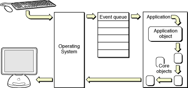
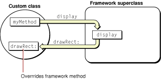
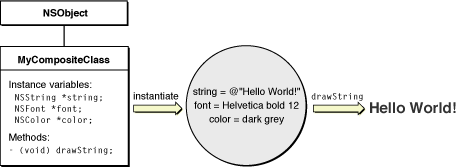
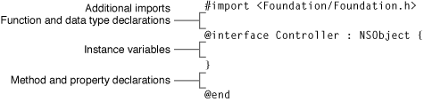

> 导航：[总目录](../../../README.md) · [文档](../../../_indexes/documentation.md) · [Cocoa 基础指南](Introduction.md)


[下一页](Cocoa%20Design%20Patterns.md)[上一页](Cocoa%20Objects.md)

# 为 Cocoa 程序添加行为

用 Objective-C 开发 Cocoa 程序时，你并不是孤军奋战。你会借助 Apple 和其他人已经完成的工作，也就是他们开发并打包进 Objective-C 框架中的那些类。这些框架为你提供一组相互依赖的类，共同构成程序的一部分——往往是相当大的一部分——结构。

本章描述用 Cocoa 框架编写 Objective-C 程序是什么样的体验，同时也给出创建框架类子类所需了解的基本信息。

使用一套 Objective-C 类及其方法组成的框架，与使用一个 C 函数库是不同的。使用 C 函数库时，你几乎可以随意挑选要用哪些函数、什么时候用，完全取决于你要写的程序。而框架则不同，它会给你的程序、或者至少给程序要解决的某个问题域强加一种设计。在过程式程序中，你按需调用库函数来完成程序的工作。使用面向对象的框架也类似，你必须调用框架的方法来完成程序的大部分工作。但除此之外，你还需要通过实现框架会在适当时机调用的方法，来定制框架、使其适应你的需求。这些方法就是「钩子」，它们把你的代码引入框架强加的结构之中，用体现你程序特色的行为去充实它。从某种意义上说，程序与库的常规角色被颠倒了：不是把库代码并入你的程序，而是把你的程序代码并入框架。

考察一下 Cocoa 程序开始执行时都发生了什么，可以帮助你理解自定义代码与框架之间的关系。

Objective-C 程序和 C 程序一样，都从 `main` 函数开始执行。在一个复杂的 Objective-C 程序中，`main` 的工作其实相当简单，包含两个步骤：

- 建立一组核心对象。
- 把程序控制权交给这些对象。

随着程序运行，核心组中的对象可能会创建其他对象，那些对象又可能创建更多对象。程序运行过程中，还可能加载类、解档实例、连接远程对象，并按需查找其他资源。然而，一开始所需要的仅仅是足够的结构——足够的对象网络——用以处理程序最初的任务。`main` 函数负责搭建这个初始结构，为接下来的工作做好准备。

通常，核心对象中会有一个负责监管程序或控制其输入。核心结构就绪后，`main` 会让这个监管对象开始工作。如果程序是一个命令行工具或后台服务器，这可能只是简单地传递命令行参数或打开一个远程连接。但对于最常见的一类 Cocoa 程序——应用程序——发生的事情要复杂一些。

对于应用程序，`main` 建立的核心对象组必须包含一些负责绘制用户界面的对象。这个界面（或至少其中一部分，例如应用程序的菜单）必须在用户启动应用程序时出现在屏幕上。一旦初始用户界面出现在屏幕上，此后应用程序就由外部事件驱动，其中最重要的是由用户发起的事件：点击按钮、选择菜单项、拖动图标、在字段中输入内容，等等。每个这样的事件在报告给应用程序时，都会附带大量关于用户操作情境的信息——例如，按下了哪个键，鼠标按键是被按下还是释放，光标位于何处，以及哪个窗口受到了影响。

应用程序获取一个事件、查看它、响应它（通常是绘制用户界面的一部分），然后等待下一个事件。只要用户或其他来源（例如定时器）持续发起事件，应用程序就会不断地一个接一个获取事件。从启动到终止，应用程序几乎所有的行为都由事件形式的用户操作驱动。

获取事件并做出响应的机制就是主事件循环（之所以叫做 _main_，是因为应用程序可以短暂地建立从属事件循环）。事件循环本质上是一个附带了一个或多个输入源的运行循环。核心组中的某个对象负责运行主事件循环——获取一个事件，把它派发给最适合处理它的一个或多个对象，然后再获取下一个事件。在 Cocoa 应用程序中，这个协调对象就是全局应用程序对象。在 OS X 中，这个对象是 [NSApplication](https://developer.apple.com/documentation/appkit/nsapplication) 的一个实例；在 iOS 中，则是 [UIApplication](https://developer.apple.com/documentation/uikit/uiapplication) 的一个实例。图 3-1 展示了 OS X 中 Cocoa 应用程序的主事件循环。

__图 3-1__  OS X 中的主事件循环



几乎所有 Cocoa 应用程序中的 `main` 函数都极其简单。在 OS X 中，它只包含一次函数调用（见 清单 3-1）。`NSApplicationMain` 函数会创建应用程序对象、建立自动释放池、从主 nib 文件加载初始用户界面，并运行应用程序，从而请求它开始处理主事件循环中收到的事件。

__清单 3-1__  OS X 中 Cocoa 应用程序的 main 函数

```objc
#import <AppKit/AppKit.h>

int main(int argc, const char *argv[]) {
    return NSApplicationMain(argc, argv);
}
```

iOS 应用程序的 `main` 函数调用的是一个类似的函数：`UIApplicationMain`。

库函数对使用它们的程序几乎没有什么限制，你可以在需要的时候随意调用它们。而面向对象的库或框架中的方法则不同，它们与类定义绑定在一起，除非你创建或获得一个能够访问这些定义的对象，否则无法被调用。此外，在大多数程序中，该对象必须至少与另一个对象连接起来，才能在程序网络中运作。一个类定义了程序的一个组成部分；要访问它提供的服务，你需要把它编织进应用程序的结构之中。

不过话说回来，有些框架类生成的实例，其行为方式与一组库函数颇为相似。你只需创建一个实例，初始化它，然后要么给它发一条消息以完成任务，要么把它插入应用程序中一个等待填充的位置。例如，你可以用 [NSFileManager](https://developer.apple.com/documentation/foundation/filemanager) 类来执行各种文件系统操作，比如移动、复制和删除文件。如果你需要显示一个提示对话框，可以创建一个 [NSAlert](https://developer.apple.com/documentation/appkit/nsalert) 类的实例——或者在使用 UIKit 时创建一个 [UIAlertView](https://developer.apple.com/documentation/uikit/uialertview) 类的实例——然后给这个实例发送相应的消息。

然而总的来说，像 Cocoa 这样的环境不仅仅是一堆各自提供服务的类的大杂烩。它们由面向对象的框架构成，也就是一组组能够构建出某个问题域结构、并为之提供整合解决方案的类。框架不像函数库那样提供你可以按需使用的离散服务，而是勾勒并实现了一整套程序结构——或者说程序模型——你自己的代码必须去适应它。由于这个程序模型是通用的，你可以对它加以特化，以满足你特定程序的需求。这不是设计一个程序然后把库函数插进去，而是把你自己的代码插入到框架提供的设计之中。

要使用一个框架，你必须接受它所定义的程序模型，并按需运用和定制其中尽可能多的类，把你的特定程序塑造成符合该模型的形式。这些类彼此依赖，是成组出现的，而不是各自独立的。乍一看，需要让自己的代码去适应框架的程序模型，似乎是一种束缚。但实际情况恰恰相反：框架提供了许多方式，让你可以改变和扩展它的通用行为。它只是要求你接受这样一点——所有 Cocoa 程序在基本方式上表现一致，因为它们都基于同一个程序模型。

Cocoa 框架中的类以四种方式提供服务：

- _开箱即用_。有些类定义的是开箱即用的对象，随时可以使用。你只需创建该类的实例，并按需初始化即可。对 AppKit 框架而言，[NSControl](https://developer.apple.com/documentation/appkit/nscontrol) 的子类，例如 [NSTextField](https://developer.apple.com/documentation/appkit/nstextfield)、[NSButton](https://developer.apple.com/documentation/appkit/nsbutton) 和 [NSTableView](https://developer.apple.com/documentation/appkit/nstableview)，都属于这一类。对应的 UIKit 类则是 [UIControl](https://developer.apple.com/documentation/uikit/uicontrol)、[UITextField](https://developer.apple.com/documentation/uikit/uitextfield)、[UIButton](https://developer.apple.com/documentation/uikit/uibutton) 和 [UITableView](https://developer.apple.com/documentation/uikit/uitableview)。你通常使用 Interface Builder 来创建和初始化开箱即用的对象，不过也可以通过编程方式创建和初始化它们。
- _幕后代劳_。程序运行时，Cocoa 会在幕后为它创建一些框架对象。你不需要显式地分配和初始化这些对象，这一切都已经替你完成。这些类通常是私有的，但对于实现所需的行为却是必不可少的。
- _通用实现_。有些框架类是通用的。框架可能会提供该通用类的一些具体子类，供你原样使用。但你也可以——在某些情况下是_必须_——定义自己的子类，并覆写某些方法的实现。[NSView](https://developer.apple.com/documentation/appkit/nsview) 和 [NSDocument](https://developer.apple.com/documentation/appkit/nsdocument) 是 AppKit 中这类类的例子，[UIView](https://developer.apple.com/documentation/uikit/uiview) 和 [UIScrollView](https://developer.apple.com/documentation/uikit/uiscrollview) 则是 UIKit 中的例子。
- _通过委托机制和通知_。许多框架对象会让其他对象随时了解自己的行为，甚至把某些职责委托给那些对象。传递这类信息的机制就是委托机制和通知。发起委托的对象会公开一个称为协议的接口（详见 [协议](Cocoa%20Objects.md#apple-f4xwc4dqnrsv64tfmyxwi33df52wszbpkridimbqgazdsnzufvbuqnbnknltimi)）。客户端对象必须先注册为委托，然后实现该接口的一个或多个方法。发出通知的对象会公开自己广播的通知列表，任何客户端都可以自由地观察其中一个或多个通知。许多框架类都会广播通知。

有些类会同时提供上述多种服务。例如，你可以从 Interface Builder 库中拖出一个现成的 `NSWindow` 对象，只需做少量初始化就能使用。因此 `NSWindow` 类提供的是开箱即用的实例。但一个 `NSWindow` 对象也会向其委托发送消息，并发布各种各样的通知。如果你想要圆形窗口之类的东西，你甚至可以派生 `NSWindow` 的子类。

正是后两类 Cocoa 类——通用类和委托/通知类——为将你的程序特定代码融入框架提供的结构中，提供了最多的可能性。[从 Cocoa 类派生子类](#apple-f4xwc4dqnrsv64tfmyxwi33df52wszbpkridimbqgazdsnzufvbuqnjnknltcoi) 一节概括地讨论了如何创建框架类（尤其是通用类）的子类。关于委托机制、通知以及程序网络中对象间通信的其他机制，请参阅 [与对象通信](Communicating%20with%20Objects.md#apple-f4xwc4dqnrsv64tfmyxwi33df52wszbpkridimbqgazdsnzufvbuqnznknltcni)。

当你开始使用 Cocoa 框架所声明的类、方法及其他符号时，应当留意一些旨在确保用法高效、一致的约定。

- 返回对象的方法通常在创建对象失败、或因其他任何原因而没有返回对象时，返回 `nil`。它们不会直接返回状态码。

  返回 `nil` 这一约定通常用来表示运行时错误或其他非异常状况。Cocoa 框架处理诸如数组下标越界、无法识别的方法选择器之类的错误时，会抛出一个异常（由顶层处理程序处理），并且如果方法签名有要求，还会返回 `nil`。
- 其中一些可能返回 `nil` 的方法，还包含一个用于按引用返回错误信息的末尾参数。

  这个末尾参数接受一个指向 [NSError](https://developer.apple.com/documentation/foundation/nserror) 对象的指针。当某次方法调用失败（也就是返回 `nil`）后，你可以检查返回的错误对象来确定错误原因，也可以在对话框中把错误显示给用户。

  举个例子，下面是 [NSDocument](https://developer.apple.com/documentation/appkit/nsdocument) 类中的一个方法：

```objc
- (id)initWithType:(NSString *)typeName error:(NSError **)outError;
```
- 类似地，执行某种系统操作（例如读写文件）的方法，通常会返回一个布尔值来表示成功还是失败。

  这些方法也可能会包含一个指向 `NSError` 对象的指针，作为末尾的按引用参数。例如，[NSData](https://developer.apple.com/library/archive/documentation/LegacyTechnologies/WebObjects/WebObjects_3.5/Reference/Frameworks/ObjC/Foundation/Classes/NSDataClassCluster/Description.html#//apple_ref/occ/cl/NSData) 类中就有这样一个方法：

```objc
- (BOOL)writeToFile:(NSString *)path options:(unsigned)writeOptionsMask error:(NSError **)errorPtr;
```
- 空的容器对象用来表示默认值或无值——`nil` 通常不是一个有效的对象参数。

  许多对象封装的是值或对象集合——例如 [NSString](https://developer.apple.com/library/archive/documentation/LegacyTechnologies/WebObjects/WebObjects_3.5/Reference/Frameworks/ObjC/Foundation/Classes/NSStringClassCluster/Description.html#//apple_ref/occ/cl/NSString)、[NSDate](https://developer.apple.com/library/archive/documentation/LegacyTechnologies/WebObjects/WebObjects_3.5/Reference/Frameworks/ObjC/Foundation/Classes/NSDateClassCluster/Description.html#//apple_ref/occ/cl/NSDate)、[NSArray](https://developer.apple.com/library/archive/documentation/LegacyTechnologies/WebObjects/WebObjects_3.5/Reference/Frameworks/ObjC/Foundation/Classes/NSArrayClassCluster/Description.html#//apple_ref/occ/cl/NSArray) 和 [NSDictionary](https://developer.apple.com/library/archive/documentation/LegacyTechnologies/WebObjects/WebObjects_3.5/Reference/Frameworks/ObjC/Foundation/Classes/NSDictionaryClassClstr/Description.html#//apple_ref/occ/cl/NSDictionary) 的实例。以这些对象作为参数的方法，可能会接受一个空对象（例如 `@""`），以表示没有值、或者要求使用默认值。例如，下面这条消息通过指定一个空字符串，把窗口所表示的文件名设置为「无值」：

```objc
[aWindow setRepresentedFilename:@""];
```
- Cocoa 框架期望字典键、通知名和异常名，以及某些接受字符串的方法参数，使用全局字符串常量而不是字符串字面量。

  只要有的选，你就应该始终优先使用字符串常量而不是字符串字面量。使用字符串常量能借助编译器检查拼写，从而避免运行时错误。
- Cocoa 框架在类型使用上保持一致，从而在各个 API 集合之间实现更高的匹配度。

  例如，框架用 `float` 表示坐标值，用 `CGFloat` 同时表示图形值和坐标值，用 [NSPoint](https://developer.apple.com/library/archive/documentation/LegacyTechnologies/WebObjects/WebObjects_3.5/Reference/Frameworks/ObjC/Foundation/TypesAndConstants/FoundationTypesConstants/Description.html#//apple_ref/c/tdef/NSPoint)（AppKit）或 [CGPoint](https://developer.apple.com/documentation/coregraphics/cgpoint)（UIKit）表示坐标系中的位置，用 [NSString](https://developer.apple.com/library/archive/documentation/LegacyTechnologies/WebObjects/WebObjects_3.5/Reference/Frameworks/ObjC/Foundation/Classes/NSStringClassCluster/Description.html#//apple_ref/occ/cl/NSString) 对象表示字符串值，用 [NSRange](https://developer.apple.com/library/archive/documentation/LegacyTechnologies/WebObjects/WebObjects_3.5/Reference/Frameworks/ObjC/Foundation/TypesAndConstants/FoundationTypesConstants/Description.html#//apple_ref/c/tdef/NSRange) 表示范围，用 `NSInteger` 和 `NSUInteger` 分别表示带符号和无符号整数值。设计自己的 API 时，你也应该力求做到类似的类型一致性。
- 除非文档或头文件中另有说明，否则像 [frame](https://developer.apple.com/documentation/appkit/nsview/1483713-frame) 和 [bounds](https://developer.apple.com/documentation/appkit/nsview/1483817-bounds)（`NSView`）这类方法返回的尺寸单位是点（point）。

Cocoa API 约定中有相当一部分内容涉及类、方法、函数、常量及其他符号的命名。当你开始设计自己的编程接口时，应当了解这些约定。其中一些比较重要的命名约定如下：

- 类名以及与类关联的符号（例如函数和类型定义 `typedef`）都要使用前缀。

  前缀可以防止命名冲突，并有助于区分不同的功能领域。前缀的约定是两到三个独一无二的大写字母，例如 `ACCircle` 中的「AC」。
- 在 API 命名上，清晰胜于简短。

  例如，`removeObjectAtIndex:` 的作用一目了然，而 `remove:` 却语意含混。
- 避免使用有歧义的名称。

  例如，`displayName` 就有歧义，因为不清楚它是「显示这个名称」还是「返回用于显示的名称」。
- 表示动作的方法或函数名要使用动词。
- 如果一个方法返回的是某个特性（attribute）或计算得到的值，那么方法名就是该特性的名称。

  这类方法被称为「getter」存取方法。例如，如果特性是背景颜色，那么 getter 方法应命名为 `backgroundColor`。返回布尔值的 getter 方法略有变化，使用「is」或「has」前缀——例如 `hasColor`。
- 如果一个方法用来设置某个特性的值——即「setter」存取方法——则以「set」开头，后接特性名称。

  特性名称的首字母要大写——例如 `setBackgroundColor:`。
- 除非缩写广为人知（例如 HTML 或 TIFF），否则不要缩写 API 名称的组成部分。

关于 Objective-C 编程接口的完整命名规范，请参阅 _[Cocoa 编码规范](../Coding%20Guidelines%20for%20Cocoa/Introduction%20to%20Coding%20Guidelines%20for%20Cocoa.md#apple-f4xwc4dqnrsv64tfmyxwi33df52wszbpgeydambqge2dm2i)_。

还有一条通盘性的 API 约定，涉及内存管理型应用程序（相对于垃圾回收型应用程序而言）中的对象所有权问题。简单地说，这条约定是：如果客户端创建了某个对象（通过分配后再初始化）、复制了它，或者保留了它（通过给它发送 [retain](https://developer.apple.com/library/archive/documentation/LegacyTechnologies/WebObjects/WebObjects_3.5/Reference/Frameworks/ObjC/Foundation/Protocols/NSObject/Description.html#//apple_ref/occ/intfm/NSObject/retain)），那么该客户端就拥有这个对象。对象的所有者在不再需要该对象时，有责任通过给对象发送 [release](https://developer.apple.com/library/archive/documentation/LegacyTechnologies/WebObjects/WebObjects_3.5/Reference/Frameworks/ObjC/Foundation/Protocols/NSObject/Description.html#//apple_ref/occ/intfm/NSObject/release) 或 [autorelease](https://developer.apple.com/library/archive/documentation/LegacyTechnologies/WebObjects/WebObjects_3.5/Reference/Frameworks/ObjC/Foundation/Protocols/NSObject/Description.html#//apple_ref/occ/intfm/NSObject/autorelease) 来处置它。关于这一主题的更多内容，请参阅 [内存管理的工作原理](Cocoa%20Objects.md#apple-f4xwc4dqnrsv64tfmyxwi33df52wszbpkridimbqgazdsnzufvbuqnbnknltcma) 和 _[高级内存管理编程指南](../Advanced%20Memory%20Management%20Programming%20Guide/About%20Memory%20Management.md#apple-f4xwc4dqnrsv64tfmyxwi33df52wszbpgeydambqgaytc2i)_。

像 AppKit 或 UIKit 这样的框架定义了一种程序模型，由于这种模型是通用的，许多不同类型的应用程序都可以共享它。正因为模型是通用的，某些框架类是抽象的、或有意留有空白，也就不足为奇了。一个类往往在底层、通用的代码中完成大量工作，但把相当一部分工作要么留空未做，要么以一种安全但通用的「默认」方式完成。

应用程序常常需要创建一个子类，去填补其超类中留下的这些空白，补上框架类所缺少的部分。子类是为框架添加应用程序特定行为的主要方式。你自定义子类的实例，会在框架所定义的对象网络中占据自己的一席之地，并从框架那里继承与其他对象协作的能力。例如，如果你创建了 [NSCell](https://developer.apple.com/documentation/appkit/nscell)（AppKit）的一个子类，这个新类的实例就能像 [NSButtonCell](https://developer.apple.com/documentation/appkit/nsbuttoncell)、[NSTextFieldCell](https://developer.apple.com/documentation/appkit/nstextfieldcell) 以及其他框架定义的 cell 对象一样，出现在一个 [NSMatrix](https://developer.apple.com/documentation/appkit/nsmatrix) 对象中。

当你创建一个子类时，主要任务之一就是实现超类（或者超类所采纳的某个协议）所声明的一组特定方法。重新实现一个继承来的方法，称为_覆写_（override）该方法。

框架类中定义的大多数方法都是完整实现的；它们的存在就是为了让你调用它们，以获得该类提供的服务。这类方法你几乎不需要覆写，也不应该去尝试覆写。框架依赖它们做且只做它们该做的事——不多不少。在另一些情况下，你可以覆写某个方法，但其实没有真正的理由这样做，因为框架自带的版本已经做得足够好了。不过，就像你可能会实现自己的字符串比较函数、而不是使用 `strcmp` 一样，你也可以选择覆写这个框架方法。

然而，有些框架方法本来就是为了让你覆写而设计的；它们的存在就是为了让你把程序特定的行为添加到框架中。这类方法在框架中的实现往往对你的应用程序没有多大价值、甚至毫无价值，但它会在其他框架方法发起的消息中被调用。要让这类方法发挥实际作用，应用程序就必须实现自己的版本。

你在子类中覆写的那些框架方法，通常不会是你自己去调用的方法，至少不会直接调用。你只需重新实现这个方法，其余的事情交给框架去处理就好。事实上，你越有可能为某个方法编写应用程序特定的版本，你就越不可能在自己的代码中调用它。这是有充分理由的。大体上说，框架类声明公共方法，是为了让你——开发者——能够做以下两件事之一：

- 调用它们，以享用该类提供的服务
- 覆写它们，把自己的代码引入框架所定义的程序模型中

有时候一个方法会同时属于这两类：它在被调用时提供有价值的服务，同时也可以被有策略地覆写。但一般来说，如果一个方法是可以调用的，那它就已经由框架完整定义好了，不需要在你的代码中重新定义。如果一个方法是你需要在子类中重新实现的，那么框架就有一项特定的工作要交给它去做，因此框架会在适当的时机自行调用这个方法。图 3-2 展示了框架方法的这两种一般类型。

__图 3-2__  调用一个框架方法，而该方法又会调用一个被覆写的方法



使用 Cocoa 框架进行面向对象编程的很大一部分工作，就是实现那些你的程序只能通过框架安排的消息间接使用的方法。

在子类中，你可以选择定义几种不同类型的方法：

- 有些框架方法是完整实现的，是打算供其他框架方法调用的。也就是说，尽管你可能会重新实现这些方法，但通常不会在自己代码的其他地方调用它们。它们在程序执行过程的某个时刻，为其他代码提供某种服务——数据或行为。这类方法之所以存在于公共接口中，仅仅是为了让你在需要时可以覆写它们。它们给你提供了一个机会，让你要么用自己的算法替代框架所用的算法，要么修改或扩展框架的算法。

  这类方法的一个例子是 AppKit 框架 `NSMenuView` 类中定义的 `trackWithEvent:`。`NSMenuView` 实现这个方法是为了满足眼前的需求——处理菜单跟踪和菜单项选择——但如果你想要不同的行为，可以覆写它。
- 另一类方法是那些对对象做出特定决策的方法，比如某个特性是否启用、或者某项策略是否生效。框架为这种方法实现了一个默认版本，以某种方式做出决策；如果你想要不同的决策结果，就必须实现自己的版本。多数情况下，实现无非就是返回 `YES` 或 `NO`，或者计算出一个不同于默认值的值。

  `NSResponder` 的 [acceptsFirstResponder](https://developer.apple.com/documentation/appkit/nsresponder/1528708-acceptsfirstresponder) 方法就是这类方法的典型代表。视图会收到 `acceptsFirstResponder` 消息，询问它们（除其他事项外）是否响应按键或鼠标点击。默认情况下，[NSView](https://developer.apple.com/documentation/appkit/nsview) 对象对这个方法返回 `NO`——大多数视图不接受键入的输入。但有些视图会接受，它们就应该覆写 `acceptsFirstResponder` 使其返回 `YES`。一个 UIKit 的例子是 `UIView` 的类方法 [layerClass](https://developer.apple.com/documentation/uikit/uiview/1622626-layerclass)；如果你不想要该视图默认的 layer 类，可以覆写这个方法，换成你自己的类。
- 有些方法必须被覆写，但目的只是添加一些东西，而不是取代框架对该方法的实现所做的事情。子类版本的方法是在超类版本行为的基础上进行扩充。当你的程序实现这类方法之一时，很重要的一点是要把被覆写的那个方法本身也纳入进来——做法是向 `super`（超类）发送消息，调用该方法由框架定义的版本。

  这类方法往往是继承链上每一个类都被期望做出贡献的方法。例如，能够自行归档的对象必须遵循 `NSCoding` 协议，并实现 [initWithCoder:](https://developer.apple.com/library/archive/documentation/LegacyTechnologies/WebObjects/WebObjects_3.5/Reference/Frameworks/ObjC/Foundation/Protocols/NSCoding/Description.html#//apple_ref/occ/intfm/NSCoding/initWithCoder:) 和 [encodeWithCoder:](https://developer.apple.com/library/archive/documentation/LegacyTechnologies/WebObjects/WebObjects_3.5/Reference/Frameworks/ObjC/Foundation/Protocols/NSCoding/Description.html#//apple_ref/occ/intfm/NSCoding/encodeWithCoder:) 方法。但在一个类执行针对自身实例变量的编码或解码之前，必须先调用该方法的超类版本。

  有时候，一个方法的子类版本想要复用超类的行为，然后再往最终结果里添加一些东西，哪怕很小。例如在 `NSView` 的 [drawRect:](https://developer.apple.com/documentation/appkit/nsview/1483686-draw) 方法中，某个执行复杂绘制的视图子类，可能想要在绘制内容周围画一圈边框，因此它会先调用 `super`。
- 有些框架方法什么都不做，或者只是返回某个无关紧要的默认值（例如 `self`），以避免运行时或编译时错误。这类方法本来就是打算供你覆写的。框架无法为这些方法提供哪怕是雏形的定义，因为它们所执行的任务完全是程序特定的。这类方法不需要通过给 `super` 发消息来纳入框架的实现。

  子类覆写的大多数方法都属于这一类。例如，`NSDocument` 的 [dataOfType:error:](https://developer.apple.com/documentation/appkit/nsdocument/1515205-data) 和 [readFromData:ofType:error:](https://developer.apple.com/documentation/appkit/nsdocument/1515198-readfromdata) 等方法，在你创建基于文档的应用程序时就必须被覆写。

覆写一个方法不必是一件艰巨的任务。你往往只需谨慎地重新实现该方法、写上一两行代码，就能对超类的行为做出重大改变。而且当你实现自己的方法版本时，也并非完全孤立无援——你可以借助 Cocoa 框架已经提供的类、方法、函数和类型。

与知道该覆写类的哪些方法同样重要——而且实际上还先于这个决定——的，是确定应该继承自哪些类。有时这样的决定是显而易见的，有时却远非那么简单。有几个设计上的考量可以指导你的选择。

首先，要熟悉框架。你应该了解框架中每个类的用途和能力。或许已经有一个类恰好能做你想做的事。如果你找到一个_几乎_能满足需求的类，那你就很走运了——这个类很可能是你自定义类理想的超类。派生子类的过程，就是复用一个已有的类、并针对自己的需求对它加以特化。有时子类要做的仅仅是覆写一个继承来的方法，让它的行为和原来略有不同。另一些子类可能会给超类添加一两个特性（作为实例变量），然后定义存取和操作这些特性的方法，把它们整合进超类的行为之中。

还有其他一些考量，可以帮助你决定子类在类层级中的最佳位置。你的应用程序、或者你正在打造的那部分应用程序，本质上是什么样的？有些 Cocoa 架构会强加自己的派生子类要求。例如，如果你要做的是 OS X 上的多文档应用程序，AppKit 定义的基于文档的架构就要求你派生 [NSDocument](https://developer.apple.com/documentation/appkit/nsdocument) 的子类，或许还需要派生其他类的子类。要让你的 Mac 应用可脚本化（也就是能响应 AppleScript 命令），你可能得派生 AppKit 某个脚本类的子类，例如 [NSScriptCommand](https://developer.apple.com/documentation/foundation/nsscriptcommand)。

另一个因素是子类实例将在应用程序中扮演的角色。Model-View-Controller 设计模式是 Cocoa 中的一个重要模式，它为对象赋予了角色：出现在用户界面上的视图对象；持有应用程序数据（以及作用于这些数据的算法）的模型对象；或者在视图对象与模型对象之间充当中介的控制器对象。（详见 [Model-View-Controller 设计模式](Cocoa%20Design%20Patterns.md#apple-f4xwc4dqnrsv64tfmyxwi33df52wszbpkridimbqgazdsnzufvbuqnrnknltc)。）了解一个对象扮演什么角色，能缩小该用哪个超类的决策范围。如果你的类的实例是那种自行完成自定义绘制和事件处理的视图对象，那么这个类大概应该继承自 [NSView](https://developer.apple.com/documentation/appkit/nsview)（如果使用 AppKit）或 [UIView](https://developer.apple.com/documentation/uikit/uiview)（如果使用 UIKit）。如果应用程序需要一个控制器对象，你既可以使用 AppKit 现成的控制器类之一（例如 [NSObjectController](https://developer.apple.com/documentation/appkit/nsobjectcontroller)），也可以在想要不同行为时派生 [NSController](https://developer.apple.com/documentation/appkit/nscontroller) 或 [NSObject](https://developer.apple.com/library/archive/documentation/LegacyTechnologies/WebObjects/WebObjects_3.5/Reference/Frameworks/ObjC/Foundation/Classes/NSObject/Description.html#//apple_ref/occ/cl/NSObject) 的子类。如果你的类是一个典型的模型类——比如它的对象代表电子表格中公司数据的某一行——那你大概应该派生 `NSObject` 的子类，或者使用 Core Data 框架。

派生子类有时并不是解决问题的最佳方式，可能还有更好的做法。如果你只是想给一个类添加几个便捷方法，不妨创建一个分类，而不是子类。或者，你也可以借助 Cocoa 开发工具箱中众多基于设计模式的其他资源之一，比如委托机制、通知和目标-动作（在 [与对象通信](Communicating%20with%20Objects.md#apple-f4xwc4dqnrsv64tfmyxwi33df52wszbpkridimbqgazdsnzufvbuqnznknltcni) 中有描述）。在为一个候选超类做决定时，先浏览一下该类的头文件（或查阅参考文档），看看是否已经有委托方法、通知或其他某种机制，能让你不用派生子类就实现所需效果。

同样地，你也可以查看框架各协议的头文件或文档。通过采纳某个协议，你或许能够达成目标，同时避开一个复杂子类所带来的种种麻烦。例如，如果你想管理菜单项的启用状态，可以在自定义控制器类中采纳 `NSMenuValidation` 协议；不必为了得到这种行为而去派生 [NSMenuItem](https://developer.apple.com/documentation/appkit/nsmenuitem) 或 [NSMenu](https://developer.apple.com/documentation/appkit/nsmenu) 的子类。

正如有些框架方法不是设计来给你覆写的一样，有些框架类（例如 AppKit 中的 [NSFileManager](https://developer.apple.com/documentation/foundation/filemanager) 和 UIKit 中的 [UIWebView](https://developer.apple.com/documentation/uikit/uiwebview)）也不是设计来给你派生子类的。如果你确实要尝试为这样的类派生子类，就应该谨慎行事。某些框架类的实现相当复杂，并与其他类、甚至操作系统的不同部分紧密集成在一起。要正确复现一个框架方法所做的事情，或预见该方法可能带来的相互依赖或影响，往往十分困难。你在某些方法实现中做出的改动，可能会产生深远、不可预见且令人不快的后果。

在某些情况下，你可以通过对象组合来绕开这些困难。这是一种把若干对象组装在一个「宿主」对象中的通用技巧，由宿主对象来管理它们，从而获得复杂且高度定制化的行为（见图 3-3）。你不必直接继承一个复杂的框架超类，而是可以创建一个自定义类，把该超类的一个实例作为实例变量持有。这个自定义类本身可以相当简单，或许直接继承自根类 [NSObject](https://developer.apple.com/library/archive/documentation/LegacyTechnologies/WebObjects/WebObjects_3.5/Reference/Frameworks/ObjC/Foundation/Classes/NSObject/Description.html#//apple_ref/occ/cl/NSObject)；虽然在继承关系上很简单，这个类却会操纵、扩展并充实其内嵌的实例。对客户端对象来说，它在某些方面看起来就像是那个复杂超类的子类，尽管它多半不会共享超类的接口。Foundation 框架中的 [NSAttributedString](https://developer.apple.com/library/archive/documentation/LegacyTechnologies/WebObjects/WebObjects_3.5/Reference/Frameworks/ObjC/Foundation/Classes/NSAttributedStrngClstr/Description.html#//apple_ref/occ/cl/NSAttributedString) 类就是对象组合的一个例子。`NSAttributedString` 把一个 `NSString` 对象作为实例变量持有，并通过 [string](https://developer.apple.com/library/archive/documentation/LegacyTechnologies/WebObjects/WebObjects_3.5/Reference/Frameworks/ObjC/Foundation/Classes/NSAttributedStrngClstr/Description.html#//apple_ref/occ/instm/NSAttributedString/string) 方法把它暴露出来。[NSString](https://developer.apple.com/library/archive/documentation/LegacyTechnologies/WebObjects/WebObjects_3.5/Reference/Frameworks/ObjC/Foundation/Classes/NSStringClassCluster/Description.html#//apple_ref/occ/cl/NSString) 是一个行为复杂的类，包括字符串编码、字符串搜索和路径操作。`NSAttributedString` 在这些行为的基础上，增添了为一段字符附加字体、颜色、对齐方式和段落样式等特性的能力，而这一切都不需要派生 `NSString` 的子类。

__图 3-3__  对象组合



不论祖先是谁、扮演什么角色，所有设计良好的子类都会有一些共同的特征。设计糟糕的子类容易出错、难以使用、难以扩展，还会拖累性能。设计良好的子类则恰恰相反。本节提供了一些建议，帮助你设计出高效、健壮、既好用又可复用的子类。

一个 Objective-C 类由接口和实现两部分组成。按照约定，类定义的这两部分位于不同的文件中。接口文件的名称（与 ANSI C 头文件一样）以 `.h` 为扩展名；实现文件的名称以 `.m` 为扩展名。文件名（不含扩展名的部分）通常就是类名。因此对于一个名为 `Controller` 的类，文件名会是：

```
Controller.h
Controller.m
```

接口文件包含一系列属性、方法和函数声明，用以确立该类的公共接口。它还包含实例变量、常量、字符串全局变量以及其他数据类型的声明。`@interface` 指令引出接口的核心声明，`@end` 指令则结束这些声明。`@interface` 指令尤为重要，因为它以下面的形式指明了类名以及该类直接继承自哪个类：

`@interface` _类名_ `:` _超类_

清单 3-2 给出了一个假想的 `Controller` 类在做任何声明之前的接口文件示例。

__清单 3-2__  接口文件的基本结构

```objc
#import <Foundation/Foundation.h>


@interface Controller : NSObject {

}

@end
```

要完成类接口，你必须在这个接口结构中相应的位置做出必要的声明，如图 3-4 所示。

__图 3-4__  接口文件中各类声明应放置的位置



关于这些类型声明的更多信息，请参阅 [实例变量](#apple-f4xwc4dqnrsv64tfmyxwi33df52wszbpkridimbqgazdsnzufvbuqnjnknltcmq) 和 [函数、常量与其他 C 类型](#apple-f4xwc4dqnrsv64tfmyxwi33df52wszbpkridimbqgazdsnzufvbuqnjnknltq)。

编写类接口时，首先要导入合适的 Cocoa 框架，以及接口中出现的任何类型所在的头文件。`#import` 预处理命令与 `#include` 类似，都是把指定的头文件并入进来。不过 `#import` 在效率上做了改进：只有在该文件此前未被直接或间接包含用于编译时，它才会包含该文件。命令后面的尖括号（`<...>`）标明头文件所属的框架，斜杠字符之后则是头文件本身。因此 `#import` 行的语法形式如下：

`#import <`_框架_`/`_文件_`.h>`

该框架必须位于框架的标准系统位置之一。在 [清单 3-2](#apple-f4xwc4dqnrsv64tfmyxwi33df52wszbpkridimbqgazdsnzufvbuqnjnknltcma) 的示例中，类接口文件导入了 Foundation 框架中的 `Foundation.h` 文件。正如这个例子所示，Cocoa 的惯例是：与框架同名的头文件中，包含一系列 `#import` 命令，涵盖该框架所有的公共接口（以及其他公共头文件）。顺带一提，如果你所定义的类属于某个应用程序，你只需导入 Cocoa 总括框架的 `Cocoa.h` 文件即可。

如果你必须导入项目内部的某个头文件，就要用引号而不是尖括号作为分隔符，例如：

```objc
#import "MyDataTypes.h"
```

类实现文件的结构更简单一些，如 清单 3-3 所示。类实现文件的开头必须先导入类接口文件，这一点很重要。

__清单 3-3__  实现文件的基本结构

```objc
#import "Controller.h"


@implementation Controller


@end
```

你必须把所有方法和属性的实现都写在 `@implementation` 和 `@end` 指令之间。与该类相关的函数实现可以放在文件中的任何位置，不过按照惯例，它们也放在这两个指令之间。私有类型（函数、结构体等）的声明，通常放在 `#import` 命令和 `@implementation` 指令之间。

按照定义，自定义类总是要以某种程序特定的方式改变其超类的行为，而覆写超类方法通常就是实现这种改变的手段。设计子类时，一个必不可少的步骤，就是确定要覆写哪些方法，并思考如何重新实现它们。

尽管 [何时覆写方法](#apple-f4xwc4dqnrsv64tfmyxwi33df52wszbpkridimbqgazdsnzufvbuqnjnknltcmy) 提供了一些通用指导原则，但要确定该覆写超类的哪些方法，还需要你去研究这个类。仔细阅读该类的头文件和文档。同时也要找出超类的指定初始化方法，因为要让初始化成功，你必须在自己类的指定初始化方法中调用该方法的超类版本。（详见 [创建对象](Cocoa%20Objects.md#apple-f4xwc4dqnrsv64tfmyxwi33df52wszbpkridimbqgazdsnzufvbuqnbnknltcny)。）

一旦确定了要覆写的方法，从纯粹务实的角度出发，你可以先把要覆写的方法声明复制到接口文件中，然后把这些相同的声明再复制到 `.m` 文件里，作为方法实现的骨架——只需把结尾的分号替换成一对花括号即可。

请记住，正如 [何时覆写方法](#apple-f4xwc4dqnrsv64tfmyxwi33df52wszbpkridimbqgazdsnzufvbuqnjnknltcmy) 中所讨论的，你所覆写的框架方法通常是由 Cocoa 框架（而不是你自己的代码）来调用的。在某些情况下，你需要让框架知道它应该调用你覆写的版本、而不是原始方法。Cocoa 提供了多种方式来实现这一点。例如，Interface Builder 应用程序允许你在其 Info（检查器）窗口中，用你自己的类替换一个（兼容的）框架类。如果你创建了一个自定义的 [NSCell](https://developer.apple.com/documentation/appkit/nscell) 类，可以使用 `NSControl` 类的 [setCell:](https://developer.apple.com/documentation/appkit/nscontrol/1428960-cell) 方法，把它关联到某个特定的控件上。

创建自定义类的理由，除了修改超类的行为之外，还在于给它添加特性。（这里的_特性_一词是在一般意义上使用的，既指子类实例的属性，也指该实例与其他对象之间的关系。）假设有一个 `Circle` 类，如果你要为这个形状创建一个添加颜色的子类，那么这个子类就必须以某种方式承载颜色这一特性。要做到这一点，你可以在类接口中添加一个 `color` 实例变量（对 Mac 应用来说，很可能类型为 [NSColor](https://developer.apple.com/documentation/appkit/nscolor) 对象；对 iOS 应用来说，则可能是 [UIColor](https://developer.apple.com/documentation/uikit/uicolor) 对象）。你自定义类的实例会封装这个新特性，把它作为一份持久的、具有表征意义的数据来持有。

Objective-C 中的实例变量，是作为类定义一部分的对象、结构体及其他数据类型的声明。如果它们是对象，声明既可以是动态类型（使用 `id`），也可以是静态类型。下面的例子展示了这两种写法：

```
id delegate;
NSColor *color;
```

一般来说，当一个对象的类归属不确定或无关紧要时，你会把这个对象实例变量声明为动态类型。作为实例变量持有的对象，应当被创建、复制或显式保留——除非它们已经被某个父对象保留了。如果一个实例是从归档解档而来的，那么它在 [initWithCoder:](https://developer.apple.com/library/archive/documentation/LegacyTechnologies/WebObjects/WebObjects_3.5/Reference/Frameworks/ObjC/Foundation/Protocols/NSCoding/Description.html#//apple_ref/occ/intfm/NSCoding/initWithCoder:) 中解码并赋值其对象实例变量时，应当保留它们。（关于对象归档与解档的更多内容，请参阅 [进入点与退出点](#apple-f4xwc4dqnrsv64tfmyxwi33df52wszbpkridimbqgazdsnzufvbuqnjnknltm)。）

实例变量的命名约定是：使用一个不含标点符号或特殊字符的小写字符串。如果名称包含多个单词，就把它们连写在一起，但第二个及后续每个单词的首字母要大写。例如：

```
NSString *title;
UIColor *backgroundColor;
NSRange currentSelectedRange;
```

当 `IBOutlet` 标记出现在实例变量声明之前时，它标识出的是一个 outlet，（大概率）在某个 nib 文件中归档了一条连接。这个标记还使得 Interface Builder 和 Xcode 能够同步各自的操作。当 outlet 从 Interface Builder 的 nib 文件中解档时，这些连接会被自动重新建立。（[与对象通信](Communicating%20with%20Objects.md#apple-f4xwc4dqnrsv64tfmyxwi33df52wszbpkridimbqgazdsnzufvbuqnznknltcni) 中对 outlet 有更详细的讨论。）

实例变量所能持有的，不仅仅是可供对象的客户端使用的属性。有时实例变量也可以持有私有数据，作为对象执行某项任务的基础，比如后备存储或缓存就是例子。（如果数据不是按实例区分的，而是要在类的多个实例之间共享，那就应该使用全局变量，而不是实例变量。）

当你给子类添加实例变量时，请遵循以下准则：

- 只添加绝对必要的实例变量。你添加的实例变量越多，实例的体积就越膨胀。而你创建的该类实例越多，这个问题就越值得关注。如果可能的话，应该从现有实例变量计算出关键值，而不是再添加一个实例变量来保存这个值。
- 同样出于节约的考虑，应该高效地表示类的实例数据。例如，如果你想把若干标志位指定为实例变量，就用位域而不是一系列布尔声明。（不过要注意，位域在归档方面会有一些复杂之处。）你也可以用一个 [NSDictionary](https://developer.apple.com/library/archive/documentation/LegacyTechnologies/WebObjects/WebObjects_3.5/Reference/Frameworks/ObjC/Foundation/Classes/NSDictionaryClassClstr/Description.html#//apple_ref/occ/cl/NSDictionary) 对象，把若干相关特性以键值对的形式整合起来；如果这样做，务必确保这些键有充分的文档说明。
- 给实例变量恰当的作用域。绝不要把变量的作用域定为 `@public`，这会违背封装原则。如果你知道自己类可能有哪些子类（例如应用程序中的那些类），并且需要高效地访问数据，就用 `@protected`。除此之外，`@private` 是一个合理的选择，因为它提供了高度的实现隐藏。这种实现隐藏对于框架对外暴露、供应用程序或其他框架使用的类尤为重要；它使得修改类的实现时，不必重新编译所有客户端代码。
- 确保为那些属于类核心属性或关系的实例变量，提供声明属性或存取方法。存取方法和声明属性通过让实例变量的值可以被设置和获取，来维护封装性。关于这一主题的更多信息，请参阅 [存储与访问属性](#apple-f4xwc4dqnrsv64tfmyxwi33df52wszbpkridimbqgazdsnzufvbuqnjnknltk)。
- 如果你打算让子类是公开的——也就是说，你预计别人可能会为它派生子类——那就在实例变量列表末尾填充一个保留字段，通常类型定为 `id`。如果将来某个时候你需要给这个类添加另一个实例变量，这个保留字段有助于确保二进制兼容性。关于准备公共类的更多信息，请参阅 [当类是公共类时（OS X）](#apple-f4xwc4dqnrsv64tfmyxwi33df52wszbpkridimbqgazdsnzufvbuqnjnknltcny)。

Cocoa 框架会在对象生命周期的各个阶段给它发送消息。几乎所有对象（包括类本身，因为类其实也是对象）都会在其运行时生命周期开始时以及销毁之前收到某些消息。这些消息所调用的方法（如果实现了的话）就是钩子，让对象能够在相应的时刻执行相关任务。这些方法（按调用顺序）如下：

1. [initialize](https://developer.apple.com/library/archive/documentation/LegacyTechnologies/WebObjects/WebObjects_3.5/Reference/Frameworks/ObjC/Foundation/Classes/NSObject/Description.html#//apple_ref/occ/clm/NSObject/initialize)——这个类方法让一个类能够在它自身或其实例接收任何其他消息之前，先完成自我初始化。超类会先于子类收到这条消息。使用旧式归档机制的类，可以实现 `initialize` 来设置自己的类版本。`initialize` 的其他可能用途包括：为某项服务注册一个类，以及初始化供所有实例使用的某些全局状态。不过，有时把这类任务放在实例方法中惰性地（也就是第一次需要时）完成，会比放在 `initialize` 中更好。
2. [init](https://developer.apple.com/library/archive/documentation/LegacyTechnologies/WebObjects/WebObjects_3.5/Reference/Frameworks/ObjC/Foundation/Classes/NSObject/Description.html#//apple_ref/occ/instm/NSObject/init)（或其他初始化方法）——你必须实现 `init` 或其他某个主初始化方法来初始化实例的状态，除非超类指定初始化方法所做的工作对你的类来说已经足够。关于初始化方法（包括指定初始化方法）的信息，请参阅 [创建对象](Cocoa%20Objects.md#apple-f4xwc4dqnrsv64tfmyxwi33df52wszbpkridimbqgazdsnzufvbuqnbnknltcny)。
3. [initWithCoder:](https://developer.apple.com/library/archive/documentation/LegacyTechnologies/WebObjects/WebObjects_3.5/Reference/Frameworks/ObjC/Foundation/Protocols/NSCoding/Description.html#//apple_ref/occ/intfm/NSCoding/initWithCoder:)——如果你预期自己类的对象会被归档——例如你的类是一个模型类——那你应该（在必要时）采纳 `NSCoding` 协议，并实现它的两个方法：`initWithCoder:` 和 [encodeWithCoder:](https://developer.apple.com/library/archive/documentation/LegacyTechnologies/WebObjects/WebObjects_3.5/Reference/Frameworks/ObjC/Foundation/Protocols/NSCoding/Description.html#//apple_ref/occ/intfm/NSCoding/encodeWithCoder:)。在这两个方法中，你必须分别以适合归档的形式，对该对象的实例变量进行解码和编码。为此，你可以使用 [NSCoder](https://developer.apple.com/library/archive/documentation/LegacyTechnologies/WebObjects/WebObjects_3.5/Reference/Frameworks/ObjC/Foundation/Classes/NSCoder/Description.html#//apple_ref/occ/cl/NSCoder) 的解码和编码方法，或者使用 [NSKeyedArchiver](https://developer.apple.com/documentation/foundation/nskeyedarchiver) 和 [NSKeyedUnarchiver](https://developer.apple.com/documentation/foundation/nskeyedunarchiver) 提供的键控归档设施。当对象是被解档而不是被显式创建出来时，调用的是 `initWithCoder:` 方法而不是初始化方法。在这个方法中，解码出实例变量的值之后，你要把它们赋给相应的变量，并在必要时保留或复制它们。关于这一主题的更多内容，请参阅 _[归档与序列化编程指南](../Archives%20and%20Serializations%20Programming%20Guide/Introduction.md#apple-f4xwc4dqnrsv64tfmyxwi33df52wszbpgeydambqga2do2i)_。
4. [awakeFromNib](https://developer.apple.com/documentation/objectivec/nsobject/1402907-awakefromnib)——当应用程序加载一个 nib 文件时，会向从该归档中加载出的每个对象发送一条 `awakeFromNib` 消息，但前提是该对象能响应这条消息，而且只有在归档中所有对象都已加载并初始化完毕之后才会发送。当一个对象收到 `awakeFromNib` 消息时，可以确保它所有的 outlet 实例变量都已经被设置好。通常，拥有该 nib 文件的对象（File's Owner）会实现 `awakeFromNib`，来执行那些需要 outlet 和目标-动作连接已经建立的编程式初始化。
5. [encodeWithCoder:](https://developer.apple.com/library/archive/documentation/LegacyTechnologies/WebObjects/WebObjects_3.5/Reference/Frameworks/ObjC/Foundation/Protocols/NSCoding/Description.html#//apple_ref/occ/intfm/NSCoding/encodeWithCoder:)——如果你的类的实例应当被归档，就要实现这个方法。这个方法会在对象被销毁前不久被调用。参见上面对 `initWithCoder:` 的说明。
6. [dealloc](https://developer.apple.com/library/archive/documentation/LegacyTechnologies/WebObjects/WebObjects_3.5/Reference/Frameworks/ObjC/Foundation/Classes/NSObject/Description.html#//apple_ref/occ/instm/NSObject/dealloc) 或 [finalize](https://developer.apple.com/documentation/objectivec/nsobject/1418513-finalize)——在内存管理型程序中，实现 `dealloc` 方法来释放实例变量，并释放你的类的实例所占用的任何其他内存。这个方法返回之后不久，该实例就会被销毁。在垃圾回收型代码中，你可能需要改为实现 `finalize` 方法。更多信息请参阅 [dealloc 和 finalize 方法](Cocoa%20Objects.md#apple-f4xwc4dqnrsv64tfmyxwi33df52wszbpkridimbqgazdsnzufvbuqnbnknltima)。

应用程序的单例应用程序对象（AppKit 把它存放在全局变量 `NSApp` 中）在应用程序生命周期的开始和结束时，也会向某个对象——如果它是该应用程序对象的委托、并且实现了相应方法——发送消息。应用程序刚一启动，应用程序对象就会根据所用的框架和平台，向其委托发送以下消息：

- 在 AppKit 中，应用程序对象会向委托发送 [applicationWillFinishLaunching:](https://developer.apple.com/documentation/appkit/nsapplicationdelegate/1428623-applicationwillfinishlaunching) 和 [applicationDidFinishLaunching:](https://developer.apple.com/documentation/appkit/nsapplicationdelegate/1428385-applicationdidfinishlaunching)。前者在任何被双击打开的文档被打开之前发送，后者则在此之后发送。
- 在 UIKit 中，应用程序对象会向委托发送 [application:didFinishLaunchingWithOptions:](https://developer.apple.com/documentation/uikit/uiapplicationdelegate/1622921-application)。

在这些方法中，委托可以恢复应用程序状态，并指定那些只需要在应用程序运行时存在的早期发生一次的全局应用程序逻辑。在终止之前，两个框架的应用程序对象都会向其委托发送 [applicationWillTerminate:](https://developer.apple.com/documentation/appkit/nsapplicationdelegate/1428522-applicationwillterminate)，委托可以实现这个方法，通过保存文档以及（尤其在 iOS 中）应用程序状态，来优雅地处理程序终止。

Cocoa 框架还为你提供了许多其他的钩子，涵盖从视图加载到应用程序激活和停用等各种事件。有些钩子是以委托消息的形式实现的，需要你的对象成为框架对象的委托，并实现所需的方法；有些钩子则是通知。在 iOS 中，这些钩子可以是控制器从 [UIViewController](https://developer.apple.com/documentation/uikit/uiviewcontroller) 继承来并加以覆写的方法。（关于委托机制和通知的更多内容，请参阅 [与对象通信](Communicating%20with%20Objects.md#apple-f4xwc4dqnrsv64tfmyxwi33df52wszbpkridimbqgazdsnzufvbuqnznknltcni)。）

如果你希望自己类的对象能够被归档和解档，该类就必须遵循 [NSCoding](https://developer.apple.com/library/archive/documentation/LegacyTechnologies/WebObjects/WebObjects_3.5/Reference/Frameworks/ObjC/Foundation/Protocols/NSCoding/Description.html#//apple_ref/occ/intf/NSCoding) 协议；它必须实现对其对象进行编码（[encodeWithCoder:](https://developer.apple.com/library/archive/documentation/LegacyTechnologies/WebObjects/WebObjects_3.5/Reference/Frameworks/ObjC/Foundation/Protocols/NSCoding/Description.html#//apple_ref/occ/intfm/NSCoding/encodeWithCoder:)）和解码（[initWithCoder:](https://developer.apple.com/library/archive/documentation/LegacyTechnologies/WebObjects/WebObjects_3.5/Reference/Frameworks/ObjC/Foundation/Protocols/NSCoding/Description.html#//apple_ref/occ/intfm/NSCoding/initWithCoder:)）的方法。要初始化一个从归档中创建出来的对象，调用的不是某个初始化方法，而是 `initWithCoder:` 方法。

由于该类的初始化方法和 `initWithCoder:` 可能会做大量相同的工作，把这部分共同的工作集中到一个辅助方法中、由初始化方法和 `initWithCoder:` 共同调用，是很合理的做法。例如，如果一个对象在其建立过程的一部分中要指定拖放类型和拖放来源，它可能会实现类似 清单 3-4 所示的内容。

__清单 3-4__  初始化辅助方法

```objc
 (id)initWithFrame:(NSRect)frame {
    self = [super initWithFrame:frame];
    if (self) {
        [self setTitleColor:[NSColor lightGrayColor]];
        [self registerForDragging];
    }
    return self;
}
- (id)initWithCoder:(NSCoder *)aCoder {
    self = [super initWithCoder:aCoder];
    titleColor = [[aCoder decodeObject] copy];
    [self registerForDragging];
    return self;
}

- (void)registerForDragging {
    [theView registerForDraggedTypes:
        [NSArray arrayWithObjects:DragDropSimplePboardType, NSStringPboardType,
        NSFilenamesPboardType, nil]];
    [theView setDraggingSourceOperationMask:NSDragOperationEvery forLocal:YES];
}
```

类初始化方法与 `initWithCoder:` 这种并行角色关系有一个例外情况：当你为某个框架类创建一个自定义子类、而这个子类的实例会出现在 Interface Builder 调色板上时。通常的做法是：在项目中定义这个类，把对象从 Interface Builder 调色板拖入你的界面，然后在 Interface Builder 的 Info 窗口的 Custom Class 面板中，把该对象与你的自定义子类关联起来。但在这种情况下，子类的 `initWithCoder:` 方法在解档过程中并不会被调用；取而代之的是发送一条 [init](https://developer.apple.com/library/archive/documentation/LegacyTechnologies/WebObjects/WebObjects_3.5/Reference/Frameworks/ObjC/Foundation/Classes/NSObject/Description.html#//apple_ref/occ/instm/NSObject/init) 消息。你应该在 [awakeFromNib](https://developer.apple.com/documentation/objectivec/nsobject/1402907-awakefromnib) 中为自定义对象执行任何特殊的建立任务，这个方法会在 nib 文件中所有对象都解档完毕后被调用。

_属性_（property）这个词在 Cocoa 中既有一般性含义，也有特定于语言的含义。一般性的概念来自对象建模这一设计模式；语言特定的含义则与声明属性这一语言特性有关。

正如 [对象建模](Cocoa%20Design%20Patterns.md#apple-f4xwc4dqnrsv64tfmyxwi33df52wszbpkridimbqgazdsnzufvbuqnrnknlte) 中所述，属性是一个对象（在对象建模模式中称为_实体_）的一个定义性特征，是其封装数据的一部分。属性可以分为两类：一类是特性（attribute），例如标题和位置；另一类是关系（relationship）。关系可以是一对一或一对多，并且可以采取多种形式，比如 outlet、委托，或者一组其他对象的集合。属性通常（但不总是）以实例变量的形式存储。

设计良好的类，其整体策略的一部分就是强制执行封装。客户端对象不应该能够直接访问属性存储的位置，而应该通过类的接口来访问它们。授予对对象属性访问权限的方法，称为_存取方法_（accessor method）。存取方法（简称 accessor）用于获取和设置对象属性的值。它们充当这些属性的门户，调节对它们的访问，维护对象实例数据的封装性。按照惯例，获取值的存取方法称为 _getter_ 方法，设置属性值的方法称为 _setter_ 方法。

声明属性这一特性（在 Objective-C 2.0 中引入）给你控制属性访问的方式带来了一些变化，其中有些相当微妙。声明属性是为一个类的属性声明 getter 和 setter 方法的一种语法简写。在实现块中，你可以进而要求编译器自动合成这些方法。正如 [声明属性](Cocoa%20Objects.md#apple-f4xwc4dqnrsv64tfmyxwi33df52wszbpkridimbqgazdsnzufvbuqnbnknltgoa) 中所概述的，你在类定义的 `@interface` 块中使用 `@property` 指令来声明一个属性。这个声明指定了属性的名称和类型，还可以包含限定符，告诉编译器_如何_实现存取方法。

设计一个类时，有几个因素会影响你如何存储和访问该类的属性。你可以选择使用声明属性这一特性，让编译器为你自动合成存取方法；也可以选择自己实现该类的存取方法——即使你确实使用了声明属性，这也是一个可选项。另一个重要因素是你的代码是否运行在垃圾回收环境中。如果启用了垃圾回收器，存取方法的实现要比在内存管理型代码中简单得多。以下各节将介绍存储和访问属性的各种可选方案。

除非你有令人信服的理由采取别的做法，否则建议在新项目中使用 Objective-C 2.0 的声明属性特性，而不是手动编写你自己的全部存取方法。首先，声明属性能让你摆脱实现存取方法这一繁琐负担。其次，让编译器为你自动合成存取方法，能减少编程出错的可能性，并确保类实现中行为更加一致。最后，声明属性这种声明式的写法，能让你的意图对其他开发者一目了然。

你可能会用 `@property` 声明某些属性，但仍然需要为它们实现自己的存取方法。这样做的典型原因，是你希望这个方法所做的不仅仅是简单地获取或设置属性的值。例如，某个特性所对应的资源——比如一个大的图片文件——必须从文件系统中加载，出于性能考虑，你希望 getter 方法惰性加载该资源（也就是第一次被请求时才加载）。如果你因为这类原因需要实现一个存取方法，可以参阅 [实现存取方法](#apple-f4xwc4dqnrsv64tfmyxwi33df52wszbpkridimbqgazdsnzufvbuqnjnknltemy) 获取相关技巧和指导。你可以通过在类的 `@implementation` 块中用 `@dynamic` 指令来标记某个属性，或者干脆不为该属性指定 `@synthesize` 指令（`@dynamic` 是默认行为），来告诉编译器不要为该属性合成存取方法；如果编译器发现实现中已经存在这样一个方法、且没有为它指定 `@synthesize` 指令，它也会自行放弃合成存取方法。

如果你的程序禁用了垃圾回收，那么你用来限定属性声明的特性就很重要。默认情况下（`assign` 特性），合成的 setter 方法执行简单赋值，这对垃圾回收型代码是合适的。但在内存管理型代码中，对于值为对象的属性，简单赋值是不合适的。你必须在 setter 方法中保留或复制被赋的对象；当你用 `retain` 或 `copy` 特性来限定属性声明时，就是在告诉编译器这样做。请注意，对于遵循 [NSCopying](https://developer.apple.com/library/archive/documentation/LegacyTechnologies/WebObjects/WebObjects_3.5/Reference/Frameworks/ObjC/Foundation/Protocols/NSCopying/Description.html#//apple_ref/occ/intf/NSCopying) 协议的类所对应的对象属性，你应该_始终_指定 `copy` 特性，即使启用了垃圾回收也是如此。

下面的例子展示了你可以通过 `@interface` 块中的属性声明（配合不同的限定特性组合）以及 `@implementation` 块中的 `@synthesize` 和 `@dynamic` 指令，实现的各种行为。下面这段代码指示编译器为声明的 `name` 和 `accountID` 属性合成存取方法；由于 `accountID` 属性是只读的，编译器只会合成一个 getter 方法。在这个例子中，假定已启用垃圾回收。

```objc
@interface MyClass : NSObject {
    NSString *name;
    NSNumber *accountID;
}
@property (copy) NSString *name;
@property (readonly) NSNumber *accountID;
// ...
@end
@implementation MyClass
@synthesize name, accountID;
// ...
@end
```

下面这段代码展示了声明属性的另一个方面。这里的假设是没有启用垃圾回收，因此 `currentHost` 属性的声明带有 `retain` 特性，指示编译器在其合成的 getter 方法中保留新值。此外，`hidden` 属性的声明包含一个限定特性，指示编译器合成一个名为 `isHidden` 的 getter 方法。（由于这个属性的值是非对象值，setter 方法中简单赋值就足够了。）

```objc
@interface MyClass : NSObject {
    NSHost *currentHost;
    Boolean *hidden;
}
@property (retain, nonatomic) NSHost *currentHost;
@property (getter=isHidden, nonatomic) Boolean *hidden;
// ...
@end
@implementation MyClass
@synthesize currentHost, hidden;
// ...
@end
```

下面这个例子中的属性声明告诉编译器，`previewImage` 属性是只读的，因此它不会期望找到 setter 方法。通过在 `@implementation` 块中使用 `@dynamic` 指令，它还指示编译器不要合成 getter 方法，然后提供了该方法的实现。

```objc
@interface MyClass : NSObject {
    NSImage *previewImage;
}
@property (readonly) NSImage *previewImage;
// ...
@end
@implementation MyClass
@dynamic previewImage;
// ...
- (NSImage *)previewImage {
    if (previewImage == nil) {
        // 惰性加载图片并赋值给实例变量
    }
   return previewImage;
}
// ...
@end
```


出于约定俗成的原因——也因为这能让类符合键值编码（key-value coding）的要求（见 [键值机制](#apple-f4xwc4dqnrsv64tfmyxwi33df52wszbpkridimbqgazdsnzufvbuqnjnknlti)）——存取方法的名称必须具备特定的形式。对于返回实例变量值的方法（有时称为 _getter_），方法名就是实例变量的名称本身。对于设置实例变量值的方法（_setter_），名称以「set」开头，紧接着是实例变量的名称（首字母大写）。例如，如果你有一个名为「color」的实例变量，它的 getter 和 setter 存取方法声明会是：

```objc
- (NSColor *)color;
- (void)setColor:(NSColor *)aColor;
```

对于布尔特性，getter 方法的形式可以有一种变体：语法形式为 `is`_特性名_。例如，一个名为 `hidden` 的布尔实例变量，会有一个 `isHidden` 的 getter 方法和一个 `setHidden:` 的 setter 方法。

如果一个实例变量是标量 C 类型，比如 `int` 或 `float`，存取方法的实现往往非常简单。假设有一个类型为 `float`、名为 `currentRate` 的实例变量，清单 3-5 展示了如何实现其存取方法。

__清单 3-5__  为标量实例变量实现存取方法

```objc
- (float)currentRate {
    return currentRate;
}

- (void)setCurrentRate:(float)newRate {
    currentRate = newRate;
}
```

如果启用了垃圾回收，那么对值为对象的属性而言，setter 存取方法的实现同样只是简单赋值的事。清单 3-6 展示了如何实现这类方法。

__清单 3-6__  为对象实例变量实现存取方法（启用垃圾回收）

```objc
- (NSString *)jobTitle {
    return jobTitle;
}

- (void)setJobTitle:(NSString *)newTitle {
    jobTitle = newTitle;
}
```

当实例变量持有对象、且未启用垃圾回收时，情况就变得更微妙一些。由于这些对象是实例变量，它们必须是持久的，因此在被赋值时必须被创建、复制或保留。当 setter 存取方法改变一个实例变量的值时，它不仅要确保新值的持久性，还要正确地处置旧值。getter 存取方法则把实例变量的值提供给请求它的对象。基于 Cocoa 对象所有权策略的两条假设，这两类存取方法的操作都会牵涉到内存管理：

- 从方法（例如 getter 存取方法）返回的对象，在调用方对象的作用域内是有效的。换句话说，可以保证该对象在这个作用域内不会被释放或改变值（除非文档另有说明）。
- 当调用方对象从某个方法（例如存取方法）接收到一个对象时，除非它已经先显式地保留（或复制）了该对象，否则不应该释放它。

带着这两条假设，我们来看看为一个名为 `title` 的 `NSString` 实例变量实现 getter 和 setter 存取方法的两种可能方式。清单 3-7 展示了第一种。

__清单 3-7__  为对象实例变量实现存取方法——较好的做法

```objc
- (NSString *)title {
    return title;
 }
 - (void)setTitle:(NSString *)newTitle {
    if (title != newTitle) {
        [title autorelease];
        title = [newTitle copy];
    }
 }
```

请注意，getter 存取方法只是简单地返回该实例变量的一个引用。而 setter 存取方法则要忙碌得多：它先验证传入的实例变量值是否与当前值不同，然后在把新值复制给实例变量之前，先对当前值执行自动释放（autorelease）。（给对象发送 [autorelease](https://developer.apple.com/library/archive/documentation/LegacyTechnologies/WebObjects/WebObjects_3.5/Reference/Frameworks/ObjC/Foundation/Protocols/NSObject/Description.html#//apple_ref/occ/intfm/NSObject/autorelease) 比发送 [release](https://developer.apple.com/library/archive/documentation/LegacyTechnologies/WebObjects/WebObjects_3.5/Reference/Frameworks/ObjC/Foundation/Protocols/NSObject/Description.html#//apple_ref/occ/intfm/NSObject/release) 「更加线程安全」）。然而，这种做法仍然存在潜在的危险。设想一下：如果某个客户端正在使用 getter 存取方法返回的对象，与此同时 setter 存取方法对旧的 `NSString` 对象执行了自动释放，紧接着那个对象就被释放并销毁了，会怎样？客户端对象持有的那个实例变量引用就不再有效了。

清单 3-8 展示了存取方法的另一种实现方式，它通过在 getter 方法中先保留、再自动释放实例变量的值，来解决这个问题。

__清单 3-8__  为对象实例变量实现存取方法——更好的做法

```objc
 - (NSString *)title {
    return [[title retain] autorelease];
 }
 - (void)setTitle:(NSString *)newTitle {
    if (title != newTitle) {
        [title release];
        title = [newTitle copy];
    }
}
```

在上面两个 setter 方法的例子（清单 3-5 和 清单 3-7）中，新的 [NSString](https://developer.apple.com/library/archive/documentation/LegacyTechnologies/WebObjects/WebObjects_3.5/Reference/Frameworks/ObjC/Foundation/Classes/NSStringClassCluster/Description.html#//apple_ref/occ/cl/NSString) 实例变量都是被复制、而不是被保留的。为什么不保留呢？一般的规则是这样的：当赋给某个实例变量的对象是一个值对象——也就是代表某种特性的对象，例如字符串、日期、数字或公司记录——你应该复制它。你关心的是保住这个特性值，不想冒着它在你不知情的情况下发生变动的风险。换句话说，你想要拥有这个对象自己的一份副本。

然而，如果要存储和访问的对象是一个实体对象，例如 [NSView](https://developer.apple.com/documentation/appkit/nsview) 或 [NSWindow](https://developer.apple.com/documentation/appkit/nswindow) 对象，你就应该保留它。实体对象更具聚合性和关系性，复制它们的代价可能很高。判断一个对象是值对象还是实体对象的一种方法，是看你关心的是对象的值本身，还是对象本身。如果你关心的是值，那它很可能是一个值对象，你应该复制它（当然，前提是该对象遵循 [NSCopying](https://developer.apple.com/library/archive/documentation/LegacyTechnologies/WebObjects/WebObjects_3.5/Reference/Frameworks/ObjC/Foundation/Protocols/NSCopying/Description.html#//apple_ref/occ/intf/NSCopying) 协议）。

判断在 setter 方法中该保留还是该复制一个实例变量的另一种方法，是确定这个实例变量究竟是一个特性（attribute）还是一段关系（relationship）。这一点对模型对象——即代表应用程序数据的对象——尤其适用。特性本质上和值对象是同一回事：它是封装它的那个对象的一个定义性特征，例如颜色（[NSColor](https://developer.apple.com/documentation/appkit/nscolor) 对象）或标题（[NSString](https://developer.apple.com/library/archive/documentation/LegacyTechnologies/WebObjects/WebObjects_3.5/Reference/Frameworks/ObjC/Foundation/Classes/NSStringClassCluster/Description.html#//apple_ref/occ/cl/NSString) 对象）。而关系则恰如其名：是与一个或多个其他对象之间的关联（或者说引用）。一般来说，在 setter 方法中，特性的值要复制，关系要保留。不过，关系是有基数的，可以是一对一或一对多。一对多的关系通常由集合对象来表示，例如 [NSArray](https://developer.apple.com/library/archive/documentation/LegacyTechnologies/WebObjects/WebObjects_3.5/Reference/Frameworks/ObjC/Foundation/Classes/NSArrayClassCluster/Description.html#//apple_ref/occ/cl/NSArray) 或 [NSSet](https://developer.apple.com/library/archive/documentation/LegacyTechnologies/WebObjects/WebObjects_3.5/Reference/Frameworks/ObjC/Foundation/Classes/NSSetClassCluster/Description.html#//apple_ref/occ/cl/NSSet) 的实例，这可能要求 setter 方法所做的不仅仅是简单地保留实例变量。详情请参阅 _Model Object Implementation Guide_。关于对象属性属于特性还是关系的更多内容，请参阅 [键值机制](#apple-f4xwc4dqnrsv64tfmyxwi33df52wszbpkridimbqgazdsnzufvbuqnjnknlti)。

如果一个类的 setter 存取方法是按 [清单 3-5](#apple-f4xwc4dqnrsv64tfmyxwi33df52wszbpkridimbqgazdsnzufvbuqnjnknlte) 或 [清单 3-7](#apple-f4xwc4dqnrsv64tfmyxwi33df52wszbpkridimbqgazdsnzufvbuqnjnknltg) 所展示的方式实现的，那么要在该类的 `dealloc` 方法中释放某个实例变量，你只需调用相应的 setter 方法、传入 `nil` 即可。

几种名称中带有「key-value」（键值）字样的机制，是 Cocoa 的基础组成部分：键值绑定（key-value binding）、键值编码（key-value coding）和键值观察（key-value observing）。它们是绑定（bindings）等 Cocoa 技术的核心要素，绑定能在对象之间自动通信并同步数值。它们也为让应用程序可脚本化（即响应 AppleScript 命令）提供了至少部分基础设施。在设计自定义子类时，键值编码和键值观察尤其是需要重点考虑的问题。

_键值_（key-value）这个术语，指的是用属性名称作为键来获取其值的这种技巧。这个术语属于对象建模模式的词汇体系，[存储与访问属性](#apple-f4xwc4dqnrsv64tfmyxwi33df52wszbpkridimbqgazdsnzufvbuqnjnknltk) 中对该模式有简要讨论。对象建模源自用来描述关系数据库的实体-关系建模。在对象建模中，对象——尤其是 Model-View-Controller 模式中承载数据的模型对象——拥有属性，这些属性通常（但不总是）以实例变量的形式存在。一个属性既可以是特性，例如名称或颜色，也可以是对一个或多个其他对象的引用。这些引用被称为_关系_，关系可以是一对一或一对多。程序中的对象网络通过彼此间的关系，构成了一张对象图。在对象建模中，你可以使用键路径——用点号分隔的一串键——来遍历对象图中的关系，并访问对象的属性。

键值绑定、键值编码和键值观察，就是实现这种遍历的使能机制。

- 键值绑定（KVB）负责在对象之间建立绑定，也负责移除和公告这些绑定。它用到了若干非正式协议。一个属性的绑定必须指定对象以及指向该属性的键路径。
- 键值编码（KVC）通过实现 `NSKeyValueCoding` 这一非正式协议，使得通过键来获取和设置对象属性的值成为可能，而无需直接调用该对象的存取方法。（Cocoa 提供了该协议的默认实现。）一个键通常对应被访问对象中某个实例变量或存取方法的名称。
- 键值观察（KVO）通过实现 `NSKeyValueObserving` 这一非正式协议，允许对象把自己注册为其他对象的观察者。被观察的对象在其某个属性发生变化时，会直接通知它的观察者。Cocoa 为符合 KVO 规范的对象的每个属性，都实现了自动的观察者通知。

要让子类的每个属性都符合键值编码的要求，需要做到以下几点：

- 对于名为_key_的特性或一对一关系，实现名为 _key_ 的存取方法（getter）和 `set`_Key_`:`（setter）。例如，如果你有一个名为 `salary` 的属性，就应该有 `salary` 和 `setSalary:` 这两个存取方法。（如果编译器合成了一个声明属性，除非另有指示，否则它会遵循这个模式。）
- 对于一对多关系，如果该属性基于的实例变量是一个集合（例如一个 [NSArray](https://developer.apple.com/library/archive/documentation/LegacyTechnologies/WebObjects/WebObjects_3.5/Reference/Frameworks/ObjC/Foundation/Classes/NSArrayClassCluster/Description.html#//apple_ref/occ/cl/NSArray) 对象），或者存取方法返回的是一个集合，就把 getter 方法命名为与该属性同名（例如 `employees`）。如果该属性是可变的，但 getter 方法返回的并不是一个可变集合（例如 [NSMutableArray](https://developer.apple.com/library/archive/documentation/LegacyTechnologies/WebObjects/WebObjects_3.5/Reference/Frameworks/ObjC/Foundation/Classes/NSArrayClassCluster/Description.html#//apple_ref/occ/cl/NSMutableArray)），你就必须实现 `insertObject:in`_Key_`AtIndex:` 和 `removeObjectFrom`_Key_`AtIndex:`。如果该实例变量不是集合、且 getter 方法也不返回集合，你就必须实现其他的 `NSKeyValueCoding` 方法。

要让你的对象符合 KVO 规范，只需确保该对象符合 KVC 规范即可——前提是自动的观察者通知已经能满足你的需求。不过，你也可以选择实现手动的键值观察，这需要做更多额外的工作。

如果一个子类设计良好，该类的实例就会表现出 Cocoa 对象应有的行为方式。使用该对象的代码可以把它与该类的其他实例进行比较、探查其内容（例如在调试器中），并对该对象执行类似的基本操作。

自定义子类应当实现以下大多数（如果不是全部）根类方法和基础协议方法：

- [isEqual:](https://developer.apple.com/library/archive/documentation/LegacyTechnologies/WebObjects/WebObjects_3.5/Reference/Frameworks/ObjC/Foundation/Protocols/NSObject/Description.html#//apple_ref/occ/intfm/NSObject/isEqual:) 和 [hash](https://developer.apple.com/library/archive/documentation/LegacyTechnologies/WebObjects/WebObjects_3.5/Reference/Frameworks/ObjC/Foundation/Protocols/NSObject/Description.html#//apple_ref/occ/intfm/NSObject/hash)——实现这两个 `NSObject` 方法，为它们的比较带入一些对象特定的逻辑。例如，如果区分你的类各实例的依据是它们的序列号，那就把序列号作为相等性判断的依据。更多信息请参阅 [自省](Cocoa%20Objects.md#apple-f4xwc4dqnrsv64tfmyxwi33df52wszbpkridimbqgazdsnzufvbuqnbnknlteni)。
- [description](https://developer.apple.com/library/archive/documentation/LegacyTechnologies/WebObjects/WebObjects_3.5/Reference/Frameworks/ObjC/Foundation/Classes/NSObject/Description.html#//apple_ref/occ/clm/NSObject/description)——实现这个 `NSObject` 方法，返回一个能简明描述该对象属性或内容的字符串。这条信息会由 `gdb` 调试器中的 `print object` 命令返回，也会被格式化字符串中对象的 `%@` 说明符所使用。举例来说，假设你有一个假想的 `Employee` 类，具有姓名、入职日期、部门和职位编号等特性。这个类的 description 方法可能像下面这样：

```objc
- (NSString *)description {
    return [NSString stringWithFormat:@”Employee:Name = %@,
        Hire Date = %@, Department = %@, Position = %i\n”, [self name],
        [[self dateOfHire] description], [self department],
        [self position]];
}
```
- [copyWithZone:](https://developer.apple.com/library/archive/documentation/LegacyTechnologies/WebObjects/WebObjects_3.5/Reference/Frameworks/ObjC/Foundation/Protocols/NSCopying/Description.html#//apple_ref/occ/intfm/NSCopying/copyWithZone:)——如果你预期子类的客户端会复制它的实例，就应该实现 [NSCopying](https://developer.apple.com/library/archive/documentation/LegacyTechnologies/WebObjects/WebObjects_3.5/Reference/Frameworks/ObjC/Foundation/Protocols/NSCopying/Description.html#//apple_ref/occ/intf/NSCopying) 协议的这个方法。值对象（包括模型对象）是典型的可复制对象；而 [UITableView](https://developer.apple.com/documentation/uikit/uitableview) 和 [NSColorPanel](https://developer.apple.com/documentation/appkit/nscolorpanel) 这样的对象则不是。如果你的类的实例是可变的，就应该改为遵循 [NSMutableCopying](https://developer.apple.com/library/archive/documentation/LegacyTechnologies/WebObjects/WebObjects_3.5/Reference/Frameworks/ObjC/Foundation/Protocols/NSMutableCopying/Description.html#//apple_ref/occ/intf/NSMutableCopying) 协议。
- 

  [initWithCoder:](https://developer.apple.com/library/archive/documentation/LegacyTechnologies/WebObjects/WebObjects_3.5/Reference/Frameworks/ObjC/Foundation/Protocols/NSCoding/Description.html#//apple_ref/occ/intfm/NSCoding/initWithCoder:) 和 [encodeWithCoder:](https://developer.apple.com/library/archive/documentation/LegacyTechnologies/WebObjects/WebObjects_3.5/Reference/Frameworks/ObjC/Foundation/Protocols/NSCoding/Description.html#//apple_ref/occ/intfm/NSCoding/encodeWithCoder:)——如果你预期自己类的实例会被归档（例如模型类的情形），就应该（在必要时）采纳 [NSCoding](https://developer.apple.com/library/archive/documentation/LegacyTechnologies/WebObjects/WebObjects_3.5/Reference/Frameworks/ObjC/Foundation/Protocols/NSCoding/Description.html#//apple_ref/occ/intf/NSCoding) 协议，并实现这两个方法。关于 `NSCoding` 方法的更多内容，请参阅 [进入点与退出点](#apple-f4xwc4dqnrsv64tfmyxwi33df52wszbpkridimbqgazdsnzufvbuqnjnknltm)。

如果你类的任何祖先采纳了某个正式协议，你也必须确保你的类正确地遵循该协议。也就是说，如果超类对该协议某个方法的实现，对你的类来说并不合适，你的类就应该重新实现这些方法。

对任何编程学科来说，程序员应当妥善处理错误，这是不言而喻的道理。然而，怎样才算「妥善」，往往因编程语言、应用程序环境等因素而异。Cocoa 有自己的一套约定和规范，用来指导子类代码中的错误处理。

- 如果方法实现中遇到的错误是系统级或 Objective-C 运行时错误，就在必要时创建并抛出一个异常，并在可能的情况下就地处理它。

  在 Cocoa 中，异常通常是留给编程错误或_意料之外的_运行时错误的，例如集合访问越界、试图修改不可变对象、发送无效消息，以及与窗口服务器失去连接。这类错误你通常是在创建应用程序期间用异常来处理，而不是在运行时。Cocoa 预定义了若干异常，你可以用异常处理程序捕获它们。关于预定义异常，以及抛出和处理异常的流程与 API，请参阅 _[异常编程主题](../Exception%20Programming%20Topics/Introduction%20to%20Exception%20Programming%20Topics%20for%20Cocoa.md#apple-f4xwc4dqnrsv64tfmyxwi33df52wszbpgeydambqgayte2i)_。
- 对于其他种类的错误，包括_预料之中的_运行时错误，向调用方返回 `nil`、`NO`、`NULL`，或其他适合该类型的零值形式。这类错误的例子包括：无法读写文件、初始化对象失败、无法建立网络连接，或在集合中找不到某个对象。如果你觉得有必要向发送方返回关于错误的补充信息，就使用一个 [NSError](https://developer.apple.com/documentation/foundation/nserror) 对象。

  一个 `NSError` 对象封装了关于某个错误的信息，包括一个错误码（可以是 Mach、POSIX 或 `OSStatus` 域特有的）以及一个包含程序特定信息的字典。直接返回的那个负值指示（`nil`、`NO` 等）应当是错误的主要标志；如果你确实要传达更具体的错误信息，就应该通过方法的一个参数、以间接方式返回一个 `NSError` 对象。
- 如果错误需要用户做出决定或采取行动，就显示一个提示对话框。

  对 OS X 而言，使用 [NSAlert](https://developer.apple.com/documentation/appkit/nsalert) 类（及相关设施）的一个实例来显示提示对话框并处理用户的响应。对 iOS 而言，使用 [UIActionSheet](https://developer.apple.com/documentation/uikit/uiactionsheet) 或 [UIAlertView](https://developer.apple.com/documentation/uikit/uialertview) 类提供的设施。详情请参阅 _[对话框与特殊面板](../Dialogs%20and%20Special%20Panels/Introduction%20to%20Dialogs%20and%20Special%20Panels.md#apple-f4xwc4dqnrsv64tfmyxwi33df52wszbpgeydambqga3tc2i)_。

关于 `NSError` 对象、错误处理以及显示错误提示的更多信息，请参阅 _[错误处理编程指南](../Error%20Handling%20Programming%20Guide/Introduction%20to%20Error%20Handling%20Programming%20Guide%20For%20Cocoa.md#apple-f4xwc4dqnrsv64tfmyxwi33df52wszbpkridimbqgaytqmbw)_。

你可以做很多事情来提升自己对象的性能，当然也包括承载并管理这些对象的应用程序的性能。这些方法和实践涵盖从多线程到绘制优化、再到减少代码体积等各种技术。通过阅读 _[Cocoa 性能指南](../Cocoa%20Performance%20Guidelines/Introduction%20to%20Cocoa%20Performance%20Guidelines.md#apple-f4xwc4dqnrsv64tfmyxwi33df52wszbpkridimbqgaytinby)_ 以及其他性能相关文档，你可以了解更多相关内容。

不过，甚至在你采用更高级的性能技巧之前，遵循三条简单的常识性准则，就能显著提升你对象的性能：

- 在真正需要之前，不要加载资源或分配内存。

  如果你加载了程序的某项资源——比如一个 nib 文件或一张图片——却要过很久才使用它，甚至根本不使用它，那就是严重的低效。你程序的内存占用会毫无必要地膨胀。你应该只在有直接需要时，才加载资源或分配内存。

  例如，如果你应用程序的偏好设置窗口位于一个单独的 nib 文件中，就不要在用户第一次从应用程序菜单中选择「偏好设置」之前加载这个文件。为某项任务分配内存也是同样的道理：把分配推迟到确实需要那块内存的时候再做。这种惰性加载或惰性分配的技巧很容易实现。举例来说，假设你的应用程序有一张图片，要等到用户第一次请求时才加载，用于在用户界面中显示。清单 3-9 展示了一种做法：在该图片的 getter 存取方法中加载图片。

  __清单 3-9__  资源的惰性加载

```objc
- (NSImage *)fooImage {
    if (!fooImage) { // fooImage 是一个实例变量
        NSString *imagePath = [[NSBundle mainBundle] pathForResource:@"Foo" ofType:@"jpg"];
        if (!imagePath) return nil;
        fooImage = [[NSImage alloc] initWithContentsOfFile:imagePath];
    }
    return fooImage;
}
```
- 使用 Cocoa API，不要深入到更底层的编程接口中去。

  为了让 Cocoa 框架的实现尽可能健壮、安全、高效，Apple 已经投入了大量精力。而且，这些实现还管理着许多你可能并未意识到的相互依赖关系。如果你不使用 Cocoa API 来完成某项任务，而是决定用更底层的接口「自己动手」实现一套方案，你很可能会写出更多代码，这也带来了更大的出错或低效风险。此外，借助 Cocoa，你能更好地利用未来的功能增强，同时也更能免受底层实现变化的影响。因此，如果 Cocoa 已经提供了某项编程任务的替代方案、且其能力满足你的需求，就应该使用它。
- 践行良好的内存管理技巧。

  如果你决定不启用垃圾回收（在 iOS 中默认是禁用的），那么提升自定义对象效率和健壮性最重要的一件单一事情，或许就是践行良好的内存管理技巧。确保每一次对象分配、`copy` 消息或 `retain` 消息，都有一条相应的 `release` 消息与之对应。熟悉正确内存管理的策略和技巧，并反复练习、反复练习、再反复练习。完整细节请参阅 _[高级内存管理编程指南](../Advanced%20Memory%20Management%20Programming%20Guide/About%20Memory%20Management.md#apple-f4xwc4dqnrsv64tfmyxwi33df52wszbpgeydambqgaytc2i)_。

由于 Objective-C 是 ANSI C 的超集，它允许你在代码中使用任何 C 类型，包括函数、`typedef` 结构体、`enum` 常量和宏。一个重要的设计问题是：在自定义类的接口和实现中，什么时候、以什么方式使用这些类型。

下面的列表就在自定义类定义中使用 C 类型提供了一些指导：

- 对于经常被请求、但不需要被子类覆写的功能，定义一个函数而不是方法。这样做的理由是性能。在这些情况下，最好让这个函数是私有的，而不是作为类 API 的一部分。你也可以为与任何类都无关（因为它是全局的）的行为，或者为简单类型（C 基本类型或结构体）上的操作实现函数。不过，出于可扩展性的考虑，对于全局功能，创建一个类、并从中生成一个单例实例，可能是更好的做法。
- 在以下条件成立时，定义一个结构体类型，而不是一个简单的类：

  - 你不打算扩充字段列表。
  - 所有字段都是公开的（出于性能考虑）。
  - 没有一个字段是动态的（动态字段可能需要特殊处理，比如保留或释放）。
  - 你不打算使用面向对象的技术，比如派生子类。

  即使所有这些条件都成立，在 Objective-C 代码中使用结构体的主要理由仍然是性能。换句话说，如果没有令人信服的性能理由，简单的类才是更好的选择。
- 声明 `enum` 常量而不是 `#define` 常量。前者更适合做类型标注，而且你可以在调试器中查看它们的值。

当你为自己使用而定义一个自定义类时（比如应用程序的某个控制器类），你有很大的灵活性，因为你很了解这个类，需要的时候总是可以重新设计它。但是，如果你的自定义类很可能成为其他开发者的超类——换句话说，如果它是一个公共类——别人对你的类会有所期待，这就意味着你在设计上必须更加谨慎。

以下是给公共 Cocoa 类开发者的几条准则：

- 确保子类需要访问的实例变量作用域设为 `@protected`。
- 添加一两个保留实例变量，以帮助确保与你的类未来版本之间的二进制兼容性（见 [实例变量](#apple-f4xwc4dqnrsv64tfmyxwi33df52wszbpkridimbqgazdsnzufvbuqnjnknltcmq)）。
- 在内存管理型代码中，实现你的存取方法，妥善处理所提供对象的内存管理（见 [存储与访问属性](#apple-f4xwc4dqnrsv64tfmyxwi33df52wszbpkridimbqgazdsnzufvbuqnjnknltk)）。你类的客户端应该从你的 getter 存取方法中得到自动释放的对象。
- 遵循 _[Cocoa 编码规范](../Coding%20Guidelines%20for%20Cocoa/Introduction%20to%20Coding%20Guidelines%20for%20Cocoa.md#apple-f4xwc4dqnrsv64tfmyxwi33df52wszbpgeydambqge2dm2i)_ 中为公共 Cocoa 接口推荐的命名准则。
- 为该类编写文档，至少要在头文件中加上注释。

长久以来，通过多线程来优化程序性能，一直是一项标准的编程技术。让数据处理和 I/O 操作运行在各自的次级线程上、把主线程专门留给用户界面管理，可以增强应用程序的响应能力。但近年来，随着多核计算机和对称多处理（SMP）的出现，多线程变得更加重要。在这类系统上进行并发处理，不仅涉及同步同一处理器上多个线程的执行，还涉及同步多个处理器上多个线程的执行。

但是，让你的程序支持多线程并非没有风险或代价。虽然线程共享其所属进程的虚拟地址空间，但它们仍然会增加进程的内存占用；每个线程都需要额外的数据结构、相关特性，以及自己的栈空间。多线程还要求更复杂的程序设计，以同步多个线程对共享内存的访问。这类设计会让程序更难维护和调试。而且，过度使用锁的多线程设计实际上可能会（相对于单线程程序）降低性能，因为对共享资源的争用会很激烈。为多线程设计程序，往往需要在性能和保护之间做权衡，并需要仔细考虑你的数据结构以及额外线程预期的使用模式。事实上，在某些情况下，最好的做法是彻底避免多线程，让程序的全部执行都留在主线程上。

Cocoa 提供了几个对多线程程序有用的类。

在 Cocoa 中，线程由 [NSThread](https://developer.apple.com/library/archive/documentation/LegacyTechnologies/WebObjects/WebObjects_3.5/Reference/Frameworks/ObjC/Foundation/Classes/NSThread/Description.html#//apple_ref/occ/cl/NSThread) 类的对象表示。该类的实现基于 POSIX 线程。尽管 `NSThread` 的接口在线程管理方面提供的选项不像 POSIX 线程那么多，但对大多数多线程需求来说已经足够了。

运行循环是分发事件这一架构中的一个关键组件。运行循环拥有输入源（通常是端口或套接字）和定时器；它们还拥有输入模式，用于指定运行循环监听哪些输入源。在 Cocoa 中，运行循环由 [NSRunLoop](https://developer.apple.com/library/archive/documentation/LegacyTechnologies/WebObjects/WebObjects_3.5/Reference/Frameworks/ObjC/Foundation/Classes/NSRunLoop/Description.html#//apple_ref/occ/cl/NSRunLoop) 类的对象表示。每个线程都有自己的运行循环，主线程的运行循环会在进程开始执行时自动建立并运行。而次级线程则必须自己运行各自的运行循环。

借助 [NSOperation](https://developer.apple.com/documentation/foundation/nsoperation) 和 [NSOperationQueue](https://developer.apple.com/documentation/foundation/operationqueue) 类，你可以管理一个或多个封装任务的执行，这些任务可以是并发的，也可以是非并发的。（请注意，这里的_任务_一词未必是指某个 [NSTask](https://developer.apple.com/library/archive/documentation/LegacyTechnologies/WebObjects/WebObjects_3.5/Reference/Frameworks/ObjC/Foundation/Classes/NSTask/Description.html#//apple_ref/occ/cl/NSTask) 对象；举例来说，一个任务，或者说一个操作，通常运行在同一进程内的某个次级线程上。）一个 `NSOperation` 对象代表一个离散的任务，只能被执行一次。一般来说，你会使用 `NSOperationQueue` 对象，按照优先级和操作间依赖关系决定的顺序来调度各个操作。有依赖关系的操作对象，要等到它所依赖的全部操作对象都执行完毕后才会执行。一个操作对象会一直留在队列中，直到被显式移除或执行完毕为止。

锁充当竞争线程的资源哨兵，防止多个线程同时访问某个共享资源。Cocoa 中有若干类提供不同类型的锁对象。

__表 3-1__  锁类

| 类 | 说明 |
| --- | --- |
| [NSLock](https://developer.apple.com/library/archive/documentation/LegacyTechnologies/WebObjects/WebObjects_3.5/Reference/Frameworks/ObjC/Foundation/Classes/NSLock/Description.html#//apple_ref/occ/cl/NSLock) | 实现互斥锁——一种强制对共享资源进行__互斥__访问的锁。只有一个线程能获取该锁并使用该资源，从而阻塞其他线程，直到它释放这个锁。 |
| [NSRecursiveLock](https://developer.apple.com/library/archive/documentation/LegacyTechnologies/WebObjects/WebObjects_3.5/Reference/Frameworks/ObjC/Foundation/Classes/NSRecursiveLock/Description.html#//apple_ref/occ/cl/NSRecursiveLock) | 实现递归锁——一种可以被当前持有它的线程多次获取的互斥锁。这个锁会一直保持锁定状态，直到每一次递归获取都有一次释放调用与之抵消为止。 |
| [NSConditionLock](https://developer.apple.com/library/archive/documentation/LegacyTechnologies/WebObjects/WebObjects_3.5/Reference/Frameworks/ObjC/Foundation/Classes/NSConditionLock/Description.html#//apple_ref/occ/cl/NSConditionLock)  [NSCondition](https://developer.apple.com/documentation/foundation/nscondition) | 这两个类都实现了条件锁。这种类型的锁把信号量和互斥锁结合起来，实现基于程序定义的条件而生效的锁定行为。一个线程会阻塞并等待另一个线程发出该条件的信号，此时它（或另一个正在等待的线程）就会解除阻塞并继续执行。你可以同时向多个线程发出信号，让它们都解除阻塞并继续执行。 |

`NSConditionLock` 和 `NSCondition` 在目的和实现上都很相似；两者都是 `pthread` 条件锁面向对象的实现。`NSConditionLock` 的实现更为完备但灵活性较低（不过它确实提供了锁定超时之类的特性）；它同时为你实现了信号量发信号_和_互斥锁定这两部分。而 `NSCondition` 的实现则是对 `pthread` 条件变量和互斥锁的封装，需要你自己完成锁定、发信号和谓词状态管理。不过，它更为灵活。这种方式紧密遵循了 `pthread` 条件的实现模式。

当你的程序有多个线程时，这些线程往往需要某种方式彼此通信。条件锁类使用基于 `pthread` 的条件发信号（信号量）作为线程间通信的一种方式。但 Cocoa 还提供了其他几种用于线程间通信的资源。

[NSMachPort](https://developer.apple.com/documentation/foundation/nsmachport) 和 [NSMessagePort](https://developer.apple.com/documentation/foundation/nsmessageport) 类的对象支持通过 Mach 端口进行线程间通信。[NSSocketPort](https://developer.apple.com/documentation/foundation/nssocketport) 类的对象支持通过 BSD 套接字进行线程间_和_进程间通信。此外，`NSObject` 类提供了 [performSelectorOnMainThread:withObject:waitUntilDone:](https://developer.apple.com/documentation/objectivec/nsobject/1414900-performselector) 方法，允许次级线程与主线程通信并向其发送数据。

不管你的程序使用的是 Cocoa 框架还是其他什么东西，关于在你的程序中使用多线程是否合适、是否明智，都可以有一些共通的判断依据。你不妨先问自己以下这些问题；只要其中任何一个的答案是「是」，你就应该考虑使用多线程：

- 是否存在某个 CPU 密集型或 I/O 密集型的任务，可能会阻塞应用程序的用户界面？

  主线程负责管理应用程序的用户界面——也就是 Model-View-Controller 模式中视图的部分。因此，应用程序可以把涉及应用程序数据模型的工作放到一个或多个次级线程上执行。在 Cocoa 应用程序中，由于控制器对象直接参与用户界面的管理，你应该让它们运行在主线程上。
- 你的程序是否有多个输入源或多个输出，而且同时处理它们是可行的？
- 你是否想把程序执行的工作分摊到多个 CPU 核心上？

假设上述情形中有一种适用于你的应用程序。如前所述，多线程既可能带来收益，也可能涉及代价和风险，因此值得考虑多线程的替代方案。例如，你可以尝试异步处理。

正如有些情况适合使用多线程，也有些情况不适合：

- 这项工作只需要很短的处理时间。
- 这项工作要求各步骤必须串行执行。
- 底层子系统不是线程安全的。

最后一项引出了线程安全这个重要议题。为了尽可能确保你的多线程代码是线程安全的，有一些准则值得遵循。其中一些是通用准则，另一些则是 Cocoa 程序特有的。通用准则如下：

- 尽可能避免跨线程共享数据结构。

  你可以改为给每个线程一份对象（或其他数据）自己的副本，然后用基于事务的模型来同步各处的改动。理想情况下，你希望尽可能减少资源争用。
- 在恰当的层级上锁定数据。

  锁是多线程代码不可或缺的组成部分，但它们确实会带来性能瓶颈，而且如果在错误的层级上使用，可能达不到预期的效果。
- 在你的线程中捕获局部异常。

  每个线程都有自己的调用栈，因此有责任捕获任何局部异常并做好善后清理。异常不能被抛给主线程或其他线程来处理。未能捕获并处理某个异常，可能导致该线程或其所属进程被终止。
- 在受保护的代码中避免使用 `volatile` 变量。

针对 Cocoa 程序的额外准则不多，主要有：

- 在代码中尽可能处理不可变对象，尤其是在跨越接口边界时。

  值或内容不可修改的对象——即不可变对象——通常是线程安全的。可变对象则往往不是。作为这条准则的一个推论：要尊重方法调用返回的对象所声明的可变性状态；如果你收到一个声明为不可变、但实际上是可变的对象，并对它进行了修改，可能会给程序带来灾难性的行为。
- Cocoa 应用程序的主线程负责接收和派发事件。尽管你的应用程序可以在次级线程而不是主线程上处理事件，但如果这样做，就必须把所有事件处理代码都留在那个线程上。如果你把事件处理分散到不同的线程去做，用户事件（比如键盘上敲入的字母）可能会乱序发生。
- 如果要在 OS X 的 Cocoa 应用程序中让某个次级线程绘制一个视图，要确保所有绘制代码都位于 `NSView` 的 [lockFocusIfCanDraw](https://developer.apple.com/documentation/appkit/nsview/1483285-lockfocusifcandraw) 和 [unlockFocus](https://developer.apple.com/documentation/appkit/nsview/1483711-unlockfocus) 方法调用之间。

在让你的程序做到线程安全之前，了解你的程序所依赖的框架的线程安全性至关重要。核心 Cocoa 框架——Foundation 和 AppKit——都有一部分是线程安全的，一部分则不是。

一般来说，Foundation 中那些对象是不可变集合的类（[NSArray](https://developer.apple.com/library/archive/documentation/LegacyTechnologies/WebObjects/WebObjects_3.5/Reference/Frameworks/ObjC/Foundation/Classes/NSArrayClassCluster/Description.html#//apple_ref/occ/cl/NSArray)、[NSDictionary](https://developer.apple.com/library/archive/documentation/LegacyTechnologies/WebObjects/WebObjects_3.5/Reference/Frameworks/ObjC/Foundation/Classes/NSDictionaryClassClstr/Description.html#//apple_ref/occ/cl/NSDictionary) 等），以及那些不可变对象封装了基本值或构造的类（例如 [NSString](https://developer.apple.com/library/archive/documentation/LegacyTechnologies/WebObjects/WebObjects_3.5/Reference/Frameworks/ObjC/Foundation/Classes/NSStringClassCluster/Description.html#//apple_ref/occ/cl/NSString)、[NSNumber](https://developer.apple.com/library/archive/documentation/LegacyTechnologies/WebObjects/WebObjects_3.5/Reference/Frameworks/ObjC/Foundation/Classes/NSNumber/Description.html#//apple_ref/occ/cl/NSNumber)、[NSException](https://developer.apple.com/library/archive/documentation/LegacyTechnologies/WebObjects/WebObjects_3.5/Reference/Frameworks/ObjC/Foundation/Classes/NSException/Description.html#//apple_ref/occ/cl/NSException)），都是线程安全的。反过来，这些集合类和基本值类的可变版本的对象，则不是线程安全的。一些对象代表系统级实体的类——例如 [NSTask](https://developer.apple.com/library/archive/documentation/LegacyTechnologies/WebObjects/WebObjects_3.5/Reference/Frameworks/ObjC/Foundation/Classes/NSTask/Description.html#//apple_ref/occ/cl/NSTask)、[NSRunLoop](https://developer.apple.com/library/archive/documentation/LegacyTechnologies/WebObjects/WebObjects_3.5/Reference/Frameworks/ObjC/Foundation/Classes/NSRunLoop/Description.html#//apple_ref/occ/cl/NSRunLoop)、[NSPipe](https://developer.apple.com/documentation/foundation/nspipe)、[NSHost](https://developer.apple.com/documentation/foundation/host) 和 [NSPort](https://developer.apple.com/documentation/foundation/nsport) 等——则不是线程安全的。（另一方面，[NSThread](https://developer.apple.com/library/archive/documentation/LegacyTechnologies/WebObjects/WebObjects_3.5/Reference/Frameworks/ObjC/Foundation/Classes/NSThread/Description.html#//apple_ref/occ/cl/NSThread) 以及各锁类都是线程安全的。）

在 AppKit 中，窗口（[NSWindow](https://developer.apple.com/documentation/appkit/nswindow) 对象）总体上是线程安全的，你可以在次级线程上创建和管理它们。而事件（[NSEvent](https://developer.apple.com/documentation/appkit/nsevent) 对象）则只有在同一个线程上处理才是安全的，不论那是主线程还是次级线程；否则你就要冒事件乱序的风险。绘制和视图（[NSView](https://developer.apple.com/documentation/appkit/nsview) 对象）总体上是线程安全的，不过创建、调整大小、移动视图之类的操作应当在主线程上进行。

所有 UIKit 对象都应该只在主线程上使用。

关于 Cocoa 框架线程安全性的更多信息，请参阅 _[线程编程指南](../Threading%20Programming%20Guide/Introduction.md#apple-f4xwc4dqnrsv64tfmyxwi33df52wszbpgeydambqga2to2i)_ 中的「[线程安全概览](https://developer.apple.com/library/archive/documentation/Cocoa/Conceptual/Multithreading/ThreadSafetySummary/ThreadSafetySummary.html#//apple_ref/doc/uid/10000057i-CH12)」。

[下一页](Cocoa%20Design%20Patterns.md)[上一页](Cocoa%20Objects.md)

