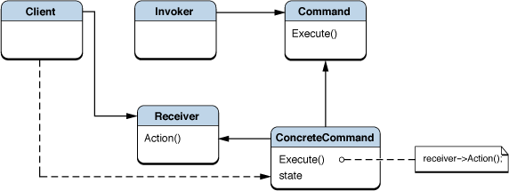
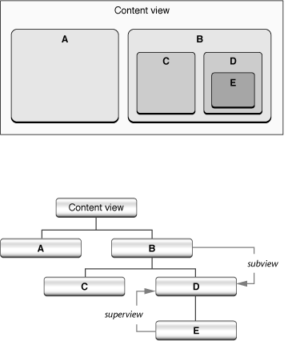
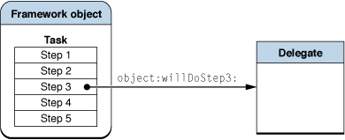
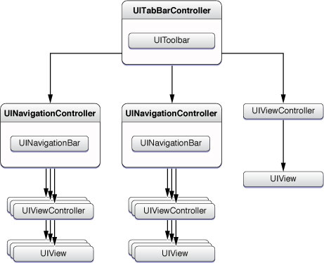
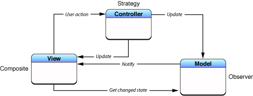
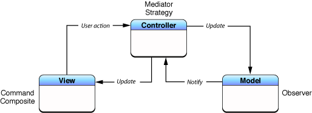
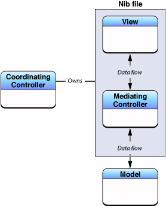
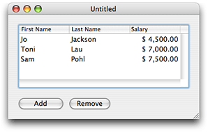
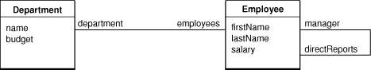
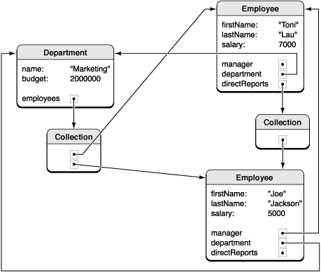

> 导航：[总目录](../../../README.md) · [文档](../../../_indexes/documentation.md) · [Cocoa 基础指南](Introduction.md)


[下一页](Communicating%20with%20Objects.md)[上一页](Adding%20Behavior%20to%20a%20Cocoa%20Program.md)

# Cocoa 设计模式

Cocoa 环境的许多架构和机制都有效地运用了设计模式（design pattern）：这是一种解决特定语境下反复出现的问题的抽象设计。本章描述了 Cocoa 中设计模式的主要实现，尤其关注 Model-View-Controller 和对象建模。本章的主要目的是让你更充分地意识到 Cocoa 中的设计模式，并鼓励你在自己的软件项目中善用这些模式。

设计模式是一种设计模板，用于解决特定语境下普遍存在、反复出现的问题。它是一种抽象工具，不仅在软件开发中有用，在建筑和工程等领域同样适用。以下各节将概述什么是设计模式、说明它们对面向对象设计为何重要，并给出一个示例设计模式。

作为开发者，你可能已经熟悉面向对象编程中设计模式的概念。它们最早在《设计模式：可复用面向对象软件的基础》（_Design Patterns: Elements of Reusable Object-Oriented Software_）一书中得到权威的描述和分类，作者是 Erich Gamma、Richard Helm、Ralph Johnson 和 John Vlissides（通称"四人帮"，Gang of Four）。该书最初出版于 1994 年，此后很快出现了其他书籍和文章，进一步探讨和阐述了面向对象系统中的设计模式。

设计模式的简明定义是"某一语境下对某个问题的解法"。让我们从这句话的后半部分往前解析：语境（context）是模式适用的反复出现的情形；问题（problem）是你在该语境下要达成的目标，以及该语境所附带的各种约束；而解法（solution）正是你所追求的——一种能够实现目标并解决约束的、针对该语境的通用设计。

设计模式抽象出了一个已被时间证明行之有效的具体设计的结构要点。模式有一个名称，并标识出参与该模式的类和对象及其各自的职责与协作方式。它还阐明了后果（成本与收益）以及该模式适用的情形。设计模式是某种特定设计的模板或指南；从某种意义上说，一个具体的设计就是某个模式的"实例化"。设计模式并非绝对不变的，在应用方式上有一定的灵活性，编程语言、既有架构等因素往往会决定模式的具体应用方式。

若干设计主题或原则影响着设计模式。这些设计原则是构建面向对象系统的经验法则，例如"封装系统结构中会变化的部分"和"面向接口编程，而不是面向实现编程"。它们表达了重要的洞见。例如，如果你把系统中会变化的部分隔离出来并加以封装，只要你为它们定义的接口不依赖于具体实现细节，这些部分就能独立于系统其他部分发生变化。这样一来，你以后就可以修改或扩展这些可变部分，而不影响系统的其他部分。你因而消除了依赖关系，减少了各部分之间的耦合，系统也就变得更灵活、更易于修改。

正是这些好处使设计模式成为编写软件时的重要考量。如果你在程序设计中发现、改造并使用了某种模式，那么这个程序——以及它所包含的对象和类——将会更具可复用性、更易扩展，并且在未来需求变化时也更容易修改。此外，基于设计模式的程序通常比不基于设计模式的程序更优雅、更高效，因为它们实现同一目标所需的代码行数更少。

"四人帮"那本书的主要内容是一份设计模式目录。该目录按范围（类或对象）和目的（创建型、结构型或行为型）对模式进行分类。目录中的每一条都讨论了某个设计模式的意图、动机、适用性、结构、参与者、协作方式、后果和实现方式。其中一条便是命令（Command）模式（一种对象行为型模式）。

书中将命令模式的意图描述为"将请求封装为一个对象，从而让你可以用不同的请求对客户端进行参数化，对请求排队或记录日志，并支持可撤销的操作"。该模式将发送消息的对象与接收和处理这些消息的对象分离开来。消息的发起者（客户端）通过将一个或多个针对特定接收者的动作绑定在一起来封装一个请求。封装后的消息可以在对象之间传递，可以放入队列或以其他方式存储以供之后调用，也可以动态修改以改变接收者或消息参数。图 4-1 展示了该模式的结构图。

__图 4-1__  命令模式的结构图



对于熟悉 Cocoa 的开发者来说，这段关于命令模式的简短概述可能会让人有似曾相识之感。该模式恰好描述了 Foundation 框架中一个用于封装消息的类：[NSInvocation](https://developer.apple.com/documentation/foundation/nsinvocation)。正如该模式的意图所述，其用途之一就是让操作变得可撤销。invocation 对象被用于 Cocoa 的撤销管理设计，也用于分布式对象（distributed objects，一种进程间通信架构）。命令模式还（虽然不那么贴切地）描述了 Cocoa 的目标-动作机制，在该机制中，用户界面控件对象会封装用户激活它们时所发送消息的目标和动作。

在其框架类、语言和运行时中，Cocoa 已经为你实现了目录中记载的许多设计模式。（这些实现在 [Cocoa 如何采纳设计模式](#apple-f4xwc4dqnrsv64tfmyxwi33df52wszbpkridimbqgazdsnzufvbuqnrnknltk) 中有所描述。）你可以通过使用这些"现成"的设计模式改造版来满足许多开发需求。或者，你也可能认为自己的问题及其语境需要一个全新的、基于模式的自定义设计。重要的是，在开发软件时要意识到各种模式，并在适当的时候在自己的设计中使用它们。

在 Cocoa 中，无论是 OS X 版本还是 iOS 版本，你都能找到设计模式的各种改造应用。基于模式的机制和架构在 Cocoa 框架以及 Objective-C 运行时和语言中都很常见。Cocoa 常常给某个模式打上自己独特的印记，因为它的设计会受到诸如语言能力或既有架构等因素的影响。

本节概述了《设计模式：可复用面向对象软件的基础》一书中所收录的绝大多数设计模式。每一小节不仅概述了该模式，还讨论了 Cocoa 对它的实现方式。这里只列出了 Cocoa 实现的模式，后文对每种模式的描述都针对特定的 Cocoa 语境展开。

Cocoa 中设计模式的实现形式多种多样。以下各节所描述的一些设计——例如协议和分类——属于 Objective-C 语言本身的特性。在另一些情况下，"某个模式的实例"是在单个类或一组相关类中实现的（例如类簇和单例类）。还有一些情况下，模式的改造体现为一个重大的框架架构，比如响应者链。有些基于模式的机制你几乎是"免费"获得的，而有些则需要你自己动手实现。即使 Cocoa 没有实现某个模式，只要情况需要，也鼓励你自行实现；例如，在扩展类行为时，对象组合（装饰器模式）往往是比派生子类更好的技巧。

有两个设计模式留到后面的小节详细讨论：Model-View-Controller（MVC）和对象建模。MVC 是一种复合模式，即它是建立在若干目录模式之上的。对象建模在"四人帮"的目录中没有对应项，而是源自关系数据库领域。但 MVC 和对象建模或许是 Cocoa 中最重要、最普遍的设计模式，并且在很大程度上它们是相互关联的模式。它们在诸如绑定、撤销管理、脚本化以及文档架构等多项技术的设计中都发挥着关键作用。要进一步了解这些模式，参见 [Model-View-Controller 设计模式](#apple-f4xwc4dqnrsv64tfmyxwi33df52wszbpkridimbqgazdsnzufvbuqnrnknltc) 和 [对象建模](#apple-f4xwc4dqnrsv64tfmyxwi33df52wszbpkridimbqgazdsnzufvbuqnrnknlte)。

抽象工厂（Abstract Factory）模式提供了一个用于创建一系列相关或相互依赖的对象的接口，而无需指定它们具体的类。客户端由此与工厂所获取的具体对象的任何细节解耦。

类簇（class cluster）是一种架构，它把若干私有的具体子类归并到一个公开的抽象超类之下。抽象超类声明了用于创建其私有子类实例的方法。超类会根据所调用的创建方法，分派一个类型合适的具体子类对象。每次返回的对象可能属于不同的私有具体子类。

Cocoa 中的类簇只能生成那些数据存储方式会随情况而变化的对象。Foundation 框架为 [NSString](https://developer.apple.com/library/archive/documentation/LegacyTechnologies/WebObjects/WebObjects_3.5/Reference/Frameworks/ObjC/Foundation/Classes/NSStringClassCluster/Description.html#//apple_ref/occ/cl/NSString)、[NSData](https://developer.apple.com/library/archive/documentation/LegacyTechnologies/WebObjects/WebObjects_3.5/Reference/Frameworks/ObjC/Foundation/Classes/NSDataClassCluster/Description.html#//apple_ref/occ/cl/NSData)、[NSDictionary](https://developer.apple.com/library/archive/documentation/LegacyTechnologies/WebObjects/WebObjects_3.5/Reference/Frameworks/ObjC/Foundation/Classes/NSDictionaryClassClstr/Description.html#//apple_ref/occ/cl/NSDictionary)、[NSSet](https://developer.apple.com/library/archive/documentation/LegacyTechnologies/WebObjects/WebObjects_3.5/Reference/Frameworks/ObjC/Foundation/Classes/NSSetClassCluster/Description.html#//apple_ref/occ/cl/NSSet) 和 [NSArray](https://developer.apple.com/library/archive/documentation/LegacyTechnologies/WebObjects/WebObjects_3.5/Reference/Frameworks/ObjC/Foundation/Classes/NSArrayClassCluster/Description.html#//apple_ref/occ/cl/NSArray) 对象提供了类簇。这些公开的超类既包括这些不可变类，也包括与之对应的可变类 [NSMutableString](https://developer.apple.com/library/archive/documentation/LegacyTechnologies/WebObjects/WebObjects_3.5/Reference/Frameworks/ObjC/Foundation/Classes/NSStringClassCluster/Description.html#//apple_ref/occ/cl/NSMutableString)、[NSMutableData](https://developer.apple.com/library/archive/documentation/LegacyTechnologies/WebObjects/WebObjects_3.5/Reference/Frameworks/ObjC/Foundation/Classes/NSDataClassCluster/Description.html#//apple_ref/occ/cl/NSMutableData)、[NSMutableDictionary](https://developer.apple.com/library/archive/documentation/LegacyTechnologies/WebObjects/WebObjects_3.5/Reference/Frameworks/ObjC/Foundation/Classes/NSDictionaryClassClstr/Description.html#//apple_ref/occ/cl/NSMutableDictionary)、[NSMutableSet](https://developer.apple.com/library/archive/documentation/LegacyTechnologies/WebObjects/WebObjects_3.5/Reference/Frameworks/ObjC/Foundation/Classes/NSSetClassCluster/Description.html#//apple_ref/occ/cl/NSMutableSet) 和 [NSMutableArray](https://developer.apple.com/library/archive/documentation/LegacyTechnologies/WebObjects/WebObjects_3.5/Reference/Frameworks/ObjC/Foundation/Classes/NSArrayClassCluster/Description.html#//apple_ref/occ/cl/NSMutableArray)。

当你想创建某个类簇所代表类型的不可变或可变对象时，你会使用该类簇的某个公开类。类簇在简洁性和可扩展性之间存在权衡：类簇简化了类的接口，从而使这个类更容易学习和使用；但通常也更难为类簇的抽象超类创建自定义子类。

适配器（Adapter）设计模式把一个类的接口转换成客户端所期望的另一种接口。适配器让原本因为接口不兼容而无法协同工作的类能够协同工作，并将客户端与目标对象所属的类解耦。

协议（protocol）是一种语言层面（Objective-C）的特性，使得定义作为适配器模式实例的接口成为可能。协议本质上是一系列与具体类无关的方法声明。（在 Java 中，_interface_ 与 _protocol_ 是同义词。）如果你希望一个客户端对象能与另一个对象通信，但这两个对象接口不兼容导致沟通困难，你就可以定义一个协议。另一个对象所属的类随后正式采纳（adopt）该协议，并通过实现该协议的一个或多个方法来"遵从"（conform to）它。协议可能要求遵从的类实现其中某些方法，而将其余方法的实现留作可选。这样，客户端对象就可以通过该协议接口向另一个对象发送消息。

协议使一组方法声明独立于类层级结构之外。它们使得根据是否遵从某个协议（而不仅仅根据类的继承关系）对对象进行分组成为可能。`NSObject` 的 [conformsToProtocol:](https://developer.apple.com/library/archive/documentation/LegacyTechnologies/WebObjects/WebObjects_3.5/Reference/Frameworks/ObjC/Foundation/Protocols/NSObject/Description.html#//apple_ref/occ/intfm/NSObject/conformsToProtocol:) 方法可以让你验证一个对象是否归属于某个协议。

Cocoa 既有非正式协议，也有正式协议。非正式协议是 [NSObject](https://developer.apple.com/library/archive/documentation/LegacyTechnologies/WebObjects/WebObjects_3.5/Reference/Frameworks/ObjC/Foundation/Classes/NSObject/Description.html#//apple_ref/occ/cl/NSObject) 类上的一个分类，这使得任何对象都可能成为该分类中任意方法的实现者（参见 [分类](#apple-f4xwc4dqnrsv64tfmyxwi33df52wszbpkridimbqgazdsnzufvbuqnrnknltena)）。非正式协议中的方法可以选择性地实现。非正式协议是 OS X 中委托（delegation）机制实现的一部分（参见 [委托](#apple-f4xwc4dqnrsv64tfmyxwi33df52wszbpkridimbqgazdsnzufvbuqnrnknltcoi)）。

请注意，协议的设计并不完全符合适配器模式的描述，但它实现了该模式的目标：让原本接口不兼容的类能够协同工作。

你使用协议主要是为了声明一个接口，让那些在类层级上互不相关、但希望彼此通信的类都能遵从这个接口。但你也可以用协议来声明一个对象的接口，同时隐藏该对象所属的具体类。Cocoa 框架中包含许多正式协议，使自定义子类能够出于特定目的与它们通信。例如，Foundation 框架包含 [NSObject](https://developer.apple.com/library/archive/documentation/LegacyTechnologies/WebObjects/WebObjects_3.5/Reference/Frameworks/ObjC/Foundation/Protocols/NSObject/Description.html#//apple_ref/occ/intf/NSObject)、[NSCopying](https://developer.apple.com/library/archive/documentation/LegacyTechnologies/WebObjects/WebObjects_3.5/Reference/Frameworks/ObjC/Foundation/Protocols/NSCopying/Description.html#//apple_ref/occ/intf/NSCopying) 和 [NSCoding](https://developer.apple.com/library/archive/documentation/LegacyTechnologies/WebObjects/WebObjects_3.5/Reference/Frameworks/ObjC/Foundation/Protocols/NSCoding/Description.html#//apple_ref/occ/intf/NSCoding) 协议，这些都是非常重要的协议。AppKit 的协议包括 [NSDraggingInfo](https://developer.apple.com/documentation/appkit/nsdragginginfo)、[NSTextInput](https://developer.apple.com/documentation/appkit/nstextinput) 和 [NSChangeSpelling](https://developer.apple.com/documentation/appkit/nschangespelling)。UIKit 的协议包括 [UITextInputTraits](https://developer.apple.com/documentation/uikit/uitextinputtraits)、[UIWebViewDelegate](https://developer.apple.com/documentation/uikit/uiwebviewdelegate) 和 [UITableViewDataSource](https://developer.apple.com/documentation/uikit/uitableviewdatasource)。

正式协议隐含地要求遵从的类实现其中_所有_已声明的方法。不过，协议可以用 `@optional` 指令标记单个方法或一组方法，遵从的类可以选择是否实现这些方法。正式协议也比较脆弱：一旦你定义了一个协议并将其提供给其他类使用，之后对该协议的任何改动（新增可选方法除外）都可能破坏那些类。

责任链（Chain of Responsibility）设计模式通过让多个对象都有机会处理某个请求，将请求的发送者与接收者解耦。该模式把各个接收对象串联成一条链，请求沿着这条链传递，直到有对象处理它为止。链上的每个对象要么处理该请求，要么将其传递给链上的下一个对象。

应用程序框架中包含一种称为响应者链（responder chain）的架构。这条链由一系列响应者对象（即继承自 [NSResponder](https://developer.apple.com/documentation/appkit/nsresponder)，或在 UIKit 中继承自 [UIResponder](https://developer.apple.com/documentation/uikit/uiresponder) 的对象）组成，事件（例如鼠标点击）或动作消息沿着这条链传递，并且（通常）最终会被处理。如果某个响应者对象不处理某条特定消息，它就会把该消息传给链上的下一个响应者。响应者在链中的顺序通常由视图层级结构决定，沿着从层级中较低层到较高层的响应者依次推进，最终到达管理该视图层级结构的窗口对象、窗口对象的委托，或者全局的应用程序对象。事件与动作消息在响应者链中向上传递的路径是不同的。一个应用程序可以拥有和它的窗口（甚至局部的视图层级结构）一样多的响应者链，但同一时刻只能有一条响应者链处于活跃状态——即与当前活跃窗口相关联的那条。

AppKit 框架还为错误处理实现了一条类似的响应者链。

视图层级结构的设计与响应者链密切相关，它采纳了组合（Composite）模式（参见 [组合](#apple-f4xwc4dqnrsv64tfmyxwi33df52wszbpkridimbqgazdsnzufvbuqnrnknltcni)）。动作消息——即源自控件对象的消息——则基于目标-动作机制，这是命令模式的一个实例（参见 [命令](#apple-f4xwc4dqnrsv64tfmyxwi33df52wszbpkridimbqgazdsnzufvbuqnrnknltcna)）。

无论是使用 Interface Builder 还是以编程方式构建程序的用户界面，你都能"免费"得到一条或多条响应者链。响应者链与视图层级结构相辅相成，当你把一个视图对象设为某个窗口内容视图的子视图时，就会自动获得视图层级结构。如果你把一个自定义视图添加到某个视图层级结构中，它就会成为响应者链的一部分。只要实现相应的 `NSResponder` 或 `UIResponder` 方法，你就可以接收并处理事件和动作消息。作为窗口对象或全局应用程序对象（在 AppKit 中是 `NSApp`）的委托的自定义对象，同样可以接收并处理这些消息。

你也可以通过编程方式把自定义响应者插入响应者链，并以编程方式调整响应者的顺序。

命令（Command）设计模式将一个请求封装为一个对象，从而让你可以用不同的请求对客户端进行参数化，对请求排队或记录日志，并支持可撤销的操作。该请求对象将一个或多个针对特定接收者的动作绑定在一起。命令模式将发出请求的对象与接收和执行该请求的对象分离开来。

[NSInvocation](https://developer.apple.com/documentation/foundation/nsinvocation) 类的一个实例封装了一条 Objective-C 消息。一个 invocation 对象包含目标对象、方法选择器（selector）和方法参数。你可以动态修改 invocation 对象所派发消息的目标及其参数；invocation 执行完毕后，你还可以从该对象获取返回值。借助单个 invocation 对象，你可以通过改变目标和参数的多种组合，反复调用某条消息。

创建一个 `NSInvocation` 对象需要一个 [NSMethodSignature](https://developer.apple.com/library/archive/documentation/LegacyTechnologies/WebObjects/WebObjects_3.5/Reference/Frameworks/ObjC/Foundation/Classes/NSMethodSignature/Description.html#//apple_ref/occ/cl/NSMethodSignature) 对象，后者封装了与某个方法的参数和返回值相关的类型信息。而 `NSMethodSignature` 对象本身则是由一个方法选择器创建的。`NSInvocation` 的实现还用到了 Objective-C 运行时的一些函数。

`NSInvocation` 对象是分布式对象、撤销管理、消息转发和定时器等编程接口的一部分。在类似的场景中，只要你需要把发送消息的对象与接收消息的对象解耦，也可以使用 invocation 对象。

分布式对象技术用于进程间通信。关于分布式对象的更多内容，参见 [代理](#apple-f4xwc4dqnrsv64tfmyxwi33df52wszbpkridimbqgazdsnzufvbuqnrnknltcny)。

目标-动作机制（target-action mechanism）使控件对象——例如按钮、滑动条或文本框之类的对象——能够向另一个对象发送消息，由该对象将其解读并作为特定于应用程序的指令来处理。接收消息的对象，即目标（target），通常是一个自定义控制器对象。这条被称为动作消息（action message）的消息，由一个选择器（selector，方法在运行时的唯一标识符）决定。

在 AppKit 框架中，控件所拥有的 cell 对象通常封装了目标和动作。当用户点击或以其他方式激活该控件时，控件会从其 cell 中提取信息并发送消息。（菜单项同样封装了目标和动作，并在用户选择该菜单项时发送一条动作消息。）目标-动作机制之所以能仅凭一个选择器（而不需要方法签名）就能正常工作，是因为按照约定，AppKit 中动作方法的签名始终是相同的。

在 UIKit 中，目标-动作机制不依赖 cell。取而代之的是，控件会把目标和动作映射到该控件上可能发生的一个或多个多点触控事件。

在创建 Cocoa 应用程序时，你可以通过 Interface Builder 应用程序来设置控件的动作和目标。这样一来，你就可以让控件发起自定义行为，而无需为控件本身编写任何代码。动作选择器和目标连接会被归档在 nib 文件中，并在 nib 文件被解档时恢复。你也可以通过向控件或其 cell 发送 `setTarget:` 和 `setAction:` 消息来动态改变目标和动作。

面向 OS X 的 Cocoa 应用程序可以使用目标-动作机制，指示自定义控制器对象将数据从用户界面传输到模型对象，或者在模型对象中显示数据。Cocoa 绑定技术使得为此目的使用目标-动作机制变得不再必要。关于该技术的更多内容，参见 _[Cocoa Bindings Programming Topics](../Cocoa%20Bindings%20Programming%20Topics/Introduction%20to%20Cocoa%20Bindings%20Programming%20Topics.md#apple-f4xwc4dqnrsv64tfmyxwi33df52wszbpgeydambqge3do2i)_。

控件和 cell 不会保留（retain）它们的目标。更多信息参见 [Ownership of Delegates, Observers, and Targets](Communicating%20with%20Objects.md#apple-f4xwc4dqnrsv64tfmyxwi33df52wszbpkridimbqgazdsnzufvbuqnznknltcnq)。

组合（Composite）设计模式把相关对象组合成树形结构，以表示"部分—整体"的层级关系。该模式让客户端能够统一对待单个对象与对象的组合体。

组合模式是 Model-View-Controller 复合模式的组成部分之一，参见 [Model-View-Controller 设计模式](#apple-f4xwc4dqnrsv64tfmyxwi33df52wszbpkridimbqgazdsnzufvbuqnrnknltc)。

窗口中的各个视图（[NSView](https://developer.apple.com/documentation/appkit/nsview) 或 [UIView](https://developer.apple.com/documentation/uikit/uiview) 对象）在内部被组织成一个视图层级结构。该层级结构的根部是一个窗口（[NSWindow](https://developer.apple.com/documentation/appkit/nswindow) 或 [UIWindow](https://developer.apple.com/documentation/uikit/uiwindow) 对象）及其内容视图（content view）——一个填满窗口内容矩形区域的透明视图。被添加到内容视图中的视图成为它的子视图（subview），而这些视图又成为添加到它们之上的任何视图的父视图（superview）。除了内容视图之外，每个视图都恰好有一个父视图，以及零个或任意多个子视图。你可以把这种结构理解为一种包含关系：父视图包含它的子视图。图 4-2 展示了视图层级结构在视觉和结构上的样貌。

__图 4-2__  视图层级结构，视觉与结构两个方面



视图层级结构是一种结构性架构，在绘制和事件处理中都发挥着作用。一个视图有两个边界矩形——它的 frame 和它的 bounds，二者都会影响该视图上图形操作的具体表现。frame 是外部边界，它在父视图的坐标系中确定该视图的位置、定义其尺寸，并将绘制裁剪到该视图的边缘范围内。bounds 是内部边界矩形，定义了视图在其自身绘制表面上使用的内部坐标系。

当窗口系统要求某个窗口为显示做准备时，父视图会在其子视图之前被要求进行渲染。当你向某个视图发送某些消息时——例如一条要求视图重绘自身的消息——该消息会传播到其子视图。因此，你可以把视图层级结构中的某一分支当作一个统一的视图来对待。

响应者链在处理事件和动作消息时也会用到视图层级结构。参见 [责任链](#apple-f4xwc4dqnrsv64tfmyxwi33df52wszbpkridimbqgazdsnzufvbuqnrnknlteni) 中对响应者链的概述。

无论是以编程方式还是使用 Interface Builder，只要你把一个视图添加到另一个视图中，你就是在创建或修改一个视图层级结构。AppKit 框架会自动处理与视图层级结构相关的所有关系。

装饰器（Decorator）设计模式为对象动态地附加额外的职责。装饰器为通过派生子类来扩展功能提供了一种更灵活的替代方案。和派生子类一样，采纳装饰器模式可以让你在不修改既有代码的情况下加入新的行为。装饰器包裹（wrap）着一个它所扩展其行为的类的对象。装饰器实现与被包裹对象相同的接口，并在把任务委托给被包裹对象之前或之后加入自己的行为。装饰器模式体现了这样一条设计原则：类应当对扩展开放，对修改封闭。

装饰器是一种对象组合模式，鼓励你在自己的代码中运用它（参见 [When to Make a Subclass](Adding%20Behavior%20to%20a%20Cocoa%20Program.md#apple-f4xwc4dqnrsv64tfmyxwi33df52wszbpkridimbqgazdsnzufvbuqnjnknltemq)）。不过，Cocoa 也提供了一些基于该模式的自有类和机制（在以下各节中讨论）。在这些实现中，扩展对象并不会完全复制其所包裹对象的接口，各实现在共享接口的技巧上也各不相同。

Cocoa 在若干类的实现中使用了装饰器模式，包括 [NSAttributedString](https://developer.apple.com/library/archive/documentation/LegacyTechnologies/WebObjects/WebObjects_3.5/Reference/Frameworks/ObjC/Foundation/Classes/NSAttributedStrngClstr/Description.html#//apple_ref/occ/cl/NSAttributedString)、[NSScrollView](https://developer.apple.com/documentation/appkit/nsscrollview) 和 [UIDatePicker](https://developer.apple.com/documentation/uikit/uidatepicker)。后两个类是复合视图（compound view）的例子，它们把其他视图类的简单对象组合在一起，并协调这些对象之间的交互。

委托（delegation）是一种机制：宿主对象持有一个指向另一个对象——它的委托（delegate）——的弱引用（这里的"弱"是指它只是一个简单的指针引用，不做保留），并在完成某项任务需要输入时，定期向该委托发送消息。宿主对象通常是一个"现成的"框架对象（例如 [NSWindow](https://developer.apple.com/documentation/appkit/nswindow) 或 [NSXMLParser](https://developer.apple.com/documentation/foundation/xmlparser) 对象），它想要完成某件事，但只能以通用的方式来做。委托几乎总是一个自定义类的实例，它与宿主对象协同工作，在任务执行的某些环节提供特定于程序的行为（见图 4-3）。因此，委托机制使得在不派生子类的情况下修改或扩展另一个对象的行为成为可能。

__图 4-3__  框架对象向其委托发送消息



从一个对象把某项任务委托给另一个对象这种朴素的意义上说，委托是面向对象编程中的一种常见技巧。然而，Cocoa 以一种独特的方式实现了委托机制。宿主类使用一个正式协议或非正式协议来定义一个接口，委托对象可以选择是否实现该接口。非正式协议中的所有方法都是可选的，而正式协议也可以声明可选方法，使委托只实现协议中的部分方法。宿主对象在尝试向其委托发送消息之前，会（通过发送 [respondsToSelector:](https://developer.apple.com/library/archive/documentation/LegacyTechnologies/WebObjects/WebObjects_3.5/Reference/Frameworks/ObjC/Foundation/Protocols/NSObject/Description.html#//apple_ref/occ/intfm/NSObject/respondsToSelector:) 消息）判断该委托是否实现了这个方法，以避免运行时异常。关于正式协议和非正式协议的更多内容，参见 [协议](#apple-f4xwc4dqnrsv64tfmyxwi33df52wszbpkridimbqgazdsnzufvbuqnrnknlteny)。

Cocoa 框架中的一些类也会向它们的数据源（data source）发送消息。数据源在各方面都和委托相同，只不过其目的是为宿主对象提供数据，以填充浏览器（browser）、表格视图或类似的用户界面视图。和委托不同的是，数据源可能还被要求实现协议中的某些方法。

委托并不是装饰器模式的严格实现。宿主（委托方）对象并没有包裹它想要扩展的那个类的实例；恰恰相反，是委托对象在特化宿主框架类的行为。除了框架类所声明的委托方法之外，二者之间也没有接口共享。

Cocoa 中的委托机制也是模板方法模式的一部分（参见 [模板方法](#apple-f4xwc4dqnrsv64tfmyxwi33df52wszbpkridimbqgazdsnzufvbuqnrnknltenq)）。

委托是 Cocoa 框架中的常见设计。AppKit 和 UIKit 框架中的许多类都会向委托发送消息，包括 [NSApplication](https://developer.apple.com/documentation/appkit/nsapplication)、[UIApplication](https://developer.apple.com/documentation/uikit/uiapplication)、[UITableView](https://developer.apple.com/documentation/uikit/uitableview)，以及 [NSView](https://developer.apple.com/documentation/appkit/nsview) 的若干子类。Foundation 框架中的一些类，例如 `NSXMLParser` 和 [NSStream](https://developer.apple.com/documentation/foundation/stream)，也维护着委托。除非委托方法无法满足你的目标，否则你应当始终使用某个类自身的委托机制，而不是派生该类的子类。

虽然你可以动态改变委托，但同一时刻只能有一个对象充当委托。因此，如果你希望多个对象同时获知某个特定的程序事件，就不能使用委托机制，但你可以为此使用通知机制。只要委托实现了框架类所声明的一个或多个通知方法，它就会自动收到来自其宿主框架对象的通知。参见观察者模式中关于通知的讨论（[观察者](#apple-f4xwc4dqnrsv64tfmyxwi33df52wszbpkridimbqgazdsnzufvbuqnrnknltema)）。

AppKit 中的宿主对象不会保留（retain）它们的委托或数据源。更多信息参见 [Ownership of Delegates, Observers, and Targets](Communicating%20with%20Objects.md#apple-f4xwc4dqnrsv64tfmyxwi33df52wszbpkridimbqgazdsnzufvbuqnznknltcnq)。

分类（category）是 Objective-C 语言的一项特性，让你无需派生子类就能为某个类添加方法（包括接口和实现）。在你的程序范围内，类原有的方法与分类添加的方法在运行时没有任何区别。分类中的方法会成为该类类型的一部分，并被该类的所有子类继承。

与委托一样，分类也不是装饰器模式的严格改造，它实现了该模式的意图，但采用了不同的实现路径。分类所添加的行为是编译期产物，而不是动态获得的；此外，分类也不封装被扩展类的实例。

Cocoa 框架定义了大量分类，其中大多数都是非正式协议（在 [协议](#apple-f4xwc4dqnrsv64tfmyxwi33df52wszbpkridimbqgazdsnzufvbuqnrnknlteny) 中有所概述）。框架经常用分类来把相关方法组织在一起。你也可以在自己的代码中实现分类，以便在不派生子类的情况下扩展类，或者把相关方法组织在一起。不过，你应当留意以下几点：

- 你不能为该类添加实例变量。
- 如果你重写了该类的已有方法，应用程序的行为可能变得不可预测。

外观（Facade）设计模式为某个子系统内的一组接口提供一个统一的接口。该模式定义了一个更高层次的接口，通过降低复杂度、隐藏子系统之间的通信与依赖关系，使子系统更易使用。

AppKit 框架的 [NSImage](https://developer.apple.com/documentation/appkit/nsimage) 类为加载和使用图像提供了一个统一的接口，这些图像既可以是基于位图的（例如 JPEG、PNG 或 TIFF 格式），也可以是基于矢量的（例如 EPS 或 PDF 格式）。`NSImage` 可以为同一张图像保存不止一种表示形式，每种表示形式都是一个 [NSImageRep](https://developer.apple.com/documentation/appkit/nsimagerep) 对象。`NSImage` 会自动为特定类型的数据和给定的显示设备选择合适的表示形式，还隐藏了图像处理和选择的细节，使客户端可以互换地使用许多不同的底层表示形式。

由于 `NSImage` 支持图像的多种不同表示形式，某些被请求的特性可能并不适用。例如，如果底层图像表示是基于矢量、且与设备无关的，那么向图像询问某个像素的颜色就无法奏效。

迭代器（Iterator）设计模式提供了一种在不暴露聚合对象（即集合）底层表示的情况下，依次访问其元素的方式。迭代器模式把访问和遍历集合元素的职责从集合本身转移到一个迭代器对象上。迭代器定义了一个用于访问集合元素的接口，并记录当前元素的位置。不同的迭代器可以实施不同的遍历策略。

Foundation 框架中的 [NSEnumerator](https://developer.apple.com/library/archive/documentation/LegacyTechnologies/WebObjects/WebObjects_3.5/Reference/Frameworks/ObjC/Foundation/Classes/NSEnumerator/Description.html#//apple_ref/occ/cl/NSEnumerator) 类实现了迭代器模式。抽象类 `NSEnumerator` 的私有具体子类返回的枚举器（enumerator）对象，能够依次遍历各种类型的集合——数组、集合（set）、字典（值和键）——并把集合中的对象返回给客户端。

[NSDirectoryEnumerator](https://developer.apple.com/library/archive/documentation/LegacyTechnologies/WebObjects/WebObjects_3.5/Reference/Frameworks/ObjC/Foundation/Classes/NSDirectoryEnumerator/Description.html#//apple_ref/occ/cl/NSDirectoryEnumerator) 是一个关系较远的类，该类的实例递归地枚举文件系统中某个目录的内容。

诸如 [NSArray](https://developer.apple.com/library/archive/documentation/LegacyTechnologies/WebObjects/WebObjects_3.5/Reference/Frameworks/ObjC/Foundation/Classes/NSArrayClassCluster/Description.html#//apple_ref/occ/cl/NSArray)、[NSSet](https://developer.apple.com/library/archive/documentation/LegacyTechnologies/WebObjects/WebObjects_3.5/Reference/Frameworks/ObjC/Foundation/Classes/NSSetClassCluster/Description.html#//apple_ref/occ/cl/NSSet) 和 [NSDictionary](https://developer.apple.com/library/archive/documentation/LegacyTechnologies/WebObjects/WebObjects_3.5/Reference/Frameworks/ObjC/Foundation/Classes/NSDictionaryClassClstr/Description.html#//apple_ref/occ/cl/NSDictionary) 这样的集合类都包含一些方法，可以返回一个与该集合类型相匹配的枚举器。所有枚举器的工作方式都是一样的：你在一个循环中向枚举器对象发送 [nextObject](https://developer.apple.com/library/archive/documentation/LegacyTechnologies/WebObjects/WebObjects_3.5/Reference/Frameworks/ObjC/Foundation/Classes/NSEnumerator/Description.html#//apple_ref/occ/instm/NSEnumerator/nextObject) 消息，当返回的不再是集合中的下一个对象，而是 `nil` 时，循环退出。

你也可以使用快速枚举（fast enumeration）来访问集合的元素；这项语言特性在 [Fast Enumeration](Cocoa%20Objects.md#apple-f4xwc4dqnrsv64tfmyxwi33df52wszbpkridimbqgazdsnzufvbuqnbnknltiny) 中有所描述。

中介者（Mediator）设计模式定义了一个封装一组对象如何交互的对象。中介者通过避免对象之间彼此显式引用来促进松耦合，并让你能够独立地改变它们之间的交互方式。这些对象因而能保持更高的可复用性。

在该模式中，一个"中介者对象"集中了系统中各对象之间复杂的通信与控制逻辑。这些对象在自身状态发生变化时会告知中介者对象，反过来也会响应中介者对象发出的请求。

Model-View-Controller 设计模式为面向对象系统（例如一个应用程序）中的对象分配角色。它们可以是模型（model）对象——包含应用程序的数据并对该数据进行操作；可以是视图（view）对象——呈现数据并响应用户操作；也可以是控制器（controller）对象——在模型和视图对象之间进行调解。控制器对象契合中介者模式。

在 Cocoa 中，控制器对象大体上可以分为两类：中介控制器（mediating controller）或协调控制器（coordinating controller）。中介控制器负责在应用程序的视图对象和模型对象之间调解数据流动，通常是 [NSController](https://developer.apple.com/documentation/appkit/nscontroller) 对象。协调控制器为应用程序实现集中式的通信与控制逻辑，充当框架对象的委托，以及动作消息的目标。它们通常是 [NSWindowController](https://developer.apple.com/documentation/appkit/nswindowcontroller) 对象，或者自定义 [NSObject](https://developer.apple.com/library/archive/documentation/LegacyTechnologies/WebObjects/WebObjects_3.5/Reference/Frameworks/ObjC/Foundation/Classes/NSObject/Description.html#//apple_ref/occ/cl/NSObject) 子类的实例。由于协调控制器针对特定程序高度特化，因此往往不太具有可复用性。

AppKit 框架中的抽象类 `NSController` 及其具体子类是 Cocoa 绑定（bindings）技术的一部分，该技术能自动同步模型对象中包含的数据、与视图对象中显示和编辑的数据。例如，如果用户编辑了文本框中的字符串，绑定技术就会——通过一个中介控制器——把这一变化传达给绑定模型对象的相应属性。程序员所要做的，只是恰当地设计好自己的模型对象，然后使用 Interface Builder，在程序的视图、控制器和模型对象之间建立绑定。

这些具体的公开控制器类的实例可以从 Interface Builder 库中获取，因而具有很高的可复用性。它们提供了诸如选择项管理和占位值管理等服务。这些对象执行以下具体功能：

- [NSObjectController](https://developer.apple.com/documentation/appkit/nsobjectcontroller) 管理单个模型对象。
- [NSArrayController](https://developer.apple.com/documentation/appkit/nsarraycontroller) 管理一个模型对象数组并维护一个选择项；它还允许你向数组中添加对象或从数组中移除对象。
- [NSTreeController](https://developer.apple.com/documentation/appkit/nstreecontroller) 让你能在一个层级化的树形结构中添加、移除和管理模型对象。
- [NSUserDefaultsController](https://developer.apple.com/documentation/appkit/nsuserdefaultscontroller) 为偏好设置（用户默认值）系统提供了一个便捷的接口。

通常你会把 `NSController` 对象用作中介控制器，因为这些对象正是为在应用程序的视图对象和模型对象之间传递数据而设计的。要使用一个中介控制器，你通常需要从 Interface Builder 库中把该对象拖出来，指定模型对象的属性键，然后在 Interface Builder 信息窗口的 Bindings 面板中，在视图对象和模型对象之间建立绑定。你也可以派生 `NSController` 或其某个子类的子类，以获得更专门化的行为。

只要一对对象都遵从 `NSKeyValueCoding` 和 `NSKeyValueObserving` 这两个非正式协议，你几乎可以在任意一对对象之间建立绑定。但要获得 `NSController` 及其子类所带来的全部好处，最好通过中介控制器来建立绑定。

协调控制器通过以下方式集中应用程序中的通信与控制逻辑：

- 维护指向模型对象和视图对象的 outlet（outlet 是持有对其他对象的连接或引用的实例变量）
- 通过目标-动作机制响应用户对视图对象的操作（参见 [目标-动作机制](#apple-f4xwc4dqnrsv64tfmyxwi33df52wszbpkridimbqgazdsnzufvbuqnrnknltcnq)）
- 充当框架对象所发送消息的委托（参见 [委托](#apple-f4xwc4dqnrsv64tfmyxwi33df52wszbpkridimbqgazdsnzufvbuqnrnknltcoi)）

以上这些连接——outlet、目标-动作和委托——通常都是在 Interface Builder 中建立的，并被归档在应用程序的 nib 文件中。

运行在 iOS 上的应用程序常常采用一种模态化、可导航的用户界面设计，用于展示应用程序数据模型中大小为一屏的各个部分。一个应用程序可能同时拥有导航栏和工具栏，二者之间是应用程序数据的当前视图。用户可以点按工具栏上的按钮来选择模式，点按导航栏上的按钮，以及点按当前视图中的控件，来遍历模型（数据）对象的层级结构；在层级结构的每一层，中心视图都会呈现更多细节。这个层级结构的末端通常是用户可以查看或编辑的某一项内容。（当然，应用程序也完全可以只使用导航栏或只使用工具栏。）

继承自 [UIViewController](https://developer.apple.com/documentation/uikit/uiviewcontroller) 的 view controller（视图控制器）是这种设计的核心。`UIViewController` 是一个抽象类，你可以通过派生子类来管理某个特定的视图。UIKit 框架还提供了用于管理导航栏和工具栏对象的 `UIViewController` 子类：[UINavigationController](https://developer.apple.com/documentation/uikit/uinavigationcontroller) 和 [UITabBarController](https://developer.apple.com/documentation/uikit/uitabbarcontroller)。如图 4-4 所示，一个 tab-bar controller 可以管理若干个 navigation controller，而每个 navigation controller 又可以管理一个或多个 view controller，每个 view controller 都关联着一个视图对象。除了管理视图（包括覆盖视图）之外，view controller 还指定了导航栏中显示的按钮和标题。

要进一步了解 view controller，参见 _[View Controller Programming Guide for iOS](https://developer.apple.com/library/archive/featuredarticles/ViewControllerPGforiPhoneOS/index.html#//apple_ref/doc/uid/TP40007457)_。

__图 4-4__  UIKit 中的 view controller



备忘录（Memento）模式捕获并外部化一个对象的内部状态——同时不破坏封装——使该对象日后能够恢复到这一状态。备忘录模式把某个关键对象的重要状态保存在该对象之外，以维持内聚性。

归档（archiving）把程序中的对象连同这些对象的属性（特性和关系）一起转换为一份归档，这份归档可以存储在文件系统中，也可以在进程之间或跨网络传输。归档以一种与体系结构无关的字节流形式，捕获程序的对象图，同时保留对象自身及对象之间关系的一致性。因为对象的类型会和它的数据一起被存储，所以从字节流解码得到的对象，通常会以原先被编码时相同的类进行实例化。

一般来说，你会想要归档程序中那些需要保留其状态的对象，模型对象几乎总是属于这一类。你通过编码把一个对象写入归档，也通过解码从归档中读出该对象。编码和解码都是通过一个 [NSCoder](https://developer.apple.com/library/archive/documentation/LegacyTechnologies/WebObjects/WebObjects_3.5/Reference/Frameworks/ObjC/Foundation/Classes/NSCoder/Description.html#//apple_ref/occ/cl/NSCoder) 对象执行的操作，最好使用键控归档（keyed archiving）技术（即调用 [NSKeyedArchiver](https://developer.apple.com/documentation/foundation/nskeyedarchiver) 和 [NSKeyedUnarchiver](https://developer.apple.com/documentation/foundation/nskeyedunarchiver) 类的方法）。被编码和解码的对象必须遵从 [NSCoding](https://developer.apple.com/library/archive/documentation/LegacyTechnologies/WebObjects/WebObjects_3.5/Reference/Frameworks/ObjC/Foundation/Protocols/NSCoding/Description.html#//apple_ref/occ/intf/NSCoding) 协议；归档过程中会调用该协议的方法。

属性列表（property list）是对一个对象图的简单结构化序列化，只使用以下这些类的对象：[NSDictionary](https://developer.apple.com/library/archive/documentation/LegacyTechnologies/WebObjects/WebObjects_3.5/Reference/Frameworks/ObjC/Foundation/Classes/NSDictionaryClassClstr/Description.html#//apple_ref/occ/cl/NSDictionary)、[NSArray](https://developer.apple.com/library/archive/documentation/LegacyTechnologies/WebObjects/WebObjects_3.5/Reference/Frameworks/ObjC/Foundation/Classes/NSArrayClassCluster/Description.html#//apple_ref/occ/cl/NSArray)、[NSString](https://developer.apple.com/library/archive/documentation/LegacyTechnologies/WebObjects/WebObjects_3.5/Reference/Frameworks/ObjC/Foundation/Classes/NSStringClassCluster/Description.html#//apple_ref/occ/cl/NSString)、[NSData](https://developer.apple.com/library/archive/documentation/LegacyTechnologies/WebObjects/WebObjects_3.5/Reference/Frameworks/ObjC/Foundation/Classes/NSDataClassCluster/Description.html#//apple_ref/occ/cl/NSData)、[NSDate](https://developer.apple.com/library/archive/documentation/LegacyTechnologies/WebObjects/WebObjects_3.5/Reference/Frameworks/ObjC/Foundation/Classes/NSDateClassCluster/Description.html#//apple_ref/occ/cl/NSDate) 以及 [NSNumber](https://developer.apple.com/library/archive/documentation/LegacyTechnologies/WebObjects/WebObjects_3.5/Reference/Frameworks/ObjC/Foundation/Classes/NSNumber/Description.html#//apple_ref/occ/cl/NSNumber)。这些对象通常被称为_属性列表对象_。若干 Cocoa 框架类提供了将这些属性列表对象序列化的方法，并为记录对象内容及其层级关系的数据流定义了特殊格式。[NSPropertyListSerialization](https://developer.apple.com/documentation/foundation/nspropertylistserialization) 类提供了一些类方法，可以把属性列表对象序列化为 XML 格式或经过优化的二进制格式，也可以从这两种格式反序列化回来。

如果对象图中的对象都比较简单，属性列表序列化就是一种灵活、可移植且足够用的方式，用来捕获和外部化一个对象及其状态。然而，这种序列化形式也有其局限性：它并不保留对象完整的类身份，只保留大致的种类（数组、字典、字符串等）。因此，从属性列表恢复出来的对象，其类可能与原始对象的类不同。当一个对象的可变性可能发生变化时，这尤其是个问题。属性列表序列化也不会记录某个对象在一个对象图中被多次引用的情况，这可能导致反序列化后出现多个实例，而在原始对象图中它们其实是同一个实例。

Core Data 是一个 Cocoa 框架，它定义了一种用于管理对象图并使其持久化的架构。正是持久化这第二项能力，使得 Core Data 成为备忘录模式的一种改造实现。

在 Core Data 架构中，一个称为_托管对象上下文_（managed object context）的中心对象管理着应用程序对象图中的各个模型对象。在托管对象上下文之下是该对象图的持久化栈（persistence stack）——一组在模型对象与外部数据存储（例如 XML 文件或关系数据库）之间进行调解的框架对象。持久化栈中的对象在存储中的数据与托管对象上下文中的相应对象之间建立映射；当存在多个数据存储时，它们还会把这些存储作为单一的聚合存储呈现给托管对象上下文。

Core Data 的设计也深受 Model-View-Controller 和对象建模这两种模式的影响。

在需要定义、管理复杂的模型对象图，并将其透明地归档到数据存储、或从数据存储解档的企业级应用程序开发中，Core Data 尤其有用。Xcode 开发环境包含了项目模板和设计工具，可以减少创建两大类 Core Data 应用程序（基于文档的和非基于文档的）所需的编程工作量。Interface Builder 应用程序的库中也包含了可配置的 Core Data 框架对象。

观察者（Observer）设计模式定义了对象之间的一种一对多依赖关系：当一个对象改变状态时，它所有的依赖对象都会自动收到通知并更新。观察者模式本质上是一种发布-订阅模型，在这种模型中，主题（subject）与其观察者是松耦合的。观察对象和被观察对象之间可以进行通信，而无需彼此深入了解对方。

Cocoa 的通知机制基于观察者模式，实现了消息的一对多广播。程序中的对象把自己或其他对象添加到一个或多个通知的观察者列表中，每个通知都由一个全局字符串（通知名称）标识。想要通知其他对象的对象——被观察对象——会创建一个通知对象，并将其发布（post）到通知中心。通知中心确定某个通知的观察者，并通过消息把该通知发送给它们。通知消息所调用的方法必须遵从某种特定的单参数签名。该方法的参数就是通知对象本身，其中包含通知名称、被观察对象，以及一个包含任何补充信息的字典。

发布一个通知是一个同步过程：在通知中心把该通知广播给所有观察者之前，发布该通知的对象不会重新获得控制权。若想实现异步行为，你可以把通知放入一个通知队列；这样一来，控制权会立即返回给发布通知的对象，而通知中心会在该通知到达队列顶端时再进行广播。

常规通知——即由通知中心广播的那些通知——只在进程内有效。如果你想向其他进程广播通知，可以使用分布式通知中心及其相关 API。

你可以出于多种原因使用通知。例如，你可以根据程序中其他地方发生的某个事件，广播一条通知来改变用户界面元素显示信息的方式；也可以用通知来确保文档中的各个对象在文档窗口关闭之前保存好自己的状态。通知的一般用途是把程序事件告知其他对象，以便它们做出恰当的响应。

但接收通知的对象只能在事件发生之后才能做出反应，这是它与委托机制的一个显著区别：委托被给予机会去拒绝或修改宿主对象提出的操作，而观察对象则无法直接影响一个即将发生的操作。

通知相关的类有：[NSNotification](https://developer.apple.com/documentation/foundation/nsnotification)（表示通知对象）、[NSNotificationCenter](https://developer.apple.com/library/archive/documentation/LegacyTechnologies/WebObjects/WebObjects_3.5/Reference/Frameworks/ObjC/Foundation/Classes/NSNotificationCenter/Description.html#//apple_ref/occ/cl/NSNotificationCenter)（用于发布通知和添加观察者）、[NSNotificationQueue](https://developer.apple.com/library/archive/documentation/LegacyTechnologies/WebObjects/WebObjects_3.5/Reference/Frameworks/ObjC/Foundation/Classes/NSNotificationQueue/Description.html#//apple_ref/occ/cl/NSNotificationQueue)（用于将通知加入队列），以及 [NSDistributedNotificationCenter](https://developer.apple.com/documentation/foundation/nsdistributednotificationcenter)。许多 Cocoa 框架类都会发布和张贴通知，供任何对象观察。

键值观察（key-value observing，KVO）是一种机制，允许对象在其他对象的特定属性发生变化时收到通知。它基于 `NSKeyValueObserving` 这一非正式协议。被观察的属性可以是简单特性、to-one 关系或 to-many 关系。在 Model-View-Controller 模式的语境下，键值观察尤为重要，因为它使视图对象能够——通过控制器层——观察模型对象的变化。因此，它是 Cocoa 绑定技术的一个关键组成部分（参见 [Controller Classes in the AppKit Framework](#apple-f4xwc4dqnrsv64tfmyxwi33df52wszbpkridimbqgazdsnzufvbuqnrnknltcmy)）。

Cocoa 为许多 `NSKeyValueObserving` 方法提供了默认的"自动"实现，使所有符合要求的对象都具备属性观察能力。

键值观察与通知机制类似，但在一些重要方面有所不同。在键值观察中，不存在一个为所有观察者提供变更通知的中心对象，变更通知是直接传递给观察对象的。键值观察也直接与特定对象属性的值绑定，而通知机制则更广泛地关注程序中的各种事件。

参与键值观察（KVO）的对象必须符合 KVO 规范——也就是满足某些要求。对于自动观察而言，这要求对象符合键值编码（key-value coding）的规范（KVC 兼容），并使用符合 KVC 规范的方法（即存取方法）。键值编码是一种相关的机制（基于另一个相关的非正式协议），用来自动获取和设置对象属性的值。

你可以通过禁用自动的观察者通知，并使用 `NSKeyValueObserving` 非正式协议及相关分类中的方法来实现手动通知，从而对 KVO 通知进行细化控制。

代理（Proxy）设计模式为另一个对象提供一个代替物或占位符，以便控制对该对象的访问。你可以使用这一模式创建一个代表对象（即代理对象），用来控制对另一个对象的访问，那个对象可能是远程的、创建成本高昂的，或者需要加以保护的。这一模式在结构上与装饰器模式类似，但用途不同：装饰器为对象添加行为，而代理则控制对对象的访问。

[NSProxy](https://developer.apple.com/library/archive/documentation/LegacyTechnologies/WebObjects/WebObjects_3.5/Reference/Frameworks/ObjC/Foundation/Classes/NSProxy/Description.html#//apple_ref/occ/cl/NSProxy) 类为那些充当其他对象（甚至是尚不存在的对象）代替物的对象定义了接口。一个代理对象通常会把发给它的消息转发给它所代表的对象，但它也可以通过加载所代表的对象，或将自身转变为该对象，来响应这条消息。虽然 `NSProxy` 是一个抽象类，但它实现了 [NSObject](https://developer.apple.com/library/archive/documentation/LegacyTechnologies/WebObjects/WebObjects_3.5/Reference/Frameworks/ObjC/Foundation/Protocols/NSObject/Description.html#//apple_ref/occ/intf/NSObject) 协议，以及根对象应有的其他基础方法；实际上，它和 `NSObject` 类一样，也是一个类层级结构的根类。

`NSProxy` 的具体子类可以实现代理模式所声明的目标，例如对创建成本高昂的对象进行延迟实例化，或充当安全方面的哨兵对象。[NSDistantObject](https://developer.apple.com/documentation/foundation/nsdistantobject) 是 Foundation 框架中 `NSProxy` 的一个具体子类，它实现了一种远程代理，用于透明的分布式消息传递。`NSDistantObject` 对象是分布式对象架构的一部分。通过充当其他进程或线程中对象的代理，它们帮助实现了那些线程或进程中对象之间的通信。

[NSInvocation](https://developer.apple.com/documentation/foundation/nsinvocation) 对象是命令模式的一种改造实现，同样也是分布式对象架构的一部分（参见 [Invocation 对象](#apple-f4xwc4dqnrsv64tfmyxwi33df52wszbpkridimbqgazdsnzufvbuqnrnknltcoa)）。

Cocoa 只在分布式对象中使用 `NSProxy` 对象，具体是作为具体子类 `NSDistantObject` 和 [NSProtocolChecker](https://developer.apple.com/library/archive/documentation/LegacyTechnologies/WebObjects/WebObjects_3.5/Reference/Frameworks/ObjC/Foundation/Classes/NSProtocolChecker/Description.html#//apple_ref/occ/cl/NSProtocolChecker) 的实例。你不仅可以把分布式对象用于进程间消息传递（无论是在同一台计算机上还是不同计算机之间），还可以用它来实现分布式计算或并行处理。如果你想把代理对象用于其他目的，比如创建成本高昂的资源或安全防护，就必须自己实现 `NSProxy` 的具体子类。

接待员（Receptionist）设计模式解决的是一个通用问题：把发生在应用程序某个执行上下文中的事件重定向到另一个执行上下文中去处理。这是一种混合模式：虽然它没有出现在"四人帮"的书中，但它结合了该书所描述的命令、备忘录和代理这三种设计模式的元素。它也是蹦床（Trampoline）模式（同样没有出现在该书中）的一个变体：在该模式中，事件最初由一个蹦床对象接收，之所以这样命名，是因为它会立即把事件弹回，即重定向到一个目标对象去处理。

只要你需要把工作弹送到另一个执行上下文中去处理，就可以采用接待员设计模式。当你观察某个通知、实现某个 block 处理程序，或者响应某条动作消息，并且希望确保自己的代码在恰当的执行上下文中执行时，都可以实现接待员模式，把必须完成的工作重定向到那个执行上下文中。借助接待员模式，你甚至可以在把任务弹送出去处理数据之前，先对传入的数据做一些过滤或合并。例如，你可以把数据收集成批，然后每隔一段时间就把这些批次派发到别处进行处理。

接待员模式派上用场的一个常见场景是键值观察。在键值观察中，模型对象某个属性值的变化会通过 KVO 通知传达给观察者。然而，模型对象的变化可能发生在后台线程上，这就造成了线程不匹配的问题，因为模型对象状态的变化通常会导致用户界面的更新，而这些更新必须发生在主线程上。在这种情况下，你需要把 KVO 通知重定向到主线程，因为应用程序用户界面的更新只能在主线程上进行。

一条 KVO 通知会调用观察者所实现的 [observeValueForKeyPath:ofObject:change:context:](https://developer.apple.com/documentation/objectivec/nsobject/1416553-observevalueforkeypath) 方法。如果属性的变化发生在次要线程上，那么 `observeValueForKeyPath:ofObject:change:context:` 的代码就会在同一线程上执行。此时，这一模式中的中心对象——接待员——就充当了线程之间的中介。如图 4-5 所示，一个接待员对象被指定为某个模型对象属性的观察者。该接待员实现了 `observeValueForKeyPath:ofObject:change:context:` 方法，把在次要线程上收到的通知重定向到另一个执行上下文——在本例中是主操作队列。当该属性发生变化时，接待员会收到一条 KVO 通知，随即立刻向主操作队列添加一个 block 操作；该 block 中包含由客户端指定的代码，用来恰当地更新用户界面。

__图 4-5__  将 KVO 更新弹送到主操作队列

!

你需要这样定义一个接待员类：让它具备把自己添加为某个属性的观察者、并把一条 KVO 通知转化为一项更新任务所需的各种要素。因此，它必须知道自己在观察哪个对象、观察该对象的哪个属性、要执行什么更新任务，以及在哪个队列上执行这个任务。清单 4-1 展示了 `RCReceptionist` 类及其实例变量的初始声明。

__清单 4-1__  声明接待员类

```objc
@interface RCReceptionist : NSObject {
    id observedObject;
    NSString *observedKeyPath;
    RCTaskBlock task;
    NSOperationQueue *queue;
}
```

`RCTaskBlock` 这个实例变量是一个 block 对象，其声明类型如下：

```objc
typedef void (^RCTaskBlock)(NSString *keyPath, id object, NSDictionary *change);
```

这些参数与 `observeValueForKeyPath:ofObject:change:context:` 方法的参数类似。接下来，该参数类声明了一个类工厂方法，以一个 `RCTaskBlock` 对象作为参数：

```objc
+ (id)receptionistForKeyPath:(NSString *)path
        object:(id)obj
         queue:(NSOperationQueue *)queue
          task:(RCTaskBlock)task;
```

该方法的实现会把传入的值赋给所创建的接待员对象的实例变量，并把该对象添加为模型对象属性的观察者，如清单 4-2 所示。

__清单 4-2__  用于创建接待员对象的类工厂方法

```objc
+ (id)receptionistForKeyPath:(NSString *)path object:(id)obj queue:(NSOperationQueue *)queue task:(RCTaskBlock)task {
    RCReceptionist *receptionist = [RCReceptionist new];
    receptionist->task = [task copy];
    receptionist->observedKeyPath = [path copy];
    receptionist->observedObject = [obj retain];
    receptionist->queue = [queue retain];
    [obj addObserver:receptionist forKeyPath:path
             options:NSKeyValueObservingOptionNew | NSKeyValueObservingOptionOld context:0];
    return [receptionist autorelease];
}
```

请注意，这段代码是拷贝（copy）该 block 对象，而不是保留（retain）它。因为这个 block 很可能是在栈上创建的，所以必须把它拷贝到堆上，这样当 KVO 通知送达时它才仍然存在于内存中。

最后，该参数类实现了 [observeValueForKeyPath:ofObject:change:context:](https://developer.apple.com/documentation/objectivec/nsobject/1416553-observevalueforkeypath) 方法。这个实现（见清单 4-3）很简单。

__清单 4-3__  处理 KVO 通知

```objc
- (void)observeValueForKeyPath:(NSString *)keyPath ofObject:(id)object
        change:(NSDictionary *)change context:(void *)context {
    [queue addOperationWithBlock:^{
        task(keyPath, object, change);
    }];
}
```

这段代码只是把任务加入到指定的操作队列中，并向任务 block 传入被观察的对象、发生变化的属性的键路径，以及包含新值的字典。这项任务被封装在一个 [NSBlockOperation](https://developer.apple.com/documentation/foundation/blockoperation) 对象中，由该对象在队列上执行这项任务。

客户端对象在创建接待员对象时会提供用于更新用户界面的 block 代码，如清单 4-4 所示。请注意，客户端在创建接待员对象时会传入 block 将要在其上执行的操作队列，在本例中就是主操作队列。

__清单 4-4__  创建一个接待员对象

```objc
        RCReceptionist *receptionist = [RCReceptionist receptionistForKeyPath:@"value" object:model queue:mainQueue task:^(NSString *keyPath, id object, NSDictionary *change) {
            NSView *viewForModel = [modelToViewMap objectForKey:model];
            NSColor *newColor = [change objectForKey:NSKeyValueChangeNewKey];
            [[[viewForModel subviews] objectAtIndex:0] setFillColor:newColor];
        }];
```


单例（Singleton）设计模式确保一个类只有一个实例，并提供一个全局访问点来获取它。该类会追踪其唯一的实例，并确保不会创建出其他实例。当让单个对象提供对某种全局资源的访问是合理的做法时，单例类就适用于这种情形。

Cocoa 框架中的若干类都是单例，包括 [NSFileManager](https://developer.apple.com/documentation/foundation/filemanager)、[NSWorkspace](https://developer.apple.com/documentation/appkit/nsworkspace)、[NSApplication](https://developer.apple.com/documentation/appkit/nsapplication)，以及 UIKit 中的 [UIApplication](https://developer.apple.com/documentation/uikit/uiapplication)。一个进程中这些类的实例都被限制为只有一个。当客户端向该类请求一个实例时，得到的是一个共享实例，该实例会在首次被请求时惰性创建。

使用单例类返回的共享实例，与使用非单例类的实例没有什么不同，只是你无法拷贝、保留或释放它（相关方法都被重新实现为空操作）。如果情况需要，你也可以创建自己的单例类。

模板方法（Template Method）设计模式在一个操作中定义了某个算法的骨架，把一些步骤留给子类去实现。模板方法模式让子类能够重新定义算法的某些步骤，而不改变算法的整体结构。

模板方法模式是 Cocoa 的一项基础设计，事实上也是面向对象框架普遍采用的基础设计。在 Cocoa 中，这一模式让程序的自定义组件能够把自己挂接到某个算法上，而由框架组件来决定何时以及如何需要它们。Cocoa 各个类的编程接口中常常包含一些意在被子类重写的方法。在运行时，框架会在其执行任务的某些环节调用这些所谓的通用方法（generic method）。这些通用方法提供了一种结构，让自定义代码能够为框架类所执行和协调的任务贡献特定于程序的行为和数据。

要利用 Cocoa 对模板方法模式的改造实现，你必须创建一个子类，并重写那些框架会调用的方法，以便把特定于应用程序的输入插入到框架正在执行的算法中。如果你在编写自己的框架，那么也应当考虑在设计中纳入这一模式。

AppKit 框架所定义的文档架构，是"重写框架方法"这一模板方法模式改造实现的一个特殊而重要的实例。能够创建和管理多份文档（每份文档各自拥有自己的窗口）的 Cocoa 应用程序，几乎总是基于文档架构构建的。在这种架构中，有三个框架类的对象协同工作：[NSDocument](https://developer.apple.com/documentation/appkit/nsdocument)、[NSWindowController](https://developer.apple.com/documentation/appkit/nswindowcontroller) 和 [NSDocumentController](https://developer.apple.com/documentation/appkit/nsdocumentcontroller)。`NSDocument` 对象管理着表示文档数据的模型对象；根据用户的请求，它们把这些数据写入文件，也会重新加载数据，用其重新创建模型对象。`NSWindowController` 对象管理特定文档的用户界面。基于文档架构的应用程序中的 `NSDocumentController` 对象则追踪并管理所有已打开的文档，并以其他方式协调应用程序的各项活动。在运行时，这些对象各自都会收到来自 AppKit 的消息，要求它们执行特定的操作。应用程序开发者必须重写这些消息所调用的许多方法，以加入特定于应用程序的行为。

Cocoa 文档架构的设计也深受 Model-View-Controller 模式的影响。

你可以在 Xcode 的 New Project 对话框中选择 Cocoa Document-based Application 模板，来创建一个基于文档的 Cocoa 应用程序项目。之后，你必须实现 `NSDocument` 的一个自定义子类，也可以选择实现 `NSWindowController` 和 `NSDocumentController` 的自定义子类。AppKit 框架会为你提供应用程序中大部分的文档管理逻辑。

Model-View-Controller 设计模式（MVC）由来已久，其各种变体至少从 Smalltalk 早期就已经存在。这是一种高层次的模式，因为它关注的是应用程序的整体架构，并根据对象在应用程序中所扮演的一般角色对其进行分类。它同时也是一种复合模式，因为它由若干更基础的模式组合而成。

面向对象程序在设计上采纳 MVC 设计模式，能在多个方面受益。这类程序中的许多对象往往更具可复用性，它们的接口往往定义得更清晰。整体而言，这些程序也更能适应需求的变化——换句话说，相比不基于 MVC 的程序，它们更容易扩展。此外，Cocoa 中的许多技术和架构——例如绑定、文档架构和可脚本化——都基于 MVC，并要求你的自定义对象扮演 MVC 所定义的某一种角色。

MVC 设计模式认为存在三类对象：模型对象、视图对象和控制器对象。MVC 模式定义了这几类对象在应用程序中所扮演的角色，以及它们之间的通信路径。在设计一个应用程序时，一个重要的步骤就是为归属这三类的对象选择（或创建自定义类）。这三类对象彼此之间由抽象边界分隔开，并且跨越这些边界与其他类型的对象通信。

模型对象代表特定的知识和专业能力。它们持有应用程序的数据，并定义操作这些数据的逻辑。在一个设计良好的 MVC 应用程序中，所有重要的数据都封装在模型对象里。凡是属于应用程序持久化状态一部分的数据（无论这种持久化状态存储在文件中还是数据库中），一旦被加载进应用程序，就都应该存放在模型对象中。由于模型对象代表着与特定问题领域相关的知识和专业能力，它们往往具有较高的可复用性。

理想情况下，模型对象与用于呈现和编辑它的用户界面之间不应存在明确的联系。举例来说，如果你有一个代表"人"的模型对象（比如你正在编写一个通讯录应用），你可能想存储一个出生日期，这很适合存放在你的 Person 模型对象中。然而，存储日期格式字符串或者其他关于该日期应如何呈现的信息，最好放在别的地方。

在实践中，这种分离并不总是最理想的做法，这里也存在一定的灵活空间，但总的原则是，模型对象不应该关心界面和呈现方面的问题。有一种情形下做出一点例外是合理的，那就是绘图应用程序中代表所显示图形的模型对象。让图形对象自己知道如何绘制自己是说得通的，因为它们存在的主要理由就是定义一个可视化的事物。但即便在这种情况下，图形对象也不应该依赖于存在于某个特定视图（或任何视图）之中，也不应该负责判断自己何时应该绘制。它们应该是被想要呈现它们的视图对象要求去绘制自己的。

视图对象知道如何显示应用程序模型中的数据，也可能允许用户编辑这些数据。视图不应该负责存储它所显示的数据。（当然，这并不意味着视图从来不会实际存储它所显示的数据——出于性能方面的考虑，视图可以缓存数据，或采用类似的手段。）一个视图对象可以只负责显示某个模型对象的一部分，也可以显示整个模型对象，甚至可以显示许多不同的模型对象。视图的形式多种多样。

视图对象往往具有可复用性和可配置性，并在各个应用程序之间提供一致的体验。在 Cocoa 中，AppKit 框架定义了大量视图对象，并在 Interface Builder 库中提供了其中许多对象。通过复用 AppKit 的视图对象，例如 [NSButton](https://developer.apple.com/documentation/appkit/nsbutton) 对象，你可以确保自己应用程序中的按钮和任何其他 Cocoa 应用程序中的按钮行为一致，从而在外观和行为上保证各应用程序之间的高度一致性。

视图应当确保自己正确地显示了模型。因此，它通常需要知道模型何时发生了变化。由于模型对象不应该与特定的视图对象绑定，它们需要一种通用的方式来表明自己已经发生了变化。

控制器对象充当应用程序的视图对象与模型对象之间的中介。控制器通常负责确保视图能够访问它们需要显示的模型对象，并充当视图获知模型变化的通道。控制器对象还可以为应用程序执行初始化和协调方面的任务，并管理其他对象的生命周期。

在典型的 Cocoa MVC 设计中，当用户通过某个视图对象输入一个值或做出某种选择时，这个值或选择会被传达给一个控制器对象。该控制器对象可能以某种特定于应用程序的方式解读用户输入，然后要么告知模型对象该如何处理这一输入——例如"添加一个新值"或"删除当前记录"——要么让模型对象在其某个属性中反映出这一变化的值。基于同样的用户输入，有些控制器对象可能还会告知视图对象改变其外观或行为的某个方面，比如让某个按钮禁用自己。反过来，当模型对象发生变化时——比如访问到了一个新的数据源——模型对象通常会把这一变化传达给一个控制器对象，后者随即要求一个或多个视图对象相应地更新自己。

控制器对象可以是可复用的，也可以是不可复用的，这取决于它们的一般类型。[Cocoa 控制器对象的类型](#apple-f4xwc4dqnrsv64tfmyxwi33df52wszbpkridimbqgazdsnzufvbuqnrnknltq) 描述了 Cocoa 中不同类型的控制器对象。

我们可以把 MVC 中的多种角色合并到一个对象身上，例如让一个对象同时承担控制器和视图两种角色——这种情况下，它就被称为_视图控制器_（view controller）。同样地，也可以有模型-控制器对象。对于某些应用程序来说，这样合并角色是一种可以接受的设计。

_模型控制器_（model controller）是一种主要关注模型层的控制器。它"拥有"模型，其主要职责是管理模型并与视图对象通信。作用于整个模型的动作方法通常在模型控制器中实现。文档架构为你提供了不少这样的方法；例如，作为文档架构核心部分的 [NSDocument](https://developer.apple.com/documentation/appkit/nsdocument) 对象，会自动处理与文件保存相关的动作方法。

视图控制器是一种主要关注视图层的控制器。它"拥有"界面（各个视图），其主要职责是管理界面并与模型通信。与视图中显示的数据相关的动作方法通常在视图控制器中实现。同样属于文档架构一部分的 [NSWindowController](https://developer.apple.com/documentation/appkit/nswindowcontroller) 对象就是视图控制器的一个例子。

[MVC 应用程序的设计准则](#apple-f4xwc4dqnrsv64tfmyxwi33df52wszbpkridimbqgazdsnzufvbuqnrnknltemy) 就角色合并的对象提供了一些设计建议。

[控制器对象将模型与视图联系起来](#apple-f4xwc4dqnrsv64tfmyxwi33df52wszbpkridimbqgazdsnzufvbuqnrnknltemi) 一节勾勒出了控制器对象的抽象轮廓，但在实践中，情况要复杂得多。在 Cocoa 中，控制器对象大体上分为两类：中介控制器和协调控制器。每一类控制器对象都对应着一组不同的类，各自提供的行为范围也不相同。

_中介控制器_通常是一个继承自 [NSController](https://developer.apple.com/documentation/appkit/nscontroller) 类的对象。中介控制器对象被用在 Cocoa 绑定技术中，它们促成——即调解——视图对象和模型对象之间的数据流动。

中介控制器通常是你从 Interface Builder 库中拖拽出来的现成对象。你可以配置这些对象，在视图对象的属性与控制器对象的属性之间建立绑定，然后再在这些控制器属性与模型对象的特定属性之间建立绑定。这样一来，当用户改变某个视图对象中显示的值时，新值就会——通过中介控制器——自动传达给模型对象加以存储；而当模型的某个属性改变其值时，这一变化也会传达给视图用于显示。抽象类 `NSController` 及其具体子类——[NSObjectController](https://developer.apple.com/documentation/appkit/nsobjectcontroller)、[NSArrayController](https://developer.apple.com/documentation/appkit/nsarraycontroller)、[NSUserDefaultsController](https://developer.apple.com/documentation/appkit/nsuserdefaultscontroller) 和 [NSTreeController](https://developer.apple.com/documentation/appkit/nstreecontroller)——提供了诸如提交和放弃更改，以及选择项和占位值管理等支持性特性。

_协调控制器_通常是一个 [NSWindowController](https://developer.apple.com/documentation/appkit/nswindowcontroller) 或 [NSDocumentController](https://developer.apple.com/documentation/appkit/nsdocumentcontroller) 对象（仅在 AppKit 中可用），或者是 [NSObject](https://developer.apple.com/library/archive/documentation/LegacyTechnologies/WebObjects/WebObjects_3.5/Reference/Frameworks/ObjC/Foundation/Classes/NSObject/Description.html#//apple_ref/occ/cl/NSObject) 某个自定义子类的实例。它在应用程序中的角色是监督——即协调——整个应用程序，或应用程序某一部分（例如从某个 nib 文件解档得到的对象）的运作。协调控制器提供的服务包括：

- 响应委托消息并观察通知
- 响应动作消息
- 管理其所拥有对象的生命周期（例如在恰当的时机释放它们）
- 在对象之间建立连接，并执行其他初始化任务

`NSWindowController` 和 `NSDocumentController` 是 Cocoa 面向基于文档的应用程序的架构中的类。这两个类的实例为上述若干服务提供了默认实现，你也可以派生它们的子类，以实现更特定于应用程序的行为。你甚至可以在不基于文档架构的应用程序中使用 `NSWindowController` 对象来管理窗口。

协调控制器常常拥有归档在某个 nib 文件中的对象。作为 File's Owner，协调控制器位于 nib 文件中各对象之外，并管理这些对象。这些被拥有的对象既包括中介控制器，也包括窗口对象和视图对象。关于协调控制器作为 File's Owner 的更多内容，参见 [MVC 作为复合设计模式](#apple-f4xwc4dqnrsv64tfmyxwi33df52wszbpkridimbqgazdsnzufvbuqnrnknltemq)。

自定义 `NSObject` 子类的实例完全可以胜任协调控制器的角色。这类控制器对象把中介功能和协调功能结合在一起。在实现其中介行为时，它们会利用诸如目标-动作、outlet、委托和通知等机制，来促成视图对象和模型对象之间的数据流动。它们往往包含大量的胶水代码，而由于这些代码完全是特定于应用程序的，它们是应用程序中可复用性最低的一类对象。

Model-View-Controller 是一种由若干更基础的设计模式组合而成的设计模式。这些基础模式协同工作，定义了 MVC 应用程序所特有的功能分离方式和通信路径。然而，传统意义上的 MVC 所指定的一组基础模式，与 Cocoa 所指定的并不相同，二者的差异主要体现在应用程序的控制器对象和视图对象各自被赋予的角色上。

在最初（Smalltalk）的构想中，MVC 由组合、策略（Strategy）和观察者这三种模式组成。

- 组合——应用程序中的视图对象实际上是一组以协调方式协同工作的嵌套视图的组合体（即视图层级结构）。这些显示组件的范围，从一个窗口，到诸如表格视图这样的复合视图，再到诸如按钮这样的单个视图，不一而足。用户输入和显示可以发生在这个组合结构的任意层级上。
- 策略——一个控制器对象为一个或多个视图对象实现策略。视图对象把自己局限在维护其视觉外观上，并把有关界面行为在特定于应用程序意义上的一切决策都委托给控制器。
- 观察者——模型对象让应用程序中感兴趣的对象——通常是视图对象——随时了解自身状态的变化。

图 4-6 描绘了组合、策略和观察者这三种模式传统上是如何协同工作的：用户在组合结构的某个层级上操作一个视图，从而产生一个事件。一个控制器对象接收该事件，并以特定于应用程序的方式对其进行解读——也就是说，它应用了某种策略。这种策略可以是（通过消息）要求某个模型对象改变其状态，也可以是要求（组合结构中某个层级上的）某个视图对象改变其行为或外观。而模型对象在其状态发生变化时，会转而通知所有已注册为观察者的对象；如果观察者是一个视图对象，它就可能相应地更新自己的外观。

__图 4-6__  MVC 作为复合模式的传统版本



Cocoa 版本的"MVC 作为复合模式"与传统版本有一些相似之处，事实上，完全可以基于图 4-6 中的示意图构建出一个可用的应用程序。借助绑定技术，你可以轻松创建一个 Cocoa MVC 应用程序，让其中的视图直接观察模型对象，以接收状态变化的通知。然而，这种设计存在一个理论上的问题。视图对象和模型对象本应是应用程序中可复用性最高的对象。视图对象代表着一个操作系统及其所支持应用程序的"外观与体验"（look and feel）；外观和行为上的一致性至关重要，而这需要高度可复用的对象。模型对象则依定义封装了与某个问题领域相关的数据，并对这些数据执行操作。从设计角度而言，最好让模型对象和视图对象彼此分离，因为这能增强它们各自的可复用性。

在大多数 Cocoa 应用程序中，模型对象状态变化的通知是_通过_控制器对象传达给视图对象的。图 4-7 展示了这种不同的配置方式，尽管它涉及了另外两种更基础的设计模式，但看起来反而要清爽得多。

__图 4-7__  MVC 作为复合设计模式的 Cocoa 版本



在这种复合设计模式中，控制器对象融合了中介者模式和策略模式：它在模型对象和视图对象之间双向调解数据的流动。模型状态的变化通过应用程序的控制器对象传达给视图对象。此外，视图对象也通过其对目标-动作机制的实现融入了命令模式。

图 4-7 中所描绘的这种修订版复合设计模式，既有理论上的理由，也有实际的理由，尤其在中介者设计模式方面更是如此。中介控制器派生自 `NSController` 的具体子类，这些类除了实现中介者模式之外，还提供了许多应用程序应当善加利用的特性，比如选择项和占位值的管理。而如果你选择不使用绑定技术，你的视图对象也可以使用诸如 Cocoa 通知中心这样的机制来接收来自模型对象的通知，但这就需要你创建一个自定义的视图子类，以加入对模型对象所发布通知的了解。

在一个设计良好的 Cocoa MVC 应用程序中，协调控制器对象常常拥有中介控制器，而这些中介控制器会被归档在 nib 文件中。图 4-8 展示了这两类控制器对象之间的关系。

__图 4-8__  协调控制器作为 nib 文件的所有者



在应用程序的设计中，Model-View-Controller 方面有以下几条准则值得遵循：

- 虽然你可以用 [NSObject](https://developer.apple.com/library/archive/documentation/LegacyTechnologies/WebObjects/WebObjects_3.5/Reference/Frameworks/ObjC/Foundation/Classes/NSObject/Description.html#//apple_ref/occ/cl/NSObject) 某个自定义子类的实例来充当中介控制器，但没有理由为此付出所有必需的工作。应改为使用为 Cocoa 绑定技术设计的某个现成 [NSController](https://developer.apple.com/documentation/appkit/nscontroller) 对象，也就是使用 [NSObjectController](https://developer.apple.com/documentation/appkit/nsobjectcontroller)、[NSArrayController](https://developer.apple.com/documentation/appkit/nsarraycontroller)、[NSUserDefaultsController](https://developer.apple.com/documentation/appkit/nsuserdefaultscontroller) 或 [NSTreeController](https://developer.apple.com/documentation/appkit/nstreecontroller) 的实例——或者这些具体 `NSController` 子类之一的自定义子类。

  不过，如果应用程序非常简单，而你更愿意自己编写胶水代码，使用 outlet 和目标-动作机制来实现中介行为，那么完全可以使用自定义 `NSObject` 子类的实例来充当中介控制器。在自定义 `NSObject` 子类中，你也可以借助键值编码、键值观察和 editor 协议，实现 `NSController` 意义上的中介控制器。
- 虽然你可以在一个对象上合并多种 MVC 角色，但总体上最好的策略是保持各角色之间的分离。这种分离能提升对象的可复用性，以及使用这些对象的程序的可扩展性。如果你打算在某个类中合并 MVC 角色，那就为该类挑选一个主要角色，然后（出于维护方面的考虑）在同一实现文件中用分类来扩展该类，使其扮演其他角色。
- 一个设计良好的 MVC 应用程序应当追求尽可能多地使用（至少在理论上）可复用的对象，尤其是视图对象和模型对象应当具有高度的可复用性。（现成的中介控制器对象当然也是可复用的。）特定于应用程序的行为则应尽可能集中在控制器对象中。
- 虽然可以让视图直接观察模型以侦测状态变化，但最好不要这样做。视图对象应当始终通过中介控制器对象来获知模型对象的变化，原因有二：

  - 如果你使用绑定机制让视图对象直接观察模型对象的属性，你就绕过了 `NSController` 及其子类为你的应用程序带来的所有优势：选择项和占位值的管理，以及提交和放弃更改的能力。
  - 如果你不使用绑定机制，就必须为某个既有的视图类派生子类，以加入观察模型对象所发布的变更通知的能力。
- 尽量限制应用程序各个类之间的代码依赖。一个类对另一个类的依赖程度越高，它的可复用性就越低。具体的建议因所涉及两个类的 MVC 角色而异：

  - 视图类不应依赖于模型类（不过对于某些自定义视图来说，这可能难以避免）。
  - 视图类不应该依赖于中介控制器类。
  - 模型类除了依赖其他模型类之外，不应依赖任何其他东西。
  - 中介控制器类不应依赖模型类（不过，与视图一样，如果是自定义控制器类，这可能也难以避免）。
  - 中介控制器类不应依赖视图类或协调控制器类。
  - 协调控制器类则可以依赖所有 MVC 角色类型的类。
- 如果 Cocoa 提供了一种能解决某个编程问题的架构，而这种架构又为特定类型的对象分配了 MVC 角色，那就使用这种架构。这样做会让你的项目构建工作轻松得多。例如，文档架构就包含一个 Xcode 项目模板，把一个 [NSDocument](https://developer.apple.com/documentation/appkit/nsdocument) 对象（每个 nib 一个的模型控制器）配置为 File's Owner。

Model-View-Controller 设计模式是许多 Cocoa 机制和技术的基础。因此，在面向对象设计中使用 MVC 的重要性，不仅仅在于为你自己的应用程序获得更高的可复用性和可扩展性。如果你的应用程序要整合某项基于 MVC 的 Cocoa 技术，那么当你的应用程序设计也遵循 MVC 模式时，它的效果会最好。如果你的应用程序有着良好的 MVC 分离，使用这些技术应当相对轻松；但如果分离得不好，使用这类技术就会花费更多的功夫。

OS X 中的 Cocoa 包含以下这些基于 Model-View-Controller 的架构、机制和技术：

- __文档架构__。在这种架构中，一个基于文档的应用程序由以下部分组成：面向整个应用程序的一个控制器对象（[NSDocumentController](https://developer.apple.com/documentation/appkit/nsdocumentcontroller)）、面向每个文档窗口的一个控制器对象（[NSWindowController](https://developer.apple.com/documentation/appkit/nswindowcontroller)），以及面向每份文档、兼具控制器和模型角色的一个对象（[NSDocument](https://developer.apple.com/documentation/appkit/nsdocument)）。
- __绑定__。MVC 是 Cocoa 绑定技术的核心。抽象类 [NSController](https://developer.apple.com/documentation/appkit/nscontroller) 的具体子类提供了现成的控制器对象，你可以配置它们，在视图对象和设计恰当的模型对象之间建立绑定。
- __应用程序可脚本化__。在设计一个应用程序使其具备可脚本化能力时，不仅要遵循 MVC 设计模式，还必须恰当地设计应用程序的模型对象。用于访问应用程序状态、请求应用程序执行某种行为的脚本命令，通常应当发送给模型对象或控制器对象。
- __Core Data__。Core Data 框架管理模型对象的对象图，并通过把这些对象保存到（以及从中检索出）一个持久化存储，来确保这些对象的持久化。Core Data 与 Cocoa 绑定技术紧密集成，MVC 和对象建模这两种设计模式是 Core Data 架构的关键决定因素。
- __撤销__。在撤销架构中，模型对象再次扮演着核心角色。模型对象的原始（primitive）方法（通常是其存取方法）往往就是你实现撤销和重做操作的地方。某个动作的视图对象和控制器对象也可能参与到这些操作中；例如，你可能会让这些对象为撤销和重做菜单项赋予特定的标题，或者让它们在某个文本视图中撤销选择。

本节定义了一些术语，并给出了一些专门针对 Cocoa 绑定和 Core Data 框架的对象建模与键值编码示例。理解诸如键路径这样的术语，是有效运用这些技术的基础。如果你刚接触面向对象设计或键值编码，建议阅读本节。

在使用 Core Data 框架时，你需要一种不依赖于视图和控制器的方式来描述你的模型对象。在一个良好的可复用设计中，视图和控制器需要一种能够访问模型属性、又不在彼此之间强加依赖关系的方式。Core Data 框架借用了数据库技术中的概念和术语——具体来说，就是实体-关系模型——来解决这个问题。

实体-关系建模是一种表示对象的方式，通常用于描述数据源的数据结构，使这些数据结构能够映射为面向对象系统中的对象。请注意，实体-关系建模并非 Cocoa 所独有；它是一门广泛应用的学科，有一套记载于数据库文献中的规则和术语。它是一种便于在数据源中存储和检索对象的表示方式。数据源可以是数据库、文件、Web 服务，或任何其他持久化存储。由于它不依赖于任何特定类型的数据源，它也可以用来表示任意种类的对象及其与其他对象之间的关系。

在实体-关系模型中，持有数据的对象被称为_实体_（entity），实体的组成部分被称为_特性_（attribute），对其他持有数据的对象的引用被称为_关系_（relationship）。特性和关系统称为_属性_（property）。凭借实体、特性和关系这三个简单的组成部分，你就可以对任意复杂度的系统建模。

Cocoa 采用了实体-关系建模传统规则的一个改良版本，本文档中称之为_对象建模_（object modeling）。对象建模在表示 Model-View-Controller（MVC）设计模式中的模型对象时尤其有用。这并不令人意外，因为即便在一个简单的 Cocoa 应用程序中，模型通常也是持久化的——也就是说，它们被存储在诸如文件之类的数据容器中。

实体就是模型对象。在 MVC 设计模式中，模型对象是应用程序中封装特定数据、并提供操作该数据的方法的对象。它们通常是持久化的，但更重要的是，模型对象不依赖于数据向用户呈现的方式。

例如，一个结构化的模型对象集合（一个对象模型）可以用来表示一家公司的客户群、一座图书馆的藏书，或一个计算机网络。一本图书馆藏书有一些特性——例如书名、ISBN 号和版权日期——以及与其他对象之间的关系——例如作者和图书馆会员。理论上讲，只要能识别出一个系统的各个组成部分，就可以把这个系统表示为一个对象模型。

图 4-9 展示了一个用于员工管理应用程序的示例对象模型。在这个模型中，Department 对部门建模，Employee 对员工建模。

__图 4-9__  员工管理应用程序对象图


特性代表包含数据的结构。一个对象的特性可以是一个简单值，例如某个标量（比如 `integer`、`float` 或 `double` 值），但也可以是一个 C 结构体（例如 `char` 值的数组，或 Cocoa 中的 [NSPoint](https://developer.apple.com/library/archive/documentation/LegacyTechnologies/WebObjects/WebObjects_3.5/Reference/Frameworks/ObjC/Foundation/TypesAndConstants/FoundationTypesConstants/Description.html#//apple_ref/c/tdef/NSPoint) 结构体），或者某个基础（primitive）类的实例（例如 [NSNumber](https://developer.apple.com/library/archive/documentation/LegacyTechnologies/WebObjects/WebObjects_3.5/Reference/Frameworks/ObjC/Foundation/Classes/NSNumber/Description.html#//apple_ref/occ/cl/NSNumber)、[NSData](https://developer.apple.com/library/archive/documentation/LegacyTechnologies/WebObjects/WebObjects_3.5/Reference/Frameworks/ObjC/Foundation/Classes/NSDataClassCluster/Description.html#//apple_ref/occ/cl/NSData) 或 [NSColor](https://developer.apple.com/documentation/appkit/nscolor)）。诸如 `NSColor` 这样的不可变对象通常也被视为特性。（请注意，Core Data 原生只支持一组特定的特性类型，具体参见 _[NSAttributeDescription Class Reference](https://developer.apple.com/documentation/coredata/nsattributedescription)_。不过，你也可以使用其他特性类型，具体参见 _[Core Data Programming Guide](https://developer.apple.com/library/archive/documentation/Cocoa/Conceptual/CoreData/index.html#//apple_ref/doc/uid/TP40001075)_ 中的 Non-Standard Persistent Attributes 一节。）

在 Cocoa 中，一个特性通常对应模型的一个实例变量或存取方法。例如，Employee 有 `firstName`、`lastName` 和 `salary` 这几个实例变量。在一个员工管理应用程序中，你可能会实现一个表格视图，用来显示一组 Employee 对象及其部分特性，如图 4-10 所示。表格中的每一行对应 Employee 的一个实例，每一列对应 Employee 的一个特性。

__图 4-10__  Employees 表格视图



模型的属性并非都是特性——有些属性是与其他对象之间的关系。你的应用程序通常由多个类建模。在运行时，你的对象模型是一组相关对象的集合，这些对象组成了一个对象图。这些通常就是持久化对象，用户在终止应用程序之前会创建它们，并将其保存到某个数据容器或文件中（就像在基于文档的应用程序中那样）。这些模型对象之间的关系可以在运行时被遍历，以访问相关对象的属性。

例如，在员工管理应用程序中，员工与其所在部门之间存在关系，员工与其经理之间也存在关系。由于经理本身也是一名员工，员工-经理这一关系就是自反关系（reflexive relationship，即从一个实体指向自身的关系）的一个例子。

关系本质上是双向的，因此从概念上讲，部门与其下属员工之间、员工与其直接下属之间，也都存在关系。[图 4-11](#apple-f4xwc4dqnrsv64tfmyxwi33df52wszbpkridimbqgazdsnzufvbuqnrnge3damzrgywugsscizcusrce) 展示了 Department 实体和 Employee 实体之间的关系，以及 Employee 的自反关系。在这个例子中，Department 实体的"employees"关系是 Employee 实体"department"关系的逆关系。不过，关系也可能只能沿单一方向导航——也就是说不存在逆关系。举例来说，如果你从不需要从一个部门对象反查与之关联的员工，那么你就不必对这一关系建模。（请注意，尽管这在一般情况下成立，但 Core Data 可能会在通用的 Cocoa 对象建模之上施加额外的限制——不对逆关系建模应被视为一种极为高级的选项。）

__图 4-11__  员工管理应用程序中的关系



每一种关系都有一个_基数_（cardinality）；基数告诉你（可能）有多少个目标对象能满足这一关系。如果目标对象是单个对象，这种关系就称为 _to-one 关系_。如果目标可能包含多个对象，这种关系就称为 _to-many 关系_。

关系可以是必需的，也可以是可选的。必需关系是指目标对象是必不可少的——例如，每名员工都必须归属于某个部门。顾名思义，可选关系则是可有可无的——例如，并非每名员工都有直接下属，因此图 4-12 中所描绘的 `directReports` 关系就是可选的。

也可以为基数指定一个范围。一个可选的 to-one 关系的范围是 0-1；一名员工可以有任意数量的直接下属，也可以指定一个具有最小值和最大值的范围，例如 0-15，这同样展示了一个可选的 to-many 关系。

图 4-12 展示了员工管理应用程序中的各种基数。Employee 对象与 Department 对象之间的关系是一个必需的 to-one 关系——一名员工必须、且只能归属于一个部门。Department 与其 Employee 对象之间的关系是一个可选的 to-many 关系（用"\*"表示）。员工与经理之间的关系是一个可选的 to-one 关系（用范围 0-1 表示）——最高层级的员工没有经理。

__图 4-12__  关系的基数


另外还要注意，关系的目标对象有时是被拥有的，有时是被共享的。

为了让模型、视图和控制器彼此独立，你需要一种不依赖于模型具体实现的方式来访问属性，这是通过使用键值对来实现的。

你使用一个简单的键（通常是一个字符串）来指定模型的属性，相应的视图或控制器则用这个键来查找对应的特性值。这种设计强化了这样一种理念：特性本身未必包含数据——其值可以是间接获得或派生出来的。

键值编码（key-value coding）就是用来完成这种查找的；它是一种间接地、在某些语境下还能自动地访问对象属性的机制。键值编码的工作方式是：把对象属性的名称——通常是它的实例变量或存取方法——用作访问这些属性值的键。

例如，你可以用 `name` 这个键来获取一个 Department 对象的名称。如果 Department 对象拥有名为 `name` 的实例变量或方法，就可以返回这个键对应的值（如果二者都没有，就会返回一个错误）。类似地，你也可以用 `firstName`、`lastName` 和 `salary` 这几个键来获取 Employee 的特性。

对于给定实体的某个特定特性，其所有的值都是同一种数据类型。特性的数据类型由其相应实例变量的声明，或其存取方法的返回值来指定。例如，在 Objective-C 中，Department 对象 `name` 特性的数据类型可能是一个 `NSString` 对象。

请注意，键值编码只返回对象值。如果为指定键提供值的具体存取方法或实例变量的返回类型或数据类型不是对象，就会为该值创建一个 `NSNumber` 或 `NSValue` 对象，并以此代替原值返回。如果 Department 的 `name` 特性类型为 `NSString`，那么使用键值编码时，Department 对象 `name` 键返回的值就是一个 `NSString` 对象。如果 Department 的 `budget` 特性类型为 `float`，那么使用键值编码时，Department 对象 `budget` 键返回的值就是一个 `NSNumber` 对象。

类似地，当你使用键值编码设置一个值时，如果指定键所对应的存取方法或实例变量所要求的数据类型不是对象，就会使用相应的 `-`_type_`Value` 方法从传入的对象中提取出该值。

一个 to-one 关系的值，就是该关系的目标对象本身。例如，一个 Employee 对象的 `department` 属性的值就是一个 Department 对象。而一个 to-many 关系的值则是一个集合对象。这个集合可以是一个 set，也可以是一个数组——如果你使用 Core Data，它就是一个 set，否则通常是一个数组——其中包含该关系的各个目标对象。例如，一个 Department 对象的 `employees` 属性的值，就是一个包含 Employee 对象的集合。图 4-13 展示了员工管理应用程序的一个示例对象图。

__图 4-13__  员工管理应用程序的对象图



_键路径_（key path）是一个由点号分隔的键组成的字符串，用来指定一系列需要遍历的对象属性。第一个键所对应的属性是确定的起点，此后每个键都是相对于前一个属性来求值的。键路径让你能以一种不依赖于模型具体实现的方式，指定相关对象的属性。借助键路径，无论对象图的深度如何，你都可以指定一条通往相关对象某个特定特性的路径。

键值编码机制实现了根据一个键路径（与键值对类似）来查找某个值的功能。例如，在员工管理应用程序中，你可以通过 `department.name` 这个键路径，经由一个 Employee 对象来访问某个 Department 的名称，其中 `department` 是 Employee 的一个关系，`name` 是 Department 的一个特性。当你想显示目标实体的某个特性时，键路径就很有用。例如，图 4-14 中的员工表格视图被配置为显示员工所属部门对象的名称，而不是部门对象本身。借助 Cocoa 绑定，Department 这一列的值被绑定到所显示数组中各 Employee 对象的 `department.name`。

__图 4-14__  显示部门名称的 Employees 表格视图


键路径中的每一个关系未必都有值。例如，如果该员工是 CEO，那么 `manager` 这一关系的值就可能是 `nil`。在这种情况下，键值编码机制并不会出错——它只是停止遍历该路径，并返回一个恰当的值，比如 `nil`。

[下一页](Communicating%20with%20Objects.md)[上一页](Adding%20Behavior%20to%20a%20Cocoa%20Program.md)

