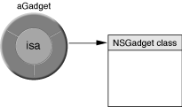
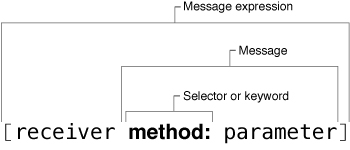
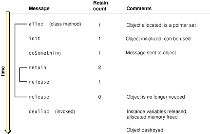
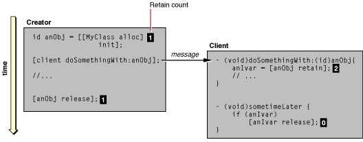
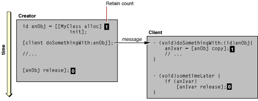
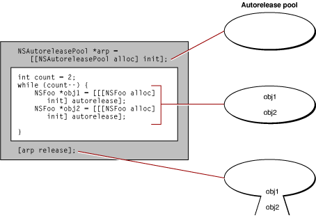
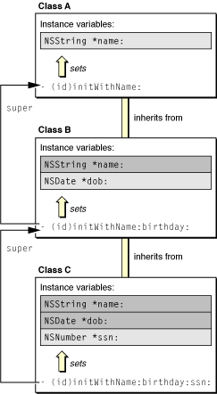
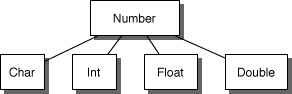
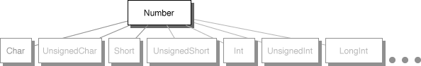
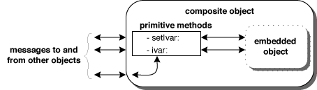

> 导航：[总目录](../../../README.md) · [文档](../../../_indexes/documentation.md) · [Cocoa 基础指南](Introduction.md)


[下一页](Adding%20Behavior%20to%20a%20Cocoa%20Program.md)[上一页](What%20Is%20Cocoa.md)

# Cocoa 对象

说 Cocoa 是面向对象的，自然会引出一个问题：什么是 Cocoa 对象？它与这类对象的主要编程语言 Objective-C 之间是什么关系？本章描述了 Objective-C 对象的与众不同之处，以及这门语言给 Cocoa 软件开发带来的种种优势。本章还向你展示了如何使用 Objective-C 向对象发送消息，以及如何处理这些消息返回的值。（Objective-C 是一门优雅简洁的语言，因此做到这些并不难。）本章还会介绍根类 [NSObject](https://developer.apple.com/library/archive/documentation/LegacyTechnologies/WebObjects/WebObjects_3.5/Reference/Frameworks/ObjC/Foundation/Classes/NSObject/Description.html#//apple_ref/occ/cl/NSObject)，并说明如何使用它的编程接口来创建对象、对对象进行内省，以及管理对象生命周期。

我们从一个使用 OS X 的 Foundation 框架编写的简单命令行程序开始。给定一系列作为参数的任意单词，该程序会去除重复出现的单词，将剩余单词列表按字母顺序排序，并打印到标准输出。清单 2-1 展示了该程序的一次典型执行结果。

__清单 2-1__  简单 Cocoa 工具的输出

```
localhost> SimpleCocoaTool a z c a l q m z
a
c
l
m
q
z
```

清单 2-2 展示了这个程序的 Objective-C 代码。

__清单 2-2__  SimpleCocoaTool 程序的 Cocoa 代码

```objc
#import <Foundation/Foundation.h>

int main (int argc, const char * argv[]) {
    NSAutoreleasePool *pool = [[NSAutoreleasePool alloc] init];
    NSArray *param = [[NSProcessInfo processInfo] arguments];
    NSCountedSet *cset = [[NSCountedSet alloc] initWithArray:param];
    NSArray *sorted_args = [[cset allObjects]
        sortedArrayUsingSelector:@selector(compare:)];
    NSEnumerator *enm = [sorted_args objectEnumerator];
    id word;
    while (word = [enm nextObject]) {
        printf("%s\n", [word UTF8String]);
    }

    [cset release];
    [pool release];
    return 0;
}
```

这段代码创建并使用了几个对象：一个用于内存管理的自动释放池、用于对指定单词进行"唯一化"并排序的集合对象（数组和一个集合），以及一个用于遍历最终数组中的元素并打印到标准输出的枚举器对象。

关于这段代码，你可能首先注意到的是它很短，可能比同一程序的典型 ANSI C 版本短得多。虽然这段代码的很多地方看起来可能很陌生，但其中许多元素其实是你熟悉的 ANSI C。这些包括赋值运算符、控制流语句（`while`）、对 C 库例程的调用（`printf`），以及基本标量类型。Objective-C 显然是以 ANSI C 为基础的。

本章接下来的部分将检视这段代码中的 Objective-C 元素，并以它们为例，讨论从消息发送机制到内存管理技术等各种主题。如果你之前没有见过 Objective-C 代码，示例中的代码可能看起来错综复杂、令人费解，但这种印象很快就会烟消云散。Objective-C 其实是一门简单、优雅的编程语言，易学易用，编程时也很直观。

Cocoa 从范式和机制到事件驱动架构，处处都体现出面向对象的特性。作为 Cocoa 的开发语言，Objective-C 尽管以 ANSI C 为基础，但也是彻头彻尾面向对象的。它为消息派发提供了运行时支持，并规定了定义新类的语法约定。Objective-C 支持大多数在 C++ 和 Java 等其他面向对象语言中能找到的抽象和机制，包括继承、封装、可重用性和多态。

但 Objective-C 与这些其他面向对象语言存在差异，而且往往是重要的差异。例如，与 C++ 不同，Objective-C 不支持运算符重载、模板或多重继承。

尽管 Objective-C 没有这些特性，但它作为面向对象编程语言的优势足以弥补这些不足。接下来将探讨 Objective-C 的一些特殊能力。

如果你是刚接触面向对象概念的过程式程序员，一开始不妨把对象想象成一个附带了若干函数的结构体。这种理解与实际情况相差不远，尤其是在运行时实现层面。

每个 Objective-C 对象都隐藏着一个数据结构，其第一个成员——即实例变量——是 `isa` 指针。（其余大部分成员由对象的类及其超类定义。）顾名思义，`isa` 指针指向对象的类，而类本身也是一个对象（见图 2-1），是由类定义编译而来的。类对象维护着一张派发表，其中基本上是指向该类所实现方法的指针；类对象还持有一个指向其超类的指针，而超类同样有自己的派发表和超类指针。通过这条引用链，一个对象可以访问其类及其所有超类的方法实现（同时也能访问所有继承来的公有和受保护实例变量）。`isa` 指针对消息派发机制以及 Cocoa 对象的动态性都至关重要。

__图 2-1__  对象的 isa 指针



这次对对象表象背后的窥探，让我们得以极其简化地看到 Objective-C 运行时中，消息派发、继承以及一般对象行为的其他方面是如何实现的。但要理解 Objective-C 的一大优势——它的动态性——这些信息是必不可少的。

Objective-C 是一门高度动态的语言。它的动态性使程序摆脱了编译期和链接期的约束，将符号解析的大部分职责转移到了运行时，由用户掌控。Objective-C 比其他编程语言更为动态，因为它的动态性来自三个方面：

- 动态类型——在运行时确定对象的类
- 动态绑定——在运行时确定要调用的方法
- 动态加载——在运行时为程序添加新模块

为实现动态类型，Objective-C 引入了 `id` 数据类型，它可以代表任何 Cocoa 对象。[清单 2-2](#apple-f4xwc4dqnrsv64tfmyxwi33df52wszbpkridimbqgazdsnzufvbuqnbnknltc) 代码示例中的这一部分展示了这种通用对象类型的典型用法：

```
id word;
while (word = [enm nextObject]) {
    // do something with 'word' variable....
}
```

`id` 数据类型使得在运行时替换任意类型的对象成为可能。因此你可以让运行时的各种因素来决定代码中要用到哪种对象。动态类型允许对象之间的关联在运行时确定，而不必强行编码进静态设计之中。编译时的静态类型检查或许能确保更严格的数据完整性，但作为对这种严格完整性的交换，动态类型能为你的程序带来大得多的灵活性。而且通过对象内省（例如，向一个动态类型的匿名对象询问它属于哪个类），你仍然可以在运行时验证对象的类型，从而确认它是否适合执行某项特定操作。（当然，你随时都可以在需要时对对象类型做静态检查。）

动态类型为 Objective-C 中第二种动态性——动态绑定——提供了基础。正如动态类型将对象所属类的确定推迟到运行时一样，动态绑定将调用哪个方法的决定也推迟到了运行时。方法调用在编译期并不与代码绑定，只有当消息真正被发送时才会绑定。有了动态类型和动态绑定，你的代码每次执行都可能得到不同的结果。运行时的各种因素决定了选择哪个接收者、调用哪个方法。

运行时的消息派发机制使动态绑定得以实现。当你向一个动态类型的对象发送消息时，运行时系统会使用接收者的 isa 指针来定位该对象的类，进而找到要调用的方法实现。该方法是动态绑定到消息上的。而且你在 Objective-C 代码中无需做任何特殊处理即可享受动态绑定带来的好处。每次发送消息，尤其是向动态类型对象发送消息时，这一切都会照常、透明地发生。

动态加载是最后一种动态性，它是 Cocoa 的一项特性，依赖 Objective-C 提供运行时支持。有了动态加载，Cocoa 程序可以按需加载可执行代码和资源，而不必在启动时加载所有程序组件。可执行代码（在加载前已经完成链接）通常包含新的类，这些类会被整合进程序的运行时映像中。代码和本地化资源（包括 nib 文件）都打包在 bundle 中，并通过 Foundation 的 [NSBundle](https://developer.apple.com/library/archive/documentation/LegacyTechnologies/WebObjects/WebObjects_3.5/Reference/Frameworks/ObjC/Foundation/Classes/NSBundle/Description.html#//apple_ref/occ/cl/NSBundle) 类中定义的方法显式加载。

这种程序代码和资源的"延迟加载"通过降低系统的内存需求，提升了整体性能。更重要的是，动态加载让应用程序具备了可扩展性。你可以为应用程序设计一套插件架构，让你和其他开发者能够通过额外的模块来定制它——这些模块可以在应用程序发布数月甚至数年后由应用程序动态加载。只要设计得当，这些模块中的类就不会与已有的类发生冲突，因为每个类都封装了自己的实现，并拥有自己的命名空间。

Objective-C 有四种扩展方式，是软件开发中强有力的工具：分类、协议、声明属性和快速枚举。有些扩展引入了不同的方法声明技巧，并将其与某个类关联起来；另一些则提供了便捷的方式来声明和访问对象属性、快速枚举集合、处理异常，以及完成其他任务。

分类让你无需创建子类就能为一个类添加方法。分类中的方法会成为该类类型的一部分（在你的程序范围内），并被该类的所有子类继承。在运行时，原有方法与新增方法之间没有任何区别。你可以向该类（或其子类）的任意实例发送消息，来调用分类中定义的方法。

分类不仅仅是为类添加行为的一种便捷方式。你还可以用分类来对方法进行区隔，把相关方法归入不同的分类中。对于组织大型类而言，分类尤其方便；如果有多名开发者共同开发同一个类，你甚至可以把不同的分类放在不同的源文件里。

声明和实现分类的方式与子类大致相同。语法上唯一的区别是分类的名称，它跟在 `@interface` 或 `@implementation` 指令之后，并用括号括起来。例如，假设你想为 [NSArray](https://developer.apple.com/library/archive/documentation/LegacyTechnologies/WebObjects/WebObjects_3.5/Reference/Frameworks/ObjC/Foundation/Classes/NSArrayClassCluster/Description.html#//apple_ref/occ/cl/NSArray) 类添加一个方法，以更结构化的方式打印集合的描述信息。在该分类的头文件中，你会写出类似下面这样的声明代码：

```objc
#import <Foundation/NSArray.h> // 如果尚未导入 Foundation

@interface NSArray (PrettyPrintElements)
- (NSString *)prettyPrintDescription;
@end
```

然后在实现文件中，你会写出类似这样的代码：

```objc
#import “PrettyPrintCategory.h”

@implementation NSArray (PrettyPrintElements)
- (NSString *)prettyPrintDescription {
    // 具体实现代码……
}
@end
```

分类也有一些局限性。你不能用分类为类添加任何新的实例变量。虽然分类中的方法可以覆盖已有方法，但并不建议这么做，尤其是当你想在现有行为基础上进行增强时。之所以要谨慎，原因之一是分类方法属于该类接口的一部分，因此无法向 `super` 发消息来获取类已定义的行为。如果你需要改变某个类现有方法的行为，最好是为该类派生一个子类。

你可以定义分类，为根类 [NSObject](https://developer.apple.com/library/archive/documentation/LegacyTechnologies/WebObjects/WebObjects_3.5/Reference/Frameworks/ObjC/Foundation/Classes/NSObject/Description.html#//apple_ref/occ/cl/NSObject) 添加方法。这样的方法对链接进你代码中的_所有_实例和类对象都可用。非正式协议——Cocoa 委托机制的基础——就是以 `NSObject` 上分类的形式声明的。然而，这种大范围的暴露既有用处也有风险。你通过 `NSObject` 上的分类为每个对象添加的行为，可能带来你无法预料的后果，导致崩溃、数据损坏，甚至更严重的问题。

Objective-C 中称为_协议_的扩展，与 Java 中的接口非常相似。两者都只是一份方法声明列表，公开了一个任何类都可以选择实现的接口。协议中的方法由其他某个类的实例发送消息来调用。

协议的主要价值在于，和分类一样，它可以替代子类化。它们提供了一些类似 C++ 多重继承的优势，能够共享接口（即便无法共享实现）。协议是类在隐藏自身身份的同时声明接口的一种方式。该接口可能暴露该类所提供服务的全部（通常只是一部分）。类层级中的其他类——不必与该类存在任何继承关系（甚至不必共享同一个根类）——都可以实现该协议的方法，从而访问其公开的服务。借助协议，即便彼此并不了解对方身份（即类类型）的类，也能为协议所确立的特定目的进行通信。

协议分为两种类型：正式协议和非正式协议。非正式协议已在[分类](#apple-f4xwc4dqnrsv64tfmyxwi33df52wszbpkridimbqgazdsnzufvbuqnbnknltgma)一节中做过简要介绍。非正式协议就是 `NSObject` 上的分类；因此，任何以 `NSObject` 为根对象的对象（以及类对象）都隐式地采纳了该分类中公开的接口。要使用非正式协议，类不必实现其中的每一个方法，只需实现它感兴趣的那些方法。要让非正式协议正常工作，声明该非正式协议的类必须先向目标对象发送 [respondsToSelector:](https://developer.apple.com/library/archive/documentation/LegacyTechnologies/WebObjects/WebObjects_3.5/Reference/Frameworks/ObjC/Foundation/Protocols/NSObject/Description.html#//apple_ref/occ/intfm/NSObject/respondsToSelector:) 消息并得到肯定答复，然后才能向该对象发送协议消息。（如果目标对象没有实现该方法，就会引发运行时异常。）

在 Cocoa 中，通常所说的_协议_指的就是正式协议。它允许一个类正式声明一份方法列表，作为对外提供服务的接口。Objective-C 语言和运行时系统都支持正式协议：编译器可以基于协议进行类型检查，对象也可以在运行时进行内省，以验证是否遵循某个协议。正式协议有自己专门的术语和语法，对于提供者和客户端，术语有所不同：

- 提供者（通常是一个类）_声明_正式协议。
- 客户端类_采纳_正式协议，采纳之后即表示同意实现该协议所有必须实现的方法。
- 如果一个类采纳了某个正式协议，或者继承自一个采纳了该协议的类，就称该类_遵循_这个正式协议。（协议会被子类继承。）

协议的声明和采纳在 Objective-C 中都有各自的语法形式。要声明一个协议，必须使用 `@protocol` 编译器指令。下面的示例展示了 [NSCoding](https://developer.apple.com/library/archive/documentation/LegacyTechnologies/WebObjects/WebObjects_3.5/Reference/Frameworks/ObjC/Foundation/Protocols/NSCoding/Description.html#//apple_ref/occ/intf/NSCoding) 协议的声明（位于 Foundation 框架的头文件 `NSObject.h` 中）。

```objc
@protocol NSCoding
- (void)encodeWithCoder:(NSCoder *)aCoder;
- (id)initWithCoder:(NSCoder *)aDecoder;
@end
```

Objective-C 2.0 为正式协议增加了一项改进：除了必须实现的方法外，还可以选择声明_可选_协议方法。在 Objective-C 1.0 中，协议的采纳者必须实现该协议的所有方法。而在 Objective-C 2.0 中，协议方法默认仍然是隐式必需的，也可以用 `@required` 指令明确标注。但你也可以用 `@optional` 指令，把一段协议方法标记为可选实现；在该指令之后声明的所有方法都可以选择性实现，除非中间又出现了 `@required`。请看下面的声明：

```objc
@protocol MyProtocol
// 该方法隐式必须实现
- (void)requiredMethod;

@optional
// 这些方法可选择实现
- (void)anOptionalMethod;
- (void)anotherOptionalMethod;

@required
// 该方法必须实现
- (void)anotherRequiredMethod;
@end
```

声明协议方法的类通常不会去实现这些方法；不过，它应该在遵循该协议的类的实例上调用这些方法。在调用可选方法之前，应该先用 [respondsToSelector:](https://developer.apple.com/library/archive/documentation/LegacyTechnologies/WebObjects/WebObjects_3.5/Reference/Frameworks/ObjC/Foundation/Protocols/NSObject/Description.html#//apple_ref/occ/intfm/NSObject/respondsToSelector:) 方法验证该方法确实已被实现。

一个类要采纳某个协议，需要在其 `@interface` 指令末尾、超类之后，用尖括号指定该协议。一个类可以用逗号分隔来采纳多个协议。Foundation 的 [NSData](https://developer.apple.com/library/archive/documentation/LegacyTechnologies/WebObjects/WebObjects_3.5/Reference/Frameworks/ObjC/Foundation/Classes/NSDataClassCluster/Description.html#//apple_ref/occ/cl/NSData) 类就是这样采纳三个协议的：

```objc
@interface NSData : NSObject <NSCopying, NSMutableCopying, NSCoding>
```

通过采纳这些协议，`NSData` 就承诺要实现协议中声明的所有必须方法，它也可以选择实现标记为 `@optional` 的方法。分类也可以采纳协议，其采纳情况会成为该分类所属类定义的一部分。

Objective-C 不仅按类的继承关系对其进行分类，也按其所遵循的协议对其分类。你可以通过发送 `conformsToProtocol:` 消息来检查某个类是否遵循特定协议：

```objc
if ([anObject conformsToProtocol:@protocol(NSCoding)]) {
        // 执行相应的操作
}
```

在类型声明中——无论是方法、实例变量还是函数——你都可以将协议遵循情况指定为该类型的一部分。这样一来，编译器就能对你的代码进行另一层级的类型检查，这种检查更为抽象，因为它并不依附于具体实现。协议遵循情况的指定方式与协议采纳的语法约定相同：把协议名放在尖括号中即可。这类声明中经常会用到动态对象类型 `id`，例如：

```objc
- (void)draggingEnded:(id <NSDraggingInfo>)sender;
```

这里参数所指的对象可以是任意类类型，但它必须遵循 [NSDraggingInfo](https://developer.apple.com/documentation/appkit/nsdragginginfo) 协议。

除了前面展示的例子之外，Cocoa 还提供了几个协议的例子。其中一个有趣的例子是 [NSObject](https://developer.apple.com/library/archive/documentation/LegacyTechnologies/WebObjects/WebObjects_3.5/Reference/Frameworks/ObjC/Foundation/Protocols/NSObject/Description.html#//apple_ref/occ/intf/NSObject) 协议。不出所料，[NSObject](https://developer.apple.com/library/archive/documentation/LegacyTechnologies/WebObjects/WebObjects_3.5/Reference/Frameworks/ObjC/Foundation/Classes/NSObject/Description.html#//apple_ref/occ/cl/NSObject) 类采纳了它，另一个根类 [NSProxy](https://developer.apple.com/library/archive/documentation/LegacyTechnologies/WebObjects/WebObjects_3.5/Reference/Frameworks/ObjC/Foundation/Classes/NSProxy/Description.html#//apple_ref/occ/cl/NSProxy) 也采纳了这个协议。通过这个协议，`NSProxy` 类得以与 Objective-C 运行时中对引用计数、内省以及其他对象行为基本方面至关重要的部分进行交互。

在对象建模设计模式中（见[对象建模](Cocoa%20Design%20Patterns.md#apple-f4xwc4dqnrsv64tfmyxwi33df52wszbpkridimbqgazdsnzufvbuqnrnknlte)），对象拥有属性。属性由对象的特性（例如标题和颜色）以及对象与其他对象之间的关系组成。在传统的 Objective-C 代码中，你需要通过声明实例变量，并为了实施封装而实现存取方法来获取和设置这些变量的值，从而定义属性。这是一项繁琐且容易出错的工作，尤其是在需要考虑内存管理的情况下（见[存储和访问属性](Adding%20Behavior%20to%20a%20Cocoa%20Program.md#apple-f4xwc4dqnrsv64tfmyxwi33df52wszbpkridimbqgazdsnzufvbuqnjnknltk)）。

在 OS X v10.5 中引入的 Objective-C 2.0，提供了一套用于声明属性、并指定其访问方式的语法。声明一个属性，相当于是声明该属性的 setter 和 getter 方法的一种简写形式。有了属性之后，你不再需要自己实现存取方法。通过新的点表示法语法，你也可以直接访问属性值。属性的语法包含三个方面：声明、实现和访问。

在类、分类或协议的声明区域中，凡是可以声明方法的地方，都可以声明属性。声明属性的语法是：

- `@property(`_attributes..._`)`_type propertyName_

其中 _attributes_ 是一个或多个可选特性（多个时以逗号分隔），它们会影响编译器如何存储实例变量以及如何合成存取方法。_type_ 元素指定对象类型、已声明的类型或标量类型，例如 `id`、`NSString *`、`NSRange` 或 `float`。属性必须由一个类型和名称都相同的实例变量作为支撑。

属性声明中可能出现的特性列在表 2-1 中。

__表 2-1__  声明属性的特性

| 特性 | 作用 |
| --- | --- |
| `getter=`_getterName_  `setter=`_setterName_ | 指定 getter 和 setter 存取方法的名称（见[存储和访问属性](Adding%20Behavior%20to%20a%20Cocoa%20Program.md#apple-f4xwc4dqnrsv64tfmyxwi33df52wszbpkridimbqgazdsnzufvbuqnjnknltk)）。当你自己实现存取方法并想控制它们的名称时，需要指定这些特性。 |
| `readonly` | 表示该属性只能被读取，不能被写入。编译器不会合成 setter 存取方法，也不允许调用非合成的 setter。 |
| `readwrite` | 表示该属性既可以读取也可以写入。如果未指定 `readonly`，这是默认值。 |
| `assign` | 指定在 setter 的实现中使用简单赋值，这是默认做法。如果属性是在非垃圾回收的程序中声明的，那么对于对象类型的属性，你必须指定 `retain` 或 `copy`。 |
| `retain` | 指定在赋值时应向该属性（必须是对象类型）发送 [retain](https://developer.apple.com/library/archive/documentation/LegacyTechnologies/WebObjects/WebObjects_3.5/Reference/Frameworks/ObjC/Foundation/Protocols/NSObject/Description.html#//apple_ref/occ/intfm/NSObject/retain) 消息。注意，在垃圾回收环境中，`retain` 是一个空操作。 |
| `copy` | 指定在赋值时应向该属性（必须是对象类型）发送 [copy](https://developer.apple.com/library/archive/documentation/LegacyTechnologies/WebObjects/WebObjects_3.5/Reference/Frameworks/ObjC/Foundation/Classes/NSObject/Description.html#//apple_ref/occ/instm/NSObject/copy) 消息。该对象所属的类必须实现 [NSCopying](https://developer.apple.com/library/archive/documentation/LegacyTechnologies/WebObjects/WebObjects_3.5/Reference/Frameworks/ObjC/Foundation/Protocols/NSCopying/Description.html#//apple_ref/occ/intf/NSCopying) 协议。 |
| `nonatomic` | 指定合成的存取方法是非原子的。默认情况下，所有合成的存取方法都是原子的：即使有其他线程同时在执行，getter 方法也保证会返回一个有效的值。关于原子与非原子属性的讨论，尤其是在性能方面的考量，见《[The Objective-C Programming Language](../The%20Objective-C%20Programming%20Language/Introduction.md#apple-f4xwc4dqnrsv64tfmyxwi33df52wszbpkridgmbqgaytcnrt)》中的[声明属性](https://developer.apple.com/library/archive/documentation/Cocoa/Conceptual/ObjectiveC/Chapters/ocProperties.html#//apple_ref/doc/uid/TP30001163-CH17)一节。 |

如果你不指定任何特性，并在实现中指定 `@synthesize`，编译器就会为该属性合成使用简单赋值的 getter 和 setter 方法，其中 getter 的形式为 _propertyName_，setter 的形式为 `set`_PropertyName_`:`。

在类定义的 `@implementation` 块中，你可以使用 `@dynamic` 和 `@synthesize` 指令来控制编译器是否为特定属性合成存取方法。这两个指令的通用语法相同：

- `@dynamic` _propertyName_ [`,` _propertyName2_...]`;`
- `@synthesize` _propertyName_ [`,` _propertyName2_...]`;`

`@dynamic` 指令告诉编译器，你会（直接地或动态地，比如在动态加载代码时）自行实现该属性的存取方法。而 `@synthesize` 指令则告诉编译器，如果 `@implementation` 块中没有出现 getter 和 setter 方法，就为其合成。`@synthesize` 的语法还包含一项扩展，允许你为属性和其实例变量存储使用不同的名称。例如，请看下面这条语句：

```objc
@synthesize title, directReports, role = jobDescrip;
```

这条语句告诉编译器为 `title`、`directReports` 和 `role` 属性合成存取方法，并使用 `jobDescrip` 实例变量作为 `role` 属性的支撑。

最后，Objective-C 的属性特性还支持通过点表示法和简单赋值来访问（获取和设置）属性的简化语法。下面的例子展示了用这种语法获取和设置属性值是多么简单：

```objc
NSString *title = employee.title; // 将 employee 的 title 赋值给局部变量
employee.ID = "A542309"; // 将字面字符串赋值给 employee 的 ID
// 获取该 employee 的 manager 的姓氏
NSString *lname = employee.manager.lastName;
```

请注意，点表示法语法只适用于特性和简单的一对一关系，不适用于一对多关系。

快速枚举是 Objective-C 2.0 引入的一项语言特性，它为高效枚举集合提供了简洁的语法。它比传统使用 [NSEnumerator](https://developer.apple.com/library/archive/documentation/LegacyTechnologies/WebObjects/WebObjects_3.5/Reference/Frameworks/ObjC/Foundation/Classes/NSEnumerator/Description.html#//apple_ref/occ/cl/NSEnumerator) 对象来遍历数组、集合和字典的方式快得多。此外，它还包含一个变更保护机制，确保枚举过程中的安全，防止在枚举期间对集合进行修改。（如果试图进行变更，就会抛出异常。）

快速枚举的语法与 Perl、Ruby 等脚本语言中使用的语法类似；它支持两种版本：

- `for` `(` _type newVariable_ `in` _expression_ `) {` _statements_ `}`

以及

- _type_ _existingVariable_`;`

  `for``(` _existingVariable_ `in` _expression_ `) {` _statements_ `}`

_expression_ 求值结果必须是一个对象，其类必须遵循 [NSFastEnumeration](https://developer.apple.com/documentation/foundation/nsfastenumeration) 协议。快速枚举的实现由 Objective-C 运行时和 Foundation 框架共同提供。Foundation 声明了 [NSFastEnumeration](https://developer.apple.com/documentation/foundation/nsfastenumeration) 协议，Foundation 的集合类——[NSArray](https://developer.apple.com/library/archive/documentation/LegacyTechnologies/WebObjects/WebObjects_3.5/Reference/Frameworks/ObjC/Foundation/Classes/NSArrayClassCluster/Description.html#//apple_ref/occ/cl/NSArray)、[NSDictionary](https://developer.apple.com/library/archive/documentation/LegacyTechnologies/WebObjects/WebObjects_3.5/Reference/Frameworks/ObjC/Foundation/Classes/NSDictionaryClassClstr/Description.html#//apple_ref/occ/cl/NSDictionary) 和 [NSSet](https://developer.apple.com/library/archive/documentation/LegacyTechnologies/WebObjects/WebObjects_3.5/Reference/Frameworks/ObjC/Foundation/Classes/NSSetClassCluster/Description.html#//apple_ref/occ/cl/NSSet)——以及 `NSEnumerator` 类都采纳了这个协议。其他持有对象集合的类，包括自定义类，也可以采纳 `NSFastEnumeration` 来利用这一特性。

下面这段代码展示了如何在 `NSArray` 和 `NSSet` 对象上使用快速枚举：

```objc

NSArray *array = [NSArray arrayWithObjects:
        @"One", @"Two", @"Three", @"Four", nil];

for (NSString *element in array) {
    NSLog(@"element: %@", element);
}

NSSet *set = [NSSet setWithObjects:
        @"Alpha", @"Beta", @"Gamma", @"Delta", nil];

NSString *setElement;
for (setElement in set) {
    NSLog(@"element: %@", setElement);
}
```


在面向对象的程序中，工作是通过消息完成的：一个对象向另一个对象发送消息。通过消息，发送方对象向接收方对象（接收者）提出请求，要求接收者执行某个动作、返回某个对象或值，或者两者兼而有之。

Objective-C 采用了一种独特的消息发送语法形式。以 [清单 2-2](#apple-f4xwc4dqnrsv64tfmyxwi33df52wszbpkridimbqgazdsnzufvbuqnbnknltc) 中 SimpleCocoaTool 代码里的下面这条语句为例：

```
NSEnumerator *enm = [sorted_args objectEnumerator];
```

消息表达式位于赋值语句的右侧，用方括号括起来。消息表达式中最左边的项是接收者，它是一个变量或表达式，表示消息要发送给哪个对象。在这个例子中，接收者是 `sorted_args`，它是 [NSArray](https://developer.apple.com/library/archive/documentation/LegacyTechnologies/WebObjects/WebObjects_3.5/Reference/Frameworks/ObjC/Foundation/Classes/NSArrayClassCluster/Description.html#//apple_ref/occ/cl/NSArray) 类的一个实例。紧跟在接收者后面的是消息本身，在这个例子中是 [objectEnumerator](https://developer.apple.com/library/archive/documentation/LegacyTechnologies/WebObjects/WebObjects_3.5/Reference/Frameworks/ObjC/Foundation/Classes/NSArrayClassCluster/Description.html#//apple_ref/occ/instm/NSArray/objectEnumerator)。（这里的讨论暂时只关注消息语法，不深入探讨 SimpleCocoaTool 中这条消息以及其他消息的具体作用。）`objectEnumerator` 这条消息会调用 `sorted_args` 对象上一个名为 `objectEnumerator` 的方法，该方法返回一个对象的引用，这个引用由赋值语句左侧的变量 `enm` 持有。这个变量被静态声明为 [NSEnumerator](https://developer.apple.com/library/archive/documentation/LegacyTechnologies/WebObjects/WebObjects_3.5/Reference/Frameworks/ObjC/Foundation/Classes/NSEnumerator/Description.html#//apple_ref/occ/cl/NSEnumerator) 类的一个实例。你可以把这条语句图示为：

- NSClassName \*_variable_ = [_receiver_ __message__];

不过，这种图示过于简化，并不十分准确。一条消息由一个选择器名称和消息的参数组成。Objective-C 运行时使用一个选择器名称（比如上面的 `objectEnumerator`）在一张表中查找选择器，从而找到要调用的方法。选择器是代表某个方法的唯一标识符，具有一个专门的类型 `SEL`。由于两者关系密切，用来查找选择器的选择器名称本身也常常被直接称为选择器。因此，上面这条语句更准确的表示方式应当是：

- NSClassName \*_variable_ = [_receiver_ __selector__];

消息通常带有参数，有时也称为_实参_。带单个参数的消息，会在选择器名称后加上一个冒号，并把参数紧跟在冒号之后。这种结构称为_关键字_；关键字以冒号结尾，冒号后面跟着一个参数。因此，我们可以把带单个参数（以及赋值）的消息表达式图示为如下形式：

- NSClassName \*_variable_ = [_receiver_ __keyword:___parameter_];

如果一条消息带有多个参数，其选择器就包含多个关键字。选择器名称包含所有关键字（含冒号），但不包含其他任何内容，比如返回类型或参数类型。带多个关键字（加上赋值）的消息表达式可以图示为如下形式：

- NSClassName \*_variable_ = [_receiver_ __keyword1:___param1_ __keyword2:___param2_];

与函数参数一样，参数的类型必须与方法声明中指定的类型相匹配。以 SimpleCocoaTool 中的下面这条消息表达式为例：

```
NSCountedSet *cset = [[NSCountedSet alloc] initWithArray:param];
```

这里的 `param` 同样是 `NSArray` 类的一个实例，它是名为 [initWithArray:](https://developer.apple.com/library/archive/documentation/LegacyTechnologies/WebObjects/WebObjects_3.5/Reference/Frameworks/ObjC/Foundation/Classes/NSArrayClassCluster/Description.html#//apple_ref/occ/instm/NSArray/initWithArray:) 这条消息的参数。

上面引用的 [initWithArray:](https://developer.apple.com/library/archive/documentation/LegacyTechnologies/WebObjects/WebObjects_3.5/Reference/Frameworks/ObjC/Foundation/Classes/NSArrayClassCluster/Description.html#//apple_ref/occ/instm/NSArray/initWithArray:) 例子的有趣之处在于，它展示了嵌套用法。在 Objective-C 中，你可以把一条消息嵌套在另一条消息内部；一个消息表达式返回的对象，会被用作包裹它的那条消息表达式的接收者。因此，理解嵌套消息表达式时，要从内层表达式开始，逐步向外推导。上面这条语句可以这样解读：

1. [alloc](https://developer.apple.com/library/archive/documentation/LegacyTechnologies/WebObjects/WebObjects_3.5/Reference/Frameworks/ObjC/Foundation/Classes/NSObject/Description.html#//apple_ref/occ/clm/NSObject/alloc) 消息被发送给 [NSCountedSet](https://developer.apple.com/library/archive/documentation/LegacyTechnologies/WebObjects/WebObjects_3.5/Reference/Frameworks/ObjC/Foundation/Classes/NSCountedSet/Description.html#//apple_ref/occ/cl/NSCountedSet) 类，该类（通过为其分配内存）创建了该类的一个未初始化实例。
2. `initWithArray:` 消息被发送给这个未初始化的实例，该实例用 `args` 数组完成自身初始化，并返回一个指向自身的引用。

接下来看 SimpleCocoaTool 的 `main` 例程中的下面这条语句：

```
NSArray *sorted_args = [[cset allObjects] sortedArrayUsingSelector:@selector(compare:)];
```

这条消息表达式值得注意的地方在于 [sortedArrayUsingSelector:](https://developer.apple.com/library/archive/documentation/LegacyTechnologies/WebObjects/WebObjects_3.5/Reference/Frameworks/ObjC/Foundation/Classes/NSArrayClassCluster/Description.html#//apple_ref/occ/instm/NSArray/sortedArrayUsingSelector:) 消息的参数。这个参数需要用 `@selector` 编译器指令来创建一个可作为参数使用的选择器。

我们先暂停一下，回顾一下消息和方法的术语。方法本质上是一个函数，由消息接收者所属的类定义并实现。消息则是一个选择器名称（可能由一个或多个关键字组成）加上它的参数；消息被发送给一个接收者，从而导致方法的调用（或执行）。消息表达式同时涵盖了接收者和消息本身。图 2-2 描绘了这些关系。

__图 2-2__  消息术语



Objective-C 使用了若干在 ANSI C 中找不到的已定义类型和字面量。在某些情况下，这些类型和字面量取代了它们在 ANSI C 中的对应物。表 2-2 描述了其中几个重要的类型，包括每种类型允许使用的字面量。

__表 2-2__  重要的 Objective-C 已定义类型和字面量

| 类型 | 说明与字面量 |
| --- | --- |
| `id` | 动态对象类型。其否定字面量是 `nil`。 |
| `Class` | 动态类类型。其否定字面量是 `Nil`。 |
| `SEL` | 选择器的数据类型（`typedef`）。该类型的否定字面量是 `NULL`。 |
| `BOOL` | 布尔类型。其字面量值为 `YES` 和 `NO`。 |

在程序的控制流语句中，你可以通过检测相应的否定字面量是否存在（或不存在）来决定接下来的处理方式。例如，SimpleCocoaTool 代码中下面这条 `while` 语句，隐式地检测 `word` 这个对象变量是否存在返回的对象（换个角度说，也就是检测它是否为 `nil`）：

```
while (word = [enm nextObject]) {
    printf("%s\n", [word UTF8String]);
}
```

在 Objective-C 中，你通常可以向 `nil` 发送消息而不会产生任何不良后果。只要消息返回的类型是对象，向 `nil` 发送消息所得到的返回值就能保证正常工作。详情见《[The Objective-C Programming Language](../The%20Objective-C%20Programming%20Language/Introduction.md#apple-f4xwc4dqnrsv64tfmyxwi33df52wszbpkridgmbqgaytcnrt)》中的[向 nil 发送消息](../The%20Objective-C%20Programming%20Language/Objects%2C%20Classes%2C%20and%20Messaging.md#apple-f4xwc4dqnrsv64tfmyxwi33df52wszbpkridgmbqgaytcnrtfvbuqmjrfvjvony)一节。

关于 SimpleCocoaTool 代码，还有最后一点值得注意——如果你刚接触 Objective-C，这一点不太容易看出来。比较下面这条语句：

```
NSEnumerator *enm = [sorted_args objectEnumerator];
```

with this one:

```
NSAutoreleasePool *pool = [[NSAutoreleasePool alloc] init];
```

从表面上看，这两条语句似乎在做同样的事情——都返回一个对象的引用。然而，两者之间存在一个重要的语义差异（对于有内存管理的代码而言），这个差异关乎所返回对象的所有权，也就是关乎释放它的责任归属。在第一条语句中，SimpleCocoaTool 程序并不拥有返回的对象。而在第二条语句中，程序创建了这个对象，因此拥有它。程序在最后所做的一件事，就是向所创建的对象发送 [release](https://developer.apple.com/library/archive/documentation/LegacyTechnologies/WebObjects/WebObjects_3.5/Reference/Frameworks/ObjC/Foundation/Protocols/NSObject/Description.html#//apple_ref/occ/intfm/NSObject/release) 消息，从而释放它。另一个明确创建的对象（即 `NSCountedSet` 实例）在程序结束时也被显式释放。关于对象所有权和处置的内存管理策略概要，以及用于执行该策略的方法，见[内存管理的工作原理](#apple-f4xwc4dqnrsv64tfmyxwi33df52wszbpkridimbqgazdsnzufvbuqnbnknltcma)。

单凭 Objective-C 语言和运行时，还不足以构建出（至少不容易轻松构建出）哪怕是最简单的面向对象程序。还缺少一样东西：对所有对象共有的基本行为和接口的定义。根类提供了这个定义。

之所以称为根类，是因为它位于类层级——在这里是指 Cocoa 类层级——的根部。根类不继承自任何其他类，而层级中的所有其他类最终都继承自它。根类和 Objective-C 语言一起，是 Cocoa 直接访问并与 Objective-C 运行时交互的主要途径。Cocoa 对象之所以能表现出对象应有的行为，很大程度上就是从根类那里获得的能力。

Cocoa 提供了两个根类：[NSObject](https://developer.apple.com/library/archive/documentation/LegacyTechnologies/WebObjects/WebObjects_3.5/Reference/Frameworks/ObjC/Foundation/Classes/NSObject/Description.html#//apple_ref/occ/cl/NSObject) 和 [NSProxy](https://developer.apple.com/library/archive/documentation/LegacyTechnologies/WebObjects/WebObjects_3.5/Reference/Frameworks/ObjC/Foundation/Classes/NSProxy/Description.html#//apple_ref/occ/cl/NSProxy)。Cocoa 将后者定义为一个抽象超类，供充当其他对象替身的对象使用；因此 `NSProxy` 在分布式对象架构中至关重要。由于这种专门化的角色，`NSProxy` 在 Cocoa 程序中并不常见。当 Cocoa 开发者提到根类或基类时，他们几乎总是指 `NSObject`。

本节将探讨 `NSObject`：它如何与运行时交互，以及它为所有 Cocoa 对象定义的基本行为和接口。本节尤其会讨论 `NSObject` 为分配、初始化、内存管理、内省和运行时支持所声明的方法。这些概念对理解 Cocoa 至关重要。

`NSObject` 是大多数 Objective-C 类层级的根类，它没有超类。其他类从 `NSObject` 那里继承了对 Objective-C 语言运行时系统的基本接口，其实例也由此获得了表现为对象的能力。

虽然严格来说 `NSObject` 并不是一个抽象类，但它实际上形同抽象类。仅凭自身，一个 `NSObject` 实例除了作为一个简单对象之外，做不了任何有用的事情。要为你的程序添加任何特定的特性和逻辑，你必须创建一个或多个继承自 `NSObject`（或继承自其他派生自 `NSObject` 的类）的类。

`NSObject` 采纳了 [NSObject](https://developer.apple.com/library/archive/documentation/LegacyTechnologies/WebObjects/WebObjects_3.5/Reference/Frameworks/ObjC/Foundation/Protocols/NSObject/Description.html#//apple_ref/occ/intf/NSObject) 协议（见[根类——与协议](#apple-f4xwc4dqnrsv64tfmyxwi33df52wszbpkridimbqgazdsnzufvbuqnbnknltcmy)）。`NSObject` 协议使得存在多个根对象成为可能。例如，另一个根类 `NSProxy` 并不继承自 `NSObject`，但它采纳了 `NSObject` 协议，从而与其他 Objective-C 对象共享一套通用接口。

`NSObject` 不仅是一个类的名称，也是一个协议的名称。两者对于 Cocoa 中对象的定义都不可或缺。`NSObject` 协议规定了 Cocoa 中_所有_根类都必须具备的基本编程接口。因此，不仅 `NSObject` 类采纳了这个同名协议，Cocoa 的另一个根类 `NSProxy` 也采纳了它。`NSObject` 类进一步为所有非代理的 Cocoa 对象规定了基本的编程接口。

Objective-C 的设计之所以在 Cocoa 对象的整体定义中使用像 `NSObject` 这样的协议（而不是把协议中的方法直接纳入类接口），是为了让多个根类成为可能。每个根类都通过它们所采纳的协议，共享一套通用接口。

从另一个角度看，`NSObject` 并不是唯一的根协议。虽然 `NSObject` 类并没有正式采纳 [NSCopying](https://developer.apple.com/library/archive/documentation/LegacyTechnologies/WebObjects/WebObjects_3.5/Reference/Frameworks/ObjC/Foundation/Protocols/NSCopying/Description.html#//apple_ref/occ/intf/NSCopying)、[NSMutableCopying](https://developer.apple.com/library/archive/documentation/LegacyTechnologies/WebObjects/WebObjects_3.5/Reference/Frameworks/ObjC/Foundation/Protocols/NSMutableCopying/Description.html#//apple_ref/occ/intf/NSMutableCopying) 和 [NSCoding](https://developer.apple.com/library/archive/documentation/LegacyTechnologies/WebObjects/WebObjects_3.5/Reference/Frameworks/ObjC/Foundation/Protocols/NSCoding/Description.html#//apple_ref/occ/intf/NSCoding) 协议，但它声明并实现了与这些协议相关的方法。（此外，包含 `NSObject` 类定义的 `NSObject.h` 头文件，也包含了 `NSObject`、`NSCopying`、`NSMutableCopying` 和 `NSCoding` 这些根协议的定义。）对象的拷贝、编码和解码是对象行为的基本方面。许多（甚至可以说是大多数）子类都需要采纳或遵循这些协议。

`NSObject` 根类，连同它所采纳的 `NSObject` 协议以及其他根协议，为所有非代理 Cocoa 对象规定了以下接口和行为特征：

- _分配、初始化和复制_。`NSObject` 的一些方法（包括来自所采纳协议的一些方法）涉及对象的创建、初始化和复制：

  - [alloc](https://developer.apple.com/library/archive/documentation/LegacyTechnologies/WebObjects/WebObjects_3.5/Reference/Frameworks/ObjC/Foundation/Classes/NSObject/Description.html#//apple_ref/occ/clm/NSObject/alloc) 和 [allocWithZone:](https://developer.apple.com/library/archive/documentation/LegacyTechnologies/WebObjects/WebObjects_3.5/Reference/Frameworks/ObjC/Foundation/Classes/NSObject/Description.html#//apple_ref/occ/clm/NSObject/allocWithZone:) 方法从某个内存区域为对象分配内存，并让该对象指向其运行时的类定义。
  - [init](https://developer.apple.com/library/archive/documentation/LegacyTechnologies/WebObjects/WebObjects_3.5/Reference/Frameworks/ObjC/Foundation/Classes/NSObject/Description.html#//apple_ref/occ/instm/NSObject/init) 方法是对象初始化的原型，即把对象的实例变量设置为某个已知初始状态的过程。类方法 [initialize](https://developer.apple.com/library/archive/documentation/LegacyTechnologies/WebObjects/WebObjects_3.5/Reference/Frameworks/ObjC/Foundation/Classes/NSObject/Description.html#//apple_ref/occ/clm/NSObject/initialize) 和 [load](https://developer.apple.com/library/archive/documentation/LegacyTechnologies/WebObjects/WebObjects_3.5/Reference/Frameworks/ObjC/Foundation/Classes/NSObject/Description.html#//apple_ref/occ/clm/NSObject/load) 让类有机会对自身进行初始化。
  - [new](https://developer.apple.com/library/archive/documentation/LegacyTechnologies/WebObjects/WebObjects_3.5/Reference/Frameworks/ObjC/Foundation/Classes/NSObject/Description.html#//apple_ref/occ/clm/NSObject/new) 方法是一个便捷方法，将简单的分配和初始化合二为一。
  - [copy](https://developer.apple.com/library/archive/documentation/LegacyTechnologies/WebObjects/WebObjects_3.5/Reference/Frameworks/ObjC/Foundation/Classes/NSObject/Description.html#//apple_ref/occ/instm/NSObject/copy) 和 [copyWithZone:](https://developer.apple.com/library/archive/documentation/LegacyTechnologies/WebObjects/WebObjects_3.5/Reference/Frameworks/ObjC/Foundation/Protocols/NSCopying/Description.html#//apple_ref/occ/intfm/NSCopying/copyWithZone:) 方法（来自 `NSCopying` 协议）为任何实现了这些方法的类的成员对象生成拷贝；而 [mutableCopy](https://developer.apple.com/library/archive/documentation/LegacyTechnologies/WebObjects/WebObjects_3.5/Reference/Frameworks/ObjC/Foundation/Classes/NSObject/Description.html#//apple_ref/occ/instm/NSObject/mutableCopy) 和 [mutableCopyWithZone:](https://developer.apple.com/library/archive/documentation/LegacyTechnologies/WebObjects/WebObjects_3.5/Reference/Frameworks/ObjC/Foundation/Protocols/NSMutableCopying/Description.html#//apple_ref/occ/intfm/NSMutableCopying/mutableCopyWithZone:)（定义在 `NSMutableCopying` 协议中）则由那些希望生成对象可变拷贝的类来实现。

  详情见[对象的创建](#apple-f4xwc4dqnrsv64tfmyxwi33df52wszbpkridimbqgazdsnzufvbuqnbnknltcny)。
- _对象的保留和处置_。以下方法对使用传统显式内存管理方式的面向对象程序尤为重要：

  - [retain](https://developer.apple.com/library/archive/documentation/LegacyTechnologies/WebObjects/WebObjects_3.5/Reference/Frameworks/ObjC/Foundation/Protocols/NSObject/Description.html#//apple_ref/occ/intfm/NSObject/retain) 方法使对象的保留计数加一。
  - [release](https://developer.apple.com/library/archive/documentation/LegacyTechnologies/WebObjects/WebObjects_3.5/Reference/Frameworks/ObjC/Foundation/Protocols/NSObject/Description.html#//apple_ref/occ/intfm/NSObject/release) 方法使对象的保留计数减一。
  - [autorelease](https://developer.apple.com/library/archive/documentation/LegacyTechnologies/WebObjects/WebObjects_3.5/Reference/Frameworks/ObjC/Foundation/Protocols/NSObject/Description.html#//apple_ref/occ/intfm/NSObject/autorelease) 方法同样使对象的保留计数减一，但是以延迟的方式进行。
  - [retainCount](https://developer.apple.com/library/archive/documentation/LegacyTechnologies/WebObjects/WebObjects_3.5/Reference/Frameworks/ObjC/Foundation/Protocols/NSObject/Description.html#//apple_ref/occ/intfm/NSObject/retainCount) 方法返回对象当前的保留计数。
  - [dealloc](https://developer.apple.com/library/archive/documentation/LegacyTechnologies/WebObjects/WebObjects_3.5/Reference/Frameworks/ObjC/Foundation/Classes/NSObject/Description.html#//apple_ref/occ/instm/NSObject/dealloc) 方法由类实现，用于释放其对象的实例变量，并释放动态分配的内存。

  关于显式内存管理的更多信息，见[内存管理的工作原理](#apple-f4xwc4dqnrsv64tfmyxwi33df52wszbpkridimbqgazdsnzufvbuqnbnknltcma)。
- _内省与比较_。许多 `NSObject` 方法都能让你在运行时对某个对象进行查询。这些内省方法有助于发现对象在类层级中的位置、判断它是否实现了某个方法，以及测试它是否遵循某个特定协议。其中一些方法仅作为类方法存在。

  - [superclass](https://developer.apple.com/library/archive/documentation/LegacyTechnologies/WebObjects/WebObjects_3.5/Reference/Frameworks/ObjC/Foundation/Protocols/NSObject/Description.html#//apple_ref/occ/intfm/NSObject/superclass) 和 [class](https://developer.apple.com/library/archive/documentation/LegacyTechnologies/WebObjects/WebObjects_3.5/Reference/Frameworks/ObjC/Foundation/Protocols/NSObject/Description.html#//apple_ref/occ/intfm/NSObject/class) 方法（类方法和实例方法）分别以 `Class` 对象的形式返回接收者的超类和类。
  - 你可以用 [isKindOfClass:](https://developer.apple.com/library/archive/documentation/LegacyTechnologies/WebObjects/WebObjects_3.5/Reference/Frameworks/ObjC/Foundation/Protocols/NSObject/Description.html#//apple_ref/occ/intfm/NSObject/isKindOfClass:) 和 [isMemberOfClass:](https://developer.apple.com/library/archive/documentation/LegacyTechnologies/WebObjects/WebObjects_3.5/Reference/Frameworks/ObjC/Foundation/Protocols/NSObject/Description.html#//apple_ref/occ/intfm/NSObject/isMemberOfClass:) 方法来确定对象的类归属；后一个方法用于测试接收者是否是指定类的实例。类方法 [isSubclassOfClass:](https://developer.apple.com/documentation/objectivec/nsobject/1418669-issubclassofclass) 用于测试类的继承关系。
  - [respondsToSelector:](https://developer.apple.com/library/archive/documentation/LegacyTechnologies/WebObjects/WebObjects_3.5/Reference/Frameworks/ObjC/Foundation/Protocols/NSObject/Description.html#//apple_ref/occ/intfm/NSObject/respondsToSelector:) 方法用于测试接收者是否实现了由某个选择器标识的方法。类方法 [instancesRespondToSelector:](https://developer.apple.com/library/archive/documentation/LegacyTechnologies/WebObjects/WebObjects_3.5/Reference/Frameworks/ObjC/Foundation/Classes/NSObject/Description.html#//apple_ref/occ/clm/NSObject/instancesRespondToSelector:) 用于测试给定类的实例是否实现了指定的方法。
  - [conformsToProtocol:](https://developer.apple.com/library/archive/documentation/LegacyTechnologies/WebObjects/WebObjects_3.5/Reference/Frameworks/ObjC/Foundation/Protocols/NSObject/Description.html#//apple_ref/occ/intfm/NSObject/conformsToProtocol:) 方法用于测试接收者（对象或类）是否遵循给定的协议。
  - [isEqual:](https://developer.apple.com/library/archive/documentation/LegacyTechnologies/WebObjects/WebObjects_3.5/Reference/Frameworks/ObjC/Foundation/Protocols/NSObject/Description.html#//apple_ref/occ/intfm/NSObject/isEqual:) 和 [hash](https://developer.apple.com/library/archive/documentation/LegacyTechnologies/WebObjects/WebObjects_3.5/Reference/Frameworks/ObjC/Foundation/Protocols/NSObject/Description.html#//apple_ref/occ/intfm/NSObject/hash) 方法用于对象比较。
  - [description](https://developer.apple.com/library/archive/documentation/LegacyTechnologies/WebObjects/WebObjects_3.5/Reference/Frameworks/ObjC/Foundation/Protocols/NSObject/Description.html#//apple_ref/occ/intfm/NSObject/description) 方法让对象能够返回一个描述其内容的字符串；这个输出常用于调试（`print-object` 命令），以及格式化字符串中用于对象的 `%@` 说明符。

  详情见[内省](#apple-f4xwc4dqnrsv64tfmyxwi33df52wszbpkridimbqgazdsnzufvbuqnbnknlteni)。
- _对象的编码与解码_。以下方法与对象的编码和解码（作为归档过程的一部分）有关：

  - [encodeWithCoder:](https://developer.apple.com/library/archive/documentation/LegacyTechnologies/WebObjects/WebObjects_3.5/Reference/Frameworks/ObjC/Foundation/Protocols/NSCoding/Description.html#//apple_ref/occ/intfm/NSCoding/encodeWithCoder:) 和 [initWithCoder:](https://developer.apple.com/library/archive/documentation/LegacyTechnologies/WebObjects/WebObjects_3.5/Reference/Frameworks/ObjC/Foundation/Protocols/NSCoding/Description.html#//apple_ref/occ/intfm/NSCoding/initWithCoder:) 方法是 `NSCoding` 协议仅有的成员方法。前者让对象能够对自己的实例变量进行编码，后者则让对象能够根据解码后的实例变量完成自身初始化。
  - `NSObject` 类还声明了其他与对象编码相关的方法：[classForCoder](https://developer.apple.com/library/archive/documentation/LegacyTechnologies/WebObjects/WebObjects_3.5/Reference/Frameworks/ObjC/Foundation/Classes/NSObject/Description.html#//apple_ref/occ/instm/NSObject/classForCoder)、[replacementObjectForCoder:](https://developer.apple.com/library/archive/documentation/LegacyTechnologies/WebObjects/WebObjects_3.5/Reference/Frameworks/ObjC/Foundation/Classes/NSObject/Description.html#//apple_ref/occ/instm/NSObject/replacementObjectForCoder:) 和 [awakeAfterUsingCoder:](https://developer.apple.com/library/archive/documentation/LegacyTechnologies/WebObjects/WebObjects_3.5/Reference/Frameworks/ObjC/Foundation/Classes/NSObject/Description.html#//apple_ref/occ/instm/NSObject/awakeAfterUsingCoder:)。

  详情见《[Archives and Serializations Programming Guide](../Archives%20and%20Serializations%20Programming%20Guide/Introduction.md#apple-f4xwc4dqnrsv64tfmyxwi33df52wszbpgeydambqga2do2i)》。
- _消息转发_。[forwardInvocation:](https://developer.apple.com/library/archive/documentation/LegacyTechnologies/WebObjects/WebObjects_3.5/Reference/Frameworks/ObjC/Foundation/Classes/NSObject/Description.html#//apple_ref/occ/instm/NSObject/forwardInvocation:) 方法及其相关方法，让一个对象可以把消息转发给另一个对象。
- _消息派发_。一组以 `performSelector` 开头的方法，让你可以在指定延迟之后派发消息，也可以（同步或异步地）从次要线程向主线程派发消息。

`NSObject` 还有其他一些方法，包括用于版本控制和"伪装"（后者让一个类在运行时把自己呈现为另一个类）的类方法。它还包括让你能够访问运行时数据结构（例如方法选择器和指向方法实现的函数指针）的方法。

有些 `NSObject` 方法只应被调用，而另一些则是为了被覆盖而设计的。例如，大多数子类不应该覆盖 `allocWithZone:`，但应该实现 `init`——或者至少实现一个最终会调用根类 `init` 方法的初始化方法（见[对象的创建](#apple-f4xwc4dqnrsv64tfmyxwi33df52wszbpkridimbqgazdsnzufvbuqnbnknltcny)）。对于那些期望子类去覆盖的方法，`NSObject` 对它们的实现要么什么都不做，要么返回某个合理的默认值，比如 `self`。这些默认实现使得向任何 Cocoa 对象——即使是其类没有覆盖这些方法的对象——发送诸如 `init` 这样的基本消息成为可能，而不会有引发运行时异常的风险。在发送消息之前，没有必要（用 `respondsToSelector:`）先做检查。更重要的是，`NSObject` 的这些"占位"方法为 Cocoa 对象定义了一套通用结构，并确立了一些约定；当所有类都遵循这些约定时，对象之间的交互就会更加可靠。

运行时系统以一种特殊方式对待根类中定义的方法。根类中定义的实例方法既可以由实例执行，也可以由类对象执行。因此，所有类对象都可以访问根类中定义的实例方法。任何类对象都可以执行任意一个根类实例方法，只要它自己没有同名的类方法。

例如，可以向一个类对象发送消息，让它执行 `NSObject` 的实例方法 `respondsToSelector:` 和 `performSelector:withObject:`，如下例所示：

```objc
SEL method = @selector(riskAll:);

if ([MyClass respondsToSelector:method])
    [MyClass performSelector:method withObject:self];
```

请注意，类对象唯一可用的实例方法就是其根类中定义的那些方法。在上面的例子中，如果 `MyClass` 重新实现了 `respondsToSelector:` 或 `performSelector:withObject:` 中的任何一个，那些新版本也只会对实例可用。`MyClass` 的类对象只能执行 `NSObject` 类中定义的版本。（当然，如果 `MyClass` 把 `respondsToSelector:` 或 `performSelector:withObject:` 实现为类方法而不是实例方法，那么该类就会执行那些新版本。）

Objective-C 提供了两种方式，让你能确保对象在需要时得以存续、在不再需要时被销毁，从而释放内存。首选的方式是使用_垃圾回收（garbage collection）_技术：运行时系统会检测出不再需要的对象，并自动将其处理掉。（在大多数情况下，这种首选方式恰好也是更简单的方式。）第二种方式称为_内存管理（memory management）_，它以引用计数为基础：每个对象都携带一个数值，用于反映当前对该对象提出的所有权诉求；当这个数值降为零时，该对象就会被释放。

作为编写 Objective-C 代码的开发者，你为了利用垃圾回收或内存管理所需付出的工作量差异很大。

- __垃圾回收__。要启用垃圾回收，你需要在 Xcode 中打开 Enable Objective-C Garbage Collection 构建设置（即 `-fobjc-gc` 标志）。对于你自己写的每个类，你可能还需要实现 [finalize](https://developer.apple.com/documentation/objectivec/nsobject/1418513-finalize) 方法，以移除实例作为通知观察者的身份，并释放那些不是实例变量的资源。此外，你还应确保在 nib 文件中，充当 File's Owner 的对象与每一个你希望其保持存续的顶层 nib 对象之间都维持着出口连接。
- __内存管理__。在采用内存管理的代码中，每一次对对象提出所有权诉求的调用——包括对象的分配与初始化、对象拷贝，以及 [retain](https://developer.apple.com/library/archive/documentation/LegacyTechnologies/WebObjects/WebObjects_3.5/Reference/Frameworks/ObjC/Foundation/Protocols/NSObject/Description.html#//apple_ref/occ/intfm/NSObject/retain)——都必须有一次撤销该所有权诉求的调用与之平衡，也就是 [release](https://developer.apple.com/library/archive/documentation/LegacyTechnologies/WebObjects/WebObjects_3.5/Reference/Frameworks/ObjC/Foundation/Protocols/NSObject/Description.html#//apple_ref/occ/intfm/NSObject/release) 和 [autorelease](https://developer.apple.com/library/archive/documentation/LegacyTechnologies/WebObjects/WebObjects_3.5/Reference/Frameworks/ObjC/Foundation/Protocols/NSObject/Description.html#//apple_ref/occ/intfm/NSObject/autorelease)。当对象的保留计数（反映对它提出的诉求数量）降为零时，该对象就会被释放，其占用的内存也随之被回收。

除了实现起来更简单之外，垃圾回收的代码相较于内存管理的代码还有若干优势。垃圾回收为所有参与其中的程序提供了一个简单一致的模型，同时避免了诸如保留环这样的问题。它还简化了存取方法的实现，也更容易确保线程安全和异常安全。

以下各节将通过追踪对象从创建到销毁的整个生命周期，来探讨垃圾回收和内存管理各自的运作方式。

垃圾回收的工作由一个称为_垃圾回收器（garbage collector）_的实体完成。在垃圾回收器看来，程序中的对象要么是可达的，要么是不可达的。回收器会周期性地扫描所有对象，并回收其中可达的那些。那些不可达的对象——即垃圾对象——会被终结（finalize，也就是调用它们的 `finalize` 方法）。随后，它们所占用的内存就会被释放。

Objective-C 垃圾回收器架构背后的关键概念，是构成"可达对象"的一组因素。这些因素首先来自一个初始的根对象集合：全局变量（包括 [NSApp](https://developer.apple.com/documentation/appkit/nsapp)）、栈变量，以及带有外部引用的对象（也就是出口）。初始根集合中的对象永远不会被当作垃圾对待，因此会在程序运行期间始终存续。回收器会把所有通过强引用可以从这个初始集合直接到达的对象，以及每个 Cocoa 线程调用栈中能找到的一切可能的引用，都加入到这个集合中。垃圾回收器会递归地沿着强引用，从根对象集合追踪到其他对象，再从那些对象追踪到更多对象，直到所有潜在可达的对象都被纳入考虑范围。（默认情况下，一个对象到另一个对象的所有引用都被视为强引用；弱引用则必须显式标记。）换句话说，一个非根对象只有在回收器能够通过强引用链从某个根对象到达它时，才会在一次回收周期结束后继续存续。

图 2-3 展示了回收器在寻找可达对象时所遵循的大致路径，同时也展示了垃圾回收器的其他一些重要方面。回收器只会扫描 Cocoa 程序虚拟内存中的一部分来寻找可达对象。被扫描的内存包括线程的调用栈、全局变量，以及 auto zone——所有经垃圾回收管理的内存块都从这个区域分配而来。回收器不会扫描 malloc zone，也就是通过 `malloc` 函数分配内存块的那个区域。

__图 2-3__  可达对象与不可达对象


这张图还说明了另一件事：对象之间可能存在指向彼此的强引用，但如果没有一条强引用链最终能追溯回某个根对象，该对象就会被视为不可达，并在一次回收周期结束时被处理掉。这些引用可以是环状的，但在垃圾回收机制下，环状引用不会像内存管理代码中的保留环那样造成内存泄漏。所有这些对象一旦变得不可达，就会被处理掉。

Objective-C 垃圾回收器是请求驱动的，而不是按需驱动的。它只在收到请求时才会启动回收周期；Cocoa 会按照为性能优化过的时间间隔发出请求，或者在某个内存阈值被突破时发出请求。你也可以使用 [NSGarbageCollector](https://developer.apple.com/documentation/foundation/nsgarbagecollector) 类的方法主动请求回收。垃圾回收器同时也是分代式的。它不仅会周期性地对程序对象进行彻底的、也就是"完整"的回收，还会根据对象的"代（generation）"进行增量回收。一个对象所属的代由它被分配的时间决定。增量回收比完整回收更快、也更频繁，它影响的是较新分配的对象。（大多数对象被假定"英年早逝"；如果一个对象在第一次回收中存活了下来，那么它多半原本就打算活得更久一些。）

垃圾回收器运行在 Cocoa 程序的一个线程上。在一次回收周期中，它会暂停次要线程，以确定这些线程中哪些对象是不可达的。但它从不会一次性暂停所有线程，而且对每个线程的暂停时间也会尽可能短。回收器还是保守式的：它从不通过重新定位内存块或更新指针的方式来压缩 auto zone 的内存；对象一旦被分配，就始终留在其最初的内存位置上。

在采用内存管理的 Objective-C 代码中，一个 Cocoa 对象所经历的生命周期，至少在理论上可以划分为若干个不同的阶段。它先被创建、初始化，然后被使用（也就是其他对象向它发送消息）。之后它可能被保留、拷贝或归档，最终被释放和销毁。下面的讨论将勾勒出一个典型对象的生命历程，暂时先不深入细节。

让我们从末尾说起，先来看看关闭垃圾回收后对象是如何被处理掉的。在这种情境下，Cocoa 和 Objective-C 采用的是一套自愿的、由策略驱动的程序：对象在需要时得以留存，在不再需要时被处理掉。

这套程序和策略建立在引用计数这一概念之上。每个 Cocoa 对象都携带一个整数，表示有多少其他对象（甚至是过程式代码位置）对其存续感兴趣。这个整数被称为对象的_保留计数（retain count）_（之所以用"retain"而不是直接沿用"reference"，是为了避免"reference"一词的含义被过度重载）。当你创建一个对象时——无论是通过类工厂方法，还是通过 [alloc](https://developer.apple.com/library/archive/documentation/LegacyTechnologies/WebObjects/WebObjects_3.5/Reference/Frameworks/ObjC/Foundation/Classes/NSObject/Description.html#//apple_ref/occ/clm/NSObject/alloc) 或 [allocWithZone:](https://developer.apple.com/library/archive/documentation/LegacyTechnologies/WebObjects/WebObjects_3.5/Reference/Frameworks/ObjC/Foundation/Classes/NSObject/Description.html#//apple_ref/occ/clm/NSObject/allocWithZone:) 类方法——Cocoa 都会做几件非常重要的事情：

- 它会把对象的 `isa` 指针——[NSObject](https://developer.apple.com/library/archive/documentation/LegacyTechnologies/WebObjects/WebObjects_3.5/Reference/Frameworks/ObjC/Foundation/Classes/NSObject/Description.html#//apple_ref/occ/cl/NSObject) 类唯一的公开实例变量——指向该对象的类，从而把这个对象纳入运行时系统对类层级结构的视图中。（详见[对象的创建](#apple-f4xwc4dqnrsv64tfmyxwi33df52wszbpkridimbqgazdsnzufvbuqnbnknltcny)。）
- 它会把对象的保留计数——一种由运行时系统管理的隐藏实例变量——设置为一。（这里的假设是，对象的创建者本身就对该对象的存续感兴趣。）

分配对象之后，你通常会通过把对象的实例变量设置为合理的初始值来初始化它。（`NSObject` 为此声明了 [init](https://developer.apple.com/library/archive/documentation/LegacyTechnologies/WebObjects/WebObjects_3.5/Reference/Frameworks/ObjC/Foundation/Classes/NSObject/Description.html#//apple_ref/occ/instm/NSObject/init) 方法作为这一用途的原型方法。）此时对象就已经可以使用了：你可以向它发送消息，把它传递给其他对象，等等。

当你释放一个对象——也就是向它发送 [release](https://developer.apple.com/library/archive/documentation/LegacyTechnologies/WebObjects/WebObjects_3.5/Reference/Frameworks/ObjC/Foundation/Protocols/NSObject/Description.html#//apple_ref/occ/intfm/NSObject/release) 消息——`NSObject` 会递减它的保留计数。如果保留计数从一降为零，该对象就会被释放（deallocate）。释放的过程分两步进行。首先，对象的 [dealloc](https://developer.apple.com/library/archive/documentation/LegacyTechnologies/WebObjects/WebObjects_3.5/Reference/Frameworks/ObjC/Foundation/Classes/NSObject/Description.html#//apple_ref/occ/instm/NSObject/dealloc) 方法会被调用，以释放实例变量并释放动态分配的内存。然后操作系统会销毁对象本身，并回收该对象曾经占用的内存。

如果你不希望某个对象很快就消失，该怎么办？如果你从某处收到一个对象后向它发送 [retain](https://developer.apple.com/library/archive/documentation/LegacyTechnologies/WebObjects/WebObjects_3.5/Reference/Frameworks/ObjC/Foundation/Protocols/NSObject/Description.html#//apple_ref/occ/intfm/NSObject/retain) 消息，该对象的保留计数就会递增为二。这样一来，就需要两次 `release` 消息才能让它被释放。图 2-4 描绘了这个相当简化的场景。

__图 2-4__  对象的生命周期——简化视图



当然，在这个场景中，对象的创建者并不需要保留该对象，因为它本来就已经拥有这个对象。但如果这个创建者把该对象通过消息传递给另一个对象，情况就不同了。在一个 Objective-C 程序中，从其他对象那里收到的对象，在获得它的作用域范围内始终被假定为有效。接收方对象可以向收到的对象发送消息，也可以把它传递给其他对象。这一假设要求发送方对象的行为要得当，不能在某个客户对象仍持有该对象引用时就贸然将其释放。

如果客户对象希望在收到的对象超出程序作用域之后仍将其保留下来，它可以保留（retain）该对象——也就是向它发送一条 `retain` 消息。保留一个对象会递增它的保留计数，从而表明对该对象的一份所有权诉求。客户对象由此承担起在之后某个时刻释放该对象的责任。如果对象的创建者已经释放了它，但某个客户对象仍保留着同一个对象，那么该对象会一直存续，直到客户对象将其释放为止。图 2-5 展示了这一过程。

__图 2-5__  保留一个收到的对象



除了保留一个对象之外，你也可以通过向它发送 [copy](https://developer.apple.com/library/archive/documentation/LegacyTechnologies/WebObjects/WebObjects_3.5/Reference/Frameworks/ObjC/Foundation/Classes/NSObject/Description.html#//apple_ref/occ/instm/NSObject/copy) 或 [copyWithZone:](https://developer.apple.com/library/archive/documentation/LegacyTechnologies/WebObjects/WebObjects_3.5/Reference/Frameworks/ObjC/Foundation/Classes/NSObject/Description.html#//apple_ref/occ/clm/NSObject/copyWithZone:) 消息来拷贝它。（不少、乃至大多数封装了某种数据的子类都采纳或遵循这个协议。）拷贝一个对象不仅会复制出一份新对象，而且几乎总会把新对象的保留计数重置为一（见图 2-6）。这份拷贝可以是浅拷贝，也可以是深拷贝，具体取决于对象的性质及其预期用途。深拷贝会把被拷贝对象作为实例变量持有的那些对象也一并复制出来，而浅拷贝则只复制指向那些实例变量的引用。

在使用方式上，`copy` 与 `retain` 的区别在于：前者会为新的所有者独占该对象——新的所有者可以随意改动这份拷贝，而无需顾及其来源。通常，当一个对象是值对象——也就是封装了某种原始值的对象——时，你应该拷贝它，而不是保留它。当这个对象是可变的时候尤其如此，比如 [NSMutableString](https://developer.apple.com/library/archive/documentation/LegacyTechnologies/WebObjects/WebObjects_3.5/Reference/Frameworks/ObjC/Foundation/Classes/NSStringClassCluster/Description.html#//apple_ref/occ/cl/NSMutableString) 的实例。对于不可变对象而言，`copy` 和 `retain` 的效果可以是等价的，实现方式也可能类似。

__图 2-6__  拷贝一个收到的对象



你可能已经注意到，这套管理对象生命周期的方案存在一个潜在的问题。一个创建了某对象并将其传递给另一个对象的对象，并不总能知道自己何时能够安全地释放这个对象。在调用栈上可能存在对该对象的多重引用，其中一些引用来自创建者本身也不知道的对象。如果创建者释放了它所创建的对象，而随后又有其他对象向这个已经被销毁的对象发送消息，程序就可能崩溃。为了绕开这个问题，Cocoa 引入了一种延迟释放的机制，称为_自动释放（autoreleasing）_。

自动释放依赖于自动释放池（由 [NSAutoreleasePool](https://developer.apple.com/library/archive/documentation/LegacyTechnologies/WebObjects/WebObjects_3.5/Reference/Frameworks/ObjC/Foundation/Classes/NSAutoreleasePool/Description.html#//apple_ref/occ/cl/NSAutoreleasePool) 类定义）。自动释放池是一个显式限定作用域内的对象集合，这些对象都被标记为将来某个时刻要释放。自动释放池可以嵌套。当你向一个对象发送 [autorelease](https://developer.apple.com/library/archive/documentation/LegacyTechnologies/WebObjects/WebObjects_3.5/Reference/Frameworks/ObjC/Foundation/Protocols/NSObject/Description.html#//apple_ref/occ/intfm/NSObject/autorelease) 消息时，指向该对象的一个引用会被放入当前最近的那个自动释放池中。此时该对象仍然是有效的，因此自动释放池所限定的作用域内的其他对象仍可以向它发送消息。当程序执行到该作用域的末尾时，这个池就会被释放，随之池中的所有对象也都会被释放（见图 2-7）。如果你在开发一个应用程序，可能根本不需要自己建立自动释放池；AppKit 框架会自动建立一个作用域覆盖应用程序事件周期的自动释放池。

__图 2-7__  一个自动释放池



到目前为止，关于对象生命周期的讨论一直聚焦于在整个周期中管理对象的具体机制。但真正指导这些机制运用方式的，是一套对象所有权策略。这套策略可以总结如下：

- 如果你通过分配并初始化的方式_创建_一个对象（例如 `[[MyClass alloc] init]`），那么你就拥有这个对象，并负责释放它。如果你使用了 `NSObject` 的便利方法 `new`，这条规则同样适用。
- 如果你_拷贝_一个对象，那么你就拥有这份拷贝，并负责释放它。
- 如果你_保留_一个对象，那么你就对该对象拥有部分所有权，并必须在不再需要它时将其释放。

反过来，如果你从其他对象那里_收到_一个对象，你就不拥有这个对象，也不应该释放它。（这条规则有少数几个例外，参考文档中会明确指出。）

正如任何一套规则一样，这里也存在一些例外和"陷阱"：

- 如果你使用类工厂方法（比如 `NSMutableArray` 的 [arrayWithCapacity:](https://developer.apple.com/library/archive/documentation/LegacyTechnologies/WebObjects/WebObjects_3.5/Reference/Frameworks/ObjC/Foundation/Classes/NSArrayClassCluster/Description.html#//apple_ref/occ/clm/NSMutableArray/arrayWithCapacity:) 方法）创建一个对象，应当假定你收到的对象已经被自动释放了。你不应该自己去释放这个对象，如果想让它一直存续下去，应该保留它。
- 为了避免循环引用，子对象绝不应该保留其父对象。（这里的父对象是指子对象的创建者，或者是把子对象作为实例变量持有的对象。）

如果你不遵循这套所有权策略，你的 Cocoa 程序很可能会出两种问题中的一种。要么是因为你没有释放创建、拷贝或保留过的对象，导致程序发生内存泄漏；要么是因为你向一个已经在你不知情的情况下被释放的对象发送了消息，导致程序崩溃。还有一点需要提醒你：调试这类问题可能非常耗费时间。

对象在其生命周期中还可能经历另一个基本事件，那就是归档。归档会把构成一个面向对象程序的相互关联的对象网络——即对象图——转换为一种持久化的形式（通常是一个文件），并在其中保留图中每个对象的身份及相互关系。当程序被解档时，其对象图会根据这份归档重新构建出来。要参与归档（及解档），一个对象必须能够使用 `NSCoder` 类的方法对自己的实例变量进行编码（和解码）。`NSObject` 正是为此采纳了 `NSCoding` 协议。关于对象归档的更多信息，见《[Archives and Serializations Programming Guide](../Archives%20and%20Serializations%20Programming%20Guide/Introduction.md#apple-f4xwc4dqnrsv64tfmyxwi33df52wszbpgeydambqga2do2i)》。

一个 Cocoa 对象的创建总是分两个阶段进行：分配和初始化。缺少其中任何一步，对象一般都无法使用。虽然在几乎所有情况下，初始化都会紧跟在分配之后进行，但这两个操作在对象的形成过程中扮演着截然不同的角色。

当你分配一个对象时，其中一部分动作正如"分配（allocate）"这个词所暗示的那样：Cocoa 会从应用程序虚拟内存的某个区域中，为该对象分配足够的内存。为了计算需要分配多少内存，它会考虑该对象类所规定的实例变量——包括它们的类型和顺序。

要分配一个对象，你需要向该对象所属的类发送 [alloc](https://developer.apple.com/library/archive/documentation/LegacyTechnologies/WebObjects/WebObjects_3.5/Reference/Frameworks/ObjC/Foundation/Classes/NSObject/Description.html#//apple_ref/occ/clm/NSObject/alloc) 或 [allocWithZone:](https://developer.apple.com/library/archive/documentation/LegacyTechnologies/WebObjects/WebObjects_3.5/Reference/Frameworks/ObjC/Foundation/Classes/NSObject/Description.html#//apple_ref/occ/clm/NSObject/allocWithZone:) 消息。作为回报，你会得到该类的一个"原始的"（未初始化的）实例。`alloc` 这个变体方法使用的是应用程序的默认 zone。zone 是一块按页对齐的内存区域，用于容纳应用程序分配的相关对象及数据。关于 zone 的更多信息，见《[Advanced Memory Management Programming Guide](../Advanced%20Memory%20Management%20Programming%20Guide/About%20Memory%20Management.md#apple-f4xwc4dqnrsv64tfmyxwi33df52wszbpgeydambqgaytc2i)》。

除了分配内存之外，一条分配消息还会做其他一些重要的事情：

- 把对象的保留计数设为一（如[内存管理原理](#apple-f4xwc4dqnrsv64tfmyxwi33df52wszbpkridimbqgazdsnzufvbuqnbnknltcma)一节所述）。
- 初始化对象的 `isa` 实例变量，使其指向该对象的类——这个类本身也是一个运行时对象，由类定义编译而来。
- 把所有其他实例变量都初始化为零（或与零等价的类型值，比如 `nil`、`NULL` 和 `0.0`）。

对象的 `isa` 实例变量是从 [NSObject](https://developer.apple.com/library/archive/documentation/LegacyTechnologies/WebObjects/WebObjects_3.5/Reference/Frameworks/ObjC/Foundation/Classes/NSObject/Description.html#//apple_ref/occ/cl/NSObject) 继承而来的，因此所有 Cocoa 对象都共有这个变量。在分配过程把 `isa` 设置为对象的类之后，该对象就被纳入了运行时系统对继承层级结构、以及构成程序的当前对象网络（类和实例）的视图中。因此，一个对象能够在运行时找到它所需要的任何信息，比如另一个对象在继承层级中的位置、其他对象所遵循的协议，以及它为响应消息而可以执行的方法实现所在的位置。

总而言之，分配不仅为对象分配内存，还会初始化任何对象都具备的两个虽小却极其重要的属性：它的 `isa` 实例变量和它的保留计数。它还会把其余所有实例变量都设置为零。但这样得到的对象还不能使用。像 `init` 这样的初始化方法，还必须以对象各自特有的特征去初始化对象，并返回一个功能完备的对象。

初始化会把对象的实例变量设置为合理而有用的初始值。它还可以分配并准备该对象所需的其他全局资源，必要时从文件之类的外部来源加载这些资源。任何声明了实例变量的对象都应该实现一个初始化方法——除非默认的"全部置零"初始化就已经足够。如果一个对象没有实现初始化方法，Cocoa 就会转而调用其最近的祖先类的初始化方法。

`NSObject` 为初始化方法声明了 [init](https://developer.apple.com/library/archive/documentation/LegacyTechnologies/WebObjects/WebObjects_3.5/Reference/Frameworks/ObjC/Foundation/Classes/NSObject/Description.html#//apple_ref/occ/instm/NSObject/init) 原型方法；它是一个实例方法，返回类型为 `id`。对于那些初始化对象时不需要额外数据的子类，直接覆盖 `init` 就足够了。但初始化往往需要依赖外部数据，才能把对象设置到一个合理的初始状态。举例来说，假设你有一个 `Account` 类；要恰当地初始化一个 `Account` 对象，就需要一个唯一的账号，而这个账号必须提供给初始化方法。因此，初始化方法可以接受一个或多个参数；唯一的要求是初始化方法的名字必须以"init"这几个字母开头。（`init...` 这种写法有时被用作初始化方法的统一指代。）

Cocoa 中有大量带参数的初始化方法的例子。以下是其中几个（括号中是定义该方法的类）：

- `- (id)initWithArray:(NSArray *)array;`（来自 `NSSet`）
- `- (id)initWithTimeInterval:(NSTimeInterval)secsToBeAdded sinceDate:(NSDate *)anotherDate;`（来自 `NSDate`）
- `- (id)initWithContentRect:(NSRect)contentRect styleMask:(unsigned int)aStyle backing:(NSBackingStoreType)bufferingType defer:(BOOL)flag;`（来自 `NSWindow`）
- `- (id)initWithFrame:(NSRect)frameRect;`（来自 `NSControl` 和 `NSView`）

这些初始化方法都是以"init"开头、返回动态类型 `id` 的实例方法。除此之外，它们都遵循 Cocoa 对多参数方法的命名约定，通常在第一个也是最重要的参数之前使用 `With`_类型_`:` 或 `From`_来源_`:` 这样的形式。

虽然 `init...` 方法按其方法签名的要求必须返回一个对象，但这个对象不一定就是最近分配出来的那一个——也就是收到 `init...` 消息的那个接收者。换句话说，你从初始化方法拿回的对象，未必就是你以为正在被初始化的那一个。

有两种情形会促使初始化方法返回一个不同于刚分配出来的对象。第一种情形涉及两种相关的场景：需要保证单例实例的场景，或对象的某个定义性特性必须唯一的场景。有些 Cocoa 类——比如 [NSWorkspace](https://developer.apple.com/documentation/appkit/nsworkspace)——在一个程序中只允许存在一个实例；在这种情况下，类必须（在初始化方法中，或者更常见的是在类工厂方法中）确保只创建一个实例，之后如果再有创建新实例的请求，就返回这个已有的实例。（关于如何实现单例对象，见[创建单例实例](#apple-f4xwc4dqnrsv64tfmyxwi33df52wszbpkridimbqgazdsnzufvbuqnbnknltgmq)。）

类似的情形也出现在对象被要求具有某个使其唯一的特性时。回想一下前面提到的假设性 `Account` 类。任何一种账户都必须有一个唯一标识符。如果这个类的初始化方法——比如说 `initWithAccountID:`——被传入了一个已经与某个对象关联过的标识符，它就必须做两件事：

- 释放刚分配出来的对象（在采用内存管理的代码中）
- 返回此前已用这个唯一标识符初始化过的那个 `Account` 对象

通过这样做，初始化方法既保证了标识符的唯一性，又提供了调用者所要求的东西：一个具有所请求标识符的 `Account` 实例。

有时，一个 `init...` 方法无法完成所请求的初始化。例如，`initFromFile:` 方法预期根据某个文件的内容来初始化对象，该文件的路径作为参数传入。但如果该路径下并不存在文件，对象就无法被初始化。如果 `initWithArray:` 初始化方法被传入的是一个 [NSDictionary](https://developer.apple.com/library/archive/documentation/LegacyTechnologies/WebObjects/WebObjects_3.5/Reference/Frameworks/ObjC/Foundation/Classes/NSDictionaryClassClstr/Description.html#//apple_ref/occ/cl/NSDictionary) 对象，而不是 [NSArray](https://developer.apple.com/library/archive/documentation/LegacyTechnologies/WebObjects/WebObjects_3.5/Reference/Frameworks/ObjC/Foundation/Classes/NSArrayClassCluster/Description.html#//apple_ref/occ/cl/NSArray) 对象，也会出现类似的问题。当一个 `init...` 方法无法初始化对象时，它应该：

- 释放刚分配出来的对象（在采用内存管理的代码中）
- 返回 `nil`

从初始化方法返回 `nil` 表示所请求的对象无法被创建。当你创建一个对象时，通常应该在继续操作之前先检查返回值是否为 `nil`：

```objc
id anObject = [[MyClass alloc] init];
if (anObject) {
    [anObject doSomething];
    // more messages...
} else {
    // handle error
}
```

由于 `init...` 方法可能返回 `nil`，也可能返回一个不同于显式分配出来的对象，因此使用 `alloc` 或 `allocWithZone:` 返回的实例、而不是初始化方法返回的实例，是很危险的做法。考虑下面这段代码：

```objc
id myObject = [MyClass alloc];
[myObject init];
[myObject doSomething];
```

在这个例子中，`init` 方法本来是有可能返回 `nil`、或者用另一个对象替换掉原来那个的。由于向 `nil` 发送消息不会引发异常，前一种情况下什么都不会发生，最多（也许）给你带来一场调试上的头疼。但你始终应该依赖初始化后的实例，而不是那个"原始的"、刚分配出来的实例。因此，你应该把分配消息嵌套在初始化消息内部，并在继续操作之前检验初始化方法返回的对象。

```objc
id myObject = [[MyClass alloc] init];
if ( myObject ) {
    [myObject doSomething];
} else {
    // error recovery...
}
```

一个对象一旦被初始化，就不应该再对它进行初始化。如果你尝试重新初始化，实例化对象所属的框架类通常会抛出异常。例如，下面这段代码中的第二次初始化就会导致抛出 [NSInvalidArgumentException](https://developer.apple.com/library/archive/documentation/LegacyTechnologies/WebObjects/WebObjects_3.5/Reference/Frameworks/ObjC/Foundation/TypesAndConstants/FoundationTypesConstants/Description.html#//apple_ref/c/data/NSInvalidArgumentException) 异常。

```objc
NSString *aStr = [[NSString alloc] initWithString:@"Foo"];
aStr = [aStr initWithString:@"Bar"];
```


当你要实现一个 `init...` 方法，让它充当某个类唯一的初始化方法，或者——如果该类有多个初始化方法——充当其_指定初始化方法_（designated initializer，见[多个初始化方法与指定初始化方法](#apple-f4xwc4dqnrsv64tfmyxwi33df52wszbpkridimbqgazdsnzufvbuqnbnknltg)）时，有几条关键规则必须遵循：

- 始终_首先_调用超类（`super`）的初始化方法。
- 检查超类返回的对象。如果它是 `nil`，那么初始化就无法继续，应向接收者返回 `nil`。
- 在初始化那些作为对象引用的实例变量时，必要时（在采用内存管理的代码中）要保留或拷贝该对象。
- 在把实例变量都设置为有效的初始值之后，返回 `self`，除非满足下列情形之一：

  - 需要返回一个替代对象，此时应先（在采用内存管理的代码中）释放刚分配出来的对象。
  - 有某个问题导致初始化未能成功，此时应返回 `nil`。

清单 2-3 中的方法展示了这些规则。

__清单 2-3__  初始化方法示例

```objc
- (id)initWithAccountID:(NSString *)identifier {
    if ( self = [super init] ) {
        Account *ac = [accountDictionary objectForKey:identifier];
        if (ac) { // 已经存在具有该 ID 的对象
            [self release];
            return [ac retain];
        }
        if (identifier) {
            accountID = [identifier copy]; // accountID 是实例变量
            [accountDictionary setObject:self forKey:identifier];
            return self;
        } else {
            [self release];
            return nil;
        }
    } else
        return nil;
}
```

并不需要显式初始化对象的所有实例变量，只需要初始化那些让对象具备功能所必需的实例变量即可。在分配过程中对实例变量执行的默认置零初始化，往往就已经足够了。请务必按照内存管理的要求，对实例变量做好保留或拷贝。

要求把调用超类的初始化方法作为第一步，这一点非常重要。回想一下，一个对象不仅封装了其类所定义的实例变量，还封装了它所有祖先类定义的实例变量。通过先调用 `super` 的初始化方法，你可以确保沿继承链上层的类所定义的实例变量优先得到初始化。直接超类会在自己的初始化方法中调用其超类的初始化方法，而后者又会调用再上一级超类的主 `init...` 方法，如此层层递进（见图 2-8）。正确的初始化顺序至关重要，因为子类后续的初始化操作可能依赖于超类所定义的实例变量已经被初始化为合理的值。

__图 2-8__  沿继承链向上进行初始化



当你创建一个子类时，继承来的初始化方法是一个需要留意的问题。有时超类的 `init...` 方法就足以充分初始化你这个类的实例。但更常见的情况是它做不到，此时你就应该覆盖超类的初始化方法。如果你不这样做，就会调用超类的实现，而由于超类对你的类一无所知，你的实例可能就无法被正确初始化。

一个类可以定义不止一个初始化方法。有时，多个初始化方法能让该类的使用者以不同的形式为同一次初始化提供输入。例如，[NSSet](https://developer.apple.com/library/archive/documentation/LegacyTechnologies/WebObjects/WebObjects_3.5/Reference/Frameworks/ObjC/Foundation/Classes/NSSetClassCluster/Description.html#//apple_ref/occ/cl/NSSet) 类就为使用者提供了几个初始化方法，它们以不同的形式接受相同的数据：一个接受 [NSArray](https://developer.apple.com/library/archive/documentation/LegacyTechnologies/WebObjects/WebObjects_3.5/Reference/Frameworks/ObjC/Foundation/Classes/NSArrayClassCluster/Description.html#//apple_ref/occ/cl/NSArray) 对象，另一个接受带计数的元素列表，还有一个接受以 `nil` 结尾的元素列表：

```objc
- (id)initWithArray:(NSArray *)array;
- (id)initWithObjects:(id *)objects count:(unsigned)count;
- (id)initWithObjects:(id)firstObj, ...;
```

有些子类会提供便利初始化方法，为某个接受完整初始化参数集合的初始化方法提供默认值。这个接受完整参数的初始化方法通常就是指定初始化方法，也就是该类最重要的初始化方法。举例来说，假设有一个 `Task` 类，它声明了如下签名的指定初始化方法：

```objc
- (id)initWithTitle:(NSString *)aTitle date:(NSDate *)aDate;
```

`Task` 类可能还包含一些次要的、或者说便利性质的初始化方法，它们只是简单地调用指定初始化方法，并为那些次要初始化方法没有显式要求的参数传入默认值（清单 2-4）。

__清单 2-4__  次要初始化方法

```objc
- (id)initWithTitle:(NSString *)aTitle {
    return [self initWithTitle:aTitle date:[NSDate date]];
}

- (id)init {
    return [self initWithTitle:@”Task”];
}
```

指定初始化方法对一个类而言起着重要的作用。它通过调用超类的指定初始化方法，确保继承来的实例变量得到初始化。它通常是参数最多、承担了大部分初始化工作的那个 `init...` 方法，也是该类的次要初始化方法通过向 `self` 发消息来调用的那一个。

当你定义一个子类时，你必须能够识别出超类的指定初始化方法，并在你子类的指定初始化方法中通过向 `super` 发消息来调用它。你还必须确保继承来的各个初始化方法都以某种方式得到妥善处理。此外，你可以按需提供任意数量的便利初始化方法。在设计类的初始化方法时，请记住：指定初始化方法之间是通过向 `super` 发消息串联起来的；而其他初始化方法则是通过向 `self` 发消息，串联到本类的指定初始化方法上的。

举个例子会更容易说明这一点。假设有三个类 A、B、C；类 B 继承自类 A，类 C 继承自类 B。每个子类都新增了一个属性作为实例变量，并实现了一个 `init...` 方法——即指定初始化方法——来初始化这个实例变量。它们还定义了次要初始化方法，并在必要时覆盖继承来的初始化方法。图 2-9 展示了这三个类的初始化方法及其相互关系。

__图 2-9__  次要初始化方法与指定初始化方法之间的交互


每个类的指定初始化方法，都是覆盖范围最广的那个初始化方法；它是负责初始化子类新增属性的方法。指定初始化方法同时也是通过向 `super` 发消息来调用超类指定初始化方法的那个 `init...` 方法。在这个例子中，类 C 的指定初始化方法 `initWithTitle:date:` 会调用其超类的指定初始化方法 `initWithTitle:`，而后者又会调用类 A 的 `init` 方法。创建子类时，了解超类的指定初始化方法始终是很重要的一件事。

指定初始化方法就是这样通过向 `super` 发消息，沿继承链向上连接起来的；而次要初始化方法则是通过向 `self` 发消息，连接到本类的指定初始化方法上的。次要初始化方法（如本例所示）常常是继承来的初始化方法的覆盖版本。类 C 覆盖了 `initWithTitle:`，让它调用自己的指定初始化方法，并传入一个默认日期。这个指定初始化方法接着又会调用类 B 的指定初始化方法，也就是被覆盖过的 `initWithTitle:` 方法。如果你向类 B 和类 C 的对象都发送 `initWithTitle:` 消息，你调用的其实是不同的方法实现。另一方面，如果类 C _没有_覆盖 `initWithTitle:`，而你又向类 C 的一个实例发送了这条消息，那么被调用的就会是类 B 的实现。结果就是，这个 C 类实例只会得到不完整的初始化（因为它会缺少日期）。创建子类时，务必确保所有继承来的初始化方法都得到了妥善处理。

有时超类的指定初始化方法对子类来说已经够用了，因此子类不需要实现自己的指定初始化方法。而在另一些情况下，一个类的指定初始化方法可能是对其超类指定初始化方法的覆盖版本。这种情况常见于：子类需要在超类指定初始化方法所做工作的基础上做补充，即便子类本身并没有新增任何实例变量（或者它新增的实例变量并不需要显式初始化）。

在使用垃圾回收的 Cocoa 类中，[finalize](https://developer.apple.com/documentation/objectivec/nsobject/1418513-finalize) 方法是该类在其实例被释放之前，处理掉任何遗留资源和关联物的地方。而在使用传统内存管理的 Cocoa 类中，与之对应的资源清理方法是 [dealloc](https://developer.apple.com/library/archive/documentation/LegacyTechnologies/WebObjects/WebObjects_3.5/Reference/Frameworks/ObjC/Foundation/Classes/NSObject/Description.html#//apple_ref/occ/instm/NSObject/dealloc) 方法。虽然二者目的相似，但在实现方式上存在显著差异。

在许多方面，[dealloc](https://developer.apple.com/library/archive/documentation/LegacyTechnologies/WebObjects/WebObjects_3.5/Reference/Frameworks/ObjC/Foundation/Classes/NSObject/Description.html#//apple_ref/occ/instm/NSObject/dealloc) 方法都是一个类的 `init...` 方法、尤其是其指定初始化方法的对应物。`dealloc` 不是在对象分配之后立刻被调用，而是在对象被销毁之前被调用。`dealloc` 方法要确保的不是对象实例变量得到了恰当的初始化，而是对象的实例变量都已被释放、任何动态分配的内存也都已被释放。

二者最后一个对应之处，在于对同一方法超类实现的调用方式。在初始化方法中，你把调用超类的指定初始化方法作为第一步。而在 `dealloc` 中，你把调用超类的 `dealloc` 实现作为_最后_一步。这种调用顺序之所以与初始化方法正好相反，是因为子类应当先释放或清理自己所拥有的实例变量，然后祖先类的实例变量才被释放或清理。

清单 2-5 展示了你可能会如何实现这个方法。

__清单 2-5__  一个典型的 `dealloc` 方法

```objc
- (void)dealloc {
    [accountDictionary release];
    free(mallocdChunk);
    [super dealloc];
}
```

请注意，这个例子在释放实例变量 _accountDictionary_ 之前，并没有先验证它是否不为 `nil`。这是因为 Objective-C 允许你安全地向 `nil` 发送消息。

与 `dealloc` 方法类似，`finalize` 方法是在垃圾回收环境中、对象被释放及其内存被回收之前，用来关闭该对象所使用的资源的地方。和 `dealloc` 一样，`finalize` 实现的最后一行也应该调用该方法的超类实现。但与 `dealloc` 不同的是，`finalize` 的实现不需要释放实例变量，因为垃圾回收器会在恰当的时机销毁这些对象。

但 `dealloc` 和 `finalize` 方法之间还有一个更为重大的区别。实现 `dealloc` 方法通常是必需的，而 `finalize` 方法则应当尽可能_不_实现。而且，如果你必须实现 `finalize`，也应该尽量少引用其他对象。这条告诫背后的主要原因是：即便被垃圾回收的对象之间存在引用关系，它们被发送 `finalize` 消息的顺序也是不确定的。因此，如果消息在正在被终结的对象之间传递，其后果也是不确定的，甚至可能带来负面影响。你的代码不能像在 `dealloc` 中那样，依赖于释放顺序所带来的副作用。总的来说，你应该尽量把诸如释放用 `malloc` 分配的内存、关闭文件描述符、取消注册观察者之类的操作，安排在 `finalize` 被调用之前完成。

类工厂方法是由类实现的、为其使用者提供便利的方法。它们把分配和初始化合并成一步，并返回创建出的对象。但是，收到这个对象的使用者并不拥有该对象，因此（依据对象所有权策略）也不负责释放它。这类方法的形式为 `+ (`_类型_`)`_类名_`...`（其中_类名_不包含任何前缀）。

Cocoa 提供了大量这样的例子，尤其是在"值"类当中。[NSDate](https://developer.apple.com/library/archive/documentation/LegacyTechnologies/WebObjects/WebObjects_3.5/Reference/Frameworks/ObjC/Foundation/Classes/NSDateClassCluster/Description.html#//apple_ref/occ/cl/NSDate) 就包含以下几个类工厂方法：

```objc
+ (id)dateWithTimeIntervalSinceNow:(NSTimeInterval)secs;
+ (id)dateWithTimeIntervalSinceReferenceDate:(NSTimeInterval)secs;
+ (id)dateWithTimeIntervalSince1970:(NSTimeInterval)secs;
```

而 [NSData](https://developer.apple.com/library/archive/documentation/LegacyTechnologies/WebObjects/WebObjects_3.5/Reference/Frameworks/ObjC/Foundation/Classes/NSDataClassCluster/Description.html#//apple_ref/occ/cl/NSData) 则提供了以下工厂方法：

```objc
+ (id)dataWithBytes:(const void *)bytes length:(unsigned)length;
+ (id)dataWithBytesNoCopy:(void *)bytes length:(unsigned)length;
+ (id)dataWithBytesNoCopy:(void *)bytes length:(unsigned)length
        freeWhenDone:(BOOL)b;
+ (id)dataWithContentsOfFile:(NSString *)path;
+ (id)dataWithContentsOfURL:(NSURL *)url;
+ (id)dataWithContentsOfMappedFile:(NSString *)path;
```

工厂方法能做的不只是提供简单的便利。它们不仅能把分配和初始化合并起来，分配过程本身还可以为初始化提供依据。举个例子，假设你必须根据一个属性列表文件来初始化一个集合对象，这个文件里编码了该集合的任意数量的元素（[NSString](https://developer.apple.com/library/archive/documentation/LegacyTechnologies/WebObjects/WebObjects_3.5/Reference/Frameworks/ObjC/Foundation/Classes/NSStringClassCluster/Description.html#//apple_ref/occ/cl/NSString) 对象、`NSData` 对象、[NSNumber](https://developer.apple.com/library/archive/documentation/LegacyTechnologies/WebObjects/WebObjects_3.5/Reference/Frameworks/ObjC/Foundation/Classes/NSNumber/Description.html#//apple_ref/occ/cl/NSNumber) 对象，等等）。在工厂方法能够知道要为这个集合分配多少内存之前，它必须先读取文件并解析这份属性列表，以确定其中有多少个元素、这些元素又是什么对象类型。

类工厂方法的另一个用途，是确保某个特定的类（例如 [NSWorkspace](https://developer.apple.com/documentation/appkit/nsworkspace)）只对外提供一个单例实例。虽然一个 `init...` 方法也可以验证程序中在任意时刻都只存在一个实例，但这需要事先分配一个"原始的"实例，然后在采用内存管理的代码中，还必须把这个实例释放掉。而工厂方法则让你可以避免盲目地为一个你可能根本用不上的对象分配内存（见清单 2-6）。

__清单 2-6__  单例实例的工厂方法

```objc
static AccountManager *DefaultManager = nil;

+ (AccountManager *)defaultManager {
    if (!DefaultManager) DefaultManager = [[self allocWithZone:NULL] init];
    return DefaultManager;
}
```


内省是面向对象语言和环境的一项强大特性，Objective-C 和 Cocoa 中的内省也不例外。内省指的是对象在运行时揭示关于自身作为对象的各种细节的能力。这类细节包括一个对象在继承树中的位置、它是否遵循某个特定协议，以及它是否响应某条特定消息。`NSObject` 协议和类定义了许多内省方法，你可以用它们来查询运行时系统，从而了解对象的特征。

合理使用内省，能让一个面向对象的程序更高效、更健壮。它可以帮助你避免消息派发错误、对对象相等性的错误假设，以及其他类似的问题。以下各节将展示你可以如何在代码中有效地使用 `NSObject` 的内省方法。

一旦你知道了一个对象所属的类，你多半就已经对这个对象了解不少了。你也许会知道它具备哪些能力、代表着什么样的属性，以及能响应哪些种类的消息。即便在内省之后你仍然不熟悉这个对象所属的类，你现在也已经足够了解，知道不该向它发送某些消息了。

`NSObject` 协议声明了几个方法，用于确定一个对象在类层级结构中的位置。这些方法作用的粒度各不相同。例如，[class](https://developer.apple.com/library/archive/documentation/LegacyTechnologies/WebObjects/WebObjects_3.5/Reference/Frameworks/ObjC/Foundation/Protocols/NSObject/Description.html#//apple_ref/occ/intfm/NSObject/class) 和 [superclass](https://developer.apple.com/library/archive/documentation/LegacyTechnologies/WebObjects/WebObjects_3.5/Reference/Frameworks/ObjC/Foundation/Protocols/NSObject/Description.html#//apple_ref/occ/intfm/NSObject/superclass) 这两个实例方法，分别返回代表接收者的类和超类的 `Class` 对象。使用这些方法时，你需要把一个 `Class` 对象与另一个进行比较。清单 2-7 给出了一个简单（甚至可以说是简陋）的用法示例。

__清单 2-7__  使用 class 和 superclass 方法

```objc
// ...
while ( id anObject = [objectEnumerator nextObject] ) {
    if ( [self class] == [anObject superclass] ) {
        // 执行相应的操作...
    }
}
```

更常见的做法是，通过向对象发送 [isKindOfClass:](https://developer.apple.com/library/archive/documentation/LegacyTechnologies/WebObjects/WebObjects_3.5/Reference/Frameworks/ObjC/Foundation/Protocols/NSObject/Description.html#//apple_ref/occ/intfm/NSObject/isKindOfClass:) 或 [isMemberOfClass:](https://developer.apple.com/library/archive/documentation/LegacyTechnologies/WebObjects/WebObjects_3.5/Reference/Frameworks/ObjC/Foundation/Protocols/NSObject/Description.html#//apple_ref/occ/intfm/NSObject/isMemberOfClass:) 消息，来检查它的类别归属。前一个方法返回的是：接收者是不是给定类的实例，或者是不是继承自该类的任何类的实例。而 `isMemberOfClass:` 消息则告诉你，接收者是不是指定类本身的实例。`isKindOfClass:` 方法通常更为有用，因为从中你可以立刻知道能向某个对象发送的消息的完整范围。来看看清单 2-8 中的代码片段。

__清单 2-8__  使用 isKindOfClass:

```objc
if ([item isKindOfClass:[NSData class]]) {
    const unsigned char *bytes = [item bytes];
    unsigned int length = [item length];
    // ...
}
```

通过得知对象 _item_ 继承自 [NSData](https://developer.apple.com/library/archive/documentation/LegacyTechnologies/WebObjects/WebObjects_3.5/Reference/Frameworks/ObjC/Foundation/Classes/NSDataClassCluster/Description.html#//apple_ref/occ/cl/NSData) 类，这段代码就知道自己可以向它发送 `NSData` 的 [bytes](https://developer.apple.com/library/archive/documentation/LegacyTechnologies/WebObjects/WebObjects_3.5/Reference/Frameworks/ObjC/Foundation/Classes/NSDataClassCluster/Description.html#//apple_ref/occ/instm/NSData/bytes) 和 [length](https://developer.apple.com/library/archive/documentation/LegacyTechnologies/WebObjects/WebObjects_3.5/Reference/Frameworks/ObjC/Foundation/Classes/NSDataClassCluster/Description.html#//apple_ref/occ/instm/NSData/length) 消息。如果假设 _item_ 是 `NSMutableData` 的一个实例，`isKindOfClass:` 和 `isMemberOfClass:` 之间的区别就会变得明显。如果你使用 `isMemberOfClass:` 而不是 `isKindOfClass:`，条件块中的代码就永远不会被执行，因为 _item_ 并不是 `NSData` 的实例，而是 [NSMutableData](https://developer.apple.com/library/archive/documentation/LegacyTechnologies/WebObjects/WebObjects_3.5/Reference/Frameworks/ObjC/Foundation/Classes/NSDataClassCluster/Description.html#//apple_ref/occ/cl/NSMutableData) 的实例——它是 `NSData` 的一个子类。

`NSObject` 中两个更为强大的内省方法是 [respondsToSelector:](https://developer.apple.com/library/archive/documentation/LegacyTechnologies/WebObjects/WebObjects_3.5/Reference/Frameworks/ObjC/Foundation/Protocols/NSObject/Description.html#//apple_ref/occ/intfm/NSObject/respondsToSelector:) 和 [conformsToProtocol:](https://developer.apple.com/library/archive/documentation/LegacyTechnologies/WebObjects/WebObjects_3.5/Reference/Frameworks/ObjC/Foundation/Protocols/NSObject/Description.html#//apple_ref/occ/intfm/NSObject/conformsToProtocol:)。这两个方法分别告诉你：一个对象是否实现了某个特定方法，以及一个对象是否遵循某个指定的正式协议（也就是说，必要时采纳了该协议，并实现了该协议的所有方法）。

在代码中你会在类似的场景下使用这些方法。它们让你能够在向某个可能是匿名对象的对象发送任何消息之_前_，先弄清楚它能否恰当地响应某条特定消息或某组消息。通过在发送消息之前做这样的检查，你可以避免因选择器无法识别而引发运行时异常的风险。AppKit 框架实现非正式协议——委托机制的基础——的方式，就是在调用某个委托方法之前，先（使用 `respondsToSelector:`）检查委托对象是否实现了该方法。

清单 2-9 展示了你在代码中可能会如何使用 `respondsToSelector:` 方法。

__清单 2-9__  使用 `respondsToSelector:`

```objc
- (void)doCommandBySelector:(SEL)aSelector {
    if ([self respondsToSelector:aSelector]) {
        [self performSelector:aSelector withObject:nil];
    } else {
        [_client doCommandBySelector:aSelector];
    }
}
```

清单 2-10 展示了你在代码中可能会如何使用 `conformsToProtocol:` 方法。

__清单 2-10__  使用 `conformsToProtocol:`

```objc
// ...
if (!([((id)testObject) conformsToProtocol:@protocol(NSMenuItem)])) {
    NSLog(@"Custom MenuItem, '%@', not loaded; it must conform to the
        'NSMenuItem' protocol.\n", [testObject class]);
    [testObject release];
    testObject = nil;
}
```


虽然 [hash](https://developer.apple.com/library/archive/documentation/LegacyTechnologies/WebObjects/WebObjects_3.5/Reference/Frameworks/ObjC/Foundation/Protocols/NSObject/Description.html#//apple_ref/occ/intfm/NSObject/hash) 和 [isEqual:](https://developer.apple.com/library/archive/documentation/LegacyTechnologies/WebObjects/WebObjects_3.5/Reference/Frameworks/ObjC/Foundation/Protocols/NSObject/Description.html#//apple_ref/occ/intfm/NSObject/isEqual:) 方法严格来说并不属于内省方法，但它们承担着类似的角色。它们是识别和比较对象时不可或缺的运行时工具。但与查询运行时系统以获取对象信息不同，它们依赖的是类特有的比较逻辑。

`hash` 和 `isEqual:` 这两个方法都由 `NSObject` 协议声明，二者关系密切。`hash` 方法的实现必须返回一个整数，可用作哈希表结构中的表地址。如果两个对象相等（由 `isEqual:` 方法判定），它们就必须具有相同的哈希值。如果你的对象可能被放入像 `NSSet` 这样的集合中，你就需要自己定义 `hash`，并确保这条不变式成立：如果两个对象相等，它们返回的哈希值也必须相同。`NSObject` 对 `isEqual:` 的默认实现只是简单地检查指针是否相等。

使用 `isEqual:` 方法很直接：它会把接收者与作为参数传入的对象进行比较。对象比较常常用来为运行时该如何处理某个对象提供决策依据。正如清单 2-11 所展示的，你可以用 `isEqual:` 来决定是否执行某个操作，本例中就是判断是否需要保存已被修改过的用户偏好设置。

__清单 2-11__  使用 isEqual:

```objc
- (void)saveDefaults {
    NSDictionary *prefs = [self preferences];
    if (![origValues isEqual:prefs])
        [Preferences savePreferencesToDefaults:prefs];
}
```

如果你正在创建一个子类，可能需要覆盖 `isEqual:`，以添加更多判断相等性的检查点。子类可能会定义一个额外的属性，要求两个实例在这个属性上具有相同的值才能被视为相等。举例来说，假设你创建了一个 `NSObject` 的子类 `MyWidget`，它包含两个实例变量 `name` 和 `data`。要使两个 `MyWidget` 实例被视为相等，这两个变量的值都必须相同。清单 2-12 展示了你可能会如何为 `MyWidget` 类实现 `isEqual:`。

__清单 2-12__  覆盖 `isEqual:`

```objc
- (BOOL)isEqual:(id)other {
    if (other == self)
        return YES;
    if (!other || ![other isKindOfClass:[self class]])
        return NO;
    return [self isEqualToWidget:other];
}

- (BOOL)isEqualToWidget:(MyWidget *)aWidget {
    if (self == aWidget)
        return YES;
    if (![(id)[self name] isEqual:[aWidget name]])
        return NO;
    if (![[self data] isEqualToData:[aWidget data]])
        return NO;
    return YES;
}
```

这个 `isEqual:` 方法先检查指针是否相等，再检查类是否相同，最后调用一个对象比较方法，该方法的名字表明了参与比较的对象所属的类。这种强制对传入对象做类型检查的比较方法，是 Cocoa 中的一个常见约定；`NSString` 类的 [isEqualToString:](https://developer.apple.com/library/archive/documentation/LegacyTechnologies/WebObjects/WebObjects_3.5/Reference/Frameworks/ObjC/Foundation/Classes/NSStringClassCluster/Description.html#//apple_ref/occ/instm/NSString/isEqualToString:) 方法和 `NSTimeZone` 类的 [isEqualToTimeZone:](https://developer.apple.com/documentation/foundation/nstimezone/1387211-isequaltotimezone) 方法就是其中的两个例子。这里特定于类的比较方法——`isEqualToWidget:`——执行的就是对 name 和 data 是否相等的检查。

在 Cocoa 框架的所有 `isEqualTo`_类型_`:` 方法中，`nil` 都不是一个有效的参数，这些方法的实现在收到 `nil` 时可能会抛出异常。但出于向后兼容的考虑，Cocoa 框架中的 `isEqual:` 方法确实接受 `nil`，并会返回 `NO`。

Cocoa 对象要么是可变的，要么是不可变的。你无法改变不可变对象所封装的值；这样的对象一旦创建，它所代表的值在其整个生命周期内都保持不变。但可变对象所封装的值，你可以随时改变。以下各节将解释为什么一种对象类型会同时存在可变和不可变的变体，描述对象可变性的特点和副作用，并就对象可变性成为问题时该如何妥善处理提出建议。

对象默认是可变的。大多数对象都允许你通过 setter 存取方法来改变其封装的数据。例如，你可以改变一个 `NSWindow` 对象的大小、位置、标题、缓冲行为等特性。一个设计良好的模型对象——比如一个代表客户记录的对象——就_需要_ setter 方法来改变其实例数据。

Foundation 框架通过引入同时具有可变和不可变变体的类，为这幅图景增添了一些微妙之处。可变子类通常是其不可变超类的子类，并且类名中嵌有"Mutable"字样。这些类包括：

- [NSMutableArray](https://developer.apple.com/library/archive/documentation/LegacyTechnologies/WebObjects/WebObjects_3.5/Reference/Frameworks/ObjC/Foundation/Classes/NSArrayClassCluster/Description.html#//apple_ref/occ/cl/NSMutableArray)
- [NSMutableDictionary](https://developer.apple.com/library/archive/documentation/LegacyTechnologies/WebObjects/WebObjects_3.5/Reference/Frameworks/ObjC/Foundation/Classes/NSDictionaryClassClstr/Description.html#//apple_ref/occ/cl/NSMutableDictionary)
- [NSMutableSet](https://developer.apple.com/library/archive/documentation/LegacyTechnologies/WebObjects/WebObjects_3.5/Reference/Frameworks/ObjC/Foundation/Classes/NSSetClassCluster/Description.html#//apple_ref/occ/cl/NSMutableSet)
- [NSMutableIndexSet](https://developer.apple.com/documentation/foundation/nsmutableindexset)
- [NSMutableCharacterSet](https://developer.apple.com/library/archive/documentation/LegacyTechnologies/WebObjects/WebObjects_3.5/Reference/Frameworks/ObjC/Foundation/Classes/NSCharacterSetClstr/Description.html#//apple_ref/occ/cl/NSMutableCharacterSet)
- [NSMutableData](https://developer.apple.com/library/archive/documentation/LegacyTechnologies/WebObjects/WebObjects_3.5/Reference/Frameworks/ObjC/Foundation/Classes/NSDataClassCluster/Description.html#//apple_ref/occ/cl/NSMutableData)
- [NSMutableString](https://developer.apple.com/library/archive/documentation/LegacyTechnologies/WebObjects/WebObjects_3.5/Reference/Frameworks/ObjC/Foundation/Classes/NSStringClassCluster/Description.html#//apple_ref/occ/cl/NSMutableString)
- [NSMutableAttributedString](https://developer.apple.com/library/archive/documentation/LegacyTechnologies/WebObjects/WebObjects_3.5/Reference/Frameworks/ObjC/Foundation/Classes/NSAttributedStrngClstr/Description.html#//apple_ref/occ/cl/NSMutableAttributedString)
- [NSMutableURLRequest](https://developer.apple.com/documentation/foundation/nsmutableurlrequest)

虽然这些类的命名方式不太寻常，但它们其实比对应的不可变类更接近可变对象的常态。为什么要弄得这么复杂？为一个可变对象设置不可变变体，究竟是为了什么目的？

设想这样一个场景：所有对象都可以被修改。在你的应用程序中，你调用了一个方法，拿到了指向某个代表字符串的对象的引用。你在用户界面中使用这个字符串来标识某一条特定的数据。这时，应用程序中的另一个子系统也拿到了指向同一个字符串的引用，并决定修改它。于是你的标签在你毫不知情的情况下就变了。如果情况更糟一些——比如你拿到的是一个用来填充表格视图的数组的引用——问题可能会更严重：用户选中了数组中对应某个对象的一行，而这个对象已经被程序其他地方的代码移除了，麻烦就此产生。不可变性正是一种保证：在你使用某个对象期间，它的值不会在你毫无预期的情况下发生改变。

适合做成不可变对象的，是那些封装了一组离散值的对象，或者内容存储在缓冲区中的对象（缓冲区本身也是一种集合，要么是字符的集合，要么是字节的集合）。但并不是所有这类值对象都能从拥有可变版本中受益。像 [NSNumber](https://developer.apple.com/library/archive/documentation/LegacyTechnologies/WebObjects/WebObjects_3.5/Reference/Frameworks/ObjC/Foundation/Classes/NSNumber/Description.html#//apple_ref/occ/cl/NSNumber) 或 [NSDate](https://developer.apple.com/library/archive/documentation/LegacyTechnologies/WebObjects/WebObjects_3.5/Reference/Frameworks/ObjC/Foundation/Classes/NSDateClassCluster/Description.html#//apple_ref/occ/cl/NSDate) 这样只包含单一简单值的对象，就不适合做成可变的。在这些情况下，当所代表的值发生变化时，用一个新实例替换掉旧实例，反而更合理。

性能也是字符串、字典之类的对象需要不可变版本的一个原因。为字符串、字典这样的基础实体设计可变对象，会带来一定的开销。因为它们必须动态管理一份可变的底层存储——按需分配和释放内存块——所以可变对象的效率可能不如其不可变的对应版本。

虽然理论上不可变性保证了对象值的稳定，但实践中这种保证并不总是能够得到确保。某个方法可能会以其不可变变体的返回类型，交出一个实际上可变的对象；之后，它又可能决定修改这个对象，从而可能违背接收方基于先前那个值所做出的假设和选择。对象本身的可变性，也可能随着它经历各种转换而发生变化。例如，序列化一份属性列表（使用 [NSPropertyListSerialization](https://developer.apple.com/documentation/foundation/nspropertylistserialization) 类）并不会保留对象的可变性这一方面，只会保留它们的大类——是字典、是数组，等等。因此，当你反序列化这份属性列表时，得到的对象可能与原始对象不属于同一个类。比如，原本是一个 [NSMutableDictionary](https://developer.apple.com/library/archive/documentation/LegacyTechnologies/WebObjects/WebObjects_3.5/Reference/Frameworks/ObjC/Foundation/Classes/NSDictionaryClassClstr/Description.html#//apple_ref/occ/cl/NSMutableDictionary) 对象的东西，现在可能变成了一个 [NSDictionary](https://developer.apple.com/library/archive/documentation/LegacyTechnologies/WebObjects/WebObjects_3.5/Reference/Frameworks/ObjC/Foundation/Classes/NSDictionaryClassClstr/Description.html#//apple_ref/occ/cl/NSDictionary) 对象。

当对象的可变性成为一个问题时，最好采取一些防御性的编程做法。以下是几条通用的规则或准则：

- 当你需要在对象创建之后频繁地、增量式地修改其内容时，使用该对象的可变变体。
- 有时更好的做法是用另一个不可变对象替换掉当前这个；例如，大多数持有字符串值的实例变量都应该被赋值为不可变的 `NSString` 对象，需要更改时通过 setter 方法进行替换。
- 依据返回类型来判断对象的可变性。
- 如果你对一个对象是否可变、或者是否应该可变有任何疑问，就按不可变处理。

本节将探讨这些准则中的灰色地带，讨论你在使用可变对象编程时通常需要做出的一些选择。它还会概述 Foundation 框架中用于创建可变对象、以及在可变与不可变对象变体之间相互转换的方法。

你可以通过标准的嵌套 [alloc](https://developer.apple.com/library/archive/documentation/LegacyTechnologies/WebObjects/WebObjects_3.5/Reference/Frameworks/ObjC/Foundation/Classes/NSObject/Description.html#//apple_ref/occ/clm/NSObject/alloc)-[init](https://developer.apple.com/library/archive/documentation/LegacyTechnologies/WebObjects/WebObjects_3.5/Reference/Frameworks/ObjC/Foundation/Classes/NSObject/Description.html#//apple_ref/occ/instm/NSObject/init) 消息来创建一个可变对象，例如：

```objc
NSMutableDictionary *mutDict = [[NSMutableDictionary alloc] init];
```

不过，许多可变类都提供了初始化方法和工厂方法，让你可以指定对象的初始容量或预估容量，比如 `NSMutableArray` 的类方法 `arrayWithCapacity:`：

```objc
NSMutableArray *mutArray = [NSMutableArray arrayWithCapacity:[timeZones count]];
```

容量提示能让可变对象的数据存储更加高效。（由于类工厂方法的约定是返回自动释放的实例，如果你希望在代码中让该对象继续有效，请务必保留它。）

你也可以通过对某个同类型的现有对象做一次可变拷贝，来创建一个可变对象。要做到这一点，可以调用 Foundation 可变类的每个不可变超类都实现的 `mutableCopy` 方法：

```objc
NSMutableSet *mutSet = [aSet mutableCopy];
```

反过来，你也可以向一个可变对象发送 `copy` 消息，得到该对象的一份不可变拷贝。

许多同时具有不可变和可变变体的 Foundation 类，都包含用于在两个变体之间转换的方法，包括：

- _类型_`With`_类型_`:`——例如 `arrayWithArray:`
- `set`_类型_`:`——例如 `setString:`（仅限可变类）
- `initWith`_类型_`:copyItems:`——例如 `initWithDictionary:copyItems:`

在 Cocoa 开发中，你常常需要决定一个实例变量应该做成可变的还是不可变的。对于一个值可以改变的实例变量——比如字典或字符串——什么时候适合把该对象做成可变的？又在什么时候，更适合把该对象做成不可变的，并在其所代表的值发生变化时用另一个对象来替换它？

一般来说，如果一个对象的内容是整体性地改变，最好使用不可变对象。字符串（`NSString`）和数据对象（`NSData`）通常就属于这一类。如果一个对象很可能是增量式地改变，那么把它做成可变的就是合理的做法。数组、字典之类的集合就属于这一类。不过，改变的频率以及集合的大小也应该作为这一决策的考虑因素。例如，如果你有一个很少改变的小数组，最好把它做成不可变的。

在决定一个作为实例变量持有的集合是否应该可变时，还有几点需要考虑：

- 如果你有一个经常改变、又经常交给使用者的可变集合（也就是说，你在 getter 存取方法中直接返回它），你就要承担这样的风险：修改的对象，恰好也是你的使用者手上持有引用的那个对象。如果这种风险很可能发生，该实例变量就应该做成不可变的。
- 如果实例变量的值经常改变，但你很少在 getter 方法中把它返回给使用者，你可以把该实例变量做成可变的，但在存取方法中返回它的一份不可变拷贝；在采用内存管理的程序中，这个对象应该是自动释放的（清单 2-13）。

__清单 2-13__  返回一个可变实例变量的不可变拷贝

```objc
@interface MyClass : NSObject {
    // ...
    NSMutableSet *widgets;
}
// ...
@end

@implementation MyClass
- (NSSet *)widgets {
    return (NSSet *)[[widgets copy] autorelease];
}
```

对于要交给使用者的可变集合，一种更精细的处理方式是维护一个标志，记录该对象当前是可变还是不可变的。如果有改动要做，就把对象变为可变的并应用改动。而在交出这个集合时，（如有必要）先把对象变为不可变的，再返回它。

方法的调用者关心返回对象的可变性，出于两个原因：

- 它想知道自己能不能改变该对象的值。
- 它想知道在自己持有该对象引用期间，该对象的值会不会在毫无预期的情况下发生改变。

要判断自己能否修改收到的对象，消息的接收者必须依据返回值的形式类型来判断。例如，如果它收到的是一个被声明为不可变类型的数组对象，就不应该尝试修改它。依据类成员关系来判断一个对象是否可变，并不是一种可以接受的编程做法——例如：

```objc
if ( [anArray isKindOfClass:[NSMutableArray class]] ) {
    // 对 anArray 添加、移除对象
}
```

出于实现方面的原因，[isKindOfClass:](https://developer.apple.com/library/archive/documentation/LegacyTechnologies/WebObjects/WebObjects_3.5/Reference/Frameworks/ObjC/Foundation/Protocols/NSObject/Description.html#//apple_ref/occ/intfm/NSObject/isKindOfClass:) 在这种情况下返回的结果可能并不准确。但除此之外还有别的原因：你不应该依据类成员关系来假定一个对象是否可变。你的判断应该完全依据交出该对象的方法的签名对其可变性的说明。如果你不确定一个对象是可变还是不可变的，就假定它是不可变的。

下面这两个例子或许有助于说明这条准则为什么重要：

- 你从一个文件中读取了一份属性列表。当 Foundation 框架处理这份列表时，它发现属性列表中有若干子集是完全相同的，于是创建了一组对象，让这些子集共享它们。之后，你查看这些创建出来的属性列表对象，决定修改其中一个子集。结果，你在毫不知情的情况下，同时改变了这棵树中的多个地方。
- 你向 [NSView](https://developer.apple.com/documentation/appkit/nsview) 请求其子视图（通过 `subviews` 方法），它返回的对象被声明为 `NSArray`，但内部实际上可能是一个 `NSMutableArray`。然后你把这个数组传给了其他代码，那段代码通过内省判断出它是可变的，于是修改了它。通过修改这个数组，这段代码实际上改动了 `NSView` 类的内部数据结构。

所以，不要依据内省告诉你的信息来假定一个对象是否可变。应当依据你在 API 边界处所拿到的东西（也就是依据返回类型）来判断该对象是可变还是不可变的。如果你需要在把一个对象传给使用者时明确无误地标出它是可变还是不可变的，就把这个信息作为一个标志随对象一起传递。

如果你想确保从某个方法收到的、按理说应该是不可变的对象，不会在你毫不知情的情况下被修改，你可以在本地拷贝该对象，为它制作快照。然后不时地把保存下来的版本与最新版本进行比较。如果对象确实发生了改变，你就可以调整程序中依赖于该对象先前版本的任何部分。清单 2-14 展示了这一技巧的一种可能实现。

__清单 2-14__  为一个可能可变的对象制作快照

```objc
static NSArray *snapshot = nil;
- (void)myFunction {
    NSArray *thingArray = [otherObj things];
    if (snapshot) {
        if ( ![thingArray isEqualToArray:snapshot] ) {
            [self updateStateWith:thingArray];
        }
    }
    snapshot = [thingArray copy];
}
```

为对象制作快照以供之后比较，存在的一个问题是开销较大。你需要为同一个对象制作多份拷贝。一个更高效的替代方案是使用键值观察。关于这个协议的概述，见[键值观察](Cocoa%20Design%20Patterns.md#apple-f4xwc4dqnrsv64tfmyxwi33df52wszbpkridimbqgazdsnzufvbuqnrnknlto)。

把可变对象存放在集合对象中可能会引发问题。某些集合如果其中包含的对象发生改变，就可能变得无效、甚至损坏，因为这些对象一旦改变，就可能影响它们在集合中的存放方式。首先，作为哈希类集合（比如 `NSDictionary` 对象或 `NSSet` 对象）中键的对象，如果其属性发生了改变、且这种改变影响了该对象 `hash` 或 `isEqual:` 方法的结果，就会损坏该集合。（如果集合中对象的 `hash` 方法不依赖于其内部状态，发生损坏的可能性就会小一些。）其次，如果有序集合（比如已排序的数组）中某个对象的属性发生了改变，这可能会影响该对象与数组中其他对象的比较结果，从而使原有的排序失效。

类簇是 Foundation 框架大量运用的一种设计模式。类簇把若干个私有的具体子类归纳到一个公开的抽象超类之下。以这种方式对类进行归纳分组，能够简化一个面向对象框架公开可见的架构，同时又不会削弱其功能的丰富程度。类簇所基于的，是[Cocoa 设计模式](Cocoa%20Design%20Patterns.md#apple-f4xwc4dqnrsv64tfmyxwi33df52wszbpkridimbqgazdsnzufvbuqnrnknltm)中讨论过的抽象工厂设计模式。

为了说明类簇架构及其益处，来考虑这样一个问题：构建一个类层级结构，定义用于存储不同类型数值（`char`、`int`、`float`、`double`）的对象。由于不同类型的数值有许多共同特征（例如，它们都可以从一种类型转换为另一种类型，也都可以表示为字符串），因此可以用单一一个类来表示它们。但是，它们的存储需求各不相同，所以用同一个类来表示它们全部并不高效。考虑到这一点，我们可以设计出图 2-10 所描绘的这种类架构来解决这个问题。

__图 2-10__  一个简单的数值类层级结构



`Number` 是抽象超类，它在自己的方法中声明了子类共有的各种操作。但它并没有声明用于存储数值的实例变量。这些实例变量由子类各自声明，同时它们也共享 `Number` 声明的程序接口。

到目前为止，这种设计还相对简单。但如果把这些基本 C 类型常用的各种修饰形式也考虑进去，类层级结构图看起来就更像图 2-11 了。

__图 2-11__  一个更完整的数值类层级结构


"创建一个类来容纳数值"这个简单的概念，很容易就膨胀成十几个类。类簇架构提供了一种能够反映这一概念本身之简单性的设计。

把类簇设计模式应用到这个问题上，就得到了图 2-12 所示的类层级结构（图中灰色部分为私有类）。

__图 2-12__  应用于数值类的类簇架构



这个层级结构的使用者只能看到一个公开的类 `Number`，那么该如何分配出恰当子类的实例呢？答案就在于抽象超类处理实例化的方式。

类簇中的抽象超类必须声明用于创建其私有子类实例的方法。根据你所调用的创建方法，分发出恰当子类的对象是超类的责任——你不需要、也无法选择实例所属的类。

在 Foundation 框架中，你通常通过调用 `+`_类名_`...` 方法或者 `alloc...` 和 `init...` 方法来创建对象。以 Foundation 框架的 [NSNumber](https://developer.apple.com/library/archive/documentation/LegacyTechnologies/WebObjects/WebObjects_3.5/Reference/Frameworks/ObjC/Foundation/Classes/NSNumber/Description.html#//apple_ref/occ/cl/NSNumber) 类为例，你可以通过发送以下消息来创建数值对象：

```objc
NSNumber *aChar = [NSNumber numberWithChar:’a’];
NSNumber *anInt = [NSNumber numberWithInt:1];
NSNumber *aFloat = [NSNumber numberWithFloat:1.0];
NSNumber *aDouble = [NSNumber numberWithDouble:1.0];
```

你不必负责释放工厂方法返回的对象；详情见[类工厂方法](#apple-f4xwc4dqnrsv64tfmyxwi33df52wszbpkridimbqgazdsnzufvbuqnbnknltgnq)。许多类也提供了标准的 `alloc...` 和 `init...` 方法，用它们创建出的对象则需要你自己管理其释放。

每一个返回的对象——`aChar`、`anInt`、`aFloat` 和 `aDouble`——都可能属于（实际上也确实属于）不同的私有子类。虽然每个对象的类成员关系都是隐藏的，但它的接口却是公开的，也就是抽象超类 `NSNumber` 所声明的那个接口。严格来说这并不完全准确，但把 `aChar`、`anInt`、`aFloat` 和 `aDouble` 这些对象看作是 `NSNumber` 类的实例，是一种方便的说法，因为它们都是由 `NSNumber` 的类方法创建的，也都是通过 `NSNumber` 声明的实例方法来访问的。

在上面的例子中，一个抽象的公开类为多个私有子类声明了接口。这是最纯粹意义上的类簇。同样可行、而且往往也是理想做法的，是让两个（或者更多）抽象的公开类共同为该类簇声明接口。Foundation 框架中就有这样的例子，表 2-3 列出了其中包含的一些类簇。

__表 2-3__  类簇及其公开超类

| 类簇 | 公开超类 |
| --- | --- |
| `NSData` | [NSData](https://developer.apple.com/library/archive/documentation/LegacyTechnologies/WebObjects/WebObjects_3.5/Reference/Frameworks/ObjC/Foundation/Classes/NSDataClassCluster/Description.html#//apple_ref/occ/cl/NSData) |
| `NSData` | [NSMutableData](https://developer.apple.com/library/archive/documentation/LegacyTechnologies/WebObjects/WebObjects_3.5/Reference/Frameworks/ObjC/Foundation/Classes/NSDataClassCluster/Description.html#//apple_ref/occ/cl/NSMutableData) |
| `NSArray` | [NSArray](https://developer.apple.com/library/archive/documentation/LegacyTechnologies/WebObjects/WebObjects_3.5/Reference/Frameworks/ObjC/Foundation/Classes/NSArrayClassCluster/Description.html#//apple_ref/occ/cl/NSArray) |
| `NSArray` | [NSMutableArray](https://developer.apple.com/library/archive/documentation/LegacyTechnologies/WebObjects/WebObjects_3.5/Reference/Frameworks/ObjC/Foundation/Classes/NSArrayClassCluster/Description.html#//apple_ref/occ/cl/NSMutableArray) |
| `NSDictionary` | [NSDictionary](https://developer.apple.com/library/archive/documentation/LegacyTechnologies/WebObjects/WebObjects_3.5/Reference/Frameworks/ObjC/Foundation/Classes/NSDictionaryClassClstr/Description.html#//apple_ref/occ/cl/NSDictionary) |
| `NSDictionary` | [NSMutableDictionary](https://developer.apple.com/library/archive/documentation/LegacyTechnologies/WebObjects/WebObjects_3.5/Reference/Frameworks/ObjC/Foundation/Classes/NSDictionaryClassClstr/Description.html#//apple_ref/occ/cl/NSMutableDictionary) |
| `NSString` | [NSString](https://developer.apple.com/library/archive/documentation/LegacyTechnologies/WebObjects/WebObjects_3.5/Reference/Frameworks/ObjC/Foundation/Classes/NSStringClassCluster/Description.html#//apple_ref/occ/cl/NSString) |
| `NSString` | [NSMutableString](https://developer.apple.com/library/archive/documentation/LegacyTechnologies/WebObjects/WebObjects_3.5/Reference/Frameworks/ObjC/Foundation/Classes/NSStringClassCluster/Description.html#//apple_ref/occ/cl/NSMutableString) |

这类类簇还有其他一些例子，但这几个已经足以清楚地说明两个抽象节点是如何协作、共同为一个类簇声明程序接口的。在每一个这样的类簇中，一个公开节点声明了所有类簇对象都能响应的方法，另一个节点则声明了只适用于那些允许修改其内容的类簇对象的方法。

这种对类簇接口的拆分，有助于让一个面向对象框架的程序接口更具表达力。举例来说，设想一个代表书籍的对象，它声明了这样一个方法：

```objc
- (NSString *)title;
```

这个书籍对象既可以返回自己的实例变量，也可以创建一个新的字符串对象并返回——具体怎么做无关紧要。从这个声明本身就可以清楚地看出，返回的字符串是不能被修改的。任何试图修改返回对象的行为都会引发编译器警告。

类簇架构涉及简单性与可扩展性之间的权衡：用少数几个公开类来代表大量私有类，能让一个框架中的类更容易学习和使用，但也让在任何一个类簇内部创建子类变得多少有些困难。不过，如果很少需要创建子类，那么类簇架构显然是有益的。Foundation 框架正是在这类场景中使用类簇的。

如果你发现某个类簇没有提供你的程序所需要的功能，那么创建一个子类可能就是合适的做法。例如，设想你想创建一个数组对象，它的存储基于文件而不是像 `NSArray` 类簇那样基于内存。由于你要改变的是该类底层的存储机制，你就必须创建一个子类。

另一方面，在某些情况下，定义一个内部嵌入类簇对象的类可能就已经足够（而且更容易实现）。假设你的程序需要在某些数据被修改时得到提醒。在这种情况下，创建一个简单的类，把 Foundation 框架定义的某个数据对象包装起来，可能就是最好的做法。这个类的对象可以介入那些会修改数据的消息，拦截这些消息、对其做出相应处理，然后再把它们转发给内部嵌入的数据对象。

总而言之，如果你需要自己管理对象的存储，就创建一个真正的子类。否则，就创建一个组合对象——把一个标准的 Foundation 框架对象嵌入到你自己设计的对象中。以下各节将更详细地介绍这两种做法。

你在一个类簇内部创建的新类必须：

- 是该类簇抽象超类的子类
- 声明自己的存储
- 覆盖超类的所有初始化方法
- 覆盖超类的原始方法（下文将有说明）

由于类簇抽象超类是该类簇层级结构中唯一公开可见的节点，第一点是显而易见的。这意味着新的子类会继承类簇的接口，但不会继承任何实例变量，因为抽象超类本身没有声明任何实例变量。因此才有了第二点：子类必须声明它所需要的任何实例变量。最后，子类必须覆盖它所继承的、任何直接访问对象实例变量的方法。这样的方法被称为_原始方法（primitive methods）_。

一个类的原始方法构成了其接口的基础。以 `NSArray` 类为例，它为管理对象数组的对象声明了接口。从概念上说，数组存储若干数据项，每一项都可以通过索引访问。`NSArray` 通过它的两个原始方法 `count` 和 `objectAtIndex:` 表达了这一抽象概念。以这两个方法为基础，可以实现其他方法——_派生方法（derived methods）_；表 2-4 给出了两个派生方法的例子。

__表 2-4__  派生方法及其可能的实现方式

| 派生方法 | 可能的实现方式 |
| --- | --- |
| `lastObject` | 通过向数组对象发送这条消息来找到最后一个对象：`[self objectAtIndex: ([self count] –1)]`。 |
| `containsObject:` | 通过反复向数组对象发送 `objectAtIndex:` 消息、每次递增索引，直到测试完数组中的所有对象，从而找到某个对象。 |

把接口划分为原始方法和派生方法，让创建子类变得更容易。你的子类必须覆盖继承来的原始方法，但只要做到这一点，就可以确保它继承的所有派生方法都能正常运作。

原始方法与派生方法的区分，适用于一个已完全初始化对象的接口。子类中该如何处理 `init...` 方法，这个问题同样需要解决。

一般来说，类簇的抽象超类会声明若干 `init...` 方法和 `+ 类名` 方法。如[创建实例](#apple-f4xwc4dqnrsv64tfmyxwi33df52wszbpkridimbqgazdsnzufvbuqnbnknltcoa)一节所述，抽象类会依据你所选择的 `init...` 方法或 `+ 类名` 方法，来决定实例化哪一个具体子类。可以认为，抽象类声明这些方法完全是为了子类的方便。由于抽象类没有实例变量，它本身并不需要初始化方法。

你的子类应该声明自己的 `init...` 方法（如果它需要初始化自己的实例变量的话），也可能需要声明自己的 `+ 类名` 方法。它不应该依赖任何继承来的这类方法。为了维持初始化链条上的连接，它应该在自己的指定初始化方法内部调用超类的指定初始化方法。它还应该覆盖所有其他继承来的初始化方法，并以合理的方式实现它们。（关于指定初始化方法的讨论，见《[The Objective-C Programming Language](../The%20Objective-C%20Programming%20Language/Introduction.md#apple-f4xwc4dqnrsv64tfmyxwi33df52wszbpkridgmbqgaytcnrt)》中的"[The Runtime System](https://developer.apple.com/library/archive/documentation/Cocoa/Conceptual/OOPandObjC1/Articles/ocRuntimeSystem.html#//apple_ref/doc/uid/TP40005191-CH9)"一节。）在一个类簇内部，抽象超类的指定初始化方法始终是 `init`。

假设你想创建 `NSArray` 的一个子类，名为 `MonthArray`，它根据给定的索引位置返回对应月份的名称。不过，`MonthArray` 对象实际上并不会把月份名称数组存储为实例变量。相反，那个根据索引位置返回名称的方法（`objectAtIndex:`）会直接返回常量字符串。这样一来，无论应用程序中存在多少个 `MonthArray` 对象，都只会分配出十二个字符串对象。

`MonthArray` 类的声明如下：

```objc
#import <foundation/foundation.h>
@interface MonthArray : NSArray
{
}

+ monthArray;
- (unsigned)count;
- (id)objectAtIndex:(unsigned)index;

@end
```

请注意，`MonthArray` 类没有声明 `init...` 方法，因为它没有需要初始化的实例变量。`count` 和 `objectAtIndex:` 方法只是如前所述，覆盖了继承来的原始方法。

`MonthArray` 类的实现如下：

```objc
#import "MonthArray.h"

@implementation MonthArray

static MonthArray *sharedMonthArray = nil;
static NSString *months[] = { @"January", @"February", @"March",
    @"April", @"May", @"June", @"July", @"August", @"September",
    @"October", @"November", @"December" };

+ monthArray
{
    if (!sharedMonthArray) {
        sharedMonthArray = [[MonthArray alloc] init];
    }
    return sharedMonthArray;
}

- (unsigned)count
{
 return 12;
}

- objectAtIndex:(unsigned)index
{
    if (index >= [self count])
        [NSException raise:NSRangeException format:@"***%s: index
            (%d) beyond bounds (%d)", sel_getName(_cmd), index,
            [self count] - 1];
    else
        return months[index];
}

@end
```

由于 `MonthArray` 覆盖了继承来的原始方法，它继承的那些派生方法无需被覆盖就能正常工作。`NSArray` 的 `lastObject`、`containsObject:`、`sortedArrayUsingSelector:`、`objectEnumerator` 等方法，对 `MonthArray` 对象来说都能正常运作，不会出问题。

通过在你自己设计的对象内部嵌入一个私有的类簇对象，你就创建出了一个组合对象。这个组合对象可以依赖类簇对象来提供基本功能，只拦截那些它想以某种特定方式处理的消息。这种架构减少了你需要编写的代码量，让你能够充分利用 Foundation 框架提供的、已经过测试的代码。图 2-13 描绘了这种架构。

__图 2-13__  一个嵌入了类簇对象的对象



组合对象必须声明自己是该类簇抽象超类的子类。作为一个子类，它必须覆盖超类的原始方法。它也可以覆盖派生方法，但这并非必需，因为派生方法本来就是通过原始方法来运作的。

`NSArray` 类的 `count` 方法就是一个例子；这个介入对象对它所覆盖的某个方法的实现，可以简单到只有这样一行：

```objc
- (unsigned)count {
    return [embeddedObject count];
}
```

不过，你的对象也可以在它覆盖的任何方法的实现中，加入为自己特定目的服务的代码。

为了说明组合对象的用法，设想你想要一个可变数组对象，它在允许对数组内容做任何修改之前，先依据某种验证准则来检验这次改动。下面的例子描述了一个名为 `ValidatingArray` 的类，它内部包含一个标准的可变数组对象。`ValidatingArray` 覆盖了其超类 `NSArray` 和 `NSMutableArray` 中声明的所有原始方法。它还声明了 `array`、`validatingArray` 和 `init` 方法，可用于创建和初始化一个实例：

```objc
#import <foundation/foundation.h>

@interface ValidatingArray : NSMutableArray
{
    NSMutableArray *embeddedArray;
}

+ validatingArray;
- init;
- (unsigned)count;
- objectAtIndex:(unsigned)index;
- (void)addObject:object;
- (void)replaceObjectAtIndex:(unsigned)index withObject:object;
- (void)removeLastObject;
- (void)insertObject:object atIndex:(unsigned)index;
- (void)removeObjectAtIndex:(unsigned)index;

@end
```

实现文件展示了在 `ValidatingArray` 类的 `init` 方法中，内部嵌入的对象是如何被创建、并赋值给 _embeddedArray_ 变量的。那些只访问数组、但不修改其内容的消息，会被转发给这个内部嵌入的对象。那些可能改变内容的消息则会经过检验（这里用伪代码表示），只有通过了假设的验证测试之后，才会被转发出去。

```objc
#import "ValidatingArray.h"

@implementation ValidatingArray

- init
{
    self = [super init];
    if (self) {
        embeddedArray = [[NSMutableArray allocWithZone:[self zone]] init];
    }
    return self;
}

+ validatingArray
{
    return [[[self alloc] init] autorelease];
}

- (unsigned)count
{
    return [embeddedArray count];
}

- objectAtIndex:(unsigned)index
{
    return [embeddedArray objectAtIndex:index];
}

- (void)addObject:object
{
    if (/* 该修改是有效的 */) {
        [embeddedArray addObject:object];
    }
}

- (void)replaceObjectAtIndex:(unsigned)index withObject:object;
{
    if (/* 该修改是有效的 */) {
        [embeddedArray replaceObjectAtIndex:index withObject:object];
    }
}

- (void)removeLastObject;
{
    if (/* 该修改是有效的 */) {
        [embeddedArray removeLastObject];
    }
}
- (void)insertObject:object atIndex:(unsigned)index;
{
    if (/* 该修改是有效的 */) {
        [embeddedArray insertObject:object atIndex:index];
    }
}
- (void)removeObjectAtIndex:(unsigned)index;
{
    if (/* 该修改是有效的 */) {
        [embeddedArray removeObjectAtIndex:index];
    }
}
```


Core Foundation 框架和 Foundation 框架中有若干数据类型可以互换使用。这种能力被称为_免费桥接（toll-free bridging）_，意味着同一个数据类型既可以作为 Core Foundation 函数调用的参数使用，也可以作为 Objective-C 消息的接收者使用。例如，`NSLocale`（见《[NSLocale Class Reference](https://developer.apple.com/documentation/foundation/nslocale)》）就与其在 Core Foundation 中的对应类型 CFLocale（见《[CFLocale Reference](https://developer.apple.com/documentation/corefoundation/cflocale)》）可以互换。因此，在某个方法接受 `NSLocale *` 参数的地方，你可以传入一个 `CFLocaleRef`；而在某个函数接受 `CFLocaleRef` 参数的地方，你也可以传入一个 `NSLocale` 实例。你需要把一种类型强制转换为另一种，以消除编译器警告，如下面的例子所示。

```objc
NSLocale *gbNSLocale = [[NSLocale alloc] initWithLocaleIdentifier:@"en_GB"];
CFLocaleRef gbCFLocale = (CFLocaleRef) gbNSLocale;
CFStringRef cfIdentifier = CFLocaleGetIdentifier (gbCFLocale);
NSLog(@"cfIdentifier: %@", (NSString *)cfIdentifier);
// 输出："cfIdentifier: en_GB"
CFRelease((CFLocaleRef) gbNSLocale);

CFLocaleRef myCFLocale = CFLocaleCopyCurrent();
NSLocale * myNSLocale = (NSLocale *) myCFLocale;
[myNSLocale autorelease];
NSString *nsIdentifier = [myNSLocale localeIdentifier];
CFShow((CFStringRef) [@"nsIdentifier: " stringByAppendingString:nsIdentifier]);
// 输出当前区域设置的标识符
```

从这个例子中还可以看到，内存管理相关的函数和方法同样是可以互换的——你可以对一个 Cocoa 对象使用 [CFRelease](https://developer.apple.com/documentation/corefoundation/1521153-cfrelease)，也可以对一个 Core Foundation 对象使用 [release](https://developer.apple.com/library/archive/documentation/LegacyTechnologies/WebObjects/WebObjects_3.5/Reference/Frameworks/ObjC/Foundation/Protocols/NSObject/Description.html#//apple_ref/occ/intfm/NSObject/release) 和 [autorelease](https://developer.apple.com/library/archive/documentation/LegacyTechnologies/WebObjects/WebObjects_3.5/Reference/Frameworks/ObjC/Foundation/Protocols/NSObject/Description.html#//apple_ref/occ/intfm/NSObject/autorelease)。

免费桥接自 OS X v10.0 起就已经可用。表 2-5 列出了可在 Core Foundation 和 Foundation 之间互换使用的数据类型。对于每一对类型，该表还列出了它们之间的免费桥接从哪个版本的 OS X 开始可用。

__表 2-5__  可在 Core Foundation 和 Foundation 之间互换使用的数据类型

| Core Foundation 类型 | Foundation 类 | 可用性 |
| --- | --- | --- |
| `CFArrayRef` | `NSArray` | OS X v10.0 |
| `CFAttributedStringRef` | `NSAttributedString` | OS X v10.4 |
| `CFCalendarRef` | `NSCalendar` | OS X v10.4 |
| `CFCharacterSetRef` | `NSCharacterSet` | OS X v10.0 |
| `CFDataRef` | `NSData` | OS X v10.0 |
| `CFDateRef` | `NSDate` | OS X v10.0 |
| `CFDictionaryRef` | `NSDictionary` | OS X v10.0 |
| `CFErrorRef` | `NSError` | OS X v10.5 |
| `CFLocaleRef` | `NSLocale` | OS X v10.4 |
| `CFMutableArrayRef` | `NSMutableArray` | OS X v10.0 |
| `CFMutableAttributedStringRef` | `NSMutableAttributedString` | OS X v10.4 |
| `CFMutableCharacterSetRef` | `NSMutableCharacterSet` | OS X v10.0 |
| `CFMutableDataRef` | `NSMutableData` | OS X v10.0 |
| `CFMutableDictionaryRef` | `NSMutableDictionary` | OS X v10.0 |
| `CFMutableSetRef` | `NSMutableSet` | OS X v10.0 |
| `CFMutableStringRef` | `NSMutableString` | OS X v10.0 |
| `CFNumberRef` | `NSNumber` | OS X v10.0 |
| `CFReadStreamRef` | `NSInputStream` | OS X v10.0 |
| `CFRunLoopTimerRef` | `NSTimer` | OS X v10.0 |
| `CFSetRef` | `NSSet` | OS X v10.0 |
| `CFStringRef` | `NSString` | OS X v10.0 |
| `CFTimeZoneRef` | `NSTimeZone` | OS X v10.0 |
| `CFURLRef` | `NSURL` | OS X v10.0 |
| `CFWriteStreamRef` | `NSOutputStream` | OS X v10.0 |

Foundation 和 AppKit 框架中的一些类会创建单例对象。在严格实现中，单例是当前进程内某个类唯一允许存在的实例。但你也可以采用更灵活的单例实现方式：工厂方法始终返回同一个实例，但你仍然可以分配并初始化额外的实例。[NSFileManager](https://developer.apple.com/documentation/foundation/filemanager) 类符合后一种模式，而 [UIApplication](https://developer.apple.com/documentation/uikit/uiapplication) 则符合前一种。当你请求一个 `UIApplication` 实例时，它会把指向那唯一实例的引用交给你，如果该实例尚不存在，就先将其分配并初始化。

单例对象扮演着某种控制中心的角色，负责指挥或协调该类所提供的服务。当从概念上讲某个类只应该存在一个实例时（例如 `NSWorkspace`），你的类就应该生成一个单例实例，而不是多个实例。当可以设想将来有一天可能需要多个实例时，就应该使用单例实例，而不是工厂方法或函数。

要把单例实现为当前进程内某个类唯一允许存在的实例，你需要一个类似清单 2-15 的实现。这段代码做了以下几件事：

- 声明一个你的单例对象的静态实例，并将其初始化为 `nil`。
- 在该类的类工厂方法中（名字通常类似"sharedInstance"或"sharedManager"），只有当静态实例为 `nil` 时才生成该类的实例。
- 覆盖 `allocWithZone:` 方法，以确保如果有人试图不通过类工厂方法、而是直接分配并初始化你这个类的实例，也不会因此分配出另一个实例，而只是返回那个共享对象。
- 实现基础协议方法 `copyWithZone:`、`release`、`retain`、`retainCount` 和 `autorelease`，让它们做出恰当的行为，以确保单例状态得到维持。（后四个方法适用于采用内存管理的代码，不适用于采用垃圾回收的代码。）

__清单 2-15__  单例的严格实现

```objc
static MyGizmoClass *sharedGizmoManager = nil;

+ (MyGizmoClass*)sharedManager
{
    if (sharedGizmoManager == nil) {
        sharedGizmoManager = [[super allocWithZone:NULL] init];
    }
    return sharedGizmoManager;
}

+ (id)allocWithZone:(NSZone *)zone
{
    return [[self sharedManager] retain];
}

- (id)copyWithZone:(NSZone *)zone
{
    return self;
}

- (id)retain
{
    return self;
}

- (NSUInteger)retainCount
{
    return NSUIntegerMax;  //表示一个不能被释放的对象
}

- (void)release
{
    //什么都不做
}

- (id)autorelease
{
    return self;
}
```

如果你想要一个由类工厂方法创建并控制的单例实例，但同时又希望能够按需通过分配和初始化来创建其他实例，就不要像[清单 2-15](#apple-f4xwc4dqnrsv64tfmyxwi33df52wszbpkridimbqgazdsnzufvbuqnbnhe3tgmztfvbuuqseireuesi)中那样覆盖 `allocWithZone:` 及其后续的那些方法。

[下一页](Adding%20Behavior%20to%20a%20Cocoa%20Program.md)[上一页](What%20Is%20Cocoa.md)

