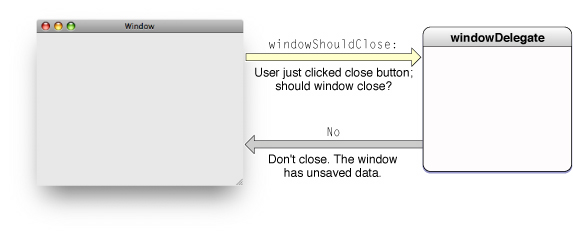
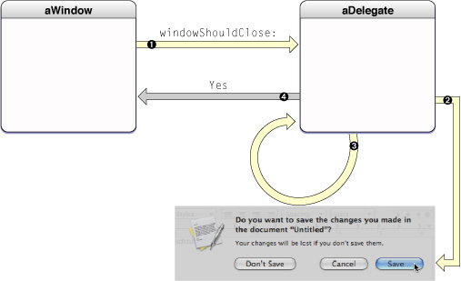
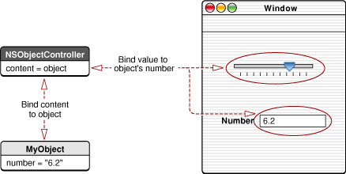
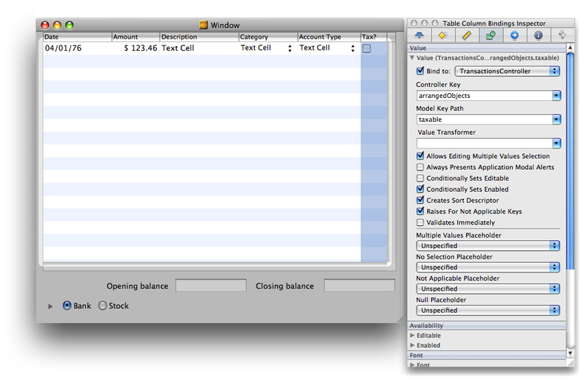
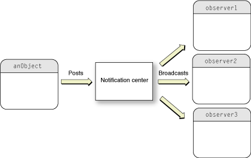
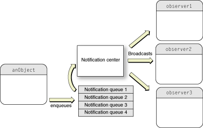

> 导航：[总目录](../../../README.md) · [文档](../../../_indexes/documentation.md) · [Cocoa 基础指南](Introduction.md)


[下一页](Document%20Revision%20History.md)[上一页](Cocoa%20Design%20Patterns.md)

# 与对象通信

Cocoa 对若干设计模式的改造应用，有助于应用程序中对象之间的通信。这些机制和范式包括委托机制、通知、目标-动作以及绑定技术。本章将介绍这些机制和范式。

在 Cocoa 及其面向对象语言 Objective-C 中，为程序添加专属行为的方式之一是通过继承。你派生出一个现有类的子类，来扩充该类实例的属性和行为，或以某种方式修改它们。但除此之外，还有其他方式可以为程序添加体现你程序特色的专属逻辑，也还有其他机制可以复用和扩展 Cocoa 对象的能力。

程序中对象之间的关系不止一个维度。有继承所形成的层级结构，但程序中的对象也以动态方式存在，处于一张由其他对象构成的网络之中，这些对象必须在运行时相互通信才能完成程序的工作。就像乐团里的乐手一样，程序中的每个对象都有自己的角色，为程序贡献一组有限的行为。它可能显示一块响应鼠标点击的椭圆形表面，或者管理一组对象的集合，又或者协调窗口生命周期中的重大事件。它只做自己被设计要做的事，仅此而已。但要让它的贡献在程序中真正发挥作用，它就必须能把这些贡献传达给其他对象——必须能够向其他对象发送消息，或者能够接收来自其他对象的消息。

在你的对象能向另一个对象发送消息之前，它必须持有对方的引用，或者依赖某种可靠的传递机制。Cocoa 为对象之间的通信提供了多种方式。这些机制和技巧建立在[Cocoa 设计模式](Cocoa%20Design%20Patterns.md#apple-f4xwc4dqnrsv64tfmyxwi33df52wszbpkridimbqgazdsnzufvbuqnrnknltm)中所描述的设计模式之上，使得高效构建健壮的应用程序成为可能。它们从简单到略为精巧不等，往往是子类化之外更可取的替代方案。你可以通过编程方式配置它们，有时也可以在 Interface Builder 中以图形化方式配置。

outlet 是一种对象实例变量——也就是说，它是一个对象的实例变量，引用着另一个对象。使用 outlet 时，这个引用是通过 Interface Builder 来配置和归档的。每次包含该 outlet 的对象从其 nib 文件反归档时，它与各个 outlet 之间的连接都会重新建立。包含 outlet 的对象将 outlet 保存为带有 `IBOutlet` 类型限定符的实例变量。例如：

```objc
@interface AppController : NSObject
{
    IBOutlet NSArray *keywords;
}
```

因为它是一个实例变量，outlet 就成为对象封装数据的一部分。但 outlet 又不仅仅是一个普通的实例变量。对象与其各个 outlet 之间的连接会归档在 nib 文件中；当 nib 文件被加载时，每个连接都会被反归档并重新建立，因此每当需要向另一个对象发送消息时，这个连接总是可用的。`IBOutlet` 这个类型限定符是附加在实例变量声明上的一个标记，使得 Interface Builder 应用程序能够识别出该实例变量是一个 outlet，并与 Xcode 同步它的显示和连接状态。

你[在 Interface Builder 中连接 outlet](https://developer.apple.com/library/archive/recipes/XcodeRecipes/Connecting_an_Outlet/OutletConnection.html#//apple_ref/doc/uid/TP40009043-CH8)，但必须先在自定义类的头文件中，通过给实例变量打上 `IBOutlet` 限定符来声明一个 outlet。

应用程序通常会在其自定义控制器对象与用户界面上的对象之间建立 outlet 连接，但也可以在任何能在 Interface Builder 中以实例形式表示的对象之间建立，甚至可以在两个自定义对象之间建立。和任何实例变量一样，你应该能为它在类中的存在给出合理理由；一个对象拥有的实例变量越多，占用的内存就越多。如果还有其他方式可以获得对某个对象的引用——比如通过它在矩阵中的索引位置查找、把它作为函数参数传入，或者使用标签（tag，一个被赋予的数字标识符）——你应该优先采用那些方式。

outlet 是对象组合（object composition）的一种形式，这是一种动态模式，要求一个对象以某种方式获取其组成对象的引用，从而能向这些对象发送消息。它通常将这些其他对象保存为实例变量。这些变量必须在程序执行的某个时刻，被适当的引用初始化。

委托（delegate）是这样一种对象：当另一个对象在程序中遇到某个事件时，它代表该对象行事，或与该对象协调行动。发出委托的对象（delegating object）通常是一个响应者对象——也就是说，是 AppKit 中继承自 [NSResponder](https://developer.apple.com/documentation/appkit/nsresponder)、或 UIKit 中继承自 [UIResponder](https://developer.apple.com/documentation/uikit/uiresponder) 的对象——它正在响应某个用户事件。委托则是被委托对该事件的用户界面拥有控制权的对象，或者至少是被要求以应用程序专属的方式来解释该事件的对象。

要更好地理解委托机制的价值，不妨考虑一个现成的 Cocoa 对象，比如一个文本字段（[NSTextField](https://developer.apple.com/documentation/appkit/nstextfield) 或 [UITextField](https://developer.apple.com/documentation/uikit/uitextfield) 的实例）或一个表视图（[NSTableView](https://developer.apple.com/documentation/appkit/nstableview) 或 [UITableView](https://developer.apple.com/documentation/uikit/uitableview) 的实例）。这些对象被设计为以通用的方式履行特定的角色；例如，AppKit 框架中的窗口对象会响应对其控件的鼠标操作，并处理关闭、调整大小、移动物理窗口等事务。这种受限且通用的行为，必然限制了该对象能知道多少关于某个事件如何影响（或将会影响）应用程序中其他地方的信息，尤其是当受影响的行为是你的应用程序所专属的时候。委托机制为你的自定义对象提供了一种途径，把应用程序专属的行为传达给这个现成的对象。

委托这一编程机制让对象有机会将自身的外观和状态，与程序中其他地方（通常由用户操作引发）发生的变化协调一致。更重要的是，委托机制使得一个对象无需继承另一个对象，也能改变后者的行为。委托几乎总是你自定义的对象之一，而且按照定义，它包含了那些通用的、发出委托的对象本身不可能知道的、应用程序专属的逻辑。

委托机制的设计很简单（图 5-1）。发出委托的类有一个 outlet 或属性，通常命名为 `delegate`；如果是 outlet，则还包括用于设置和访问该 outlet 值的方法。它还会声明（但不实现）一个或多个方法，这些方法构成一个正式协议或非正式协议。使用可选方法的正式协议——这是 Objective-C 2.0 的一项特性——是首选做法，但 Cocoa 框架在实现委托时两种协议都会用到。

在非正式协议的做法中，发出委托的类会在 `NSObject` 的一个分类上声明方法，而委托只需实现那些它有意与发出委托的对象协调一致、或想影响该对象默认行为的方法。如果发出委托的类声明的是正式协议，委托可以选择实现标记为可选的方法，但必须实现所有必需的方法。

委托遵循一种通用的设计，如图 5-1 所示。

__图 5-1__  委托机制



该协议中的方法标记出发出委托的对象所处理或预期发生的重要事件。这个对象要么想把这些事件告知委托，要么（对于即将发生的事件）想征求委托的输入或批准。例如，当用户在 OS X 中点击窗口的关闭按钮时，窗口对象会向其委托发送 [windowShouldClose:](https://developer.apple.com/documentation/appkit/nswindowdelegate/1419380-windowshouldclose) 消息；这让委托有机会否决或推迟窗口的关闭——例如当窗口关联的数据必须先保存时（见图 5-2）。

__图 5-2__  一个涉及委托的更真实的时序



只有当委托实现了相应方法时，发出委托的对象才会发送消息。它是通过先向委托发送 `NSObject` 的 [respondsToSelector:](https://developer.apple.com/library/archive/documentation/LegacyTechnologies/WebObjects/WebObjects_3.5/Reference/Frameworks/ObjC/Foundation/Protocols/NSObject/Description.html#//apple_ref/occ/intfm/NSObject/respondsToSelector:) 方法来做这个判断的。

委托方法有一种约定的形式。它们以发出委托的 AppKit 或 UIKit 对象的名称开头——application、window、control 等等；这个名称采用小写形式，并且不带"NS"或"UI"前缀。通常（但不总是）这个对象名称后面会跟一个助动词，表明所报告事件的时间状态。换句话说，这个助动词表明该事件是即将发生（"Should"或"Will"）还是刚刚发生（"Did"或"Has"）。这种时间上的区分有助于把那些期望有返回值的消息和那些没有返回值的消息区分开来。清单 5-1 列出了几个期望有返回值的 AppKit 委托方法。

__清单 5-1__  期望有返回值的委托方法示例

```objc
- (BOOL)application:(NSApplication *)sender
    openFile:(NSString *)filename;                        // NSApplication
- (BOOL)application:(UIApplication *)application
    handleOpenURL:(NSURL *)url;                           // UIApplicationDelegate
- (UITableRowIndexSet *)tableView:(NSTableView *)tableView
    willSelectRows:(UITableRowIndexSet *)selection;       // UITableViewDelegate
- (NSRect)windowWillUseStandardFrame:(NSWindow *)window
    defaultFrame:(NSRect)newFrame;                        // NSWindow
```

实现这些方法的委托可以阻止即将发生的事件（在前两个方法中通过返回 `NO`），或者更改建议的值（后两个方法中的索引集和边框矩形）。它甚至可以推迟一个即将发生的事件；例如，实现 [applicationShouldTerminate:](https://developer.apple.com/documentation/appkit/nsapplicationdelegate/1428642-applicationshouldterminate) 方法的委托可以通过返回 [NSTerminateLater](https://developer.apple.com/documentation/appkit/nsapplicationterminatereply/nsterminatelater) 来推迟应用程序的终止。

其他委托方法是由不期望返回值的消息调用的，因此类型定义为返回 `void`。这些消息纯粹是信息性的，方法名通常包含"Did"、"Will"，或其他表明事件已发生或即将发生的字样。清单 5-2 展示了几个这类委托方法的例子。

__清单 5-2__  返回 `void` 的委托方法示例

```objc
- (void) tableView:(NSTableView*)tableView
    mouseDownInHeaderOfTableColumn:(NSTableColumn *)tableColumn;      // NSTableView
- (void)windowDidMove:(NSNotification *)notification;                 // NSWindow
- (void)application:(UIApplication *)application
    willChangeStatusBarFrame:(CGRect)newStatusBarFrame;               // UIApplication
- (void)applicationWillBecomeActive:(NSNotification *)notification;   // NSApplication
```

关于最后这组方法，有两点值得注意。第一点是，助动词"Will"（如第三个方法所示）并不一定意味着期望有返回值。在这种情况下，事件即将发生且无法阻止，但该消息让委托有机会为该事件准备好程序。

另一个值得关注的点，涉及清单 5-2 中的第二个和最后一个方法声明。这些方法各自唯一的参数都是一个 [NSNotification](https://developer.apple.com/documentation/foundation/nsnotification) 对象，这意味着这些方法是因某个特定通知的发布而被调用的。例如，[windowDidMove:](https://developer.apple.com/documentation/appkit/nswindowdelegate/1419674-windowdidmove) 方法与 `NSWindow` 的 [NSWindowDidMoveNotification](https://developer.apple.com/documentation/appkit/nswindow/1419645-didmovenotification) 通知相关联。[通知](#apple-f4xwc4dqnrsv64tfmyxwi33df52wszbpkridimbqgazdsnzufvbuqnznknlto)一节将详细讨论通知，但这里有必要理解通知与 AppKit 中委托消息之间的关系：发出委托的对象会自动让其委托成为它所发布的所有通知的观察者。委托要做的只是实现相应的方法来获取该通知。

要把你自定义类的一个实例设为某个 AppKit 对象的委托，只需在 Interface Builder 中把该实例连接到 `delegate` outlet 或属性即可。你也可以通过编程方式，通过发出委托的对象的 `setDelegate:` 方法或 `delegate` 属性来设置——最好尽早设置，比如在 [awakeFromNib](https://developer.apple.com/documentation/objectivec/nsobject/1402907-awakefromnib) 或 [applicationDidFinishLaunching:](https://developer.apple.com/documentation/uikit/uiapplicationdelegate/1623053-applicationdidfinishlaunching) 方法中设置。

Cocoa 应用程序中发出委托的对象通常是一个响应者对象，比如 [UIApplication](https://developer.apple.com/documentation/uikit/uiapplication)、[NSWindow](https://developer.apple.com/documentation/appkit/nswindow) 或 [NSTableView](https://developer.apple.com/documentation/appkit/nstableview) 对象。委托对象本身通常（但不一定）是一个对象，往往是一个控制应用程序某个部分的自定义对象（也就是一个协调型控制器对象）。以下 AppKit 类定义了委托：

- [NSApplication](https://developer.apple.com/documentation/appkit/nsapplication)
- [NSBrowser](https://developer.apple.com/documentation/appkit/nsbrowser)
- [NSControl](https://developer.apple.com/documentation/appkit/nscontrol)
- [NSDrawer](https://developer.apple.com/documentation/appkit/nsdrawer)
- [NSFontManager](https://developer.apple.com/documentation/appkit/nsfontmanager)
- [NSFontPanel](https://developer.apple.com/documentation/appkit/nsfontpanel)
- [NSMatrix](https://developer.apple.com/documentation/appkit/nsmatrix)
- [NSOutlineView](https://developer.apple.com/documentation/appkit/nsoutlineview)
- [NSSplitView](https://developer.apple.com/documentation/appkit/nssplitview)
- [NSTableView](https://developer.apple.com/documentation/appkit/nstableview)
- [NSTabView](https://developer.apple.com/documentation/appkit/nstabview)
- [NSText](https://developer.apple.com/documentation/appkit/nstext)
- [NSTextField](https://developer.apple.com/documentation/appkit/nstextfield)
- [NSTextView](https://developer.apple.com/documentation/appkit/nstextview)
- [NSWindow](https://developer.apple.com/documentation/appkit/nswindow)

UIKit 框架也广泛使用委托机制，并且总是使用正式协议来实现。应用程序委托在运行于 iOS 的应用程序中极为重要，因为它必须响应来自应用程序对象的应用启动、应用退出、内存不足等消息。应用程序委托必须采纳 [UIApplicationDelegate](https://developer.apple.com/documentation/uikit/uiapplicationdelegate) 协议。

发出委托的对象不会（也不应该）保留它们的委托。但是，使用发出委托的对象的客户端（通常是应用程序本身）有责任确保其委托始终存在，以便接收委托消息。为此，在内存管理代码中，它们可能需要保留该委托。这一注意事项同样适用于数据源、通知观察者以及动作消息的目标。请注意，在垃圾回收环境中，对委托的引用是强引用，因为保留环问题在这种环境下不适用。

一些 AppKit 类有一种更受限的委托类型，称为 _模态委托（modal delegate）_。这些类的对象（例如 [NSOpenPanel](https://developer.apple.com/documentation/appkit/nsopenpanel)）运行模态对话框，当用户点击对话框的 OK 按钮时，会调用指定委托中的一个处理方法。模态委托的作用范围仅限于该模态对话框的操作。

委托的存在还有其他编程上的用途。例如，借助委托，同一程序中两个相互协调的控制器可以很容易地找到对方并与之通信。举例来说，控制整个应用程序的对象，可以用类似下面的代码找到应用程序检查器窗口的控制器（假设它是当前的关键窗口）：

```objc
id winController = [[NSApp keyWindow] delegate];
```

而你的代码可以用类似下面的方式，找到应用程序控制器对象——按照定义，它就是全局应用程序实例的委托：

```objc
id appController = [NSApp delegate];
```


数据源（data source）与委托类似，区别在于它被委托的不是对用户界面的控制权，而是对数据的控制权。数据源是一个由 [NSView](https://developer.apple.com/documentation/appkit/nsview) 和 [UIView](https://developer.apple.com/documentation/uikit/uiview) 对象（如表视图和大纲视图）持有的 outlet，这些对象需要一个数据来源来填充其可见数据的各行内容。视图的数据源通常与充当其委托的对象是同一个对象，但也可以是任何对象。和委托一样，数据源必须实现某个非正式协议的一个或多个方法，为视图提供其所需的数据；在更高级的实现中，还要处理用户在这类视图中直接编辑的数据。

和委托一样，数据源也是必须存在的对象，才能接收来自请求数据的对象发来的消息。使用它们的应用程序必须确保它们持续存在，在内存管理代码中必要时要保留（retain）它们。

数据源负责它们分发给用户界面对象的那些对象的持久性，也就是说，负责这些对象的内存管理。不过，每当大纲视图或表视图这类视图对象从数据源访问数据时，只要它还在使用这些数据，就会保留这些对象。但它使用这些数据的时间并不长，通常只是在显示数据所需的短暂时间内保留它们。

要为你的自定义类实现一个委托，请完成以下步骤：

- 在类的头文件中声明委托的存取方法。

```objc
- (id)delegate;
- (void)setDelegate:(id)newDelegate;
```
- 实现这些存取方法。在使用内存管理的程序中，为了避免保留环，setter 方法不应该保留（retain）或拷贝你的委托。

```objc
- (id)delegate {
    return delegate;
}

- (void)setDelegate:(id)newDelegate {
    delegate = newDelegate;
}
```

  在垃圾回收环境中，保留环不是问题，此时不应该把委托做成弱引用（即使用 `__weak` 类型修饰符）。关于保留环的更多信息，请参阅 _[Advanced Memory Management Programming Guide](../Advanced%20Memory%20Management%20Programming%20Guide/About%20Memory%20Management.md#apple-f4xwc4dqnrsv64tfmyxwi33df52wszbpgeydambqgaytc2i)_ 中的 Object Ownership and Disposal。关于垃圾回收中弱引用的更多信息，请参阅 _[Garbage Collection Programming Guide](../Garbage%20Collection%20Programming%20Guide/Introduction%20to%20Garbage%20Collection.md#apple-f4xwc4dqnrsv64tfmyxwi33df52wszbpkridimbqgazdimzr)_ 中的 [Garbage Collection for Cocoa Essentials](https://developer.apple.com/library/archive/documentation/Cocoa/Conceptual/GarbageCollection/Articles/gcEssentials.html#//apple_ref/doc/uid/TP40002452)。
- 声明一个正式或非正式协议，包含委托的编程接口。非正式协议是 `NSObject` 类上的分类。如果你为委托声明的是正式协议，请务必用 `@optional` 指令标记出可选方法组。

  [委托消息的形式](#apple-f4xwc4dqnrsv64tfmyxwi33df52wszbpkridimbqgazdsnzufvbuqnznknltemq)一节给出了为你自己的委托方法命名的建议。
- 在调用某个委托方法之前，先通过发送 [respondsToSelector:](https://developer.apple.com/library/archive/documentation/LegacyTechnologies/WebObjects/WebObjects_3.5/Reference/Frameworks/ObjC/Foundation/Protocols/NSObject/Description.html#//apple_ref/occ/intfm/NSObject/respondsToSelector:) 消息，确认委托确实实现了该方法。

```objc
- (void)someMethod {
    if ( [delegate respondsToSelector:@selector(operationShouldProceed)] ) {
        if ( [delegate operationShouldProceed] ) {
            // do something appropriate
        }
    }
}
```

  这一预防措施只在使用正式协议的可选方法或非正式协议的方法时才是必要的。

虽然委托机制、绑定和通知有助于处理程序中对象之间某些形式的通信，但它们并不特别适合最直观可见的那种通信。一个典型应用程序的用户界面由若干图形对象组成，而其中最常见的对象或许就是控件（control）。控件是对现实世界或逻辑设备（按钮、滑块、复选框等）的图形化模拟；就像现实世界中的控件（比如收音机调谐旋钮）一样，你用它把自己的意图传达给它所属的某个系统——也就是一个应用程序。

控件在用户界面上的角色很简单：解读用户的意图，并指示某个其他对象去执行该请求。当用户对控件进行操作时（比如点击它或按下 Return 键），硬件设备会生成一个原始事件。控件接受这个事件（经过 Cocoa 适当封装），并把它转换成一条应用程序专属的指令。然而，事件本身并没有提供多少关于用户意图的信息，它们只是告诉你用户点击了鼠标按钮或按了某个键。因此需要某种机制来完成事件与指令之间的转换。这种机制被称为 _目标-动作（target-action）_。

Cocoa 使用目标-动作机制来实现控件与另一个对象之间的通信。这种机制让控件（在 OS X 中还有它的 cell 或多个 cell）得以封装向合适对象发送应用程序专属指令所需的信息。接收指令的对象——通常是某个自定义类的实例——称为 _目标（target）_。_动作（action）_ 则是控件发送给目标的消息。对用户事件感兴趣的对象——也就是目标——才是赋予该事件意义的一方，而这种意义通常体现在它给动作起的名字上。

目标是动作消息的接收者。控件、或更常见的是它的 cell，会把动作消息的目标保存为一个 outlet（参见[outlet](#apple-f4xwc4dqnrsv64tfmyxwi33df52wszbpkridimbqgazdsnzufvbuqnznknltg)一节）。目标通常是你某个自定义类的实例，不过它也可以是任何类中实现了相应动作方法的 Cocoa 对象。

你也可以把 cell 或控件的目标 outlet 设为 `nil`，让目标对象在运行时才确定。当目标为 `nil` 时，应用程序对象（[NSApplication](https://developer.apple.com/documentation/appkit/nsapplication) 或 [UIApplication](https://developer.apple.com/documentation/uikit/uiapplication)）会按照规定的顺序查找合适的接收者：

1. 从关键窗口中的第一响应者开始，沿 [nextResponder](https://developer.apple.com/documentation/appkit/nsresponder/1528245-nextresponder) 链一路向上遍历响应者链，直到窗口对象（[NSWindow](https://developer.apple.com/documentation/appkit/nswindow) 或 [UIWindow](https://developer.apple.com/documentation/uikit/uiwindow)）的内容视图为止。
2. 然后尝试窗口对象本身，再尝试窗口对象的委托。
3. 如果主窗口不同于关键窗口，则从主窗口中的第一响应者重新开始，沿主窗口的响应者链一路向上，直到该窗口对象及其委托。
4. 接下来，应用程序对象尝试自己响应。如果它无法响应，就尝试它的委托。应用程序对象及其委托是最后的兜底接收者。

控件对象不会（也不应该）保留它们的目标。但是，发送动作消息的控件的使用方（通常是应用程序）有责任确保其目标能够接收动作消息。为此，在内存管理环境中，它们可能需要保留自己的目标。这一注意事项同样适用于委托和数据源。

动作（action）是控件发送给目标的消息，或者从目标的角度看，是目标为响应该动作消息而实现的方法。控件——在 AppKit 中通常是控件的 cell——把动作存储为一个 `SEL` 类型的实例变量。`SEL` 是 Objective-C 中用于指定消息签名的一种数据类型。动作消息必须具有简单、独特的签名。它所调用的方法不返回任何值，通常只有一个 `id` 类型的参数。按照惯例，这个参数命名为 `sender`。下面是 [NSResponder](https://developer.apple.com/documentation/appkit/nsresponder) 类中的一个例子，该类定义了许多动作方法：

```objc
- (void)capitalizeWord:(id)sender;
```

某些 Cocoa 类声明的动作方法也可以采用等价的签名：

```objc
- (IBAction) deleteRecord:(id)sender;
```

这里，`IBAction` 并不指定返回值的数据类型；没有返回值。`IBAction` 是一个类型限定符，Interface Builder 会在应用程序开发过程中注意到它，从而把以编程方式添加的动作，与其为项目内部维护的动作方法列表同步起来。

`sender` 参数通常标识发送该动作消息的控件（不过实际发送者也可以用另一个对象来替代）。这背后的思路类似于明信片上的回信地址：如果需要，目标可以向 sender 查询更多信息。如果实际的发送对象用另一个对象替代了 sender，你也应该以同样的方式对待那个对象。举例来说，假设你有一个文本字段，当用户输入文本后，目标中的动作方法 `nameEntered:` 会被调用：

```objc
- (void)nameEntered:(id) sender {
    NSString *name = [sender stringValue];
    if (![name isEqualToString:@""]) {
        NSMutableArray *names = [self nameList];
        [names addObject:name];
        [sender setStringValue:@""];
    }
}
```

这里，响应该动作的方法提取文本字段的内容，把该字符串添加到一个缓存为实例变量的数组中，然后清空该字段。其他可能向 sender 发出的查询还包括：向 `NSMatrix` 对象询问其选中的行（`[sender selectedRow]`）、向 `NSButton` 对象询问其状态（`[sender state]`），以及向与某个控件关联的任意 cell 询问其标签（tag，一个数字标识符，`[[sender cell] tag]`）。

AppKit 框架在实现目标-动作时使用了特定的架构和约定。

AppKit 中的大多数控件都是继承自 [NSControl](https://developer.apple.com/documentation/appkit/nscontrol) 类的对象。虽然控件最初负责把动作消息发送给它的目标，但它很少自己携带发送该消息所需的信息，为此它通常依赖自己的 cell（或多个 cell）。

一个控件几乎总是关联着一个或多个 cell——继承自 [NSCell](https://developer.apple.com/documentation/appkit/nscell) 的对象。为什么会有这种关联？控件是一种相对"重"的对象，因为它继承了其祖先类（包括 [NSView](https://developer.apple.com/documentation/appkit/nsview) 和 [NSResponder](https://developer.apple.com/documentation/appkit/nsresponder) 类）的所有实例变量的总和。正因为控件的开销较大，才用 cell 把控件的屏幕区域细分为各种功能区域。cell 是轻量级对象，可以把它们想象成覆盖在控件全部或部分区域之上的一层。但这不仅仅是区域上的划分，更是分工上的划分：cell 承担了原本要由控件完成的部分绘制工作，也保存了原本要由控件携带的部分数据。目标和动作这两个实例变量正是这些数据中的两项。[图 5-3](#apple-f4xwc4dqnrsv64tfmyxwi33df52wszbpkridimbqgazdsnzufvbuqnznknlte) 描绘了这种控件-cell 架构。

由于 `NSControl` 和 `NSCell` 都是抽象类，它们对目标和动作这两个实例变量的设置处理得都不完整。默认情况下，`NSControl` 只是把这些信息设置到与之关联的 cell 上（如果存在的话）。（`NSControl` 本身只支持自身与一个 cell 之间的一对一映射；`NSControl` 的子类，比如 [NSMatrix](https://developer.apple.com/documentation/appkit/nsmatrix)，才支持多个 cell。）而 `NSCell` 在其默认实现中只是简单地抛出异常。你必须沿着继承链再往下走一步，才能找到真正实现目标和动作设置的类：[NSActionCell](https://developer.apple.com/documentation/appkit/nsactioncell)。

派生自 `NSActionCell` 的对象会向其控件提供目标和动作的值，使控件能够组装并向正确的接收者发送动作消息。`NSActionCell` 对象通过高亮显示其区域来处理鼠标（光标）跟踪，并协助其控件向指定目标发送动作消息。在大多数情况下，`NSControl` 对象的外观和行为完全交由与之对应的 `NSActionCell` 对象负责。（`NSMatrix` 及其子类 [NSForm](https://developer.apple.com/documentation/appkit/nsform) 是 `NSControl` 的子类，但不遵循这条规则。）

__图 5-3__  目标-动作机制在控件-cell 架构中的工作方式


当用户从菜单中选择一项时，一个动作会被发送给目标。然而，从架构上讲，菜单（[NSMenu](https://developer.apple.com/documentation/appkit/nsmenu) 对象）及其菜单项（[NSMenuItem](https://developer.apple.com/documentation/appkit/nsmenuitem) 对象）与控件和 cell 是完全分开的。`NSMenuItem` 类为自己的实例实现了目标-动作机制；`NSMenuItem` 对象同时拥有目标和动作这两个实例变量（以及相应的存取方法），并在用户选择该菜单项时把动作消息发送给目标。

你可以通过编程方式，或者使用 Interface Builder，来设置 cell 和控件的目标和动作。对大多数开发者和大多数情况来说，Interface Builder 都是首选方式。当你用它来设置控件和目标时，Interface Builder 提供了可视化确认，允许你锁定连接，并把这些连接归档到 nib 文件中。具体步骤很简单：

1. 在自定义类的头文件中声明一个带 `IBAction` 限定符的动作方法。
2. 在 Interface Builder 中，[把发送消息的控件连接到目标的动作方法](https://developer.apple.com/library/archive/recipes/XcodeRecipes/Connecting_an_Action/ActionConnection.html#//apple_ref/doc/uid/TP40009043-CH6)。

如果该动作是由你自定义类的超类，或者某个现成的 AppKit 或 UIKit 类处理的，你可以不声明任何动作方法就完成连接。当然，如果你自己声明了一个动作方法，就必须确保实现它。

要以编程方式设置动作和目标，可以用以下方法向控件或 cell 对象发送消息：

```objc
- (void)setTarget:(id)anObject;
- (void)setAction:(SEL)aSelector;
```

下面的例子展示了你可能如何使用这些方法：

```objc
[aCell setTarget:myController];
[aControl setAction:@selector(deleteRecord:)];
[aMenuItem setAction:@selector(showGuides:)];
```

以编程方式设置目标和动作确实有其优势，在某些情况下它甚至是唯一可行的做法。例如，你可能希望目标或动作根据某个运行时条件而变化，比如是否存在网络连接，或者某个检查器窗口是否已经加载。另一个例子是，当你动态填充一个弹出菜单的各个菜单项时，你希望每个弹出菜单项都拥有自己的动作。

AppKit 框架不仅包含许多基于 `NSActionCell` 的、用于发送动作消息的控件，还在其许多类中定义了动作方法。当你创建一个 Cocoa 应用程序项目时，其中一些动作会被连接到默认的目标上。例如，应用程序菜单中的 Quit 命令，就连接到全局应用程序对象（`NSApp`）中的 [terminate:](https://developer.apple.com/documentation/appkit/nsapplication/1428417-terminate) 方法。

`NSResponder` 类还为文本上的常见操作定义了许多默认的动作消息（也称为 _标准命令_）。这使得 Cocoa 文本系统能够沿应用程序的响应者链——一个由处理事件的对象构成的层级序列——向上发送这些动作消息，直到被第一个实现了相应方法的 [NSView](https://developer.apple.com/documentation/appkit/nsview)、`NSWindow` 或 `NSApplication` 对象处理为止。

UIKit 框架也声明并实现了一整套控件类；这个框架中的控件类都继承自 [UIControl](https://developer.apple.com/documentation/uikit/uicontrol) 类，该类定义了 iOS 中目标-动作机制的大部分内容。然而，AppKit 和 UIKit 框架在实现目标-动作方面存在一些根本性的差异。其中一个差异是 UIKit 没有真正的 cell 类；UIKit 中的控件并不依赖 cell 来获取目标和动作信息。

两个框架在实现目标-动作上更大的差异，在于事件模型的本质不同。在 AppKit 框架中，用户通常使用鼠标和键盘来注册供系统处理的事件。这些事件——比如点击一个按钮——是有限且离散的。因此，AppKit 中的控件对象通常把单个物理事件识别为触发其向目标发送动作的条件（对按钮而言，这是一个鼠标释放事件）。而在 iOS 中，产生事件的是用户的手指，而不是鼠标点击、鼠标拖拽或物理按键。屏幕上同一时刻可能有不止一根手指在触碰某个对象，而且这些触碰甚至可能朝着不同的方向移动。

为了应对这种多点触控的事件模型，UIKit 在 `UIControl.h` 中声明了一组控件事件常量，用来指定用户可能对控件做出的各种物理手势，比如从控件上抬起手指、把手指拖入控件，以及在文本字段内按下手指。你可以配置一个控件对象，使其在响应一个或多个此类触摸事件时，向目标发送动作消息。UIKit 中的许多控件类都被实现为会产生特定的控件事件；例如，[UISlider](https://developer.apple.com/documentation/uikit/uislider) 类的实例会产生一个 [UIControlEventValueChanged](https://developer.apple.com/documentation/uikit/uicontrol/event/1618238-valuechanged) 控件事件，你可以用它向目标对象发送动作消息。

要让一个控件向目标对象发送动作消息，需要把目标和动作都与一个或多个控件事件关联起来。为此，针对你想指定的每一对目标-动作，向控件发送 [addTarget:action:forControlEvents:](https://developer.apple.com/documentation/uikit/uicontrol/1618259-addtarget) 消息。当用户以指定的方式触碰该控件时，控件会通过一条 [sendAction:to:from:forEvent:](https://developer.apple.com/documentation/uikit/uiapplication/1622946-sendaction) 消息，把动作消息转发给全局 `UIApplication` 对象。与 AppKit 中一样，全局应用程序对象是动作消息的集中调度点。如果控件为某个动作消息指定的目标是 `nil`，应用程序就会在响应者链中依次查询各个对象，直到找到一个愿意处理该动作消息的对象——也就是实现了与该动作选择器相对应的方法的对象。

与 AppKit 框架不同——在 AppKit 中一个动作方法可能只有一种、或最多两种有效签名——UIKit 框架允许三种不同形式的动作选择器：

- `- (void)action`
- `- (void)action:(id)sender`
- `- (void)action:(id)sender forEvent:(UIEvent *)event`

要了解更多关于 UIKit 中目标-动作机制的信息，请阅读 _[UIControl Class Reference](https://developer.apple.com/documentation/uikit/uicontrol)_。

绑定（bindings）是一项 Cocoa 技术，你可以用它在为 OS X 创建的 Cocoa 应用程序中同步数据的显示和存储。它是 Cocoa 工具箱中用于实现对象间通信的重要工具。这项技术是对 Model-View-Controller 和对象建模这两种设计模式的共同改造应用。（[Model-View-Controller 设计模式](Cocoa%20Design%20Patterns.md#apple-f4xwc4dqnrsv64tfmyxwi33df52wszbpkridimbqgazdsnzufvbuqnrnknltc)在讨论控制器对象时已经介绍过绑定。）它允许你在某个显示值的视图对象属性，与存储该值的模型对象属性之间，建立一个受中介的连接——即一个绑定；当连接一端的值发生变化时，会自动反映到另一端。负责中介这个连接的控制器对象还提供额外的支持，包括选择管理、占位符值和可排序表格。

绑定源自 Model-View-Controller（MVC）与对象建模这两种设计模式所界定的概念空间。一个 MVC 应用程序会给对象赋予通用角色，并根据这些角色维持对象之间的分离。对象可以是视图对象、模型对象或控制器对象，它们的角色可以简要概括如下：

- 视图对象显示应用程序的数据。
- 模型对象封装应用程序数据并对其进行操作。它们通常是用户在应用程序运行期间创建并保存的持久化对象。
- 控制器对象在视图对象和模型对象之间中介数据交换，并为应用程序执行指挥控制方面的服务。

所有对象——但最重要的是模型对象——都拥有一些界定性的组成部分或特性，称为 _属性（property）_。属性可以分为两类：特性（attribute，即字符串、标量、数据结构等值）和与其他对象的关系。关系又可以分为两类：一对一和一对多，它们还可以是双向的、自反的。因此，应用程序中的各个对象彼此之间存在着各种关系，这张由对象构成的关系网被称为 _对象图（object graph）_。一个属性有一个用作标识的名称，称为 _键（key）_。使用键路径——由句点分隔的一串键——就可以在对象图中遍历各种关系，访问相关对象的特性。

绑定技术利用对象图，在应用程序的视图、模型和控制器对象之间建立绑定。借助绑定，你可以把模型对象对象图中的关系网，延伸到应用程序的控制器对象和视图对象。你可以在一个视图对象的特性与一个模型对象的属性之间建立绑定（通常是通过一个控制器对象的中介属性）。显示出来的特性值发生的任何变化，都会通过该绑定自动传播到存储该值的属性；而该属性内部值的任何变化，也会被传回视图以供显示。

举例来说，图 5-4 展示了一组简化的绑定：滑块和文本字段（这些视图对象的特性）所显示的值，通过一个控制器对象的 `content` 属性，绑定到一个模型对象（`MyObject`）的 `number` 特性上。建立好这些绑定之后，如果用户移动滑块，变化后的值就会应用到 `number` 特性，并被传回文本字段进行显示。

__图 5-4__  视图、控制器和模型对象之间的绑定



绑定的实现依赖于键值编码、键值观察和键值绑定这几种支撑机制。这些机制及其相关非正式协议的概述，请参阅[键值机制](Adding%20Behavior%20to%20a%20Cocoa%20Program.md#apple-f4xwc4dqnrsv64tfmyxwi33df52wszbpkridimbqgazdsnzufvbuqnjnknlti)。[观察者](Cocoa%20Design%20Patterns.md#apple-f4xwc4dqnrsv64tfmyxwi33df52wszbpkridimbqgazdsnzufvbuqnrnknltema)一节对 Observer 模式的讨论中，也描述了键值观察。

你可以在任意两个对象之间建立绑定，唯一的要求是这些对象符合键值编码和键值观察的约定。不过，你通常会希望_通过_一个中介控制器来建立绑定，因为这类控制器对象能提供与绑定相关的服务，比如选择管理、占位符值，以及提交或放弃待定更改的能力。中介控制器是若干个 [NSController](https://developer.apple.com/documentation/appkit/nscontroller) 子类的实例；它们可以在 Interface Builder 库的 Objects & Controllers 部分找到（参见[你如何建立绑定](#apple-f4xwc4dqnrsv64tfmyxwi33df52wszbpkridimbqgazdsnzufvbuqnznknltcoi)）。你也可以创建自定义的中介控制器类，以获得更专门化的行为。

如果你的应用程序中唯一的自定义类是模型类，那么建立绑定的唯一要求就是：这些类对于你想要绑定的任何属性，都要符合键值编码的约定。如果你使用的是自定义视图或自定义控制器，还应确保它符合键值观察的约定。关于同时符合键值编码和键值观察这两项要求的概述，请参阅[键值机制](Adding%20Behavior%20to%20a%20Cocoa%20Program.md#apple-f4xwc4dqnrsv64tfmyxwi33df52wszbpkridimbqgazdsnzufvbuqnjnknlti)。

你也可以通过编程方式建立绑定，但在大多数情况下，你会使用 Interface Builder 应用程序来建立绑定。在 Interface Builder 中，你首先从库中把 [NSController](https://developer.apple.com/documentation/appkit/nscontroller) 对象拖入你的 nib 文件，然后使用 Info 窗口的 Bindings 面板，指定应用程序中视图、控制器和模型对象的属性之间的关系，以及你想要绑定的特性。

图 5-5 给出了一个绑定的例子。它展示了顶部表视图的"Tax?"列绑定到模型特性 `taxable` 上，其中的控制器是 `TransactionsController`（一个 [NSArrayController](https://developer.apple.com/documentation/appkit/nsarraycontroller) 对象）；而这个控制器本身又绑定到一个模型对象数组上（图中未显示）。

__图 5-5__  在 Interface Builder 中建立绑定



在对象之间传递信息的标准方式是消息传递——即一个对象调用另一个对象的方法。然而，消息传递要求发送消息的对象知道接收者是谁、以及接收者会响应什么消息。这一要求对委托消息以及其他类型的消息都同样成立。有时候，两个对象之间这种紧密耦合是不可取的——最明显的原因是，它会把本来可能相互独立的两个子系统硬绑在一起；而且这也不现实，因为它需要在应用程序中众多互不相关的对象之间建立硬编码连接。

对于标准消息传递无法胜任的情形，Cocoa 提供了通知（notification）这种广播式模型。借助通知机制，一个对象可以让其他对象随时了解自己正在做什么。从这个意义上说，它与委托机制类似，但两者的差异同样重要。委托与通知之间的关键区别在于：前者是一条一对一的通信路径（在发出委托的对象与其委托之间），而通知则是一种潜在的一对多通信形式——它是一种广播。一个对象只能有一个委托，但它可以拥有许多 _观察者（observer）_，这是通知的接收者的名称。而且该对象不必知道这些观察者都是谁。任何对象都可以通过通知间接观察某个事件，并据此调整自身的外观、行为和状态，以响应该事件。通知是在程序中实现协调与内聚的强大机制。

通知机制的运作方式在概念上很直接。一个进程拥有一个称为 _通知中心（notification center）_ 的对象，充当通知的集散地和广播中心。需要了解应用程序中其他地方所发生事件的对象，会向通知中心注册，告诉它自己希望在该事件发生时得到通知。一个例子是：某个控制器对象需要知道用户何时在弹出菜单中做出了选择，以便在用户界面中反映这一变化。当事件确实发生时，处理该事件的对象会向通知中心发布一条通知，通知中心随后把该通知分发给它所有的观察者。图 5-6 描绘了这一机制。

__图 5-6__  发布并广播一条通知



任何对象都可以发布通知，任何对象也都可以向通知中心注册自己，成为某个通知的观察者。发布通知的对象、发布对象包含在通知中的对象，以及通知的观察者，这三者可以是各不相同的对象，也可以是同一个对象。（让发布对象和观察对象是同一个对象确实有其用途，比如在空闲时间处理中。）发布通知的对象不需要知道观察者的任何信息；反过来，观察者至少需要知道通知的名称，以及通知对象所封装的字典中的各个键。（[通知对象](#apple-f4xwc4dqnrsv64tfmyxwi33df52wszbpkridimbqgazdsnzufvbuqnznknltcmq)一节描述了通知对象由哪些内容构成。）

和委托机制一样，通知机制也是实现应用程序内对象间通信的绝佳工具。通知让应用程序内的各个对象能够了解应用程序中其他地方发生的变化。通常，一个对象之所以注册成为某个通知的观察者，是因为它希望在某个事件发生或即将发生时做出相应调整。例如，如果一个自定义视图想在其所在窗口被调整大小时改变外观，它可以观察该窗口对象发布的 `NSWindowDidResizeNotification`。通知还允许在对象之间传递信息，因为一条通知可以包含一个与该事件相关的数据字典。

但通知和委托机制之间存在差异，这些差异决定了这两种机制各自应该用在什么场合。如前所述，通知模型和委托模型之间的主要区别在于：前者是一种广播机制，而委托则是一对一的关系。每种模型都有各自的优势；就通知而言，包括以下几点：

- 发布通知的对象不必知道观察对象的身份。
- 应用程序并不局限于使用 Cocoa 框架所声明的通知；任何类都可以为自己的实例声明通知并发布它们。
- 通知不局限于应用程序内部的通信；借助分布式通知，一个进程可以就发生的事件通知另一个进程。

但委托机制的一对一模型也有自己的优势。委托可以通过向发出委托的对象返回一个值，从而获得影响某个事件的机会。而通知的观察者则必须扮演更被动的角色，它只能影响自身以及自己所处的环境来响应该事件。通知方法必须具有以下签名：

```objc
- (void)notificationHandlerName:(NSNotification *);
```

这一要求使得观察对象无法以任何直接方式影响原始事件。而委托则往往可以影响发出委托的对象将如何处理某个事件。此外，AppKit 对象的委托会被自动注册为该对象所发布通知的观察者，委托要做的只是实现该框架类为其通知所定义的通知方法。

通知机制并不是 Cocoa 中观察对象状态变化的唯一方式，实际上，在许多情况下它都不应该是首选方式。Cocoa 的绑定技术，尤其是支撑它的键值观察（KVO）和键值绑定（KVB）协议，同样允许应用程序中的对象观察其他对象属性的变化。绑定机制完成这一功能的效率比通知更高。在绑定中，被观察对象与观察对象之间的通信是直接的，不需要像通知中心这样的中介对象。而且，绑定机制对未被观察的变化不会像常规通知那样产生性能损耗。

不过，也存在一些情况，优先使用通知而非绑定更合理。你可能想观察的是对象属性变化之外的其他事件；或者，实现 KVO 和 KVB 的合规性可能不太现实，尤其是当需要发布和观察的通知数量很少时。

即便情况需要使用通知，你也应该意识到它的性能影响。当你发布一条通知时，它最终会由本地通知中心以同步方式分发给观察对象，无论发布本身是同步还是异步进行的都是如此。如果观察者很多，或者每个观察者在处理通知时都要做大量工作，你的程序就可能出现明显的延迟。因此，你应该注意不要过度使用通知，也不要低效地使用它们。以下几条使用通知的指导原则会有所帮助：

- 对应用程序应该观察哪些通知要有所取舍。
- 注册通知时，对通知名称和发布对象要尽量具体明确。
- 处理通知的方法要实现得尽可能高效。
- 避免频繁添加和移除大量观察者；更好的做法是只用少数几个中介观察者，由它们把通知的处理结果传达给它们能访问到的对象。

通知（notification）是一个对象，是 [NSNotification](https://developer.apple.com/documentation/foundation/nsnotification) 的一个实例。这个对象封装了关于某个事件的信息，比如某个窗口获得了焦点，或者某个网络连接关闭了。当事件确实发生时，处理该事件的对象会向通知中心发布这条通知，通知中心随即立刻把这条通知广播给所有已注册的对象。

一个 `NSNotification` 对象包含一个名称、一个对象，以及一个可选的字典。名称是标识该通知的一个标签。对象则是通知的发布者想要发送给该通知的观察者的任意对象（通常就是发布该通知的对象本身）。它类似于委托消息中的 sender 对象，让接收者能够向它查询更多信息。字典则保存与该事件相关的任何信息。

通知中心负责管理通知的发送和接收。它会通知所有符合特定条件的通知的观察者。通知信息被封装在 `NSNotification` 对象中。客户端对象会向通知中心注册自己，成为其他对象所发布的特定通知的观察者。当某个事件发生时，某个对象会向通知中心发布相应的通知。通知中心随后向每个已注册的观察者派发一条消息，把该通知作为唯一的参数传入。发布对象和观察对象也可以是同一个对象。

Cocoa 包含两种类型的通知中心：

- 通知中心（[NSNotificationCenter](https://developer.apple.com/library/archive/documentation/LegacyTechnologies/WebObjects/WebObjects_3.5/Reference/Frameworks/ObjC/Foundation/Classes/NSNotificationCenter/Description.html#//apple_ref/occ/cl/NSNotificationCenter) 的实例）管理单个任务内部的通知。
- 分布式通知中心（[NSDistributedNotificationCenter](https://developer.apple.com/documentation/foundation/nsdistributednotificationcenter) 的实例）管理同一台计算机上多个任务之间的通知。

请注意，与许多其他 Foundation 类不同，`NSNotificationCenter` 并没有与其对应的 Core Foundation 类（[CFNotificationCenterRef](https://developer.apple.com/documentation/corefoundation/cfnotificationcenterref)）进行免费桥接。

每个任务都有一个默认的通知中心，你可以通过 `NSNotificationCenter` 的类方法 [defaultCenter](https://developer.apple.com/library/archive/documentation/LegacyTechnologies/WebObjects/WebObjects_3.5/Reference/Frameworks/ObjC/Foundation/Classes/NSNotificationCenter/Description.html#//apple_ref/occ/clm/NSNotificationCenter/defaultCenter) 访问它。该通知中心处理单个任务内部的通知。要在同一台计算机上的不同任务之间通信，请使用分布式通知中心（参见 [NSDistributedNotificationCenter](#apple-f4xwc4dqnrsv64tfmyxwi33df52wszbpkridimbqgazdsnzufvbuqnznknltm)）。

通知中心以同步方式把通知投递给观察者。换句话说，在所有观察者都接收并处理完该通知之前，发布通知的对象不会重新获得控制权。要以异步方式发送通知，请使用通知队列，[通知队列](#apple-f4xwc4dqnrsv64tfmyxwi33df52wszbpkridimbqgazdsnzufvbuqnznknlti)一节对此有所描述。

在多线程应用程序中，通知总是在发布该通知所在的线程中投递，这个线程未必与观察者注册自己时所在的线程相同。

每个任务都有一个默认的分布式通知中心，你可以通过 `NSDistributedNotificationCenter` 的类方法 [defaultCenter](https://developer.apple.com/documentation/foundation/nsdistributednotificationcenter/1412063-defaultcenter) 访问它。这个分布式通知中心处理可以在同一台计算机上的多个任务之间发送的通知。要在不同计算机上的任务之间通信，请使用分布式对象（参见 _[Distributed Objects Programming Topics](../Distributed%20Objects%20Programming%20Topics/Introduction%20to%20Distributed%20Objects.md#apple-f4xwc4dqnrsv64tfmyxwi33df52wszbpgeydambqgeyde2i)_）。

发布一条分布式通知是一项开销较大的操作。该通知会被发送到一个系统级的服务器，再由该服务器分发给所有注册了分布式通知的任务。从发布通知到通知到达另一个任务之间的延迟是没有上限的。事实上，如果发布的通知过多、服务器队列被填满，通知甚至可能被丢弃。

分布式通知是通过任务的运行循环投递的。一个任务必须在某个常见模式（比如 `NSDefaultRunLoopMode`）下运行运行循环，才能接收到分布式通知。如果接收方任务是多线程的，不要假定通知一定会到达主线程。通知通常会被投递到主线程的运行循环，但其他线程也可能收到该通知。

常规通知中心允许任意对象作为通知对象（即通知所封装的那个对象），而分布式通知中心则要求通知对象必须是一个 [NSString](https://developer.apple.com/library/archive/documentation/LegacyTechnologies/WebObjects/WebObjects_3.5/Reference/Frameworks/ObjC/Foundation/Classes/NSStringClassCluster/Description.html#//apple_ref/occ/cl/NSString) 对象。因为发布对象和观察者可能位于不同的任务中，通知不能包含指向任意对象的指针。因此，分布式通知中心要求通知使用一个字符串作为通知对象。通知的匹配是基于这个字符串进行的，而不是基于对象指针。

[NSNotificationQueue](https://developer.apple.com/library/archive/documentation/LegacyTechnologies/WebObjects/WebObjects_3.5/Reference/Frameworks/ObjC/Foundation/Classes/NSNotificationQueue/Description.html#//apple_ref/occ/cl/NSNotificationQueue) 对象（简称通知队列）充当通知中心（`NSNotificationCenter` 实例）的缓冲区。通知队列通常以先进先出（FIFO）的顺序维护通知（`NSNotification` 实例）。当某条通知排到队列前端时，队列会把它发布给通知中心，通知中心再把该通知派发给所有注册为观察者的对象。

每个线程都有一个默认的通知队列，它与该任务的默认通知中心相关联。图 5-7 描绘了这种关联关系。你可以创建自己的通知队列，每个通知中心和每个线程都可以拥有多个队列。

__图 5-7__  通知队列与通知中心



`NSNotificationQueue` 类为 Foundation 框架的通知机制贡献了两个重要特性：通知的合并（coalescing）和异步发布。合并是这样一个过程：把队列中与刚入队的通知相似的通知移除。如果新加入的通知与队列中已有的某条通知相似，那么这条新通知就不会被加入队列，同时所有相似的通知（队列中第一条除外）都会被移除。不过，你不应该依赖这种特定的合并行为。

你可以通过在 [enqueueNotification:postingStyle:coalesceMask:forModes:](https://developer.apple.com/library/archive/documentation/LegacyTechnologies/WebObjects/WebObjects_3.5/Reference/Frameworks/ObjC/Foundation/Classes/NSNotificationQueue/Description.html#//apple_ref/occ/instm/NSNotificationQueue/enqueueNotification:postingStyle:coalesceMask:forModes:) 方法的第三个参数中指定以下一个或多个常量，来表明判断通知相似性的标准。

- `NSNotificationNoCoalescing`
- `NSNotificationCoalescingOnName`
- `NSNotificationCoalescingOnSender`

你可以对 `NSNotificationCoalescingOnName` 和 `NSNotificationCoalescingOnSender` 这两个常量执行按位或（bitwise-OR）操作，来指定同时基于通知名称和通知对象进行合并。在这种情况下，所有与入队通知具有相同名称和相同 sender 的通知都会被合并。

使用 `NSNotificationCenter` 的 [postNotification:](https://developer.apple.com/library/archive/documentation/LegacyTechnologies/WebObjects/WebObjects_3.5/Reference/Frameworks/ObjC/Foundation/Classes/NSNotificationCenter/Description.html#//apple_ref/occ/instm/NSNotificationCenter/postNotification:) 方法及其变体，你可以立即向通知中心发布一条通知。不过，这个方法的调用是同步的：在发布通知的对象能够恢复其执行线程之前，它必须等待通知中心把通知派发给所有观察者并返回。而使用 `NSNotificationQueue` 的 [enqueueNotification:postingStyle:](https://developer.apple.com/library/archive/documentation/LegacyTechnologies/WebObjects/WebObjects_3.5/Reference/Frameworks/ObjC/Foundation/Classes/NSNotificationQueue/Description.html#//apple_ref/occ/instm/NSNotificationQueue/enqueueNotification:postingStyle:) 和 [enqueueNotification:postingStyle:coalesceMask:forModes:](https://developer.apple.com/library/archive/documentation/LegacyTechnologies/WebObjects/WebObjects_3.5/Reference/Frameworks/ObjC/Foundation/Classes/NSNotificationQueue/Description.html#//apple_ref/occ/instm/NSNotificationQueue/enqueueNotification:postingStyle:coalesceMask:forModes:) 方法，你则可以把通知放入队列，以异步方式发布它。这些方法在把通知放入队列后，会立刻返回给调用对象。

通知队列会被清空，其中的通知会根据入队方法中指定的发布样式和运行循环模式而被发布出去。mode 参数指定了队列被清空时所处的运行循环模式。例如，如果你指定了 [NSModalPanelRunLoopMode](https://developer.apple.com/documentation/appkit/nsmodalpanelrunloopmode)，那么只有当运行循环处于这个模式时，通知才会被发布。如果运行循环当前不处于这个模式，通知就会一直等待，直到下一次进入该模式为止。

向通知队列发布通知可以采用三种不同的样式之一：[NSPostASAP](https://developer.apple.com/library/archive/documentation/LegacyTechnologies/WebObjects/WebObjects_3.5/Reference/Frameworks/ObjC/Foundation/TypesAndConstants/FoundationTypesConstants/Description.html#//apple_ref/c/econst/NSPostASAP)、[NSPostWhenIdle](https://developer.apple.com/library/archive/documentation/LegacyTechnologies/WebObjects/WebObjects_3.5/Reference/Frameworks/ObjC/Foundation/TypesAndConstants/FoundationTypesConstants/Description.html#//apple_ref/c/econst/NSPostWhenIdle) 和 [NSPostNow](https://developer.apple.com/library/archive/documentation/LegacyTechnologies/WebObjects/WebObjects_3.5/Reference/Frameworks/ObjC/Foundation/TypesAndConstants/FoundationTypesConstants/Description.html#//apple_ref/c/econst/NSPostNow)。以下几节将分别介绍这几种样式。

任何以 `NSPostASAP` 样式入队的通知，都会在运行循环的当前迭代完成时被发布给通知中心，前提是运行循环当前的模式与所请求的模式相匹配。（如果请求的模式与当前模式不同，通知会在进入所请求的模式时才被发布。）由于运行循环在每次迭代期间可能会多次进行回调，因此当当前回调退出、控制权返回运行循环时，通知未必会立即被投递；可能会先发生其他回调，比如某个定时器或源触发，或者其他异步通知的投递。

你通常会对开销较大的资源（例如显示服务器）使用 `NSPostASAP` 发布样式。当运行循环的一次回调期间有许多客户端在窗口缓冲区上绘制时，每次绘制操作后都把缓冲区刷新到显示服务器的开销会很大。在这种情况下，每个 `draw...` 方法都会以按名称和对象合并、发布样式为 `NSPostASAP` 的方式，入队某个类似"FlushTheServer"的通知。结果是，在运行循环结束时，这些通知中只有一条会被派发，窗口缓冲区也就只会被刷新一次。

以 `NSPostWhenIdle` 样式入队的通知，只有在运行循环处于等待状态时才会被发布。在这种状态下，运行循环的输入通道中没有任何东西，包括定时器或其他异步事件。请注意，一个即将退出的运行循环（当所有输入通道都已过期时会发生这种情况）并不处于等待状态，因此不会发布通知。

以 `NSPostNow` 入队的通知，会在合并处理之后立即发布给通知中心。当你不需要异步调用行为时，就应该以 `NSPostNow` 方式入队通知（或者用 NSNotificationCenter 的 `postNotification:` 方法直接发布）。在许多编程场景中，同步行为不仅是允许的，甚至是更理想的：你希望通知中心在派发完成后再返回，这样你就能确保观察对象已经接收并处理了该通知。当然，如果队列中有相似的通知，而你想通过合并把它们移除，就应该使用带 `NSPostNow` 的 `enqueueNotification`... 方法，而不是直接使用 `postNotification:`。

发出委托的对象并不被认为拥有它们的委托或数据源。同样地，控件和 cell 也不被认为拥有它们的目标，通知中心也不拥有通知的观察者。因此，在内存管理代码中，这些框架对象遵循的约定是：_不_ 保留（retain）它们的目标、观察者、委托和数据源，而只是简单地存储一个指向该对象的指针。

内存管理中的对象所有权策略建议：被拥有的对象应该被无条件地保留（retain）和归档，而被引用（但不被拥有）的对象则不应该被保留，且应该有条件地归档。这种所有权策略的实际用意是避免循环引用——即两个对象互相保留对方的情况（这通常称为 _保留环（retain cycle）_）。保留一个对象会建立一个强引用，而一个对象在其所有强引用都被释放之前是无法被释放（deallocate）的。如果两个对象互相保留对方，那么这两个对象都永远不会被释放，因为它们之间的连接无法断开。

你必须确保作为委托的对象始终是一个有效的引用，否则你的应用程序可能会崩溃。当该对象被释放时，你需要通过向另一个对象发送参数为 `nil` 的 `setDelegate:` 消息来移除这个委托链接。你通常应该在该对象的 `dealloc` 方法中发送这些消息。

如果你从某个带有委托、数据源、观察者或目标的 Cocoa 框架类派生子类，你绝不应该在子类中显式保留（retain）该对象。你应该为它建立一个非保留（nonretained）的引用，并有条件地对它进行归档。

[下一页](Document%20Revision%20History.md)[上一页](Cocoa%20Design%20Patterns.md)

