> 导航：[总目录](../../../README.md) · [文档](../../../_indexes/documentation.md) · [Cocoa 基础指南](Introduction.md)

[下一页](Cocoa%20Objects.md)[上一页](Introduction.md)

# 什么是 Cocoa？

Cocoa 是同时面向 OS X 操作系统和 iOS（用于 iPhone、iPad、iPod touch 等 Multi-Touch 设备的操作系统）的应用环境（application environment）。它由一整套面向对象的软件库、一个运行时系统和一个集成开发环境组成。

本章围绕这一定义展开，描述 Cocoa 在这两个平台上的目的、能力和组成部分。阅读这份关于 Cocoa 的功能性描述，是想要理解 Cocoa 的开发者必须迈出的第一步。

Cocoa 是一组面向对象的框架，为运行在 OS X 和 iOS 中的应用程序提供运行时环境。Cocoa 是 OS X 上最重要的应用环境，也是 iOS 上_唯一_的应用环境。（Carbon 是 OS X 中的另一种环境，但它是一个提供过程式编程接口的兼容性框架，旨在支持已有的 OS X 代码库。）你在 OS X 和 iOS 上看到的大多数应用程序，包括 Mail 和 Safari，都是 Cocoa 应用程序。一个名为 Xcode 的集成开发环境为这两个平台的应用开发提供支持。这个开发环境与 Cocoa 相结合，让你能够轻松创建结构良好、功能完善的应用程序。

和所有应用环境一样，Cocoa 也有两副面孔：一个是运行时层面，一个是开发层面。在运行时层面，Cocoa 应用程序呈现用户界面，并与操作系统中其他可见的组件紧密集成；在 OS X 中，这些组件包括 Finder、Dock，以及来自所有环境的其他应用程序。

但对程序员来说，更有意思的是开发层面。Cocoa 是一整套集成的面向对象软件组件——类——使你能够快速创建健壮、功能完善的 OS X 和 iOS 应用程序。这些类是可重用、可适配的软件构建块；你可以直接使用它们，也可以针对自己的具体需求对其进行扩展。从用户界面对象到数据格式化，几乎每一种可以想到的开发需求都有对应的 Cocoa 类。当某个开发需求没有被预先考虑到时，你也可以很容易地为某个已有的类派生子类来满足这一需求。

在所有面向对象的开发环境中，Cocoa 拥有最为显赫的血统之一。从 1989 年以 NeXTSTEP 之名问世到今天，它一直在不断被打磨和检验（参见 [历史小记](#apple-f4xwc4dqnrsv64tfmyxwi33df52wszbpkridimbqgazdsnzufvbuqmznknltcmq)）。它优雅而强大的设计非常适合快速开发各种类型的软件——不仅是应用程序，还包括命令行工具、插件以及各种类型的 bundle。Cocoa "免费"赋予了你的应用程序许多行为和外观，让你能把更多时间用在那些真正体现独特之处的功能上。（关于 Cocoa 所提供内容的详情，参见 [Cocoa 应用程序的特性](#apple-f4xwc4dqnrsv64tfmyxwi33df52wszbpkridimbqgazdsnzufvbuqmznknltm)。）

开发 Cocoa 软件时可以使用多种编程语言，但必不可少的语言是 Objective-C。Objective-C 是 ANSI C 的超集，在其基础上扩展了（源自 Smalltalk 的）某些语法和语义特性，以支持面向对象编程。这些新增的约定为数不多，易学易用。由于 Objective-C 建立在 ANSI C 的基础之上，你可以自由地把纯 C 代码与 Objective-C 代码混合使用。此外，你的代码还可以调用非 Cocoa 编程接口中定义的函数，比如 `/usr/include` 中的 BSD 库接口。你甚至可以将 C++ 代码与 Cocoa 代码混合，并把编译后的代码链接到同一个可执行文件中。

最重要的 Cocoa 类库分别打包在每个平台的两个核心框架中：OS X 上是 Foundation 和 AppKit，iOS 上是 Foundation 和 UIKit。和所有框架一样，它们不仅包含一个可动态共享的库（有时为了向后兼容会包含多个版本的库），还包含头文件、API 文档以及相关资源。Foundation 与 AppKit 或 UIKit 的搭配，体现了 Cocoa 编程接口的一种划分方式：一部分类与图形用户界面无关，另一部分则与之相关。对每个平台而言，其两个核心框架对任何以应用程序为最终产物的 Cocoa 项目都是必不可少的。两个平台还都支持 Core Data 框架，它与核心框架同等重要、同样有用。

OS X 还附带了若干其他发布 Cocoa 编程接口的框架，例如 WebKit 和 Address Book 框架；随着时间推移，还会有更多 Cocoa 框架被加入到操作系统中。详情参见 [Cocoa 框架](#apple-f4xwc4dqnrsv64tfmyxwi33df52wszbpkridimbqgazdsnzufvbuqmznknltcma)。

从架构上看，OS X 是一系列软件层，从最底层的 Darwin 基础一直延伸到各种应用框架及其支持的用户体验。中间各层所代表的系统软件，大部分（但不是全部）包含在两个主要的伞状框架（umbrella framework）——Core Services 和 Application Services——之中。上层组件通常依赖于其下方的层。图 1-1 展示了 Cocoa 在这一架构中所处的位置。

__图 1-1__  Cocoa 在 OS X 架构中的位置

!

举例来说，主要负责渲染 Aqua 用户界面的系统组件 Quartz（由 Core Graphics 框架实现）就属于 Application Services 层。而整个架构栈的最底层是 Darwin；OS X 中的一切，包括 Cocoa，最终都要依赖 Darwin 才能运作。

在 OS X 中，Cocoa 有两个对应用开发不可或缺的_核心_ Objective-C 框架：

- __AppKit。__ AppKit 是应用框架之一，提供应用程序在用户界面中显示的各种对象，并定义了应用程序行为的结构，包括事件处理和绘制。关于 AppKit 的说明，参见 [AppKit（OS X）](#apple-f4xwc4dqnrsv64tfmyxwi33df52wszbpkridimbqgazdsnzufvbuqmznknlteni)。
- __Foundation。__ 这个框架位于 Core Services 层，定义了对象的基本行为，建立了管理对象的机制，并为原始数据类型、集合以及操作系统服务提供了对象。Foundation 本质上是 Core Foundation 框架的面向对象版本；关于 Foundation 框架的讨论参见 [Foundation](#apple-f4xwc4dqnrsv64tfmyxwi33df52wszbpkridimbqgazdsnzufvbuqmznknltema)。

AppKit 与 Foundation 有着紧密的直接依赖关系，而 Foundation 在功能上属于 Core Services 层。如果你进一步观察单个或成组的 Cocoa 类，以及特定的框架，就会发现 Cocoa 要么对 OS X 的其他部分有特定依赖，要么通过其接口暴露了底层技术。Cocoa 所依赖或通过其类和方法暴露出来的一些主要底层框架包括 Core Foundation、Carbon Core、Core Graphics（Quartz）和 Launch Services：

- _Core Foundation_。Foundation 框架的许多类都基于对应的 Core Foundation 不透明类型。正是这种紧密关系使得"免费桥接（toll-free bridging）"——在兼容的 Core Foundation 类型和 Foundation 类型之间进行强制转换——成为可能。而 Core Foundation 的部分实现又基于 Darwin 层中的 BSD 部分。
- _Carbon Core_。AppKit 和 Foundation 会调用 Carbon Core 框架提供的部分系统服务。例如，Carbon Core 中有 File Manager，Cocoa 用它在各种文件系统表示形式之间进行转换。
- _Core Graphics_。Cocoa 的绘制与图像处理类（很自然地）紧密基于 Core Graphics 框架，该框架实现了 Quartz 和 window server。
- _Launch Services_。`NSWorkspace` 类暴露了 Launch Services 的底层能力。Cocoa 还使用 Launch Services 的应用注册功能来获取与应用程序和文档关联的图标。

Apple 对 Cocoa 做了精心设计，使其部分编程接口能够访问应用程序通常需要的底层技术能力。但如果你需要某种 Cocoa 编程接口未暴露的能力，或者需要对应用程序中发生的事情进行更精细的控制，你也许可以直接使用某个底层框架。（一个典型的例子是 Core Graphics；通过调用它或 OpenGL 的函数，你的代码可以绘制出比 Cocoa 绘制方法更复杂、更精细的图像。）幸运的是，使用这些更底层的框架并不困难，因为大多数被依赖框架的编程接口都是用标准 ANSI C 编写的，而 Objective-C 语言正是 ANSI C 的超集。

iOS 的应用框架层被称为 Cocoa Touch。尽管 Cocoa Touch 所依赖的 iOS 基础设施与 OS X 中 Cocoa 所依赖的基础设施类似，但两者之间存在一些显著差异。将描绘 iOS 架构的图 1-2 与 [图 1-1](#apple-f4xwc4dqnrsv64tfmyxwi33df52wszbpkridimbqgazdsnzufvbuqmznknltk) 中的图示进行比较。iOS 的图示同样把支撑该平台的软件呈现为一系列层，从 Core OS 基础一直到一组应用框架，其中对应用程序而言最关键的是 UIKit 框架。和 OS X 的图示一样，iOS 图示的中间层也由核心服务框架，以及图形和媒体框架与库组成。同样地，上层组件通常依赖于其下方的层。

__图 1-2__  Cocoa 在 iOS 架构中的位置

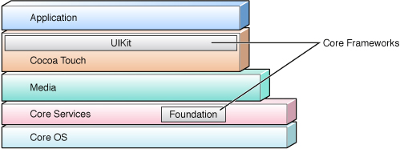

总体来说，iOS 中最终支撑 UIKit 的系统库和框架，是 OS X 中相应库和框架的一个子集。例如，iOS 中没有 Carbon 应用环境，没有命令行访问方式（Darwin 中的 BSD 环境），没有打印相关的框架和服务，QuickTime 在该平台上也不存在。不过，由于 iOS 所支持设备的特殊性质，也存在一些公开和私有的 iOS 专属框架。

以下内容概述了 iOS 软件栈各层（从最底层的基础层开始）中的一些框架。

- __Core OS。__ 这一层包含内核、文件系统、网络基础设施、安全性、电源管理以及若干设备驱动程序。它还包含 libSystem 库，该库支持 POSIX/BSD 4.4/C99 API 规范，并为许多服务提供系统级 API。
- __Core Services。__ 这一层的框架提供核心服务，例如字符串操作、集合管理、网络、URL 工具、联系人管理和偏好设置。它们还基于设备的硬件特性（如 GPS、指南针、加速度计和陀螺仪）提供相应服务。这一层的框架示例有 Core Location、Core Motion 和 System Configuration。

  这一层同时包含 Foundation 和 Core Foundation，它们为字符串、集合等常见数据类型提供抽象。Core Frameworks 层还包含 Core Data，这是一个用于对象图管理和对象持久化的框架。
- __Media。__ 这一层的框架和服务依赖于 Core Services 层，为 Cocoa Touch 层提供图形和多媒体服务。它们包括 Core Graphics、Core Text、OpenGL ES、Core Animation、AVFoundation、Core Audio 以及视频播放功能。
- __Cocoa Touch。__ 这一层的框架直接为基于 iOS 的应用程序提供支持。它们包括 Game Kit、Map Kit、iAd 等框架。

Cocoa Touch 层和 Core Services 层各有一个对 iOS 应用程序开发尤为重要的 Objective-C 框架。这些是 iOS 中的_核心_ Cocoa 框架：

- __UIKit。__ 这个框架提供应用程序在用户界面中显示的各种对象，并定义了应用程序行为的结构，包括事件处理和绘制。关于 UIKit 的说明，参见 [UIKit（iOS）](#apple-f4xwc4dqnrsv64tfmyxwi33df52wszbpkridimbqgazdsnzufvbuqmznknltemq)。
- __Foundation。__ 这个框架定义了对象的基本行为，建立了管理对象的机制，并为原始数据类型、集合以及操作系统服务提供了对象。Foundation 本质上是 Core Foundation 框架的面向对象版本；关于 Foundation 框架的讨论参见 [Foundation](#apple-f4xwc4dqnrsv64tfmyxwi33df52wszbpkridimbqgazdsnzufvbuqmznknltema)。

与 OS X 中的 Cocoa 一样，iOS 中 Cocoa 的编程接口也让你的应用程序能够使用底层技术的能力。通常总有一个 Foundation 或 UIKit 的方法或函数可以调用某个更底层的框架来实现你想要的效果。但和 OS X 中的 Cocoa 一样，如果你需要某种 Cocoa API 未暴露的能力，或者需要对应用程序中发生的事情进行更精细的控制，你也可以选择直接使用某个底层框架。例如，UIKit 使用 WebKit 来绘制文本，并发布了一些用于绘制文本的方法；但你可能会决定改用 Core Text 来绘制文本，因为它能为文本布局和字体管理提供你所需要的控制力。同样，使用这些更底层的框架并不困难，因为大多数被依赖框架的编程接口都是用标准 ANSI C 编写的，而 Objective-C 语言正是 ANSI C 的超集。

在 OS X 中，你完全可以不写一行代码就创建出一个 Cocoa 应用程序。用 Xcode 新建一个 Cocoa 应用程序项目，然后构建这个项目即可。就是这样。当然，这个应用程序不会做太多事情，至少不会做什么有意思的事情。但这个极其简单的应用程序仍然可以在双击时启动，在 Dock 中显示自己的图标，显示它的菜单和窗口（标题为"Window"），在收到命令时隐藏自己，和其他正在运行的应用程序友好相处，并在收到命令时退出。你可以移动、调整大小、最小化并关闭这个窗口，甚至可以打印这个窗口里的空白内容。

对 iOS 应用程序你也可以做同样的事情。用某个项目模板在 Xcode 中创建一个项目，立即构建它，然后在 iOS Simulator 中运行。点击 Home 按钮（或在设备上按下该按钮）时应用程序会退出。要启动应用程序，在 Simulator 中点击它的图标即可。它甚至可能带有一些额外的行为；例如，用 Utility Application 模板创建出的应用程序，在你点击或轻触信息（"i"）图标时，初始视图会"翻转"到第二个视图。

想象一下，只需再写一点代码你能做到什么。

就编程投入而言，Cocoa 为你（开发者）提供了大量免费或低成本的能力。当然，要成为一名高效的 Cocoa 开发者，就意味着要熟悉一些可能是全新的概念、设计模式、编程接口和开发工具，这份投入并不小。但一旦熟悉起来，生产力就会大幅提升。编程在很大程度上变成了这样一件事：把 Cocoa 提供的各种编程组件，与定义你的程序特有逻辑的自定义对象和代码组装在一起，然后让一切协同运作。

下面简要列出 Cocoa 只需你付出很少（有时甚至不需要）努力，就能为应用程序增加的价值：

- _基本应用程序框架_——Cocoa 提供了事件驱动行为的基础设施，以及对应用程序、窗口（在 OS X 中还包括工作区）的管理。在大多数情况下，你不需要直接处理事件，也不需要向渲染库发送任何绘制命令。
- _用户界面对象_——Cocoa 为你应用程序的用户界面提供了丰富的现成对象集合。这些对象大多可以在 Interface Builder（一个用于创建用户界面的开发应用程序）的库中找到；你只需从库中把对象拖到界面上，配置它的属性，再把它与其他对象连接起来即可。（当然，你也始终可以用编程的方式实例化、配置和连接这些对象。）

  下面是一些 Cocoa 用户界面对象的示例：

  - Windows（窗口）
  - Text fields（文本字段）
  - Image views（图像视图）
  - Date pickers（日期选择器）
  - Sheets and dialogs（sheet 和对话框）
  - Segmented controls（分段控件）
  - Table views（表格视图）
  - Progress indicators（进度指示器）
  - Buttons（按钮）
  - Sliders（滑块）
  - Radio buttons（单选按钮，OS X）
  - Color wells（颜色框，OS X）
  - Drawers（抽屉，OS X）
  - Page controls（页面控件，iOS）
  - Navigation bars（导航栏，iOS）
  - Switch controls（开关控件，iOS）

  OS X 中的 Cocoa 还提供了支持用户界面的技术，包括促进辅助功能（accessibility）、执行验证，以及便利用户界面对象与自定义对象之间连接的技术。
- _绘制与图像处理_——Cocoa 通过一个用于锁定图形焦点、并把视图（或视图的一部分）标记为"脏（dirty）"的框架，实现了对自定义视图的高效绘制。Cocoa 还包含用于绘制 Bezier 路径、执行仿射变换、合成图像、生成 PDF 内容，以及（在 OS X 中）创建图像的各种表示形式的编程工具。
- _系统交互_——在 OS X 中，Cocoa 让你的应用程序可以与文件系统、工作区以及其他应用程序交互（并使用它们的服务）。在 iOS 中，Cocoa 让你可以把 URL 传给其他应用程序，让它们处理所引用的资源（例如邮件或网站）；它还支持管理用户与本地系统中文件的交互，以及安排本地通知。
- _性能_——为了提升应用程序的性能，Cocoa 提供了对并发、多线程、资源的延迟加载、内存管理以及运行循环操作的编程支持。
- _国际化_——Cocoa 提供了丰富的应用程序国际化架构，使你能够支持本地化的资源，如文本、图像，乃至用户界面本身。Cocoa 的方式基于用户的首选语言列表，并把本地化资源放在应用程序的 bundle 中。根据检测到的设置，Cocoa 会自动选择与用户偏好最匹配的本地化资源。它还提供了用于生成和访问本地化字符串的工具和编程接口。此外，Cocoa 中的文本处理默认基于 Unicode，这对国际化而言也是一大优势。
- _文本_——在 OS X 中，Cocoa 提供了一套精密的文本系统，可以处理从简单（例如显示一个可编辑文本的文本视图）到复杂（例如控制字距调整和连字、拼写检查、正则表达式，以及在文本中嵌入图像）的各种文本相关任务。虽然 iOS 中的 Cocoa 没有原生的文本系统（它使用 WebKit 来绘制字符串），文本能力也更有限，但它仍然支持拼写检查、正则表达式以及与文本输入系统的交互。
- _偏好设置_——用户默认设置系统基于一个系统级数据库，你可以在其中存储全局的和特定于应用程序的偏好设置。指定应用程序偏好设置的方式在 OS X 和 iOS 上有所不同。
- _网络_——Cocoa 还提供了编程接口，用于使用标准 Internet 协议与服务器通信、通过 socket 通信，以及利用 Bonjour（它让你的应用程序可以在 IP 网络上发布和发现服务）。

  在 OS X 中，Cocoa 包含一套分布式对象架构，使一个 Cocoa 进程能够与同一台计算机或另一台计算机上的另一个进程通信。在 iOS 中，Cocoa 支持服务器向已注册接收此类通知的应用程序，向设备推送通知的能力。
- _打印_——两个平台上的 Cocoa 都支持打印。它们的打印架构让你能以不同程度的控制力和复杂度来打印图像、文档以及其他应用程序内容。在最简单的层面，只需一点代码，你就可以打印任意视图的内容，或打印一张图像或 PDF 文档。在更复杂的层面，你可以定义打印内容的内容与格式、控制打印任务的执行方式，并进行分页。在 OS X 中，你还可以为 Print 对话框添加一个附加视图。
- _撤销管理_——你可以向撤销管理器（undo manager）注册发生的用户操作，当用户选择相应的菜单项时，它会负责撤销这些操作（以及重做它们）。该管理器在各自独立的栈上维护撤销和重做操作。
- _多媒体_——两个平台都以编程方式支持视频和音频。在 OS X 中，Cocoa 还提供对 QuickTime 视频的支持。
- _数据交换_——Cocoa 通过复制粘贴模型简化了应用程序内部以及应用程序之间的数据交换。在 OS X 中，Cocoa 还支持拖放模型，以及通过 Services 菜单共享应用程序功能。

OS X 中的 Cocoa 还有另外几项特性：

- _基于文档的应用程序_——Cocoa 为由数量上可以不受限制的多个文档组成的应用程序（例如字处理程序）规定了一套架构，其中每个文档都包含在自己的窗口中。事实上，如果你在 Xcode 中选择"Document-based application"项目类型，这类应用程序的许多组成部分都会自动为你创建好。
- _可脚本化（scripting）_——通过应用程序可脚本化信息以及一整套配套的 Cocoa 类，你可以让自己的应用程序具备可脚本化能力，也就是说，它可以响应由 AppleScript 脚本发出的命令。应用程序也可以执行脚本，或使用单个 Apple 事件向其他应用程序发送命令、接收数据。因此，每一个可脚本化的应用程序都能够为用户和其他应用程序提供服务。

开发 Cocoa 软件时，你主要会用到 Xcode 和 Interface Builder 这两个开发应用程序。当然，完全不使用这些应用程序来开发 Cocoa 应用程序也是可能的。比如，你可以用 Emacs 这样的文本编辑器编写代码，用 makefile 在命令行中构建应用程序，再用 `gdb` 调试器在命令行中调试应用程序。但你为什么要给自己找这么多麻烦呢？

Xcode 和 Interface Builder 的起源与 Cocoa 本身的起源相吻合，因此工具和框架之间有着高度的兼容性。Xcode 和 Interface Builder 结合在一起，让设计、管理、构建和调试 Cocoa 软件项目变得异常简单。

在安装开发工具和文档时，你可以选择安装位置。传统上这个位置是 `/Developer`，但它其实可以是文件系统中你想要的任何地方。文档中用 `<Xcode>` 来指代这个安装位置。因此，开发应用程序被安装在 `<Xcode>/Applications` 中。

从 Xcode 3.1 以及 iOS 的引入开始，创建软件项目时你必须选择一个平台 SDK。这个 SDK 让你能够构建针对特定 OS X 或 iOS 版本的可执行文件。

平台 SDK 包含了为特定平台和操作系统版本开发软件所需的一切。一个 OS X SDK 由框架、库、头文件和系统工具组成。iOS 的 SDK 包含相同的组成部分，但还包括一个针对该平台的专用编译器和其他工具。此外还有一个专门针对 iOS Simulator 的 SDK（参见 [iOS Simulator 应用程序](#apple-f4xwc4dqnrsv64tfmyxwi33df52wszbpkridimbqgazdsnzufvbuqmznknltemy)）。所有 SDK 都包含与其平台相适配的构建设置和项目模板。

OS X 和 iOS 的应用程序开发不仅在所用工具上存在差异，在开发流程上也有所不同。

在 OS X 中，典型的开发流程如下：

1. 在 Xcode 中，使用 OS X SDK 提供的模板[创建一个项目](https://developer.apple.com/library/archive/recipes/XcodeRecipes/Creating_a_Project/CreateProject.html#//apple_ref/doc/uid/TP40009043-CH10)。
2. 编写代码，并使用 Interface Builder 构建应用程序的用户界面。
3. 为你的项目[定义 target 和可执行环境](https://developer.apple.com/library/archive/recipes/XcodeRecipes/Editing_Build_Settings/BuildSettings.html#//apple_ref/doc/uid/TP40009043-CH2)。
4. 使用 Xcode 的调试工具测试和调试应用程序。

   作为调试的一部分，你可以在 Console 窗口中检查系统日志。
5. 使用一个或多个可用的性能工具测量应用程序的性能。

对于 iOS 开发，开发一个应用程序的流程要略微复杂一些。在开发 iOS 应用程序之前，你必须注册成为该平台的开发者。此后，构建一个可供部署的应用程序需要经历以下步骤：

1. 配置远程设备。

   完成这一配置后，所需的工具、框架和其他组件就会被安装到设备上。
2. 在 Xcode 中，使用 iOS SDK 提供的模板创建一个项目。
3. 编写代码，并构建应用程序的用户界面。
4. 为项目定义 target 和可执行环境。
5. （在本地）构建应用程序。
6. 在 iOS Simulator 中或远程在设备上测试和调试应用程序。（如果是远程调试，你的调试可执行文件会被下载到设备上。）

   在调试过程中，你可以在 Console 窗口中检查设备的系统日志。
7. 使用一个或多个可用的性能工具测量应用程序的性能。

Xcode 是驱动 Apple 面向 OS X 和 iOS 的集成开发环境（IDE）的引擎。它同时也是一个应用程序，负责处理从项目立项到部署的绝大多数细节。它让你能够：

- 创建和管理项目，包括指定平台、target 需求、依赖项和构建配置。
- 在具有语法高亮、自动缩进等功能的编辑器中编写源代码。
- 在项目的各个组成部分（包括头文件和文档）之间浏览和搜索。
- 构建项目。
- 在本地、在 iOS Simulator 中，或在图形化的源码级调试器中远程调试项目。

Xcode 可以基于用 C、C++、Objective-C 和 Objective-C++ 编写的源代码构建项目。它能生成 OS X 支持的所有类型的可执行文件，包括命令行工具、框架、插件、内核扩展、bundle 和应用程序。（对 iOS 而言，只能生成应用程序类型的可执行文件。）Xcode 几乎允许对构建和调试工具、可执行文件打包方式（包括信息属性列表和本地化的 bundle）、构建流程（包括复制文件、脚本文件等构建阶段），以及用户界面（包括分离式和多视图代码编辑器）进行无限制的定制。Xcode 还支持多种源代码管理系统——即 CVS、Subversion 和 Perforce——让你能够把文件添加到代码仓库、提交更改、获取更新后的版本，以及比较不同版本。

图 1-3 展示了一个 Xcode 中项目的示例。

__图 1-3__  Xcode 中的 TextEdit 示例项目

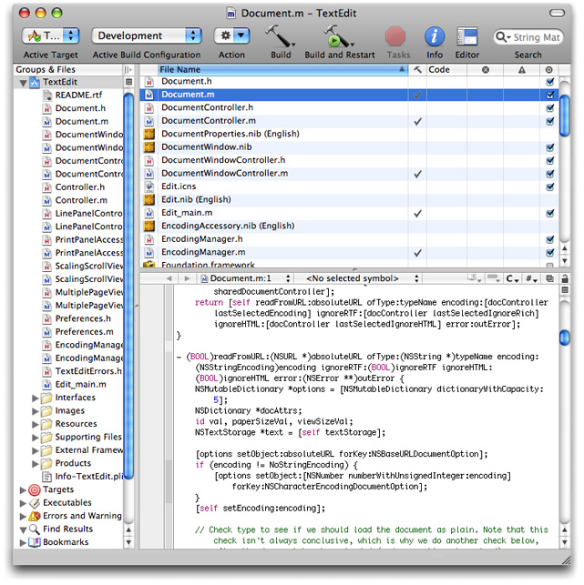

Xcode 特别适合 Cocoa 开发。创建项目时，Xcode 会根据与 Cocoa 项目类型（application、document-based application、Core Data application、tool、bundle、framework 等）相对应的项目模板，为你设置好初始的开发环境。在编译 Cocoa 软件方面，Xcode 提供了几种选择：

- GCC——GNU C 编译器（`gcc`）。
- LLVM-GCC——一种配置，其中 GCC 被用作 LLVM（Low Level Virtual Machine）编译器的前端。LLVM 提供了较快的优化速度和高质量的代码生成。

  这个选项只适用于针对 OS X v10.6 及以后版本构建的项目。
- Clang——一个专为 LLVM 编译器设计的前端。Clang 提供了较快的编译速度和出色的诊断信息。

  这个选项只适用于针对 OS X v10.6 及以后版本构建的项目。

关于这些编译器选项的详情，参见 _[Xcode Build System Guide](../../Developer%20Tools/Xcode%20Build%20System%20Guide/Introduction.md#apple-f4xwc4dqnrsv64tfmyxwi33df52wszbpkridimbqga3dsmbu)_。

在软件调试方面，Xcode 提供了 GNU 源码级调试器（`gdb`）和 Clang Static Analyzer。Clang Static Analyzer 由一个用于源代码分析的框架，以及一个用于查找 C 和 Objective-C 程序中错误的独立工具组成。详情参见 [http://clang-analyzer.llvm.org/](http://clang-analyzer.llvm.org/)。

Xcode 与另一个主要开发应用程序 Interface Builder 高度集成。详情参见 Interface Builder。

Cocoa 项目的第二个主要开发应用程序是 Interface Builder。顾名思义，Interface Builder 是一个用于创建用户界面的图形化工具。Interface Builder 几乎从 Cocoa 以 NeXTSTEP 之名诞生起就一直存在。毫不意外，它与 Cocoa 的集成堪称天衣无缝。

Interface Builder 围绕四个主要的设计元素展开：

- _Nib 文件_。一个 nib 文件是一个文件包装器（一个不透明的目录），以归档形式包含出现在用户界面上的各个对象。本质上，这份归档是一个对象图，其中包含关于每个对象的信息（包括其大小和位置）、对象之间连接的信息，以及自定义类的代理引用信息。当你在 Interface Builder 中创建并保存一个用户界面时，重建该界面所需的全部信息都会存储在这个 nib 文件中。

  Nib 文件提供了一种便于本地化用户界面的方式。Interface Builder 会把 nib 文件存储在 Cocoa 项目内的一个本地化目录中；当该项目被构建时，nib 文件会被复制到所创建 bundle 中对应的本地化目录里。

  Interface Builder 会在一个 nib 文档窗口（也称为 _nib 文件窗口_）中展示 nib 文件的内容。nib 文档窗口让你可以访问 nib 文件中重要的对象，尤其是窗口、菜单等在其对象图中没有父对象的顶层对象，以及控制器对象。（控制器对象在用户界面对象和表示应用程序数据的模型对象之间起中介作用；它们还为应用程序提供整体管理。）

  图 1-4 展示了一个在 Interface Builder 中打开、并显示在 nib 文档窗口中的 nib 文件，以及一些辅助窗口。

  __图 1-4__  Interface Builder 中的 TextEdit Document Properties 窗口

  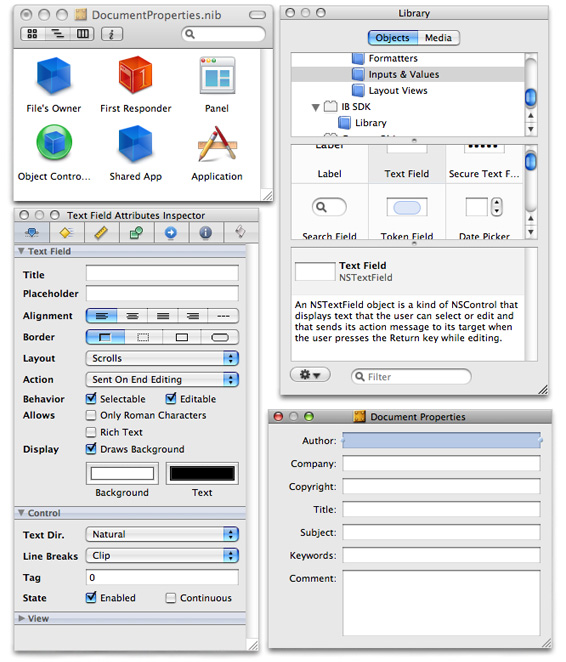
- _对象库（Object library）_。Interface Builder 的 Library 窗口包含了可以放置到用户界面上的对象。它们的范围从典型的 UI 对象（例如窗口、控件、菜单、文本视图和大纲视图）到控制器对象、自定义视图对象，以及特定于某个框架的对象（例如 Image Kit 的浏览器视图）。Library 会按类别对对象进行分组，让你可以浏览它们并搜索特定的对象。当一个对象从 Library 被拖到界面上时，Interface Builder 会实例化该对象的一个默认实例。你可以使用 inspector 来调整该对象的大小、进行配置，并将其与其他对象连接起来。
- _Inspector_。Interface Builder 有一个 inspector，这是一个用于配置用户界面对象的窗口。inspector 有若干个可选的面板，用于设置对象的初始运行时配置（不过大小和某些属性也可以通过直接操作来设置）。图 1-4 中的 inspector 展示了一个文本字段的主要属性；注意面板中不同的可折叠区域揭示了继承层级中各个级别（文本字段、控件和视图）的属性。除了主要属性和大小之外，inspector 还提供了用于设置动画效果、事件处理程序，以及对象之间目标-动作（target-action）连接的面板；对于 OS X 项目中的 nib 文件，还有针对 AppleScript 和 bindings 的额外面板。
- __Connections 面板__。connections 面板是一个上下文相关的显示界面，展示所选对象当前的 outlet 和 action 连接，并让你管理这些连接。要显示 connections 面板，按住 Control 键点击目标对象即可。图 1-5 展示了 connections 面板的样子。

  __图 1-5__  Interface Builder 的 connections 面板

  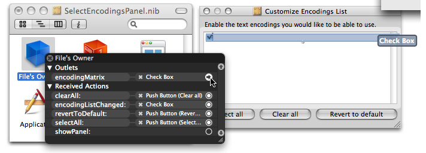

当被定位的对象被移动或调整大小时，Interface Builder 会短暂显示蓝色线条，以表明该对象是否符合 Aqua human interface guidelines。这种符合性包括推荐的大小、对齐方式，以及相对于用户界面上其他对象及窗口边界的位置。

Interface Builder 与 Xcode 紧密集成。它"知道"你自定义类的 outlet、action 以及可绑定属性。当你添加、移除或修改这些内容时，Interface Builder 会检测到这些变化，并更新其对它们的呈现。

对于 iOS 项目，你可以选择 iOS Simulator 作为项目的平台 SDK。当你构建并运行项目时，Xcode 会运行 Simulator，它会以应用程序在设备（iPhone 或 iPad）上呈现的样子来展示你的应用程序，并允许你操作用户界面的各个部分。在把应用程序加载到设备上之前，你可以用 Simulator 来帮助调试应用程序。

你应当始终在设备上完成调试的最后阶段。Simulator 并不能完美地模拟设备。例如，你必须用鼠标指针来代替手指触摸，因此需要多根手指才能完成的界面操作是无法实现的。此外，Simulator 并未使用 iOS 专用版本的 OpenGL 框架，而是使用 OS X 版本的 Foundation、Core Foundation 和 CFNetwork 框架，以及 OS X 版本的 libSystem。

更重要的是，你不应假设应用程序在 Simulator 上的性能表现与在设备上的表现相同。Simulator 本质上是把你的 iOS 应用程序当作一个"客居的（guest）"Mac 应用来运行。因此，它拥有一个 4 GB 的内存分区，并且运行在一个比设备上更强大的处理器上，还有可用的交换空间。

虽然 Xcode 和 Interface Builder 是你开发 Cocoa 应用程序时使用的主要工具，但还有几十种其他工具可供你使用。其中许多都是性能相关的应用程序。

Instruments 是在 Xcode 3.0 中引入的一个应用程序，它让你可以同时运行多个性能测试工具，并以基于时间线的图形化方式查看结果。它可以以图表的形式（单独或以不同组合方式）随时间展示 CPU 使用率、磁盘读写、内存统计信息、线程活动、垃圾回收、网络统计信息、目录和文件使用情况，以及其他各种测量数据。这种同时呈现多项测量数据的方式，有助于你发现被测量对象之间的相互关系。它还会显示图表背后的具体数据。

__图 1-6__  Instruments 应用程序

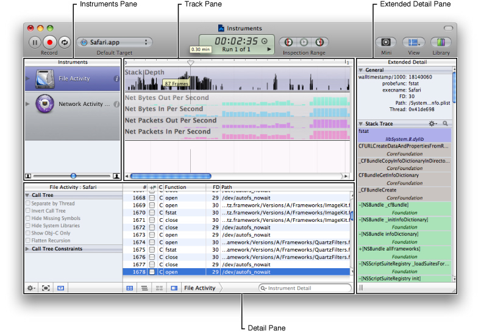

Shark 是一个性能分析应用程序，它为你程序的执行过程创建基于时间的性能剖析；在给定的时间段内，它会跟踪函数调用并绘制内存分配的图表。你可以用 Shark 来跟踪单个程序或整个系统（在 OS X 中包括驱动程序和内核扩展等内核组件）的信息。Shark 还会监控文件系统调用、跟踪系统调用和内存分配、对你的代码执行静态分析，并收集关于缓存未命中、缺页错误以及其他系统指标的信息。Shark 支持分析用 C、Objective-C、C++ 及其他语言编写的代码。

有许多应用程序被用来测量和分析 OS X 程序性能的各个方面。这些应用程序位于 `<Xcode>/Applications/Performance Tools` 中。

- __BigTop__ 以图表形式展示性能趋势随时间的变化，实时显示内存使用情况、缺页错误、CPU 使用率等数据。
- __Spin Control__ 会自动对无响应的应用程序进行采样。你可以让 Spin Control 在后台一直运行，同时启动和测试你的应用程序。如果应用程序变得无响应，以至于出现旋转光标，Spin Control 会自动对你的应用程序进行采样，以收集应用程序在那段时间里究竟在做什么的信息。
- _MallocDebug_ 展示你程序中当前所有已分配的内存块，并按分配时的调用栈进行组织。你可以一目了然地看到应用程序消耗了多少已分配内存、这些内存是从哪里分配的，以及哪些函数分配了大量内存。MallocDebug 还可以找出程序中其他地方不再引用的已分配内存，从而帮助你发现内存泄漏，并准确追踪该内存是在何处分配的。
- _QuartzDebug_ 是一个帮助你调试应用程序自身显示方式的工具。它对那些进行大量绘制和图像处理的应用程序尤其有用。QuartzDebug 提供了若干调试选项，包括：

  - 自动刷新绘制，即在每次绘制操作后刷新图形上下文的内容
  - 一种在屏幕区域即将更新之前把它们涂成黄色的模式
  - 一个对整个系统范围的窗口列表进行静态快照的选项，展示每个窗口的所有者以及每个窗口消耗的内存量

进行性能分析时，你还可以使用以下命令行工具：

- `top`，展示对当前运行进程周期性采样得到的一组统计信息
- `gprof`，生成一个程序的执行剖析
- `fs_usage`，显示文件系统访问的统计信息

还有许多其他用于性能分析及其他开发任务的命令行工具可供使用。其中一些位于 `/usr/bin` 和 `/usr/sbin` 中，一些 Apple 开发的命令行工具安装在 `<Xcode>/Tools` 中。对于其中许多工具，你可以查阅它们的 manual page 了解使用方法。（要这样做，可以在 Xcode 中选择 Help > Open man page，或者在 Terminal shell 中输入 `man` 加上工具名称。）

是什么让一个程序成为 Cocoa 程序？其实不完全是语言，因为在 Cocoa 开发中可以使用多种语言。也不是开发工具，因为你完全可以从命令行创建一个 Cocoa 应用程序（尽管那会是一项复杂而费时的任务）。真正的答案是：所有 Cocoa 程序的共同之处——也是它们与众不同的地方——在于它们都由最终继承自根类 `NSObject` 的对象组成，并最终建立在 Objective-C 运行时之上。这一点对所有 Cocoa 框架同样成立。

在任何一个系统上都存在许多 Cocoa 框架，而且 Apple 和第三方厂商也在不断发布更多框架。尽管 Cocoa 框架数量众多，但在每个平台上，都有两个框架格外突出，是核心框架：

- 在 OS X 中：Foundation 和 AppKit
- 在 iOS 中：Foundation 和 UIKit

Foundation、AppKit 和 UIKit 框架对 Cocoa 应用程序开发而言不可或缺，其余所有框架都是次要的、可选的。除非你链接（并使用其类）AppKit，否则你无法为 OS X 开发 Cocoa 应用程序；除非你链接（并使用其类）UIKit，否则你无法为 iOS 开发 Cocoa 应用程序。此外，除非你链接并使用 Foundation 框架的类，否则你无法开发任何类型的 Cocoa 软件。（在 OS X 中，当你链接 Cocoa 这个伞状框架时，正确的框架会被自动链接。）Foundation 和 AppKit 中的类、函数、数据类型和常量都带有"NS"前缀；UIKit 中的类、函数、数据类型和常量则带有"UI"前缀。

Cocoa 框架为你处理了许多底层任务。例如，那些存储和操作整数与浮点数值的类，会自动为你处理这些值的字节序（endianness）。

以下各节将概述这三个核心 Cocoa 框架的特性和类，并简要介绍一些次要框架。由于每个核心框架都有数十个类，对核心框架的描述会按功能对类进行分类。虽然这些分类有很强的逻辑依据，但也完全可以用其他方式对这些类进行分组。

Foundation 框架定义了一个可用于任何类型 Cocoa 程序的基础类层。区分 Foundation 中的类和 AppKit 中的类的标准是用户界面。如果一个对象既不出现在用户界面中，也不是_专门_用来支持用户界面的，那么它所属的类就属于 Foundation。你可以创建只使用 Foundation、不使用任何其他框架的 Cocoa 程序；命令行工具和 Internet 服务器就是这类程序的例子。

Foundation 框架的设计秉持了以下几个目标：

- 定义基本的对象行为，并为内存管理、对象可变性、通知等方面引入一致的约定。
- 通过（除其他手段外的）bundle 技术和 Unicode 字符串支持国际化和本地化。
- 支持对象持久化。
- 支持对象分发。
- 提供一定程度的操作系统独立性，以支持可移植性。
- 为数值、字符串、集合等编程原始类型提供对象包装器或等价物。它还提供了用于访问底层系统实体和服务（如端口、线程和文件系统）的实用工具类。

按照定义，Cocoa 应用程序要么链接 AppKit 框架，要么链接 UIKit 框架，但无论如何都必须同时链接 Foundation 框架。这些类层次结构共享同一个根类 `NSObject`，而且 AppKit 和 UIKit 中的许多（即使不是大多数）方法和函数都以 Foundation 对象作为参数或返回值。有些 Foundation 类看起来像是专为应用程序设计的——例如 `NSUndoManager` 和 `NSUserDefaults`——但它们之所以被包含在 Foundation 中，是因为它们也可以用在不涉及用户界面的场合。

Foundation 为 Cocoa 编程引入了若干范式和策略，以确保程序中的对象在特定情形下具有一致的行为和可预期性：

- _对象保留与对象释放_。Objective-C 运行时和 Foundation 为 Cocoa 程序提供了两种方式，来确保对象在需要时得以留存、在不再需要时被释放。垃圾回收（garbage collection）在 Objective-C 2.0 中被引入，会自动跟踪并释放程序不再需要的对象，从而释放内存。Foundation 也仍然提供传统的内存管理方式。它建立了一套对象所有权（ownership）策略，规定对象要负责释放它所创建、复制或显式保留（retain）的其他对象。`NSObject`（类和协议）定义了用于保留和释放对象的方法。自动释放池（在 `NSAutoreleasePool` 类中定义）实现了一种延迟释放机制，使 Cocoa 程序在返回调用方不负责管理的对象时能有一套一致的约定。关于垃圾回收和显式内存管理的更多内容，参见 [对象的保留与释放](Cocoa%20Objects.md#apple-f4xwc4dqnrsv64tfmyxwi33df52wszbpkridimbqgazdsnzufvbuqnbnknltgoi)。
- _可变类变体_。Foundation 中许多值类和容器类都有一个不可变类对应的可变变体，且可变类始终是不可变类的子类。如果你需要动态更改这类对象所封装的值或成员，就创建该可变类的一个实例。由于它继承自不可变类，你可以把这个可变实例传给那些接受不可变类型的方法。关于对象可变性的更多内容，参见 [对象可变性](Cocoa%20Objects.md#apple-f4xwc4dqnrsv64tfmyxwi33df52wszbpkridimbqgazdsnzufvbuqnbnknltgmy)。
- _类簇（Class clusters）_。类簇是一个抽象类，加上一组该抽象类作为伞状接口的私有具体子类。根据上下文（尤其是你用来创建对象的方法），系统会返回给你一个经过适当优化的类的实例。例如，`NSString` 和 `NSMutableString` 就充当着为不同存储需求优化的各种私有子类实例的代理。多年来，这组具体类已经变化过好几次，但都没有破坏应用程序的兼容性。关于类簇的更多内容，参见 [类簇](Cocoa%20Objects.md#apple-f4xwc4dqnrsv64tfmyxwi33df52wszbpkridimbqgazdsnzufvbuqnbnknltgna)。
- _通知（Notifications）_。通知是 Cocoa 中一个重要的设计模式。它基于一种广播机制，使对象（称为_观察者_）能够随时了解另一个对象正在做什么，或正在遇到哪些用户或系统事件。发出通知的对象可以不知道通知观察者的存在或身份。通知有多种类型：同步的、异步的和分布式的。Foundation 的通知机制由 `NSNotification`、`NSNotificationCenter`、`NSNotificationQueue` 和 `NSDistributedNotificationCenter` 类实现。关于通知的更多内容，参见 [通知](Communicating%20with%20Objects.md#apple-f4xwc4dqnrsv64tfmyxwi33df52wszbpkridimbqgazdsnzufvbuqnznknlto)。

Foundation 的类层次结构以 `NSObject` 类为根，该类（连同 `NSObject` 和 `NSCopying` 协议）定义了对象的基本属性和行为。关于 `NSObject` 和基本对象行为的更多信息，参见 [根类](Cocoa%20Objects.md#apple-f4xwc4dqnrsv64tfmyxwi33df52wszbpkridimbqgazdsnzufvbuqnbnknltgni)。

Foundation 框架剩余的部分由若干相关的类分组以及少数几个独立的类组成。其中有代表基本数据类型（如字符串和字节数组）的类、用于存储其他对象的集合类、代表系统信息（如日期）的类，以及代表系统实体（如端口、线程和进程）的类。图 1-7 中的类层次结构图表（出于印刷需要分为三部分）描绘了这些类构成的逻辑分组，以及它们之间的继承关系。蓝色阴影区域中的类同时存在于 Foundation 的 OS X 版本和 iOS 版本中；灰色阴影区域中的类只存在于 OS X 版本中。

__图 1-7__  Foundation 的类层次结构

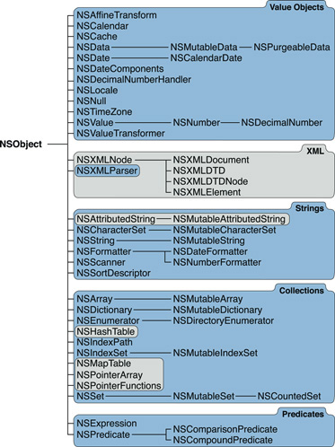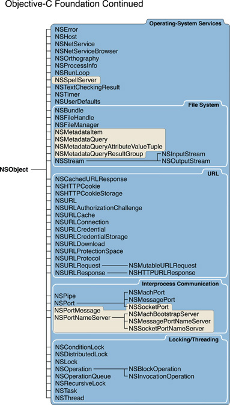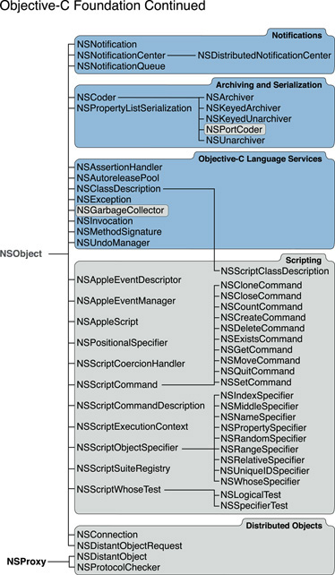

这些图表按类别对 Foundation 框架的类进行了逻辑分组（并指出了其他关联关系）。其中尤为重要的是那些实例为值对象和集合的类。

值对象封装了各种原始类型的值，包括字符串、数字（整数和浮点数值）、日期，甚至结构体和指针。它们负责协调对这些值的访问，并以合适的方式对其进行操作。当你比较两个相同类类型的值对象时，被比较的是它们所封装的值，而不是它们的指针值。值对象经常作为其他对象（包括自定义对象）的属性。

当然，你也可以选择在程序中直接使用标量和其他原始值——毕竟 Objective-C 是 ANSI C 的超集——在许多情况下直接使用标量是合理的做法。但在其他情形下，把这些值封装在对象中要么更有优势，要么是必需的。例如，因为值对象是对象，你可以在运行时得知它们的类类型、确定可以向它们发送的消息，并执行其他能对对象做的操作。数组和字典等集合对象的元素必须是对象。而且，Cocoa 框架中许多（即使不是大多数）接受和返回字符串、数字、日期等值的方法都要求这些值被封装在对象中。（对于字符串值，你尤其应该始终使用 `NSString` 对象，而不是 C 字符串。）

有些值对象类具有可变和不可变两种变体——例如 `NSMutableData` 和 `NSData` 类。不可变对象所封装的值一旦创建就不能被修改，而可变对象所封装的值则可以被修改。（[对象可变性](Cocoa%20Objects.md#apple-f4xwc4dqnrsv64tfmyxwi33df52wszbpkridimbqgazdsnzufvbuqnbnknltgmy) 详细讨论了可变和不可变对象。）

以下是对一些更重要的值对象所做工作的描述：

- `NSValue` 类的实例封装了单个 ANSI C 或 Objective-C 数据项——例如浮点数值这样的标量类型，以及指针和结构体
- `NSNumber` 类（`NSValue` 的子类）实例化包含数值（如整数、单精度浮点数和双精度浮点数）的对象。
- `NSData` 类的实例为字节流（例如图像数据）提供面向对象的存储。该类具有把数据对象写入文件系统以及读回它们的方法。
- `NSDate` 类，连同作为支持的 `NSTimeZone`、`NSCalendar`、`NSDateComponents` 和 `NSLocale` 类，提供了表示时间、日期、日历和地区（locale）的对象。它们提供了计算日期与时间差、以多种格式显示日期和时间，以及根据世界上的位置调整时间和日期的方法。
- `NSString` 类的对象（通常称为_字符串_）是一种值对象，为一段 Unicode 字符序列提供面向对象的存储。`NSString` 的方法可以在字符串的不同表示形式之间转换，例如在 UTF-8 与特定编码下以 null 结尾的字节数组之间转换。`NSString` 还提供了用于搜索、拼接和比较字符串，以及操作文件系统路径的方法。与 `NSData` 类似，`NSString` 也包含把字符串写入文件系统以及读回它们的方法。

  `NSString` 类还有几个关联的类。你可以使用 `NSScanner` 这个工具类的实例，从一个 `NSString` 对象中解析出数字和单词。`NSCharacterSet` 表示各种 `NSString` 和 `NSScanner` 方法所使用的一组字符。属性字符串（attributed string）是 `NSAttributedString` 类的实例，管理带有字体、字距调整等关联属性的字符范围。

格式化器对象——即派生自 `NSFormatter` 及其子类的对象——本身并不是值对象，但它们承担着与值对象相关的一项重要功能。它们在值对象（如 `NSDate` 和 `NSNumber` 的实例）与特定字符串表示形式之间进行相互转换，这些字符串表示形式通常会呈现在用户界面中。

集合（collection）是以特定排序方式存储其他对象、供之后检索的对象。Foundation 定义了三个 iOS 和 OS X 上共有的主要集合类：`NSArray`、`NSDictionary` 和 `NSSet`。与许多值类一样，这些集合类也有不可变和可变两种变体。例如，一旦你创建了一个持有一定数量元素的 `NSArray` 对象，就不能再添加新元素或移除现有元素；为此你需要使用 `NSMutableArray` 类。（关于可变和不可变对象，参见 [对象可变性](Cocoa%20Objects.md#apple-f4xwc4dqnrsv64tfmyxwi33df52wszbpkridimbqgazdsnzufvbuqnbnknltgmy)。）

主要集合类的对象具有一些共同的行为特征和要求。它们所包含的项必须是对象，但对象可以是任何类型。集合对象和值对象一样，是属性列表的重要组成部分，并且和所有对象一样，可以被归档和分发。此外，集合对象会自动保留（retain）——即保持强引用（strong reference）——它所包含的任何对象。如果你从一个可变集合中移除一个对象，该对象就会被释放（release），如果没有其他对象再持有它，它就会被释放（free）。

集合类提供了访问其所包含特定对象的方法。此外，还有专门的枚举器对象（`NSEnumerator` 的实例）以及语言层面的支持，用于遍历集合并依次访问每个元素。

主要的集合类按其所使用的排序方式加以区分：

- 数组（`NSArray`）是有序集合，使用从零开始的索引来访问集合中的元素。
- 字典（`NSDictionary`）是管理键值对的集合；键是标识某个值的对象，而该值本身也是一个对象。由于这种键值方案，字典中的元素是无序的。在一个字典内，键必须是唯一的。虽然键通常是字符串对象，但它们可以是任何可以被复制（copy）的对象。
- 集合（`NSSet`）与数组类似，但它提供的是无序存储而非有序存储。换句话说，集合中元素的顺序并不重要。`NSSet` 对象中的项彼此必须是不同的；不过，`NSCountedSet` 类（`NSMutableSet` 的子类）的实例可以多次包含同一个对象。

在 OS X 中，Foundation 框架还包含若干额外的集合类。`NSMapTable` 是一个类似字典的可变集合类；但与 `NSDictionary` 不同的是，它既可以持有指针，也可以持有对象，并且它对所包含的对象维护的是弱引用（weak reference）而非强引用。`NSPointerArray` 是一个可以持有指针和 `NULL` 值的数组，并可以对它们维护强引用或弱引用。`NSHashTable` 类的设计模式仿照 `NSSet`，但它可以存储指向函数的指针，并提供了不同的选项，尤其是为了在垃圾回收环境中支持弱关系。

关于集合类和集合对象的更多内容，参见 _[集合编程主题](../Collections%20Programming%20Topics/About%20Collections.md#apple-f4xwc4dqnrsv64tfmyxwi33df52wszbpgeydambqgazti2i)_。

Foundation 框架的其余类分属不同的类别，如 [图 1-7](#apple-f4xwc4dqnrsv64tfmyxwi33df52wszbpkridimbqgazdsnzufvbuqmznknltcni) 中的图示所示。图 1-7 所示的这些主要类别在此加以描述：

- _操作系统服务_。许多 Foundation 类都便于访问操作系统的各种底层服务，同时使你免受操作系统特有细节的干扰。例如，`NSProcessInfo` 让你可以查询应用程序运行所在的环境，`NSHost` 则给出网络上主机系统的名称和地址。你可以使用 `NSTimer` 对象按特定的时间间隔向另一个对象发送消息，`NSRunLoop` 则让你能够管理某个应用程序或其他类型程序的输入源。`NSUserDefaults` 为一个存储全局（每台主机）和每用户默认值（偏好设置）的系统数据库提供了编程接口。

  - _文件系统和 URL_。`NSFileManager` 为创建、重命名、删除和移动文件等文件操作提供了一致的接口。`NSFileHandle` 允许在更底层进行文件操作（例如在文件内查找）。`NSBundle` 用于查找存储在 bundle 中的资源，并可以动态加载其中一些资源（例如 nib 文件和代码）。你可以使用 `NSURL` 及相关的 `NSURL...` 类来表示、访问和管理 URL 形式的数据源。
  - _并发_。`NSThread` 让你可以创建多线程程序，各种锁类则提供了控制多个竞争线程访问进程资源的机制。你可以使用 `NSOperation` 和 `NSOperationQueue`，按优先级和依赖顺序执行多个（并发或非并发的）操作。借助 `NSTask`，你的程序可以派生（fork）出一个子进程来执行工作并监控其进度。
  - _进程间通信_。这一类中的大多数类代表各种系统端口、socket 和名称服务器，可用于实现底层 IPC。`NSPipe` 表示一个 BSD 管道，是进程之间单向的通信通道。
  - _网络_。`NSNetService` 和 `NSNetServiceBrowser` 类支持一种称为 _Bonjour_ 的零配置网络架构。Bonjour 是一个功能强大的系统，用于在 IP 网络上发布和浏览服务。
- _通知_。关于通知类的概述，参见 [Foundation 的范式和策略](#apple-f4xwc4dqnrsv64tfmyxwi33df52wszbpkridimbqgazdsnzufvbuqmznknlto)。
- _归档与序列化_。这一类中的类使得对象的分发和持久化成为可能。`NSCoder` 及其子类，连同 `NSCoding` 协议，通过允许类信息与数据一起存储，以一种与体系结构无关的方式表示对象所包含的数据。`NSKeyedArchiver` 和 `NSKeyedUnarchiver` 提供了对对象和标量值进行编码，以及以不依赖编码消息顺序的方式进行解码的方法。
- _Objective-C 语言服务_。`NSException` 和 `NSAssertionHandler` 为代码中的断言和异常处理提供了面向对象的方式。`NSInvocation` 对象是一个 Objective-C 消息的静态表示，你的程序可以存储它，并在之后用它向另一个对象发起一次消息调用；撤销管理器（`NSUndoManager`）和分布式对象系统都会用到它。`NSMethodSignature` 对象记录了一个方法的类型信息，用于消息转发。`NSClassDescription` 是一个用于定义和查询某个类的关系与属性的抽象类。
- __XML 处理__。两个平台上的 Foundation 都有 `NSXMLParser` 类，它是流式解析器的一种面向对象实现，使你能够以事件驱动的方式处理 XML 数据。

  OS X 中的 Foundation 还包含 NSXML 系列的类（之所以这样称呼，是因为这些类名都以"NSXML"开头）。这些类的对象把一个 XML 文档表示为一个层级树结构。这种方式让你可以查询这个结构并操作它的节点。NSXML 系列的类支持多种与 XML 相关的技术和标准，例如 XQuery、XPath、XInclude、XSLT、DTD 和 XHTML。
- _谓词与表达式_。谓词类——`NSPredicate`、`NSCompoundPredicate` 和 `NSComparisonPredicate`——封装了用于约束某个获取请求或过滤对象的逻辑条件。`NSExpression` 对象表示谓词中的表达式。

iOS 版本的 Foundation 框架是 OS X 版本类的一个子集。以下几类类只存在于 OS X 版本的 Foundation 中：

- _Spotlight 查询_。`NSMetadataItem`、`NSMetadataQuery` 及相关查询类封装了文件系统元数据，使得查询该元数据成为可能。
- _可脚本化_。这一类中的类有助于让你的程序响应 AppleScript 脚本和 Apple 事件命令。
- _分布式对象_。你可以使用分布式对象类，在同一台计算机上的多个进程之间，或网络上不同计算机上的进程之间进行通信。其中两个类，`NSDistantObject` 和 `NSProtocolChecker`，其根类（`NSProxy`）与 Cocoa 其余部分的根类不同。

AppKit 是一个框架，包含了在 OS X 中实现图形化、事件驱动用户界面所需的全部对象：窗口、对话框、按钮、菜单、滚动条、文本字段——不胜枚举。AppKit 为你处理了所有细节，高效地在屏幕上绘制、与硬件设备和屏幕缓冲区通信、在绘制前清除屏幕区域，并对视图进行裁剪。AppKit 中的类的数量乍一看可能令人生畏。然而，AppKit 中的大多数类都是你会间接使用的支持类。你在使用 AppKit 时也可以选择不同的层级：

- 使用 Interface Builder 建立从用户界面对象到应用程序控制器对象的连接，这些控制器对象负责管理用户界面，并协调用户界面与内部数据结构之间的数据流动。为此，你可以使用现成的控制器对象（用于 Cocoa bindings），也可能需要实现一个或多个自定义控制器类——尤其是这些类的 action 方法和委托方法。例如，你需要实现一个在用户选择某个菜单项时被调用的方法（除非已有一个可接受的默认实现）。
- 以编程方式控制用户界面，这需要你更熟悉 AppKit 的类和协议。例如，要允许用户把一个图标从一个窗口拖到另一个窗口，就需要一些编程工作，并熟悉 `NSDragging...` 系列协议。
- 通过派生 `NSView` 或其他类的子类来实现你自己的对象。在派生 `NSView` 的子类时，你需要使用图形函数编写自己的绘制方法。派生子类需要你对 AppKit 的工作方式有更深入的理解。

AppKit 框架由 125 多个类和协议组成。所有类最终都继承自 Foundation 框架的 `NSObject` 类。图 1-8 中的图示展示了 AppKit 各个类之间的继承关系。

__图 1-8__  AppKit 的类层次结构——Objective-C

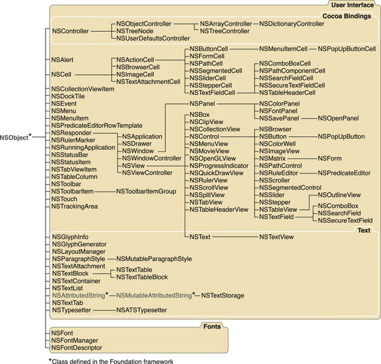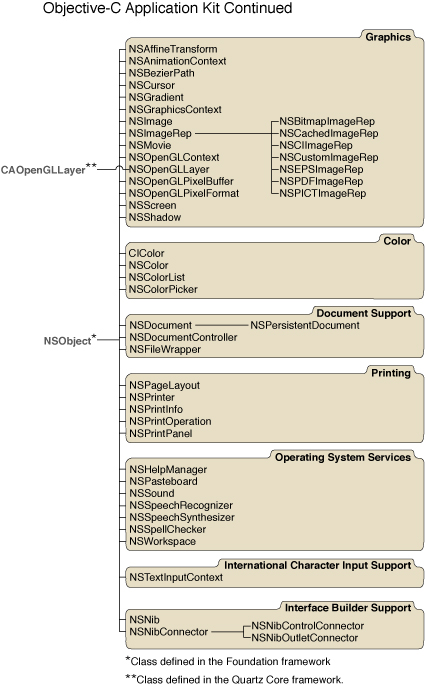

可以看到，AppKit 的层次结构树宽而相对较浅；层次结构中最深的类距离根类也仅有五层超类，而大多数类离根类还要更近。这棵层次结构树中的一些主要分支尤为值得关注。

AppKit 中最大分支的根部是 `NSResponder` 类。这个类定义了响应者链（responder chain），即一个响应用户事件的对象的有序列表。当用户点击鼠标按钮或按下某个键时，会生成一个事件，并沿着响应者链向上传递，寻找一个能够响应它的对象。任何处理事件的对象都必须继承自 `NSResponder` 类。AppKit 的核心类——`NSApplication`、`NSWindow` 和 `NSView`——都继承自 `NSResponder`。

AppKit 中第二大的类分支派生自 `NSCell`。这组类值得注意的一点是，它们大致对应着继承自 `NSControl`（而 `NSControl` 又继承自 `NSView`）的那些类。对于响应用户操作的用户界面对象，AppKit 采用了一种把工作分配给 control 对象和 cell 对象的架构。`NSControl` 和 `NSCell` 类及其子类定义了一组常见的用户界面对象，例如按钮、滑块和浏览器，用户可以通过图形化操作来控制应用程序的某个方面。大多数 control 对象都关联着一个或多个负责实现绘制和事件处理细节的 cell 对象。例如，一个按钮同时由一个 `NSButton` 对象和一个 `NSButtonCell` 对象组成。

Control 和 cell 实现了一种基于 AppKit 一项重要设计模式的机制：目标-动作（target-action）机制。一个 cell 可以持有信息，用来标识当用户点击（或以其他方式操作）该 cell 时应当发送给特定对象的消息。当用户操作某个 control（例如点击它）时，该 control 会从其 cell 中提取所需信息，并向目标对象发送一条 action 消息。目标-动作机制让你可以通过指定目标对象和被调用的方法，赋予某个用户操作以意义。你通常会使用 Interface Builder，通过按住 Control 键从 control 对象拖到你的应用程序或其他对象来设置这些目标和动作。你也可以用编程方式设置目标和动作。

AppKit（以及 UIKit）另一个重要的、基于设计模式的机制是委托（delegation）。用户界面中的许多对象，例如文本字段和表格视图，都定义了一个委托。委托是一个代表委托对象行事、或与之协调行事的对象。因此它能够为用户界面的运作赋予特定于应用程序的逻辑。关于委托、目标-动作以及 AppKit 其他范式和机制的更多内容，参见 [与对象通信](Communicating%20with%20Objects.md#apple-f4xwc4dqnrsv64tfmyxwi33df52wszbpkridimbqgazdsnzufvbuqnznknltcni)。关于这些范式和机制所基于的设计模式的讨论，参见 [Cocoa 设计模式](Cocoa%20Design%20Patterns.md#apple-f4xwc4dqnrsv64tfmyxwi33df52wszbpkridimbqgazdsnzufvbuqnrnknltm)。

OS X v10.5 及更高版本系统的一项通用特性是分辨率无关性（resolution independence）：屏幕的分辨率与代码所做的绘制是解耦的。系统会自动缩放在屏幕上渲染的内容。AppKit 的类在其用户界面对象中支持分辨率无关性。不过，要让你自己的应用程序利用分辨率无关性，你可能需要提供更高分辨率的图像，或者对绘制代码做一些考虑当前缩放系数的小调整。

以下各节将简要描述 AppKit 框架及其类和协议的一些能力和架构方面的内容。它按照 [图 1-8](#apple-f4xwc4dqnrsv64tfmyxwi33df52wszbpkridimbqgazdsnzufvbuqmznknltc) 所示的类层次结构图对类进行分组。

对于用户界面的整体运作，AppKit 提供了以下类：

- _全局应用程序对象_。每个应用程序都使用一个 `NSApplication` 单例来控制主事件循环、跟踪应用程序的窗口和菜单、把事件分发给合适的对象（即它自身或它的某个窗口）、设置顶层的自动释放池，并接收应用程序级别事件的通知。一个 `NSApplication` 对象有一个委托（由你指定的对象），会在应用程序启动或终止、被隐藏或被激活、应当打开用户选中的某个文件等情形下收到通知。通过设置 `NSApplication` 对象的委托并实现委托方法，你无需派生 `NSApplication` 的子类，就可以自定义应用程序的行为。
- _窗口和视图_。窗口类和视图类，即 `NSWindow` 和 `NSView`，也继承自 `NSResponder`，因此被设计为能够响应用户操作。一个 `NSApplication` 对象维护着一份 `NSWindow` 对象的列表——应用程序所属的每个窗口对应一个——而每个 `NSWindow` 对象维护着一个 `NSView` 对象的层次结构。视图层次结构用于处理窗口内的绘制和事件。一个 `NSWindow` 对象负责处理窗口级别的事件，把其他事件分发给它的各个视图，并为这些视图提供绘制区域。`NSWindow` 对象同样有一个委托，让你可以自定义它的行为。

  从 OS X v10.5 开始，AppKit 的窗口类和视图类支持增强的动画特性。

  `NSView` 是窗口中显示的所有对象的超类。所有子类都使用图形函数实现一个绘制方法；`drawRect:` 是你在创建一个新的 `NSView` 时要重写的主要方法。
- _用于 Cocoa bindings 的控制器类_。抽象类 `NSController` 及其具体子类 `NSObjectController`、`NSArrayController`、`NSDictionaryController` 和 `NSTreeController` 是 Cocoa bindings 实现的一部分。这项技术自动同步存储在对象中的应用程序数据，与该数据在用户界面中的呈现。关于这几类控制器对象的描述，参见 [Model-View-Controller 设计模式](Cocoa%20Design%20Patterns.md#apple-f4xwc4dqnrsv64tfmyxwi33df52wszbpkridimbqgazdsnzufvbuqnrnknltc)。
- _面板（对话框）_。`NSPanel` 类是 `NSWindow` 的子类，用于显示临时的、全局的或紧急的信息。例如，你会使用 `NSPanel` 的实例而非 `NSWindow` 的实例来显示错误消息，或就一些值得注意的异常情形向用户征求回应。AppKit 为你实现了一些常见的对话框，例如用于保存、打开和打印文档的 Save、Open 和 Print 对话框。使用这些对话框，能让用户在不同应用程序中对常见操作获得一致的观感。
- _菜单和光标_。`NSMenu`、`NSMenuItem` 和 `NSCursor` 类定义了应用程序展示给用户的菜单和光标的外观与行为。
- _分组视图和滚动视图_。`NSBox`、`NSScrollView` 和 `NSSplitView` 类为窗口中的其他视图对象或视图集合提供图形化的"附属物"。借助 `NSBox` 类，你可以在窗口中把若干元素分组，并在整个组周围绘制边框。`NSSplitView` 类让你可以纵向或横向地并排放置多个视图，为每个视图分配一部分共同区域；一个可滑动的控制条让用户能够在各视图之间重新分配这些区域。`NSScrollView` 类及其辅助类 `NSClipView` 提供了滚动机制，以及让用户发起和控制滚动的图形对象。`NSRulerView` 类让你可以为一个滚动视图添加标尺和标记。
- _表格视图和大纲视图_。`NSTableView` 类以行和列的形式显示数据。`NSTableView` 非常适合（但不限于）显示数据库记录，其中每一行对应一条记录，每一列包含记录的某个属性。用户可以编辑单个单元格并重新排列各列。你可以通过设置 `NSTableView` 对象的委托和数据源对象来控制其行为和内容。大纲视图（`NSOutlineView` 的实例，它是 `NSTableView` 的子类）提供了另一种显示表格数据的方式。使用 `NSBrowser` 类，你可以创建一个让用户能够显示和浏览层级数据的对象。

Cocoa 的文本系统基于 Core Text 框架，该框架在 OS X v10.5 中引入。Core Text 框架为文本布局提供了一种现代、底层、高性能的技术。如果你使用的是 Cocoa 的文本系统，通常很少有理由需要直接使用 Core Text。

`NSTextField` 类实现了一个简单的可编辑文本输入字段，而 `NSTextView` 类为较大篇幅的文本提供了更全面的编辑功能。

`NSTextView` 是抽象类 `NSText` 的子类，定义了扩展文本系统的接口。`NSTextView` 支持富文本、附件（图形、文件及其他）、输入管理和按键绑定，以及标记文本属性（marked text attributes）。`NSTextView` 能与 Fonts 窗口和 Font 菜单、标尺和段落样式、Services 功能，以及 pasteboard（剪贴板）协同工作。`NSTextView` 还允许通过委托和通知进行定制——你很少需要派生 `NSTextView` 的子类。你也很少需要以编程方式创建 `NSTextView` 的实例，因为 Interface Builder 库中的对象，例如 `NSTextField`、`NSForm` 和 `NSScrollView`，本身就已经包含了 `NSTextView` 对象。

使用 `NSTextStorage`、`NSLayoutManager`、`NSTextContainer` 及相关类，还可以进行更强大、更具创造性的文本操作（例如让文本沿圆形排列显示）。Cocoa 的文本系统还支持列表、表格以及非连续的选区。

`NSFont` 和 `NSFontManager` 类封装并管理字体家族、大小和变体。`NSFont` 类为每一种不同的字体定义一个对象；出于效率考虑，这些可能承载大量数据的对象会被应用程序中的所有对象共享。`NSFontPanel` 类定义了呈现给用户的 Fonts 窗口。

`NSImage` 和 `NSImageRep` 类封装了图形数据，让你能够轻松高效地访问存储在磁盘文件中并显示在屏幕上的图像。每个 `NSImageRep` 子类都知道如何从某种特定类型的源数据中绘制图像。`NSImage` 类为同一张图像提供多种表示形式，还提供缓存等行为。Cocoa 的图像处理和绘制能力与 Core Image 框架集成在一起。

颜色由 `NSColor`、`NSColorSpace`、`NSColorPanel`、`NSColorList`、`NSColorPicker` 和 `NSColorWell` 类支持。`NSColor` 和 `NSColorSpace` 支持丰富的颜色格式和表示形式，包括自定义的格式。其他几个类大多是界面类：它们定义并呈现让用户能够选择和应用颜色的面板和视图。例如，用户可以把颜色从 Colors 窗口拖到任意一个颜色框（color well）中。

`NSGraphicsContext`、`NSBezierPath` 和 `NSAffineTransform` 类帮助你进行矢量绘制，并支持缩放、旋转和平移等图形变换。

`NSPrinter`、`NSPrintPanel`、`NSPageLayout` 和 `NSPrintInfo` 类协同工作，为打印和传真你的应用程序在其窗口和视图中显示的信息提供了手段。你也可以为一个 `NSView` 对象创建 PDF 表示形式。

你可以使用 `NSFileWrapper` 类来创建对应磁盘上文件或目录的对象。`NSFileWrapper` 把文件内容保存在内存中，以便对其进行显示、更改，或传输给另一个应用程序。它还提供了用于拖动该文件或将其表示为附件的图标。你可以使用 Foundation 框架中的 `NSFileManager` 类来访问和枚举文件及目录内容。`NSOpenPanel` 和 `NSSavePanel` 类也为文件系统提供了便捷、熟悉的用户界面。

`NSDocumentController`、`NSDocument` 和 `NSWindowController` 类定义了一套用于创建基于文档的应用程序的架构。（`NSWindowController` 类在类层次结构图表中显示在 User Interface 这一组类里。）这类应用程序可以生成相同的窗口容器，每个容器持有一组可存储在文件中的、独特组合的数据。它们内置或可以轻松获得保存、打开、还原、关闭和管理这些文档的能力。

如果一个应用程序要在世界上不止一个地区使用，它的资源可能需要针对语言、国家或文化区域进行定制，即本地化。例如，一个应用程序可能需要有各自独立的日语、英语、法语和德语版本的字符串、图标、nib 文件或上下文帮助。特定于某种语言的资源文件被归组在 bundle 目录下的一个子目录中（即带有 `.lproj` 扩展名的目录）。你通常会使用 Interface Builder 来配置本地化资源文件。关于 Cocoa 国际化设施的更多信息，参见 _[国际化与本地化指南](../../Mac%20OSX/Internationalization%20and%20Localization%20Guide/About%20Internationalization%20and%20Localization.md#apple-f4xwc4dqnrsv64tfmyxwi33df52wszbpgeydambqge3tc2i)_。

`NSInputServer` 和 `NSInputManager` 类，连同 `NSTextInput` 协议，让你的应用程序能够访问文本输入管理系统。该系统负责解释各种国际化键盘产生的按键，并把相应的文本字符或 Control 键事件传递给文本视图对象。（通常这些类会由文本相关的类负责处理，你并不需要亲自处理。）

AppKit 通过实现以下特性的类，为你的应用程序提供操作系统层面的支持：

- _与其他应用程序共享数据_。`NSPasteboard` 类定义了 pasteboard，一个存放从你的应用程序中复制出的数据的仓库，使这些数据可以被任何愿意使用它的应用程序访问。`NSPasteboard` 实现了大家熟悉的剪切/复制并粘贴操作。
- _拖放_。只需你做很少的编程工作，自定义的视图对象就可以在任何地方被拖放。对象通过遵循 `NSDragging...` 系列协议成为这一拖放机制的一部分；可被拖动的对象遵循 `NSDraggingSource` 协议，而目标对象（拖放的接收方）遵循 `NSDraggingDestination` 协议。AppKit 隐藏了跟踪光标以及显示被拖动图像的全部细节。
- _拼写检查_。`NSSpellServer` 类让你可以定义一项拼写检查服务，并将其作为服务提供给其他应用程序。要把你的应用程序连接到某个拼写检查服务，可以使用 `NSSpellChecker` 类。`NSIgnoreMisspelledWords` 和 `NSChangeSpelling` 协议支持这一拼写检查机制。

抽象类 `NSNibConnector` 及其两个具体子类 `NSNibControlConnector` 和 `NSNibOutletConnector` 代表 Interface Builder 中的连接。`NSNibControlConnector` 管理 Interface Builder 中的一个 action 连接，`NSNibOutletConnector` 管理一个 outlet 连接。

iOS 中的 UIKit 框架是 OS X 中 AppKit 框架的姊妹框架。它的用途本质上是相同的：提供一个应用程序构建和管理其用户界面所需的全部类。不过，这两个框架实现这一用途的方式存在显著差异。

其中最大的差异之一在于，在 iOS 中，Cocoa 应用程序用户界面中出现的对象，其外观和行为方式与它们在运行于 OS X 的 Cocoa 应用程序中的对应对象不同。一些常见的例子有文本视图、表格视图和按钮。此外，两个平台上 Cocoa 应用程序的事件处理模型和绘制模型也有显著差异。以下各节将解释这些以及其他差异存在的原因。

你可以通过三种方式把 UIKit 对象添加到应用程序的用户界面中：

- 使用 Interface Builder 开发应用程序，从对象库中拖出窗口、视图和其他对象。
- 以编程方式创建、定位并配置框架对象。
- 通过派生 `UIView` 或继承自 `UIView` 的类的子类，实现自定义的用户界面对象。

和 AppKit 一样，UIKit 框架中的类最终也继承自 [NSObject](https://developer.apple.com/library/archive/documentation/LegacyTechnologies/WebObjects/WebObjects_3.5/Reference/Frameworks/ObjC/Foundation/Classes/NSObject/Description.html#//apple_ref/occ/cl/NSObject)。图 1-9 展示了 UIKit 框架中各个类之间的继承关系。

__图 1-9__  UIKit 的类层次结构

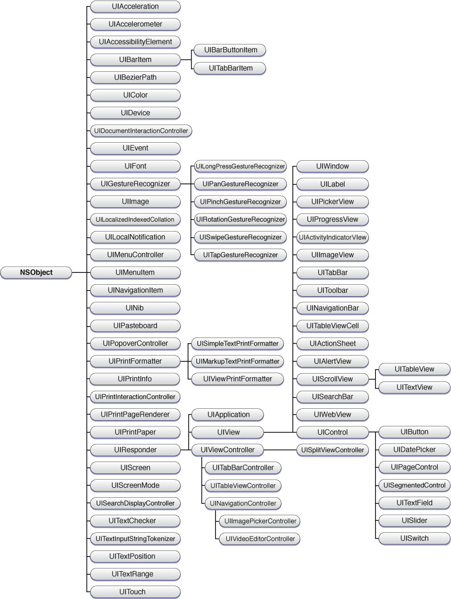

和 AppKit 一样，UIKit 中最大分支的类的根部也是一个基础的 responder 类。`UIResponder` 同样为事件处理方法以及响应者链（一串可能处理事件的对象）定义了接口和（如果有的话）默认行为。当用户用手指滚动一个表格视图，或在虚拟键盘上输入字符时，UIKit 会生成一个事件，该事件会沿着响应者链向上传递，直到有对象处理它为止。相应的核心对象——应用程序（`UIApplication`）、窗口（`UIWindow`）和视图（`UIView`）——都直接或间接地继承自 `UIResponder`。

与 AppKit 不同，UIKit 不使用 cell。UIKit 中的 control——即所有继承自 `UIControl` 的对象——不需要 cell 就能履行其主要职责：向目标对象发送 action 消息。不过，UIKit 实现目标-动作机制的方式与 AppKit 中的实现方式不同。`UIControl` 类为 control 定义了一组事件类型；例如，如果你希望一个按钮（`UIButton`）向目标对象发送 action 消息，你需要调用 `UIControl` 的方法，把该 action 和目标与一个或多个 control 事件类型关联起来。当其中某个事件发生时，该 control 就会发送 action 消息。

UIKit 框架大量运用了委托这一 AppKit 的另一设计模式。不过 UIKit 对委托的实现方式有所不同。UIKit 没有使用非正式协议，而是使用正式协议，其中某些协议方法可能被标记为可选。

每个在 iOS 中运行的应用程序都由一个单例的应用程序对象管理，这个对象的职责与全局 `NSApplication` 对象几乎完全相同。一个 `UIApplication` 对象控制主事件循环、跟踪应用程序的窗口和视图，并把收到的事件分派给合适的响应者对象。

`UIApplication` 对象还会接收系统级和应用程序级事件的通知。其中许多通知会被传递给它的委托，使其能够在应用程序启动和终止时注入特定于应用程序的行为、响应内存不足警告和时间变化，以及处理其他任务。

在 OS X 中，鼠标和键盘产生了大多数用户事件。AppKit 使用 `NSEvent` 对象来封装这些事件。而在 iOS 中，用户在屏幕上的手指动作才是事件的来源。UIKit 也有一个类 `UIEvent` 来表示这些事件。但手指触摸在本质上不同于鼠标点击；一段时间内发生的两次或更多次触摸可能构成一个独立的事件——例如一个捏合手势。因此，一个 `UIEvent` 对象包含一个或多个表示手指触摸的对象（`UITouch`）。两个平台上把事件分发和派发给能够处理它们的对象的模型几乎完全相同。不过，要处理一个事件，对象必须考虑该事件特有的触摸序列。

UIKit 还提供了手势识别器（gesture recognizer），这类对象能自动把触摸检测为手势。手势识别器分析一系列触摸，一旦识别出对应的手势，就向目标发送一条 action 消息。UIKit 为轻触、轻扫、旋转和平移等手势提供了现成的手势识别器。你也可以创建能够检测特定于应用程序的手势的自定义手势识别器。

AppKit 和 UIKit 的绘制模型是相似的。动画被集成到了 UIKit 的绘制实现中。相较于 AppKit，UIKit 直接为绘制提供的编程支持要有限一些。该框架提供了用于 Bezier 路径、PDF 生成，以及简单线条和矩形绘制（通过 `UIGraphics.h` 中声明的函数）的类和函数。你可以使用 `UIColor` 对象在当前图形上下文中设置颜色，使用 `UIImage` 对象来表示和封装图像。要进行更复杂的绘制，应用程序必须使用 Core Graphics 或 OpenGL ES 框架。

iOS 用户界面上的对象与 OS X 用户界面上的对象在外观上明显不同。由于设备的特殊性质——具体来说是更小的屏幕尺寸，以及用手指而非鼠标和键盘作为输入方式——iOS 中的用户界面对象通常必须更大（以成为触摸的合适目标），同时又要尽可能高效地利用屏幕空间。这些对象有时基于完全不同种类的视觉和触感类比物。举个例子，考虑一下日期选择器对象，它由 UIKit 和 AppKit 框架都定义的一个类实例化而来。在 OS X 中，日期选择器是这个样子：

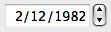

这种样式的日期选择器有两块很小的用于递增日期分量的区域，因此适合用鼠标指针操作。与之相对，看看 iOS 应用程序中的日期选择器：

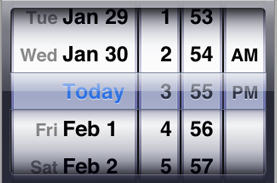

这种样式的日期选择器更适合以手指触摸作为输入方式；用户可以滑动月、日或年这一列，让它转到一个新的值。

和 AppKit 的类一样，UIKit 中的许多类也分属若干功能分组：

- __Controls__。`UIControl` 的子类实例化的对象让用户能够向应用程序传达他们的意图。除了标准的按钮对象（`UIButton`）和滑块对象（`UISlider`）之外，还有一个模拟开/关开关的 control（`UISwitch`）、一个用于从多维数值集合中选择的滚轮式 control（`UIPickerView`）、一个用于在文档间翻页的 control（`UIPageControl`），以及其他若干 control。
- __Modal views__。继承自 `UIModalView` 的两个类，用于向用户显示消息，一种是附加在特定视图或窗口上的"sheet"形式（`UIActionSheet`），另一种是不附加于任何对象的提示对话框（`UIAlertView`）。在 iPad 上，应用程序可以使用弹出视图（`UIPopoverController`）来代替 action sheet。
- __Scroll views__。`UIScrollView` 类让其子类的实例能够响应触摸，在较大的视图内进行滚动。当用户滚动时，滚动视图会短暂显示在文档中所处位置的指示器。`UIScrollView` 的子类实现了表格视图、文本视图和 web 视图。
- __工具栏、导航栏、分栏视图和 view controller__。`UIViewController` 类是用于管理一个视图的基类。一个 view controller 提供了用于创建和观察视图、叠加视图、处理视图旋转，以及响应内存不足警告的方法。UIKit 包含用于管理工具栏、导航栏和图像选择器的 `UIViewController` 具体子类。

  应用程序同时使用工具栏和导航栏来管理与屏幕上"主"视图相关的行为；通常，工具栏被放置在主视图下方，导航栏被放置在主视图上方。你可以使用工具栏（`UIToolbar`）对象在应用程序的不同模式或视图之间切换；你也可以用它们来显示一组与当前主视图相关的、执行某种操作的功能。你可以使用导航栏（`UINavigationBar`）来管理应用程序中一系列的窗口或视图，实际上是在"下钻"应用程序所定义的一个对象层级；例如，Mail 应用程序就使用导航栏从账户导航到邮箱文件夹，再从那里导航到具体的邮件。在 iPad 上，应用程序可以使用 `UISplitViewController` 对象来呈现主从（master-detail）界面。

用户可以通过文本视图（`UITextView`）或文本字段（`UITextField`）在 iOS 应用程序中输入文本。这些类采用了 `UITextInputTraits` 协议，用来指定用户触碰文本输入对象时所呈现的虚拟键盘的外观和行为；任何支持文本输入的子类也都应当遵循这一协议。应用程序可以使用 `UIStringDrawing` 方法（`NSString` 类上的一个分类）在视图中绘制文本。借助 `UIFont` 类，你可以为所有显示文本的对象（包括表格单元格、导航栏和标签）指定文本的字体特性。

自行进行文本布局和字体管理的应用程序，可以采用 `UITextInput` 协议，并使用相关的类和协议与 iOS 的文本输入系统通信。

AppKit 和 UIKit 都是为不同平台设计的 Cocoa 应用框架，一个面向 OS X，另一个面向 iOS。正因为这层亲缘关系，两个框架中许多类的名称相似也就不足为奇了；在大多数情况下，前缀（"NS" 相对于 "UI"）是唯一的名称差异。这些名称相似的类大多履行相似的职责，但也存在差异。这些差异可能体现在作用范围、继承关系或设计上。总体而言，UIKit 的类比它们在 AppKit 中对应的类拥有更少的方法。

表 1-1 描述了两个框架中主要类之间的差异。

__表 1-1__  AppKit 和 UIKit 框架中的主要类

| 类 | 比较 |
| --- | --- |
| `NSApplication`  `UIApplication` | 这两个类在主要职责上惊人地相似。它们都提供一个单例对象，负责设置应用程序的显示环境和事件循环、分发事件，并在应用程序特定事件（例如启动和终止）发生时通知委托。不过，`NSApplication` 类还执行一些 iOS 应用程序无法使用的功能（例如管理应用程序的挂起、重新激活和隐藏）。 |
| `NSResponder`  `UIResponder` | 这两个类的职责也几乎相同。它们都是抽象类，定义了用于响应事件和管理响应者链的接口。主要的差异在于，`NSResponder` 的事件处理方法是为鼠标和键盘定义的，而 `UIResponder` 的方法是为 Multi-Touch 事件模型定义的。 |
| `NSWindow`  `UIWindow` | `UIWindow` 类在类层次结构中所处的位置与 `NSWindow` 在 AppKit 中所处的位置不同；它是 `UIView` 的子类，而 AppKit 中的类直接继承自 `NSResponder`。`UIWindow` 在应用程序中的职责比 `NSWindow` 要局限得多。它同样提供一个用于显示视图的区域、把事件分派给这些视图，并在窗口坐标和视图坐标之间进行转换。 |
| `NSView`  `UIView` | 这两个类在用途以及基本方法集上都非常相似。它们都让你能够移动和调整视图大小、管理视图层次结构、绘制视图内容，以及转换视图坐标。不过，`UIView` 的设计使得视图对象天生就具备动画能力。 |
| `NSControl`  `UIControl` | 这两个类都为按钮和滑块等对象定义了一种机制，使得在被操作时，control 对象会向目标对象发送一条 action 消息。这两个类实现目标-动作机制的方式不同，这主要是因为两者事件模型的差异所致。详情参见 [目标-动作机制](Communicating%20with%20Objects.md#apple-f4xwc4dqnrsv64tfmyxwi33df52wszbpkridimbqgazdsnzufvbuqnznknltcna)。 |
| `NSViewController`  `UIViewController` | 正如名称所暗示的，这两个类的职责都是管理视图。但它们完成这一任务的方式不同。`NSViewController` 对象所提供的管理依赖于 bindings，这是一项只有 OS X 才支持的技术。`UIViewController` 对象在 iOS 应用程序模型中用于模态和导航用户界面（例如由导航栏控制的视图）。 |
| `NSTableView`  `UITableView` | `NSTableView` 继承自 `NSControl`，但 `UITableView` 并不继承自 `UIControl`。更重要的是，`NSTableView` 对象支持多列数据；而 `UITableView` 对象一次只能显示单列数据，因此其功能更像是列表，而非表格数据的呈现。 |

在一些次要的类中，你也可以发现一些差异。例如，UIKit 有 `UITextField` 和 `UILabel` 类，前者用于可编辑的文本字段，后者用于作为标签的不可编辑文本字段；而使用 `NSTextField` 类，你只需设置文本字段的属性，就可以创建这两种文本字段。类似地，`NSProgressIndicator` 类可以创建与 `UIProgressIndicator` 和 `UIProgressBar` 类实例相对应样式的对象。

Core Data 是一个 Cocoa 框架，为管理对象图提供基础设施，包括支持以多种文件格式进行持久化存储。对象图管理包括撤销与重做、验证，以及确保对象关系完整性等特性。对象持久化意味着 Core Data 会把模型对象保存到一个持久化存储中，并在需要时获取它们。一个 Core Data 应用程序的持久化存储——也就是对象数据被归档的最终形式——可以从 XML 文件到 SQL 数据库不等。Core Data 非常适合用作关系数据库前端的应用程序，但任何 Cocoa 应用程序都可以利用它的能力。

Core Data 的核心概念是托管对象。托管对象只是一个由 Core Data 管理的模型对象，但它必须是 [NSManagedObject](https://developer.apple.com/documentation/coredata/nsmanagedobject) 类或该类子类的实例。你使用一种称为托管对象模型的模式（schema）来描述 Core Data 应用程序的托管对象。（Xcode 应用程序包含一个数据建模工具，帮助你创建这些模式。）一个托管对象模型包含对一个应用程序的托管对象（也称为_实体_）的描述。每份描述都指定了一个实体的属性、它与其他实体的关系，以及诸如实体名称和代表类名称等元数据。

在一个正在运行的 Core Data 应用程序中，一个被称为_托管对象上下文_的对象负责管理一个托管对象图。图中的所有托管对象都必须在某个托管对象上下文中注册。该上下文允许应用程序向图中添加对象或从中移除对象。它还会跟踪对这些对象所做的更改，因此能够提供撤销和重做支持。当你准备好保存对托管对象所做的更改时，托管对象上下文会确保这些对象处于有效状态。当一个 Core Data 应用程序想要从其外部数据存储中检索数据时，它会向某个托管对象上下文发送一个获取请求——一个指定了一组条件的对象。托管对象上下文会在自动注册这些对象后，从存储中返回匹配该请求的对象。

一个托管对象上下文同时也充当着一组称为_持久化栈_的底层 Core Data 对象的网关。持久化栈在你应用程序中的对象和外部数据存储之间起中介作用。这个栈由两种不同类型的对象组成：持久化存储和持久化存储协调器。持久化存储位于栈的底部。它们在外部存储（例如一个 XML 文件）中的数据与托管对象上下文中相应的对象之间进行映射。不过，它们并不直接与托管对象上下文交互。在栈中，持久化存储之上是一个持久化存储协调器，它为一个或多个托管对象上下文呈现出一个外观（facade），使得位于它之下的多个持久化存储看起来像是单一的聚合存储。图 1-10 展示了 Core Data 架构中各对象之间的关系。

__图 1-10__  托管对象上下文与持久化栈的示例

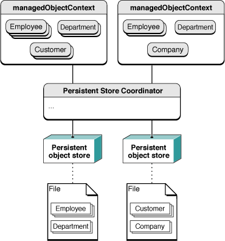

Core Data 包含 [NSPersistentDocument](https://developer.apple.com/documentation/appkit/nspersistentdocument) 类，它是 `NSDocument` 的子类，有助于把 Core Data 与文档架构集成起来。一个持久化文档对象会创建自己的持久化栈和托管对象上下文，把该文档映射到一个外部数据存储。`NSPersistentDocument` 对象为读写文档数据的 `NSDocument` 方法提供了默认实现。

作为标准安装的一部分，除了两个平台各自的核心框架外，Apple 还包含了若干发布 Cocoa 编程接口的框架。你可以使用这些次要框架，为你的应用程序赋予虽非必不可少、但令人满意的能力。一些值得关注的次要框架包括：

- Sync Services——（仅限 OS X）使用 Sync Services，你可以同步现有的联系人、日历和书签等模式，以及你自己应用程序的数据。你还可以扩展现有的模式。详情参见 _[Sync Services Programming Guide](../Sync%20Services%20Programming%20Guide/Introduction%20to%20Sync%20Services%20Programming%20Guide.md#apple-f4xwc4dqnrsv64tfmyxwi33df52wszbpkridimbqgaytcnzy)_。
- Address Book——该框架实现了一个联系人及其他个人信息的集中数据库。使用 Address Book 框架的应用程序可以与其他应用程序（包括 Apple 的 Mail 和 iChat）共享这些联系人信息。详情参见 _[Address Book Programming Guide for Mac](../../User%20Experience/Address%20Book%20Programming%20Guide%20for%20Mac/Introduction.md#apple-f4xwc4dqnrsv64tfmyxwi33df52wszbpgeydambqgeyto2i)_。
- Preference Panes——（仅限 OS X）使用这个框架，你可以创建插件，供你的应用程序动态加载，以获得一个用于记录用户偏好设置（针对应用程序本身或整个系统）的用户界面。详情参见 _[Preference Pane Programming Guide](../../User%20Experience/Preference%20Pane%20Programming%20Guide/Introduction.md#apple-f4xwc4dqnrsv64tfmyxwi33df52wszbpgeydambqgeyta2i)_。
- Screen Saver——（仅限 OS X）Screen Saver 框架帮助你创建 Screen Effects 模块，这些模块可以通过 System Preferences 加载和运行。详情参见 _[Screen Saver Framework Reference](https://developer.apple.com/documentation/screensaver)_。
- WebKit——（在 iOS 中不公开）WebKit 框架提供了一组核心类，用于在窗口中显示网页内容，并默认实现了跟踪用户点击的链接等功能。详情参见 _[WebKit Objective-C Programming Guide](../WebKit%20Objective-C%20Programming%20Guide/Introduction%20to%20WebKit%20Objective-C%20Programming%20Guide.md#apple-f4xwc4dqnrsv64tfmyxwi33df52wszbpgeydambqge3di2i)_。
- iAd——（仅限 iOS）这个框架让你的应用程序可以通过向用户展示广告来赚取收入。
- Map Kit——（仅限 iOS）这个框架让应用程序可以在自己的窗口和视图中嵌入地图。它还支持地图标注、叠加层以及反向地理编码查询。
- Event Kit——（仅限 iOS）借助 Event Kit 框架，应用程序可以访问用户日历数据库中的事件信息，并让用户能够为自己的日历创建和编辑事件。该框架还支持高效获取事件记录、事件变化的通知，以及与相应日历数据库的自动同步。
- Core Motion——（仅限 iOS）Core Motion 处理从设备的加速度计和陀螺仪（如果可用）接收到的底层数据，并将其呈现给应用程序进行处理。
- Core Location——（仅限 iOS）Core Location 让应用程序能够确定与设备关联的当前位置或朝向。借助它，应用程序还可以定义地理区域，并监控用户何时越过这些区域的边界。
- Media Player——（仅限 iOS）这个框架使应用程序能够播放电影、音乐、音频播客和有声读物文件。它还让你的应用程序能够访问 iPod 资料库。

许多年前，Cocoa 被称为 NeXTSTEP。NeXT Computer 于 1989 年 9 月开发并发布了 NeXTSTEP 1.0 版本，2.0 和 3.0 版本紧随其后（分别在 1990 年和 1992 年发布）。在这个早期阶段，NeXTSTEP 不仅仅是一个应用环境；这个名称指代的是整个操作系统，包括窗口和图像系统（基于 Display PostScript）、Mach 内核、设备驱动程序等等。

那时候还没有 Foundation 框架。事实上，那时根本没有"框架（framework）"这个概念；软件库（动态共享的）被称为 _kit_，其中最突出的是 Application Kit。如今由 Foundation 承担的大部分职责，当时是由各种各样的函数、结构体、常量和其他类型来承担的。Application Kit 本身的类集合也比今天要小得多。图 1-11 展示了 NeXTSTEP 0.9（1988 年）的一份类层次结构图表。

__图 1-11__  1988 年的 Application Kit 类层次结构

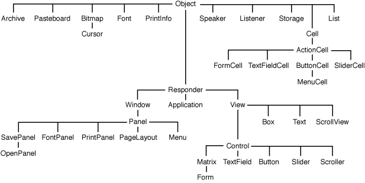

除了 Application Kit 之外，早期的 NeXTSTEP 还包括 Sound Kit 和 Music Kit，这两个库包含了一整套丰富的 Objective-C 类，为音频和音乐合成提供了对 Display PostScript 层的高层访问能力。

1993 年初，NeXTSTEP 3.1 被移植到（并发布在）Intel、Sparc 和 Hewlett-Packard 计算机上。NeXTSTEP 3.3 也标志着一个重大的新方向，因为它包含了 Foundation 的一个初步版本。大约在这个时期（1993 年），OpenStep 计划也开始成形。OpenStep 是 Sun 和 NeXT 之间的一项合作，目的是把 NeXTSTEP 的较高层部分（尤其是 Application Kit 和 Display PostScript）移植到 Solaris 上。这个名字中的"Open"指的是两家公司将共同发布的开放 API 规范。1994 年 9 月发布的官方 OpenStep API，是第一个把 API 拆分为 Foundation 和 Application Kit 的规范，也是第一个使用"NS"前缀的规范。最终，Application Kit 被简称为 AppKit。

到 1996 年 6 月，NeXT 已经移植并发布了可以在 Intel、Sparc 和 Hewlett-Packard 计算机上运行的 OpenStep 4.0 版本，以及一个可以在 Windows 系统上运行的 OpenStep 运行时。Sun 也完成了将 OpenStep 移植到 Solaris 的工作，并将其作为其 Network Object Computing Environment 的一部分发布。然而，OpenStep 从未成为 Sun 整体战略中的重要组成部分。

1997 年 Apple 收购 NeXT Software（当时的名称）之后，OpenStep 变成了 Yellow Box，并随 OS X Server（也称为 Rhapsody）和 Windows 一同发布。随后，随着 OS X 战略的演进，它最终被重新命名为"Cocoa"。

[下一页](Cocoa%20Objects.md)[上一页](Introduction.md)

