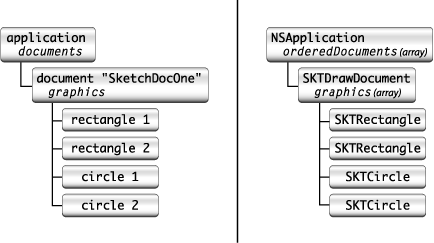
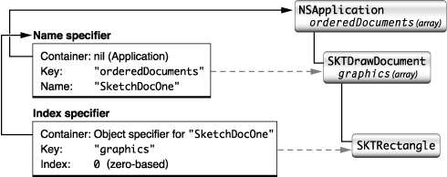

> 导航：[总目录](../../../README.md) · [documentation](../../../_indexes/documentation.md) · [Cocoa Scripting Guide](Introduction%20to%20Cocoa%20Scripting%20Guide.md)


[Next](Script%20Commands.md)[Previous](Getting%20and%20Setting%20Properties%20and%20Elements.md)

# Object Specifiers

An _object specifier_ locates a scriptable object within an application’s containment hierarchy. Cocoa scripting makes use of object specifiers to find objects in your application while executing a script command and to return information requested by a script. This chapter describes how Cocoa scripting uses object specifiers and how your application provides object specifiers for its scriptable objects.

An AppleScript script contains statements that manipulate the objects in an application's AppleScript object model. The part of a script statement that identifies an object, such as `fourth word`, is called a _reference_. A reference rarely occurs in isolation. Usually a script statement consists of a series of references, preceded by a command and typically connected to each other by `in` or `of`, such as `get the fourth word in the third paragraph of document "Quarterly Report"`.

An Apple event encapsulates the operation specified by a script statement and delivers it to the application. For Apple events that correspond to commands defined in the application's sdef file, Cocoa scripting converts the Apple event into a script command that contains all the information necessary to perform the operation.

To describe the objects specified by a reference, the command uses object specifiers. Where a script statement identifies an object in the AppleScript object model, an object specifier identifies the corresponding object in the application itself. When the application must return an object to the calling script, Cocoa scripting also uses an object specifier, supplied by your application, to identify the object.

There is not always a one-to-one correspondence between AppleScript objects and objects in your application's implementation. For example, a `character` object in a script does not have a corresponding `character` object in the application.

Cocoa scripting relies on key-value coding (KVC) when evaluating object specifiers. When an application first needs to work with scriptability information, Cocoa scripting loads information from the application's sdef file into a global instance of `NSScriptSuiteRegistry`. At that time, it registers class descriptions for your scriptable classes. As a result, Cocoa and your application can obtain script class description information, including keys, about scriptable classes for use with object specifiers.

For more information, see [Loading Scriptability Information](Overview%20of%20Cocoa%20Support%20for%20Scriptable%20Applications.md#apple-f4xwc4dqnrsv64tfmyxwi33df52wszbpkridimbqgaytsnzwfvjvomi).

Any class in your application that is part of the containment hierarchy for your scriptability support will most likely require an object specifier method. When a script statement targets your application, the application may need to return a reply. For example, the result of a `get` command is often an object or a list of objects. When Cocoa returns these objects in the reply Apple event, it does not return pointers to Objective-C objects, it returns object specifiers that locate scriptable objects within the containment hierarchy. As part of building these specifiers, Cocoa calls on your scriptable objects to supply specifiers for themselves.

You provide an object specifier for a scriptable class by implementing the `objectSpecifier` method. That method is defined in `NSScriptObjectSpecifiers` (note the trailing "s"), a category on [NSObject](https://developer.apple.com/library/archive/documentation/LegacyTechnologies/WebObjects/WebObjects_3.5/Reference/Frameworks/ObjC/Foundation/Classes/NSObject/Description.html#//apple_ref/occ/cl/NSObject) that implements a version that just returns `nil`.

An `objectSpecifier` method returns an instance of one of the classes listed in [Table 6-1](#apple-f4xwc4dqnrsv64tfmyxwi33df52wszbpkridimbqgazdcnrufvbuqmznknlte), which are subclasses of `NSScriptObjectSpecifier`. Classes such as `NSNameSpecifier` and `NSUniqueIDSpecifier` represent the standard AppleScript reference forms, so you shouldn't need to subclass them. You pick the best version for the object you need to specify—see _[Scripting Interface Guidelines](https://developer.apple.com/library/archive/technotes/tn2002/tn2106.html#//apple_ref/doc/uid/DTS10003199)_ for guidance. For example, if the object has a unique name or unique ID, use the corresponding specifier type. For an unnamed object with no ID, such as a rectangle or a paragraph of text, you may want to return an index specifier.

Most subclasses of `NSScriptObjectSpecifier` have a specific initializer that you should use.

Most initializer methods for an object specifier class include the following parameters:

- `(NSScriptClassDescription *)classDescription`

  Here you supply a class description for the container class of the specified object. You must always supply a class description for a specifier.

  If you already have an object specifier for a container, you can obtain a class description for that container object using the `NSScriptObjectSpecifier` method `keyClassDescription`, as shown in [Listing 6-1](#apple-f4xwc4dqnrsv64tfmyxwi33df52wszbpkridimbqgazdcnrufvbuqmzninfeercbi5euk).

  When you can get the class of a container object (for example, by invoking `[NSApp class]`), you can use the `classDescriptionForClass` method to determine the container description, as shown in [Listing 6-2](#apple-f4xwc4dqnrsv64tfmyxwi33df52wszbpkridimbqgazdcnrufvbuqmznknltq). If you have an instance of the container’s class, you can instead use the `NSObject` instance method `classDescription` to obtain a container description.
- `(NSScriptObjectSpecifier *)specifier`

  Here you supply an object specifier for the parent container of the specified object. You typically obtain it by invoking the `objectSpecifier` method of the containing object.

  An object that has no container specifier is known as the _top-level specifier_. In most cases, the top-level specifier is the application itself. You can specify the top-level specifier by passing `nil` for this parameter. (That is the only time you can pass `nil` for a container specifier, and even then you must specify a container class description.)
- `(NSString *)key`

  Here you supply a key that tells the parent container how to find the specified object. The key you pass is based on information supplied in your sdef file. For example, Sketch defines the `"graphics"` key to identify the graphics array in a Sketch document. (Sketch actually defines the singular `"graphic"` as an element of the `document` class, but Cocoa scripting applies its default rules, described in [Provide Keys for Key-Value Coding](Implementing%20a%20Scriptable%20Application.md#apple-f4xwc4dqnrsv64tfmyxwi33df52wszbpgiydambqgaztolktk4yq), to convert this key to the string `"graphics"`.)

For an annotated example of an `objectSpecifier` method, see [An Object Specifier Method for a Rectangle in Sketch](#apple-f4xwc4dqnrsv64tfmyxwi33df52wszbpkridimbqgazdcnrufvbuqmzngeydsmbsgmyq).

Consider the object model and containment hierarchy diagram for the Sketch sample application, shown in Figure 6-1. The left side of this illustration shows scriptable Sketch objects, the right side the corresponding application containment hierarchy. For a script statement that identifies a `rectangle` object on the left, Cocoa scripting supplies an object specifier that locates the rectangle and its containing document within the containment hierarchy on the right.

__Figure 6-1__  Sketch object model and containment hierarchy revisited



Each object specifier contains a reference to its containing object, which allows object specifiers to represent objects that can be deeply nested within an object hierarchy. The outermost container, represented by a nil object specifier, is usually the `application` object, although it can be an object specifier involved in a `whose` clause (`NSWhoseSpecifier`) or the container for a range evaluation.

Figure 6-2 shows the nested object specifiers for the statement `first rectangle in document "SketchDocOne"`:

__Figure 6-2__  Nested object specifiers for a Sketch rectangle



Here is how to interpret the information in this figure:

1. An index specifier specifies the first rectangle, which is an object of class `SKTRectangle`. The specifier has these components:

   - The index for the specified object, which in this example has the value `0`.

     This is the zero-based index of the specified rectangle in its containing array. Because Sketch's graphics arrays can contain other kinds of graphics, the index for the first rectangle won't always have the value `0`—for example, if preceded by four circle graphics, the index would have the value `4`.
   - A key that specifies the collection for the specified object, which in this example has the value `"graphics"`.

     The graphics array is the collection for the indexed object. The key matches information provided by your sdef and made available in the running application as described in [Object Specifiers and KVC](#apple-f4xwc4dqnrsv64tfmyxwi33df52wszbpkridimbqgazdcnrufvbuqmznknltcmy).
   - A container reference that specifies the parent for this object specifier. In this example the container is the object specifier for the document `"SketchDocOne"`.
2. A name specifier specifies the document containing the first rectangle, which is an object of class `SKTDrawDocument`. The specifier has these components:

   - The name for the specified object, which in this example has the value `"SketchDocOne"`.
   - A key that specifies the collection for the specified object, which in this example has the value `"orderedDocuments"`.

     The application's ordered array of documents is the collection for the named document, though in this case, the order is unimportant.
   - A container reference that specifies the parent for this object specifier. In this example, the reference is `nil`, specifying that the array of documents is contained by the `application` object.

   A script statement, and thus an object specifier, can specify objects that don't currently exist in the application, causing an error condition when the script is executed. For example, the specified document may not exist, or it may not contain the specified graphic. Code within a command class should check for and be prepared to handle common error conditions. (Validation is not considered appropriate for KVC getter and setter methods.)

When Cocoa scripting prepares a script command for a script that contains a reference, it converts the reference into a nested series of object specifiers, such as the ones shown in [Figure 6-2](#apple-f4xwc4dqnrsv64tfmyxwi33df52wszbpkridimbqgazdcnrufvbuqmznknltk). It packages these nested object specifiers as a receiver of the command (or in some cases as an argument of the command). When the command is executed, the application evaluates the object specifiers in its own context to discover the specified objects.

Evaluation starts with the top-level specifier and proceeds down the chain of object specifiers, evaluating and resolving each until the identity of the final, nested child object is determined. This object is a receiver (or receivers) of the command or one of the command’s arguments. Key-value coding is used as the standard mechanism for evaluation. An object specifier queries its evaluated container for the value of the key associated with the object specifier.

Evaluation of object specifiers is described in more detail in [Script Commands and Object Specifiers](Script%20Commands.md#apple-f4xwc4dqnrsv64tfmyxwi33df52wszbpgiydambrgi2delktk4ytm).

AppleScript recognizes many types of references. For the standard reference forms, Cocoa defines subclasses of the abstract class [NSScriptObjectSpecifier](https://developer.apple.com/documentation/foundation/nsscriptobjectspecifier). These classes are shown in Table 6-1. Each of these object specifier classes deals with identifying objects in collections (`NSArray` objects).

These classes are unusual in that they provide one of the few examples where your application routinely creates instances of scripting classes defined by Cocoa. You do that in the object specifier methods for your scriptable classes. For more information on these and related classes, see also [Table 9-2](Cocoa%20Scripting%20Classes%20and%20Categories.md#apple-f4xwc4dqnrsv64tfmyxwi33df52wszbpgiydambqgaztiljzhe4domjy).

__Table 6-1__   AppleScript reference forms and corresponding object specifier classes

| Reference forms | Cocoa Class | Description |
| Arbitrary | [NSRandomSpecifier](https://developer.apple.com/documentation/foundation/nsrandomspecifier) | Specifies an arbitrary object in a collection.  Example: `any word`, `some document` |
| Filter | [NSWhoseSpecifier](https://developer.apple.com/documentation/foundation/nswhosespecifier) | Specifies every object in a particular container that matches specified conditions defined by a Boolean expression.  Example: `words whose color is blue` or `document whose name is "Letter to Santa Claus"` |
| ID | [NSUniqueIDSpecifier](https://developer.apple.com/documentation/foundation/nsuniqueidspecifier) | Specifies an object in a collection by unique ID.  Example: `window id 739` |
| Index | [NSIndexSpecifier](https://developer.apple.com/documentation/foundation/nsindexspecifier) | Specifies an object in a collection by index.  Examples: `word 5`, `front document` |
| Middle | [NSMiddleSpecifier](https://developer.apple.com/documentation/foundation/nsmiddlespecifier) | Specifies the middle object in a collection.  Example: `middle word of paragraph 2` |
| Name | [NSNameSpecifier](https://developer.apple.com/documentation/foundation/nsnamespecifier) | Specifies an object in a collection by name. See class documentation for evaluation mechanism.  Example: `window named "Report"` |
| Property,  Every | [NSPropertySpecifier](https://developer.apple.com/documentation/foundation/nspropertyspecifier) | Specifies an attribute (property) or relationship of an object.  Example: `color` (Property), `every graphic of the front document` (Every) |
| Range | [NSRangeSpecifier](https://developer.apple.com/documentation/foundation/nsrangespecifier) | Specifies a range of objects in a collection.  Example: `words 5 through 10` |
| Relative | [NSRelativeSpecifier](https://developer.apple.com/documentation/foundation/nsrelativespecifier) | Specifies the position of an object in relation to another object.  Example: `before word 5` |

It is unlikely that you will need to subclass any of these classes, as they already cover the standard set of valid AppleScript reference forms. However, if you do need to create a subclass, you must override the primitive method `indicesOfObjectsByEvaluatingWithContainer:count:` to return indices to the elements within the container whose values are matched with the child specifier's key. In addition, you may need to declare any special instance variables and implement an initializer that invokes the designated initializer of its superclass, `initWithContainerClassDescription:containerSpecifier:key:`, and initializes these variables.

In addition to the concrete subclasses of `NSScriptObjectSpecifier` shown in Table 6-1, Cocoa provides other classes that assist the object-specifier classes in evaluation. Instances of these classes help to indicate relative position and represent Boolean and logical expressions in which object specifiers are involved.

A script statement can also contain filter references, which identify objects in containers based on the conditions specified in Boolean expressions. These expressions can be linked together by logical operators (AND, OR, NOT) and return the appropriate `true` or `false` value. Filter references begin with the words `whose` or `where`, as in `get words where color is blue or color is red` and `rectangles whose x position is greater than 45`. These references can contain phrases such as `is`, `is equal to` or `is greater than`, as well as their symbolic equivalents (such as `=` and `>`).

Instances of the [NSWhoseSpecifier](https://developer.apple.com/documentation/foundation/nswhosespecifier) class represent filter reference forms in Cocoa. These instances hold a “test” instance variable, which is an [NSScriptWhoseTest](https://developer.apple.com/documentation/foundation/nsscriptwhosetest) object.

For information about these and related classes, see [Object Specifiers, Logical Tests, and Related Categories](Cocoa%20Scripting%20Classes%20and%20Categories.md#apple-f4xwc4dqnrsv64tfmyxwi33df52wszbpgiydambqgaztiljrga3dsmzygm).

The following sections provide examples of how to implement the object specifier defined by `NSScriptObjectSpecifiers`.

Listing 6-1 shows how the Sketch sample application (available from Apple) implements the `objectSpecifier` method for the `SKTGraphic` class.

__Listing 6-1__  An object specifier method for a rectangle

```objc
- (NSScriptObjectSpecifier *)objectSpecifier{
    NSArray *graphics = [[self document] graphics];// 1
    unsigned index = [graphics indexOfObjectIdenticalTo:self];// 2
    if (index != NSNotFound) {
       NSScriptObjectSpecifier *containerRef = [[self document] objectSpecifier];// 3
        return [[[NSIndexSpecifier allocWithZone:[self zone]]
            initWithContainerClassDescription:[containerRef keyClassDescription]
            containerSpecifier:containerRef key:@"graphics" index:index] autorelease];// 4
    } else {
        return nil;// 5
    }
}
```

Here’s a description of how this method provides an object specifier for a graphics object. The returned specifier consists of an index specifier for the graphic in its container, and a container specifier for the document that contains the array of graphics:

1. From its document, it gets the array of graphics and determines the index of the receiving graphic, if it is contained in the array.
2. It gets the object specifier of the document that contains the graphic.

   Sketch defines the `SKTDrawDocument` class as a subclass of `NSDocument`. The object specifier method for `NSDocument` returns an instance of `NSNameSpecifier` that identifies the document by name within the application's array of ordered documents.
3. It creates and initializes an index specifier (type `NSIndexSpecifier`) for the receiving graphic and returns it.

   The specifier locates the graphic by index within the graphics in its document. Although an AppleScript script asks for indexed items as though they are one-based, this index specifier, which locates objects within an array that correspond to the specified items, works with zero-based values. For information about the other parameters, see [About Object Specifier Classes](#apple-f4xwc4dqnrsv64tfmyxwi33df52wszbpkridimbqgazdcnrufvbuqmznknlto).

To specify the application object as the top-level container for a specifier, you can use code like the following. This snippet is part of the document class and obtains an object specifier for the document by name (rather than by index, which may become invalid if the document ordering changes):

__Listing 6-2__  Specifying the application as a container

```
NSScriptClassDescription *containerClassDesc = (NSScriptClassDescription *)
    [NSScriptClassDescription classDescriptionForClass:[NSApp class]];// 1
return [[[NSNameSpecifier alloc]
    initWithContainerClassDescription:containerClassDesc
    containerSpecifier:nil key:@"orderedDocuments"
    name:[self lastComponentOfFileName]] autorelease];// 2
```

Here’s a description of what this code snippet does:

1. The application is the container for a list of ordered documents, so this code first obtains a class description from the global application object, `NSApp`. (You never pass `nil` for the class description.)
2. It then creates and returns an autoreleased object specifier of type `NSNameSpecifier`, passing `nil` for the `containerSpecifier` parameter to specify the top-level container, the application. (This is the only case in which you can pass `nil` for the container.)

   It invokes the `NSDocument` method `lastComponentOfFileName` to obtain the name of the document and uses it to construct a name specifier object.

Container classes that want to evaluate certain object specifiers on their own should implement the `indicesOfObjectsByEvaluatingObjectSpecifier:` method defined by `NSScriptObjectSpecifiers` (a category on `NSObject`). For example, you might choose to implement this method if you find that `whose` clause evaluation is too slow and you want to do your own evaluation to speed it up (though for most applications, performance of the default `whose` mechanism should be sufficient).

If this method returns `nil`, the object specifier method for the class does its own evaluation. If this method returns an array, the object specifier uses the `NSNumber` objects in the array as the indices of the specified objects.

Therefore, if you implement this method and when you evaluate the specifier there are no objects that match, return an empty array, not `nil`. If you find only one object, you return its index in an array. Returning an array with a single index where the index is –1 is interpreted to mean all the objects match.

The Sketch application implements this method in its document class, as shown in Listing 6-3. This allows Sketch to directly handle some range and relative specifiers for graphics, so it can support script statements such as `graphics from circle 3 to circle 5`, `circles from graphic 1 to graphic 10`, or `circle before rectangle 3`.

__Listing 6-3__  indicesOfObjectsByEvaluatingObjectSpecifier: method from Sketch

```objc
- (NSArray *)indicesOfObjectsByEvaluatingObjectSpecifier:(NSScriptObjectSpecifier *)specifier {
    if ([specifier isKindOfClass:[NSRangeSpecifier class]]) {// 1
        return [self indicesOfObjectsByEvaluatingRangeSpecifier:(NSRangeSpecifier *)specifier];
    } else if ([specifier isKindOfClass:[NSRelativeSpecifier class]]) {// 2
        return [self indicesOfObjectsByEvaluatingRelativeSpecifier:(NSRelativeSpecifier *)specifier];
    }
    return nil;// 3
}
```

Here’s a description of how this method works:

1. If the passed specifier is a range specifier, it returns the result of invoking another Sketch method to evaluate the specifier.

   The method `indicesOfObjectsByEvaluatingRangeSpecifier:` allows more flexible range specifiers to be used with the different graphic keys of a `SKTDrawDocument`.

   You can examine this method in Sketch. Describing it in full is beyond the scope of this discussion.
2. If the passed specifier is a relative specifier, it returns the result of invoking another Sketch method to evaluate the specifier.

   The method `indicesOfObjectsByEvaluatingRelativeSpecifier:` allows more flexible relative specifiers to be used.

   Again, this method is available in Sketch, but is beyond the scope of this discussion.
3. For any other type of specifier, this method returns `nil` so that the default object specifier evaluation will take place.

Cocoa Scripting provides support for implicitly specified subcontainers. An _implicitly specified subcontainer_ is an object container that can be specified in an AppleScript script by context, rather than by an explicit reference. Without this feature, a script would have to fully specify the path to a word in, for example, a TextEdit document:

`fourth word of text of front document`

You can make life easier for scripters who use your application by saving them the trouble of writing full references to objects in situations where part of the reference can be safely assumed. For example, the following would be a simpler, but reasonable way to refer to the same word, since text is the obvious container of words in a document:

`fourth word of front document`

That is, you can allow `of text` to be implicitly specified by context, instead of explicitly specified in the script.

To support an implicitly specified subcontainer, you add a `contents` element to the `class` element for the containing class in your sdef file. The `contents` element indicates that a scripter can obtain the contents of an object of this class type without specifying the container that holds the contents.

For example, suppose your application has a document class, `MyTextDocument`, that handles text with an instance of the `NSTextStorage` class. `NSTextStorage` supports scriptability for words, paragraphs, and the other text items listed in [Table 3-2](Implementing%20a%20Scriptable%20Application.md#apple-f4xwc4dqnrsv64tfmyxwi33df52wszbpgiydambqgaztolktk42q).

Your application can turn the text storage instance into an implicitly specified subcontainer, so that a user won't have to specify it in a script, but can specify just the document, as in the sample shown above. To do so, you add a `contents` entry for the `document` class to support, as shown in Listing 6-4. This `contents` element specifies that for a script to access the text-related contents of a `document` object, it can just specify the `document` object, without having to specify a container within the object.

The `MyTextDocument` class would implement accessors that match the Cocoa key defined in the sdef: that is, `contents` and `setContents:`. For an idea of what these accessors might look like, see the similarly named accessors for the text area class (`SKTTextArea`) in the Sketch application.

__Listing 6-4__  Class definition for text document, containing a contents element

```
        <class name="document" code="docu"
                description="A text document.">
            <cocoa class="MyTextDocument"/>
            <contents name="text contents" code="TeCo" type="rich text"
                description="The text of the document.">
                <cocoa key="contents"/>
            </contents>
        </class>
```

When you supply a `contents` entry, an appropriate `NSPropertySpecifier` will be inserted into the object specifier containment chain when a reference using that container class would otherwise be invalid.

[Next](Script%20Commands.md)[Previous](Getting%20and%20Setting%20Properties%20and%20Elements.md)

