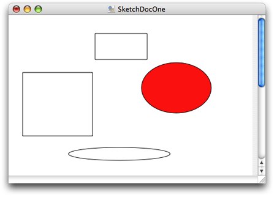
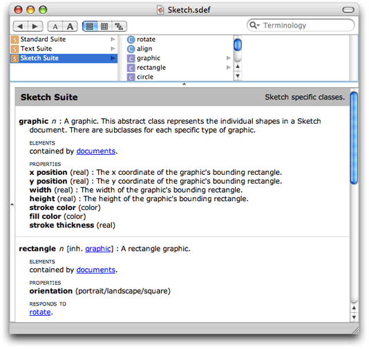
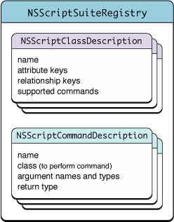
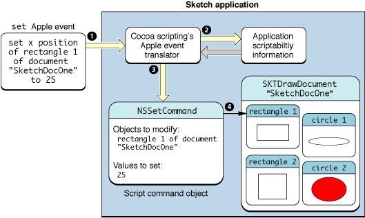

> 导航：[总目录](../../../README.md) · [documentation](../../../_indexes/documentation.md) · [Cocoa Scripting Guide](Introduction%20to%20Cocoa%20Scripting%20Guide.md)


[Next](Designing%20for%20Scriptability.md)[Previous](Introduction%20to%20Cocoa%20Scripting%20Guide.md)

# Overview of Cocoa Support for Scriptable Applications

This chapter provides an overview of Cocoa scripting and how your application takes advantage of it, and provides links to more detailed information in other chapters and documents.

A scriptable application is one that scripters can control with AppleScript scripts. To create a scriptable application, you specify a dictionary of terms that scripters can use with your application, implement classes and methods to support scriptable features, and provide a road map of scriptability information that AppleScript and Cocoa use to allow scripts to control the application.

_Cocoa scripting_ refers to the support provided by the Cocoa application framework for creating scriptable applications. It includes classes, categories, and scriptability information that specifies the supported AppleScript terminology and the class information needed to work with it.

Cocoa scripting makes use of standard mechanisms and design patterns used throughout Cocoa, including key-value coding (KVC) and Model-View-Controller (MVC). When an AppleScript command targets your application, the goal of the scripting support is to send the command directly to the application's model objects to perform the work. To do that, it relies on the KVC mechanism to get and set values in your application's scriptable model objects, based on a set of keys you define for them.

Through the use of these mechanisms, you can make your application scriptable with a minimum of additional code.

_AppleScript_ is a scripting language that makes possible direct control of scriptable applications and scriptable parts of the Mac OS (such as the Finder). The AppleScript language doesn’t supply an exhaustive or a task-specific terminology. Instead, it defines common commands, such as `get`, `set`, `make`, and `delete`, which can be applied to a wide variety of objects or their properties in a scriptable application. Scriptable applications define additional terms as needed for their unique operations.

A _scriptable application_ is one that makes its operations and data available in response to AppleScript messages, called Apple events. An _Apple event_ is a kind of interprocess message that can specify complex operations and data. Apple events make it possible to encapsulate a high-level task in a single package that can be passed across process boundaries, performed, and responded to with a reply event.

A scriptable application specifies the set of scripting terms it understands and provides information that AppleScript uses to compile scripts that use those terms. When a user executes a script that targets the application, Apple events are sent to the application. Apple events can also be sent by other applications and by the Mac OS.

Applications handle Apple events by registering with the Apple Event Manager for the events they expect to receive and by supplying handler routines to process the events. Cocoa scripting simplifies this process by automatically registering and responding to Apple events your application can handle, based on the scriptability information you supply. That means you don't need to write low-level code to interact with Apple events and the Apple Event Manager.

AppleScript and Apple events are built on the Open Scripting Architecture (OSA), which is described in [Open Scripting Architecture](https://developer.apple.com/library/archive/documentation/AppleScript/Conceptual/AppleScriptX/Concepts/osa.html#//apple_ref/doc/uid/TP40001571) in _[AppleScript Overview](../../Apple%20Script/AppleScript%20Overview/Introduction%20to%20AppleScript%20Overview.md#apple-f4xwc4dqnrsv64tfmyxwi33df52wszbpgeydambqge2tm2i)_.

Every scriptable application defines an _AppleScript object model_ to specify the classes of objects a scripter can work with in scripts, the accessible properties of those objects, and the inheritance and containment relationships for those classes. _Inheritance_ allows a class to access the properties of its ancestors. _Containment_ specifies where an object resides within the hierarchy of objects in the running application.

The objects in the object model often correspond closely to object classes in the application that implement scripting support, but there is no requirement that they do so. For example, a text application might provide script access to words in a document, but it would not be efficient for the application to maintain a corresponding object for each word.

Application classes have _attributes_, _to-one relationships_, and _to-many relationships_. AppleScript classes in the object model have _properties_ and _elements_—properties are synonymous with attributes and to-one relationships, while elements are synonymous with to-many relationships. For more information on these and related terms, see the [Glossary](Glossary.md#apple-f4xwc4dqnrsv64tfmyxwi33df52wszbpkridimbqgazdcnrufvbuqmrqfvjvomjs).

Figure 1-1 shows the object-model containment hierarchy for a specific document (shown in [Figure 1-2](#apple-f4xwc4dqnrsv64tfmyxwi33df52wszbpkridimbqgaytsnzwfvjvoni)) in the Sketch application. On the left are the objects a scripter uses to work with the application. On the right are the objects that Sketch uses to represent its object model.

__Figure 1-1__  Object-model containment hierarchy for Sketch application


In this object model, documents are elements of the application object and graphics are elements of document objects, while the name of a document is a property of the document. For a script to access an object in the hierarchy, it must locate the object within its containment hierarchy. (In the application, the `orderedDocuments` array is a to-many relationship of the [NSApplication](https://developer.apple.com/documentation/appkit/nsapplication) object.)

Consider, for example, the following sample script:

```
tell app "Sketch" to set the x position of rectangle 1 of document "SketchDocOne" to 25
```

This script specifies a rectangle, in a document, in the application. If applied to the following Sketch document, it would set the horizontal (x) position for whichever of the two rectangle shapes is first in the document's ordered list of graphics.

__Figure 1-2__  Sketch window with graphics



A script can ask for `rectangle 1 of document "SketchDocOne"` without having to specify either `graphics` or `documents` (though they are part of the hierarchy shown above) because an AppleScript class definition implicitly specifies the relationships of its contained elements.

Sketch's object model uses inheritance for its graphics objects. All such objects (`rectangle`, `circle`, `image`, `line`, and `text area`) inherit from a common ancestor (`graphic`). Thus the term `graphic 1 of document "SketchDocOne"` might specify the same object as `rectangle 1 of document "SketchDocOne"`, depending on the ordering of the objects in the graphics array.

A scriptable application supplies _scriptability information_ that formally lays out the AppleScript object model for the application and maps it to application objects. This scriptability information does two things:

- It specifies the terminology available for use in scripts that target the application and supplies comments on the purpose and usage for that terminology.
- It provides information, used by AppleScript and by Cocoa, about how support for that terminology is implemented in the application.

  This information includes the KVC keys that Cocoa scripting uses to gain access to attribute and relationship information in the application's classes. Without these keys, scripts would not be able to manipulate properties of scriptable objects in the application's object model.

To uniquely identify terms in its scriptability information, an application uses constants called four-character codes (or Apple event codes). A _four-character code_ is just four bytes of data that can be expressed as a string of four characters in the Mac OS Roman encoding. These codes are described in [Code Constants Used in Scriptability Information](Preparing%20a%20Scripting%20Definition%20File.md#apple-f4xwc4dqnrsv64tfmyxwi33df52wszbpkridimbqgaytsnzxfuytcnbugi2tc).

Within an application's scriptability information, terminology associated with related functionality (for example, operations involving text, graphics, or databases) are generally collected into _suites_. Cocoa provides the predefined suites described in [Built-in Support for Standard and Text Suites](#apple-f4xwc4dqnrsv64tfmyxwi33df52wszbpkridimbqgaytsnzwfuytcnjwgu4dk).

AppleScript uses the application’s scriptability information, including four-character codes, to compile scripts and send Apple events to the application. Cocoa uses the information to interpret received Apple events and create script command objects to perform the specified operations.

You define your application’s scriptability information using one of two formats. The first is the _scripting definition_ or _sdef_ format. This is an XML-based format that describes a set of scriptability terms and the commands, classes, constants, and other information that describe the application's scriptability. The sdef format was introduced in OS X version 10.2 and is used natively by Cocoa starting in OS X version 10.4. In the sdef format, an application's scriptability information is contained in a single _scripting definition (or sdef) file_, with the extension `.sdef`. The word _sdef_ can be used to describe either the format or a file in that format.

A second, older format uses property list files and is referred to as the _script suite_ format. It supplies Cocoa and AppleScript with roughly the same information, in the form of a script suite file and a corresponding script terminology file:

- A _script suite file_ describes scriptable objects in terms of their attributes, relationships, and supported commands, and has the extension `.scriptSuite`.
- A _script terminology file_ provides AppleScript terminology—the English-like words and phrases a scripter can use in a script—for the class and command descriptions in the corresponding script suite file. Script terminology files have the extension `.scriptTerminology`.

Defining scriptability information with either of these formats is a bit like defining your application interface with nib files, though you work with text rather than a graphic editor. In both cases you provide information up front that Cocoa uses at specific times to create objects and provide support for the task at hand. The information from an sdef (or the older property list form) is loaded just once per application launch, as described in [Loading Scriptability Information](#apple-f4xwc4dqnrsv64tfmyxwi33df52wszbpkridimbqgaytsnzwfvjvomi). The loaded information is then used as needed to create script command objects to perform scriptable operations.

A scripting definition file follows the XML format defined in the sdef man page and described in more detail in [Preparing a Scripting Definition File](Preparing%20a%20Scripting%20Definition%20File.md#apple-f4xwc4dqnrsv64tfmyxwi33df52wszbpkridimbqgaytsnzzfvbeeq2cineuuri). Figure 1-3 shows the main XML elements in an sdef file.

__Figure 1-3__  Structure of an sdef file


As an example of specific sdef elements, Listing 1-1 shows the `graphic` and `rectangle` definitions from Sketch's sdef file. The `graphic` class defines several properties (such as `x position` and `y position`) that are inherited by other shape classes. The `rectangle` class adds an `orientation` property and specifies that the object responds to the `rotate` command, which is specific to rectangles.

__Listing 1-1__  Graphic and rectangle elements from Sketch's sdef file

```
... (from the Sketch suite)
<class name="graphic" code="grph"
    description="A graphic. This abstract class represents the
        individual shapes in a Sketch document.
        There are subclasses for each specific type of graphic.">
    <cocoa class="SKTGraphic"/>
    <property name="x position" code="xpos" type="real"
        description="The x coordinate of the graphic's bounding rectangle."/>
    <property name="y position" code="ypos" type="real"
        description="The y coordinate of the graphic's bounding rectangle."/>
    <property name="width" code="widt" type="real"
        description="The width of the graphic's bounding rectangle."/>
... (some properties omitted)
</class>
<class name="rectangle" code="d2rc" inherits="graphic"
        description="A rectangle graphic.">
    <cocoa class="SKTRectangle"/>
    <property name="orientation" code="orin" type="orientation"/>
    <responds-to name="rotate">
        <cocoa method="rotate:"/>
    </responds-to>
</class>
```


Users typically examine scripting terminology in a dictionary viewer to discover which features are scriptable and how to script an application. You can view the scripting terminology for a scriptable application with Script Editor or Xcode. Figure 1-4 shows the sdef file from the Sketch application in a dictionary viewer, with the graphic and rectangle classes visible.

__Figure 1-4__  An sdef displayed in a dictionary viewer



Double-clicking an sdef file in the Finder opens it in a dictionary viewer like the one shown above. Double-clicking an sdef file in an Xcode project similarly opens it in a dictionary viewer window. To view or edit the XML for the file, open the sdef file with any plain text editor; in Xcode, select the sdef file and choose File > Open As > Plain Text File.

For related information, see [Editing Scriptability Information](Evolution%20of%20Cocoa%20Scriptability%20Information.md#apple-f4xwc4dqnrsv64tfmyxwi33df52wszbpkridimbqgazdcnrufvbuqmjzfvjvonq).

A scriptable application typically supports certain standard AppleScript terms, such as the `count` and `make` commands and the `application` class. Cocoa provides built-in support for these terms in the _Standard suite_. It also provides command classes, including [NSCountCommand](https://developer.apple.com/documentation/foundation/nscountcommand) and [NSCreateCommand](https://developer.apple.com/documentation/foundation/nscreatecommand), to implement standard commands. In addition, classes such as [NSApplication](https://developer.apple.com/documentation/appkit/nsapplication) and [NSDocument](https://developer.apple.com/documentation/appkit/nsdocument) implement certain aspects of standard scripting support.

Cocoa scripting also provides support for the `get` and `set` commands, including implementation of the command classes [NSGetCommand](https://developer.apple.com/documentation/foundation/nsgetcommand) and [NSSetCommand](https://developer.apple.com/documentation/foundation/nssetcommand). These commands are not part of the Standard suite, but are considered built-in AppleScript commands. Allowing scripters to get and set the values of properties and elements of scriptable objects is a key part of making an application scriptable.

The Standard suite defines the following AppleScript commands: (for all classes) `copy`, `count`, `create`, `delete`, `exists`, and `move`; (for documents and windows) `print`, `save`, `close`. Note that there is no default implementation for the `print` command—see [Print](How%20Cocoa%20Applications%20Handle%20Apple%20Events.md#apple-f4xwc4dqnrsv64tfmyxwi33df52wszbpgiydambrgiztsljrgezdenzqgy) for information on how to support printing.

To support text-related classes such as `rich text`, `word`, and `paragraph`, Cocoa implements the _Text suite_.

Cocoa’s built-in support for the Standard and Text suites is described in more detail in [Use the Document Architecture](Implementing%20a%20Scriptable%20Application.md#apple-f4xwc4dqnrsv64tfmyxwi33df52wszbpgiydambqgaztoljrga4dsmjqgu) and [Access the Text Suite](Implementing%20a%20Scriptable%20Application.md#apple-f4xwc4dqnrsv64tfmyxwi33df52wszbpgiydambqgaztoljrgaydcobsga). To include it in your application, you follow the steps described in [Turn On Scripting Support in Your Application](Implementing%20a%20Scriptable%20Application.md#apple-f4xwc4dqnrsv64tfmyxwi33df52wszbpgiydambqgaztoljrga4dcmbugy).

Cocoa scripting provides built-in support for basic AppleScript types and automatically associates them with appropriate Cocoa data types, as shown in Table 1-1. You can use these types without declaring them in your sdef file.

__Table 1-1__  Support for basic AppleScript types

| AppleScript type | Cocoa type | Code |
| `any` | [NSAppleEventDescriptor](https://developer.apple.com/documentation/foundation/nsappleeventdescriptor) | `"****"` |
| `boolean` | [NSNumber](https://developer.apple.com/library/archive/documentation/LegacyTechnologies/WebObjects/WebObjects_3.5/Reference/Frameworks/ObjC/Foundation/Classes/NSNumber/Description.html#//apple_ref/occ/cl/NSNumber) | `"bool"` |
| `date` | [NSDate](https://developer.apple.com/library/archive/documentation/LegacyTechnologies/WebObjects/WebObjects_3.5/Reference/Frameworks/ObjC/Foundation/Classes/NSDateClassCluster/Description.html#//apple_ref/occ/cl/NSDate) | `"ldt "` |
| `file` | [NSURL](https://developer.apple.com/documentation/foundation/nsurl) | `"file"` |
| `integer` | [NSNumber](https://developer.apple.com/library/archive/documentation/LegacyTechnologies/WebObjects/WebObjects_3.5/Reference/Frameworks/ObjC/Foundation/Classes/NSNumber/Description.html#//apple_ref/occ/cl/NSNumber) | `"long"` |
| `location specifier` | [NSPositionalSpecifier](https://developer.apple.com/documentation/foundation/nspositionalspecifier) | `"insl"` |
| `number` | [NSNumber](https://developer.apple.com/library/archive/documentation/LegacyTechnologies/WebObjects/WebObjects_3.5/Reference/Frameworks/ObjC/Foundation/Classes/NSNumber/Description.html#//apple_ref/occ/cl/NSNumber) | `"nmbr"` |
| `point` | [NSData](https://developer.apple.com/library/archive/documentation/LegacyTechnologies/WebObjects/WebObjects_3.5/Reference/Frameworks/ObjC/Foundation/Classes/NSDataClassCluster/Description.html#//apple_ref/occ/cl/NSData) containing a QuickDraw `Point` | `"QDpt"` |
| `real` | [NSNumber](https://developer.apple.com/library/archive/documentation/LegacyTechnologies/WebObjects/WebObjects_3.5/Reference/Frameworks/ObjC/Foundation/Classes/NSNumber/Description.html#//apple_ref/occ/cl/NSNumber) | `"doub"` |
| `record` | [NSDictionary](https://developer.apple.com/library/archive/documentation/LegacyTechnologies/WebObjects/WebObjects_3.5/Reference/Frameworks/ObjC/Foundation/Classes/NSDictionaryClassClstr/Description.html#//apple_ref/occ/cl/NSDictionary)  This type is used as the type of the `properties` property for the `item` class, and the type of the `with properties` parameters of the `duplicate` and `make` commands. Declaring something to be of type `record` doesn't provide enough information to convert Apple event record descriptors to `NSDictionary` objects, so various Cocoa scripting command classes have special code to handle that situation. In your code, instead of using the `record` type, you should declare specific record types (see [Record-Type Elements](Preparing%20a%20Scripting%20Definition%20File.md#apple-f4xwc4dqnrsv64tfmyxwi33df52wszbpkridimbqgaytsnzxfuytcmzrgm3dc)) and use those for `class` properties and `command` parameters. | `"reco"` |
| `rectangle` | [NSData](https://developer.apple.com/library/archive/documentation/LegacyTechnologies/WebObjects/WebObjects_3.5/Reference/Frameworks/ObjC/Foundation/Classes/NSDataClassCluster/Description.html#//apple_ref/occ/cl/NSData) containing a QuickDraw `Rect` | `"qdrt"` |
| `specifier` | [NSScriptObjectSpecifier](https://developer.apple.com/documentation/foundation/nsscriptobjectspecifier) | `"obj "` |
| `text` | [NSString](https://developer.apple.com/library/archive/documentation/LegacyTechnologies/WebObjects/WebObjects_3.5/Reference/Frameworks/ObjC/Foundation/Classes/NSStringClassCluster/Description.html#//apple_ref/occ/cl/NSString)   - Internally, Cocoa scripting always uses Unicode text when converting to get information from or add it to an Apple event. | `"ctxt"` |
| `type` | [NSNumber](https://developer.apple.com/library/archive/documentation/LegacyTechnologies/WebObjects/WebObjects_3.5/Reference/Frameworks/ObjC/Foundation/Classes/NSNumber/Description.html#//apple_ref/occ/cl/NSNumber) | `"type"` |

When an application first needs to work with scriptability information, Cocoa scripting uses a global instance of [NSScriptSuiteRegistry](https://developer.apple.com/documentation/foundation/nsscriptsuiteregistry) to load information from the application's sdef file:

- For each class described in the sdef file, it instantiates a class description object ([NSScriptClassDescription](https://developer.apple.com/documentation/foundation/nsscriptclassdescription)) that stores information about objects of that type.

  This information includes the KVC keys that Cocoa scripting uses to access values of the application's scriptable objects.
- For each script command described in the sdef file, it registers a handler routine for Apple events that specify that command.

  It also instantiates a command description object ([NSScriptCommandDescription](https://developer.apple.com/documentation/foundation/nsscriptcommanddescription)) that stores information such as the name of the scripting command class to instantiate to perform the command, as well as the command's arguments, and return type (if any).

Figure 1-5 shows the loaded class and command descriptions for an application. Cocoa uses the information to create instances of command classes and descriptions of application objects that it needs to handle Apple events received by the application.

__Figure 1-5__  An application's loaded scriptability information



Application scriptability information automatically includes information to support the basic AppleScript types listed in [Table 1-1](#apple-f4xwc4dqnrsv64tfmyxwi33df52wszbpkridimbqgaytsnzwfvjvomjr) and to make the `get` and `set` commands available to all applications.

_Key-value coding (KVC)_ is a mechanism for accessing object properties indirectly by key. A _key_ is just a string that identifies a property, such as `"xPosition"` for the horizontal coordinate of a graphic object (shown in [Listing 1-1](#apple-f4xwc4dqnrsv64tfmyxwi33df52wszbpkridimbqgaytsnzwfvjvona)). The KVC API provides a generic way to query an object for the values of its keys and to set new values for those keys.

Cocoa scripting relies on KVC for the following purposes:

- Command objects use KVC to find the specified scriptable objects on which to operate.
- For many commands, Cocoa uses KVC to access properties of the specified objects to get or set their values.

As you design the object classes for your application, you also define keys for their scriptable properties. Your application provides these keys in `class` definitions in its sdef file. Then, when you implement accessor methods (or declare instance variables) that correspond to these keys, you make it possible for Cocoa scripting and KVC to get and set the corresponding values.

Default naming for keys is described in [Provide Keys for Key-Value Coding](Implementing%20a%20Scriptable%20Application.md#apple-f4xwc4dqnrsv64tfmyxwi33df52wszbpgiydambqgaztolktk4yq). For information on naming accessor methods, see [Maintain KVC Compliance](Getting%20and%20Setting%20Properties%20and%20Elements.md#apple-f4xwc4dqnrsv64tfmyxwi33df52wszbpkridimbqgazdcnrufvbuqmjyfvjvona).

Cocoa scripting, Cocoa bindings, and Core Data are three development technologies available in OS X that rely on key-value coding:

- Cocoa scripting, described throughout this document, provides support for creating scriptable applications.
- The Core Data framework provides generalized and automated solutions to common tasks associated with object life-cycle and object graph management, including persistence. It is described in detail in _[Core Data Programming Guide](https://developer.apple.com/library/archive/documentation/Cocoa/Conceptual/CoreData/index.html#//apple_ref/doc/uid/TP40001075)_.
- Cocoa bindings provides a means of keeping model and view values synchronized, without having to write a lot of "glue code," such that a change in one is reflected in the other. It is described in detail in _[Cocoa Bindings Programming Topics](../Cocoa%20Bindings%20Programming%20Topics/Introduction%20to%20Cocoa%20Bindings%20Programming%20Topics.md#apple-f4xwc4dqnrsv64tfmyxwi33df52wszbpgeydambqge3do2i)_.

As noted, all three of these technologies rely on KVC, so you will gain by making your application KVC-compliant. Cocoa bindings and Core Data also make use of key-value observing, but Cocoa scripting does not.

While these technologies are not closely tied together, here are some rules of thumb that may aid in combining their use:

- Core Data and Cocoa bindings: These technologies neither aid nor interfere with each other, so you can mix them as needed for your application.
- Core Data and Cocoa scripting: Because Cocoa scripting deals in ordered to-many relationships, and Core Data deals in unordered to-many relationships, you must do extra work to expose the to-many relationships of your managed objects as scriptable element classes. For each managed-object to-many relationship that you want to make scriptable, you can add an unmanaged, derived, to-many relationship solely for access by Cocoa scripting. For information about how to implement these derived to-many relationships, see "Indexed Accessor Patterns for To-Many Properties" in [Key-Value Coding Accessor Methods](../Key-Value%20Coding%20Programming%20Guide/AccessorConventions.md#apple-f4xwc4dqnrsv64tfmyxwi33df52wszbpgiydambsge3ti) in _[Key-Value Coding Programming Guide](https://developer.apple.com/library/archive/documentation/Cocoa/Conceptual/KeyValueCoding/index.html#//apple_ref/doc/uid/10000107i)_ and [Getting and Setting Properties and Elements](Getting%20and%20Setting%20Properties%20and%20Elements.md#apple-f4xwc4dqnrsv64tfmyxwi33df52wszbpkridimbqgazdcnrufvbuqmjyfvjvomi) in this document.
- Cocoa scripting and Cocoa bindings: Again, these technologies neither aid nor interfere with each other. If you're using bindings but not Core Data, you probably have ordered relationships, which will work with Cocoa scripting.

For related information, see [Interaction With Key-Value Observing](Getting%20and%20Setting%20Properties%20and%20Elements.md#apple-f4xwc4dqnrsv64tfmyxwi33df52wszbpkridimbqgazdcnrufvbuqmjyfvjvomjq).

Scriptable applications should generally support undo of scripted operations as they would any user-initiated operation. That is, after a script causes the application to perform one or more operations, a user should be able to sequentially undo the operations in the normal manner.

Cocoa scripting provides no special support for undo, but neither does it interfere with normal undo operations. Applications that take advantage of the Model-View-Controller paradigm and Cocoa's key-value coding mechanism, as scriptable applications are designed to do, are well-positioned to support both scriptability and undo.

For more information on supporting undo, see _[Undo Architecture](../Undo%20Architecture/Introduction%20to%20Undo%20Architecture.md#apple-f4xwc4dqnrsv64tfmyxwi33df52wszbpgeydambqgayta2i)_.

The work done by your scriptable application is divided between the application and Cocoa scripting. Your application implements classes and methods that perform its scriptable operations; it also provides information that describes its scriptability. Cocoa receives Apple events and uses your scriptability information to interpret them and perform the specified operations, calling on your code to do the actual work.

Here is a summary of how this process works:

1. The application defines scriptability information (in an sdef file, or in the older style script suite and script terminology files) that includes both the terms a scripter can use and the application information for supporting those terms. This information typically includes the Standard suite (implemented by Cocoa scripting), which supports standard AppleScript commands and classes.

   The application defines classes for the scriptable objects it supports and provides keys for their scriptable properties and elements. It also defines additional script command classes if it has scriptable operations that can't be performed by one of the standard command classes provided by Cocoa.

   Scriptability is generally provided through the application's model objects (in terms of the Model-View-Controller paradigm).
2. The application is key-value coding (KVC) compliant in naming the instance variables or accessor methods for the scriptable properties and elements of its scriptable classes.
3. For each scriptable class, the application implements an object specifier method, which locates a scriptable object of that type within the application’s containment hierarchy.
4. The application’s `Info.plist` file has entries that activate Cocoa scripting and specify an sdef file, as shown in [Turn On Scripting Support in Your Application](Implementing%20a%20Scriptable%20Application.md#apple-f4xwc4dqnrsv64tfmyxwi33df52wszbpgiydambqgaztoljrga4dcmbugy).
5. When it is first needed, Cocoa loads the application's scriptability information and automatically registers event handlers for the supported commands.
6. When the application receives an Apple event for a registered command, Cocoa instantiates a script command object containing all the information needed to identify the application objects on which the command should operate. All command objects use KVC to locate the specified scriptable objects to operate on.

   Cocoa then executes the command, which sends messages to the appropriate application objects to perform the work. For many commands, Cocoa uses KVC to get or set values of the specified objects.
7. When a command needs to return a value, Cocoa scripting packages the information in a reply Apple event and returns it.

   If an error occurs while executing the command, Cocoa returns the error information (including any information added by the application) in the reply Apple event. For details, see [Error Handling](Script%20Commands.md#apple-f4xwc4dqnrsv64tfmyxwi33df52wszbpgiydambrgi2delktk4zq).
8. If a command requires asynchronous processing (such as the gathering of information through a sheet), the application can suspend it, so that the application doesn't receive additional Apple events during processing. For details, see [Suspending and Resuming Apple Events and Script Commands](How%20Cocoa%20Applications%20Handle%20Apple%20Events.md#apple-f4xwc4dqnrsv64tfmyxwi33df52wszbpgiydambrgiztsljrgeztinzxha).

To track a scripting command from the execution of an AppleScript script to the operation it performs in the targeted application, consider again the following one-line script, which attempts to set a value in a document of the Sketch application:

```
tell app "Sketch" to set the x position of rectangle 1 of document "SketchDocOne" to 25
```

When this script is compiled against Sketch's scriptability information and executed, it results in an Apple event being sent to the Sketch application. The Apple event encapsulates the `set` command and specifies an operation on an object in the `"SketchDocOne"` document shown in [Figure 1-2](#apple-f4xwc4dqnrsv64tfmyxwi33df52wszbpkridimbqgaytsnzwfvjvoni). Figure 1-6 illustrates the actions that result when the application receives the `set` Apple event.

__Figure 1-6__  A Cocoa application responding to an Apple event



Here is a description of the steps shown in this figure:

1. The application receives the Apple event specifying a `set` command.
2. The _Apple event translator_, a part of Cocoa scripting, uses scriptability information supplied by the application to evaluate the Apple event. This information is pictured in more detail in [Figure 1-5](#apple-f4xwc4dqnrsv64tfmyxwi33df52wszbpkridimbqgaytsnzwfvjvomq).
3. The translator creates an instance of an `NSSetCommand` script command and initializes it with the information need to perform the command:

   - The direct parameter of the `set` command specifies the object or objects to set the value for (in this case, the first rectangle), and becomes the receivers specifier in the `NSSetCommand` object.
   - The `to` parameter provides the value to set (in this case, `25`) and becomes the "Value" argument in the `NSSetCommand` object.

   These values are stored in the command object as an argument dictionary. For information on how your application works with that information, see [Script Command Components](Script%20Commands.md#apple-f4xwc4dqnrsv64tfmyxwi33df52wszbpgiydambrgi2delktk4ytk).
4. When the `set` command is executed, it uses KVC to locate the specified object or objects. It also relies on KVC to set the specified value. For additional detail, see [Getting and Setting Properties and Elements](Getting%20and%20Setting%20Properties%20and%20Elements.md#apple-f4xwc4dqnrsv64tfmyxwi33df52wszbpkridimbqgazdcnrufvbuqmjyfvjvomi).

   Some commands return a value, but the `set` command does not.

As this example and the information in [Snapshot of Cocoa Scripting](#apple-f4xwc4dqnrsv64tfmyxwi33df52wszbpkridimbqgaytsnzwfvjvonq) show, an application can support the `set` command with a relatively modest effort: it modifies its `Info.plist` file to indicate it is scriptable and to specify its sdef file; it provides command and class information in the sdef file; and it maintains KVC compliance for scriptable properties in its scriptable classes.

If the application also implements an `objectSpecifier` method for each of its scriptable classes, it can support the `get` command as well. Cocoa scripting uses KVC to get the specified value from the application and package it up in a return Apple event.

As a result, an application can rather quickly supply a great deal of scriptability just by supporting `get` and `set` access to properties of a few key objects.

There are some scripting-related features for which Cocoa scripting currently provides little or no support.

- Sending individual Apple events. Applications might want to send events to other scriptable applications or to themselves to obtain data or services or to support recording (see next item).

  However, Cocoa applications are free to use C functions from the Apple Event Manager. So, for example, your application could use an instance of [NSAppleEventDescriptor](https://developer.apple.com/documentation/foundation/nsappleeventdescriptor) to assemble the information for an Apple event, invoke the `aeDesc` method to get an Apple event data structure, and use that structure with the C functions described in _[Apple Events Programming Guide](../../Apple%20Script/Apple%20Events%20Programming%20Guide/Introduction%20to%20Apple%20Events%20Programming%20Guide.md#apple-f4xwc4dqnrsv64tfmyxwi33df52wszbpkridimbqgaytinbz)_ to send the Apple event.
- Recording. A recordable application sends itself Apple events, which can be assembled by the Script Editor application into a script that “records” the user’s actions (when recording is turned on in Script Editor).

Cocoa scripting does not currently enforce the `read/write` status specified in an sdef, so marking a property as read-only does not ensure that it cannot be written. (Read/write access is described in [Property Elements](Preparing%20a%20Scripting%20Definition%20File.md#apple-f4xwc4dqnrsv64tfmyxwi33df52wszbpkridimbqgaytsnzzfuytcnbvgqydm).)

[Next](Designing%20for%20Scriptability.md)[Previous](Introduction%20to%20Cocoa%20Scripting%20Guide.md)

