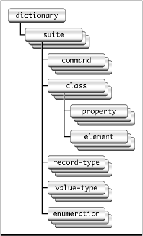

> 导航：[总目录](../../../README.md) · [documentation](../../../_indexes/documentation.md) · [Cocoa Scripting Guide](Introduction%20to%20Cocoa%20Scripting%20Guide.md)


[Next](Getting%20and%20Setting%20Properties%20and%20Elements.md)[Previous](Implementing%20a%20Scriptable%20Application.md)

# Preparing a Scripting Definition File

This chapter describes the steps you take to create a new scripting definition file and add scriptability information for your Cocoa application.

This chapter uses examples from the sdef file `Sketch.sdef` from the Sketch sample application, available from Apple.

For definitions of terms such as _property_ and _element_ used throughout this chapter, see the [Glossary](Glossary.md#apple-f4xwc4dqnrsv64tfmyxwi33df52wszbpkridimbqgazdcnrufvbuqmrqfvjvomjs).

A scripting definition file provides a statically stored representation of a set of scriptability terms and the classes, constants, and other information used to support an application's scriptability. Here is another look at the organization of the main XML structures used in the sdef format. All valid sdef files follow this structure, differing primarily in the contents of the application-specific `suite` elements. 

__Figure 4-1__  Structure of an sdef file, revisited



Four-character codes (or _Apple event codes_, or simply _codes_), are used throughout AppleScript to identify various kinds of information. A _four-character code_ is just four bytes of data that can be expressed as a string of four characters in the Mac OS Roman encoding. For example, `'docu'` is the code that specifies the `document` class. The codes defined by Apple and the header files in which they are defined are described in “Apple Event Constants” in [Building an Apple Event](https://developer.apple.com/library/archive/documentation/AppleScript/Conceptual/AppleEvents/building_aes_aepg/building_aes_aepg.html#//apple_ref/doc/uid/TP40001449-CH203) in _[Apple Events Programming Guide](../../Apple%20Script/Apple%20Events%20Programming%20Guide/Introduction%20to%20Apple%20Events%20Programming%20Guide.md#apple-f4xwc4dqnrsv64tfmyxwi33df52wszbpkridimbqgaytinbz)_. They are also documented in _[Apple Event Manager Reference](https://developer.apple.com/documentation/applicationservices/apple_event_manager)_ and _[AppleScript Terminology and Apple Event Codes Reference](https://developer.apple.com/library/archive/releasenotes/AppleScript/ASTerminology_AppleEventCodes/TermsAndCodes.html#//apple_ref/doc/uid/TP40004532)_.

You use codes in your sdef file to identify scriptable commands, classes, properties, elements, and other items your application supports. When choosing a code, use an existing code from one of the Apple headers for a standard object—for example, use `'capp'` for an application object. If you need to refer to the value in your code, you can use the corresponding Apple constant `cApplication`, but in the sdef you simply use the string literal (`'capp'`). For new codes you define, you can define a corresponding constant, if necessary.

You should always use a given code with the same term, and vice versa. While it is possible to use a term-code pair for different items (for example, to have a property with the same name as a class), this won't work for all elements, and you may want to avoid such reuse. Your codes do not have to be unique with respect to those used in other applications; in fact, as noted above, it is recommended that you use Apple-defined values for standard items.

Except for the `dictionary` element (described below), most XML elements in an sdef have a name, a code (or pair of codes), and a description. They may also include documentation and implementation information. XML elements with the `cocoa` tag (described in [Cocoa Elements](#apple-f4xwc4dqnrsv64tfmyxwi33df52wszbpkridimbqgaytsnzxfuytcnbxgazta)) contain a particular kind of implementation information for Cocoa scripting. Some elements can be marked as hidden, meaning they won’t be displayed when the dictionary is viewed in Script Editor or Xcode, although they will be implemented. Elements can also include synonyms, which define an alternate term or code for the main element.

An XML element in an sdef may refer to any other element in the sdef, regardless of whether they are defined in the same `suite` element. For example, the `word` class defined in the Text suite can be referred to in any other XML elements in any other suites in the same sdef file.

All sdef files used to supply Cocoa scriptability information contain the high-level XML elements described in the following sections.

The first two lines of an sdef file, shown in the following listing, specify the XML version and DTD (document type definition) file for the sdef format. You don't change these lines.

__Listing 4-1__  Version and document type in an sdef file

```xml
<?xml version="1.0" encoding="UTF-8"?>
<!DOCTYPE dictionary SYSTEM "file://localhost/System/Library/DTDs/sdef.dtd">
```


The root XML element in an sdef file is a `dictionary` element. A dictionary defines all the scriptability information for one application. Every sdef file you create should contain one dictionary definition. You typically name the dictionary after the application.

A `dictionary` element contains one or more `suite` elements. Most Cocoa applications include Cocoa’s default suites (the Standard and Text suites), as well as one or more suites of their own scriptability information.

The following listing shows the format for a `dictionary` element.

__Listing 4-2__  A dictionary element from an sdef file

```
<dictionary title="Sketch Terminology">
    <!--
        Contains one or more suite XML elements.
    -->
</dictionary>
```


A suite is a collection of related scriptability information. For example, Cocoa's Standard suite contains default commands, enumerations, and other information, along with Cocoa scriptability information used to implement support for the standard AppleScript commands. Cocoa also implements a Text suite.

Your application supplies its own scriptability information in one or more `suite` XML elements. For example, if your application provides scripting support for graphics-related features and database-related features, you can provide separate graphics and database suites.

For most applications, the sdef should also include a `suite` element for the Standard suite and possibly the Text suite as well. You can copy these suites from Sketch's sdef file, then delete the XML definitions for commands, classes, and other items not supported by your application so they won't be displayed in your dictionary. For example, if your application does not support printing, you should delete the elements for the `print` command and the `print settings` record-type. Otherwise, users will see those terms when they view your application terminology and will expect the application to support them.

A `suite` element contains one or more of the following elements: `class`, `command`, `enumeration`, `record-type`, and `value-type`. These elements are described in [Add Information to the Scripting Definition File](#apple-f4xwc4dqnrsv64tfmyxwi33df52wszbpkridimbqgaytsnzxfuytcnbtgi4do).

The following listing (from Sketch's sdef file) shows the XML format for a `suite` element.

__Listing 4-3__  A suite element for the Sketch suite

```
<suite name="Sketch Suite" code="sktc"
        description="Sketch specific classes.">
    <!--
        Contains one or more of the following sdef elements:
            class, command, enumeration, record-type, and value-type
    -->
</suite>
```


One option for creating an sdef file is to simply take an existing sdef, such as the one distributed with the Sketch application, and modify it for your application. You can do that with the following steps:

1. Copy the file `Sketch.sdef` and rename it for your application (for example, `MyApplication.sdef`).
2. Edit the sdef file in a text editor (in Xcode, select the file and choose File > Open As > Plain Text File to open the sdef as plain text). Rename the Sketch `dictionary` element, so it looks something like the following:

```
<dictionary title="MyApplication Terminology">
```
3. Rename the Sketch `suite` element and change its code, so that it looks something like the following:

```
<suite name="MyApplication Suite" code="MyAp"
    description="MyApplication information.">
```
4. Replace the scriptability information in the renamed `suite` element with the information for your application, as described in [Add Information to the Scripting Definition File](#apple-f4xwc4dqnrsv64tfmyxwi33df52wszbpkridimbqgaytsnzxfuytcnbtgi4do).

Creating an sdef file from scratch is quite similar, and also includes copying information for the Standard and Text suites. To create a new sdef file:

1. Create a plain text file with the extension `.sdef` (for example, `MyApplication.sdef`).
2. Add XML version and document type information. (All sdef files start with this information.)


```xml
<?xml version="1.0" encoding="UTF-8"?>
<!DOCTYPE dictionary SYSTEM "file://localhost/System/Library/DTDs/sdef.dtd">
```
3. Your sdef must contain a `dictionary` element as the root element. The dictionary is typically named after your application, as shown in previous steps. The complete `dictionary` element from Sketch is shown in [Dictionary Element](#apple-f4xwc4dqnrsv64tfmyxwi33df52wszbpkridimbqgaytsnzzfuytcmrwhe4dq).
4. If your application supports any of the commands, classes, or other scriptability information defined in the Standard and Text suites, as most do, you should copy the `suite` elements for those suites into your sdef from an existing sdef file, such as `Sketch.sdef`.

   For more information, see [Suite Elements](#apple-f4xwc4dqnrsv64tfmyxwi33df52wszbpkridimbqgaytsnzxfuytcmrxga2tq).
5. Add one or more `suite` elements for your application’s scriptability information.
6. Fill in the scriptability information in the `suite` element (or elements) for your application by adding whichever of the following kinds of XML elements your application uses:

   1. Classes (see [Class Elements](#apple-f4xwc4dqnrsv64tfmyxwi33df52wszbpkridimbqgaytsnzxfuytcmrxge2dg))
   2. Commands (see [Command Elements](#apple-f4xwc4dqnrsv64tfmyxwi33df52wszbpkridimbqgaytsnzxfuytcmrzgezte))
   3. Enumerations (see [Enumeration Elements](#apple-f4xwc4dqnrsv64tfmyxwi33df52wszbpkridimbqgaytsnzxfuytcnbwguzds))
   4. Simple structures (see [Record-Type Elements](#apple-f4xwc4dqnrsv64tfmyxwi33df52wszbpkridimbqgaytsnzxfuytcmzrgm3dc))
   5. Simple types (see [Value-Type Elements](#apple-f4xwc4dqnrsv64tfmyxwi33df52wszbpkridimbqgaytsnzxfuytcmzqgyytc))

   Your suite elements can refer to definitions from the Standard or Text suites that you've copied into your sdef.

To add an sdef file to the project for your application, see [Add the Scripting Definition File to Your Xcode Project](Implementing%20a%20Scriptable%20Application.md#apple-f4xwc4dqnrsv64tfmyxwi33df52wszbpgiydambqgaztoljrga4dcnzzg4).

The following sections provide descriptions and examples of the XML elements you’ll most commonly add to the sdef file for your application. These examples are based on the sdef file from the Sketch sample application, available from Apple.

As you add information to your sdef file, you can verify that the file is still valid at each step. Later, when testing your application, you can examine the information that Cocoa scripting extracts from your sdef file. For information on how to perform these steps, see [Debugging Scriptability Information](Testing%2C%20Debugging%2C%20and%20Performance.md#apple-f4xwc4dqnrsv64tfmyxwi33df52wszbpkridimbqgaytsobrfuytaobtgu2tq).

You'll need to add a `class` element to your sdef file for each type of scriptable object in your AppleScript object model—that is, for the objects scripters can access in scripts. A `class` element defines an object class by listing the properties, elements, and supported commands for instances of that class. Using the `rich text` class from the Text suite as an example, here is the information you supply in a `class` element:

- A human-readable name and description, which a scripter can view in the application's dictionary, as well as a four-character code to identify the class. It may optionally specify a plural spelling:

```
<class name="rich text" plural="rich text" code="ricT" description="Rich (styled) text">
```

  If the plural name is omitted, it defaults to the name of the class with `'s'` appended.
- The Cocoa or application Objective-C class that implements the class:

```
<cocoa class="NSTextStorage"/>
```
- The commands the class can respond to, listed in a `responds-to` element. The `rich text` class doesn't contain a responds-to element, but here is an example for Sketch's rectangle class, which handles the `rotate` command with the `rotate:` method:

```
<responds-to name="rotate">
    <cocoa method="rotate:"/>
</responds-to>
```

  When Cocoa instantiates a command object to perform an AppleScript command (such as `rotate`), if the command operates on an object (such as a `rectangle`) whose class definition includes a `responds-to` entry, the command invokes the method specified in that entry (`rotate:`).

  A class can respond to the standard AppleScript commands, such as `count`, `move`, `delete`, and so on, without listing them in a `responds-to` element. For more information, see [Script Commands Overview](Script%20Commands.md#apple-f4xwc4dqnrsv64tfmyxwi33df52wszbpgiydambrgi2delktk42a).
- A class also specifies its properties, elements, and possibly contents (described in subsequent sections).

The following listing shows the full `class` definition for the `rich text` class.

__Listing 4-4__  A class element for the rich text class

```
<class name="rich text" plural="rich text" code="ricT"
        description="Rich (styled) text">
    <cocoa class="NSTextStorage"/>
    <type type="text"/>
    <property name="color" code="colr" type="RGB color"
        description="The color of the first character.">
        <cocoa key="foregroundColor"/>
    </property>
    <property name="font" code="font" type="text"
        description="The name of the font of the first character.">
        <cocoa key="fontName"/>
    </property>
    <property name="size" code="ptsz" type="integer"
        description="The size in points of the first character.">
        <cocoa key="fontSize"/>
    </property>
    <element type="character"/>
    <element type="paragraph"/>
    <element type="word"/>
    <element type="attribute run"/>
    <element type="attachment"/>
</class>
```


For each `class` element in your sdef file, you'll need to add a `property` element for each accessible property of that class. A property is a unique data member of an object—it is synonymous with an attribute or to-one relationship. (A `property` element can also appear in a `record-type` element; see [Record-Type Elements](#apple-f4xwc4dqnrsv64tfmyxwi33df52wszbpkridimbqgaytsnzxfuytcmzrgm3dc) for more information.)

Using the `color` property of the `rich text` class as an example, here is the information you supply in a `property` element:

- A human-readable name and description, which a scripter can view in the application's dictionary, along with a four-character code to identify the property and an entry to define its type. Basic AppleScript types, such as `boolean`, `integer`, and `text`, are listed in [Table 1-1](Overview%20of%20Cocoa%20Support%20for%20Scriptable%20Applications.md#apple-f4xwc4dqnrsv64tfmyxwi33df52wszbpkridimbqgaytsnzwfvjvomjr). You can also use types declared in the suites provided by Cocoa (such as `color`), as well as types you have defined with a `value-type` element (described in [Value-Type Elements](#apple-f4xwc4dqnrsv64tfmyxwi33df52wszbpkridimbqgaytsnzxfuytcmzqgyytc)):

```
    <property name="color" code="colr" type="RGB color"
        description="The color of the first character.">
```
- A KVC key to be used by Cocoa scripting to access the property. By default, the property name serves as the key. However, you can provide a substitute key with a `cocoa key` entry:

```
<cocoa key="foregroundColor"/>
```

  Providing this key specification means that when a script asks for the `color` property of a `rich text` object, Cocoa scripting will use the key `"foregroundColor"` to access the property from the instance of `NSTextStorage` that implements the `rich text` object. If you did not provide this key, Cocoa scripting would use `"color"` for the key.

  For more information on naming and keys, see [Cocoa Elements](#apple-f4xwc4dqnrsv64tfmyxwi33df52wszbpkridimbqgaytsnzxfuytcnbxgazta).
- An optional entry that specifies access to the property. A property can be read-only (`access="r"`), write-only (`access="w"`), or read-write (`access="rw"`), which is the default. (When you display an sdef in a dictionary viewer, read-only access is shown as (r/o) and write-only as (w/o). Read-write access, the default, is not shown.)

  The `color` property of the `rich text` class doesn't contain an access entry (meaning access is read-write, the default), but the `name` property of the `window` class from the Standard suite shows how to specify read-only access:

```
<property name="name" code="pnam" type="text" access="r"
    description="The full title of the window.">
    <cocoa key="title"/>
</property>
```

  This property defines a key attribute of `<cocoa key="title"/>`. So when a script asks for the `name` property of a `window` object, Cocoa scripting uses the `"title"` key to get the appropriate information from the window.

For each `class` element in your sdef file, you'll need to add an `element` element for each accessible element of that class. An element defines a class of objects contained in another object and represents a to-many relationship. For each of its defined elements, an object may reference zero or more items of that type. For example, a `rich text` object can have any number of `character` elements, including none. Element definitions define part of the object model for the application.

When you display an sdef in a dictionary viewer, an `element` element shows up as a link to the class for its type. For example, an element that has the class type of `window` will show up as a link to the `window` class.

The `element` elements shown in [Listing 4-4](#apple-f4xwc4dqnrsv64tfmyxwi33df52wszbpkridimbqgaytsnzzfvbuuqshjfbeisi) for the `rich text` class (such as `<element type="character"/>`) are all simple ones that take the default value for access (read-write) and key (for example, `"characters"`), as described in [Cocoa Elements](#apple-f4xwc4dqnrsv64tfmyxwi33df52wszbpkridimbqgaytsnzxfuytcnbxgazta).

Using the `document` element from the `application` class in the Standard suite, here is a slightly more interesting example of the information you can supply for an `element` element:

- The class type and an optional access entry. The access values are the same as those described previously for `property` elements (read-only, write-only, or read-write, which is the default):

```
<element type="document" access="r">
```
- An optional KVC key to be used by Cocoa scripting to access the element. By default, the plural of the `element type` name serves as the key, but you can provide a substitute:

```
    <cocoa key="orderedDocuments"/>
```

  In this case, the `application` class (implemented by `NSApplication`) provides access to `document` objects in the ordered manner expected by an AppleScript script using the key `orderedDocuments`. This overrides the default naming for key-value coding access to this element, which would use the key `documents` (made by generating the plural of the element name, `document`).

For some classes, you may want to define a `contents` element. A `contents` element is similar to a `property` element, except that the name and code are optional. If you omit them, they default to `"contents"` and `"pcnt"`, respectively.

Cocoa Scripting treats the `contents` property as the implied container for its class. Scripts may refer to elements of the contents property as if they were elements of the class. For example, TextEdit documents have a `text` contents property. Technically, the first word of the first document is `word 1 of text of document 1` but, because `text` is an implied container, a script can also say `word 1 of document 1`.

For related information, see [Implicitly Specified Subcontainers](Object%20Specifiers.md#apple-f4xwc4dqnrsv64tfmyxwi33df52wszbpkridimbqgazdcnrufvbuqmznknltcni).

A `command` element represents an action or “verb” such as `close` that specifies an operation to be performed. You will need to add a `command` element to your sdef file for each scriptable operation your application supports, including those defined in the Standard suite and implemented by `NSScriptCommand` and its subclasses. For the commands supplied by Cocoa, you can obtain information for your sdef as described in [Create a Scripting Definition File](#apple-f4xwc4dqnrsv64tfmyxwi33df52wszbpkridimbqgaytsnzzfvjvomq).

Some commands can be sent directly to the objects they operate on and some cannot. For more information on the different kinds of commands and how to work with them, see [Object-first Versus Verb-first Script Commands](Script%20Commands.md#apple-f4xwc4dqnrsv64tfmyxwi33df52wszbpgiydambrgi2delktk4yq).

Using commands from the Standard suite as examples, here is the information you supply in a `command` element:

- A human-readable name and description, which a scripter can view in the application's dictionary, along with two four-character codes to identify the command. The following is from the `quit` command:

```
<command name="quit" code="aevtquit" description="Quit the application.">
```
- The Objective-C class, defined by Cocoa or the application, that Cocoa scripting should instantiate to handle the command:

```
<cocoa class="NSQuitCommand"/>
```

  If a command does not specify a command class, the default is the `NSScriptCommand` class. The `NSQuitCommand` class is a subclass of `NSScriptCommand`, and any scripting class you define must also be a subclass of `NSScriptCommand` or one of its subclasses. The command classes defined by Cocoa are described in [Subclasses for Standard AppleScript Commands](Cocoa%20Scripting%20Classes%20and%20Categories.md#apple-f4xwc4dqnrsv64tfmyxwi33df52wszbpgiydambqgaztiljrgazdenjvgq).
- An optional `direct parameter` element definition. A direct parameter is a special case of a `parameter` element (described next) that does not include a name or identifying code and cannot be hidden. If the direct parameter is a class, then it specifies the object to which the message is sent. Otherwise, the message is sent to the `application` object, with the direct parameter's value interpreted as a normal parameter, in which case it typically specifies the objects on which the command is to operate.

  Here is the `direct parameter` element from the `open documents` command, which specifies a list of documents to be opened by the application object:

```
<direct-parameter description="The file(s) to be opened.">
    <type type="file" list="yes"/>
</direct-parameter>
```

  This definition contains a text description and a data type declaration. The data for the direct parameter is a list (`list="yes"`; the default is `"no"`) of files to be opened.

  (For information on how Cocoa applications handle the `open` command, see [How Cocoa Applications Handle Apple Events](How%20Cocoa%20Applications%20Handle%20Apple%20Events.md#apple-f4xwc4dqnrsv64tfmyxwi33df52wszbpgiydambrgiztslkcijbueq2jjjcq).)
- Optional `parameter` element definitions for the command. These parameters are optional in the sense that you need not define any parameters at all. However, if you do define a parameter, you can also specify that it is optional (the default is `"no"`, indicating the parameter is required). If a script omits an optional parameter, the command should perform its default operation with respect to that parameter.

  A `parameter` element contains a human-readable name and text description, four-character code, and type declaration for the data type of the parameter.

  The `quit` command includes this `parameter` element, which specifies how to handle saving of modified documents:

```
    <parameter name="saving" code="savo" type="save options" optional="yes"
        description="Whether changed documents should be saved before closing.">
        <cocoa key="SaveOptions"/>
    </parameter>
```

  A `parameter` element also contains a dictionary key used by Cocoa scripting. In this case, the line `<cocoa key="SaveOptions"/>` specifies a dictionary key to identify the entry in the `NSQuitCommand` argument dictionary whose value is the `saving` parameter. The type (`type="save options"`) indicates that supported values for the `saving` parameter come from the `save options` enumeration, defined in the Standard suite.
- An optional `result type` element definition for the command, which specifies the type of value generated when a command is executed. A result is a special case of a parameter definition that has only `type` and `description` attributes and may not be hidden or optional. If the command has no result, omit this element.

  When you write Objective-C code to handle a command, it should return information of the type specified by the `result type` element. If there is no result type specified, return `nil`.

  Here is the result definition for the `count` command, which returns an integer value for the count.

```
<result type="integer" description="the number of elements"/>
```

Scriptability information for a command is packaged in the command object created to handle a received Apple event. For information on how your application works with that information, see [Script Command Components](Script%20Commands.md#apple-f4xwc4dqnrsv64tfmyxwi33df52wszbpgiydambrgi2delktk4ytk), as well as other sections in [Script Commands](Script%20Commands.md#apple-f4xwc4dqnrsv64tfmyxwi33df52wszbpgiydambrgi2delkcijbueq2jjjcq).

You may need to define enumerated constants in your sdef. For example, you may want to provide constants a scripter can use to specify information to a command. The Standard suite does this with the `save options` enumeration, which provides values a scripter can use with either the `close` command or the `quit` command to specify how to handle unsaved documents.

An `enumeration` element is a collection of symbolic constants, referred to as enumerators. As shown in the following listing for the `save options` enumeration, you provide a name and a code for the enumeration as a whole. You also provide a name, code, and description for each enumerator.

__Listing 4-5__  Definition of the save options enumeration

```
<enumeration name="save options" code="savo">
    <enumerator name="yes" code="yes " description="Save the file."/>
    <enumerator name="no" code="no  " description="Do not save the file."/>
    <enumerator name="ask" code="ask "
        description="Ask the user whether or not to save the file."/>
</enumeration>
```

An enumeration element can optionally contain an inline entry, indicating how many of the enumerators should be shown with a term that uses the enumeration when the dictionary defined by the sdef is displayed. By default (if you do not use the inline element), all enumerators are shown. If you specify `inline="0"`, just the enumeration name (`save options`, in the example above) is displayed. However, a user viewing the definition can click the enumeration name to view the actual enumeration definition.

The following line shows how to modify the `save options` definition to limit the display to just the first two enumerators (`yes/no`).

```
<enumeration name="save options" code="savo" inline="2">
```


If you need to define a simple structure, rather than a class, for your sdef, you can add a `record-type` element. For example, the following listing shows the `record-type` definition for `print settings` from the Standard suite. The `cocoa key` entries in this definition match the names that `NSPrintInfo` uses in its attributes dictionary.

In addition to `property name`, `code`, and `description`, a `record-type` element contains [Property Elements](#apple-f4xwc4dqnrsv64tfmyxwi33df52wszbpkridimbqgaytsnzzfuytcnbvgqydm), described previously. You can use `record-type` elements you've defined anywhere you specify the `type` of an `element`, `property`, or `parameter` in your sdef.

__Listing 4-6__  Definition of the print settings record-type

```
<record-type name="print settings" code="pset">
    <property name="copies" code="lwcp" type="integer"
        description="the number of copies of a document to be printed">
        <cocoa key="NSCopies"/>
    </property>
    <property name="collating" code="lwcl" type="boolean"
        description="Should printed copies be collated?">
        <cocoa key="NSMustCollate"/>
    </property>
    <property name="starting page" code="lwfp" type="integer"
        description="the first page of the document to be printed">
        <cocoa key="NSFirstPage"/>
    </property>
    <property name="ending page" code="lwlp" type="integer"
        description="the last page of the document to be printed">
        <cocoa key="NSLastPage"/>
    </property>
    <property name="pages across" code="lwla" type="integer"
        description="number of logical pages laid across a physical page">
        <cocoa key="NSPagesAcross"/>
    </property>
    <property name="pages down" code="lwld" type="integer"
        description="number of logical pages laid out down a physical page">
        <cocoa key="NSPagesDown"/>
    </property>
    <property name="error handling" code="lweh" type="printing error handling"
        description="how errors are handled">
        <cocoa key="NSDetailedErrorReporting"/>
    </property>
    <property name="fax number" code="faxn" type="text"
        description="for fax number">
        <cocoa key="NSFaxNumber"/>
    </property>
    <property name="target printer" code="trpr" type="text"
        description="for target printer">
        <cocoa key="NSPrinterName"/>
    </property>
</record-type>
```


If you need to define a new basic type for your scripting support, you can do so with a `value-type` element. A `value-type` element defines a simple type that has no properties or elements accessible through scripting. The following listing shows the value-type definition for `color` from the Text suite. In addition to the type name and code, Cocoa value-type definitions should specify a corresponding Objective-C class, such as `NSData` or `NSNumber` (or your class that supports your value-type). The built in AppleScript types supported by Cocoa are listed in [Table 1-1](Overview%20of%20Cocoa%20Support%20for%20Scriptable%20Applications.md#apple-f4xwc4dqnrsv64tfmyxwi33df52wszbpkridimbqgaytsnzwfvjvomjr).

You can use `value-type` elements you've defined anywhere you specify the `type` of an element, property, or parameter in your sdef.

__Listing 4-7__  Definition of the color value-type

```
<value-type name="RGB color" code="cRGB">
    <cocoa class="NSColor"/>
</value-type>
```


Some of the information in your sdef describes implementation details from your application. For example, property names in the sdef serve as KVC keys for accessing property values of scriptable application objects, as described in [Provide Keys for Key-Value Coding](Implementing%20a%20Scriptable%20Application.md#apple-f4xwc4dqnrsv64tfmyxwi33df52wszbpgiydambqgaztolktk4yq) and [Maintain KVC Compliance](Getting%20and%20Setting%20Properties%20and%20Elements.md#apple-f4xwc4dqnrsv64tfmyxwi33df52wszbpkridimbqgazdcnrufvbuqmjyfvjvona). Similarly, your sdef contains other information that directly identifies classes or methods that are part of your application's scripting support.

To supply this implementation information for use by Cocoa scripting, you use `cocoa` elements. A `cocoa` element can contain the following attributes:

- `class`: Specifies an Objective-C class name for `class` elements and `command` elements.
- `key`: Specifies a string key for a dictionary (`NSDictionary`) of command parameters, or a key to be used by Cocoa scripting to access a property or element through key-value coding.
- `method`: Specifies an Objective-C method name. Used to specify `responds-to` methods for `class` elements.

See the previous sections in this chapter for examples of these attributes.

Cocoa scripting will generate default keys for property and element attributes and for commands, if you do not specify them. For a property, it capitalizes each word of the property’s name except the first word, then removes any spaces. For an element, it specifies the plural of the element type. For a command, the default is `NSScriptCommand`.

The following table shows some examples of default naming.

__Table 4-1__  Default naming for attributes of cocoa elements

| Attribute | Default value |
| `<property name="current resolution">` | `currentResolution` (key name) |
| `<element type="monitor">` | `monitors` (pluralized key name) |
| `<command name="someCommand"...`  (with no command class specified) | `NSScriptCommand` (class name for command) |

[Next](Getting%20and%20Setting%20Properties%20and%20Elements.md)[Previous](Implementing%20a%20Scriptable%20Application.md)

