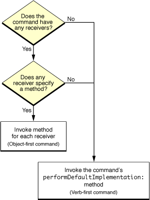

> 导航：[总目录](../../../README.md) · [documentation](../../../_indexes/documentation.md) · [Cocoa Scripting Guide](Introduction%20to%20Cocoa%20Scripting%20Guide.md)


[Next](Testing%2C%20Debugging%2C%20and%20Performance.md)[Previous](Object%20Specifiers.md)

# Script Commands

Cocoa scripting uses script command objects to handle scripting-related Apple events received by your application. This chapter describes how script commands work, and how your application uses them to support its scriptable features.

When a user runs an AppleScript script, script statements that target your application are converted into corresponding Apple events and sent to the application. For each Apple event that corresponds to a command defined in your sdef, Cocoa scripting instantiates a _script command object_ that contains all the information needed to describe the specified operation. It then executes the script command, which works with objects in your application to perform the operation. The flow of Apple events is bidirectional and script commands can return values to the originating script.

Cocoa scripting provides default support for many basic AppleScript commands, such as `delete`, `move`, `get`, and `set`. This support is implemented by the `NSScriptCommand` class and a number of subclasses. In some cases, it also relies on command information that you must insert into your sdef file. Beyond that, however, the default support generally requires only that your scriptable objects follow the key-value coding guidelines described in [Maintain KVC Compliance](Getting%20and%20Setting%20Properties%20and%20Elements.md#apple-f4xwc4dqnrsv64tfmyxwi33df52wszbpkridimbqgazdcnrufvbuqmjyfvjvona) and that you implement object specifier methods for your scriptable classes, as described in [Object Specifiers](Object%20Specifiers.md#apple-f4xwc4dqnrsv64tfmyxwi33df52wszbpkridimbqgazdcnrufvbuqmznknltc).

You can define new subclasses of Cocoa's script command classes to modify their default behavior or to implement new AppleScript commands specific to your application. Or, in some cases, you can simply add a command-handling method to a scriptable class and provide information in your sdef file to specify when it should be called. This chapter includes detailed information on how to perform these kinds of operations.

Cocoa defines Objective-C script command classes to implement the AppleScript commands from the Standard suite. These classes are listed in [Table 9-4](Cocoa%20Scripting%20Classes%20and%20Categories.md#apple-f4xwc4dqnrsv64tfmyxwi33df52wszbpgiydambqgaztilkcijbuoq2bifca). As part of Cocoa scripting's standard implementation, `NSScriptCommand` and its subclasses can handle the `close`, `copy`, `count`, `create`, `delete`, `exists`, `move`, `open`, and `print`commands for most applications without any subclassing. It also handles the `get` and `set` commands, which are technically not part of the Standard suite, but rather considered built-in, or intrinsic, AppleScript commands. However, if your application needs to modify any of these commands, you can do so in one of two ways:

- Supply a method to handle the command and list it in your sdef file.
- Create a subclass of `NSScriptCommand` or one of its subclasses and override `performDefaultImplementation`.

[Table 7-1](#apple-f4xwc4dqnrsv64tfmyxwi33df52wszbpgiydambrgi2delktk4yti) lists the AppleScript commands supported by Cocoa scripting and summarizes their default behavior and how you can customize it.

In working with script commands, Cocoa scripting relies on scriptability information in your sdef. That includes `command` elements, which provide information about specific AppleScript commands, and `responds-to` elements, which specify that objects of a particular class can respond to a specified command.

Your sdef includes a `command` element for every new AppleScript command you create. For these commands, you specify all the appropriate information described in [Command Elements](Preparing%20a%20Scripting%20Definition%20File.md#apple-f4xwc4dqnrsv64tfmyxwi33df52wszbpkridimbqgaytsnzxfuytcmrzgezte). That includes command name, code, and description. It can also include a direct parameter, other parameters, and result type.

If you implement a new Objective-C class for the command, you also supply the name in the `command` element. If you do not supply a class name, Cocoa scripting uses the default, `NSScriptCommand`.

Your sdef should also include `command` element definitions for most of the AppleScript commands Cocoa scripting supports, if they can be used in your application:

- Your sdef should not include `command` elements for the `get` and `set` commands—they are automatically available to every application.
- Your sdef should include `command` elements for the commands in the Standard suite, such as `count`, `duplicate`, and `move`. You can obtain these definitions by copying them from the file `Sketch.sdef`, as described in [Create a Scripting Definition File](Preparing%20a%20Scripting%20Definition%20File.md#apple-f4xwc4dqnrsv64tfmyxwi33df52wszbpkridimbqgaytsnzzfvjvomq).

Cocoa also provides automatic support for the AppleScript types described in [Built-in Support for Basic AppleScript Types](Overview%20of%20Cocoa%20Support%20for%20Scriptable%20Applications.md#apple-f4xwc4dqnrsv64tfmyxwi33df52wszbpkridimbqgaytsnzwfvjvomjs).

A script command object is an instance of `NSScriptCommand` or one of its subclasses, including classes defined by Cocoa and those defined by your application. A script command can have several components, which vary by command and are described in the `command` element definition for the command in the sdef file.

- _The receiver or receivers for the command (if any):_ The object or objects designated to receive the command in the application.

  If the originating Apple event specifies receivers, it does so in its direct parameter. If the Apple event does not specify receivers, it may still have a direct parameter, which is then interpreted to be the object to which to send the command.

  If a command specifies receivers, you can retrieve them from the command object with the `evaluatedReceivers` method, which converts object specifiers into references to actual objects. If the command doesn't specify receivers, you can retrieve the direct parameter with the `directParameter` method, or you can retrieve it from the arguments list, as described in the next item.
- _The arguments of the command (if any):_ The arguments provide access to information from the parameters of the originating Apple event. The arguments can include direct parameter, other parameters, and result type.

  You can retrieve a dictionary of arguments from the command object with the `evaluatedArguments` method. You obtain individual arguments from this dictionary by key, where the parameter names defined in the sdef serve as keys. You can use the empty key (an empty string: `@""`) to retrieve the direct parameter (or "unnamed argument") from the argument dictionary, if the direct parameter is not the receivers specifier.
- _The class description for the command:_ From the class description, you can obtain information such as argument names, command result type, AppleScript command name, and name of the Objective-C class Cocoa instantiates to perform the command. This information is used by Cocoa scripting, but less commonly by your application. See [Script Command Creation](#apple-f4xwc4dqnrsv64tfmyxwi33df52wszbpgiydambrgi2delktk43a) for a description of how Cocoa scripting obtains this information.
- _An Apple event descriptor:_ This Cocoa object, of type `NSAppleEventDescriptor`, represents the Apple event itself. Your application won't necessarily need to work directly with the Apple event, but it's available if you do.

Your application typically only needs to access the components of a command when you want to modify the default behavior or implement a new script command. In those situations, the [NSScriptCommand](https://developer.apple.com/documentation/foundation/nsscriptcommand) class provides a number of methods for obtaining the information you need, including those mentioned here (`evaluatedReceivers`, `evaluatedArguments`, and `directParameter`).

It is important to note that your application doesn't typically instantiate a script command directly. Instead, it lists the commands it can handle in its sdef file and Cocoa scripting instantiates a command object when the application receives the corresponding Apple event.

Cocoa extracts information from the Apple event and stores it in the command object. To do this, it uses application scriptability information (loaded from your sdef and stored in a global instance of `NSScriptSuiteRegistry`) to obtain the keys for the specified objects and to get data from class and command descriptions. Application scriptability information automatically includes information to support the `get` and `set` commands.

Because at this point the command’s receivers and arguments are probably known only as AppleScript reference forms (for example, `graphic 3 of document "SketchDocOne"`), they are represented in the command object as nested object specifiers. See [Script Commands and Object Specifiers](#apple-f4xwc4dqnrsv64tfmyxwi33df52wszbpgiydambrgi2delktk4ytm) for more information.

Once Cocoa scripting has created and prepared a script command, it executes it in a series of steps:

1. It uses key-value coding (KVC) to evaluate the receivers specifier in the script command (see [Script Commands and Object Specifiers](#apple-f4xwc4dqnrsv64tfmyxwi33df52wszbpgiydambrgi2delktk4ytm) for details).
2. It determines which method to use for executing the command. For some commands (such as `get` and `set`), it invokes KVC methods, based on keys supplied in the sdef file, to access values of the specified objects.

   For other commands, it looks in the class descriptions of the receivers to see if any has specified a selector for the command. If not, or if there are no receivers, it selects the default implementation for the command. This mechanism is described in more detail in [Object-first Versus Verb-first Script Commands](#apple-f4xwc4dqnrsv64tfmyxwi33df52wszbpgiydambrgi2delktk4yq).
3. It invokes the method indicated by the selector (which has a single argument, the script command object) or the method that implements the default behavior for the command (`performDefaultImplementation`).
4. When a command needs to return a value, Cocoa scripting packages the information in a reply Apple event and returns it. If an error occurs while executing the command, Cocoa returns the error information (including any information added by the application) in the reply Apple event. For details, see [Error Handling](#apple-f4xwc4dqnrsv64tfmyxwi33df52wszbpgiydambrgi2delktk4zq).
5. If a command requires asynchronous processing, the application can suspend it, so that the application doesn't receive additional Apple events during processing. For details, see [Suspending and Resuming Apple Events and Script Commands](How%20Cocoa%20Applications%20Handle%20Apple%20Events.md#apple-f4xwc4dqnrsv64tfmyxwi33df52wszbpgiydambrgiztsljrgeztinzxha).

Most standard commands perform their operations automatically. For an example where you might want to modify or replace the default behavior, see [Modifying a Standard Command](#apple-f4xwc4dqnrsv64tfmyxwi33df52wszbpgiydambrgi2delktk4ytc).

When a script command is ready for execution in your application, the receiver or receivers have been set as object specifiers and any arguments may also have been set as object specifiers (arguments can be actual values as well). To represent a series of reference forms (such as `first word of second paragraph of document "Stock Alert"`), each object specifier is nested inside its container object specifier; the innermost object specifier indicates the final object to be evaluated, while the outermost object is usually the application.

The keys to an attribute or relationship are often not the same words expressed by the corresponding reference forms. For example, the key for an array of document objects is `orderedDocuments`, but the actual scripting term used is `document`. The mapping between key name and script name is provided in the application's sdef. When Cocoa scripting converts an Apple event into an objective-C script command object, it obtains the mapping between a four-character code in the Apple event and the corresponding key for the specified class, attribute, or relationship in the application. It can then locate the language-independent information (specifically, class and command descriptions) needed to compose the script command, including the object specifiers for its arguments and receivers.

In the normal course of script-command execution, an application invokes `evaluatedReceivers` on a script command to get the receiver or receivers of the command and invokes `evaluatedArguments` to get any arguments of the command. These methods in turn invoke `objectsByEvaluatingSpecifier` on the object specifiers representing command arguments or receivers. The object specifier receiving the message is the innermost specifier as nested in its containers.

The `objectsByEvaluatingSpecifier` method goes up the chain of nested containers by asking each specifier for its container until it comes to the top-level object specifier, which has no container. The top-level object is usually the application object, but it can be an object specifier involved in a `whose` clause ([NSWhoseSpecifier](https://developer.apple.com/documentation/foundation/nswhosespecifier)) or the container for a range evaluation. The method then invokes `objectsByEvaluatingWithContainers:` on this top-level specifier, which then proceeds down the chain of nested specifiers, evaluating each through key-value coding and using the evaluated object as the basis for the next evaluation. Evaluating the innermost specifier yields the real command receiver or receivers or any object used as a command argument.

For related information, see [A Closer Look at an Object Specifier](Object%20Specifiers.md#apple-f4xwc4dqnrsv64tfmyxwi33df52wszbpkridimbqgazdcnrufvbuqmznknltcna).

Your application can signal error information during script command execution by providing the command object with an error number, an error string, or both. The error information is returned in the reply Apple event. If an error occurs and your application does nothing, Cocoa scripting will supply the most applicable error number it can, along with an error string for that number. The error codes that Cocoa scripting uses for general command execution problems are listed with the documentation for the [NSScriptCommand](https://developer.apple.com/documentation/foundation/nsscriptcommand) class.

`NSScriptCommand` supplies the `setScriptErrorNumber:` and `setScriptErrorString:` methods for setting error information.

Your command handler should only provide error information if it is specific to the operation of your application. On occasion, you may be able to use one of the codes defined by Cocoa scripting. You can also choose an error number from constants supplied by the Apple Event Manager (described in “Apple Event Manager Result Codes” in _[Apple Event Manager Reference](https://developer.apple.com/documentation/applicationservices/apple_event_manager)_). When you choose one of these constants, such as `errAENotASingleObject`, Cocoa scripting will supply the corresponding error string (`"Handler only handles single objects"`). You can also supply general Mac OS system error numbers (defined in `MacErrors.h`). For example, if you return `fnfErr`, the error number for `"file not found"`, AppleScript will attempt to supply an appropriate error string.

Cocoa script commands can be described as object-first or verb-first, depending on the receivers for the command. When a script command is executed, it looks first for receivers that can perform the desired action directly. If it finds any, it invokes the specified method on each receiver. A command of this type is called an _object-first command_—the objects perform the specified action on themselves.

Sketch implements the `rotate` command as an object-first command—for details, see [Implementing an Object-First Command—Rotate](#apple-f4xwc4dqnrsv64tfmyxwi33df52wszbpgiydambrgi2delktk4za).

If no receiver can perform the desired action, or if there are no receivers specified, the script command invokes its `performDefaultImplementation` method. When a command invokes this method, it is called a _verb-first command_—a single method performs the action (or verb) on any number of objects. To create a verb-first command, you define a subclass of one of Cocoa's script command classes and override the `performDefaultImplementation` method (which does nothing in `NSScriptCommand`) to perform your version of the command action.

Sketch implements the `align` command as a verb-first command—for details, see [Implementing a Verb-First Command—Align](#apple-f4xwc4dqnrsv64tfmyxwi33df52wszbpgiydambrgi2delktk43q). Several of the standard commands are also verb-first commands—see [Table 9-4](Cocoa%20Scripting%20Classes%20and%20Categories.md#apple-f4xwc4dqnrsv64tfmyxwi33df52wszbpgiydambqgaztilkcijbuoq2bifca) for details.

Figure 7-1 shows Cocoa scripting's decision tree for executing a script command.

__Figure 7-1__  Executing a script command—verb-first versus object-first



You can use an object-first command to modify the behavior of a standard AppleScript command (except for the `get` and `set` commands). You can also use an object-first command to quickly add a new AppleScript command to your application. For these tasks, you don't need to implement a new Objective-C command class. However, you can implement such a class if desired—for example, if you want to supply functionality in the command class that any of the receivers can invoke.

An object-first command is appropriate for an action that can benefit from polymorphism, because the same message can result in different behavior depending on the receiver. It is also appropriate for operations on relatively small numbers of objects or for simple actions that don't require peripheral information—for example, an action that calls for a simple reversal of state. Although each receiver can, if necessary, extract information from the command to aid in performing the action, such an approach could conceivably lead to performance problems, if operating on large numbers of objects.

Another advantage of using an object-first command is that you can often implement it by creating a category on an existing class.

To support an object-first command, you perform the following steps:

- In your sdef, provide a `responds-to` entry for each scriptable class that can handle the command. Specify the same method name for each class, matching the template `<methodName>:`.
- For a new AppleScript command you have defined, add a `command` element to your sdef file. Specify all the appropriate information described in [Command Elements](Preparing%20a%20Scripting%20Definition%20File.md#apple-f4xwc4dqnrsv64tfmyxwi33df52wszbpkridimbqgaytsnzxfuytcmrzgezte).

  If you will define a new Objective-C class to implement the command, supply the class name in the `command` element.
- To use the object-first approach to change the behavior of a standard AppleScript command (but not the `get` and `set` commands), make sure your sdef includes the `command` element definition for that command, as described in [Create a Scripting Definition File](Preparing%20a%20Scripting%20Definition%20File.md#apple-f4xwc4dqnrsv64tfmyxwi33df52wszbpkridimbqgaytsnzzfvjvomq). You don't need to modify the `command` definition unless you implement a new Objective-C class for the command.

  For example, if your sdef includes a `responds-to` element that specifies a `specialMove:` method that Cocoa scripting should invoke for the `move` command, there is no need to modify the `move` command in your sdef or to subclass `NSMoveCommand`. But if you do provide a subclass of `NSMoveCommand`, you must list it in the `command` element.
- In the implementation for the corresponding scriptable classes, implement the named method. The method declaration must match one of the following two templates (depending on whether the command returns a value):

  `-(id)<methodName>:(NSScriptCommand*)command`

  `-(void)<methodName>:(NSScriptCommand*)command`
- If you are using one, implement the Objective-C class for the command; it must inherit from one of the script command classes defined by Cocoa.

For a detailed example, see [Implementing an Object-First Command—Rotate](#apple-f4xwc4dqnrsv64tfmyxwi33df52wszbpgiydambrgi2delktk4za).

A verb-first command is appropriate for an action that requires the interaction of objects, so that it cannot be handled by individual objects. It is also appropriate for operations that require significant overhead, such that it would be inefficient to invoke the same method on many objects, with each duplicating the overhead. A verb-first command can also be appropriate to customize the behavior of an existing verb-first command.

To implement a verb-first command, you perform the following steps:

- To handle a new AppleScript command for your application, add a `command` element for the class to your sdef file. Specify all the appropriate information described in [Command Elements](Preparing%20a%20Scripting%20Definition%20File.md#apple-f4xwc4dqnrsv64tfmyxwi33df52wszbpkridimbqgaytsnzxfuytcmrzgezte). That includes specifying the name of your new Objective-C class that implements the command.

  To handle a standard AppleScript command with a new command subclass, make sure your sdef includes the `command` element definition for that command (except for the `get` and `set` commands), as described in [Create a Scripting Definition File](Preparing%20a%20Scripting%20Definition%20File.md#apple-f4xwc4dqnrsv64tfmyxwi33df52wszbpkridimbqgaytsnzzfvjvomq). Modify that element to specify the name of your new Objective-C class.
- Define the command in your code as a subclass of `NSScriptCommand` or of one of the script command subclasses listed in [Table 9-4](Cocoa%20Scripting%20Classes%20and%20Categories.md#apple-f4xwc4dqnrsv64tfmyxwi33df52wszbpgiydambqgaztilkcijbuoq2bifca):

  Subclass `NSScriptCommand` to perform an operation which is not supported by any of the standard Cocoa script command classes.

  Subclass one of Cocoa scripting's other script command classes to perform a variation of its standard action. For example, you may want to perform a custom `move` operation in some cases, but otherwise fall back on the default behavior.
- Override the `performDefaultImplementation` method. In that method, you can use methods of `NSScriptCommand` to extract any information you need from the command object.

  For example, you can examine the objects on which the command should be performed and decide whether to perform the customized version of the command. If not, you can invoke the method of the superclass:

```
        return [super performDefaultImplementation];
```

  This method either returns an `id` or, if there is nothing to return, returns `nil`. The version in `NSScriptCommand` does nothing and returns `nil`, but most subclasses of `NSScriptCommand` override this method to perform an action.

For a detailed example, see [Implementing a Verb-First Command—Align](#apple-f4xwc4dqnrsv64tfmyxwi33df52wszbpgiydambrgi2delktk43q).

When implementing a new command class or overriding a Cocoa command class, you might choose to mix the verb-first and object-first approaches. For example, you might support a command that most objects in your application can handle in a specified method (object-first), but that for a certain class of objects, it is necessary to handle the action in the `performDefaultImplementation` method (verb-first).

To implement a command that mixes these behaviors, you use a combination of the same implementation steps described in [About Object-first Script Commands](#apple-f4xwc4dqnrsv64tfmyxwi33df52wszbpgiydambrgi2delktk44a) and [About Verb-first Script Commands](#apple-f4xwc4dqnrsv64tfmyxwi33df52wszbpgiydambrgi2delktk44q). That is, you provide both `responds-to` elements and a `command` element in your sdef file and you specify an Objective-C class for the command; in your code, you implement a script command subclass that overrides `performDefaultImplementation`, as well as versions of the method specified by the `responds-to` element in individual classes that can respond to the command. The result of handling an instance of the command will then depend on the class types of the objects on which it operates.

To summarize from previous sections, you use these steps to implement a new command or to modify the behavior of the script commands provided by Cocoa scripting:

- For either an object-first (except the `get` and `set` commands) or a verb-first command:

  In the sdef, define a `command` element for the AppleScript command, if it doesn't already have one.
- For an object-first command:

  - In the sdef, add a `responds-to` element to the `class` definition of each scriptable class that can handle the command. Specify the same method name for each class.
  - Implement the specified method in the classes that can respond to the command. The declaration should match one of these templates:

    `-(id)<methodName>:(NSScriptCommand*)command`

    `-(void)<methodName>:(NSScriptCommand*)command`
- For a verb-first command (and if needed, for an object-first command)

  - Implement an Objective-C script command class that inherits from `NSScriptCommand` or one of its subclasses.
  - Specify the name of the Objective-C command class in the `command` element in the sdef.

  For a verb-first command, override the `performDefaultImplementation` method.

The Sketch sample application implements the `rotate` command as an object-first command—it's a logical task for a `rectangle` object to rotate itself.

To implement the object-first AppleScript command `rotate`, the Sketch application does the following:

1. It defines the `rotate` command in the file `Sketch.sdef`:

```
        <command name="rotate" code="sktcrota"
            description="Rotate objects.">
            <direct-parameter type="graphic"/>
            <parameter name="by" code="by  " type="real"
                description="degrees to rotate; positive numbers rotate counter-clockwise.">
                <cocoa key="byDegrees"/>
            </parameter>
```

   Here's what this command definition specifies:

   1. The command name is `"rotate"` and its two-part code is `"sktcrota"`. This code is used in installing a handler to respond to Apple events that specify this command.
   2. The command has a direct parameter which specifies one or more graphic objects to be rotated.
   3. The command has a parameter with the key `"byDegrees"` that specifies the degrees by which the specified objects should be rotated.
   4. This command definition does not specify a command class to implement the command, because the `rotate` command does not require a new command class. Because it doesn't specify a command class, the default class will be used (`NSScriptCommand`).
   5. This command definition does not include a `result type` element, so the Objective-C method that handles the command should return `nil`.
2. In its sdef, Sketch also adds a `responds-to` element to the `rectangle` class (rectangles are the only graphics that can be rotated by this command).

```
            <responds-to name="rotate">
                <cocoa method="rotate:"/>
            </responds-to>
```

   This element definition specifies that for a `rotate` command, Cocoa scripting should call the `rotate:` method of the `rectangle` object to be rotated.
3. In the implementation for the `SKTRectangle` class, it implements the `rotate:` method. Here is a summary of how `rotate:` works:

   1. It invokes `[command evaluatedArguments]` on the passed command object to get a dictionary (`theArgs`) containing the evaluated arguments for the command. The arguments have been evaluated from object specifiers to objects if necessary. The keys in the dictionary are the argument names, specified in the sdef.
   2. It invokes `[theArgs objectForKey:@"byDegrees"]` to obtain the argument for the number of degrees to rotate, as an instance of `NSNumber`. The key `"byDegrees"` corresponds to the Cocoa key defined for the `"by"` parameter in the `rotate` definition in Sketch's sdef file.
   3. It obtains the number of degrees to rotate by from the number object and performs some math operations to determine whether to rotate the rectangle.
   4. In the case that it needs to rotate the rectangle, it does so by flipping the width and height and modifying the position.
   5. If there is an error, it invokes `[self setScriptErrorNumber:theError]` to supply an error number.

      You can also invoke `setScriptErrorString:` to supply an error message.
   6. Because the `rotate` command does not declare a `result type` element in its sdef definition, this method should return `nil`.

Here is an AppleScript script that exercises the `rotate` command:

__Listing 7-1__  A script to test the rotate command

```
tell application "Sketch"
    with timeout of 60 * 60 seconds
        tell document 1
            get orientation of every rectangle
            set x to every rectangle
            repeat with y in x
                rotate y by 90
            end repeat
            try
                rotate rectangle 1 by 80
            on error eMsg number eNum
                log {eNum, eMsg}
            end try
            get orientation of every rectangle
        end tell
    end timeout
end tell
```

Here's what this script does:

1. It sets a long timeout value so it won't time out (and be interrupted) during execution if you break in the application to debug its scriptability support.
2. It performs a series of tests on the first document:

   1. It gets the `orientation` property of every `rectangle` object.
   2. It rotates every `rectangle` object by 90 degrees.
   3. It uses a `try` block to test for an error condition (rotating by a value that is not a multiple of 90).
   4. It gets the `orientation` property of every `rectangle` object after rotating.

You might add additional tests to this script, such as the following:

1. Try to rotate by different degrees.
2. Try to rotate objects that aren't rectangles.
3. Delete all graphics, then try to rotate with no rectangles in the document.
4. Rotate each rectangle by flipping its orientation property.

The Sketch sample application implements the `align` script command as a verb-first command. It makes sense to let the `performDefaultImplementation` method align all the specified objects in an array of objects, whereas asking each object to align itself would require the objects to know or find out about other objects to align with.

To implement the verb-first AppleScript command `align`, the Sketch application does the following:

1. It defines the `align` command in Sketch's sdef file

```
        <command name="align" code="sktcalig"
            description="Align a set of objects.">
            <cocoa class="SKTAlignCommand"/>
            <direct-parameter>
                <type type="graphic" list="yes"/>
            </direct-parameter>
            <parameter name="to" code="to  " type="edge">
                <cocoa key="toEdge"/>
            </parameter>
        </command>
```

   Here's what this command definition specifies:

   1. The command name is `"align"` and its two-part code is `"sktcalig"`. This code is used in installing a handler to respond to Apple events that specify this command.
   2. To handle the command, Cocoa scripting should implement an instance of `SKTAlignCommand`.
   3. The command has a direct parameter which supplies a list of graphics to be aligned.
   4. The command has a parameter that specifies the edge to which the objects should be aligned.
   5. This command definition does not include a `result type` element, so the Objective-C code that handles the command should return `nil`.

   In its sdef, Sketch also defines an `edge` enumeration (not shown) to define edge constants for use with the `align` command.
2. Sketch adds two files to its Xcode project to define the `SKTAlignCommand` class: `SKTAlignCommand.h` and `SKTAlignCommand.m`.

   This command is a subclass of `NSScriptCommand`, containing one method, `performDefaultImplementation`. That method overrides the version in `NSScriptCommand`.
3. Here is a summary of how `performDefaultImplementation` works for the `align` command:

   1. It determines the receivers for the command (an array of graphic objects to align).
   2. It invokes `[self evaluatedArguments]` to get a dictionary (`theArgs`) containing the evaluated arguments for the command. The arguments have been evaluated from object specifiers to objects if necessary. The keys in the dictionary are the argument names, specified in the sdef.
   3. It invokes `[theArgs objectForKey:@"toEdge"]` to obtain the argument for the edge to align to. The key `"toEdge"` corresponds to the Cocoa key defined for the `"to"` edge parameter in the `align` definition in Sketch's sdef file.

      From that argument, it obtains the value of the edge to align to.
   4. It gets the bounds for the first object in the array of graphics objects. That is the object to which any other objects will be aligned.
   5. It iterates over the array of graphics objects to align, using a mechanism to align them that depends on the specified edge to align to.
   6. If there is an error, it invokes `[self setScriptErrorNumber:theError]` to supply an error number.

      You can also invoke `setScriptErrorString:` to supply an error message.
   7. Because the `align` command does not declare a `result type` element in its sdef definition, this method should return `nil`.

The `performDefaultImplementation` method for `SKTAlignCommand` never invokes the implementation of its superclass (`NSScriptCommand`) for two reasons:

- The version in `NSScriptCommand` doesn't do anything—it exists only to be overridden.
- The implementation in `SKTAlignCommand` does all the work necessary to implement the `align` command.

Here is an AppleScript script that exercises the `align` command:

__Listing 7-2__  A script to test the align command

```
tell application "Sketch"
    with timeout of 60 * 60 seconds
        tell document 1
            align every graphic to vertical centers
            delay 3
            set x to every graphic
            align x to horizontal centers
        end tell
    end timeout
end tell
```

Here's what this script does:

1. It sets a long timeout value so it won't time out (and be interrupted) during execution if you break in the application to debug its scriptability support.
2. It tells the first document to align every graphic vertically.
3. After a 3 second delay, it tells the document to align every graphic horizontally.

You can make this test script more complete by, for example, adding statements to:

1. Test the other alignment options defined in Sketch's sdef: `left edges`, `right edges`, `horizontal centers`, `top edges`, and `bottom edges`.
2. Align a range of graphics.
3. Delete all graphics, then try to align with no graphics in the document.

The `NSMoveCommand` is part of Cocoa’s built-in scripting support for standard AppleScript commands. It works automatically to support the `move` command through key-value coding. However, there are situations where you might want to override this command, using either a verb-first or an object-first approach. This section provides some tips for this task—a complete solution is beyond the scope of this document.

Here is the sdef entry for the `move` command, which shows the direct parameter and other parameters to the command:

```
        <command name="move" code="coremove"
                description="Move object(s) to a new location.">
            <cocoa class="NSMoveCommand"/>
            <direct-parameter type="specifier" description="the object(s) to move"/>
            <parameter name="to" code="insh" type="location specifier"
                description="The new location for the object(s).">
                <cocoa key="ToLocation"/>
            </parameter>
```


Suppose your application lets scripters work with terms such as `file` and `folder`, providing a familiar terminology to access data that is actually stored in a database. However, your underlying implementation does not support operations on this data using KVC accessors whose keys can be mapped to `"file"` and `"folder"`. Or perhaps you tried the standard `move` support and found that you need increased performance for moving large numbers of objects.

Using the verb-first approach, you can subclass `NSMoveCommand` and override `performDefaultImplementation`. The `NSMoveCommand` class is already a verb-first command, and it generally makes sense to have a higher-level object within your application supervise the movement of contained objects, rather than telling each object to move itself.

In your override of `performDefaultImplementation`, you can extract information from the command and translate it into appropriate operations on the underlying data. For example, you can examine the objects to move:

- If they are `file` or `folder` objects, you make the appropriate changes in the database to reflect the changes expected in the user's (AppleScript object model) view of the world.
- For other objects, you can use the following statement to apply the standard behavior supplied by `NSMoveCommand`:

  `return [super performDefaultImplementation];`

Suppose, on the other hand, that certain objects in your application do know how to move themselves, and they use a mechanism different from the KVC-based moves supported by `NSMoveCommand`, which work with standard containers. In this situation, you could use the object-first mechanism to allow objects of a certain class to handle the `move` command directly in a method defined for that class.

To implement this approach, you use the steps described previously in [About Object-first Script Commands](#apple-f4xwc4dqnrsv64tfmyxwi33df52wszbpgiydambrgi2delktk44a). In your handler methods, you extract the information you need from the command object (the location to move to), which is passed as a parameter to the method, then perform the move for the current object.

Table 7-1 lists AppleScript commands supported by Cocoa scripting. For each command, it shows the Objective-C class that executes the command. It also describes the default handling for the command and how to customize it.

Though not mentioned in the table, for classes that recommend verb-first modification, you can generally use the object-first approach as well. This is particularly useful if you want to modify behavior on a class-by-class basis.

Remember too that most Cocoa script commands rely on you to maintain KVC-compliance in the naming of scriptable properties in your scriptable classes, and in some cases to implement object specifier methods for those classes. Otherwise, the commands cannot identify objects in your application on which to operate, or get or set values in those objects.

For additional information on default handling, see [Apple Events Sent by the Mac OS](How%20Cocoa%20Applications%20Handle%20Apple%20Events.md#apple-f4xwc4dqnrsv64tfmyxwi33df52wszbpgiydambrgiztsljrgeytonzwhe).

__Table 7-1__  Default support for AppleScript commands and how to customize it

| AppleScript command | Objective-C class | Default support and how to customize it |
| `close` | [NSCloseCommand](https://developer.apple.com/documentation/foundation/nsclosecommand) | Cocoa scripting automatically handles `close` for windows and documents, with the window version commonly passing control to the window's document. Customize by overriding the `handleCloseScriptCommand:` method in a subclass of [NSDocument](https://developer.apple.com/documentation/appkit/nsdocument) or [NSWindow](https://developer.apple.com/documentation/appkit/nswindow), depending on the object. (See also the documentation for `NSWindowScripting`.)  To support `close` for a different class, you can use the mechanism described in [About Object-first Script Commands](#apple-f4xwc4dqnrsv64tfmyxwi33df52wszbpgiydambrgi2delktk44a). |
| `count` | [NSCountCommand](https://developer.apple.com/documentation/foundation/nscountcommand) | Handled by verb-first command. Customize by implementing a verb-first subclass, as described in [About Verb-first Script Commands](#apple-f4xwc4dqnrsv64tfmyxwi33df52wszbpgiydambrgi2delktk44q). |
| `delete` | [NSDeleteCommand](https://developer.apple.com/documentation/foundation/nsdeletecommand) | Handled by verb-first command. Customize by implementing a verb-first subclass, as described in [About Verb-first Script Commands](#apple-f4xwc4dqnrsv64tfmyxwi33df52wszbpgiydambrgi2delktk44q). |
| `duplicate` | [NSCloneCommand](https://developer.apple.com/documentation/foundation/nsclonecommand) | Handled by a verb-first command that invokes `copyWithZone:` on the objects to be duplicated. Customize in your implementation of that method or by implementing a verb-first subclass, as described in [About Verb-first Script Commands](#apple-f4xwc4dqnrsv64tfmyxwi33df52wszbpgiydambrgi2delktk44q). |
| `exists` | [NSExistsCommand](https://developer.apple.com/documentation/foundation/nsexistscommand) | Handled by verb-first command. Customize by implementing a verb-first subclass, as described in [About Verb-first Script Commands](#apple-f4xwc4dqnrsv64tfmyxwi33df52wszbpgiydambrgi2delktk44q). |
| `get` | [NSGetCommand](https://developer.apple.com/documentation/foundation/nsgetcommand) | Handled by verb-first command. Customize by implementing a verb-first subclass, as described in [About Verb-first Script Commands](#apple-f4xwc4dqnrsv64tfmyxwi33df52wszbpgiydambrgi2delktk44q).  You do not need a `command` element in your sdef file for the `get` command. |
| `make` | [NSCreateCommand](https://developer.apple.com/documentation/foundation/nscreatecommand) | Handled by verb-first command. Customize by implementing a verb-first subclass, as described in [About Verb-first Script Commands](#apple-f4xwc4dqnrsv64tfmyxwi33df52wszbpgiydambrgi2delktk44q). |
| `move` | [NSMoveCommand](https://developer.apple.com/documentation/foundation/nsmovecommand) | Handled by verb-first command. Customize by implementing either a verb-first or object-first approach, as described in [Modifying a Standard Command](#apple-f4xwc4dqnrsv64tfmyxwi33df52wszbpgiydambrgi2delktk4ytc). |
| `open documents` | [NSScriptCommand](https://developer.apple.com/documentation/foundation/nsscriptcommand) | Cocoa automatically handles `open documents` by invoking the methods described in [Open](How%20Cocoa%20Applications%20Handle%20Apple%20Events.md#apple-f4xwc4dqnrsv64tfmyxwi33df52wszbpgiydambrgiztsljrgeytsobsgm). You can modify the default behavior by implementing or overriding those methods. |
| `print documents` | [NSScriptCommand](https://developer.apple.com/documentation/foundation/nsscriptcommand) | Cocoa automatically handles `print` for documents by invoking the methods described in [Print](How%20Cocoa%20Applications%20Handle%20Apple%20Events.md#apple-f4xwc4dqnrsv64tfmyxwi33df52wszbpgiydambrgiztsljrgezdenzqgy). You can modify the default behavior by implementing or overriding those methods. |
| `quit` | [NSQuitCommand](https://developer.apple.com/documentation/foundation/nsquitcommand) | The [NSApplication](https://developer.apple.com/documentation/appkit/nsapplication) class automatically handles this command for applications by invoking the methods described in [Quit](How%20Cocoa%20Applications%20Handle%20Apple%20Events.md#apple-f4xwc4dqnrsv64tfmyxwi33df52wszbpgiydambrgiztsljrgezdcmjxha). You can modify the default behavior by implementing or overriding those methods. |
| `save` | [NSScriptCommand](https://developer.apple.com/documentation/foundation/nsscriptcommand) | Cocoa automatically handles `save` for windows and documents, with the window version commonly passing control to the window's document. Customize saving behavior by overriding the `handleSaveScriptCommand:` method in a subclass of [NSDocument](https://developer.apple.com/documentation/appkit/nsdocument) or [NSWindow](https://developer.apple.com/documentation/appkit/nswindow), depending on the object. (See also the documentation for `NSWindowScripting`.)  To support `save` for a different class, you can use the mechanism described in [About Object-first Script Commands](#apple-f4xwc4dqnrsv64tfmyxwi33df52wszbpgiydambrgi2delktk44a). |
| `set` | [NSSetCommand](https://developer.apple.com/documentation/foundation/nssetcommand) | Handled by verb-first command. Customize by implementing a verb-first subclass, as described in [About Verb-first Script Commands](#apple-f4xwc4dqnrsv64tfmyxwi33df52wszbpgiydambrgi2delktk44q).  You do not need a `command` element in your sdef file for the `set` command. |

[Next](Testing%2C%20Debugging%2C%20and%20Performance.md)[Previous](Object%20Specifiers.md)

