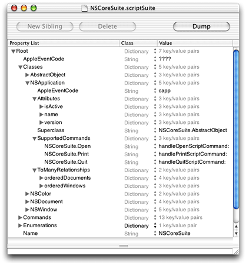

> 导航：[总目录](../../../README.md) · [documentation](../../../_indexes/documentation.md) · [Cocoa Scripting Guide](Introduction%20to%20Cocoa%20Scripting%20Guide.md)


[Next](Document%20Revision%20History.md)[Previous](Evolution%20of%20Cocoa%20Scriptability%20Information.md)

# Script Suite and Script Terminology Files

Cocoa applications can provide scriptability information in the form of script suite and script terminology files. This format, sometimes referred to as the _script suite_ format, has been supported since the first version of Cocoa scripting. This chapter provides a detailed look at the use and structure of these files.

When supplying scripting information in the script suite format, an application provides at least one nonlocalized script suite file and a corresponding script terminology file. These files together describe the scripting capabilities of the application and the terminology a scripter uses to access those capabilities.

A _script suite file_ describes scriptable objects in terms of their attributes, relationships, and supported commands. You can think of a script suite file as supplying scripting information for use by Cocoa’s internal scripting support; that information can also be used by your application. [Script Terminology Files](#apple-f4xwc4dqnrsv64tfmyxwi33df52wszbpgiydambrgi2dcljrga3tonzxgi) describes the files used to store the scripting terminology that corresponds to the information in a script suite file. That terminology defines the terms actually used by scripters to control the application.

The information in a script suite file consists of a nested list of key-value pairs. Script suites are always property lists, but in addition they must conform to the format described in [The Structure of a Script Suite File](#apple-f4xwc4dqnrsv64tfmyxwi33df52wszbpgiydambqgaztmljrga3dmmjvgm). For information on creating them, see [Creating Your Own Script Suite Files](#apple-f4xwc4dqnrsv64tfmyxwi33df52wszbpgiydambrgi2dclktk4za).

Frameworks, loadable bundles, and applications that support scripting can include a script suite file as a language-independent resource. The name of the file takes the form _suiteName_._scriptSuite_, where _suiteName_ uniquely identifies the script suite file. An example would be `MyApplication.scriptSuite`.

Script suites are located in the (nonlocalized) `Resources` directory of an application, framework, or bundle. For example, for a framework named `MyStuff.framework`, the script suite file (named `MyStuff.scriptSuite`) would reside in `MyStuff.framework/Resources/`.

Listing B-1 shows the class description for the `NSApplication` class, taken from `NSCoreSuite.scriptSuite`, Cocoa's script suite file for the AppleScript Standard suite. The class description is shown as exported in “XML Property List File” format by the Property List Editor application. You can find the full version of this script suite file on your system by following the `Resources` symbolic link at `/System/Library/Frameworks/Foundation.framework`.

__Listing B-1__  NSApplication class from the script suite file for the Standard suite

```
        <key>NSApplication</key>
        <dict>
            <key>AppleEventCode</key>
            <string>capp</string>
            <key>Attributes</key>
            <dict>
                <key>isActive</key>
                <dict>
                    <key>AppleEventCode</key>
                    <string>pisf</string>
                    <key>ReadOnly</key>
                    <string>YES</string>
                    <key>Type</key>
                    <string>NSNumber&lt;Bool&gt;</string>
                </dict>
                <key>name</key>
                <dict>
                    <key>AppleEventCode</key>
                    <string>pnam</string>
                    <key>ReadOnly</key>
                    <string>YES</string>
                    <key>Type</key>
                    <string>NSString</string>
                </dict>
                <key>version</key>
                <dict>
                    <key>AppleEventCode</key>
                    <string>vers</string>
                    <key>ReadOnly</key>
                    <string>YES</string>
                    <key>Type</key>
                    <string>NSString</string>
                </dict>
            </dict>
            <key>Superclass</key>
            <string>NSCoreSuite.AbstractObject</string>
            <key>SupportedCommands</key>
            <dict>
                <key>NSCoreSuite.Open</key>
                <string>handleOpenScriptCommand:</string>
                <key>NSCoreSuite.Print</key>
                <string>handlePrintScriptCommand:</string>
                <key>NSCoreSuite.Quit</key>
                <string>handleQuitScriptCommand:</string>
            </dict>
            <key>ToManyRelationships</key>
            <dict>
                <key>orderedDocuments</key>
                <dict>
                    <key>AppleEventCode</key>
                    <string>docu</string>
                    <key>LocationRequiredToCreate</key>
                    <string>NO</string>
                    <key>ReadOnly</key>
                    <string>YES</string>
                    <key>Type</key>
                    <string>NSDocument</string>
                </dict>
                <key>orderedWindows</key>
                <dict>
                    <key>AppleEventCode</key>
                    <string>cwin</string>
                    <key>ReadOnly</key>
                    <string>YES</string>
                    <key>Type</key>
                    <string>NSWindow</string>
                </dict>
            </dict>
        </dict>
```

Each scriptable class in a script suite file must have a “class description” which, in key-value form, declares the attributes and relationships of the class in terms of type and four-character code (or Apple event code). For example, the four-character code for `NSApplication` in [Listing B-1](#apple-f4xwc4dqnrsv64tfmyxwi33df52wszbpgiydambrgi2dclkcifbeessejbca) is the string `"capp"`. You can read more about four-character codes in [Code Constants Used in Scriptability Information](Preparing%20a%20Scripting%20Definition%20File.md#apple-f4xwc4dqnrsv64tfmyxwi33df52wszbpkridimbqgaytsnzxfuytcnbugi2tc). The primary key for a class description must be a class name such as `NSApplication` that identifies a real Objective-C class.

The class description also declares the AppleScript commands the class supports and specifies the superclass, if the superclass also supports scripting of its objects. In this case, the superclass for `NSApplication` is `AbstractObject`, which is the root of the scriptable class hierarchy, and corresponds to the `NSObject` class.

A script suite file is a text file containing key-value pairs in the form of a series of nested dictionaries, with two main categories: class descriptions and command descriptions.

A _class description_ describes the attributes and relationships of a scriptable class. Relationships can be one-to-one or one-to-many. A class description also lists the commands a class supports and specifies whether a particular method of the class handles the command or the command’s default implementation is used to execute the command. A description of a class can designate a scriptable superclass, and thus inherit the attributes, relationships, and supported commands of that class. Class descriptions for the classes defined in an application's script suite file are instantiated by the global instance of `NSScriptSuiteRegistry` when it loads the application's scriptability information.

A _command description_ defines the characteristics of an AppleScript command that the application, framework, or bundle specifically supports. This information includes the class of the command, the type of the return value, and the number and types of arguments. Many of the commands defined in the Standard suite (such as `copy`, `duplicate`, `move`, and so on) have default implementations in subclasses of `NSScriptCommand`, listed in [Subclasses for Standard AppleScript Commands](Cocoa%20Scripting%20Classes%20and%20Categories.md#apple-f4xwc4dqnrsv64tfmyxwi33df52wszbpgiydambqgaztiljrgazdenjvgq). Command descriptions for the commands defined in an application's script suite file are instantiated by the global instance of `NSScriptSuiteRegistry` when it loads the application's scriptability information. For more information on the script command mechanism, see [Script Commands](Script%20Commands.md#apple-f4xwc4dqnrsv64tfmyxwi33df52wszbpgiydambrgi2delkcijbueq2jjjcq).

A script suite file may contain additional declarations, such as enumerations. For example, `NSCoreSuite.scriptSuite` contains a declaration for the `SaveOptions` enumeration, which defines the AppleScript values for `yes`, `no`, and `ask` that are used when closing a file.

The following tables describe the structure of a script suite file, including its optional and required keys.

__Table B-1__  Suite dictionary

| Key | Value type or reference | Description |
| “_name_” | [NSString](https://developer.apple.com/library/archive/documentation/LegacyTechnologies/WebObjects/WebObjects_3.5/Reference/Frameworks/ObjC/Foundation/Classes/NSStringClassCluster/Description.html#//apple_ref/occ/cl/NSString) | Name of suite (required); the name can be placed anywhere in the definition, as long as it is a first-level element |
| “`AppleEventCode`” | [NSString](https://developer.apple.com/library/archive/documentation/LegacyTechnologies/WebObjects/WebObjects_3.5/Reference/Frameworks/ObjC/Foundation/Classes/NSStringClassCluster/Description.html#//apple_ref/occ/cl/NSString) | Four-character code for this suite (required) |
| “`Classes`” | Class list dictionary (Table B-2) | optional (no classes defined by default) |
| “`Commands`” | Command list dictionary ([Table B-7](#apple-f4xwc4dqnrsv64tfmyxwi33df52wszbpgiydambrgi2dclktk4zq)) | optional (no classes defined by default) |
| “`Synonyms`” | Synonym list dictionary ([Table B-10](#apple-f4xwc4dqnrsv64tfmyxwi33df52wszbpgiydambrgi2dcljrga4denjxgu)) | optional (no synonyms defined by default) |
| “`Enumerations`” | Enumeration list dictionary ([Table B-11](#apple-f4xwc4dqnrsv64tfmyxwi33df52wszbpgiydambrgi2dcljrga4demzxgi)) | optional (no enumerations defined by default) |

__Table B-2__  Class list dictionary

| Key | Reference | Description |
| “_className_” | Class dictionary (Table B-3) | One per each scriptable class. Must be the name of an Objective-C class defined by Cocoa or the application. |

__Table B-3__  Class dictionary

| Key | Value type or reference | Description |
| “`Superclass`” | [NSString](https://developer.apple.com/library/archive/documentation/LegacyTechnologies/WebObjects/WebObjects_3.5/Reference/Frameworks/ObjC/Foundation/Classes/NSStringClassCluster/Description.html#//apple_ref/occ/cl/NSString) | Scriptable superclass; must be the name of an Objective-C class. All attributes, relationships, and supported commands are inherited and can be overridden. You can use the notation _suiteName_._className_ to designate the class. (Optional.) You can also use the `AbstractObject` class to specify a base class your scriptable classes can inherit from that contains no scriptability of its own. |
| “`AppleEventCode`” | [NSString](https://developer.apple.com/library/archive/documentation/LegacyTechnologies/WebObjects/WebObjects_3.5/Reference/Frameworks/ObjC/Foundation/Classes/NSStringClassCluster/Description.html#//apple_ref/occ/cl/NSString) | Four-character code for this class (required) |
| “`Attributes`” | Property list dictionary (Table B-4) | Attributes of the class (optional) |
| “`ToOneRelationships`” | Property list dictionary (Table B-4) | One-to-one relationships of the class (optional) |
| “`ToManyRelationships`” | Property list dictionary (Table B-4) | One-to-many relationships of the class (optional) |
| “`SupportedCommands`” | Supported commands dictionary ([Table B-6](#apple-f4xwc4dqnrsv64tfmyxwi33df52wszbpgiydambrgi2dcljrga4demrzga)) | Commands supported by the class (optional) |

__Table B-4__  Property list dictionary

| Key | Reference | Description |
| “_propertyName_” | Property dictionary (Table B-5) | Definition of an attribute or relationship. _attributeName_ should map to an instance variable of the class for which there are accessor methods. |

__Table B-5__  Property dictionary

| Key | Value type | Description |
| “`Type`” | [NSString](https://developer.apple.com/library/archive/documentation/LegacyTechnologies/WebObjects/WebObjects_3.5/Reference/Frameworks/ObjC/Foundation/Classes/NSStringClassCluster/Description.html#//apple_ref/occ/cl/NSString) | Name of class of values of this property (required) |
| “`AppleEventCode`” | [NSString](https://developer.apple.com/library/archive/documentation/LegacyTechnologies/WebObjects/WebObjects_3.5/Reference/Frameworks/ObjC/Foundation/Classes/NSStringClassCluster/Description.html#//apple_ref/occ/cl/NSString) | Four-character code for this suite (required) |
| “`ReadOnly`” | [NSString](https://developer.apple.com/library/archive/documentation/LegacyTechnologies/WebObjects/WebObjects_3.5/Reference/Frameworks/ObjC/Foundation/Classes/NSStringClassCluster/Description.html#//apple_ref/occ/cl/NSString) | “Yes” or “No” (optional; “No” by default) |

__Table B-6__  Supported commands dictionary

| Key | Value type | Description |
| “_commandName_” | [NSString](https://developer.apple.com/library/archive/documentation/LegacyTechnologies/WebObjects/WebObjects_3.5/Reference/Frameworks/ObjC/Foundation/Classes/NSStringClassCluster/Description.html#//apple_ref/occ/cl/NSString) | Name of method this class uses to implement the command or ““ if the default implementation is sufficient. _commandName_ should be in _suiteName_._commandName_ notation if command is not in the same suite as the class. |

__Table B-7__  Command list dictionary

| Key | Reference | Description |
| “_commandName_” | Command dictionary (Table B-12) | Command definition. |

__Table B-8__  Command dictionary

| Key | Value type or reference | Description |
| “`CommandClass`” | [NSString](https://developer.apple.com/library/archive/documentation/LegacyTechnologies/WebObjects/WebObjects_3.5/Reference/Frameworks/ObjC/Foundation/Classes/NSStringClassCluster/Description.html#//apple_ref/occ/cl/NSString) | Class of command. Set this value to [NSScriptCommand](https://developer.apple.com/documentation/foundation/nsscriptcommand) for default behavior. If not using default, must be set to a subclass of `NSScriptCommand` (required). |
| “`AppleEventCode`” | [NSString](https://developer.apple.com/library/archive/documentation/LegacyTechnologies/WebObjects/WebObjects_3.5/Reference/Frameworks/ObjC/Foundation/Classes/NSStringClassCluster/Description.html#//apple_ref/occ/cl/NSString) | Four-character code for this command (required) |
| “`AppleEventClassCode`” | [NSString](https://developer.apple.com/library/archive/documentation/LegacyTechnologies/WebObjects/WebObjects_3.5/Reference/Frameworks/ObjC/Foundation/Classes/NSStringClassCluster/Description.html#//apple_ref/occ/cl/NSString) | Four-character class constant for this command (optional; by default, is the constant for the script suite) |
| “`Type`” | [NSString](https://developer.apple.com/library/archive/documentation/LegacyTechnologies/WebObjects/WebObjects_3.5/Reference/Frameworks/ObjC/Foundation/Classes/NSStringClassCluster/Description.html#//apple_ref/occ/cl/NSString) | Class name of result of command or “” if no result (optional; no result by default) |
| “`ResultAppleEventCode`” | [NSString](https://developer.apple.com/library/archive/documentation/LegacyTechnologies/WebObjects/WebObjects_3.5/Reference/Frameworks/ObjC/Foundation/Classes/NSStringClassCluster/Description.html#//apple_ref/occ/cl/NSString) | Four-character code for the return type of the command. Must be present if “Type” value is assigned. Can be “\*\*\*\*” if the return type is variable. |
| “`Arguments`” | Argument list dictionary (Table B-13) | Arguments of command (optional; no arguments by default) |

__Table B-9__  Argument list dictionary

| Key | Value type or reference | Description |
| “`Type`” | [NSString](https://developer.apple.com/library/archive/documentation/LegacyTechnologies/WebObjects/WebObjects_3.5/Reference/Frameworks/ObjC/Foundation/Classes/NSStringClassCluster/Description.html#//apple_ref/occ/cl/NSString) | Name of class for this argument (required) |
| “`AppleEventCode`” | [NSString](https://developer.apple.com/library/archive/documentation/LegacyTechnologies/WebObjects/WebObjects_3.5/Reference/Frameworks/ObjC/Foundation/Classes/NSStringClassCluster/Description.html#//apple_ref/occ/cl/NSString) | Four-character code for this argument (required) |
| “`Optional`” | [NSString](https://developer.apple.com/library/archive/documentation/LegacyTechnologies/WebObjects/WebObjects_3.5/Reference/Frameworks/ObjC/Foundation/Classes/NSStringClassCluster/Description.html#//apple_ref/occ/cl/NSString) | “Yes” or “No” (optional; “No” by default) |

__Table B-10__  Synonym list dictionary

| Key | Value type or reference | Description |
| “`Apple event code`” | [NSString](https://developer.apple.com/library/archive/documentation/LegacyTechnologies/WebObjects/WebObjects_3.5/Reference/Frameworks/ObjC/Foundation/Classes/NSStringClassCluster/Description.html#//apple_ref/occ/cl/NSString) | Class name for which four-character code is a synonym. |

__Table B-11__  Enumeration list dictionary

| Key | Reference | Description |
| “_enumerationName_” | Enumeration dictionary (Table B-12) | One per enumeration. |

__Table B-12__  Enumeration dictionary

| Key | Value type or reference | Description |
| “`AppleEventCode`” | [NSString](https://developer.apple.com/library/archive/documentation/LegacyTechnologies/WebObjects/WebObjects_3.5/Reference/Frameworks/ObjC/Foundation/Classes/NSStringClassCluster/Description.html#//apple_ref/occ/cl/NSString) | Four-character code for this enumeration (required) |
| “`Enumerators`” | Enumerators list dictionary (Table B-13) | Enumerators in the enumeration (required) |

__Table B-13__  Enumerators dictionary

| Key | Value type or reference | Description |
| “_enumeratorName_” | [NSString](https://developer.apple.com/library/archive/documentation/LegacyTechnologies/WebObjects/WebObjects_3.5/Reference/Frameworks/ObjC/Foundation/Classes/NSStringClassCluster/Description.html#//apple_ref/occ/cl/NSString) | Four-character Apple event code for this enumerator (required) |

A _script terminology file_ maps AppleScript terminology—the English-like words and phrases a scripter can use in a script, such as `the first word in the first paragraph`—to the class and command descriptions in a script suite file. A script terminology file also provides valuable documentation about an application’s scripting support, which users can examine in the Script Editor and Xcode applications.

Like a script suite file, a script terminology file is stored as a nested list of key-value pairs. Script terminologies are always property lists, but in addition they must conform to the format described in [The Structure of a Script Terminology File](#apple-f4xwc4dqnrsv64tfmyxwi33df52wszbpgiydambqgaztmljrgezdmmzygu). See [Creating Your Own Script Suite Files](#apple-f4xwc4dqnrsv64tfmyxwi33df52wszbpgiydambrgi2dclktk4za) for information on how to create and edit these files.

[Listing B-2](#apple-f4xwc4dqnrsv64tfmyxwi33df52wszbpgiydambrgi2dclkcifbemsciijbq) shows the terminology for the `NSApplication` class, taken from `NSCoreSuite.scriptTerminology`, the script terminology file for the Standard suite (provided by Cocoa). The terminology is shown as exported in “ASCII Property List File” format by the Property List Editor application. You can find the full version of this file on your system by following the `Resources` symbolic link at `/System/Library/Frameworks/Foundation.framework`.

__Listing B-2__  NSApplication class from the script terminology file for the Standard suite

```
        NSApplication = {
            Attributes = {
                isActive = {
                    Description = "Is this the frontmost (active) application?";
                    Name = frontmost;
                };
                name = {Description = "The name of the application."; Name = name; };
                version = {Description = "The version of the application."; Name = version; };
            };
            Description = "An application's top level scripting object.";
            Name = application;
            PluralName = applications;
        };
        NSColor = {Description = "A color."; Name = color; PluralName = colors; };
        NSDocument = {
            Attributes = {
                fileName = {Description = "The document's path."; Name = path; };
                isDocumentEdited = {
                    Description = "Has the document been modified since the last save?";
                    Name = modified;
                };
                lastComponentOfFileName = {Description = "The document's name."; Name = name; };
            };
            Description = "A document.";
            Name = document;
            PluralName = documents;
        };
```


Script terminologies, like script suite files, are stored as text files of key-value pairs. As with a script suite file, a script terminology file consists of a series of nested dictionaries. Many of the subdictionaries (class, command, argument, and so on) should have counterparts in the script suite file.

The following tables describe the optional and required keys for a script terminology file.

__Table B-14__  Terminology dictionary

| Key | Value type or reference | Description |
| “`Name`” | [NSString](https://developer.apple.com/library/archive/documentation/LegacyTechnologies/WebObjects/WebObjects_3.5/Reference/Frameworks/ObjC/Foundation/Classes/NSStringClassCluster/Description.html#//apple_ref/occ/cl/NSString) or [NSArray](https://developer.apple.com/library/archive/documentation/LegacyTechnologies/WebObjects/WebObjects_3.5/Reference/Frameworks/ObjC/Foundation/Classes/NSArrayClassCluster/Description.html#//apple_ref/occ/cl/NSArray) of `NSString` objects | Human-readable name of suite (required); the name can be placed anywhere in the definition, as long as it is a first-level element |
| “`Description`” | [NSString](https://developer.apple.com/library/archive/documentation/LegacyTechnologies/WebObjects/WebObjects_3.5/Reference/Frameworks/ObjC/Foundation/Classes/NSStringClassCluster/Description.html#//apple_ref/occ/cl/NSString) | Human-readable description of suite (optional; but highly recommended) |
| “`Classes`” | Class list terminology dictionary (Table B-15) | Required only if there is a corresponding definition in the script suite file |
| “`Commands`” | Command list terminology dictionary ([Table B-19](#apple-f4xwc4dqnrsv64tfmyxwi33df52wszbpgiydambrgi2dcljrgezdimjzha)) | Required only if there is a corresponding definition in the script suite file |
| “`Synonyms`” | Class synonym list terminology dictionary ([Table B-23](#apple-f4xwc4dqnrsv64tfmyxwi33df52wszbpgiydambrgi2dcljrgezdinbsgi)) | Required only if there is a corresponding definition in the script suite file |
| “`Enumerations`” | Enumeration terminology dictionary ([Table B-25](#apple-f4xwc4dqnrsv64tfmyxwi33df52wszbpgiydambrgi2dclktk42q) | Required only if there is a corresponding definition in the script suite file |

__Table B-15__  Class list terminology dictionary

| Key | Reference | Description |
| “_className_” | Class terminology dictionary (Table B-16) | One per each scriptable class. Must be the name of an Objective-C class. |

__Table B-16__  Class terminology dictionary

| Key | Value type or reference | Description |
| “`Name`” | [NSString](https://developer.apple.com/library/archive/documentation/LegacyTechnologies/WebObjects/WebObjects_3.5/Reference/Frameworks/ObjC/Foundation/Classes/NSStringClassCluster/Description.html#//apple_ref/occ/cl/NSString) or [NSArray](https://developer.apple.com/library/archive/documentation/LegacyTechnologies/WebObjects/WebObjects_3.5/Reference/Frameworks/ObjC/Foundation/Classes/NSArrayClassCluster/Description.html#//apple_ref/occ/cl/NSArray) of `NSString` objects | Human-readable name of class (required) |
| “`Description`” | [NSString](https://developer.apple.com/library/archive/documentation/LegacyTechnologies/WebObjects/WebObjects_3.5/Reference/Frameworks/ObjC/Foundation/Classes/NSStringClassCluster/Description.html#//apple_ref/occ/cl/NSString) | Human-readable description of class (optional; but highly recommended) |
| “`PluralName`” | [NSString](https://developer.apple.com/library/archive/documentation/LegacyTechnologies/WebObjects/WebObjects_3.5/Reference/Frameworks/ObjC/Foundation/Classes/NSStringClassCluster/Description.html#//apple_ref/occ/cl/NSString) | Human-readable name for plural form of class (required) |
| “`Attributes`” | Attribute list terminology dictionary (Table B-17) | Attributes of the class (required only if there is a corresponding definition in the script suite file) |

__Table B-17__  Attribute list terminology dictionary

| Key | Reference | Description |
| “_attributeName_” | Attribute terminology dictionary (Table B-18) | Description of attribute of the class |

__Table B-18__  Attribute terminology dictionary

| Key | Value type or reference | Description |
| “`Name`” | [NSString](https://developer.apple.com/library/archive/documentation/LegacyTechnologies/WebObjects/WebObjects_3.5/Reference/Frameworks/ObjC/Foundation/Classes/NSStringClassCluster/Description.html#//apple_ref/occ/cl/NSString) or [NSArray](https://developer.apple.com/library/archive/documentation/LegacyTechnologies/WebObjects/WebObjects_3.5/Reference/Frameworks/ObjC/Foundation/Classes/NSArrayClassCluster/Description.html#//apple_ref/occ/cl/NSArray) of `NSString` objects | Human-readable name of attribute (required). |
| “`Description`” | [NSString](https://developer.apple.com/library/archive/documentation/LegacyTechnologies/WebObjects/WebObjects_3.5/Reference/Frameworks/ObjC/Foundation/Classes/NSStringClassCluster/Description.html#//apple_ref/occ/cl/NSString) | Human readable description of attribute (optional, but highly recommended) |
| “`Number`” | [NSString](https://developer.apple.com/library/archive/documentation/LegacyTechnologies/WebObjects/WebObjects_3.5/Reference/Frameworks/ObjC/Foundation/Classes/NSStringClassCluster/Description.html#//apple_ref/occ/cl/NSString) or [NSArray](https://developer.apple.com/library/archive/documentation/LegacyTechnologies/WebObjects/WebObjects_3.5/Reference/Frameworks/ObjC/Foundation/Classes/NSArrayClassCluster/Description.html#//apple_ref/occ/cl/NSArray) of `NSString` objects | “plural” or “singular” (default). |

__Table B-19__  Command list terminology dictionary

| Key | Reference | Description |
| “_commandName_” | Command terminology dictionary (Table B-20) | One per each supported script command. |

__Table B-20__  Command terminology dictionary

| Key | Value type or reference | Description |
| “`Name`” | [NSString](https://developer.apple.com/library/archive/documentation/LegacyTechnologies/WebObjects/WebObjects_3.5/Reference/Frameworks/ObjC/Foundation/Classes/NSStringClassCluster/Description.html#//apple_ref/occ/cl/NSString) or [NSArray](https://developer.apple.com/library/archive/documentation/LegacyTechnologies/WebObjects/WebObjects_3.5/Reference/Frameworks/ObjC/Foundation/Classes/NSArrayClassCluster/Description.html#//apple_ref/occ/cl/NSArray) of `NSString` objects | Human-readable name of command (required) |
| “`Description`” | [NSString](https://developer.apple.com/library/archive/documentation/LegacyTechnologies/WebObjects/WebObjects_3.5/Reference/Frameworks/ObjC/Foundation/Classes/NSStringClassCluster/Description.html#//apple_ref/occ/cl/NSString) | Human-readable description of command (optional; but highly recommended) |
| “`Arguments`” | Argument list terminology dictionary (Table B-21) | Description of command arguments (required only if there is a definition) |

__Table B-21__  Argument list terminology dictionary

| Key | Reference | Description |
| “_argumentName_” | Argument terminology dictionary (Table B-22) | Descriptions of command arguments. |

__Table B-22__  Argument terminology dictionary

| Key | Value type or reference | Description |
| “`Name`” | [NSString](https://developer.apple.com/library/archive/documentation/LegacyTechnologies/WebObjects/WebObjects_3.5/Reference/Frameworks/ObjC/Foundation/Classes/NSStringClassCluster/Description.html#//apple_ref/occ/cl/NSString) or [NSArray](https://developer.apple.com/library/archive/documentation/LegacyTechnologies/WebObjects/WebObjects_3.5/Reference/Frameworks/ObjC/Foundation/Classes/NSArrayClassCluster/Description.html#//apple_ref/occ/cl/NSArray) of `NSString` objects | Human-readable name of argument (required) |
| “`Description`” | [NSString](https://developer.apple.com/library/archive/documentation/LegacyTechnologies/WebObjects/WebObjects_3.5/Reference/Frameworks/ObjC/Foundation/Classes/NSStringClassCluster/Description.html#//apple_ref/occ/cl/NSString) | Human-readable description of argument (optional, but highly recommended) |
| “`Sex`” | [NSString](https://developer.apple.com/library/archive/documentation/LegacyTechnologies/WebObjects/WebObjects_3.5/Reference/Frameworks/ObjC/Foundation/Classes/NSStringClassCluster/Description.html#//apple_ref/occ/cl/NSString) or [NSArray](https://developer.apple.com/library/archive/documentation/LegacyTechnologies/WebObjects/WebObjects_3.5/Reference/Frameworks/ObjC/Foundation/Classes/NSArrayClassCluster/Description.html#//apple_ref/occ/cl/NSArray) of `NSString` objects | “masculine”, “feminine”, “none” (default) |
| “`Number`” | [NSString](https://developer.apple.com/library/archive/documentation/LegacyTechnologies/WebObjects/WebObjects_3.5/Reference/Frameworks/ObjC/Foundation/Classes/NSStringClassCluster/Description.html#//apple_ref/occ/cl/NSString) or [NSArray](https://developer.apple.com/library/archive/documentation/LegacyTechnologies/WebObjects/WebObjects_3.5/Reference/Frameworks/ObjC/Foundation/Classes/NSArrayClassCluster/Description.html#//apple_ref/occ/cl/NSArray) of `NSString` objects | “plural” or “singular” (default) |

__Table B-23__  Class synonym list terminology dictionary

| Key | Reference | Description |
| “`Apple event code`” | Class synonym terminology dictionary (Table B-24) | Descriptions of constant synonyms for class |

__Table B-24__  Class synonym terminology dictionary

| Key | Value type or reference | Description |
| “`Name`” | [NSString](https://developer.apple.com/library/archive/documentation/LegacyTechnologies/WebObjects/WebObjects_3.5/Reference/Frameworks/ObjC/Foundation/Classes/NSStringClassCluster/Description.html#//apple_ref/occ/cl/NSString) or [NSArray](https://developer.apple.com/library/archive/documentation/LegacyTechnologies/WebObjects/WebObjects_3.5/Reference/Frameworks/ObjC/Foundation/Classes/NSArrayClassCluster/Description.html#//apple_ref/occ/cl/NSArray) of `NSString` objects | Human-readable name of class (required) |
| “`Description`” | [NSString](https://developer.apple.com/library/archive/documentation/LegacyTechnologies/WebObjects/WebObjects_3.5/Reference/Frameworks/ObjC/Foundation/Classes/NSStringClassCluster/Description.html#//apple_ref/occ/cl/NSString) | Human-readable description of class (optional) |
| “`PluralName`” | [NSString](https://developer.apple.com/library/archive/documentation/LegacyTechnologies/WebObjects/WebObjects_3.5/Reference/Frameworks/ObjC/Foundation/Classes/NSStringClassCluster/Description.html#//apple_ref/occ/cl/NSString) | Human-readable name of plural form of class (required) |

__Table B-25__  Enumeration list terminology dictionary

| Key | Reference | Description |
| “_enumerationName_” | Enumerators list terminology dictionary (Table B-26) | One per enumeration (required). |

__Table B-26__  Enumerators list terminology dictionary

| Key | Value type or reference | Description |
| “_enumeratorName_” | Enumerator terminology dictionary (Table B-27) | One per enumerator (required). |

__Table B-27__  Enumerator terminology dictionary

| Key | Value type or reference | Description |
| “`Description`” | [NSString](https://developer.apple.com/library/archive/documentation/LegacyTechnologies/WebObjects/WebObjects_3.5/Reference/Frameworks/ObjC/Foundation/Classes/NSStringClassCluster/Description.html#//apple_ref/occ/cl/NSString) | Human-readable description of enumerator (optional) |
| “`Name`” | [NSString](https://developer.apple.com/library/archive/documentation/LegacyTechnologies/WebObjects/WebObjects_3.5/Reference/Frameworks/ObjC/Foundation/Classes/NSStringClassCluster/Description.html#//apple_ref/occ/cl/NSString) | Human-readable name of enumerator (required) |

Cocoa scripting provides two suites of standard scripting information: the Standard (or Core) suite and the Text suite. These suites define scriptability information for basic AppleScript commands, including `copy`, `count`, `create`, `delete`, `exists`, and `move`. They also provide information for basic AppleScript classes, such as `application`, `document`, `window`, and `text`, and for corresponding Cocoa classes, such as `NSApplication`, `NSDocument`, `NSWindow`, and `NSTextStorage`.

The Standard and Text suites are introduced in [Built-in Support for Standard and Text Suites](Overview%20of%20Cocoa%20Support%20for%20Scriptable%20Applications.md#apple-f4xwc4dqnrsv64tfmyxwi33df52wszbpkridimbqgaytsnzwfuytcnjwgu4dk) and described in more detail in [Use the Document Architecture](Implementing%20a%20Scriptable%20Application.md#apple-f4xwc4dqnrsv64tfmyxwi33df52wszbpgiydambqgaztoljrga4dsmjqgu) and [Access the Text Suite](Implementing%20a%20Scriptable%20Application.md#apple-f4xwc4dqnrsv64tfmyxwi33df52wszbpgiydambqgaztoljrgaydcobsga).

To add to Cocoa’s built-in scripting support using the script suite and script terminology approach, your application supplies files describing the scriptability information for the objects, properties, and commands it supports. For example, an application that can draw shapes (such as the Sketch application) might specify that it supports `circle`, `rectangle`, and `line` objects, with `color` and `location` properties. It might also support commands such as `rotate` and `scale`, in addition to standard commands such as `get`, `set`, and `delete`.

To create a script suite file or script terminology file, you can either use a plain text or XML editor, or use an application such as Property List Editor, which provides built-in support for creating property lists. Property List Editor is included with the OS X developer tools. If you have existing scriptability information, see [Converting and Updating Scriptability Information](Evolution%20of%20Cocoa%20Scriptability%20Information.md#apple-f4xwc4dqnrsv64tfmyxwi33df52wszbpkridimbqgazdcnrufvbuqmjzfvjvomq) for information on how to convert between various formats.

You construct files that contain entries for the classes, commands, and enumerations used by your application, including the codes, method, and class information used by Cocoa and the terminology used by scripters. Your files must follow the formats described in [The Structure of a Script Suite File](#apple-f4xwc4dqnrsv64tfmyxwi33df52wszbpgiydambqgaztmljrga3dmmjvgm) and [The Structure of a Script Terminology File](#apple-f4xwc4dqnrsv64tfmyxwi33df52wszbpgiydambqgaztmljrgezdmmzygu). If you use the Property List Editor application, you can ensure that you are creating a valid property list. You can also save your scriptability information in several formats:

- As a script suite file or script terminology file: these files are stored in XML format.
- As a text file with XML tags: for an example, see [Listing B-1](#apple-f4xwc4dqnrsv64tfmyxwi33df52wszbpgiydambrgi2dclkcifbeessejbca).
- As a text file in plain ASCII format: for an example, see [Listing B-2](#apple-f4xwc4dqnrsv64tfmyxwi33df52wszbpgiydambrgi2dclkcifbemsciijbq).

These formats can be opened by various text editors or by Property List Editor. As a result, you can freely work with a script suite file in whichever format is most convenient for you.

Figure B-1 shows the Standard suite (from the file `NSCoreSuite.scriptSuite`) as displayed in the Property List Editor application. In this figure, the Classes and the `NSApplication` class definition are expanded so that attributes, supported commands, and relationships for `NSApplication` are visible.

The `AbstractObject` class specifies a base class that your scriptable classes can inherit from when their actual superclass has no scriptability support.

__Figure B-1__  Script suite for the Standard suite in Property List Editor



For examples of script suites and sample code for scriptable applications, see the Sketch and TextEdit example projects, .

[Next](Document%20Revision%20History.md)[Previous](Evolution%20of%20Cocoa%20Scriptability%20Information.md)

