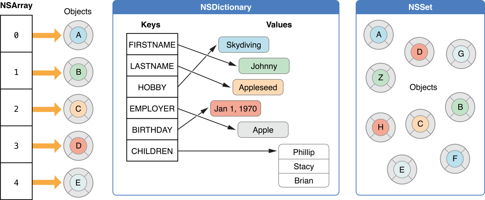
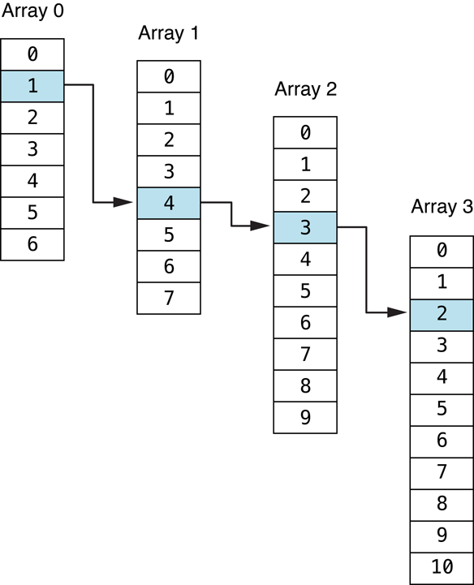

> 导航：[总目录](../../../README.md) · [documentation](../../../_indexes/documentation.md)

[下一页](Arrays-%20Ordered%20Collections.md)

# 集合概述

在 Cocoa 和 Cocoa Touch 中，集合（collection）是 Foundation 框架中用于存储和管理一组对象的类。它的主要作用是以数组、字典或集（Set）的形式存储对象。

这些类简化了管理一组对象的工作。Foundation 的集合类高效实用，被 OS X 和 iOS 广泛使用。

各类集合都有一些共同特点。大多数集合只存放对象，并且都存在可变（mutable）和不可变（immutable）两种变体。

所有集合都支持一些共同的操作，包括：

- 遍历集合中的对象
- 判断某个对象是否在集合中
- 访问集合中的单个元素

可变集合还额外支持以下操作：

- 向集合中添加对象
- 从集合中移除对象

尽管各类集合有许多共同特点，但它们之间也存在重要差异。因此，你会发现某些集合更适合特定任务。由于集合的性能表现取决于使用方式，你应当为特定任务选择最合适的集合类型。

### 支持索引访问及便捷遍历：数组

数组（如 `NSArray` 和 `NSMutableArray`）是允许对其内容进行索引访问的有序集合。例如，你可能会用数组来存储要在表视图中展示的信息，因为其中的顺序很重要。

### 通过任意键关联数据：字典

字典（如 `NSDictionary` 和 `NSMutableDictionary`）是允许通过键值访问其内容的无序集合。它们还支持快速的插入和删除操作。字典适合存储那些根据键才具有意义的值。例如，你可以有一个描述加州信息的字典，其中键是 capital，对应的值是 Sacramento。

### 提供快速插入、删除和成员检测：集（Set）

集（如 `NSSet`、`NSMutableSet` 和 `NSCountedSet`）是对象的无序集合。集支持快速的插入和删除操作，也能让你快速判断某个对象是否在集合中。`NSSet` 和 `NSMutableSet` 存储的是一组互不相同的对象，而 `NSCountedSet` 存储的是一组可以重复的对象。例如，假设你有若干城市对象，想要确保每座城市只访问一次。如果把访问过的城市都存入一个集中，就可以快速轻松地判断某座城市是否已经访问过。

### 存储数组的子集：索引集

索引集（如 `NSIndexSet` 和 `NSMutableIndexSet`）是扩展数组能力的辅助对象。它们允许你通过存储数组的索引（而不是创建新数组）来保存数组的一个子集。你可以使用索引集来让用户从一系列条目中选择多个条目。例如，假设你有一个表视图，并允许用户选择其中的一些行。由于这些行是以数组形式存储的，你就可以将用户的选择以指向该数组的索引集来保存。

### 存储嵌套数组中的路径：索引路径

索引路径用于存储更复杂的集合层级结构（具体来说是嵌套数组）中某处信息的位置。Cocoa 为此提供了 `NSIndexPath` 类。例如，索引路径 1.4.3.2 指定了下图所示的路径：

虽然严格来说索引路径并不是集合，但它们简化了管理嵌套数组的工作。`UITableView` 类广泛使用索引路径来存储表视图中的位置信息。

### 自定义内存与存储选项：指针集合类（OS X）

如果你需要集合来存储任意指针或整数，或者需要在垃圾回收环境中使用置零弱引用，可以使用三个指针集合类：`NSPointerArray`、`NSMapTable` 和 `NSHashTable`。它们分别类似于 `NSMutableArray`、`NSMutableDictionary` 和 `NSMutableSet`。这三个指针集合类允许你为集合管理其内容的方式指定额外的选项。例如，你可以在比较时使用指针相等而不是调用 `isEqual:`。与其他所有集合类不同的是，`NSPointerArray` 允许存放 `NULL` 指针。

### 使用集合：复制与遍历

除了各集合类特有的行为之外，各集合类之间还有一些以相似形式共有的任务。其中两项就是复制集合和遍历其内容。

当你需要基于另一个集合的内容创建一个新集合时，可以选择将其[浅拷贝](https://developer.apple.com/library/archive/documentation/General/Conceptual/DevPedia-CocoaCore/ObjectCopying.html#//apple_ref/doc/uid/TP40008195-CH38)或深拷贝到新集合中。在浅拷贝中，每个对象在被添加到新集合时都会被保留（retain），所有权由两个或多个集合共享。在深拷贝中，每个对象在被添加到集合时都会收到一条 `copyWithZone:` [消息](https://developer.apple.com/library/archive/documentation/General/Conceptual/DevPedia-CocoaCore/Message.html#//apple_ref/doc/uid/TP40008195-CH59)，而不是被简单地保留。

如果你需要检查集合中的每一项是否满足某个条件，或者需要有选择地对其中的条目执行某些操作，可以使用集合提供的一种遍历方式来遍历其内容。两种主要的遍历方式是快速枚举和基于块（block）的遍历。

[下一页](Arrays-%20Ordered%20Collections.md)
