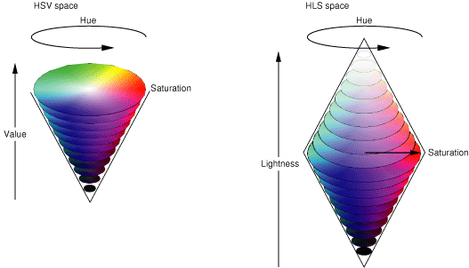
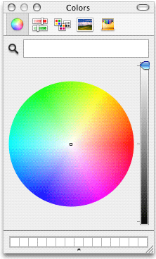
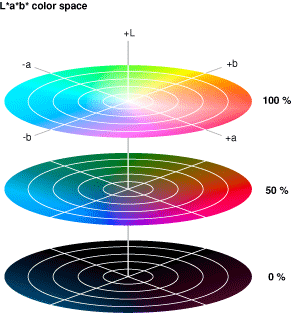

> 导航：[总目录](../../../README.md) · [documentation](../../../_indexes/documentation.md) · [Color Programming Topics](Introduction%20to%20Color%20Programming%20Topics%20for%20Cocoa.md)

[Next](About%20Color%20Lists.md)[Previous](Introduction%20to%20Color%20Programming%20Topics%20for%20Cocoa.md)

# About Color Spaces

A color space describes an abstract, multidimensional environment in which any particular color can be defined. The following sections summarize the basic concepts and terminology of color spaces and discusses how Cocoa implements them.

Some of the information presented here is adapted from _[Color Management Overview](../../Graphics%20Imaging/Color%20Management%20Overview/Introduction%20to%20Color%20Management%20Overview.md#apple-f4xwc4dqnrsv64tfmyxwi33df52wszbpkridgmbqgaytcnby)_. For a thorough description of color and color spaces, see that document.

The human eye apprehends color as light in a fairly narrow band of the electromagnetic spectrum. The biology of the eye makes it particularly receptive to red, blue, and green light. Humans can visualize a broad range of colors through mixtures of these three primary colors.

A color model is a geometric or mathematical framework that attempts to describe the colors we see. It uses numerical values pinned to dimensions of the model to represent the visible spectrum of color. A color model gives us a method for describing, classifying, comparing, and ordering colors.

A color space is a practical adaptation of a color model that specifies a gamut of colors that can be produced using that model. The color model determines the relationship between values, and the color space defines the absolute meaning of those values as colors. These values, called components, are in most instances floating-point values between 0.0 and 1.0.

The simplest color space is the gray space (sometimes also called the white space). The gray space has a single dimension or component, ranging from pure white to pure black; it is used for grayscale printing.

RGB is a three-dimensional color model whose name (as with most color spaces and color models) represents its components—in this case red, green, and blue. RGB-based color spaces are additive, meaning that the three primary colors red, green, and blue are added together in various proportions of intensity to create the colors of the visible spectrum. RGB color spaces are used for devices such as color displays and scanners.

On the other hand, color spaces based on the CYM color model are subtractive. The letters in the model name stand for the components cyan, yellow, and magenta. The major color space based on CYM is CYMK; the “K” in its name stands for the key color, which is black. The subtractive color theory, which underlies CYM, holds that various levels of cyan, magenta, and yellow absorb or “subtract” a portion of the spectrum of the white light illuminating an object. The color of an object is the result of the lights that are not absorbed by the object. The black in the CYMK color space is used to compensate for the interaction of the three primary colors on white paper. The CYMK color space is most commonly used for color printers and similar output devices.

As Figure 1 illustrates, the RGB and CYM color models are complementary, with one being additive and the other subtractive (the red corner in this model representation is hidden from view).

__Figure 1__  The RGB and CYM color models

Two important and related transformations of the RGB color model are the HSV and HLS color spaces. Instead of making red, green, and blue the operative components of the space, these spaces describe colors in terms more natural to an artist:

- HSV—hue, saturation, value (also known as HSB, where “B” represents brightness)
- HLS—hue, lightness, saturation

The HSV/B and HLS spaces use models that assign values to these components in conical geometries, as illustrated in Figure 2.

__Figure 2__  The HSV and HLS color models

The hue component in both spaces is a measurement in degrees of color in a spectrum formed into a circle. The values are incremented in a counterclockwise direction: a hue value of zero specifies red, a hue value of 120 indicates green, and so on. In both the HSB and HLS spaces, the saturation component measures color intensity (making the major difference, for example, between tan and brown). The lightness and value (or brightness) components of the different spaces are almost identical. They measure the absence of light—or black—that is part of particular color.

The color panel used in Mac apps has a color-wheel pane that simulates the HSB model (Figure 3).

__Figure 3__  The color-wheel pane of the color panel

Color spaces based on RGB and CYM color models can be device-dependent or device-independent. Colors from device-dependent color spaces are dependent on the physical characteristics of devices such as monitors (RGB and grayscale) and printers (CYMK) as well as the properties of materials such as ink and paper. Even the age of a device can affect the color it produces. Device-dependent color spaces are limited by the gamut, or range, of colors that a particular device is capable of. Consequently, colors in a device-dependent color space can appear different when rendered by different devices of the same general type.

One can also note subtle color differences among color spaces in the same color-model “family.” For example, the RGB color model has many RGB color spaces, such as ColorMatch, Adobe RGB, sRGB, and ProPhoto RGB. You can assign the same RGB component values to profiles that describe these different RGB color spaces. The color from each color space looks different when rendered, but the numeric values and model are the same.

Some color spaces can express color in a way that is independent of any device. The colors of these device-independent color space are more accurate representations of the colors perceived by the human eye. They derive from the response of the retina to the three primary stimuli of visible light. Many device-independent color spaces result from work carried out by the Commission Internationale d’Eclairage (CIE) and for that reason are also called CIE-based color spaces. Three of the more important CIE-based spaces are XYZ, Yxy, and L\*a\*b\*. Figure 4 depicts the L\*a\*b\* color space.

__Figure 4__  The L\*a\*b\* color space

One important use for device-independent color spaces is to convert a color in one device-dependent color space to a reasonably approximate color in a different device-dependent color space. For example, if a program wanted to ensure that a photo displayed on a color monitor (using a RGB color space) was accurately rendered on a printer (using a CYMK color space), it might use a device-independent color space as an interchange space.

The Application Kit represents color spaces in two ways: through color-space names and color-space objects.

Color-space names are global string constants declared in `NSGraphics.h` that designate predefined color spaces. You can use a color-space name in certain methods of NSColor that create or convert color objects. The name identifies the color space to be used for the operation. Table 1 lists the currently defined constants.

__Table 1__  Color-space names in the Application Kit

| Color-space Name | Description |
| `NSDeviceCYMKColorSpace` | Device-dependent color space with cyan, magenta, yellow, black, and alpha components |
| `NSDeviceWhiteColorSpace` | Device-dependent color space with white and alpha components (pure white is 1.0) |
| `NSDeviceBlackColorSpace` | Device-dependent color space with black and alpha components (pure black is 1.0) |
| `NSDeviceRGBColorSpace` | Device-dependent color space with red, green, blue, and alpha components. However, you can also create a color with HSB (hue, saturation, brightness) and alpha components and can extract these components. |
| `NSCalibratedWhiteColorSpace` | Calibrated color space with white and alpha components (pure white is 1.0) |
| `NSCalibratedBlackColorSpace` | Calibrated color space with black and alpha components (pure black is 1.0) |
| `NSCalibratedRGBColorSpace` | Calibrated color space with red, green, blue, and alpha components. However, you can also create a color with HSB (hue, saturation, brightness) and alpha components and can extract these components. |
| `NSNamedColorSpace` | Catalog name and color name components |
| `NSPatternColorSpace` | Pattern image (tiled) |
| `NSCustomColorSpace` | Custom NSColorSpace object and floating-point components describing a color in that space |

The alpha component belongs to all color spaces used in Cocoa. It defines the opacity of a color; an alpha value of 1.0 indicates a completely opaque color and 0.0 indicates a completely transparent one.

The “Device” color-space names represent color spaces in which component values are applied to devices as specified. There is no optimization or adjustment for differences between devices in how they render colors. If you know exactly which device is connected to a system and you want to print or display a certain color on that device, then it makes sense to use a appropriate device-dependent color space when creating NSColor objects. However, it is usually not the case that an application knows which devices are connected and their specific color spaces. If you specify components of a color in a device-dependent color space—let’s say `NSDeviceRGBColorSpace`—and then have several displays render this color, you will see several slightly different colors.

To get around this problem you can use calibrated color spaces, which are designated by two of the color-space names in Table 1. A calibrated color space is a device-independent color space. The color spaces designated by `NSCalibratedWhiteColorSpace` and `NSCalibratedRGBColorSpace` color spaces are _calibrated_ to a device that best represents devices in a particular class, such as color displays. It allows your application to present reasonably accurate colors when you are unsure about the color space of a device in a particular context.

The color-space name `NSNamedColorSpace` identifies a special type of color spaces. The components of this color space are indexes into lists or catalogs of prepared colors. The catalogs of named colors come with lookup tables that are able to generate the correct color on a given device.

The `NSPatternColorSpace` color-space name identifies a pattern color space, which is simply an image that is repeated over and over again in a tiled pattern.

The `NSCustomColorSpace` color-space name identifies a custom NSColorSpace object. A custom color-space object represents a color space that is not necessarily predefined by the Application Kit. See [Making Custom Color Spaces](Working%20With%20Color%20Spaces.md#apple-f4xwc4dqnrsv64tfmyxwi33df52wszbpkridimbqgaytqmbxfu4tmojrg4) for information on creating custom color-space objects.

In Cocoa, objects can represent color spaces just as color-space names can designate them. In fact, each color-space name identifies an underlying color-space object created by the Application Kit. Color-space objects are instances of a class that inherits from the NSColorSpace class.

Most of the color-space names designate a color space represented by an underlying NSColorSpace object. These same objects are returned by class factory methods of NSColorSpace. Table 2 shows the correlation between color-space name and factory color-space object.

__Table 2__  Corresponding color-space names and factory methods of NSColorSpace

| Color-space name | Color-space factory methods |
| `NSCalibratedWhiteColorSpace` `NSCalibratedBlackColorSpace` | `genericGrayColorSpace` |
| `NSCalibratedRGBColorSpace` | `genericRGBColorSpace` |
| None | `genericCMYKColorSpace` |
| `NSDeviceWhiteColorSpace` `NSDeviceBlackColorSpace` | `deviceGrayColorSpace` |
| `NSDeviceRGBColorSpace` | `deviceRGBColorSpace` |
| `NSDeviceCMYKColorSpace` | `deviceCMYKColorSpace` |
| `NSNamedColorSpace` | None |
| `NSPatternColorSpace` | None |
| `NSCustomColorSpace` | None |

The NSColor class is the largest “client” of the NSColorSpace class. Many NSColor methods include a parameter for either specifying a color-space name or a color-space object. In fact, color objects cannot be created without an explicit or implicit reference to a color space, including named and pattern color spaces. (The color-creation methods of NSColor that don’t specify a color space or color model in their names assume the calibrated RGB or calibrated white color spaces.) Other methods of the NSColor class allow you to convert a color object in one color space to an object representing a color in a different color space. For further information, see [Creating and Converting Colors Using Color Spaces](Working%20With%20Color%20Spaces.md#apple-f4xwc4dqnrsv64tfmyxwi33df52wszbpkridimbqgaytqmbxfu4tmobugy).

You can make custom color-space objects programmatically by using the NSColorSpace class. To create a custom color-space object you must initialize it with one of two sources of data:

- A ColorSync object—an object of opaque type `CMProfileRef`.
- ICC profile data—an NSData object encapsulating an ICC profile map; the map is a structure that consists of a header, a tag table, and tagged element data.

For more information on creating objects that represent custom color spaces, see [Making Custom Color Spaces](Working%20With%20Color%20Spaces.md#apple-f4xwc4dqnrsv64tfmyxwi33df52wszbpkridimbqgaytqmbxfu4tmojrg4).

[Next](About%20Color%20Lists.md)[Previous](Introduction%20to%20Color%20Programming%20Topics%20for%20Cocoa.md)

