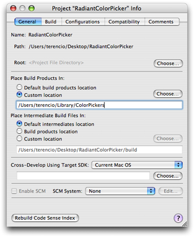
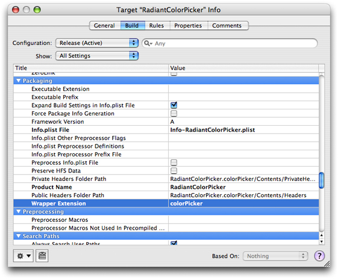
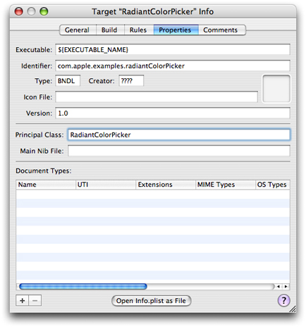
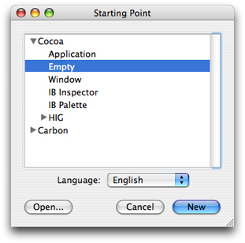
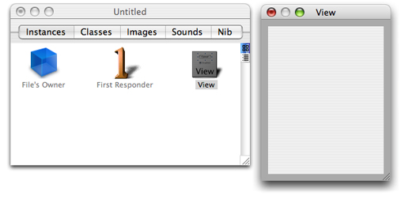

> 导航：[总目录](../../../README.md) · [documentation](../../../_indexes/documentation.md) · [Color Programming Topics](Introduction%20to%20Color%20Programming%20Topics%20for%20Cocoa.md)


[Next](Subclassing%20NSColor.md)[Previous](Choosing%20the%20Color%20Pickers%20in%20a%20Color%20Panel.md)

# Adding Custom Color Pickers to a Color Panel

A color picker is a user interface for color selection in an [NSColorPanel](https://developer.apple.com/documentation/appkit/nscolorpanel) object. The color panel lets the user select a color picker from a matrix of [NSButtonCell](https://developer.apple.com/documentation/appkit/nsbuttoncell) objects across the top of the panel. A color picker is a loadable bundle with an extension of `.colorPicker` that can be installed in one of four places:

- `/System/Library/ColorPickers` — Apple-supplied color pickers only
- `/Library/ColorPickers`
- `~/Library/ColorPickers`
- Inside the application bundle in a subdirectory of the `Resources` directory named `ColorPickers`, for example:

```
TextEdit.app/Contents/Resources/ColorPickers/MyColorPickers.colorPicker
```

The bundle should contain all required resources for the color picker, including nib files, image files, and so on. These resources should be internationalized for each supported localization. `NSColorPanel` allocates and initializes an instance of each class for each color-picker bundle found in these locations. The class name is assumed to be the bundle directory name minus the `.colorPicker` extension. If you have an icon in TIFF format (including a `.tiff` extension) and with the same name as that of the color-picker class, the color panel displays it in the button cell at the top of the panel.

The [NSColorPickingDefault](https://developer.apple.com/documentation/appkit/nscolorpickingdefault) and [NSColorPickingCustom](https://developer.apple.com/documentation/appkit/nscolorpickingcustom) protocols provide an interface for adding custom color pickers to an application’s color panel. The `NSColorPickingDefault` protocol provides basic behavior for a color picker. The `NSColorPickingCustom` protocol provides implementation-specific behavior.

The [NSColorPicker](https://developer.apple.com/documentation/appkit/nscolorpicker) class implements the `NSColorPickingDefault` protocol. To implement your own color picker you must create a subclass of `NSColorPicker` and implement the `NSColorPickingCustom` protocol for that subclass. You can also re-implement any `NSColorPickingDefault` methods if there is a need to; for example, you could write code to supply a custom tool tip or an image with a name other than the color-picker class name. You must also implement a view containing the actual color-selection user interface to be inserted into the color panel for the color picker. The custom `NSColorPicker` object should have an outlet connecting it to this view.

The color-picker API requires that you specify supported color-picker modes. For a list of the existing color picker modes and mode constants, see [Choosing the Color Pickers in a Color Panel](Choosing%20the%20Color%20Pickers%20in%20a%20Color%20Panel.md#apple-f4xwc4dqnrsv64tfmyxwi33df52wszbpgiydambqg44telkciffeershivca). If your color picker includes submodes, you should define a unique value for each submode. As an example, the slider picker has four values defined in the above list (`NSGrayModeColorPanel`, `NSRGBModeColorPanel`, `NSCMYKModeColorPanel`, and `NSHSBModeColorPanel`)—one for each of its submodes.

What follows is a short tutorial for creating custom color pickers that are automatically added to a color panel. The procedure is fairly easy, but there are a few details you should be aware of. The tutorial makes use of the `RadiantPicker` example project installed in `/Developer/Examples/AppKit`.

Start by creating a project for a Cocoa bundle: Choose New Project from the File menu and then select Cocoa Bundle from the list of project types. For the name of the bundle enter the same name you intend to give to the name of your `NSColorPicker` subclass.

The next step is not absolutely necessary, but is helpful for debugging and testing the custom color picker. As shown in Figure 1, double-click the project folder in Xcode and, in the General pane of the project preferences, set the build product output directory to `Library/ColorPickers` in your home directory.

__Figure 1__  Specifying the location for the built color picker



Next set the extension of the color-picker bundle: Double-click the bundle target, select the Build pane, and search for the Wrapper Extension setting. Change the value of this setting to “colorPicker”, as shown in Figure 2.

__Figure 2__  Setting the bundle extension



The final step in project configuration is to set two properties: the bundle identifier and the principal class. The name of the principal class should be the same as the name of the project. Figure 3 illustrates what these settings might look like.

__Figure 3__  Setting bundle identifier and principal class



Now let’s leave Xcode for awhile and switch to Interface Builder. The Cocoa Bundle project type does not include a nib file, so you’ll have to add one. Launch the application and in the Starting Point panel select Empty under Cocoa and click New (see Figure 4).

__Figure 4__  Creating a nib file for the color picker



Drag a Custom View object from the Containers palette onto your nib file window (this step requires macOS 10.4 or greater). Then construct the user interface of your color picker on this view with palette objects (if necessary). Figure 5 gives an example of what you might see in Interface Builder. Size the view so that it is commensurate with the `NSSize` value returned from the [NSColorPicker](https://developer.apple.com/documentation/appkit/nscolorpicker) implementation of the `NSColorPickingDefault` protocol method [minContentSize](https://developer.apple.com/documentation/appkit/nscolorpickingdefault/1535437-mincontentsize). Save the nib file under an appropriate name and then, in Xcode, add the nib file to the project as a localized resource.

__Figure 5__  The nib file window for the color picker



Now comes time for some coding, starting with your custom subclass of `NSColorPicker`. In Xcode, create the files for a new Objective-C class and add them to the project (File > New File). Give the header and implementation files the same name (minus the extensions) as that of the project. Open the header file and change the superclass to `NSColorPicker` and declare that the class adopts the `NSColorPickingCustom` protocol. Also add any outlets you require to the view containing the color picker’s user interface. Listing 1 illustrates what the header file declarations should look like.

__Listing 1__  Declarations of the `NSColorPicker` subclass

```objc
@interface RadiantColorPicker: NSColorPicker <NSColorPickingCustom> {
    IBOutlet NSView *_pickerView;
    IBOutlet RadiantColorControl *_radiantColorControl;
}
@end
```

To keep Interface Builder synchronized with these changes, drag the header file from Xcode and drop in on the nib file window. Select the File’s Owner icon in the nib file window, open the Custom Class inspector pane (Command-5), and select the `NSColorPicker` subclass you just declared. Then connect any outlets you defined for that class.

At this point, create and add files for any custom classes needed for the user interface of the color picker. As with the custom `NSColorPicker` subclass, added any required declarations to the header file and then drag this file onto the nib file window to make Interface Builder aware of the custom view. Assign the custom view class using the Custom Class inspector pane. You may need to do this before making any outlet connections between the custom view class and your `NSColorPicker` subclass.

Implement your `NSColorPicker` subclass by, at the least, implementing the methods of the `NSColorPickingCustom` protocol and, optionally, re-implementing methods of the `NSColorPickingDefault` protocol, as necessary. Listing 2 provides an example.

__Listing 2__  Sample implementation of the custom `NSColorPicker` class

```objc
@implementation RadiantColorPicker

- (id)initWithPickerMask:(NSUInteger)mask colorPanel:(NSColorPanel *)owningColorPanel {
    return [super initWithPickerMask:mask colorPanel:owningColorPanel];
}

- (void)dealloc {
    [_pickerView release];
    [super dealloc];
}

- (BOOL)supportsMode:(NSColorPanelMode)mode {
    return (mode == NSRGBModeColorPanel) ? YES : NO;
}

- (NSColorPanelMode)currentMode {
    return NSRGBModeColorPanel;
}

- (NSView *)provideNewView:(BOOL)initialRequest {
    if (initialRequest) {
        // Load our nib files
        if (![NSBundle loadNibNamed:@"RadiantColorPicker" owner:self]) {
            NSLog(@"ERROR: couldn't load MyColorPicker nib");
        }
        [_radiantColorControl setTarget:self];
        [_radiantColorControl setAction:@selector(colorChanged:)];
    }
    return _pickerView;
}

- (void)colorChanged:(id)sender {
    [[self colorPanel] setColor:[_radiantColorControl color]];
}

- (void)setColor:(NSColor *)newColor {
    [_radiantColorControl setColor:newColor];
}

- (NSString *)buttonToolTip {
    return NSLocalizedString(@"Radiant Picker", @"Tooltip for the radiant color picker button in the color panel");
}

@end
```

There are a few things to note about this code:

- The class implements every method of the `NSColorPickingCustom` protocol.
- It reimplements one method of `NSColorPickingDefault`, [buttonToolTip](https://developer.apple.com/documentation/appkit/nscolorpickingdefault/1535160-buttontooltip); from this implementation it returns a localized string (meaning that it would probably have a `Localizable.strings` file for each supported localization).
- As shown in the example, do _not_ load your color picker’s nib file in the initializer [initWithPickerMask:colorPanel:](https://developer.apple.com/documentation/appkit/nscolorpickingdefault/1528432-initwithpickermask). Instead load the nib file in the [provideNewView:](https://developer.apple.com/documentation/appkit/nscolorpickingcustom/1525701-providenewview) method. You only need to load the nib file if the sole argument of the `provideNewView:` method is `YES`; otherwise, return the cached instance.
- Two of the methods manage the color-panel modes supported by the color picker (in this case, only [NSRGBModeColorPanel](https://developer.apple.com/documentation/appkit/nsrgbmodecolorpanel)). If the picker masks of the control panel do not contain a supported mode, the color picker is not asked to load itself into the color panel.
- The custom view of this color picker—which is an instance of an [NSControl](https://developer.apple.com/documentation/appkit/nscontrol) subclass—sends a (private) `colorChanged:` action message to the custom `NSColorPicker` object upon each mouse-up event. In this method, the color picker sets the current color of its color panel. Note the code in `provideNewView:` that sets the target and action of the custom control object.
- Because it’s File’s Owner, the custom `NSColorPicker` class is responsible for releasing top-level nib objects such as the color picker’s custom view (`_pickerView`).

Implement the custom view objects for your color picker as necessary.

When you have finished implementing and testing your custom color picker, and it is a third-party product, create an installer for it that puts in one of the prescribed locations.

[Next](Subclassing%20NSColor.md)[Previous](Choosing%20the%20Color%20Pickers%20in%20a%20Color%20Panel.md)

