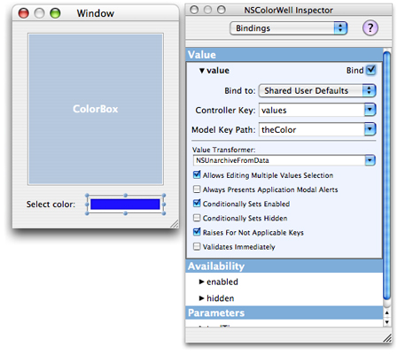

> 导航：[总目录](../../../README.md) · [documentation](../../../_indexes/documentation.md) · [Color Programming Topics](Introduction%20to%20Color%20Programming%20Topics%20for%20Cocoa.md)


[Next](Document%20Revision%20History.md)[Previous](Subclassing%20NSColor.md)

# Storing NSColor in User Defaults

It is often desirable to store the value of an NSColor instance in an application's user defaults. However, NSUserDefaults only supports the storage of objects that can be represented in an property list.

The solution is to use object archiving to write the NSColor instance data to an NSData instance and then store that as the default as shown in Listing 1. This is often done in an application life-cycle exit point such as the `applicationShouldTerminate:` delegation method.

__Listing 1__  Storing an NSColor instance in user defaults

```
// store the value in aColor in user defaults
// as the value for key aKey
NSData *theData=[NSArchiver archivedDataWithRootObject:aColor];
[[NSUserDefaults standardUserDefaults] setObject:theData forKey:aKey];
```

To read the value back from NSUserDefaults an application retrieves the NSData instance for the required key and unarchives the NSColor instance. The example in Listing 2 demonstrates retrieving the color. This is often done in an application life-cycle entry point such as `awakeFromNib`.

__Listing 2__  Retrieving an NSColor instance from user defaults

```
// read the value of the user default with key aKey
// and return it in aColor
NSColor * aColor =nil;
NSData *theData=[[NSUserDefaults standardUserDefaults] dataForKey:aKey];
if (theData != nil)
    aColor =(NSColor *)[NSUnarchiver unarchiveObjectWithData:theData];
```


It's possible to take advantage of the support for categories in Objective-C to add NSColor support to the existing NSUserDefaults class, without subclassing.

The example code in Listing 3 and Listing 4 shows an implementation of such a category. The method `setColor:forKey:` in archives the specified color to an NSData instance and stores it in the user defaults using the specified key. The method `colorForKey:` retrieves the NSData instance specified by the key, and then unarchives an instance of NSColor using the data.

__Listing 3__  Contents of NSUserDefaults myColorSupport category .h file

```objc
#import <Foundation/Foundation.h>

@interface NSUserDefaults(myColorSupport)
- (void)setColor:(NSColor *)aColor forKey:(NSString *)aKey;
- (NSColor *)colorForKey:(NSString *)aKey;
@end
```


__Listing 4__  Contents of NSUserDefaults myColorSupport category .m file

```objc
#import "NSUserDefaults+myColorSupport.h"

@implementation NSUserDefaults(myColorSupport)

- (void)setColor:(NSColor *)aColor forKey:(NSString *)aKey
{
    NSData *theData=[NSArchiver archivedDataWithRootObject:aColor];
    [self setObject:theData forKey:aKey];
}

- (NSColor *)colorForKey:(NSString *)aKey
{
    NSColor *theColor=nil;
    NSData *theData=[self dataForKey:aKey];
    if (theData != nil)
        theColor=(NSColor *)[NSUnarchiver unarchiveObjectWithData:theData];
    return theColor;
}

@end
```


You can easily establish a binding between a user-interface object whose value is a color (that is, an [NSColor](https://developer.apple.com/documentation/appkit/nscolor) object) and user defaults. When the user chooses a color preference for something in an application, the binding preserves and restores the preference across successive launches of the application.

To effect the binding, use a ready-made instance of the `NSUnarchiveFromDataTransformerName` value transformer in Interface Builder. An [NSValueTransformer](https://developer.apple.com/documentation/foundation/valuetransformer) object converts an object value typically in two directions: between the form in which it is displayed and the form in which it is stored. The `NSUnarchiveFromDataTransformerName` value transformer works by archiving an `NSColor` object in an [NSData](https://developer.apple.com/library/archive/documentation/LegacyTechnologies/WebObjects/WebObjects_3.5/Reference/Frameworks/ObjC/Foundation/Classes/NSDataClassCluster/Description.html#//apple_ref/occ/cl/NSData) object and then, on the other side of the binding, unarchiving the color object from the data object. For this value transformation to work, the archived object must implement the [NSCoding](https://developer.apple.com/library/archive/documentation/LegacyTechnologies/WebObjects/WebObjects_3.5/Reference/Frameworks/ObjC/Foundation/Protocols/NSCoding/Description.html#//apple_ref/occ/intf/NSCoding) protocol using sequential archiving—which `NSColor` does.

An [NSColorWell](https://developer.apple.com/documentation/appkit/nscolorwell) instance is a user-interface object whose value is a `NSColor` object. You can drag the color-well object from the Controls palette of Interface Builder onto a view. To establish the binding between this object and user defaults, complete the following steps:

1. With the color well still selected, open the Bindings pane of the Inspector and expose the __value__ binding.
2. From the “Bind to” pop-up menu choose Shared User Defaults.

   This action adds an instance of [NSUserDefaultsController](https://developer.apple.com/documentation/appkit/nsuserdefaultscontroller) (“Shared Defaults”) to the nib file window.
3. Keep the Controller Key field as `values` but in the Model Key Path field specify a name under which to save the color object (`theColor`, in this example).
4. From the Value Transformer combo box select (or enter) `NSUnarchiveFromData`.

When you’re finished, your setup in Interface Builder should look similar to that in Figure 1.

__Figure 1__  Establishing a binding between an `NSColor` value and user defaults



If at this point you save your nib file and build your project, you can launch the application, change the color in the color well, quit the application, and then relaunch. The color in the color well is what it was when you last changed it.

Although the foregoing procedure establishes a binding between an `NSColor` value of a view and user defaults, it does not propagate changes in that value to other objects in the application. You can do that by explicitly setting the color to the restored default when the application launches and, thereafter, by having the first responder handle the [changeColor:](https://developer.apple.com/documentation/objectivec/nsobject/1532638-changecolor) message whenever the user changes the color. But you can also use bindings so that any change in color value is propagated both to user defaults and applied to a custom view in the application. This requires you to complete the following steps:

- Declare an `NSColor` property of the custom view class.
- Expose this property as a binding ([exposeBinding:](https://developer.apple.com/documentation/objectivec/nsobject/1458184-exposebinding)); do this in the class method [initialize](https://developer.apple.com/library/archive/documentation/LegacyTechnologies/WebObjects/WebObjects_3.5/Reference/Frameworks/ObjC/Foundation/Classes/NSObject/Description.html#//apple_ref/occ/clm/NSObject/initialize).
- In the setter method for the property, send [setNeedsDisplay:](https://developer.apple.com/documentation/appkit/nsview/1483360-needsdisplay) (or [setNeedsDisplayInRect:](https://developer.apple.com/documentation/appkit/nsview/1483475-setneedsdisplayinrect)) to `self` after the new color is retained; this forces the view to redraw itself in the new color.
- Define a controller object that acts as application delegate. When the application finishes launching, this object establishes a binding between the custom view’s `NSColor` property and the property of the `NSUserDefaultsController` object bound to the color well.

  See Listing 5 for an example of this final step.

__Listing 5__  Establishing a binding between an `NSColor` property and `NSUserDefaultsController`

```objc
@implementation AppDelegate
- (void)applicationDidFinishLaunching:(NSNotification *)aNotification
{
    [theColorBox bind:@"backgroundColor" toObject:[NSUserDefaultsController sharedUserDefaultsController]
        withKeyPath:@"values.theColor"
        options:[NSDictionary dictionaryWithObject:NSUnarchiveFromDataTransformerName forKey:NSValueTransformerNameBindingOption]];
}
@end
```

[Next](Document%20Revision%20History.md)[Previous](Subclassing%20NSColor.md)

