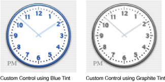

> 导航：[总目录](../../../README.md) · [documentation](../../../_indexes/documentation.md) · [Color Programming Topics](Introduction%20to%20Color%20Programming%20Topics%20for%20Cocoa.md)


[Next](Choosing%20Colors%20With%20Color%20Wells%20and%20Color%20Panels.md)[Previous](Accessing%20System%20Colors.md)

# Using the System Control Tint

macOS allows a user to set the color used in the display of windows, menus and controls using the Appearance pane in System Preferences. This color is referred to as the control tint. User interface elements provided by the Application Kit automatically modify their appearance based on the current control tint.

Custom controls and other aspects of your application's user interface can also use the control tint as shown in Figure 1.

__Figure 1__  Examples of control tint aware custom control cells



You can get the current system-wide control tint using the NSColor class method `currentControlTint`. This method returns an `NSControlTint` that represents the currently selected appearance color. Currently `NSBlueControlTint` or `NSGraphiteControlTint` are the possible return values representing the Aqua and Graphite appearances respectively.

Having determined the current `NSControlTint` value, you can now get the corresponding color using the `NSColor` class method `colorForControlTint:`.

An application can detect when the user changes the system-wide appearance setting, by registering as an observer of the `NSControlTintDidChangeNotification` notification.

Your application may want to modify the appearance of the contents of a NSView subclass, or change the type of image used by an NSControl subclass in response to the system-wide appearance being changed. To do this your application must register for the `NSControlTintDidChangeNotification`, update the appropriate elements, and redraw the view.

The example in Listing 1 demonstrates how to determine the current control tint and change the image displayed in an NSButton and an NSImageView. The object that implements this method has previously been registered as an observer of the `NSControlTintDidChangeNotification` notification, with this method as the selector.

__Listing 1__  Example that sets the contents of an NSButton and NSImageView using the currentControlTint

```objc
- (void)systemTintChangedNotification:(NSNotification *)notification;
{
    NSString *tintImageName;

    // compare the result of [NSColor currentControlTint]
    // with the supported tint values, defaulting to Aqua
    if ([NSColor currentControlTint] == NSGraphiteControlTint)
        tintImageName=@"GraphiteImage";
    else
        tintImageName=@"AquaImage";

    [exampleButton setImage:[NSImage imageNamed:tintImageName]];
    [exampleImageView setImage:[NSImage imageNamed:tintImageName]];

}
```


When the system-wide appearance is changed, any NSCell objects are automatically redrawn. It is the responsibility of an NSCell subclass to determine the current control tint as part of its implementation of `drawWithFrame:inView:`.

The example in Listing 2 demonstrates how to implement a tint-aware `drawWithFrame:inView:` method. It determines if the cell is using the system-wide appearance tint, or if its tint has been set explicitly and the appropriate image is then selected for display. The appropriate control tint color is also determined for drawing the clock's hands.

__Listing 2__  Example of a tint-aware NSCell drawWithFrame:inView: implementation

```objc
- (void)drawWithFrame:(NSRect)cellFrame
               inView:(NSView *)controlView
{
    // if we're not the front window, we'll resort to using the
    // special NSClearControlTint value
    NSControlTint currentTint;
    if ([[controlView window] isKeyWindow])
        currentTint = [self controlTint];
    else
        currentTint= NSClearControlTint;

    // If the NSCell's control tint has been overridden
    // using the setControlTint: method we should use
    // the value returned by [self controlTint] as this
    // controls authoritative tint. If the tint is
    // NSDefaultControlTint then this cell should use the
    // system-wise appearance value, and we use the value
    // returned by the NSColor +currentControlTint method.
    if ([self controlTint] == NSDefaultControlTint)
        currentTint=[NSColor currentControlTint];
    else
        currentTint=[self controlTint];


    // and change the image used in drawing according to
    // the currentTint
    // Use the Aqua image as the default image
    NSImage *clockFaceImage;
    switch (currentTint) {
        case NSGraphiteControlTint:
            clockFaceImage = [NSImage imageNamed: @"ClockFace-Graphite"];
            break;
        case NSClearControlTint:
            clockFaceImage = [NSImage imageNamed: @"ClockFace-Clear"];
            break;
        case NSBlueControlTint:
        default:
            clockFaceImage = [NSImage imageNamed: @"ClockFace-Aqua"];
            break;
    }

    float clockRadius = MIN(NSHeight(cellFrame), NSWidth(cellFrame));

    // Draw the clock face (draw it flipped
    // if we are in a flipped view, like NSMatrix).
    [clockFaceImage setFlipped:[controlView isFlipped]];
    [clockFaceImage drawInRect:NSMakeRect(NSMinX(cellFrame),
                                          NSMinY(cellFrame),
                                          clockRadius,clockRadius)
                      fromRect:NSMakeRect(0,0,
                                          [clockFaceImage size].width,
                                          [clockFaceImage size].height)
                     operation:NSCompositeSourceOver
                      fraction:1.0];

    // get the color for the currentTint and use it for
    // drawing the hands on the clock face
    NSColor *tintColor=[NSColor colorForControlTint:currentTint];

    // Draw the clock hour and minute hands.
    [self drawClockHandsForTime:time
                      withFrame:cellFrame
                         inView:controlView
                     usingColor:tintColor];
}
```

[Next](Choosing%20Colors%20With%20Color%20Wells%20and%20Color%20Panels.md)[Previous](Accessing%20System%20Colors.md)

