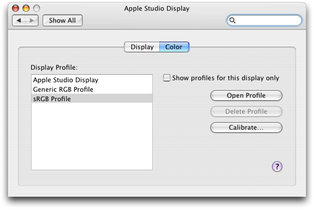
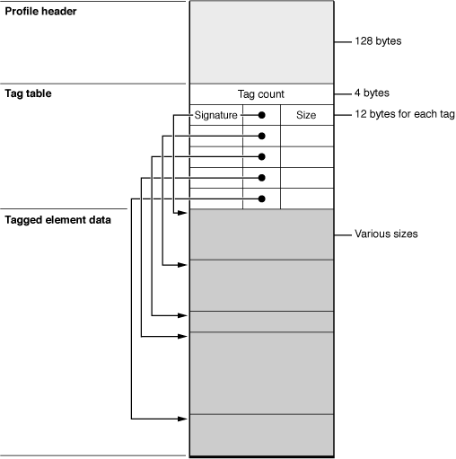
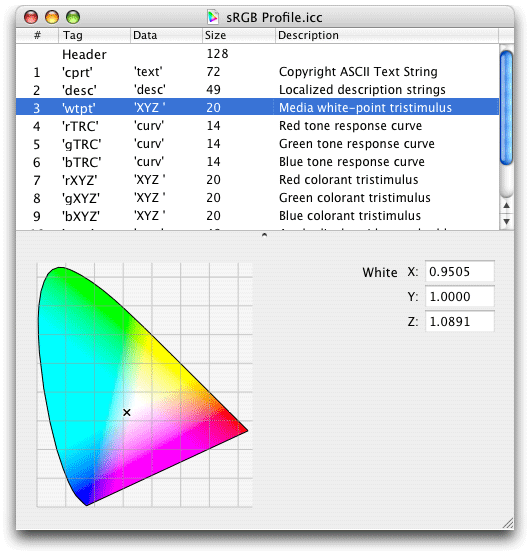

> 导航：[总目录](../../../README.md) · [documentation](../../../_indexes/documentation.md) · [Color Programming Topics](Introduction%20to%20Color%20Programming%20Topics%20for%20Cocoa.md)


[Next](Accessing%20a%20Color%E2%80%99s%20Components.md)[Previous](About%20Color%20Lists.md)

# Working With Color Spaces

This document discusses the use of color spaces when creating or converting [NSColor](https://developer.apple.com/documentation/appkit/nscolor) objects. It also describes how to create objects representing new color spaces by using the [NSColorSpace](https://developer.apple.com/documentation/appkit/nscolorspace) class.

The methods of the `NSColor` class that create or convert color objects make explicit or implicit reference to a color space, either in the form of a name or an object. After all, colors cannot be defined without a color space providing the environment for definition. The following sections summarize these `NSColor` methods and offer guidelines for their use in programming.

Many color-creation factory methods of `NSColor` embed the name of the color space in the method name. You must specify the component values of the color after the keywords of the method. For example, `colorWithDeviceCyan:magenta:yellow:black:alpha:` creates the color using the color space designated by `NSDeviceCMYKColorSpace`. You would create a color in the calibrated HSB color space (which is designated by `NSCalibratedRGBColorSpace` in this case) using `colorWithCalibratedHue:saturation:brightness:alpha:`. Colors in named (catalog) and pattern color spaces also have their own factory creation methods: `colorWithCatalogName:colorName:` and `colorWithPatternImage:`

To create color objects in color spaces represented by `NSColorSpace` objects, use the `colorWithColorSpace:components:count:` method. As illustrated in [Listing 1](#apple-f4xwc4dqnrsv64tfmyxwi33df52wszbpkridimbqgaytqmbxfu4tonrwg4wueqsdjjfeqssk), you can obtain one of the predefined color-space objects by invoking the appropriate `NSColorSpace` class factory method (for example, `genericCMYKColorSpace`).

__Listing 1__  Creating a color from a predefined color-space object

```
float comps[] = {0.4, 0.2, 0.6, 0.0, 1.0};
NSColor *aColor = [NSColor colorWithColorSpace:[NSColorSpace genericCMYKColorSpace] components:comps count:5];
```

The main advantage of using the `colorWithColorSpace:components:count:` method to create colors is that you can use an object representing a custom color space (see [Making Custom Color Spaces](#apple-f4xwc4dqnrsv64tfmyxwi33df52wszbpkridimbqgaytqmbxfu4tmojrg4)). You are not limited to the predefined color-space objects.

NSColorSpace objects have advantages over color-space names by virtue of being objects. For example, you can also query these objects about their properties, such as the number of components, the values of those component, and the localized name. You can also archive and unarchive color-space objects.

Some color-creation NSColor methods make no reference to a color space in their names. Some of these class factory methods create primary and secondary colors, such as `blueColor` and `purpleColor`; others, such as `lightGrayColor`, create grayscale colors. These `NSColor` factory methods assume a color space of calibrated RGB (`NSCalibratedRGBColorSpace`) or calibrated white (`NSCalibratedWhiteColorSpace`), as appropriate. In most cases the alpha component (opacity) is 1.0.

Other color-creation methods of `NSColor` create objects representing the standard colors of user-interface objects in macOS; examples of these methods include `controlTextColor`, `gridColor`, and `windowFrameColor`. You should not make any assumptions about the color space of these colors. Indeed, for any color object, it is a good practice not to assume its color space, but instead to convert it to the desired color space before using it. See [Programming Guidelines for Color Spaces](#apple-f4xwc4dqnrsv64tfmyxwi33df52wszbpkridimbqgaytqmbxfu4tomzwga) for more on this subject.

NSColor offers the `colorUsingColorSpaceName:` method for converting colors from once color space to another. This method takes a color-space name as an argument. Here’s an example of a use of this method, which converts the `NSColor` object created above from a CMYK to an RGB color space:

```
NSColor *bColor = [aColor colorUsingColorSpaceName:NSCalibratedRGBColorSpace];
```

The color object created by this method usually has component values that are different from the original object’s component values, but the colors look the same. Sometimes the color conversion is correct only for the current device; the method might even return `nil` if the requested conversion cannot be done.

Note that using the `colorUsingColorSpace:` method for converting a color between color spaces is acceptable, but that the resulting color is represented by a custom color space and will not respond to color space-specific methods. For example, the `NSColor` object created by the following method is in the RGB color space but represented by a custom color space ([NSColorSpace](https://developer.apple.com/documentation/appkit/nscolorspace)), and thus raises an exception when you send it a `redComponent` message:

```
NSColor *cColor = [aColor colorUsingColorSpace:[NSColorSpace genericRGBColorSpace]];
```

To retrieve specific color attributes with `colorUsingColorSpace:`, use the `getComponents:` method as in the following example:

```
if(cColor){
    CGFloat components[4];
    [cColor getComponents:components];
}
```


Observe the following guidelines when dealing with NSColor objects and color spaces.

The Cocoa color APIs give you a range of predefined color spaces to work with, either through color-space names or as objects returned from `NSColorSpace` factory methods. How do you know which color space to use in any given programming context?

Generally, it is recommended that you use calibrated (or generic) color spaces instead of device color spaces. The colors in device color spaces can vary widely from device to device, whereas calibrated color spaces usually result in a reasonably accurate color. Device color spaces, on the other hand, might yield better performance under certain circumstances, so if you know for certain the device that will render or capture the color, use a device color space instead.

As for the model of the predefined color space, it depends on where the color is to be rendered or captured. Use RGB for color monitors and scanners, `NSCalibratedWhiteColorSpace` or `genericGrayColorSpace` objects for grayscale monitors, and CYMK for printers. If the destination is indeterminate, use RGB.

It is invalid to use an accessor method related to components of a particular color space on an `NSColor` object that is not in that color space. For example, `NSColor` methods such as `redComponent` and `getRed:green:blue:alpha:` work on color objects in the calibrated and device RGB color spaces. If you send such a message to an NSColor object in the CMYK color space, an exception is raised.

If you have an `NSColor` object in an unknown color space and you want to extract its components, you should first convert the color object to a known color space before using the component accessor methods of that color space. For example:

```
NSColor *aColor = [color colorUsingColorSpaceName:NSCalibratedRGBColorSpace];
if (aColor) {
    float rcomp = [aColor redComponent];
}
```

If the color is already in the requested color space, you get back the original object.

A developer rarely needs a color space that is not supplied by the system. Not only are the predefined generic (calibrated) and device color spaces sufficient for most purposes, but macOS allows you to create custom color spaces without having to write any code. In the Color pane of the Displays system preference (Figure 1) there is a Calibrate button; clicking this button launches a wizard that steps you through the procedure for creating a custom profile, from which a custom color space is made. (The custom profile is stored at `~/Library/ColorSync/Profiles`.)

__Figure 1__  The Color pane of the Displays system preference



But if for some reason you need to create a custom color space programmatically, you can use one of the initializer methods of the NSColorSpace class. You initialize a custom NSColorSpace object with one of two sources of data:

- A ColorSync profile
- An ICC profile

The NSColorSpace initializer `initWithICCProfileData:` method takes an NSData object encapsulating an ICC profile map. This profile map is a data structure depicted in Figure 2. The header of the profile map provides information applications need to search and sort ICC profiles, such as profile size, version, CMM type, color space, and primary platform. The tag table that follows consists of a variable number of entries; each entry has a unique tag signature, an offset to the beginning of the tag element data, and the size of that data. The International Color Consortium (ICC) maintains a website at [http://www.color.org/icc_specs2.html](http://www.color.org/icc_specs2.html) from which you can obtain the most recent ICC profile specification.

__Figure 2__  An ICC profile map



Once you have the ICC profile map constructed you can initialize an NSData object with it using the class factory methods `dataWithBytes:length:` or `dataWithBytesNoCopy:length:freeWhenDone:`. Then you can invoke the NSColorSpace initializer `initWithICCProfileData:`, passing in the data object.

The other alternative for creating an object representing a custom color space is to initialize the object with a `CMProfileRef` “object.” A `CMProfileRef` opaque type represents a ColorSync profile. Typically you call the `CMNewProfile` function to create a new (but incomplete) profile and backing copy in a specific location. The function takes a pointer to the location and returns a pointer to the created `CMProfileRef`.

```
CMError CMNewProfile (
   CMProfileRef * prof,
   const CMProfileLocation * theProfile
)
```

A ColorSync profile is identical to an ICC profile. You must fill in the profile header fields and populate the profile with tags and their element data. Then call the function `CMUpdateProfile` to save the element data to the profile file. Note that the default ColorSync profile contents include a profile header of type `CM2Header` and an element table. See _[ColorSync Manager Reference](https://developer.apple.com/documentation/applicationservices/colorsync_manager)_ for details on how to supply the required ColorSync profile data.

You can view the data of existing ColorSync profiles by running the ColorSync utility. Launch this utility by clicking the Open Profile button of the Color pane of the Displays system preference. Figure 3 shows part of the ColorSync profile for the Apple Studio Display.

__Figure 3__  ColorSync Utility showing values of ICC map



[Next](Accessing%20a%20Color%E2%80%99s%20Components.md)[Previous](About%20Color%20Lists.md)

