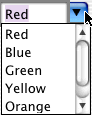

> 导航：[总目录](../../../README.md) · [documentation](../../../_indexes/documentation.md) · [Combo Box Programming Topics](Introduction%20to%20Combo%20Boxes.md)

[Next](Providing%20Data%20for%20a%20Combo%20Box.md)[Previous](Introduction%20to%20Combo%20Boxes.md)

# How Combo Boxes Work

A combo box is a control that gives the user two ways to enter a value: entering it directly in a text field, or choosing it from a pop-up list of pre-selected values. Use this control whenever you want the user to enter information that can be selected from a finite list of options. Note that while you can construct your NSComboBox so that users are restricted to only selecting items from the combo box’s pop-up list, this isn’t the combo box’s normal behavior.

While the pop-up list is visible, typing into the text field causes an incremental search to be performed on the list. If there’s a match, the selection in the pop-up list changes to reflect the match.

The NSComboBox normally looks like this:

When you click the downward-pointing arrow at the right-hand side of the text field the pop-up list appears, like this:

If there isn’t sufficient room for the pop-up list to be displayed below the text field, it’s instead displayed above the text field. Selecting an item from the list, clicking anywhere outside the control, or activating another window dismisses the pop-up list.

Note that NSComboBox is a also a subclass of NSTextField, and thus inherits all of NSTextField’s methods. NSComboBox relies heavily upon its cell class, NSComboBoxCell. NSComboBoxCell is a NSTextFieldCell subclass, which combines a text field cell with a button cell.

A combo box is implemented by two classes: NSComboBoxCell, the cell which does most of the work, and NSComboBox, the control that contains that cell. Every method in NSComboBoxCell has a cover in NSComboBox. (A cover is a method of the same name that calls the original method.)

[Next](Providing%20Data%20for%20a%20Combo%20Box.md)[Previous](Introduction%20to%20Combo%20Boxes.md)

