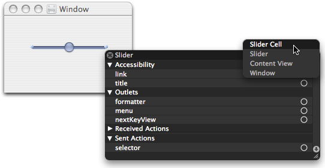
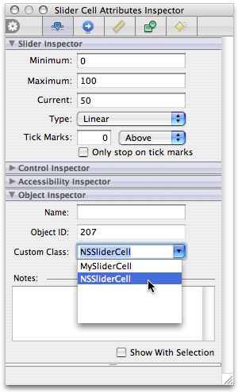

> 导航：[总目录](../../../README.md) · [documentation](../../../_indexes/documentation.md) · [Control and Cell Programming Topics](Introduction%20to%20Control%20and%20Cell%20Programming%20Topics%20for%20Cocoa.md)


[Next](Using%20the%20System%20Control%20Tint.md)[Previous](Subclassing%20NSCell.md)

# Subclassing NSControl

If you are going to create a custom [NSControl](https://developer.apple.com/documentation/appkit/nscontrol) class that performs its own initialization, you should override the designated initializer ([initWithFrame:](https://developer.apple.com/documentation/appkit/nscontrol/1428900-init)). Be aware, however, that this method is not called when an instance of your subclass of an Application Kit control class is unarchived from a nib.

If you create a custom control subclass that is paired with a custom cell subclass—for example, a custom subclass of [NSSlider](https://developer.apple.com/documentation/appkit/nsslider) and a custom subclass of [NSSliderCell](https://developer.apple.com/documentation/appkit/nsslidercell)—you have two ways of associating an instance of that custom cell with an instance of the custom control. The first approach requires that you have version 3 of Interface Builder. In Interface Builder when you place a control on a window, the control and its cell are instantiated and, when you save the user interface, these objects (along with other placed objects) are encoded and serialized to a nib file. Interface Builder also helps you define custom subclasses, including subclasses of framework control classes such as `NSButton` and `NSSlider`. Interface Builder also allows you to change the class of a placed control object to a custom control class, but earlier versions of the application give you no way to do the same with custom cells associated with the control object.

But version 3.0 of Interface Builder lets you set the class of a control’s cell. To do this, click the control to select it and right-click the mouse (Control-click on single-button mice). Then click again in the upper-right corner of the pop-up list that appears. A submenu lists the objects under the mouse pointer—including the control’s cell. In the case of an `NSSliderCell` object, as shown in Figure 1, the submenu includes a “Slider Cell” item. Select the cell item.

__Figure 1__  Selecting the cell of a control in Interface Builder



Next open the Inspector window for the selected cell object. Find the “Object inspector” section and, in the Custom Class combo box select (or enter) the name of your custom cell class.

__Figure 2__  Setting the custom cell class of a control



If version 3.0 of Interface Builder is not available, you still have a programmatic way to assign an instance of a custom cell to a custom control, which is illustrated in Listing 1. In the custom control subclass, when all objects are unarchived from the nib file, create an instance of the custom cell and assign it all pertinent attributes of the current cell. Then set the custom cell as the cell of the control using the [setCell:](https://developer.apple.com/documentation/appkit/nscontrol/1428960-cell) method of `NSControl`.

__Listing 1__  Creating and setting a custom cell for a custom control

```objc
- (void)awakeFromNib {
    MySliderCell *newCell = [[MySliderCell alloc] init];
    id oldCell = [self cell];
    [newCell setImage:[oldCell image]];
    [newCell setMinValue:[oldCell minValue]];
    [newCell setMaxValue:[oldCell maxValue]];
    [newCell setSliderType:[oldCell sliderType]];
    // ....  set other slider cell attributes
    [self setCell:newCell];
    [newCell release];
}
```

You can override the [cellClass](https://developer.apple.com/documentation/appkit/nscontrol/1428891-cellclass) method whenever a control needs to make a new cell for itself—for example if it is instantiated with `initWithFrame:`. The `initWithFrame:` method uses the return value of `cellClass` to allocate and initialize an `NSCell` object of the correct type.

__Listing 2__  Overriding `cellClass`

```objc
+ (Class) cellClass
{
    return [MySliderCell class];
}
```

Note that overriding the `cellClass` class method of `NSControl` does not change the class of a cell object unarchived from a nib file.

[Next](Using%20the%20System%20Control%20Tint.md)[Previous](Subclassing%20NSCell.md)

