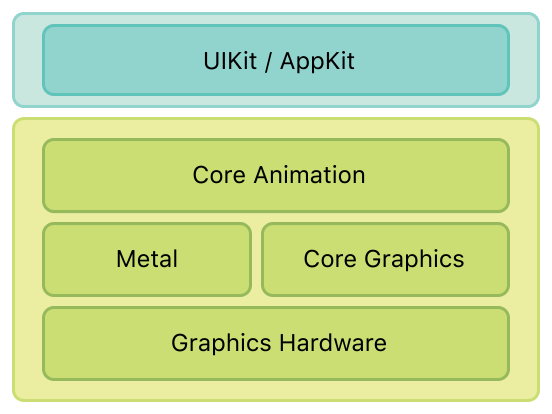

> 导航：[总目录](../../../README.md) · [文档](../../../_indexes/documentation.md)

[下一页](Core%20Animation%20Basics.md)

# 关于 Core Animation

Core Animation 是一套图形渲染与动画基础设施，在 iOS 和 OS X 上都可以使用，你可以用它来为 app 的视图和其他可视元素添加动画效果。有了 Core Animation，绘制动画每一帧所需的大部分工作都会替你完成。你只需要配置少量动画参数（例如起点和终点），然后告诉 Core Animation 开始运行即可。剩下的工作都由 Core Animation 完成，它会把实际的绘制工作大部分交给板载图形硬件去做，从而加速渲染。这种自动的图形加速能带来更高的帧率和流畅的动画效果，同时不会给 CPU 增加负担，也不会拖慢你的 app。

如果你在编写 iOS app，那么无论你是否意识到，你都已经在使用 Core Animation 了。如果你在编写 OS X app，只需极少的工作量就可以利用上 Core Animation。Core Animation 位于 AppKit 和 UIKit 之下，并与 Cocoa 和 Cocoa Touch 的视图工作流程紧密集成。当然，Core Animation 也提供了一些接口，用来扩展 app 视图所暴露的能力，让你能对 app 的动画进行更精细的控制。

你也许永远都不需要直接使用 Core Animation，但一旦用到它，你就应该理解 Core Animation 在 app 基础设施中所扮演的角色。

### Core Animation 管理你 app 的内容

Core Animation 本身并不是一套绘制系统。它是一套用于在硬件中合成和操作 app 内容的基础设施。这套基础设施的核心是_图层对象_，你可以用它来管理和操作你的内容。图层会把你的内容捕获为一张位图，图形硬件可以很方便地对这张位图进行操作。在大多数 app 中，图层被用作管理视图内容的一种方式，但根据需要，你也可以创建独立的图层。

### 图层的修改会触发动画

你用 Core Animation 创建的大多数动画，都涉及对图层属性的修改。和视图一样，图层对象也有一个 bounds 矩形、屏幕上的 position、不透明度、变换以及许多其他与视觉外观相关的属性，这些属性都可以被修改。对于其中大多数属性，改变属性值会产生一个隐式动画，图层会从旧值动画过渡到新值。如果你想对最终的动画行为进行更多控制，也可以显式地为这些属性添加动画。

### 图层可以组织成层级结构

图层可以按层级方式排列，从而形成父子关系。图层的排列方式会以类似视图的方式影响它们所管理的可视内容。一组附加到视图上的图层，其层级结构与相应的视图层级结构是一一对应的。你还可以把独立的图层加入图层层级结构中，从而把 app 的可视内容扩展到视图之外。

### Action 让你可以更改图层的默认行为

图层的隐式动画是通过_动作对象（action object）_实现的，动作对象是实现了预定义接口的通用对象。Core Animation 使用动作对象来实现通常与图层关联的默认动画集合。你可以创建自己的动作对象来实现自定义动画，也可以用它们实现其他类型的行为。之后你把动作对象赋值给图层的某个属性。当该属性发生变化时，Core Animation 会取出你的动作对象，并让它执行自己的动作。

本文档面向那些需要对 app 动画进行更多控制、或者希望利用图层来提升 app 绘制性能的开发者。本文档还提供了关于图层与视图在 iOS 和 OS X 上如何集成的信息。图层与视图的集成方式在 iOS 和 OS X 上是不同的，理解这些差异对于创建高效的动画非常重要。

你应该已经了解目标平台的视图架构，并且熟悉如何创建基于视图的动画。如果还不熟悉，你应该阅读以下文档之一：

- 对于 iOS app，你应该了解 _[View Programming Guide for iOS](../../Windows%20Views/View%20Programming%20Guide%20for%20iOS/About%20Windows%20and%20Views.md#apple-f4xwc4dqnrsv64tfmyxwi33df52wszbpkridimbqga4tkmbt)_ 中描述的视图架构。
- 对于 OS X app，你应该了解 _[View Programming Guide](../View%20Programming%20Guide/Introduction%20to%20View%20Programming%20Guide%20for%20Cocoa.md#apple-f4xwc4dqnrsv64tfmyxwi33df52wszbpkridimbqgazdsnzy)_ 中描述的视图架构。

要查看如何使用 Core Animation 实现特定类型动画的示例，请参阅 _[Core Animation Cookbook](../../Graphics%20Imaging/Core%20Animation%20Cookbook/Core%20Animation%20Cookbook.md#apple-f4xwc4dqnrsv64tfmyxwi33df52wszbpkridimbqga2timbw)_。

[下一页](Core%20Animation%20Basics.md)

