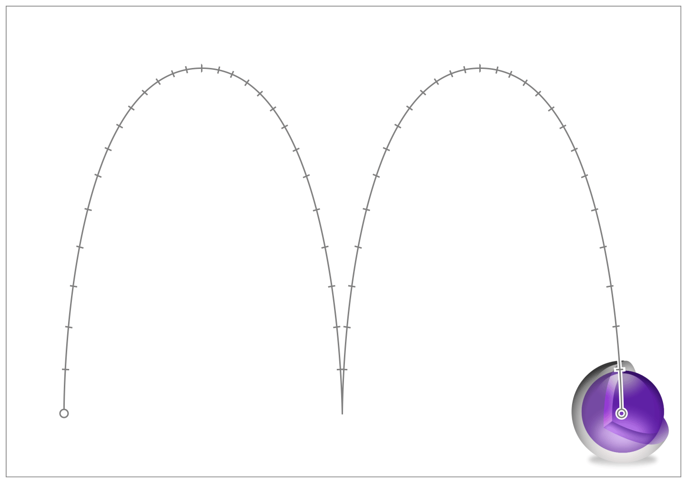

> 导航：[总目录](../../../README.md) · [文档](../../../_indexes/documentation.md) · [Core Animation 编程指南](About%20Core%20Animation.md)


[下一页](Building%20a%20Layer%20Hierarchy.md)[上一页](Setting%20Up%20Layer%20Objects.md)

# 图层内容动画

Core Animation 提供的基础设施让你能够轻松为应用的图层（以及由此延伸到拥有这些图层的视图）创建复杂的动画。常见的例子包括改变图层帧矩形的大小、改变它在屏幕上的位置、应用旋转变换，或者改变它的不透明度。使用 Core Animation 时，触发一个动画往往就像改变属性那么简单，不过你也可以创建动画对象并显式设置动画参数。

有关创建更高级动画的信息，请参阅[高级动画技巧](Advanced%20Animation%20Tricks.md#apple-f4xwc4dqnrsv64tfmyxwi33df52wszbpkridimbqga2dkmjufvbuqobnknltc)。

根据需要，你可以隐式（implicit）或显式（explicit）地执行简单动画。隐式动画使用默认的时间和动画属性来执行动画，而显式动画则需要你使用动画对象自行配置这些属性。因此，如果你只想用很少的代码做出改变，并且默认的时间设置就能满足需求，隐式动画是最合适的选择。

简单动画就是改变图层的属性，让 Core Animation 随时间对这些变化进行动画处理。图层定义了许多会影响其可见外观的属性，改变其中任意一个属性都可以用来为外观变化添加动画。例如，将图层的不透明度从 `1.0` 改为 `0.0` 会使图层淡出并变得透明。

要触发隐式动画，你只需更新图层对象的属性即可。当你修改图层树（layer tree）中的图层对象时，这些改动会立即体现在对象本身上。然而，图层对象的视觉外观并不会立即发生变化。实际发生的是，Core Animation 会把你的改动当作触发条件，创建并调度一个或多个隐式动画来执行。因此，像清单 3-1 中那样做出改动，会让 Core Animation 为你创建一个动画对象，并将该动画调度为在下一个更新周期开始运行。

__清单 3-1__  隐式地为改动添加动画

```objc
theLayer.opacity = 0.0;
```

要使用动画对象显式地完成同样的改动，需要创建一个 [CABasicAnimation](https://developer.apple.com/documentation/quartzcore/cabasicanimation) 对象，并用它来配置动画参数。在把动画添加到图层之前，你可以设置动画的起始值和结束值、修改持续时间，或者修改任何其他动画参数。清单 3-2 展示了如何使用动画对象让图层淡出。创建该对象时，你需要指定想要添加动画的属性的键路径（key path），然后设置动画参数。要执行动画，需要使用 [addAnimation:forKey:](https://developer.apple.com/documentation/quartzcore/calayer/1410848-addanimation) 方法把它添加到想要添加动画的图层上。

__清单 3-2__  显式地为改动添加动画

```objc
CABasicAnimation* fadeAnim = [CABasicAnimation animationWithKeyPath:@"opacity"];
fadeAnim.fromValue = [NSNumber numberWithFloat:1.0];
fadeAnim.toValue = [NSNumber numberWithFloat:0.0];
fadeAnim.duration = 1.0;
[theLayer addAnimation:fadeAnim forKey:@"opacity"];

// 将图层中的实际数据值改为最终值。
theLayer.opacity = 0.0;
```

隐式动画会更新图层对象的数据值，与之不同的是，显式动画不会修改图层树中的数据。显式动画只负责产生动画效果本身。动画结束时，Core Animation 会从图层上移除该动画对象，并使用图层当前的数据值重新绘制图层。如果你希望显式动画带来的改动是永久性的，就必须像前面的示例那样同时更新图层的属性。

隐式动画和显式动画通常都是在当前运行循环周期结束后才开始执行，而且当前线程必须要有一个运行循环，动画才能被执行。如果你同时改变多个属性，或者向图层添加多个动画对象，所有这些属性变化都会同时产生动画。例如，你可以通过同时配置两个动画，让图层在移出屏幕的同时逐渐淡出。不过，你也可以将动画对象配置为在特定时间开始。有关修改动画时间的更多信息，请参阅[自定义动画的时间](Advanced%20Animation%20Tricks.md#apple-f4xwc4dqnrsv64tfmyxwi33df52wszbpkridimbqga2dkmjufvbuqobnknlte)。

基于属性的动画是让一个属性从起始值变化到结束值，而 [CAKeyframeAnimation](https://developer.apple.com/documentation/quartzcore/cakeyframeanimation) 对象则允许你在一组目标值之间进行动画，这些变化可以是线性的，也可以不是。关键帧动画（keyframe animation）由一组目标数据值和到达每个值所需的时间组成。在最简单的配置中，你可以用一个数组同时指定这些值和对应的时间。对于图层位置的改变，你还可以让这些变化沿着一条路径进行。动画对象会拿到你指定的关键帧，并在给定的时间段内从一个值向下一个值插值，从而构建出动画。

图 3-1 展示了一个图层 [position](https://developer.apple.com/documentation/quartzcore/calayer/1410791-position) 属性长达 5 秒的动画。该动画让位置沿着一条路径变化，这条路径是用 [CGPathRef](https://developer.apple.com/documentation/coregraphics/cgpath) 数据类型指定的。实现该动画的代码见[清单 3-3](#apple-f4xwc4dqnrsv64tfmyxwi33df52wszbpkridimbqga2dkmjufvbuqmznknltcmy)。

__图 3-1__  图层 position 属性的 5 秒关键帧动画



清单 3-3 展示了实现图 3-1 中动画所用的代码。这个示例中的路径对象用于定义动画每一帧图层所处的位置。

__清单 3-3__  创建一个弹跳关键帧动画

```objc
// 创建一个包含两段圆弧（一次弹跳）的 CGPath
CGMutablePathRef thePath = CGPathCreateMutable();
CGPathMoveToPoint(thePath,NULL,74.0,74.0);
CGPathAddCurveToPoint(thePath,NULL,74.0,500.0,
                                   320.0,500.0,
                                   320.0,74.0);
CGPathAddCurveToPoint(thePath,NULL,320.0,500.0,
                                   566.0,500.0,
                                   566.0,74.0);

CAKeyframeAnimation * theAnimation;

// 创建动画对象，将 position 属性指定为键路径。
theAnimation=[CAKeyframeAnimation animationWithKeyPath:@"position"];
theAnimation.path=thePath;
theAnimation.duration=5.0;

// 将动画添加到图层。
[theLayer addAnimation:theAnimation forKey:@"position"];
```


关键帧的值是关键帧动画中最重要的部分，这些值定义了动画在执行过程中的行为。指定关键帧值的主要方式是使用一个对象数组，但对于包含 [CGPoint](https://developer.apple.com/documentation/coregraphics/cgpoint) 数据类型的值（比如图层的 [anchorPoint](https://developer.apple.com/documentation/quartzcore/calayer/1410817-anchorpoint) 和 [position](https://developer.apple.com/documentation/quartzcore/calayer/1410791-position) 属性），你也可以改用 [CGPathRef](https://developer.apple.com/documentation/coregraphics/cgpath) 数据类型来指定。

指定值数组时，数组里放什么内容取决于该属性所需的数据类型。有些对象可以直接添加到数组中；但有些对象在添加之前必须先转换为 `id` 类型，而所有标量类型或结构体都必须先用一个对象包装起来。例如：

- 对于接受 [CGRect](https://developer.apple.com/documentation/coregraphics/cgrect) 的属性（比如 bounds 和 frame 属性），把每个矩形都包装进一个 `NSValue` 对象中。
- 对于图层的 transform 属性，把每个 [CATransform3D](https://developer.apple.com/documentation/quartzcore/catransform3d) 矩阵都包装进一个 `NSValue` 对象中。为这个属性添加动画，会让关键帧动画依次将每个变换矩阵应用到图层上。
- 对于 [borderColor](https://developer.apple.com/documentation/quartzcore/calayer/1410903-bordercolor) 属性，在把每个 [CGColorRef](https://developer.apple.com/documentation/coregraphics/cgcolor) 数据类型添加到数组之前，先将其转换为 `id` 类型。
- 对于接受 [CGFloat](https://developer.apple.com/documentation/coregraphics/cgfloat) 值的属性，在把每个值添加到数组之前，先将其包装进一个 [NSNumber](https://developer.apple.com/library/archive/documentation/LegacyTechnologies/WebObjects/WebObjects_3.5/Reference/Frameworks/ObjC/Foundation/Classes/NSNumber/Description.html#//apple_ref/occ/cl/NSNumber) 对象中。
- 为图层的 [contents](https://developer.apple.com/documentation/quartzcore/calayer/1410773-contents) 属性添加动画时，需要指定一个 [CGImageRef](https://developer.apple.com/documentation/coregraphics/cgimageref) 数据类型的数组。

对于接受 `CGPoint` 数据类型的属性，你可以创建一个点数组（用 `NSValue` 对象包装），也可以使用一个 `CGPathRef` 对象来指定要遵循的路径。当你指定一个点数组时，关键帧动画对象会在相邻两点之间画一条直线，并沿着这条路径运动。当你指定一个 `CGPathRef` 对象时，动画会从路径的起点开始，沿着它的轮廓运动，包括任何曲线部分。你可以使用开放路径或闭合路径。

关键帧动画的时间和节奏比基本动画更复杂，你可以使用以下几个属性来控制它：

- [calculationMode](https://developer.apple.com/documentation/quartzcore/cakeyframeanimation/1412500-calculationmode) 属性定义了计算动画时间所使用的算法。这个属性的值会影响其他与时间相关的属性的使用方式。

  - 线性和三次（cubic）动画——即 `calculationMode` 属性被设为 [kCAAnimationLinear](https://developer.apple.com/documentation/quartzcore/caanimationcalculationmode/1412513-linear) 或 [kCAAnimationCubic](https://developer.apple.com/documentation/quartzcore/caanimationcalculationmode/1412481-cubic) 的动画——会使用提供的时间信息来生成动画。这些模式能让你对动画时间拥有最大程度的控制。
  - 匀速（paced）动画——即 `calculationMode` 属性被设为 [kCAAnimationPaced](https://developer.apple.com/documentation/quartzcore/kcaanimationpaced) 或 [kCAAnimationCubicPaced](https://developer.apple.com/documentation/quartzcore/caanimationcalculationmode/1412452-cubicpaced) 的动画——不依赖 `keyTimes` 或 `timingFunctions` 属性提供的外部时间值，而是会隐式计算时间值，从而让动画保持恒定速度。
  - 离散（discrete）动画——即 `calculationMode` 属性被设为 [kCAAnimationDiscrete](https://developer.apple.com/documentation/quartzcore/caanimationcalculationmode/1412517-discrete) 的动画——会让被添加动画的属性在关键帧值之间直接跳变，不进行任何插值。这种计算模式会使用 `keyTimes` 属性中的值，但会忽略 `timingFunctions` 属性
- [keyTimes](https://developer.apple.com/documentation/quartzcore/cakeyframeanimation/1412522-keytimes) 属性指定了应用每个关键帧值的时间标记。只有当计算模式被设为 [kCAAnimationLinear](https://developer.apple.com/documentation/quartzcore/caanimationcalculationmode/1412513-linear)、[kCAAnimationDiscrete](https://developer.apple.com/documentation/quartzcore/caanimationcalculationmode/1412517-discrete) 或 [kCAAnimationCubic](https://developer.apple.com/documentation/quartzcore/caanimationcalculationmode/1412481-cubic) 时，这个属性才会生效；对于匀速动画，这个属性不会被使用。
- [timingFunctions](https://developer.apple.com/documentation/quartzcore/cakeyframeanimation/1412465-timingfunctions) 属性指定了每段关键帧所使用的时间曲线（timing curve）。（这个属性取代了继承而来的 [timingFunction](https://developer.apple.com/documentation/quartzcore/caanimation/1412456-timingfunction) 属性。）

如果你想自己处理动画的时间控制，可以使用 [kCAAnimationLinear](https://developer.apple.com/documentation/quartzcore/caanimationcalculationmode/1412513-linear) 或 [kCAAnimationCubic](https://developer.apple.com/documentation/quartzcore/caanimationcalculationmode/1412481-cubic) 模式，并配合 `keyTimes` 和 `timingFunctions` 属性。`keyTimes` 定义了应用每个关键帧值的时间点，而所有中间值的时间则由时间函数（timing function）控制，它允许你为每一段应用渐入（ease-in）或渐出（ease-out）曲线。如果你不指定任何时间函数，时间就是线性的。

动画通常会一直运行到完成，但如果需要，你也可以用以下两种方式之一提前停止它们：

- 要从图层上移除单个动画对象，可以调用图层的 [removeAnimationForKey:](https://developer.apple.com/documentation/quartzcore/calayer/1410939-removeanimation) 方法来移除你的动画对象。这个方法会使用传给 [addAnimation:forKey:](https://developer.apple.com/documentation/quartzcore/calayer/1410848-addanimation) 方法的那个键来识别动画。你指定的键不能为 `nil`。
- 要移除图层上的所有动画对象，可以调用图层的 [removeAllAnimations](https://developer.apple.com/documentation/quartzcore/calayer/1410810-removeallanimations) 方法。这个方法会立即移除所有正在进行的动画，并使用图层当前的状态信息重新绘制图层。

当你从图层上移除一个动画时，Core Animation 会用图层当前的值重新绘制图层作为响应。由于当前值通常就是动画的结束值，这可能会导致图层的外观突然跳变。如果你希望图层的外观保持在动画最后一帧的样子，可以使用呈现树（presentation tree）中的对象取出这些最终值，再把它们设置到图层树中的对象上。

有关暂时暂停动画的信息，请参阅[清单 5-4](Advanced%20Animation%20Tricks.md#apple-f4xwc4dqnrsv64tfmyxwi33df52wszbpkridimbqga2dkmjufvbuqobnknltcna)。

如果你想同时为一个图层对象应用多个动画，可以使用 [CAAnimationGroup](https://developer.apple.com/documentation/quartzcore/caanimationgroup) 对象把它们组合在一起。使用组对象可以提供单一的配置入口，从而简化多个动画对象的管理。应用到动画组（animation group）上的时间和持续时间值，会覆盖各个独立动画对象中的同名值。

清单 3-4 展示了如何使用动画组，以相同的持续时间同时执行两个与边框相关的动画。

__清单 3-4__  同时执行两个动画

```objc
// 动画 1
CAKeyframeAnimation* widthAnim = [CAKeyframeAnimation animationWithKeyPath:@"borderWidth"];
NSArray* widthValues = [NSArray arrayWithObjects:@1.0, @10.0, @5.0, @30.0, @0.5, @15.0, @2.0, @50.0, @0.0, nil];
widthAnim.values = widthValues;
widthAnim.calculationMode = kCAAnimationPaced;

// 动画 2
CAKeyframeAnimation* colorAnim = [CAKeyframeAnimation animationWithKeyPath:@"borderColor"];
NSArray* colorValues = [NSArray arrayWithObjects:(id)[UIColor greenColor].CGColor,
            (id)[UIColor redColor].CGColor, (id)[UIColor blueColor].CGColor,  nil];
colorAnim.values = colorValues;
colorAnim.calculationMode = kCAAnimationPaced;

// 动画组
CAAnimationGroup* group = [CAAnimationGroup animation];
group.animations = [NSArray arrayWithObjects:colorAnim, widthAnim, nil];
group.duration = 5.0;

[myLayer addAnimation:group forKey:@"BorderChanges"];
```

一种更高级的动画分组方式是使用事务（transaction）对象。事务提供了更强的灵活性，允许你创建嵌套的动画集合，并为每一组分别指定不同的动画参数。有关如何使用事务对象的信息，请参阅[显式事务能让你更改动画参数](Advanced%20Animation%20Tricks.md#apple-f4xwc4dqnrsv64tfmyxwi33df52wszbpkridimbqga2dkmjufvbuqobnknltg)。

Core Animation 提供了检测动画开始或结束的支持。这些通知正是执行与动画相关的各类整理工作的好时机。例如，你可以用开始通知来建立一些相关的状态信息，再用对应的结束通知来清理这些状态。

有两种不同的方式可以获知动画的状态：

- 使用 [setCompletionBlock:](https://developer.apple.com/documentation/quartzcore/catransaction/1448281-setcompletionblock) 方法为当前事务添加一个完成 block。当事务中的所有动画都执行完毕后，事务会执行你的完成 block。
- 为你的 `CAAnimation` 对象指定一个委托（delegate），并实现 `animationDidStart:` 和 `animationDidStop:finished:` 委托方法。

如果你想把两个动画串联起来，让一个动画在另一个结束时开始，不要使用动画通知，而应该使用动画对象的 [beginTime](https://developer.apple.com/documentation/quartzcore/camediatiming/1427654-begintime) 属性，让每个动画在你想要的时间开始。要把两个动画串联起来，把第二个动画的开始时间设为第一个动画的结束时间即可。有关动画和时间值的更多信息，请参阅[自定义动画的时间](Advanced%20Animation%20Tricks.md#apple-f4xwc4dqnrsv64tfmyxwi33df52wszbpkridimbqga2dkmjufvbuqobnknlte)。

如果一个图层属于某个由图层支持的视图（layer-backed view），推荐的动画创建方式是使用 `UIKit` 或 `AppKit` 提供的基于视图的动画接口。虽然也有办法直接使用 Core Animation 接口为图层添加动画，但具体做法取决于目标平台。

由于 iOS 视图始终拥有一个底层图层，[UIView](https://developer.apple.com/documentation/uikit/uiview) 类本身的大部分数据都直接来自图层对象。因此，你对图层所做的改动也会自动反映到视图对象上。这意味着你既可以使用 Core Animation 接口，也可以使用 `UIView` 接口来完成改动。

如果你想使用 Core Animation 的类来发起动画，就必须把所有 Core Animation 调用都放在一个基于视图的动画 block 内部。[UIView](https://developer.apple.com/documentation/uikit/uiview) 类默认会禁用图层动画，但在动画 block 内部会重新启用它们。因此，在动画 block 之外所做的任何改动都不会产生动画效果。清单 3-5 展示了一个示例，说明如何隐式地改变图层的不透明度，同时显式地改变它的位置。在这个示例中，`myNewPosition` 变量是预先计算好并被 block 捕获的。两个动画同时开始，但不透明度动画使用默认的时间设置运行，而位置动画则按照其动画对象中指定的时间设置运行。

__清单 3-5__  为附加到 iOS 视图的图层添加动画

```objc
[UIView animateWithDuration:1.0 animations:^{
   // 隐式地改变不透明度。
   myView.layer.opacity = 0.0;

   // 显式地改变位置。
   CABasicAnimation* theAnim = [CABasicAnimation animationWithKeyPath:@"position"];
   theAnim.fromValue = [NSValue valueWithCGPoint:myView.layer.position];
   theAnim.toValue = [NSValue valueWithCGPoint:myNewPosition];
   theAnim.duration = 3.0;
   [myView.layer addAnimation:theAnim forKey:@"AnimateFrame"];
}];
```


要在 OS X 中为图层支持的视图的改动添加动画，最好使用视图自身的接口。你应该很少（如果有的话）直接修改附加在图层支持的 `NSView` 对象上的图层。`AppKit` 负责创建和配置这些图层对象，并在应用运行期间对它们进行管理。修改该图层可能会导致它与视图对象失去同步，从而产生意想不到的结果。对于图层支持的视图，你的代码绝对*不能*修改图层对象的以下任何属性：

- [anchorPoint](https://developer.apple.com/documentation/quartzcore/calayer/1410817-anchorpoint)
- [bounds](https://developer.apple.com/documentation/quartzcore/calayer/1410915-bounds)
- [compositingFilter](https://developer.apple.com/documentation/quartzcore/calayer/1410748-compositingfilter)
- [filters](https://developer.apple.com/documentation/quartzcore/calayer/1410901-filters)
- [frame](https://developer.apple.com/documentation/quartzcore/calayer/1410779-frame)
- [geometryFlipped](https://developer.apple.com/documentation/quartzcore/calayer/1410960-geometryflipped)
- [hidden](https://developer.apple.com/documentation/quartzcore/calayer/1410838-ishidden)
- [position](https://developer.apple.com/documentation/quartzcore/calayer/1410791-position)
- [shadowColor](https://developer.apple.com/documentation/quartzcore/calayer/1410829-shadowcolor)
- [shadowOffset](https://developer.apple.com/documentation/quartzcore/calayer/1410970-shadowoffset)
- [shadowOpacity](https://developer.apple.com/documentation/quartzcore/calayer/1410751-shadowopacity)
- [shadowRadius](https://developer.apple.com/documentation/quartzcore/calayer/1410819-shadowradius)
- [transform](https://developer.apple.com/documentation/quartzcore/calayer/1410836-transform)

`AppKit` 默认会为其图层支持的视图禁用隐式动画。视图的 animator 代理对象会自动为你重新启用隐式动画。如果你想直接为图层属性添加动画，也可以通过将当前 `NSAnimationContext` 对象的 [allowsImplicitAnimation](https://developer.apple.com/documentation/appkit/nsanimationcontext/1525870-allowsimplicitanimation) 属性设为 `YES`，以编程方式重新启用隐式动画。同样，你只应该对不在上述列表中的可动画属性这样做。

如果你使用基于约束的布局规则来管理视图的位置，那么在配置动画时，必须移除任何可能干扰该动画的约束。约束会影响你对视图位置或尺寸所做的任何改动，也会影响视图与其子视图之间的关系。如果你要为其中任何一项的改动添加动画，可以先移除约束，做出改动，然后再应用所需的新约束。

有关约束以及如何使用约束来管理视图布局的更多信息，请参阅 _[Auto Layout Guide](https://developer.apple.com/library/archive/documentation/UserExperience/Conceptual/AutolayoutPG/index.html#//apple_ref/doc/uid/TP40010853)_。

[下一页](Building%20a%20Layer%20Hierarchy.md)[上一页](Setting%20Up%20Layer%20Objects.md)

