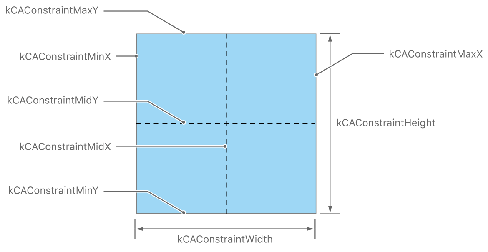
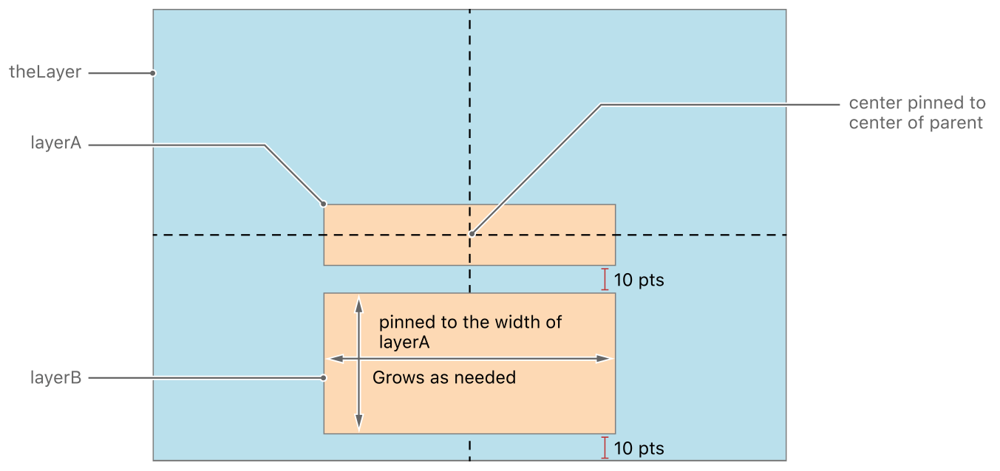

> 导航：[总目录](../../../README.md) · [文档](../../../_indexes/documentation.md) · [Core Animation 编程指南](About%20Core%20Animation.md)


[下一页](Advanced%20Animation%20Tricks.md)[上一页](Animating%20Layer%20Content.md)

# 构建图层层级结构

大多数情况下，在 app 中使用图层的最佳方式是把它们和视图对象结合起来使用。不过，有些时候你可能需要通过向视图层级结构中添加额外的图层对象来对其进行增强。当这样做能带来更好的性能，或者能让你实现单靠视图很难实现的功能时，你就可能需要用到图层。在这些情况下，你需要知道如何管理自己创建的图层层级结构。

图层层级结构在很多方面都与视图层级结构相似。你把一个图层嵌入到另一个图层中，从而在被嵌入的图层（称为_子图层（sublayer）_）和父图层（称为_父图层（superlayer）_）之间建立起父子关系。这种父子关系会影响子图层的多个方面。例如，它的内容会显示在其父图层内容之上，它的 position 是相对于其父图层的坐标系统来指定的，并且它还会受到应用在父图层上的任何变换的影响。

每个图层对象都有用于添加、插入和移除子图层的方法。表 4-1 总结了这些方法及其行为。

__表 4-1__  修改图层层级结构的方法

| 行为 | 方法 | 说明 |
| --- | --- | --- |
| 添加图层 | [addSublayer:](https://developer.apple.com/documentation/quartzcore/calayer/1410833-addsublayer) | 把一个新的子图层对象添加到当前图层。该子图层会被添加到图层子图层列表的末尾。这会导致该子图层显示在所有 [zPosition](https://developer.apple.com/documentation/quartzcore/calayer/1410884-zposition) 属性值相同的同级图层之上。 |
| 插入图层 | [insertSublayer:above:](https://developer.apple.com/documentation/quartzcore/calayer/1410798-insertsublayer)  [insertSublayer:atIndex:](https://developer.apple.com/documentation/quartzcore/calayer/1410944-insertsublayer)  [insertSublayer:below:](https://developer.apple.com/documentation/quartzcore/calayer/1410840-insertsublayer) | 把子图层插入到子图层层级结构中的指定索引处，或相对于另一个子图层的某个位置。在某个子图层之上或之下插入时，你只是指定了该子图层在 [sublayers](https://developer.apple.com/documentation/quartzcore/calayer/1410802-sublayers) 数组中的位置。图层的实际可见顺序主要取决于它们 [zPosition](https://developer.apple.com/documentation/quartzcore/calayer/1410884-zposition) 属性的值，其次才取决于它们在 `sublayers` 数组中的位置。 |
| 移除图层 | [removeFromSuperlayer](https://developer.apple.com/documentation/quartzcore/calayer/1410767-removefromsuperlayer) | 把子图层从其父图层中移除。 |
| 交换图层 | [replaceSublayer:with:](https://developer.apple.com/documentation/quartzcore/calayer/1410820-replacesublayer) | 把一个子图层替换为另一个。如果你要插入的子图层已经存在于另一个图层层级结构中，会先把它从那个层级结构中移除。 |

在处理你自己创建的图层对象时，你会用到上述方法。你不会用这些方法来排列属于由图层支持的视图的那些图层。不过，一个由图层支持的视图可以充当你自己创建的独立图层的父图层。

在添加和插入子图层时，你必须在它显示到屏幕上之前设置好子图层的大小和 position。你可以在把子图层添加到图层层级结构之后再修改它的大小和 position，但应该养成在创建图层时就设置这些值的习惯。

你使用 [bounds](https://developer.apple.com/documentation/quartzcore/calayer/1410915-bounds) 属性来设置子图层的大小，使用 [position](https://developer.apple.com/documentation/quartzcore/calayer/1410791-position) 属性来设置它在父图层中的位置。bounds 矩形的原点几乎总是 (0, 0)，其大小则是你想要的、以点为单位指定的图层大小。`position` 属性的值是相对于图层的锚点来解释的，锚点默认位于图层的中心。如果你不给这些属性赋值，Core Animation 会把图层的初始宽度和高度设为 0，并把 position 设为 (0, 0)。

```objc
myLayer.bounds = CGRectMake(0, 0, 100, 100);
myLayer.position = CGPointMake(200, 200);
```


父图层的某些属性会影响应用在其子图层上的动画的行为。其中一个这样的属性是 [speed](https://developer.apple.com/documentation/quartzcore/camediatiming/1427647-speed) 属性，它是动画速度的一个乘数。该属性的值默认设置为 `1.0`，但把它改为 `2.0` 会让动画以原来两倍的速度运行，从而以一半的时间完成。这个属性不仅会影响设置了它的那个图层，也会影响该图层的子图层。这种改变还具有累乘效应。如果一个子图层及其父图层的 speed 都是 `2.0`，那么子图层上的动画会以原来四倍的速度运行。

大多数其他的图层变化，都会以可预测的方式影响其中包含的子图层。例如，对某个图层应用旋转变换，会让该图层及其所有子图层一起旋转。类似地，改变图层的不透明度，也会改变其子图层的不透明度。图层大小的变化则遵循[调整图层层级结构的布局](#apple-f4xwc4dqnrsv64tfmyxwi33df52wszbpkridimbqga2dkmjufvbuqnrnknlto)中所描述的布局规则。

Core Animation 支持多种选项，用来在父图层发生变化时调整子图层的大小和 position。在 iOS 中，由于由图层支持的视图被广泛使用，构建图层层级结构就显得不那么重要了；因此 iOS 只支持手动布局更新。而在 OS X 中，还有其他一些选项可以让你更方便地管理图层层级结构。

只有当你使用自己创建的独立图层对象来构建图层层级结构时，图层级别的布局才有意义。如果你 app 中的图层都与视图关联，请使用基于视图的布局支持，在发生变化时更新视图的大小和 position。

约束（constraint）让你可以通过一组图层与其父图层或同级图层之间的详细关系，来指定图层的 position 和大小。定义约束需要以下步骤：

1. 创建一个或多个 [CAConstraint](https://developer.apple.com/documentation/quartzcore/caconstraint) 对象。使用这些对象来定义约束参数。
2. 把你的约束对象添加到它们所修改属性所在的那个图层上。
3. 获取共享的 [CAConstraintLayoutManager](https://developer.apple.com/documentation/quartzcore/caconstraintlayoutmanager) 对象，并将其赋值给直接的父图层。

图 4-1 展示了你可以用来定义约束的各种属性，以及它们所影响的图层方面。你可以使用约束，根据图层边缘或中点相对于另一个图层的位置来改变该图层的 position。你也可以用它们来改变图层的大小。你所做的改变可以相对于父图层成比例，也可以相对于另一个图层。你甚至还可以给最终的改变量添加一个缩放系数或常量。这种额外的灵活性，使得用一组简单的规则就能非常精确地控制图层的大小和 position 成为可能。

__图 4-1__  约束布局管理器的属性



每个约束对象都封装了同一坐标轴上两个图层之间的一种几何关系。每根轴最多可以分配两个约束对象，正是这两个约束决定了哪个属性是可变的。例如，如果你为图层的左边缘和右边缘都指定了约束，图层的大小就会改变。如果你为图层的左边缘和宽度都指定了约束，图层右边缘的位置就会改变。如果你只为图层的某一条边指定了单个约束，Core Animation 会创建一个隐式约束，让图层在给定维度上的大小保持固定。

在创建约束时，你必须始终指定三项信息：

- 你想要约束的图层方面
- 用作参照的图层
- 用于比较的参照图层的方面

清单 4-1 展示了一个简单的约束，它把某个图层的垂直中点固定到其父图层的垂直中点上。当引用父图层时，使用字符串 `superlayer`。这个字符串是专门保留用来引用父图层的特殊名称。使用它就不需要持有指向该图层的指针，也不需要知道该图层的名称。它还允许你更换父图层，而约束会自动应用到新的父图层上。（在创建相对于同级图层的约束时，你必须使用同级图层的 [name](https://developer.apple.com/documentation/quartzcore/calayer/1410879-name) 属性来标识它。）

__清单 4-1__  定义一个简单的约束

```objc
[myLayer addConstraint:[CAConstraint constraintWithAttribute:kCAConstraintMidY
                                                 relativeTo:@"superlayer"
                                                  attribute:kCAConstraintMidY]];
```

要在运行时应用约束，你必须把共享的 `CAConstraintLayoutManager` 对象附加到直接的父图层上。每个图层都负责管理其子图层的布局。把布局管理器赋值给父图层，就是告诉 Core Animation 应用其子图层所定义的约束。布局管理器对象会自动应用这些约束。把它赋值给父图层之后，你不需要再告诉它去更新布局。

要在更具体的场景中了解约束是如何工作的，请参考图 4-2。在这个例子中，设计要求 `layerA` 的宽度和高度保持不变，并且 `layerA` 要在其父图层中保持居中。另外，`layerB` 的宽度必须与 `layerA` 的宽度一致，`layerB` 的顶边必须始终位于 `layerA` 底边下方 10 个点处，而 `layerB` 的底边必须始终位于父图层底边上方 10 个点处。[清单 4-2](#apple-f4xwc4dqnrsv64tfmyxwi33df52wszbpkridimbqga2dkmjufvbuqnrnknltcna) 展示了在这个例子中，创建子图层和约束所需要用到的代码。

__图 4-2__  基于约束的布局示例



__清单 4-2__  为图层设置约束

```objc

// 为父图层创建并设置一个约束布局管理器。
theLayer.layoutManager=[CAConstraintLayoutManager layoutManager];

// 创建第一个子图层。
CALayer *layerA = [CALayer layer];
layerA.name = @"layerA";
layerA.bounds = CGRectMake(0.0,0.0,100.0,25.0);
layerA.borderWidth = 2.0;

// 把 layerA 的中点固定到其父图层的中点，使其保持居中。
[layerA addConstraint:[CAConstraint constraintWithAttribute:kCAConstraintMidY
                                                 relativeTo:@"superlayer"
                                                  attribute:kCAConstraintMidY]];
[layerA addConstraint:[CAConstraint constraintWithAttribute:kCAConstraintMidX
                                                 relativeTo:@"superlayer"
                                                  attribute:kCAConstraintMidX]];
[theLayer addSublayer:layerA];

// 创建第二个子图层
CALayer *layerB = [CALayer layer];
layerB.name = @"layerB";
layerB.borderWidth = 2.0;

// 让 layerB 的宽度与 layerA 的宽度一致。
[layerB addConstraint:[CAConstraint constraintWithAttribute:kCAConstraintWidth
                                                 relativeTo:@"layerA"
                                                  attribute:kCAConstraintWidth]];

// 让 layerB 的水平中点与 layerA 的水平中点一致
[layerB addConstraint:[CAConstraint constraintWithAttribute:kCAConstraintMidX
                                                 relativeTo:@"layerA"
                                                  attribute:kCAConstraintMidX]];

// 把 layerB 的顶边定位在 layerA 底边下方 10 个点处。
[layerB addConstraint:[CAConstraint constraintWithAttribute:kCAConstraintMaxY
                                                 relativeTo:@"layerA"
                                                  attribute:kCAConstraintMinY
                                                     offset:-10.0]];

// 把 layerB 的底边定位在父图层底边
//  上方 10 个点处。
[layerB addConstraint:[CAConstraint constraintWithAttribute:kCAConstraintMinY
                                                 relativeTo:@"superlayer"
                                                  attribute:kCAConstraintMinY
                                                     offset:+10.0]];

[theLayer addSublayer:layerB];
```

关于[清单 4-2](#apple-f4xwc4dqnrsv64tfmyxwi33df52wszbpkridimbqga2dkmjufvbuqnrnknltcna)有一点值得注意，那就是这段代码从未显式设置过 `layerB` 的大小。由于已经定义了约束，每次布局更新时，`layerB` 的宽度和高度都会被自动设置。因此，用 bounds 矩形来设置大小就没有必要了。

自动调整大小规则（autoresizing rules）是在 OS X 中调整图层大小和 position 的另一种方式。使用自动调整大小规则时，你可以指定图层的各条边与父图层对应边之间的距离应该是固定的还是可变的。你也可以类似地指定图层的宽度或高度是固定的还是可变的。这些关系始终是图层与其父图层之间的关系。你不能用自动调整大小规则来指定同级图层之间的关系。

要为图层设置自动调整大小规则，你必须给图层的 [autoresizingMask](https://developer.apple.com/documentation/quartzcore/calayer/1410877-autoresizingmask) 属性赋上合适的常量。默认情况下，图层被配置为固定宽度和高度。在布局过程中，图层精确的大小和 position 由 Core Animation 自动计算得出，其中涉及基于诸多因素的一套复杂计算。Core Animation 会先应用自动调整大小的行为，然后才要求你的委托执行任何手动布局更新，因此你可以按需使用委托来微调自动调整大小布局的结果。

在 iOS 和 OS X 上，你都可以通过在父图层的委托对象上实现 `layoutSublayersOfLayer:` 方法来手动处理布局。你可以用这个方法来调整当前嵌入在该图层中的任何子图层的大小和 position。在进行手动布局更新时，需要由你自己完成必要的计算，为每个子图层定位。

如果你正在实现一个自定义的图层子类，你的子类可以重写 [layoutSublayers](https://developer.apple.com/documentation/quartzcore/calayer/1410935-layoutsublayers) 方法，用这个方法（而不是委托）来处理任何布局任务。只有在你需要完全控制自定义图层类中子图层的定位方式时，才应该重写这个方法。替换默认实现会导致 Core Animation 无法在 OS X 上应用约束或自动调整大小规则。

与视图不同的是，父图层不会自动裁剪那些位于其 bounds 矩形之外的子图层内容。相反，父图层默认允许其子图层完整地显示出来。不过，你可以通过把图层的 [masksToBounds](https://developer.apple.com/documentation/quartzcore/calayer/1410896-maskstobounds) 属性设为 `YES` 来重新启用裁剪。

图层裁剪蒙版的形状会包含图层的圆角半径（如果指定了的话）。图 4-3 展示了一个图层，演示了 `masksToBounds` 属性如何影响一个带有圆角的图层。当该属性设为 `NO` 时，即使子图层的内容超出了其父图层的 bounds，也会完整地显示出来。把该属性改为 `YES` 会导致其内容被裁剪。

__图 4-3__  将子图层裁剪到父图层的 bounds 内

!

有时候，你可能需要把某个图层中的坐标值，转换为另一个图层中屏幕上同一位置对应的坐标值。`CALayer` 类提供了一组简单的转换方法，可以用于这个目的：

- [convertPoint:fromLayer:](https://developer.apple.com/documentation/quartzcore/calayer/1410825-convertpoint)
- [convertPoint:toLayer:](https://developer.apple.com/documentation/quartzcore/calayer/1410881-convert)
- [convertRect:fromLayer:](https://developer.apple.com/documentation/quartzcore/calayer/1410948-convertrect)
- [convertRect:toLayer:](https://developer.apple.com/documentation/quartzcore/calayer/1410742-convertrect)

除了转换点和矩形值之外，你还可以使用 [convertTime:fromLayer:](https://developer.apple.com/documentation/quartzcore/calayer/1410821-converttime) 和 [convertTime:toLayer:](https://developer.apple.com/documentation/quartzcore/calayer/1410823-converttime) 方法在图层之间转换时间值。每个图层都定义了自己的本地时间空间，并使用该时间空间让动画的开始和结束与系统的其余部分保持同步。这些时间空间默认是同步的；不过，如果你改变了某一组图层的动画速度，这些图层对应的时间空间也会相应改变。你可以使用时间转换方法来应对这类因素，确保两个图层的时间保持同步。

[下一页](Advanced%20Animation%20Tricks.md)[上一页](Animating%20Layer%20Content.md)

