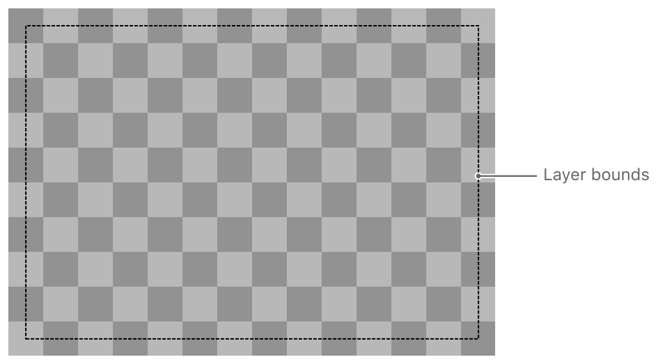
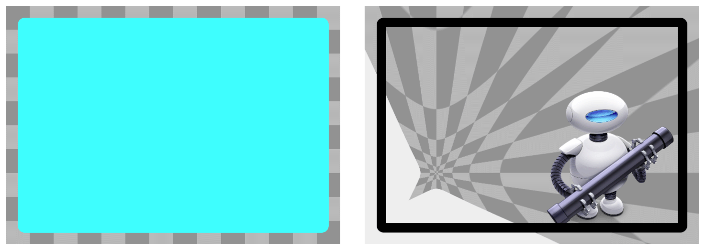
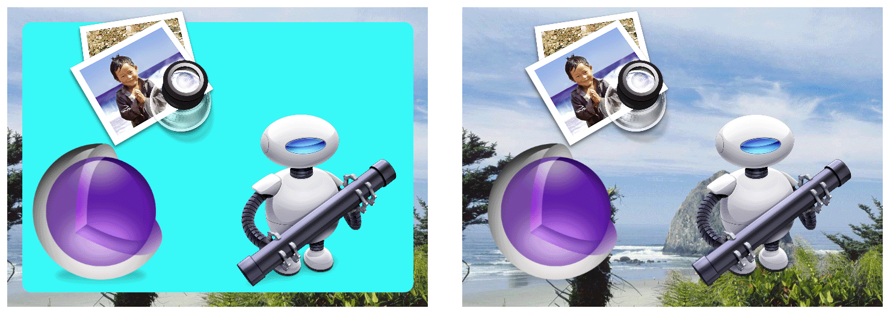
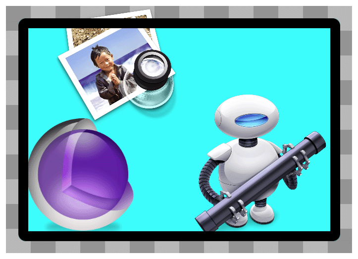
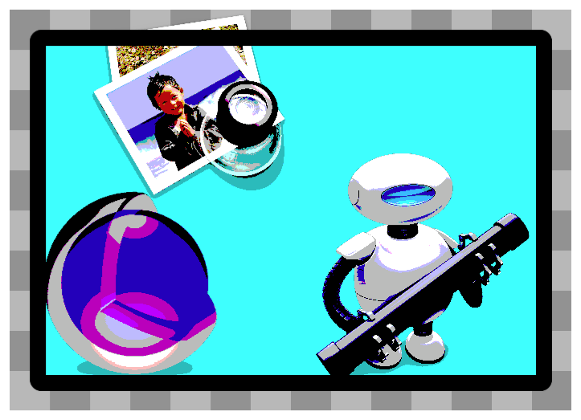
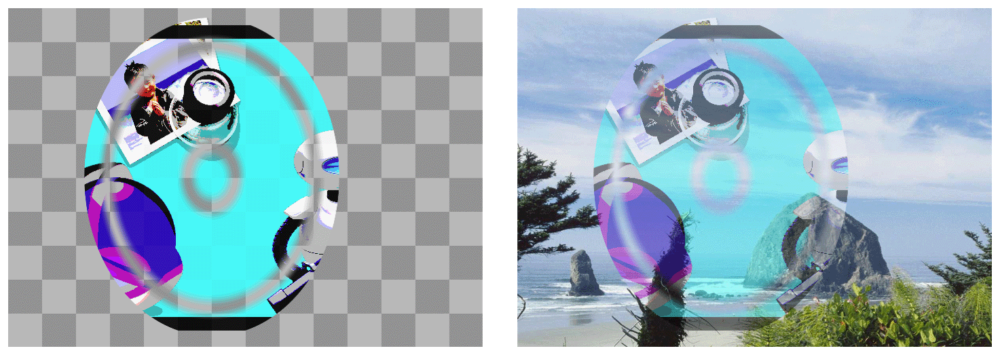

> 导航：[总目录](../../../README.md) · [文档](../../../_indexes/documentation.md) · [Core Animation 编程指南](About%20Core%20Animation.md)

[下一页](Animatable%20Properties.md)[上一页](Improving%20Animation%20Performance.md)

# 图层样式属性动画

在渲染过程中，Core Animation 会按照特定的顺序处理图层的各种属性并进行渲染。这个顺序决定了图层最终呈现的外观。本章通过设置不同的图层样式属性来展示所得到的渲染效果。

图层的几何属性指定了该图层相对于其父图层的显示方式。几何属性还指定了用于圆化图层边角的半径，以及应用于该图层及其子图层的变换。图 A-1 展示了示例图层的边界矩形。

__图 A-1__  图层几何

以下 `CALayer` 属性指定了图层的几何：

- [bounds](https://developer.apple.com/documentation/quartzcore/calayer/1410915-bounds)
- [position](https://developer.apple.com/documentation/quartzcore/calayer/1410791-position)
- [frame](https://developer.apple.com/documentation/quartzcore/calayer/1410779-frame)（由 `bounds` 和 `position` 计算得出，不可动画化）
- [anchorPoint](https://developer.apple.com/documentation/quartzcore/calayer/1410817-anchorpoint)
- [cornerRadius](https://developer.apple.com/documentation/quartzcore/calayer/1410818-cornerradius)
- [transform](https://developer.apple.com/documentation/quartzcore/calayer/1410836-transform)
- [zPosition](https://developer.apple.com/documentation/quartzcore/calayer/1410884-zposition)

Core Animation 首先渲染的是图层的背景。你可以为背景指定一种颜色。在 OS X 中，你还可以指定一个想要应用到背景内容上的 Core Image 滤镜。图 A-2 展示了示例图层的两个版本。左侧图层设置了 `backgroundColor` 属性，而右侧图层没有设置背景颜色，但设置了边框、一些内容，并为其 `backgroundFilters` 属性指定了一个挤压扭曲滤镜。

__图 A-2__  带背景颜色的图层

背景滤镜应用于位于该图层之后的内容，这些内容主要由父图层的内容组成。你可以使用背景滤镜让前景图层的内容更加突出，例如应用模糊滤镜。

以下 `CALayer` 属性会影响图层背景的显示：

- [backgroundColor](https://developer.apple.com/documentation/quartzcore/calayer/1410966-backgroundcolor)
- [backgroundFilters](https://developer.apple.com/documentation/quartzcore/calayer/1410827-backgroundfilters)（iOS 不支持）

如果图层有任何内容，该内容会渲染在背景颜色之上。你可以通过直接设置位图、使用委托来指定内容，或者通过派生图层子类并直接绘制内容，来提供图层内容。此外，你还可以使用多种不同的绘制技术（包括 Quartz、Metal、OpenGL 和 Quartz Composer）来提供该内容。图 A-3 展示了一个示例图层，其内容是直接设置的一张位图。该位图内容大部分是透明区域，右下角带有 Automator 图标。

__图 A-3__  显示位图图像的图层

带有圆角半径的图层不会自动裁剪其内容；不过，将图层的 `masksToBounds` 属性设置为 `YES` 会使图层按照圆角半径进行裁剪。

以下 [CALayer](https://developer.apple.com/documentation/quartzcore/calayer) 属性会影响图层内容的显示：

- [contents](https://developer.apple.com/documentation/quartzcore/calayer/1410773-contents)
- [contentsGravity](https://developer.apple.com/documentation/quartzcore/calayer/1410872-contentsgravity)
- [masksToBounds](https://developer.apple.com/documentation/quartzcore/calayer/1410896-maskstobounds)

任何图层都可以包含一个或多个子图层（sublayer）。子图层是递归渲染的，并相对于父图层的边界矩形进行定位。此外，Core Animation 会相对于父图层的锚点，把父图层的 `sublayerTransform` 应用到每个子图层上。你可以使用子图层变换，为所有图层平等地施加透视等效果。图 A-4 展示了一个带有两个子图层的示例图层。左侧版本包含背景颜色，而右侧版本没有。

__图 A-4__  显示子图层内容的图层

将图层的 `masksToBounds` 属性设置为 `YES` 会使所有子图层都按照该图层的边界进行裁剪。

以下 `CALayer` 属性会影响图层子图层的显示：

- [sublayers](https://developer.apple.com/documentation/quartzcore/calayer/1410802-sublayers)
- [masksToBounds](https://developer.apple.com/documentation/quartzcore/calayer/1410896-maskstobounds)
- [sublayerTransform](https://developer.apple.com/documentation/quartzcore/calayer/1410888-sublayertransform)

图层可以使用指定的颜色和宽度显示一个可选的边框。边框沿着图层的边界矩形绘制，并会考虑圆角半径的取值。图 A-5 展示了应用边框后的示例图层。请注意，超出图层边界的内容和子图层会渲染在边框下方。

__图 A-5__  显示边框属性内容的图层

以下 `CALayer` 属性会影响图层边框的显示：

- [borderColor](https://developer.apple.com/documentation/quartzcore/calayer/1410903-bordercolor)
- [borderWidth](https://developer.apple.com/documentation/quartzcore/calayer/1410917-borderwidth)

在 OS X 中，你可以为图层内容应用一个或多个滤镜，并使用自定义的合成滤镜来指定图层内容与其下方图层内容的混合方式。图 A-6 展示了应用了 Core Image 色调分离（posterize）滤镜的示例图层。

__图 A-6__  显示滤镜属性的图层

以下 `CALayer` 属性指定了图层的内容滤镜：

- [filters](https://developer.apple.com/documentation/quartzcore/calayer/1410901-filters)
- [compositingFilter](https://developer.apple.com/documentation/quartzcore/calayer/1410748-compositingfilter)

图层可以显示阴影效果，并配置阴影的形状、不透明度、颜色、偏移量和模糊半径。如果你没有指定自定义的阴影形状，阴影会根据图层中未完全透明的部分生成。图 A-7 展示了同一个示例图层应用红色阴影后的几个不同版本。左侧和中间的版本包含背景颜色，因此阴影只出现在图层边框周围。而右侧的版本没有背景颜色，此时阴影会应用到图层的内容、边框和子图层上。

__图 A-7__  显示阴影属性的图层

以下 `CALayer` 属性会影响图层阴影的显示：

- [shadowColor](https://developer.apple.com/documentation/quartzcore/calayer/1410829-shadowcolor)
- [shadowOffset](https://developer.apple.com/documentation/quartzcore/calayer/1410970-shadowoffset)
- [shadowOpacity](https://developer.apple.com/documentation/quartzcore/calayer/1410751-shadowopacity)
- [shadowRadius](https://developer.apple.com/documentation/quartzcore/calayer/1410819-shadowradius)
- [shadowPath](https://developer.apple.com/documentation/quartzcore/calayer/1410771-shadowpath)

图层的 opacity 属性决定了有多少背景内容能透过该图层显示出来。图 A-8 展示了一个 opacity 设置为 `0.5` 的示例图层，这使得部分背景图像得以透过显示。

__图 A-8__  包含 opacity 属性的图层

以下 `CALayer` 属性指定了图层的不透明度：

- [opacity](https://developer.apple.com/documentation/quartzcore/calayer/1410933-opacity)

你可以使用蒙版（mask）来遮盖图层内容的全部或部分区域。蒙版本身也是一个图层对象，它的 alpha 通道用于决定哪些部分被遮挡、哪些部分被透射。蒙版图层内容中不透明的部分会让下方图层的内容透显出来，而透明的部分则会部分或完全遮挡下方的内容。图 A-9 展示了一个与蒙版图层合成、并搭配两种不同背景的示例图层。左侧版本中，图层的 opacity 设置为 1.0；右侧版本中，图层的 opacity 设置为 0.5，这增加了透过图层被遮罩部分透射出来的背景内容量。

__图 A-9__  与 mask 属性合成的图层

以下 `CALayer` 属性指定了图层的蒙版：

- [mask](https://developer.apple.com/documentation/quartzcore/calayer/1410861-mask)

[下一页](Animatable%20Properties.md)[上一页](Improving%20Animation%20Performance.md)

