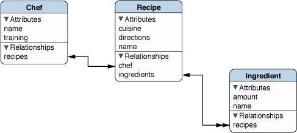
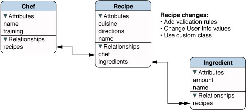
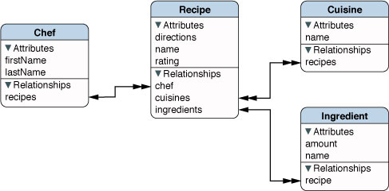

> 导航：[总目录](../../../README.md) · [documentation](../../../_indexes/documentation.md) · [Core Data 模型版本管理与数据迁移编程指南](Core%20Data%20Model%20Versioning%20and%20Data%20Migration.md)

[下一页](Model%20File%20Format%20and%20Versions.md)[上一页](Core%20Data%20Model%20Versioning%20and%20Data%20Migration.md)

# 理解版本

版本管理有两种截然不同的视角：作为开发者的你的视角，以及 Core Data 的视角。这两者未必总是一致——考虑以下几个模型。

__图 1-1__  Recipes 模型"1.0 版"

__图 1-2__  Recipes 模型"1.1 版"

__图 1-3__  Recipes 模型"2.0 版"

作为开发者，你的视角通常是：版本由一个标识符——一个字符串或数字，例如"9A218"、"2.0.7"或"Version 1.1"——来表示。为了支持这种视角，托管对象模型拥有一组标识符（参见 [versionIdentifiers](https://developer.apple.com/documentation/coredata/nsmanagedobjectmodel/1506268-versionidentifiers)）——通常对单个模型你只会提供一个字符串（该属性本身是一个集合，这样在多个模型合并时可以保留所有标识符）。这个标识符应该如何解读，取决于你自己——无论它代表的是应用程序的版本号、休假前提交的那个版本，还是最后一次能正常工作的提交。

而 Core Data 则只是把这些标识符当作"提示"来看待。要理解为什么，请回想一下：持久化存储的格式取决于创建它所使用的模型，而要打开一个持久化存储，你必须拥有一个与创建它时所用模型兼容的模型。那么设想一下，如果你更改了模型，但没有更改标识符——例如，标识符保持不变，但移除了一个实体、添加了两个实体——会发生什么。对 Core Data 来说，模式（schema）中的这个变化才是重要的，标识符_没有_变化这一事实反而无关紧要。

Core Data 在版本管理上的视角是：它只关心模型中会影响持久化的那些特性。这意味着，要让两个模型兼容：

- 对每个实体而言，以下属性必须相等：`name`、`parent`、`isAbstract` 和 `properties`。

  `className`、`userInfo` 以及校验谓词不参与比较。
- 对每个实体中的每个属性而言，以下属性必须相等：`name`、`isOptional`、`isTransient`、`isReadOnly`；对于特性（attribute）还需比较 `attributeType`；对于关系（relationship）则需比较 `destinationEntity`、`minCount`、`maxCount`、`deleteRule` 和 `inverseRelationship`。

  `userInfo` 以及校验谓词不参与比较。

请注意，Core Data 会忽略你设置的任何标识符。在上面的例子中，Core Data 会把 1.0 版（[图 1-1](#apple-f4xwc4dqnrsv64tfmyxwi33df52wszbpkridimbqga2dgojzfvbuqmrnknlte)）和 1.1 版（[图 1-2](#apple-f4xwc4dqnrsv64tfmyxwi33df52wszbpkridimbqga2dgojzfvbuqmrnknltg)）视为兼容。

Core Data 不会逐一列举模型中所有相关部分，而是会为这些用于比较相等性的组成部分创建一个 32 字节的哈希摘要（参见 `NSEntityDescription` 的 [versionHash](https://developer.apple.com/documentation/coredata/nsentitydescription/1425133-versionhash) 和 `NSPropertyDescription` 的 [versionHash](https://developer.apple.com/documentation/coredata/nspropertydescription/1506198-versionhash)）。这些哈希值会包含在存储的元数据中，以便 Core Data 能够快速判断存储的格式，是否与它可能用来尝试打开该存储的托管对象模型相匹配。（当你尝试使用某个给定模型打开一个存储时，Core Data 会比较存储中每个实体的版本哈希与该模型中对应实体的版本哈希，如果全部相同，该存储就会被打开。）通常你不需要关心哈希值本身。

不过，在某些情况下，你可能拥有两个 Core Data 通常会视为等价的模型版本，但你希望它们被识别为不同的版本。例如，你可能更改了用于表示某个实体的类名，或者更微妙地，你保持模型不变，但更改了某个特性（比如 BLOB）的内部格式——这对 Core Data 而言无关紧要，但对你的数据完整性却至关重要。为支持这种情况，Core Data 允许你为实体或特性设置一个哈希修饰符，参见 `NSEntityDescription` 的 [versionHashModifier](https://developer.apple.com/documentation/coredata/nsentitydescription/1425119-versionhashmodifier) 和 `NSPropertyDescription` 的 [versionHashModifier](https://developer.apple.com/documentation/coredata/nspropertydescription/1506214-versionhashmodifier)。

在上面的例子中，如果你想强制让 Core Data 识别出模型的"1.0 版"（[图 1-1](#apple-f4xwc4dqnrsv64tfmyxwi33df52wszbpkridimbqga2dgojzfvbuqmrnknlte)）和"1.1 版"（[图 1-2](#apple-f4xwc4dqnrsv64tfmyxwi33df52wszbpkridimbqga2dgojzfvbuqmrnknltg)）是不同的，你可以在第二个模型中为 Recipe 实体设置一个实体修饰符，以更改 Core Data 生成的版本哈希。

[下一页](Model%20File%20Format%20and%20Versions.md)[上一页](Core%20Data%20Model%20Versioning%20and%20Data%20Migration.md)
