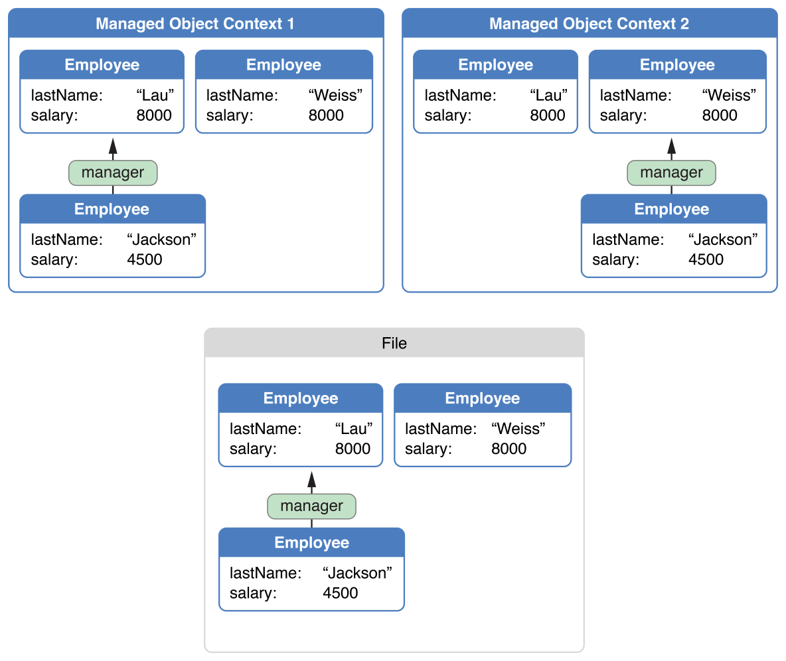

> 导航：[总目录](../../../README.md) · [documentation](../../../_indexes/documentation.md) · [Core Data 编程指南](index.md)

## 变更管理

如果你的应用包含多个托管对象上下文，并且允许在多个上下文中修改对象，你就需要能够协调这些变更。当一个应用从网络导入数据，同时用户又可以编辑这些数据时，这是一种相当常见的情形。

### 一个应用中的多个上下文

任何给定托管对象上下文所关联的对象图，其内部必须是一致的。但是，如果同一个应用中存在多个托管对象上下文，那么每个上下文都可能包含代表持久化存储中同一条记录的对象，而这些对象彼此的特征却不一致。举例来说，在一个员工应用中，你可能有两个不同的窗口，展示同一批员工，但分布在不同的部门、由不同的经理管理，如图 15-1 所示。注意经理关系是如何从 Lau 变为 Weiss 的。托管对象上下文 1 仍然代表磁盘上的数据，而托管对象上下文 2 已经发生了变化。

__图 15-1__ 数据值互不一致的托管对象上下文

最终只能有一个真相，当数据被保存时，这些视图之间的差异必须被检测出来并加以协调。当其中一个托管对象上下文被保存时，它的变更会通过持久化存储协调器推送到持久化存储中。当第二个托管对象上下文被保存时，会使用一种叫做乐观锁（optimistic locking）的机制来检测冲突。冲突如何解决，取决于你对上下文的配置方式。

### 冲突检测与乐观锁

当 Core Data 从持久化存储中获取一个对象时，会对其状态进行一次_快照_（snapshot）。快照是对象持久化属性的一个字典——通常包括它的全部属性，以及它所拥有的任何一对一关系所指向对象的全局 ID。快照参与乐观锁机制。当框架执行保存时，会将每个被编辑对象的快照值，与持久化存储中当前对应的值进行比较。

- 如果值相同，说明自对象被获取以来，存储并未发生变化，保存操作正常进行。作为保存操作的一部分，快照的值会更新为与已保存数据一致。
- 如果值不同，说明自对象被获取或最后一次保存以来，存储已经发生了变化；这就代表了一次乐观锁失败。此时你必须解决这个冲突。

### 选择合并策略

只要有不止一个 Core Data 技术栈引用同一个外部数据存储，无论这些技术栈是位于同一个应用中，还是分布在多个应用里，都可能出现乐观锁失败。同一个概念上的托管对象有可能同时在两个持久化技术栈中被编辑。你可能希望确保第二个技术栈之后所做的变更不会覆盖第一个技术栈所做的变更，但其他行为也可能更适合你的场景。请为托管对象上下文选择一个适合你所处场景的合并策略。

默认行为由 [NSErrorMergePolicy](https://developer.apple.com/documentation/coredata/nserrormergepolicy) 属性定义。该策略会在出现任何合并冲突时使保存失败。保存方法会返回一个错误，其 [userInfo](https://developer.apple.com/documentation/foundation/nserror/1411580-userinfo) 字典中包含键 `@"conflictList"`；对应的值是一个冲突记录数组。你可以用这个数组告诉用户，用户尝试保存的值与存储中当前的值之间存在哪些差异。在这种情况下，用户必须自行修正冲突（通过重新获取对象，使快照得到更新）。

此外，你也可以指定其他策略。`NSErrorMergePolicy` 是唯一会产生错误的策略。其他策略——[NSMergeByPropertyStoreTrumpMergePolicy](https://developer.apple.com/documentation/coredata/nsmergebypropertystoretrumpmergepolicy)、[NSMergeByPropertyObjectTrumpMergePolicy](https://developer.apple.com/documentation/coredata/nsmergebypropertyobjecttrumpmergepolicy) 和 [NSOverwriteMergePolicy](https://developer.apple.com/documentation/coredata/nsoverwritemergepolicy)——则允许保存继续进行，通过以不同方式将被编辑对象的状态与存储中对象的状态进行合并。[NSRollbackMergePolicy](https://developer.apple.com/documentation/coredata/nsrollbackmergepolicy) 会丢弃发生冲突的对象在内存中的状态变更，并采用持久化存储中对象状态的版本。

### 自动快照管理

一个获取了成百上千行数据的应用，会积累起一个庞大的快照缓存。理论上，如果执行了足够多的获取操作，一个基于 Core Data 的应用可能会把存储的全部内容都保存在内存中。显然，必须对快照加以管理，以防止出现这种情况。

清理快照的职责由一种称为_快照引用计数_（snapshot reference counting）的机制承担。该机制会跟踪与某个特定快照相关联的托管对象——也就是那些包含该快照数据的托管对象。当不再有任何托管对象实例与某个特定快照相关联时（Core Data 通过维护一份强引用列表来判断这一点），Core Data 会自动断开与该快照的引用，快照随之从内存中移除。

### 在上下文之间同步变更

如果你在一个应用中使用了多个托管对象上下文，Core Data 不会自动将某个上下文中对象的变更通知给另一个上下文。总体而言，这是因为一个上下文本应是一块草稿纸，你可以在其中独立地修改对象，并在不影响其他上下文的情况下丢弃这些变更。如果你确实需要在多个上下文之间同步变更，具体应该如何处理这个变更，取决于你希望在第二个上下文中呈现给用户的语义，以及第二个上下文中对象当时的状态。

### 通过 NSNotificationCenter 注册

考虑这样一个应用：它拥有两个托管对象上下文和一个持久化存储协调器。如果用户在第一个上下文（`moc1`）中删除了一个对象，你可能需要通知第二个上下文（`moc2`），告诉它某个对象已被删除。在所有情况下，`moc1` 都会通过 [NSNotificationCenter](https://developer.apple.com/library/archive/documentation/LegacyTechnologies/WebObjects/WebObjects_3.5/Reference/Frameworks/ObjC/Foundation/Classes/NSNotificationCenter/Description.html#//apple_ref/occ/cl/NSNotificationCenter) 自动发出一条 [NSManagedObjectContextDidSaveNotification](https://developer.apple.com/documentation/coredata/nsmanagedobjectcontextdidsavenotification) [通知](https://developer.apple.com/library/archive/documentation/General/Conceptual/DevPedia-CocoaCore/Notification.html#//apple_ref/doc/uid/TP40008195-CH35)，你的应用应当注册这条通知，并将其作为触发所需操作的信号。这条通知不仅包含关于被删除对象的信息，也包含关于被改变对象的信息。你需要处理这些变更，因为它们可能是删除操作所引发的结果。这类变更大多涉及临时关系（transient relationship）或获取属性（fetched property）。

### 选择同步策略

在决定如何处理删除通知时，请考虑以下几点：

- 第二个上下文中还存在哪些其他变更？
- 被删除对象的实例，在第二个上下文中是否也有变更？
- 第二个上下文中所做的变更是否可以撤销？

这些考量因素在某种程度上相互独立，你为同步上下文所采取的具体操作，取决于你的应用的语义。以下是按复杂度递增顺序给出的三种策略。

1. 该对象本身已在 `moc1` 中被删除，但在 `moc2` 中并未发生变化。在这种情况下，你不需要担心撤销问题，只需在 `moc2` 中直接删除该对象即可。下次 `moc2` 保存时，框架会发现你正在尝试重复删除一个对象，从而忽略乐观锁警告，继续正常执行而不报错。
2. 如果你并不关心 `moc2` 的内容，可以直接重置它（使用 [reset](https://developer.apple.com/documentation/coredata/nsmanagedobjectcontext/1506807-reset)），并在重置后重新获取你需要的数据。这同时也会重置撤销栈，被删除的对象自然也就消失了。这里唯一的问题在于确定需要重新获取哪些数据。你应该在重置之前，先收集你仍然需要的托管对象的 ID（[objectID](https://developer.apple.com/documentation/coredata/nsmanagedobject/1506848-objectid)），并在重置完成后使用这些 ID 重新加载数据。你必须排除已删除的 ID，最好使用带有 `IN` 谓词的获取请求，以确保针对已删除 ID 的故障对象（fault）能够得到满足（fulfill）。
3. 如果该对象在 `moc2` 中已经发生了变化，但你并不关心撤销问题，那么你的策略就取决于这对你的应用语义意味着什么。如果在 `moc1` 中被删除的对象，在 `moc2` 中存在变更，那么它是否也应该从 `moc2` 中删除？还是应该将其"复活"并保存这些变更？如果最初的删除操作触发了级联删除，而相关对象尚未在 `moc2` 中故障化（fault），又会发生什么？如果该对象本身是作为级联删除的一部分被删除的呢？

   这里有两种可行的方案：

   - 直接在接收到通知的那个 `moc` 中删除该对象，从而丢弃这些变更。
   - 或者，如果该对象是独立的（standalone），可以将该上下文的合并策略设置为 [NSOverwriteMergePolicy](https://developer.apple.com/documentation/coredata/nsoverwritemergepolicy)。该策略会使第二个上下文中的变更覆盖数据库中的删除操作。

     不过需要注意，这会导致 `moc2` 中的_全部_变更都覆盖 `moc1` 中所做的任何变更。

上述方案最不容易因为你遗漏某些细节，而使你的对象图陷入无法维系的状态。如果你发现自己的应用遇到了无法解决的合并问题，这通常说明应用的架构本身存在问题。

[Object Validation](ObjectValidation.md#apple-f4xwc4dqnrsv64tfmyxwi33df52wszbpkridimbqgaytanzvfvbuqmrqfvjvomi)

[Persistent Store Types and Behaviors](PersistentStoreFeatures.md#apple-f4xwc4dqnrsv64tfmyxwi33df52wszbpkridimbqgaytanzvfvbuqmrtfvjvomi)
