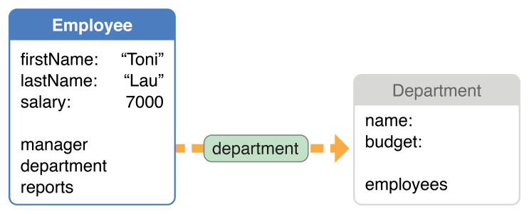
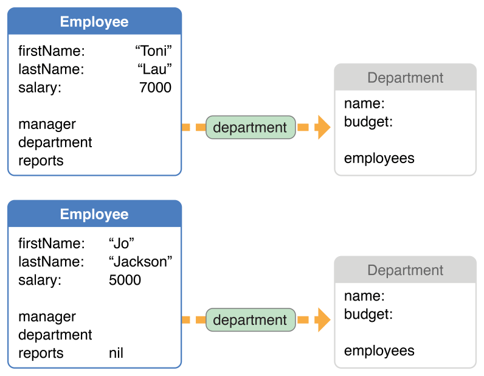
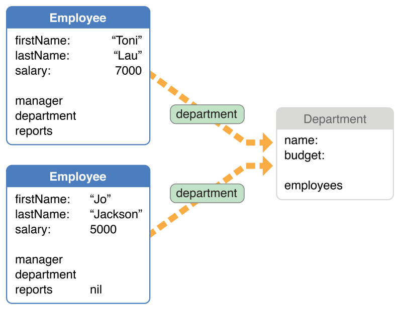

> 导航：[总目录](../../../README.md) · [documentation](../../../_indexes/documentation.md) · [Core Data 编程指南](index.md)

## 故障化与唯一化

故障化（faulting）通过在持久化存储中保留占位对象（故障，fault）来降低应用程序的内存占用。与之相关的一项特性——唯一化（uniquing）——则确保在给定的托管对象上下文中，永远不会存在多个托管对象来表示同一条记录。

### 故障化限制了对象图的规模

托管对象通常代表持久化存储中保存的数据。在某些情况下，托管对象可能是一个故障（fault）——即其属性值尚未从外部数据存储中加载的对象。_故障化_ 减少了应用程序消耗的内存量。故障是一个占位对象，代表尚未完全实例化的托管对象，或代表一个关系的集合对象：

- 托管对象故障是相应类的一个实例，但其持久化变量尚未初始化。
- 关系故障是表示该关系的集合类的子类。

故障化让 Core Data 能够为对象图划定边界。由于故障尚未被实例化，托管对象故障占用的内存更少，并且与故障相关的托管对象根本不需要在内存中表示出来。

举例来说，假设有一个应用程序允许用户获取并编辑单个员工的详细信息。该员工与一位经理以及一个部门存在关系，而这些对象又各自拥有其他关系。如果你只从持久化存储中取出单个 Employee 对象，其 manager、department 和 reports 关系最初都会以故障的形式表示。图 13-1 展示了以故障形式表示的员工部门关系。

__图 13-1__ 以故障形式表示的部门

尽管该故障是 Department 类的一个实例，但它尚未被实例化——它的任何持久化实例变量都还没有被设置。这意味着，部门对象本身不仅占用更少的内存，而且也无需填充它的 employees 关系。如果要求对象图必须是完整的，那么仅仅为了编辑单个员工的一个属性，最终也不得不创建对象来表示整个公司的组织结构。

### 触发故障

故障的处理对开发者是透明的——你不需要执行一次获取操作来实例化一个故障。如果在某个阶段访问了故障对象的某个持久化属性，Core Data 会自动为该对象获取数据并完成初始化。这一过程通常被称为触发故障（firing the fault）。如果你访问 Department 对象的某个属性——例如它的 name——故障就会被触发，Core Data 会为你执行一次获取操作，取回该对象的所有属性。（有关不会触发故障的方法列表，请参阅 [NSManagedObject](https://developer.apple.com/documentation/coredata/nsmanagedobject)。）

当访问故障对象的某个持久化属性（例如 `firstName`）时，Core Data 会自动触发故障。然而，逐个触发故障可能效率低下，从持久化存储中获取数据还有更好的策略（参见 [Decreasing Fault Overhead](Performance.md#apple-f4xwc4dqnrsv64tfmyxwi33df52wszbpkridimbqgaytanzvfvbuqmrvfvjvony)）。要高效地处理故障和关系，请参阅 [Fetching Managed Objects](Performance.md#apple-f4xwc4dqnrsv64tfmyxwi33df52wszbpkridimbqgaytanzvfvbuqmrvfvjvomy) 和 [Preventing a Fault from Firing](Performance.md#apple-f4xwc4dqnrsv64tfmyxwi33df52wszbpkridimbqgaytanzvfvbuqmrvfvjvonq)。

当故障被触发时，如果数据已经存在于缓存中，Core Data 不会再次回到存储中获取数据。命中缓存时，将故障转换为已实例化的托管对象会非常快——基本上与正常实例化一个托管对象相同。如果数据不在缓存中，Core Data 会自动为该故障对象执行一次获取操作；这会导致一次到持久化存储的往返以取回数据，随后数据同样会被缓存到内存中。

一个对象是否为故障，仅仅意味着该托管对象的所有持久化属性是否都已填充完毕、可以直接使用。如果你需要判断一个对象是否为故障，可以调用它的 `isFault` 方法，而不会因此触发故障（不会访问任何关系或属性）。如果 `isFault` 返回 `NO`/`false`，那么数据必定已在内存中，因此该对象不是故障。但是，如果 `isFault` 返回 `YES`/`true`，这 _并不_ 意味着数据 _不在_ 内存中。数据可能在内存中，也可能不在，这取决于影响缓存的诸多因素。

尽管标准的 [description](https://developer.apple.com/library/archive/documentation/LegacyTechnologies/WebObjects/WebObjects_3.5/Reference/Frameworks/ObjC/Foundation/Classes/NSObject/Description.html#//apple_ref/occ/clm/NSObject/description) 方法不会触发故障，但如果你实现了一个会访问对象持久化属性的自定义 `description` 方法，该故障就会被触发。强烈不建议以这种方式重写 `description`。

没有办法按需逐个加载托管对象的单个属性，从而避免实例化（取回全部属性值）整个对象。有关处理大型属性的模式，请参阅 [Binary Large Data Objects (BLOBs)](Performance.md#apple-f4xwc4dqnrsv64tfmyxwi33df52wszbpkridimbqgaytanzvfvbuqmrvfvjvomjr)。

### 将对象转换回故障

将已实例化的对象转换回故障，有助于精简对象图，同时确保属性值是最新的。将一个托管对象转换为故障会释放不必要的内存，并将其内存中的属性值设置为 `nil`。（参见 [Reducing Memory Overhead](Performance.md#apple-f4xwc4dqnrsv64tfmyxwi33df52wszbpkridimbqgaytanzvfvbuqmrvfvjvomjq) 以及 Ensuring Data Is Up to Date。）

你可以使用 [refreshObject:mergeChanges:](https://developer.apple.com/documentation/coredata/nsmanagedobjectcontext/1506224-refreshobject) 方法将已实例化的对象转换回故障。如果你为 `mergeChanges` 参数传入 `NO`/`false`，就必须确保该对象的关系没有任何改动。如果存在改动，而你随后又保存了上下文，就会给持久化存储引入引用完整性问题。

当一个对象转换为故障时，会调用它的 [didTurnIntoFault](https://developer.apple.com/documentation/coredata/nsmanagedobject/1506470-didturnintofault) 方法。你可以实现一个自定义的 `didTurnIntoFault` 方法来执行各种清理工作；例如可参见 Ensuring Data Is Up to Date。

> [!NOTE]
> 

### 故障与 KVO 通知

当 Core Data 将一个对象转换为故障时，会向该对象的属性发送键值观察（KVO）变更通知。如果你正在观察某个对象的属性，而该对象被转换为故障后又被重新实例化，那么你将收到针对那些实际上并未发生变化的属性值的变更通知。参见 _[Key-Value Observing Programming Guide](../Key-Value%20Observing%20Programming%20Guide/Introduction%20to%20Key-Value%20Observing%20Programming%20Guide.md#apple-f4xwc4dqnrsv64tfmyxwi33df52wszbpgeydambqge3to2i)_。

尽管从你的角度看，这些值在语义上并未发生变化，但随着对象被重新实例化，内存中的字节数据的确发生了变化。键值观察机制要求 Core Data 在值按指针比较发生变化时就发出通知。KVO 需要这些通知，才能跨键路径和依赖对象追踪变化。

### 唯一化确保每个上下文中每条记录只对应一个托管对象

Core Data 确保——在给定的托管对象上下文中——持久化存储中的一条记录只会关联到一个托管对象。这一技术被称为 _唯一化_（uniquing）。如果没有唯一化，一个上下文中可能会出现多个对象表示同一条记录的情况。

举例来说，考虑图 13-2 所示的情形：两名员工被获取到 _同一个托管对象上下文_ 中。二者都与某个部门存在关系，但该部门目前以故障形式表示。

__图 13-2__ 部门对象的独立故障

表面上看，每名员工似乎都拥有各自独立的部门，如果你在每名员工上调用 `department`——将 Department 故障转换为常规对象——你会在内存中得到两个各自独立的 Department 对象。然而，如果这两名员工同属一个部门（例如市场部），Core Data 会确保（在给定的托管对象上下文中）代表市场部的对象只会被创建一次。如果两名员工同属一个部门，那么他们的 department 关系最终都会引用同一个故障，如图 13-3 所示。

__图 13-3__ 同一部门中两名员工共享的唯一化故障

如果没有唯一化，当你获取全部员工并在每个员工上调用 `department`——从而触发相应故障——每次都会创建一个新的 Department 对象。这会产生多个对象，它们都代表同一个部门，却可能包含不同且相互冲突的数据。当上下文被保存时，将无法确定应该提交给存储的正确数据。

更一般地说，给定上下文中所有引用市场部对象的托管对象，引用的都是同一个实例——它们对市场部的数据拥有单一的视图——_即便市场部对象当前是一个故障_ 也是如此。

> [!NOTE]
> 

[Creating Managed Object Relationships](HowManagedObjectsarerelated.md#apple-f4xwc4dqnrsv64tfmyxwi33df52wszbpkridimbqgaytanzvfvbuqmjxfvjvomi)

[Object Validation](ObjectValidation.md#apple-f4xwc4dqnrsv64tfmyxwi33df52wszbpkridimbqgaytanzvfvbuqmrqfvjvomi)
