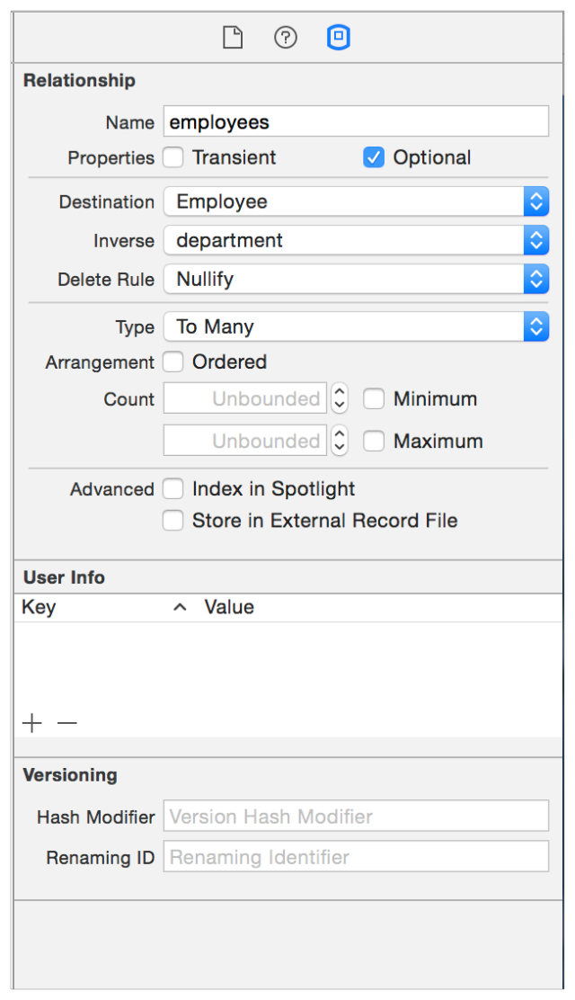
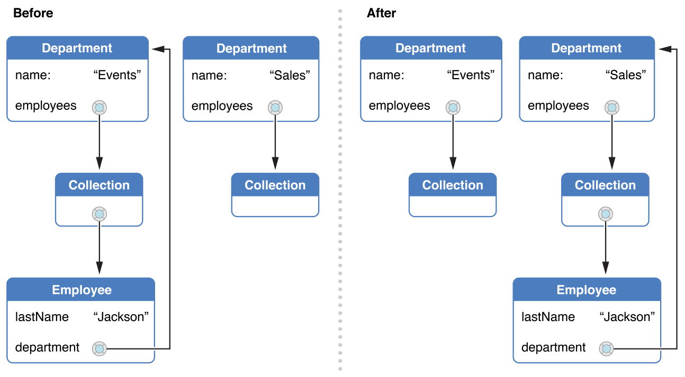
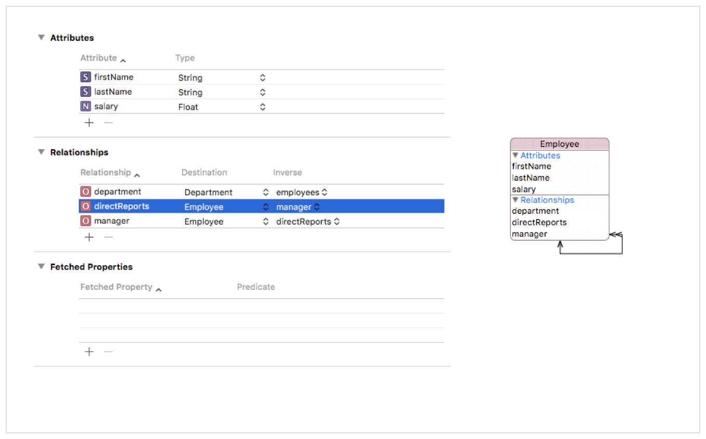
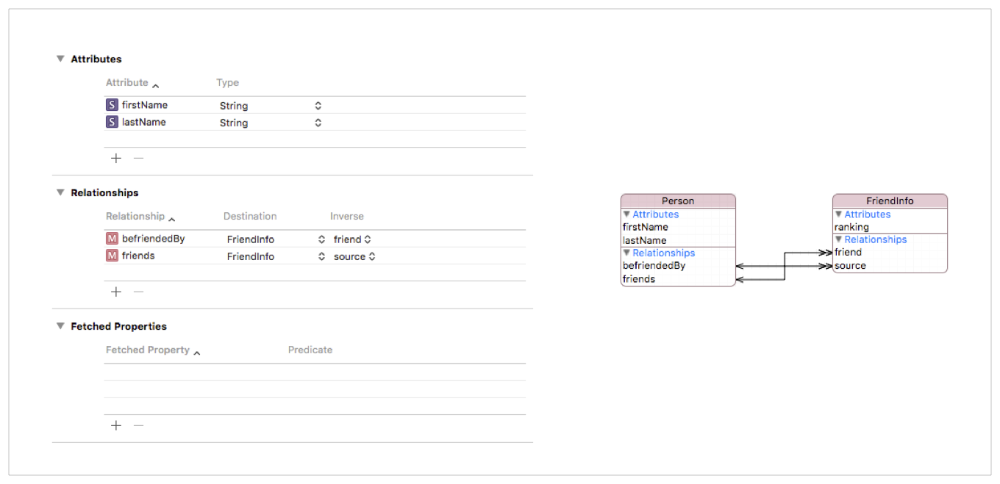
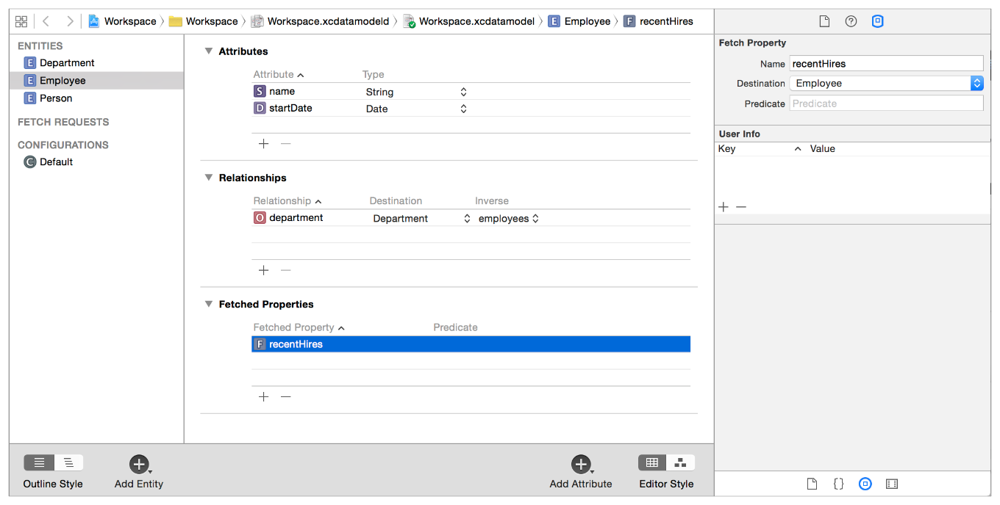

> 导航：[总目录](../../../README.md) · [documentation](../../../_indexes/documentation.md) · [Core Data 编程指南](index.md)

## 创建托管对象关系

托管对象与一个实体描述（[NSEntityDescription](https://developer.apple.com/documentation/coredata/nsentitydescription) 的实例）相关联，该描述提供关于该对象的元数据，同时也与一个跟踪对象图变化的托管对象上下文相关联。对象的元数据包括该对象所代表的实体名称，以及其属性和关系的名称。

在给定的托管对象上下文中，一个托管对象代表持久化存储中一条记录的表示形式。对于持久化存储中给定的一条记录，在给定的上下文中只能存在一个对应的托管对象，但可能存在多个上下文，每个上下文中都包含一个代表该记录的独立托管对象。换句话说，托管对象与它所代表的数据记录之间是一对一关系，但该记录与对应的多个托管对象之间是一对多关系。

> [!NOTE]
> 

### 托管对象模型中的关系定义

创建关系时，你需要决定若干事项。目标实体是什么？该关系是一对一还是一对多？该关系是否为可选？如果是一对多关系，关系中的对象数量是否有上限或下限？当源对象被删除时应该发生什么？

在对象模型的关系中，你有一个源实体（例如 Department）和一个目标实体（例如 Employee）。你在源实体的 Data Model 检查器的 Relationship 面板中定义源实体与目标实体之间的关系，`[Relationship pane in the Data Model inspector](#apple-f4xwc4dqnrsv64tfmyxwi33df52wszbpkridimbqgaytanzvfvbuqmjxfvjvomjv)`。

__图 12-1__ Data Model 检查器中的 Relationship 面板

### 关系基础

关系指定了目标处对象的实体（或父实体）。该实体可以与源处的实体相同（称为 _反身（reflexive）_ 关系）。关系不必只引用单一的实体类型。如果 Employee 实体有两个子实体，比如 Manager 和 Assistant，并且 Employee 不是抽象的，那么某个部门的员工可能由 Employee（主实体）、Manager（Employee 的子实体）、Assistant（Employee 的子实体）或它们的任意组合构成。

在 Relationship 面板的 Type 字段中，你可以将关系指定为一对一或一对多，这称为其基数（cardinality）。一对一关系用对目标对象的引用来表示，一对多关系用可变集合（mutable set）来表示。隐含地，一对一和一对多通常分别指的是 one-to-one 和 one-to-many 关系。多对多关系是指一个关系及其反向关系都是一对多的情形。如何为多对多关系建模取决于你架构的语义。有关此类关系的详情，参见 [多对多关系](#apple-f4xwc4dqnrsv64tfmyxwi33df52wszbpkridimbqgaytanzvfvbuqmjxfvjvooa)。

你还可以为一对多关系目标处的对象数量设置上限和下限。下限不必为零。你可以指定某个部门的员工数量必须在 3 到 40 之间。你也可以指定某个关系是可选的还是不可选的。如果关系不是可选的，那么该关系要有效，其目标处就必须存在一个或多个对象。

基数与可选性是关系的两个正交属性。即使你已经指定了上限或下限（或两者都指定），也可以同时将该关系指定为可选。这意味着目标处不一定要有对象，但如果有，其数量必须落在所指定的范围内。

### 创建关系并不会创建对象

需要注意的重要一点是，仅仅定义一个关系，并不会在创建新的源对象时导致目标对象随之被创建。在这方面，定义关系类似于在标准 Objective-C 类中声明一个实例变量。请看下面的例子。

Objective-C

1. `@interface AAAEmployeeMO : NSManagedObject`
3. `@property (nonatomic, strong) AAAAddressMO *address;`
5. `@end`

Swift

1. `class EmployeeMO: NSManagedObject {`
2. `@NSManaged address: AAAAddressMO?`
3. `}`

如果你创建一个 Employee 实例，并不会因此创建一个 Address 实例，除非你编写代码使其发生。类似地，如果你定义了一个 Address 实体，以及一个从 Employee 到 Address 的非可选一对一关系，仅仅创建一个 Employee 实例并不会创建一个新的 Address 实例。同样，如果你定义了一个从 Employee 到 Address、最小数量为 `1` 的非可选一对多关系，仅仅创建一个 Employee 实例也不会创建一个新的 Address 实例。

### 反向关系

大多数对象关系本质上是双向的。如果 Department 与在该部门工作的 Employee 之间存在一对多关系，那么就存在一个从 Employee 到 Department 的反向一对一关系。主要的例外是获取属性（fetched property），它表示一种弱的单向关系——目标到源之间没有关系。参见 [弱关系（获取属性）](#apple-f4xwc4dqnrsv64tfmyxwi33df52wszbpkridimbqgaytanzvfvbuqmjxfvjvomjt)。

推荐的做法是在两个方向上都对关系建模，并适当地指定反向关系。Core Data 利用这些信息，在发生变更时确保对象图的一致性（参见 [操作关系与对象图完整性](#apple-f4xwc4dqnrsv64tfmyxwi33df52wszbpkridimbqgaytanzvfvbuqmjxfvjvonq)）。

### 关系删除规则

关系的删除规则指定了当有人尝试删除源对象时应该发生什么。请注意措辞 _尝试删除_。如果某个关系的删除规则被设为 Deny，源对象有可能不会被删除。再次考虑部门的 employees 关系，以及不同删除规则的效果。

| 规则 | 说明 |
| --- | --- |
| **Deny** | 如果关系目标（employees）处至少存在一个对象，则不删除源对象（department）。 例如，如果你想删除一个部门，必须先确保该部门的所有员工都已转移到其他地方；否则该部门无法被删除。 |
| **Nullify** | 移除对象之间的关系，但不删除任何一个对象。 只有当员工的 department 关系是可选的，或者你确保在下一次保存操作之前为每个员工都设置了新的部门，这样做才有意义。 |
| **Cascade** | 删除源对象时，同时删除关系目标处的对象。 例如，如果你删除一个部门，就同时解雇该部门的所有员工。 |
| **No Action** | 不对关系目标处的对象做任何处理。 例如，如果你删除一个部门，即使员工仍然认为自己属于该部门，也让他们保持原样。 |

显然，前三条规则各自适用于不同的情形。对于任何给定的关系，应根据业务逻辑来决定哪一条最合适。No Action 规则为何有用则不那么明显，因为使用它有可能使对象图处于不一致的状态（员工与一个已删除的部门仍存在关系）。

如果你使用 No Action 规则，就需要自己确保对象图的一致性得到维护。你需要负责将任何反向关系设置为有意义的值。在你有一个一对多关系，且目标处可能存在大量对象的情况下，这可能会带来好处。

### 操作关系与对象图完整性

当你修改对象图时，保持引用完整性非常重要。Core Data 让你可以轻松地更改托管对象之间的关系，而不会导致引用完整性错误。这一行为大部分源自托管对象模型中指定的关系描述。

当你需要更改一个关系时，Core Data 会为你处理对象图一致性的维护工作，因此你只需要更改关系的一端即可。这一特性适用于一对一、一对多以及多对多关系。请看下面的例子。

员工与经理之间的关系隐含着经理与其下属员工之间的反向关系。如果一名新员工被分配给某位经理，重要的是要让该经理知晓这一职责。新员工必须被加入到该经理的下属列表中。类似地，如果一名员工从一个部门调到另一个部门，就需要进行若干项修改，如图 12-2 所示。该员工的新部门被设置，该员工从原部门的员工列表中被移除，同时该员工被加入到新部门的员工列表中。

__图 12-2__ 反向关系维护完整性

如果不使用 Core Data 框架，你必须编写好几行代码才能确保对象图的一致性得到维护。而且，你还必须熟悉 Department 类的实现，才能知道是否应该从员工端设置到新部门的反向关系。而这种实现细节可能随着应用程序的演进而变化。使用 Core Data 框架，这一切只需一行代码即可完成：

Objective-C

1. `anEmployee.department = newDepartment;`

Swift

1. `anEmployee.department = newDepartment`

或者，你也可以这样使用：

Objective-C

1. `[[newDepartment mutableSetValueForKey:@"employees"] addObject:mo];`

Swift

1. `newDepartment.mutableSetValueForKey("employees").addObject(employee)`

这两种写法效果相同：通过引用应用程序的托管对象模型，框架会根据对象图的当前状态自动确定哪些关系需要建立、哪些需要断开。

### 多对多关系

要定义一个多对多关系，需要使用两个一对多关系。第一个一对多关系从第一个实体（源实体）指向第二个实体（目标）。第二个一对多关系从第二个实体（原目标实体）指向第一个实体（原源实体）。然后你将两者互相设为对方的反向关系。（如果你有数据库管理方面的背景，对此感到担忧，不用担心：如果你使用 SQLite 存储，Core Data 会自动为你创建中间的连接表。）

> [!IMPORTANT]
> 

即使某个实体与自身存在关系（通常称为反身关系），这种关系配置方式同样适用。例如，如果一名员工可以有多个经理（而一位经理也可以有多个直属下属），你可以在 Employee 实体上定义一个一对多关系 directReports，指回 Employee 实体自身，并将其设为另一个同样指回 Employee 实体自身的一对多关系 managers 的反向关系。如图 12-3 所示。

__图 12-3__ 反身多对多关系示例

### 依据语义为关系建模

请考虑关系的语义，以及应该如何为其建模。一个常见的例子是最初被建模为"与自身互为反向"的多对多关系，即"朋友"关系。虽然无论表亲愿不愿意，你都是他/她的表亲，但你的朋友却不一定把你当作朋友。对于这类关系，应使用一个中间（连接）实体。中间实体的一个好处是，你还可以用它为关系添加更多信息。例如，一个 FriendInfo 实体可以包含一个排名属性，用来表示友谊的强度，如图 12-4 所示。

__图 12-4__ 以 FriendInfo 作为中间实体建模朋友关系的示例

在这个例子中，Person 与 FriendInfo 之间存在两个一对多关系：friends 表示源用户的朋友，befriendedBy 表示那些将该源用户视为自己朋友的人。FriendInfo 表示的是关于一段友谊、单方向的信息。给定的一个实例记录的是谁是源用户，以及源用户认为是朋友的一个人。如果这种感情是相互的，就会存在一个源和朋友互换角色的对应实例。处理这类模型时，还有几点需要考虑：

- 要在两个人之间建立友谊，你需要创建一个 FriendInfo 实例。如果双方互相喜欢对方，你需要创建两个 FriendInfo 实例。
- 要断绝一段友谊，必须删除相应的 FriendInfo 实例。
- 从 Person 到 FriendInfo 的删除规则应为 Cascade。也就是说，如果某个人从存储中被移除，对应的 FriendInfo 实例就会失效，因此也必须被移除。

  作为推论，从 FriendInfo 到 Person 的关系不能是可选的——如果 `source` 或 `friend` 为 null，则该 FriendInfo 实例无效。
- 要找出某个人的所有朋友，你需要聚合该人 `friends` 关系中所有的 `friend` 目标，例如：

  Objective-C

  1. `NSSet *personsFriends = [aPerson valueForKeyPath:@"friends.friend"];`

  Swift

  1. `let personsFriends = aPerson.valueForKeyPath("friends.friend")`
- 要找出哪些人把某个人视为自己的朋友，你需要聚合该人 `befriendedBy` 关系中所有的 `source` 目标，例如：

  Objective-C

  1. `NSSet *befriendedByPerson = [aPerson valueForKeyPath:@"befriendedBy.source"];`

  Swift

  1. `let befriendedByPerson = aPerson.valueForKeyPath("befriendedBy.source")`

### 不支持跨存储关系

请注意，不要在一个持久化存储中的实例与另一个持久化存储中的实例之间创建关系，因为 Core Data 不支持这种做法。如果你需要在不同存储的实体之间建立关系，通常应使用获取属性。参见下一节。

### 弱关系（获取属性）

获取属性表示的是一种弱的单向关系。在员工与部门的领域中，部门的一个获取属性可能是"最近雇用（Recent Hires）"。员工没有指向该"最近雇用"关系的反向关系。一般来说，获取属性最适合用来为跨存储关系、松耦合关系以及类似的临时性分组建模。

获取属性与关系类似，但有几个重要的不同之处：

- 获取属性的值不是直接的关系，而是通过一次获取请求计算得出的。（该获取请求通常使用谓词来约束结果。）
- 获取属性用数组（`NSArray`）表示，而不是集合（`NSSet`）。与该属性关联的获取请求可以指定排序方式，因此获取属性可能是有序的。
- 获取属性是惰性求值的，随后会被缓存。

__图 12-5__ 为实体添加获取属性

从某种意义上说，你可以把获取属性看作类似于智能播放列表，但有一个重要的限制：它不是动态的。如果目标实体中的对象发生了变化，你必须重新求值该获取属性，才能确保它保持最新。你可以使用 [refreshObject:mergeChanges:](https://developer.apple.com/documentation/coredata/nsmanagedobjectcontext/1506224-refreshobject) 手动刷新这些属性——这会使得与该属性关联的获取请求，在该对象的故障（fault）下一次被触发时重新执行。

在获取属性的谓词中，你可以使用两个特殊变量：`$FETCH_SOURCE` 和 `$FETCHED_PROPERTY`。source 指的是拥有该属性的具体托管对象，你可以创建以该源对象为起点的键路径，例如 `university.name LIKE [c] $FETCH_SOURCE.searchTerm`。`$FETCHED_PROPERTY` 指的是该实体的获取属性描述。属性描述有一个 userInfo 字典，你可以在其中填入任意的键值对。因此，你可以改变获取属性谓词中的某些表达式，或者改变该对象所关联的任何对象。

要理解这些变量的工作方式，可以考虑一个获取属性，其目标实体为 Author，谓词形式为 `(university.name LIKE [c] $FETCH_SOURCE.searchTerm) AND (favoriteColor LIKE [c] $FETCHED_PROPERTY.userInfo.color)`。如果源对象有一个属性 `searchTerm`，其值为 Cambridge，而该获取属性有一个 userInfo 字典，其中键 color 的值为 Green，那么最终得到的谓词就是 `(university.name LIKE [c] "Cambridge") AND (favoriteColor LIKE [c] "Green")`。该获取属性会匹配所有就读于 Cambridge、且喜欢的颜色是绿色的 Author。如果你把源对象中 searchTerm 的值改为 Durham，谓词就会变成 `(university.name LIKE [c] "Durham") AND (favoriteColor LIKE [c] "Green")`。

获取属性最重要的限制是：你不能通过替换来改变谓词的结构——例如，你不能把一个 LIKE 谓词改成一个复合谓词，也不能改变运算符（在本例中即 `LIKE [c]`）。

[托管对象与引用](MO_Lifecycle.md#apple-f4xwc4dqnrsv64tfmyxwi33df52wszbpkridimbqgaytanzvfvbuqmzrfvjvomi)

[故障化与唯一化](FaultingandUniquing.md#apple-f4xwc4dqnrsv64tfmyxwi33df52wszbpkridimbqgaytanzvfvbuqmjyfvjvomi)
