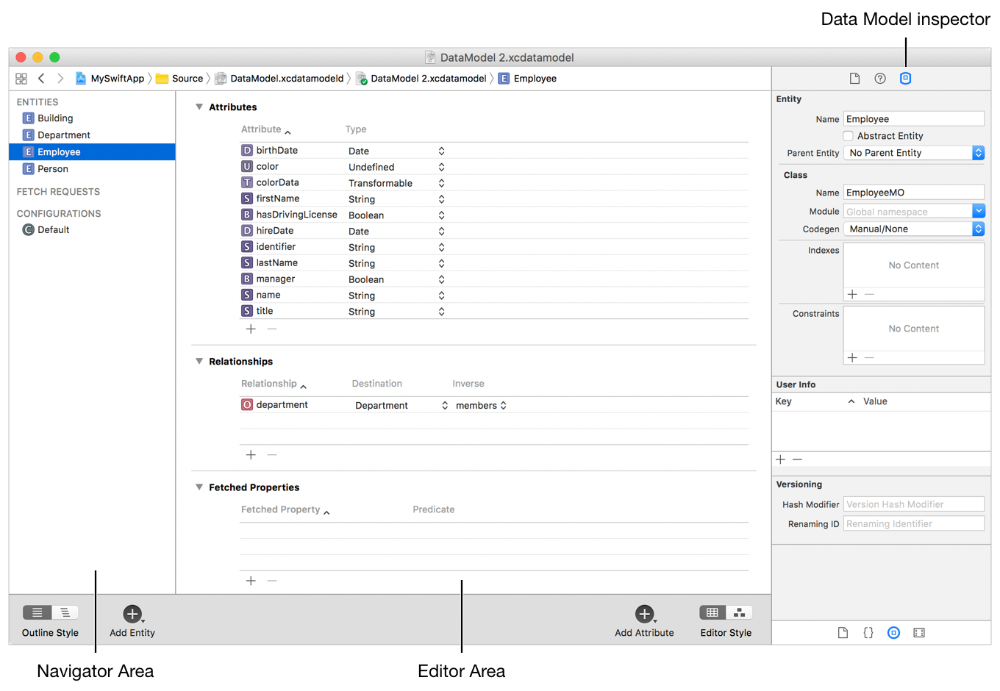
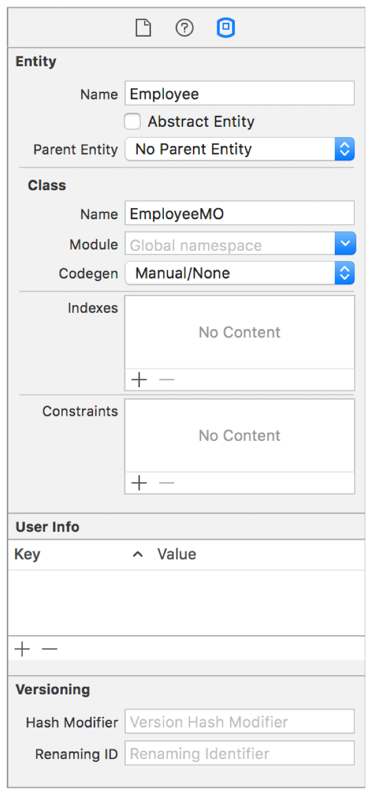
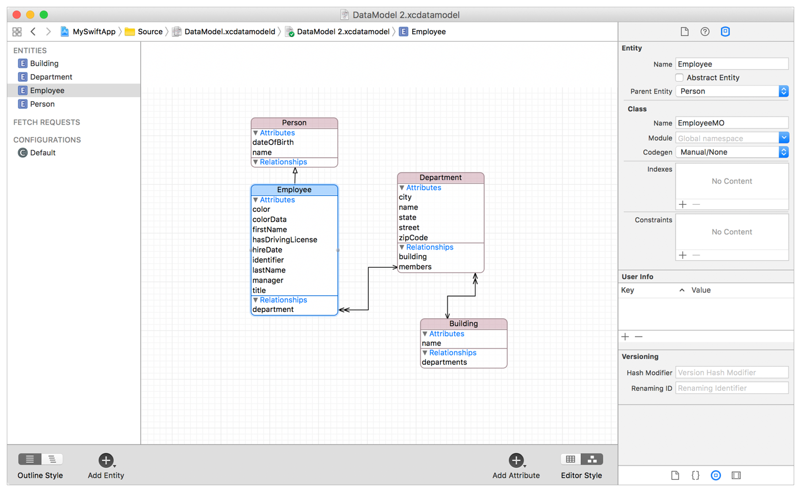
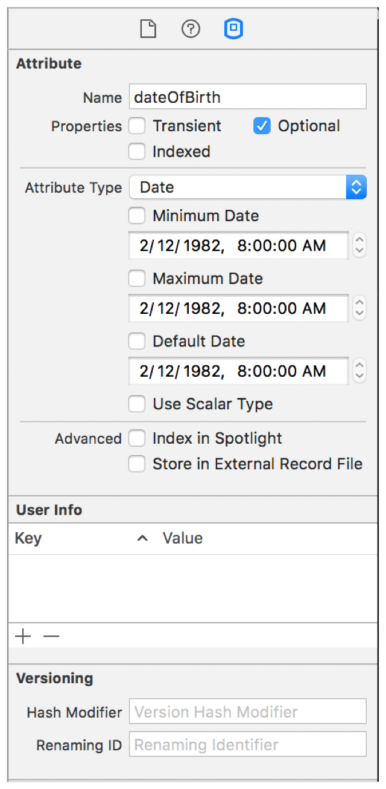
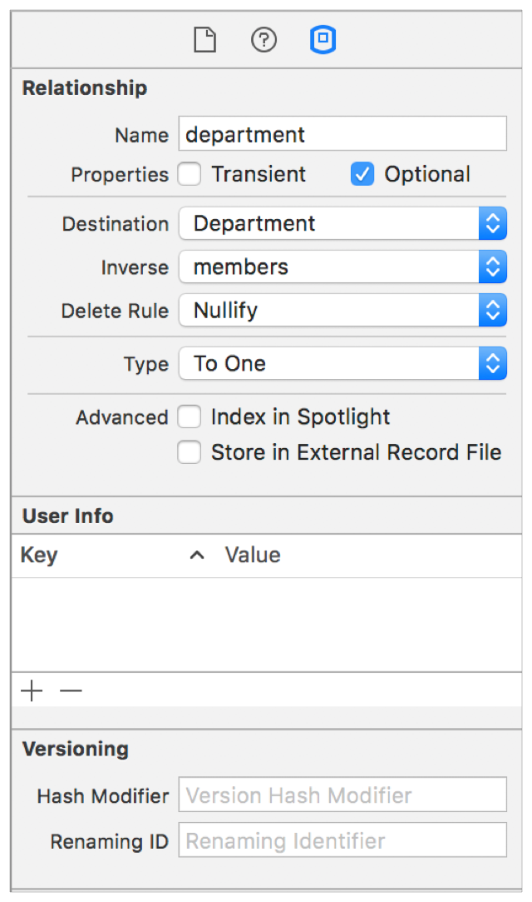

> 导航：[总目录](../../../README.md) · [documentation](../../../_indexes/documentation.md) · [Core Data 编程指南](index.md)

## 创建托管对象模型

Core Data 的大部分功能都依赖于你为描述应用程序的实体、属性以及它们之间的关系而创建的模式（schema）。Core Data 使用一种称为托管对象模型的模式——它是 [NSManagedObjectModel](https://developer.apple.com/documentation/coredata/nsmanagedobjectmodel) 的一个实例。一般来说，模型越丰富，Core Data 就越能更好地支持你的应用程序。

托管对象模型使 Core Data 能够将持久化存储中的记录映射为你在应用程序中使用的托管对象。该模型是一组实体描述对象（[NSEntityDescription](https://developer.apple.com/documentation/coredata/nsentitydescription) 的实例）的集合。一个实体描述用来描述一个实体（可以将其类比为数据库中的一张表），包括它的名称、用于在应用程序中表示该实体的类名，以及它拥有哪些属性（attribute）和关系（relationship）。

### 创建实体及其属性

当你在 Xcode 中新建一个项目并打开模板选择对话框时，勾选 Use Core Data 复选框。模板会随之创建一个 Core Data 模型的源文件，该文件的扩展名为 `.xcdatamodeld`。在导航区域中选中该文件，即可显示 Core Data 模型编辑器。

__创建实体的方法__

1. 点击 Add Entity。

   导航区域的 Entities 列表中会出现一个新的未命名实体。
2. 选中这个新的未命名实体。
3. 在 Data Model 检查器的 Entity 面板中，输入实体的名称，然后按下 Return 键。

__为实体创建属性和关系的方法__

1. 选中新建的实体后，点击相应区块底部的添加按钮（+）。

   编辑区域的 Attributes 或 Relationships 区块中会新增一个未命名的属性或关系（统称为 property）。
2. 选中这个新的未命名 property。

   该 property 的设置会显示在 Data Model 检查器的 Relationship 面板或 Attribute 面板中。
3. 为 property 指定一个名称，然后按下 Return 键。

   该属性或关系的信息会显示在编辑区域中。

`[Xcode 数据模型编辑器中的 Employee 实体](#apple-f4xwc4dqnrsv64tfmyxwi33df52wszbpkridimbqgaytanzvfvbuqmzqfvjvoni)` 展示了一个名为 Employee 的实体，其属性描述了该员工的出生日期、姓名和入职日期。

__图 2-1__Xcode 数据模型编辑器中的 Employee 实体

至此，你已经在模型中创建了一个实体，但还没有创建任何数据。数据是稍后在你启动应用程序时才创建的。这些实体将在你的应用程序中作为创建托管对象（[NSManagedObject](https://developer.apple.com/documentation/coredata/nsmanagedobject) 实例）的基础。

### 定义实体

命名好实体之后，你还需要在 Data Model 检查器的 Entity 面板中进一步定义它；参见 `[Data Model 检查器中的 Entity 面板](#apple-f4xwc4dqnrsv64tfmyxwi33df52wszbpkridimbqgaytanzvfvbuqmzqfvjvomy)`。

__图 2-2__Data Model 检查器中的 Entity 面板

### 实体名称与类名称

请注意，实体名称与类名称（[NSManagedObject](https://developer.apple.com/documentation/coredata/nsmanagedobject) 的子类）并不相同。数据模型中的实体结构不必与类层级结构一致。图 2-2 展示了一个符合 Objective-C 推荐命名模式、并带有 MO 后缀的类名。实体名称和类名称都是必填项。

### 抽象实体

如果你不打算创建某个实体的任何实例，可以将该实体指定为抽象实体（abstract entity）。当你拥有若干个实体，它们都是某个公共实体的特化（继承自该公共实体），而该公共实体本身不应该被实例化时，通常会将其设为抽象实体。例如，在 Employee 实体中，你可以将 Person 定义为抽象实体，并规定只有具体的子实体（Employee 和 Customer）才能被实例化。在 Data Model 检查器的 Entity 面板中将某个实体标记为抽象，就是在告知 Core Data 该实体永远不会被直接实例化。

### 实体继承

实体继承的工作方式与类继承类似，其用途也是出于相同的原因。如果你有若干个相似的实体，可以将它们共有的属性提取到一个超实体（superentity，也称为父实体）中。这样就不必在多个实体中重复指定相同的属性，而是在一个实体中定义它们，由子实体继承。例如，你可以定义一个具有 firstName 和 lastName 属性的 Person 实体，以及继承这些属性的子实体 Employee 和 Customer。图 2-3 展示了这种布局的示例。点击右下角的 Editor Style 按钮即可显示该布局图。

在许多情况下，你还会实现一个与该实体对应的自定义类，供表示子实体的类继承。这样一来，所有实体共有的业务逻辑就不必重复实现多次，而是集中实现一次，由子类继承。

> [!NOTE]
> 

__图 2-3__实体继承关系图

### 定义属性和关系

一个实体的属性（property）包括它的 attribute 和 relationship，以及它的获取属性（fetched property，如果有的话）。除其他特性外，每个 property 都有一个名称和一个类型。property 的名称不能与 [NSObject](https://developer.apple.com/library/archive/documentation/LegacyTechnologies/WebObjects/WebObjects_3.5/Reference/Frameworks/ObjC/Foundation/Classes/NSObject/Description.html#//apple_ref/occ/cl/NSObject) 或 `NSManagedObject` 的任何无参数方法名相同——例如，你不能将某个 property 命名为 "description"（参见 [NSPropertyDescription](https://developer.apple.com/documentation/coredata/nspropertydescription)）。

瞬态属性（transient attribute）是你在模型中定义、但不会作为实体实例数据的一部分保存到持久化存储中的属性。Core Data 仍然会追踪你对瞬态属性所做的更改，因此它们会被记录用于撤销（undo）操作。瞬态属性有多种用途，包括保存计算值和派生值。

> [!NOTE]
> 

__图 2-4__Data Model 检查器中的 Attribute 面板

### 属性（Attributes）

要定义一个属性，请在 Core Data 模型编辑器中选中它，并在 Core Data Model 检查器的 Attribute 面板中指定相应的值；参见 `[Data Model 检查器中的 Attribute 面板](#apple-f4xwc4dqnrsv64tfmyxwi33df52wszbpkridimbqgaytanzvfvbuqmzqfvjvomjs)`。Core Data 原生支持多种属性类型，例如字符串、日期和整数（分别以 [NSString](https://developer.apple.com/library/archive/documentation/LegacyTechnologies/WebObjects/WebObjects_3.5/Reference/Frameworks/ObjC/Foundation/Classes/NSStringClassCluster/Description.html#//apple_ref/occ/cl/NSString)、[NSDate](https://developer.apple.com/library/archive/documentation/LegacyTechnologies/WebObjects/WebObjects_3.5/Reference/Frameworks/ObjC/Foundation/Classes/NSDateClassCluster/Description.html#//apple_ref/occ/cl/NSDate) 和 [NSNumber](https://developer.apple.com/library/archive/documentation/LegacyTechnologies/WebObjects/WebObjects_3.5/Reference/Frameworks/ObjC/Foundation/Classes/NSNumber/Description.html#//apple_ref/occ/cl/NSNumber) 实例的形式表示）。

你可以将某个属性指定为可选（optional）——即它不要求必须有值。但一般来说，应尽量避免这样做，尤其是对数值型属性而言。通常，使用一个必填属性并在属性中定义一个默认值（比如 0）会得到更好的结果。原因在于，SQL 对 `NULL` 有特殊的比较行为，这与 Objective-C 中的 `nil` 不同。数据库中的 `NULL` 并不等同于 0，对 0 的查询也不会匹配值为 `NULL` 的列。此外，数据库中的 NULL 也不等同于空字符串或空的数据块（blob）。

### 关系与获取属性

要定义一个关系，请在 Core Data 模型编辑器中选中它，并在 Data Model 检查器的 Relationship 面板中指定相应的值；`[Data Model 检查器中的 Relationship 面板](#apple-f4xwc4dqnrsv64tfmyxwi33df52wszbpkridimbqgaytanzvfvbuqmzqfvjvomjv)`。

__图 2-5__Data Model 检查器中的 Relationship 面板

Core Data 支持一对一（to-one）、一对多（to-many）关系，以及获取属性（fetched property）。获取属性表示一种弱的、单向的关系。在员工和部门这一领域模型中，某个部门的一个获取属性可能是"近期新入职员工"（员工一方并没有指向该"近期新入职员工"关系的反向关系）。

Type 弹出菜单用于定义该关系是一对一类型还是一对多类型。关系是分方向定义的，一次只定义一个方向。要创建多对多关系，你需要创建两个一对多关系，然后将它们设置为彼此的反向关系。

Destination 弹出菜单用于定义在代码中访问该关系时会返回什么对象（或哪些对象）。如果关系被定义为一对一，则返回单个对象（如果该关系可为可选，则可能返回 `nil`）。如果关系被定义为一对多，则返回一个集合（同样地，如果该关系可为可选，也可能返回 `nil`）。

Inverse 弹出菜单用于定义某个关系的另一半。由于每个关系都是从一个方向定义的，这个弹出菜单会将两个关系连接起来，构成一个完全双向的关系。

关系将在 [创建托管对象关系](HowManagedObjectsarerelated.md#apple-f4xwc4dqnrsv64tfmyxwi33df52wszbpkridimbqgaytanzvfvbuqmjxfvjvomi) 中作更详细的介绍。

[What Is Core Data?](index.md#apple-f4xwc4dqnrsv64tfmyxwi33df52wszbpkridimbqgaytanzvfvbuqmrnknltc)

[Initializing the Core Data Stack](https://developer.apple.com/library/archive/documentation/Cocoa/Conceptual/CoreData/InitializingtheCoreDataStack.html#//apple_ref/doc/uid/TP40001075-CH4-SW1)
