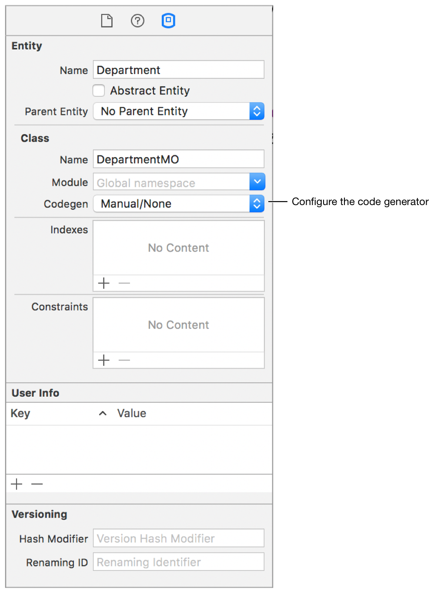

> 导航：[总目录](../../../README.md) · [documentation](../../../_indexes/documentation.md) · [Core Data 编程指南](index.md)

## 创建和修改自定义托管对象

如前所述，托管对象是 [NSManagedObject](https://developer.apple.com/documentation/coredata/nsmanagedobject) 类或其子类的实例，用来表示某个实体的实例。`NSManagedObject` 是一个通用类，实现了托管对象所需的全部基本行为。你可以创建 `NSManagedObject` 的自定义子类，不过这通常并非必需。如果某个实体不需要任何自定义逻辑，你就不必为该实体创建自定义类。创建自定义类的目的通常是为了提供自定义的存取方法或校验方法、使用非标准属性、指定依赖键（dependent key）、计算派生值，以及实现其他自定义逻辑。

### 创建自定义托管对象子类

在 Objective-C 的托管对象子类中，你可以在接口文件中为建模的属性声明 property，但不需要声明实例变量：

1. `@interface MyManagedObject : NSManagedObject`
3. `@property (nonatomic, strong) NSString *title;`
4. `@property (nonatomic, strong) NSDate *date;`
6. `@end`

请注意，这些 property 被声明为 `nonatomic` 和 `strong`。出于性能原因，即使某个值的类采纳了 [NSCopying](https://developer.apple.com/library/archive/documentation/LegacyTechnologies/WebObjects/WebObjects_3.5/Reference/Frameworks/ObjC/Foundation/Protocols/NSCopying/Description.html#//apple_ref/occ/intf/NSCopying) [协议](https://developer.apple.com/library/archive/documentation/General/Conceptual/DevPedia-CocoaCore/Protocol.html#//apple_ref/doc/uid/TP40008195-CH45)，Core Data 通常也不会拷贝对象值。

在 Objective-C 的实现文件中，你需要将这些 property 指定为 `dynamic`：

1. `@implementation MyManagedObject`
2. `@dynamic title;`
3. `@dynamic date;`
4. `@end`

在 Swift 中，你可以使用 `@NSManaged` 关键字来声明这些 property：

1. `class MyManagedObject: NSManagedObject {`
2. `@NSManaged var title: String?`
3. `@NSManaged var date: NSDate?`
4. `}`

对于托管对象所对应的托管对象模型中、该实体所定义的各个属性，Core Data 会动态生成高效的公开和原始（primitive）get/set 属性存取方法，以及关系存取方法。因此，对于已建模的属性，你通常不需要编写自定义的存取方法。

### 重写方法的指导原则

`NSManagedObject` 本身对 `NSObject` 的许多特性进行了定制，以便托管对象能够正确地融入 Core Data 基础架构。Core Data 依赖 `NSManagedObject` 对以下方法的实现，因此你不应该重写它们：

- `primitiveValueForKey:`
- `setPrimitiveValue:forKey:`
- `isEqual:`
- `hash`
- `superclass`
- `class`
- `self`
- `zone`
- `isProxy`
- `isKindOfClass:`
- `isMemberOfClass:`
- `conformsToProtocol:`
- `respondsToSelector:`
- `managedObjectContext`
- `entity`
- `objectID`
- `isInserted`
- `isUpdated`
- `isDeleted`
- `isFault`

不建议重写 [initWithEntity:insertIntoManagedObjectContext:](https://developer.apple.com/documentation/coredata/nsmanagedobject/1506357-init) 和 `description`。如果 `description` 在调试操作期间触发了一个故障，结果可能是不可预测的。你通常也不应该重写键值编码方法，例如 [valueForKey:](https://developer.apple.com/library/archive/documentation/LegacyTechnologies/WebObjects/WebObjects_3.5/Reference/Frameworks/ObjC/EOF/EOControl/Classes/NSObjectAdditions/Description.html#//apple_ref/occ/instm/NSObject/valueForKey:) 和 [setValue:forKeyPath:](https://developer.apple.com/documentation/objectivec/nsobject/1418139-setvalue)。

此外，在重写 [awakeFromInsert](https://developer.apple.com/documentation/coredata/nsmanagedobject/1506548-awakefrominsert)、[awakeFromFetch](https://developer.apple.com/documentation/coredata/nsmanagedobject/1506424-awakefromfetch)，以及诸如 [validateForUpdate:](https://developer.apple.com/documentation/coredata/nsmanagedobject/1506998-validateforupdate) 这样的校验方法之前，请先调用它们的超类实现。重写存取方法时要格外小心，因为这可能会对性能产生负面影响。

### 定义属性与数据存储

在某些方面，托管对象的行为类似于字典——它是一个通用的容器对象，能够高效地为其关联的 `NSEntityDescription` 对象所定义的属性提供存储。`NSManagedObject` 支持一系列常见的属性值类型，包括字符串、日期和数字（完整细节参见 [NSAttributeDescription](https://developer.apple.com/documentation/coredata/nsattributedescription)）。因此，你通常不需要在子类中定义实例变量。不过，如果你需要实现非标准属性，或者需要保留时区信息，可能就需要这样做。此外，如果你使用大型二进制数据对象，还有一些性能方面的考量，可以通过子类来加以缓解——参见 [Binary Large Data Objects (BLOBs)](Performance.md#apple-f4xwc4dqnrsv64tfmyxwi33df52wszbpkridimbqgaytanzvfvbuqmrvfvjvomjr)。

### 使用非标准属性

默认情况下，`NSManagedObject` 会将其属性以对象的形式存储在一个内部结构中，一般来说，Core Data 使用其自身控制的存储方式，要比使用自定义实例变量更加高效。

有时你需要使用一些不被直接支持的类型，例如颜色和 C 结构体。例如，在一个图形应用程序中，你可能想定义一个 Rectangle 实体，具有 `color` 和 `bounds` 两个属性，分别是 `NSColor` 和 `NSRect` 结构体的实例。这种情况需要你创建一个 `NSManagedObject` 的子类。

### 日期、时间与保留时区

`NSManagedObject` 使用 [NSDate](https://developer.apple.com/library/archive/documentation/LegacyTechnologies/WebObjects/WebObjects_3.5/Reference/Frameworks/ObjC/Foundation/Classes/NSDateClassCluster/Description.html#//apple_ref/occ/cl/NSDate) 对象来表示日期属性，并在内部以基于 GMT 的 [NSTimeInterval](https://developer.apple.com/library/archive/documentation/LegacyTechnologies/WebObjects/WebObjects_3.5/Reference/Frameworks/ObjC/Foundation/TypesAndConstants/FoundationTypesConstants/Description.html#//apple_ref/c/tdef/NSTimeInterval) 值来存储时间。时区不会被显式存储——始终以 GMT 表示 Core Data 的日期属性，这样搜索才能在数据库中保持一致。如果你需要保留时区信息，可以在模型中存储一个时区属性，这可能需要你创建一个 `NSManagedObject` 的子类。

### 定制初始化与释放

Core Data 控制着托管对象的生命周期。由于存在故障化和撤销机制，你不能像对待标准 Objective-C 对象那样，对托管对象的生命周期做出同样的假设——框架会根据需要，实例化、销毁乃至"复活"托管对象。

当一个托管对象被创建时，它会使用托管对象模型中为其实体指定的默认值进行初始化。在很多情况下，模型中设置的默认值已经足够。但有时，你可能希望执行额外的初始化——或许是使用一些无法在模型中表示的动态值（例如当前的日期和时间）。

在典型的 Objective-C 类中，你通常会重写指定初始化方法（通常是 `init` 方法）。而在 `NSManagedObject` 的子类中，有三种不同的方式可以定制初始化——通过重写 [initWithEntity:insertIntoManagedObjectContext:](https://developer.apple.com/documentation/coredata/nsmanagedobject/1506357-init)、`awakeFromInsert` 或 `awakeFromFetch`。不要重写 `init`。同样也建议不要重写 `initWithEntity:insertIntoManagedObjectContext:`，因为在该方法中所做的状态更改，可能无法正确地融入撤销和重做机制。另外两个方法，`awakeFromInsert` 和 `awakeFromFetch`，可以让你区分以下两种不同的情况：

- [awakeFromInsert](https://developer.apple.com/documentation/coredata/nsmanagedobject/1506548-awakefrominsert) 在一个对象的整个生命周期中只会被调用一次——即它首次被创建时。

  `awakeFromInsert` 会在你调用 [initWithEntity:insertIntoManagedObjectContext:](https://developer.apple.com/documentation/coredata/nsmanagedobject/1506357-init) 或 [insertNewObjectForEntityForName:inManagedObjectContext:](https://developer.apple.com/documentation/coredata/nsentitydescription/1425093-insertnewobject) 之后立即被调用。你可以使用 `awakeFromInsert` 来初始化一些特殊的默认属性值，例如某个对象的创建日期，如下例所示。

  Objective-C

  1. `- (void)awakeFromInsert`
  2. `{`
  3. `[super awakeFromInsert];`
  4. `[self setCreationDate:[NSDate date]];`
  5. `}`

  Swift

  1. `override func awakeFromInsert() {`
  2. `super.awakeFromInsert()`
  3. `creationDate = NSDate()`
  4. `}`
- [awakeFromFetch](https://developer.apple.com/documentation/coredata/nsmanagedobject/1506424-awakefromfetch) 会在一个对象从持久化存储中被重新初始化时（即在一次获取过程中）被调用。

  你可以重写 `awakeFromFetch`，例如用来建立瞬态值或其他缓存。在 `awakeFromFetch` 中，变更处理会被显式禁用，这样你就可以方便地使用公开的 set 存取方法，而不会使该对象或其上下文变"脏"。不过，禁用变更处理也意味着你不应该在此处操作关系，因为变更不会被正确地传播到目标对象。你可以选择重写 `awakeFromInsert`，或者使用某个与 run loop 相关的方法（例如 [performSelector:withObject:afterDelay:](https://developer.apple.com/library/archive/documentation/LegacyTechnologies/WebObjects/WebObjects_3.5/Reference/Frameworks/ObjC/Foundation/Classes/NSObject/Description.html#//apple_ref/occ/instm/NSObject/performSelector:withObject:afterDelay:)），来代替重写 `awakeFromFetch`。

避免重写 [dealloc](https://developer.apple.com/library/archive/documentation/LegacyTechnologies/WebObjects/WebObjects_3.5/Reference/Frameworks/ObjC/Foundation/Classes/NSObject/Description.html#//apple_ref/occ/instm/NSObject/dealloc) 来清除瞬态属性和其他变量。而应该重写 `didTurnIntoFault`。当一个对象被转变为故障、且即将被实际释放之前，Core Data 会自动调用 `didTurnIntoFault`。你可能会特意把某个托管对象转变为故障，以降低内存开销（参见 [Reducing Memory Overhead](Performance.md#apple-f4xwc4dqnrsv64tfmyxwi33df52wszbpkridimbqgaytanzvfvbuqmrvfvjvomjq)），因此确保在 `didTurnIntoFault` 中正确执行清理操作十分重要。

### Xcode 生成的子类

从 Xcode 8、iOS 10 和 macOS 10.12 开始，Xcode 可以根据 Core Data 模型，自动生成 `NSManagedObject` 子类或扩展（extension）/分类（category）。

要在现有项目中启用此特性，首先要确保数据模型的配置正确：

1. 选中 Core Data 模型文件，打开 File inspector。
2. 确认 Tools Version 已设为 Xcode 8.0 或更高版本。
3. 确认 Code Generation 已设为你当前使用的语言。

数据模型配置完成后，你就可以逐个配置各个实体：

1. 选中你想配置的实体。
2. 打开 Data Model inspector。

   
3. 将代码生成器设置为 None、Class Definition 或 Category/Extension 之一。

数据模型配置完成后，每当数据模型中相关实体发生变化时，Xcode 都会重新生成对应的子类或分类/扩展。

> [!NOTE]
> 

如果你想为 NSManagedObject 子类添加额外的便捷方法或业务逻辑，可以创建一个分类（Objective-C 中）或扩展（Swift 中），并把额外的逻辑放在那里。

[Fetching Objects](FetchingObjects.md#apple-f4xwc4dqnrsv64tfmyxwi33df52wszbpkridimbqgaytanzvfvbuqnrnknltc)

[Connecting the Model to Views](nsfetchedresultscontroller.md#apple-f4xwc4dqnrsv64tfmyxwi33df52wszbpkridimbqgaytanzvfvbuqobnknltc)
