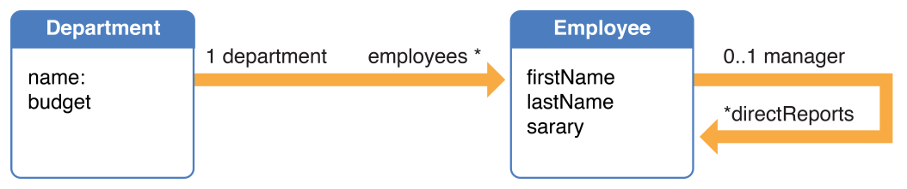

> 导航：[总目录](../../../README.md) · [documentation](../../../_indexes/documentation.md) · [Core Data 编程指南](index.md)

## 性能

Core Data 是一个功能丰富、设计精良的对象图管理框架，能够处理海量数据。SQLite 存储可以扩展到拥有数十亿行、表和列的 TB 级数据库。除非你的实体本身拥有非常庞大的属性或数量极多的 property，否则 10,000 个对象只能算是相当小的数据规模。在处理大型二进制对象时，请参阅 [二进制大对象（BLOB）](#apple-f4xwc4dqnrsv64tfmyxwi33df52wszbpkridimbqgaytanzvfvbuqmrvfvjvomjr)。

### Core Data 的开销与功能之间的权衡

对于非常简单的应用程序，Core Data 会带来一些额外开销——比较一下纯 Cocoa 的文档型应用与基于 Core Data 的 Cocoa 文档型应用即可看出。然而，即便是一个简单的基于 Core Data 的应用程序，也支持撤销与重做、校验以及对象图维护，并提供了将对象保存到持久化存储的能力。如果你自己实现这些功能，其开销很可能会超过 Core Data 本身所带来的开销。随着应用程序复杂度的提升，Core Data 所带来的相对开销通常会降低，与此同时它所带来的收益通常会提高。例如，在一个大型应用程序中自行实现并维护撤销与重做功能，通常是相当困难的。

### NSManagedObject 的存储机制

`NSManagedObject` 使用了一套经过高度优化的内部数据存储机制。特别是，它利用了通过内省模型所获取的数据类型信息。当你以符合键值编码（key-value coding）和键值观察（key-value observing）的方式存取数据时，使用 `NSManagedObject` 很可能比任何其他存储机制都更快——即便是在简单的读写场景下也是如此。在使用了 Cocoa Bindings 的 Cocoa 应用程序中，由于 Cocoa Bindings 依赖于键值编码和键值观察，很难自行构建出一套能达到与 Core Data 同等效率的原始数据存储机制。

### 获取托管对象

每一次与持久化存储之间的往返（即每一次 fetch）都会带来开销，包括访问存储本身的开销，以及将返回的对象合并到持久化栈中的开销。如果可以将多次请求合并为一次能返回你所需全部对象的请求，就应尽量避免执行多次请求。你也可以尽量减少内存中保有的对象数量。

### 获取谓词

谓词（predicate）的使用方式会显著影响应用程序的性能。如果一个获取请求需要使用复合谓词，可以通过确保限制性最强的谓词排在最前面来提高获取效率，尤其是在谓词涉及文本匹配（`contains`、`endsWith`、`like` 和 `matches`）的情况下。正确的 Unicode 文本搜索是比较慢的。如果谓词同时包含文本比较和非文本比较，通常把非文本谓词放在前面会更高效；例如，`(salary > 5000000) AND (lastName LIKE 'Quincey')` 就比 `(lastName LIKE 'Quincey') AND (salary > 5000000)` 更好。关于创建谓词的更多内容，请参阅 _[Predicate Programming Guide](../Predicate%20Programming%20Guide/Introduction.md#apple-f4xwc4dqnrsv64tfmyxwi33df52wszbpkridimbqgaytoobz)_。

### 获取数量限制

你可以使用 `setFetchLimit:` 方法来限制一次获取所返回的对象数量，如下例所示：

Objective-C

1. `NSFetchRequest *request = [[NSFetchRequest alloc] init];`
2. `[request setFetchLimit:100];`

Swift

1. `let request = NSFetchRequest()`
2. `request.fetchLimit = 100`

如果你使用的是 SQLite 存储，可以使用获取数量限制，来减小内存中托管对象的工作集，从而提升应用程序的性能。

如果你需要获取大量对象，可以通过执行多次获取，让你的应用程序看起来响应更快。在第一次获取中，你获取相对较少数量的对象——例如 100 个——并用这些对象填充用户界面。然后，你可以通过 [fetchOffset](https://developer.apple.com/documentation/coredata/nsfetchrequest/1506770-fetchoffset) 方法执行后续的获取，以取回完整的结果集。

### 防止故障被触发

触发故障可能是一个相对昂贵的过程（可能需要一次往返持久化存储的通信），你可能想避免不必要地触发故障。你可以安全地对一个故障调用以下方法，而不会导致它被触发：[isEqual:](https://developer.apple.com/library/archive/documentation/LegacyTechnologies/WebObjects/WebObjects_3.5/Reference/Frameworks/ObjC/Foundation/Protocols/NSObject/Description.html#//apple_ref/occ/intfm/NSObject/isEqual:)、[hash](https://developer.apple.com/library/archive/documentation/LegacyTechnologies/WebObjects/WebObjects_3.5/Reference/Frameworks/ObjC/Foundation/Protocols/NSObject/Description.html#//apple_ref/occ/intfm/NSObject/hash)、[superclass](https://developer.apple.com/library/archive/documentation/LegacyTechnologies/WebObjects/WebObjects_3.5/Reference/Frameworks/ObjC/Foundation/Classes/NSObject/Description.html#//apple_ref/occ/clm/NSObject/superclass)、[class](https://developer.apple.com/library/archive/documentation/LegacyTechnologies/WebObjects/WebObjects_3.5/Reference/Frameworks/ObjC/Foundation/Classes/NSObject/Description.html#//apple_ref/occ/clm/NSObject/class)、`self`、[zone](https://developer.apple.com/library/archive/documentation/LegacyTechnologies/WebObjects/WebObjects_3.5/Reference/Frameworks/ObjC/Foundation/Protocols/NSObject/Description.html#//apple_ref/occ/intfm/NSObject/zone)、[isProxy](https://developer.apple.com/library/archive/documentation/LegacyTechnologies/WebObjects/WebObjects_3.5/Reference/Frameworks/ObjC/Foundation/Protocols/NSObject/Description.html#//apple_ref/occ/intfm/NSObject/isProxy)、[isKindOfClass:](https://developer.apple.com/library/archive/documentation/LegacyTechnologies/WebObjects/WebObjects_3.5/Reference/Frameworks/ObjC/Foundation/Protocols/NSObject/Description.html#//apple_ref/occ/intfm/NSObject/isKindOfClass:)、[isMemberOfClass:](https://developer.apple.com/library/archive/documentation/LegacyTechnologies/WebObjects/WebObjects_3.5/Reference/Frameworks/ObjC/Foundation/Protocols/NSObject/Description.html#//apple_ref/occ/intfm/NSObject/isMemberOfClass:)、[conformsToProtocol:](https://developer.apple.com/library/archive/documentation/LegacyTechnologies/WebObjects/WebObjects_3.5/Reference/Frameworks/ObjC/Foundation/Classes/NSObject/Description.html#//apple_ref/occ/clm/NSObject/conformsToProtocol:)、[respondsToSelector:](https://developer.apple.com/library/archive/documentation/LegacyTechnologies/WebObjects/WebObjects_3.5/Reference/Frameworks/ObjC/Foundation/Protocols/NSObject/Description.html#//apple_ref/occ/intfm/NSObject/respondsToSelector:)、[description](https://developer.apple.com/library/archive/documentation/LegacyTechnologies/WebObjects/WebObjects_3.5/Reference/Frameworks/ObjC/Foundation/Classes/NSObject/Description.html#//apple_ref/occ/clm/NSObject/description)、[managedObjectContext](https://developer.apple.com/documentation/coredata/nsmanagedobject/1506677-managedobjectcontext)、[entity](https://developer.apple.com/documentation/coredata/nsmanagedobject/1506562-entity)、[objectID](https://developer.apple.com/documentation/coredata/nsmanagedobject/1506848-objectid)、[inserted](https://developer.apple.com/documentation/coredata/nsmanagedobject/1506281-isinserted)、[updated](https://developer.apple.com/documentation/coredata/nsmanagedobject/1506867-updated)、[deleted](https://developer.apple.com/documentation/coredata/nsmanagedobject/1506681-deleted) 以及 [isFault](https://developer.apple.com/documentation/coredata/nsmanagedobject/1506837-fault)。

由于 [isEqual:](https://developer.apple.com/library/archive/documentation/LegacyTechnologies/WebObjects/WebObjects_3.5/Reference/Frameworks/ObjC/Foundation/Protocols/NSObject/Description.html#//apple_ref/occ/intfm/NSObject/isEqual:) 和 [hash](https://developer.apple.com/library/archive/documentation/LegacyTechnologies/WebObjects/WebObjects_3.5/Reference/Frameworks/ObjC/Foundation/Protocols/NSObject/Description.html#//apple_ref/occ/intfm/NSObject/hash) 不会导致故障被触发，托管对象通常可以被放入集合中而不触发故障。不过请注意，在集合对象上调用键值编码方法，可能会转而导致在某个托管对象上调用 [valueForKey:](https://developer.apple.com/documentation/coredata/nsmanagedobject/1506613-value)，从而触发故障。此外，虽然 [description](https://developer.apple.com/library/archive/documentation/LegacyTechnologies/WebObjects/WebObjects_3.5/Reference/Frameworks/ObjC/Foundation/Classes/NSObject/Description.html#//apple_ref/occ/clm/NSObject/description) 的默认实现不会导致故障被触发，但如果你实现了一个会访问该对象持久化属性的自定义 [description](https://developer.apple.com/library/archive/documentation/LegacyTechnologies/WebObjects/WebObjects_3.5/Reference/Frameworks/ObjC/Foundation/Classes/NSObject/Description.html#//apple_ref/occ/clm/NSObject/description) 方法，这就会导致故障被触发。

请注意，一个托管对象是故障，并不一定意味着该对象的数据不在内存中——参见 [isFault](https://developer.apple.com/documentation/coredata/nsmanagedobject/1506837-fault) 的定义。

### 降低故障开销

当你执行一次获取时，Core Data 只会获取你所指定实体的实例。在某些情况下（参见 [Faulting Limits the Size of the Object Graph](FaultingandUniquing.md#apple-f4xwc4dqnrsv64tfmyxwi33df52wszbpkridgmbqgaytembsfuytqnjugm3a)），某个关系的目标会以故障的形式表示。当你访问故障中的数据时，Core Data 会自动解析（触发）该故障。这种对相关对象的惰性加载，对内存使用而言要好得多，对于获取与不常用（或非常庞大）对象相关的对象而言，速度也快得多。但这也可能导致这样一种情况：Core Data 针对若干个单独的对象分别执行独立的获取请求，从而带来相对较高的开销。举个例子，考虑以下这个模型：

你可能会获取若干个 Employee 对象，并依次询问每个对象所属 Department 的名称，如以下代码片段所示。

Objective-C

1. `NSFetchRequest * employeesFetch = [NSFetchRequest fetchRequestWithEntityName:@"Employee"];`
2. `NSArray *fetchedEmployees = [moc executeFetchRequest:employeesFetch error:&error];`
3. `if (fetchedEmployees == nil) {`
4. `NSLog(@"Error fetching: %@\n%@", [error localizedDescription], [error userInfo]);`
5. `abort();`
6. `}`
7. `for (Employee *employee in fetchedEmployees) {`
8. `NSLog(@"%@ -> %@ department", employee.name, employee.department.name);`
9. `}`

Swift

1. `let employeesFetch = NSFetchRequest<EmployeeMO>(entityName: "Employee")`
2. `do {`
3. `let fetchedEmployees = try moc.executeFetchRequest(employeeFetch)`
4. `for employee in fetchedEmployees {`
5. `print("\(employee.name) -> \(employee.department!.name)")`
6. `}`
7. `} catch {`
8. `fatalError("Failed to fetch employees: \(error)")`
9. `}`

这段代码可能会导致以下行为：

1. `Jack -> Sales [fault fires]`
2. `Jill -> Marketing [fault fires]`
3. `Benjy -> Sales`
4. `Gillian -> Sales`
5. `Hector -> Engineering [fault fires]`
6. `Michelle -> Marketing`

在这里，一共产生了四次往返持久化存储的通信（一次用于最初对 Employee 的获取，另外三次分别用于各个单独的 Department）。相比最少只需两次往返持久化存储，这些额外的往返带来了相当可观的开销。

有两种技术可以用来缓解这种影响——_批量故障化（batch faulting）_ 和 _预取（prefetching）_。

### 批量故障化

你可以通过使用带有 `IN` 运算符的谓词来执行一次获取请求，从而对一组对象进行批量故障化，如以下示例所示。（在谓词中，`self` 表示被求值的对象——参见 [Predicate Format String Syntax](https://developer.apple.com/library/archive/documentation/Cocoa/Conceptual/Predicates/Articles/pSyntax.html#//apple_ref/doc/uid/TP40001795)。）

Objective-C

1. `NSArray *array = @[fault1, fault2, ...];`
2. `NSPredicate *predicate = [NSPredicate predicateWithFormat:@"self IN %@", array];`

Swift

1. `let array = [fault1, fault2, ...]`
2. `let predicate = NSPredicate(format:"self IN %@", array)`

在创建获取请求时，你可以使用 [NSFetchRequest](https://developer.apple.com/documentation/coredata/nsfetchrequest) 的 [setReturnsObjectsAsFaults:](https://developer.apple.com/documentation/coredata/nsfetchrequest/1506756-returnsobjectsasfaults) 方法，来确保托管对象不会以故障的形式返回。

### 预取

预取实际上是批量故障化的一个特例，它紧接在另一次获取之后立即执行。预取背后的理念是对未来需求的预判。当你获取一些对象时，有时你已经知道，很快你也会需要一些相关对象，而这些对象可能会以故障的形式表示。为了避免单个故障逐一触发所带来的低效，你可以预先获取目标处的对象。

你可以使用 [NSFetchRequest](https://developer.apple.com/documentation/coredata/nsfetchrequest) 的 [setRelationshipKeyPathsForPrefetching:](https://developer.apple.com/documentation/coredata/nsfetchrequest/1506813-relationshipkeypathsforprefetchi) 方法，为该请求的实体指定一个要一并预取的关系键路径数组。例如，假设有一个 Employee 实体，与 Department 实体存在一个关系，如果你获取所有员工，并为每个员工打印其姓名和所属部门的名称，你可以通过预取 department 这个关系，避免为每个 department 实例分别触发故障的可能性。以下代码片段演示了这一点：

Objective-C

1. `NSManagedObjectContext *moc = …;`
2. `NSFetchRequest *request = [NSFetchRequest fetchRequestWithEntityName:@"Employee"];`
3. `[request setRelationshipKeyPathsForPrefetching:@[@"department"]];`

Swift

1. `let moc = …`
2. `let request = NSFetchRequest<EmployeeMO>(entityName:"Employee")`
3. `fetchRequest.relationshipKeyPathsForPrefetching = ["department"]`

如果你对数据将如何被访问或呈现有所了解，可以进一步细化获取谓词，以减少获取的对象数量。不过要注意，这种方法可能比较脆弱——如果应用程序发生变化、需要不同的数据集合，你最终可能会预取到错误的对象。

关于故障化的更多内容，特别是 `isFault` 返回值的含义，请参阅 [Faulting and Uniquing](FaultingandUniquing.md#apple-f4xwc4dqnrsv64tfmyxwi33df52wszbpkridimbqgaytanzvfvbuqmjyfvjvomi)。

### 降低内存开销

有时你需要临时性地使用托管对象，例如计算某个特定属性的平均值。将大量对象加载到内存中，会导致你的对象图和内存消耗随之增长。你可以通过对不再需要的单个托管对象重新进行故障化，来降低内存开销，也可以重置一个托管对象上下文，以清除整个对象图。你还可以使用一般适用于 Cocoa 编程的各种模式。遵循以下指导原则来降低内存开销：

- 使用 [NSManagedObjectContext](https://developer.apple.com/documentation/coredata/nsmanagedobjectcontext) 的 [refreshObject:mergeChanges:](https://developer.apple.com/documentation/coredata/nsmanagedobjectcontext/1506224-refreshobject) 方法，对单个托管对象重新进行故障化。这样做会清除该对象在内存中的属性值，从而降低其内存开销。（请注意，如果该故障再次被触发，这些值会按需重新获取——参见 [Faulting and Uniquing](FaultingandUniquing.md#apple-f4xwc4dqnrsv64tfmyxwi33df52wszbpkridimbqgaytanzvfvbuqmjyfvjvomi)。）
- 创建获取请求时，将 [includesPropertyValues](https://developer.apple.com/documentation/coredata/nsfetchrequest/1506387-includespropertyvalues) 设为 `false`，通过避免创建用于表示属性值的对象来降低内存开销。不过，通常只有在你确定自己不需要实际的属性数据、或者已经在行缓存（row cache）中拥有该信息时，才应该这样做，否则你会招致多次往返持久化存储的通信。
- 使用 [NSManagedObjectContext](https://developer.apple.com/documentation/coredata/nsmanagedobjectcontext) 的 [reset](https://developer.apple.com/documentation/coredata/nsmanagedobjectcontext/1506807-reset) 方法，移除与某个上下文关联的所有托管对象，从头开始，就像你刚刚创建了这个上下文一样。请注意，与该上下文关联的托管对象会失效，因此你需要放弃对它们的任何引用，并重新获取与该上下文关联的所有对象。
- 如果你要遍历大量对象，可能需要使用局部的自动释放池代码块，以确保临时对象能尽快被释放。
- 如果你不打算使用 Core Data 的撤销功能，可以通过将该上下文的撤销管理器设为 `nil`，来降低应用程序的资源需求。这对后台工作线程，以及大型导入或批处理操作而言，可能尤其有益。
- 如果内存中有大量对象，确定它们的持有引用来自哪里。默认情况下，Core Data 不会对托管对象持有强引用（除非它们存在未保存的更改）。托管对象之间会通过关系互相持有强引用，这很容易产生强引用循环。你可以通过对对象重新进行故障化（同样是使用 `NSManagedObjectContext` 的 `refreshObject:mergeChanges:` 方法）来打破这类循环。

### 二进制大对象（BLOB）

如果你的应用程序使用图像、声音数据等二进制大对象（BLOB），就需要注意尽量减小开销。一个对象被认为是小是大，取决于应用程序的具体用法。一般规则是：小于 1 MB 的对象属于小型或中型对象，大于 1 MB 的对象则属于大型对象。一些开发者在数据库中使用 10 MB 大小的 BLOB 也取得了不错的性能。另一方面，如果一个应用程序的某个表中有数百万行，那么即便只有 128 字节，也可能是一个需要被规范化到单独一张表中的 CLOB（字符大对象，Character Large OBject）。

一般来说，如果你_确实需要_在持久化存储中存放 BLOB，应使用 SQLite 存储。其他存储要求整个对象图都常驻内存，且存储写入是原子性的（参见 [Persistent Store Types and Behaviors](PersistentStoreFeatures.md#apple-f4xwc4dqnrsv64tfmyxwi33df52wszbpkridimbqgaytanzvfvbuqmrtfvjvomi)），这意味着它们无法高效地处理大型数据对象。SQLite 可以扩展到处理极大规模的数据库。使用得当的话，SQLite 对高达 100 GB 的数据库能提供良好的性能，单行数据可以容纳多达 1 GB（当然，无论存储库效率多高，把 1GB 数据读入内存都是一项昂贵的操作）。

BLOB 通常表示某个实体的一个属性——例如，一张照片可能是 Employee 实体的一个属性。对于中小规模的 BLOB（以及 CLOB），可以为该数据单独创建一个实体，并创建一个一对一关系来代替原来的属性。例如，你可以创建 Employee 和 Photograph 两个实体，二者之间建立一对一关系，用从 Employee 到 Photograph 的这个关系，代替 Employee 原来的 photograph 属性。这种模式能最大化地发挥对象故障化的优势（参见 [Faulting and Uniquing](FaultingandUniquing.md#apple-f4xwc4dqnrsv64tfmyxwi33df52wszbpkridimbqgaytanzvfvbuqmjyfvjvomi)）。只有当某张具体的照片确实被需要时（即该关系被遍历时），它才会被获取。

不过，如果你能够将 BLOB 作为文件系统上的资源存储，并维护指向这些资源的链接（例如 URL 或路径），会是更好的做法。这样你就可以在需要时才加载某个 BLOB。

### 使用 SQLite 分析获取行为

你可以使用用户默认值 `com.apple.CoreData.SQLDebug`，将发送给 SQLite 的实际 SQL 语句记录到 `stderr`。（请注意，用户默认值的名称是区分大小写的。）例如，你可以将以下内容作为参数传给应用程序：

1. `-com.apple.CoreData.SQLDebug 1`

调试级别数字越高，产生的信息就越多，不过这种做法的实用性可能会逐渐递减。

输出所提供的信息在调试性能问题时可能会很有用——尤其是它可能会告诉你，Core Data 何时在执行大量的小规模获取（例如逐个触发故障时）。输出会区分你通过某个获取请求主动执行的获取，与为了实现故障而自动执行的获取。

### 使用 Instruments 分析应用程序行为

Instruments 中有若干个专门针对 Core Data 的探针：

- Core Data Fetches：记录 [executeFetchRequest:error:](https://developer.apple.com/documentation/coredata/nsmanagedobjectcontext/1506672-fetch) 的调用，提供关于请求所针对的实体、返回对象数量以及获取所耗时间的信息。
- Core Data Saves：记录 [save:](https://developer.apple.com/documentation/coredata/nsmanagedobjectcontext/1506866-save) 的调用，以及执行保存所耗费的时间。
- Core Data Faults：记录对象故障和关系故障触发的相关信息。对于对象故障，Instruments 会记录被故障化的对象；对于关系故障，则记录源对象以及被触发的那个关系。在这两种情况下，都会记录触发该故障所耗费的时间。
- Core Data Cache Misses：追踪那些特别会导致文件系统活动的故障行为——该探针会指出某个故障被触发时没有可用数据——并记录检索该数据所耗费的时间。

所有这些探针都会为每个事件提供一份调用栈跟踪，让你能够看清是什么导致了该事件。

### 其他性能相关信息

和所有技术一样，Core Data 也可能被滥用。你仍然需要考虑 Cocoa 的基本模式，例如内存管理。同时也要考虑你是如何从持久化存储中获取数据的。还要考虑那些与 Core Data 没有直接关系的因素，例如总体内存占用、对象分配，以及键值相关技术等其他 API 的使用（或滥用）情况等等。如果你发现应用程序的性能没有达到预期，可以使用 Instruments 等性能分析工具来确定问题所在。参见 Mac Developer Library 中的 [Performance](https://developer.apple.com/library/mac/navigation/#section=Topics&topic=Performance)。

[Concurrency](Concurrency.md#apple-f4xwc4dqnrsv64tfmyxwi33df52wszbpkridimbqgaytanzvfvbuqmrufvjvomi)

[Troubleshooting Core Data](TroubleshootingCoreData.md#apple-f4xwc4dqnrsv64tfmyxwi33df52wszbpkridimbqgaytanzvfvbuqmrwfvjvomi)
