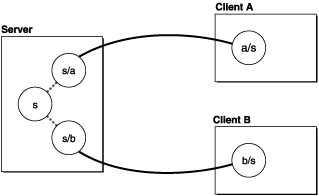
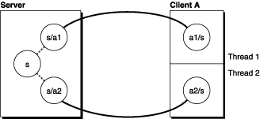
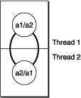

> 导航：[总目录](../../../README.md) · [documentation](../../../_indexes/documentation.md) · [Distributed Objects Programming Topics](Introduction%20to%20Distributed%20Objects.md)

[Next](Ports%20and%20Name%20Servers.md)[Previous](Distributed%20Objects%20Architecture.md)

For interprocess communication, you should use XPC instead; see _[XPC Services API Reference](https://developer.apple.com/documentation/xpc)_ for more information.

# Connections and Proxies

This section describes the highest level components of the distributed objects system: the object that manages the communication (`NSConnection`) and the two proxy objects that stand in for the vended object (`NSDistantObject` and `NSProtocolChecker`).

`NSConnection` objects manage communication between objects in different threads or tasks, on a single host or over the network. They form the backbone of the distributed objects mechanism, and normally operate in the background. You use `NSConnection` API explicitly when making an object available to other applications, when accessing such a vended object, and when altering default communication parameters; the rest of the time you simply interact with the distributed objects themselves.

`NSConnection` objects work in pairs, one in each communicating application or thread. A server application has an `NSConnection` object for every client application connected to it, as shown in [Figure 1](#apple-f4xwc4dqnrsv64tfmyxwi33df52wszbpgiydambqg43dcljzg4ztcmrnijbegrkkjfdug) (the connection labeled `s` is used to form new connections, as described in [Vending an Object](Vending%20an%20Object.md#apple-f4xwc4dqnrsv64tfmyxwi33df52wszbpgiydambqg43dilkdjjbekscbifdq) and [Getting a Vended Object](Getting%20a%20Vended%20Object.md#apple-f4xwc4dqnrsv64tfmyxwi33df52wszbpgiydambqg43dklkciffeoqsbijdq)). The circles represent `NSConnection` objects, and the labels indicate the application itself and the application it is connected to. For example, in `s/a` the `s` stands for the server and the `a` stands for client A. If a link is formed between clients A and B in this example, two new `NSConnection` objects get created: `a/b` and `b/a`.

__Figure 1__  NSConnection objects between a server and two client processes

Under normal circumstances, all distributed objects passed between applications are tied through one pair of `NSConnection` objects. `NSConnection` objects cannot be shared by separate threads, though, so for multithreaded applications a separate `NSConnection` object must be created for each thread. This is shown in [Figure 2](#apple-f4xwc4dqnrsv64tfmyxwi33df52wszbpgiydambqg43dcljzg4ztgnbnijbegr2djbdum).

__Figure 2__  NSConnection objects between a server and two client threads

Finally, an application can use distributed objects between its own threads to make sending messages thread-safe. This is useful for coordinating work with the Application Kit, for example. [Figure 3](#apple-f4xwc4dqnrsv64tfmyxwi33df52wszbpgiydambqg43dcljzg4ztgobnijbegq2divbeg) shows how the `NSConnection` objects are connected. (Note that every thread has its own default `NSConnection` object with which it can vend a single object.) See Communicating With Distributed Objects for more details.

__Figure 3__  NSConnection objects between two threads

`NSProxy` is an abstract superclass defining an API for objects that act as stand-ins for other objects or for objects that don’t exist yet. Typically, a message to a proxy is forwarded to the real object, or causes the proxy to load (or transform itself into) the real object. Subclasses of `NSProxy` can be used to implement transparent distributed messaging (for example, `NSDistantObject`) or for lazy instantiation of objects that are expensive to create.

There are two subclasses of `NSProxy` defined by the distributed objects system. `NSDistantObject` represents the vended object on the client system; it captures messages passed to it and forwards them using an `NSConnection` object to the server process. An `NSProtocolChecker` object can be vended by the server process instead of the real object to filter out any messages that do not conform to a particular protocol. More details of each class are below.

`NSDistantObject` is a concrete subclass of `NSProxy` that defines proxies for objects in other applications or threads. When an `NSDistantObject` object receives a message, in most cases it forwards the message through its `NSConnection` object to the real object in another application, supplying the return value to the sender of the message if one is forthcoming, and propagating any exception back to the invoker of the method that raised it.

`NSDistantObject` adds two useful instance methods to those defined by `NSProxy`. `connectionForProxy` returns the `NSConnection` object that handles the receiver. `setProtocolForProxy:` establishes the set of methods the real object is known to respond to, saving the network traffic required to determine the argument and return types the first time a particular selector is forwarded to the remote proxy. Setting a protocol, though, does not prevent other methods from being sent; they just require network traffic to obtain the method signature. To filter out methods not in the protocol, use an `NSProtocolChecker` instance as the vended object.

There are two kinds of `NSDistantObject`: local proxies and remote proxies. A local proxy is created by an `NSConnection` object the first time an object is sent to another application. It is used by the `NSConnection` object for bookkeeping purposes and should be considered private. The local proxy is transmitted over the network using the `NSCoding` protocol to create the remote proxy, which is the object that the other application uses. `NSDistantObject` defines methods for an `NSConnection` object to create instances, but they are intended only for subclasses to override—you should never invoke them directly. Use `NSConnection`’s `rootProxyForConnectionWithRegisteredName:host:` method, which sets up all the required state for an object-proxy pair.

When an object is vended, all of its methods become available to other processes. This may not be desired when vending an object with many methods, only a few of which ought to be remotely accessible. The `NSProtocolChecker` class (a concrete subclass of `NSProxy`) defines an object that restricts the messages that can be sent to another object (referred to as the checker’s delegate).

A protocol checker acts as a kind of proxy; when it receives a message that is in its designated protocol, it forwards the message to its target, and consequently appears to be the target object itself. However, when it receives a message not in its protocol, it raises an `NSInvalidArgumentException` to indicate that the message is not allowed, whether or not the target object implements the method.

Typically, an object that is to be distributed (yet must restrict messages) creates an `NSProtocolChecker` object for itself and returns the checker rather than returning itself in response to any messages. The object might also register the checker as the root object of an `NSConnection`.

The object should be careful about vending references to _self_—the protocol checker converts a return value of _self_ to indicate the checker rather than the object for any messages forwarded by the checker, but direct references to the object (bypassing the checker) could be passed around by other objects.

[Next](Ports%20and%20Name%20Servers.md)[Previous](Distributed%20Objects%20Architecture.md)

