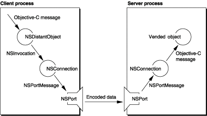

> 导航：[总目录](../../../README.md) · [documentation](../../../_indexes/documentation.md) · [Distributed Objects Programming Topics](Introduction%20to%20Distributed%20Objects.md)

[Next](Connections%20and%20Proxies.md)[Previous](About%20Distributed%20Objects.md)

For interprocess communication, you should use XPC instead; see _[XPC Services API Reference](https://developer.apple.com/documentation/xpc)_ for more information.

# Distributed Objects Architecture

Distributed objects operates by having the server process “vend,” or make public, an object to which other client processes can connect. Once a connection is made, the client process invokes one of the vended object’s methods as if the object existed in the client process—the syntax does not change. Cocoa and the Objective-C runtime system handles the necessary transmission of data between the processes.

[Figure 1](#apple-f4xwc4dqnrsv64tfmyxwi33df52wszbpgiydambqg43daljzha4tgmjninfeesskizbeq) shows many of the objects involved in the distributed objects system and how a message is passed from the client process to the server process. The process goes as follows.

__Figure 1__  Sending a message to a vended object

The server process vends an object by attaching it to an `NSConnection` object which contains an `NSPort` object. The port can be registered with an `NSPortNameServer` object to allow easy access by clients wanting to use the vended object. The vended object can be either the real object that implements the methods being provided or an `NSProtocolChecker` proxy object which filters methods based on a protocol before passing methods to the real object.

The client process attaches to the vended object by connecting its own `NSConnection` object to the server’s `NSPort` object(possibly obtained from a port name server) and requesting a proxy of the vended object. The proxy object is an instance of `NSDistantObject`. The client then treats the `NSDistantObject` object as the real object, sending messages normally.

When the client process sends a message to the `NSDistantObject` object, the proxy captures the Objective-C message in the form of an `NSInvocation` object and forwards it to its `NSConnection` object. The `NSConnection` object encodes the NSInvocation into an `NSPortMessage` object, using an `NSPortCoder` object, and passes it to an `NSPort` object connected to an `NSPort` object in the server process. The client’s port sends the encoded data to the server’s port which decodes the data back into an `NSPortMessage` object. The port message is then sent to the `NSConnection` object which converts it into an `NSInvocation` object, using an `NSPortCoder` object. The invocation is finally dispatched as an Objective-C message sent to the vended object. Any return value from the object is passed back through the connection and returned transparently to the client process.

If the vended object is an instance of `NSProtocolChecker`, it tests if the Objective-C message it received conforms to a particular protocol implemented by the real object. If the message is in the protocol, the protocol checker forwards the message to the real object. Otherwise, an exception is raised and returned to the client process.

The client process blocks while the message is dispatched to the server and waits for the remote method request to finish execution, either by returning (with or without a value) or raising an exception. For methods without a return value, the method can be declared with the `oneway` keyword to indicate that the message should be sent asynchronously. The client does not block in that case and continues running once the message is sent.

[Next](Connections%20and%20Proxies.md)[Previous](About%20Distributed%20Objects.md)

