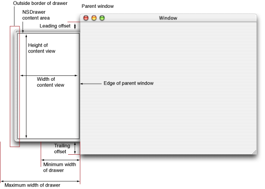
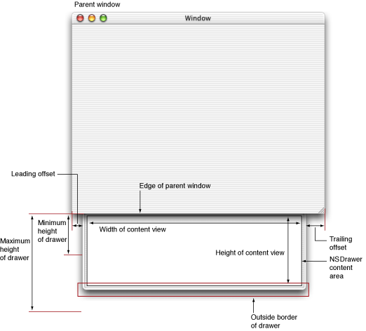

> 导航：[总目录](../../../README.md) · [documentation](../../../_indexes/documentation.md) · [Drawer Programming Topics](Introduction%20to%20Drawers.md)

[Next](Document%20Revision%20History.md)[Previous](About%20Drawers.md)

# Positioning and Sizing a Drawer

A drawer can be positioned on any edge of its parent window—left, right, bottom, or top. Figure 1 shows a drawer on the left edge of its parent, and Figure 2 shows a drawer on the bottom edge.

__Figure 1__  A drawer on the left edge of the parent window

__Figure 2__  A drawer on the bottom edge of the parent window

A drawer has a leading offset and a trailing offset that can be set programmatically. The leading offset is the distance from the top or left edge of the parent window to the drawer and is set using `setLeadingOffset:`. The trailing offset is the distance to the right or bottom edge of the drawer from the right or bottom edge of the parent window and is set using `setTrailingOffset:`. The leading and trailing offsets for a drawer are returned using `leadingOffset` and `trailingOffset`, respectively.

The size of the content area of a drawer is set using `setContentSize:`. In the case of a drawer on the left or right edge of the parent window, the width of the content view is set according to the width specified in the content size. The height of the content view is a calculated value based on the leading and trailing offsets of the drawer and the height of the parent window, and is not affected by the height specified in the content size. In the case of a drawer on the top or bottom edge of the parent window, the height of the content view is set according to the height specified in the content size. The width of the content view is a calculated value based on the leading and trailing offsets for the drawer and the width of the parent window, and is not affected by the height specified in the content size.

A drawer cannot be larger than its parent window. An attempt to set the content size of the drawer to a value larger than the parent window is ignored and the content size is set to the maximum appropriate for the parent window.

The minimum size of a drawer is set using `setMinContentSize:`. In the case of a drawer on the left or right edge of the parent window, the width specified in the minimum content size is the minimum width the drawer can be resized by dragging its outside border without the drawer being caused to close. The height specified in the minimum content size is the minimum allowed height of the drawer when the parent window is resized. In the case of a drawer on the top or bottom edge of the parent window the height specified in the minimum content size is the minimum height the drawer can be resized by dragging its outside border without the drawer being caused to close. The width specified in the minimum content size is the minimum allowed width of the drawer when the parent window is resized.

If the settings of the leading offset, trailing offset, and the minimum content size of a drawer would cause the drawer to exceed the size of the parent window along `edge`, the window will automatically resize to fit the drawer. This can lead to confusing behavior for users if the new size of the window is greater than the currently set maximum size of the parent window.

The maximum size of the drawer content view is set using `setMaxContentSize:`. In the case of a drawer on the left or right edge of the parent window, the width specified in the maximum content size is the maximum width that the drawer can be resized by dragging its outside border. The height specified in the maximum content size is ignored. In the case of a drawer on the top or bottom edge of the parent window, the height specified in the maximum content size is the maximum height that the drawer can be resized by dragging its outside border. The width specified in the maximum content size is ignored.

The DrawerMadness example demonstrates several positioning and sizing patterns for drawers.

[Next](Document%20Revision%20History.md)[Previous](About%20Drawers.md)

