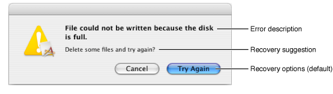

> 导航：[总目录](../../../README.md) · [文档](../../../_indexes/documentation.md) · [错误处理编程指南](Introduction%20to%20Error%20Handling%20Programming%20Guide%20For%20Cocoa.md)


[下一页](Using%20and%20Creating%20Error%20Objects.md) [上一页](Introduction%20to%20Error%20Handling%20Programming%20Guide%20For%20Cocoa.md)

# 错误对象、域和代码

Cocoa 程序使用 [NSError](https://developer.apple.com/documentation/foundation/nserror) 对象传递需要告知用户的运行时错误信息。大多数情况下，程序会在对话框或表单中显示这些错误信息。不过，程序也可以解释这些信息，请求用户尝试从错误中恢复，或自行尝试纠正错误。

`NSError` 对象（简称错误对象）的核心[属性](https://developer.apple.com/library/archive/documentation/General/Conceptual/DevPedia-CocoaCore/ObjectModeling.html#//apple_ref/doc/uid/TP40008195-CH41)是错误域、域专用错误代码，以及一个包含错误相关对象的“用户信息”[字典](https://developer.apple.com/library/archive/documentation/General/Conceptual/DevPedia-CocoaCore/Collection.html#//apple_ref/doc/uid/TP40008195-CH10)，其中最重要的是描述和恢复字符串。本章解释为何需要错误对象，介绍其属性，并讨论如何在 Cocoa 代码中使用它们。

作为对象，[NSError](https://developer.apple.com/documentation/foundation/nserror) 类的实例相比简单的错误代码和错误字符串具有多项优势。它们可以同时封装多项错误信息，包括各种本地化错误字符串。`NSError` 对象还可以被[归档](https://developer.apple.com/library/archive/documentation/General/Conceptual/DevPedia-CocoaCore/Archiving.html#//apple_ref/doc/uid/TP40008195-CH1)和[复制](https://developer.apple.com/library/archive/documentation/General/Conceptual/DevPedia-CocoaCore/ObjectCopying.html#//apple_ref/doc/uid/TP40008195-CH38)，也可以在应用程序中传递和修改。虽然 `NSError` 不是抽象类（因此可直接使用），仍可通过创建子类来扩展它。

借助分层错误域的概念，`NSError` 对象可以嵌入底层子系统的错误，从而提供更详细、更细致的错误信息。错误对象还通过保存指定为该错误恢复尝试器的对象引用，提供错误恢复机制。

主要出于历史原因，OS X 中的错误代码被划分到不同域。例如，类型为 `OSStatus` 的 Carbon 错误代码源自 OS X 之前的 Macintosh 操作系统版本；而 POSIX 错误代码则源自 BSD 等各种符合 POSIX 的 UNIX 变体。Foundation 框架在 `NSError.h` 中为四个主要错误域声明了以下字符串常量：

- `NSMachErrorDomain`
- `NSPOSIXErrorDomain`
- `NSOSStatusErrorDomain`
- `NSCocoaErrorDomain`

上述域常量的顺序体现了域的大致分层，其中 Mach 错误域位于最底层。向 [NSError](https://developer.apple.com/documentation/foundation/nserror) 对象发送 [domain](https://developer.apple.com/documentation/foundation/nserror/1413924-domain) 消息即可获取错误域。

除四个主要域外，还有一些专属于特定[框架](https://developer.apple.com/library/archive/documentation/General/Conceptual/DevPedia-CocoaCore/Framework.html#//apple_ref/doc/uid/TP40008195-CH56)、类组甚至单个类的错误域。例如，WebKit 框架为其 Objective-C 实现中的错误定义了自己的域 `WebKitErrorDomain`。在 Foundation 框架内，URL 类和 XML 类也分别拥有自己的错误域（`NSURLErrorDomain` 和 `NSXMLParserErrorDomain`）。NSStream 类本身还定义了两个错误域，分别用于 SSL 错误和 SOCKS 错误。

Cocoa 错误域（`NSCocoaErrorDomain`）包含 Cocoa 框架的所有错误代码，当然不包括这些框架中类专用域内的错误代码。这些框架不仅包括 Foundation、UIKit 和 Application Kit，还包括 Core Data 以及可能的其他 Objective-C 框架。（Cocoa 框架中独立于 Cocoa 错误域的错误域，均在后者引入之前定义。）

域具有多种用途。它们使 Cocoa 程序能够识别检测到错误的 OS X 子系统，也有助于避免不同子系统中数值相同的错误代码发生冲突。此外，域还能根据子系统分层体现错误代码之间的因果关系；例如，`NSOSStatusErrorDomain` 中的错误可能包含一个 `NSMachErrorDomain` 中的底层错误。

可以创建自己的错误域和错误代码，用于自有框架乃至应用程序。建议域的字符串常量采用 `com.`_company_`.`_framework_or_app_`.ErrorDomain` 形式。

错误代码标识特定域中的某个具体错误。它是一个有符号整数，被赋作程序符号的值。向 [NSError](https://developer.apple.com/documentation/foundation/nserror) 对象发送 [code](https://developer.apple.com/documentation/foundation/nserror/1409165-code) 消息即可获取错误代码。如表 1-1 所示，每个主要域的错误代码都在一个或多个头文件中声明并记录。

__表 1-1__　主要域中错误代码的头文件

| 域 | 头文件 |
| --- | --- |
| Mach | `/usr/include/mach/kern_return.h` |
| POSIX | `/usr/include/sys/errno.h` |
| Carbon (`OSStatus`) | `/System/Library/Frameworks/CoreServices.framework/Frameworks/CarbonCore.framework/Headers/MacErrors.h` |
| Cocoa | 参见表 1-2。 |

表 1-2 列出了当前声明 Cocoa 域错误代码的框架和头文件。

__表 1-2__　声明错误代码的头文件

| 框架/头文件 | 说明 |
| --- | --- |
| `<Foundation/FoundationErrors.h>` | 通用 Foundation 错误代码 |
| `<AppKit/AppKitErrors.h>` | 通用 Application Kit 错误代码 |
| `<CoreData/CoreDataErrors.h>` | Core Data 错误代码 |

为说明如何检查和处理错误，假设要在文件写入操作期间检查底层 POSIX 错误。（[底层错误](#apple-f4xwc4dqnrsv64tfmyxwi33df52wszbpkridimbqgaytqmbwfvbuqmrqgiwugsscirbusssk)一节对此有所说明。）查看 `/usr/include/sys/errno.h` 中声明的 POSIX 错误代码时，会看到类似清单 1-1 的列表。

__清单 1-1__　POSIX 错误代码声明的一部分（`errno.h`）

```c
#define EPERM       1       /* Operation not permitted */
#define ENOENT      2       /* No such file or directory */
#define ESRCH       3       /* No such process */
#define EINTR       4       /* Interrupted system call */
#define EIO         5       /* Input/output error */
#define ENXIO       6       /* Device not configured */
#define E2BIG       7       /* Argument list too long */
#define ENOEXEC     8       /* Exec format error */
#define EBADF       9       /* Bad file descriptor */
#define ECHILD      10      /* No child processes */
#define EDEADLK     11      /* Resource deadlock avoided */
                            /* 11 was EAGAIN */
#define ENOMEM      12      /* Cannot allocate memory */
#define EACCES      13      /* Permission denied */
#define EFAULT      14      /* Bad address */
```

可以选择要检查的错误条件，并在类似清单 1-2 的代码中使用它们。

__清单 1-2__　检查特定域中的具体错误代码

```objc
// underError 是某个 Cocoa 域错误的底层错误对象
if ( [[underError domain] isEqualToString:NSPOSIXErrorDomain] ) {
        switch([underError code]) {
            case EIO:
            {
                // 处理 POSIX I/O 错误
            }
            case EACCES:
            {
                // 处理 POSIX 权限错误
            }
            // 以此类推。
        }
    }
}
```

可以声明自己的错误代码供自有应用程序或框架使用，但这些错误代码应属于你自己的域。绝不要向不属于自己的现有域添加错误代码。

每个 [NSError](https://developer.apple.com/documentation/foundation/nserror) 对象都有一个“用户信息”[字典](https://developer.apple.com/library/archive/documentation/General/Conceptual/DevPedia-CocoaCore/Collection.html#//apple_ref/doc/uid/TP40008195-CH10)，用于保存域和代码之外的错误信息。向 `NSError` 对象发送 [userInfo](https://developer.apple.com/documentation/foundation/nserror/1411580-userinfo) 消息即可访问该字典。与其他类型的容器对象相比，`NSDictionary` 对象的优势在于灵活，甚至可以携带自定义错误信息。不过，所有用户信息字典都包含（或可以包含）若干与错误相关的预定义字符串和对象值。

`NSError` 对象的一项重要作用是保存程序可在警告对话框或表单中显示的错误信息。这些信息通常以字符串形式存入用户信息字典，分为描述、失败原因、恢复建议和恢复选项等类别。（这些字符串在警告中的位置参见[图 1-1](#apple-f4xwc4dqnrsv64tfmyxwi33df52wszbpkridimbqgaytqmbwfvbuqmrqgiwueqsdjbeuisch)。）创建 `NSError` 对象时，应向字典插入本地化字符串，除非希望延迟计算这些字符串。

通常有两种方式访问与 `NSError` 对象关联的本地化信息：可以向用户信息字典发送 `objectForKey:` 并指定适当的键，也可以向 `NSError` 对象发送等效消息。不过，访问本地化字符串时应发送消息，而不是使用字典键。错误对象可能不会将字符串存入字典，而是动态组合字符串。字典被设计为后备机制，并非错误字符串的唯一存储位置。字典键更适合用于在用户信息字典中保存自定义字符串。

以下各项同时列出了字典键和访问本地化字符串所用的方法：

**错误描述**
: 错误的主要描述，以较大号粗体显示，通常包含失败原因。如果用户信息字典中没有错误描述，`NSError` 会根据错误域和代码构造描述；如果是 `NSCocoaErrorDomain` 等已知域，则尝试从该域中的函数或方法获取合适的字符串。

用户信息键：`NSLocalizedDescriptionKey`

方法：`localizedDescription`（绝不返回 `nil`）

**失败原因**
: 简要说明错误为何发生的句子，通常是错误描述的一部分。`presentError:` 等方法不会自动显示失败原因，因为错误描述中已经包含它。失败原因供只想显示失败理由的客户端使用。

用户信息键：`NSLocalizedFailureReasonErrorKey`

方法：`localizedFailureReason`（可能返回 `nil`）

__注意：__　下面的例子有助于说明错误描述与失败原因之间的关系。某错误对象的错误描述为“磁盘已满，因此无法保存文件。”相应的失败原因为“磁盘已满。”

**恢复建议**
: 辅助句子，理想情况下会告诉用户如何从错误中恢复。它以较浅的字体显示在错误描述下方。如果恢复建议提及错误警告中的按钮，应使用与恢复选项（`NSLocalizedRecoveryOptionsErrorKey`）所指定内容相同的标题。也可以将该字符串用作纯提示消息，补充错误描述和失败原因。

用户信息键：`NSLocalizedRecoverySuggestionErrorKey`

方法：`localizedRecoverySuggestion`（可能返回 `nil`）

**恢复选项**
: 错误警告中各按钮标题的字符串数组。默认情况下，错误消息的警告表单和对话框只有一个用于关闭警告的“好”按钮。数组中的第一个字符串是最右侧按钮的标题，第二个字符串是其左侧按钮的标题，依此类推。请注意，如果错误对象指定了恢复尝试器，恢复选项数组应包含多个字符串。恢复尝试器通过访问恢复选项来解释用户的选择。

用户信息键：`NSLocalizedRecoveryOptionsErrorKey`

方法：`localizedRecoveryOptions`（返回 `nil` 表示只有一个“好”按钮）

__图 1-1__　NSError 对象的本地化字符串



要实现错误字符串的国际化，请为每种本地化创建一个 `.strings` 文件，并将其放入包的 `Resources` 目录中名称适当的 `.lproj` 子目录。然后使用一种 `NSLocalizedString` 宏，将本地化字符串添加到 `NSError` 对象的用户信息字典。有关[国际化](https://developer.apple.com/library/archive/documentation/General/Conceptual/DevPedia-CocoaCore/Internationalization.html#//apple_ref/doc/uid/TP40008195-CH23)和字符串本地化的更多信息，请参见《[国际化与本地化指南](../../Mac%20OSX/Internationalization%20and%20Localization%20Guide/About%20Internationalization%20and%20Localization.md#apple-f4xwc4dqnrsv64tfmyxwi33df52wszbpgeydambqge3tc2i)》。

[NSError](https://developer.apple.com/documentation/foundation/nserror) 对象的用户信息字典还可以包含恢复尝试器。恢复尝试器是实现 `NSErrorRecoveryAttempting` [非正式协议](https://developer.apple.com/library/archive/documentation/General/Conceptual/DevPedia-CocoaCore/Protocol.html#//apple_ref/doc/uid/TP40008195-CH45)中一个或多个方法的对象。很多情况下，它就是创建 `NSError` 对象的同一对象，但也可以是任何其他可能知道如何从特定错误中恢复的对象。

如果为 `NSError` 对象指定了恢复尝试器，并且还指定了多个恢复选项，那么显示错误警告且用户选择恢复选项时，恢复尝试器便有机会从错误中恢复。向 `NSError` 对象发送 `recoveryAttempter` 即可访问恢复尝试器。可以使用 `NSRecoveryAttempterErrorKey` 键将恢复尝试器添加到用户信息字典。

有关恢复尝试器对象及其在错误处理中的作用，参见[错误响应者与错误恢复](Error%20Responders%20and%20Error%20Recovery.md#apple-f4xwc4dqnrsv64tfmyxwi33df52wszbpkridimbqgaytqmbwfvbuqmrqgmwueqkkinbesrsd)。

用户信息字典有时会包含另一个 [NSError](https://developer.apple.com/documentation/foundation/nserror) 对象，它表示当前 `NSError` 所代表错误之下某个子系统中的错误。可以查询这个底层错误对象，获取有关错误原因的更具体信息。

使用 `NSUnderlyingErrorKey` 字典键即可访问底层错误对象。

许多错误域都指定了用于从用户信息字典访问特定信息项的键，这些信息对错误对象中的其他信息形成补充。例如，Cocoa 域定义了 `NSStringEncodingErrorKey`、`NSURLErrorKey` 和 `NSFilePathErrorKey`。

请查看错误域的头文件或文档，了解其声明了哪些域专用键。

[下一页](Using%20and%20Creating%20Error%20Objects.md) [上一页](Introduction%20to%20Error%20Handling%20Programming%20Guide%20For%20Cocoa.md)
