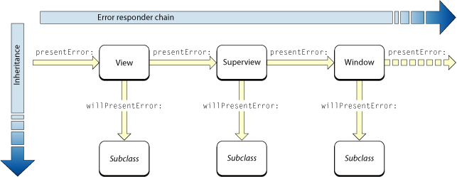
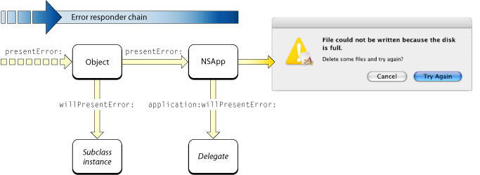
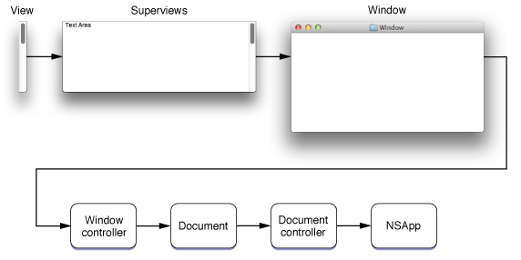
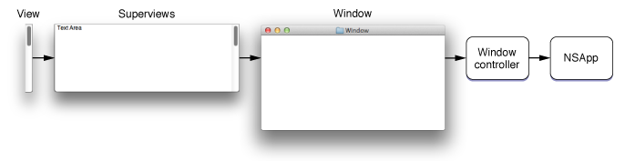
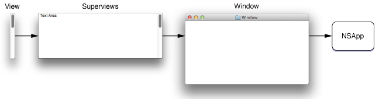

> 导航：[总目录](../../../README.md) · [文档](../../../_indexes/documentation.md) · [错误处理编程指南](Introduction%20to%20Error%20Handling%20Programming%20Guide%20For%20Cocoa.md)

[下一页](Handling%20Received%20Errors.md) [上一页](Using%20and%20Creating%20Error%20Objects.md)

# 错误响应者与错误恢复

正如[为什么需要错误对象？](Error%20Objects%2C%20Domains%2C%20and%20Codes.md#apple-f4xwc4dqnrsv64tfmyxwi33df52wszbpkridimbqgaytqmbwfvbuqmrqgiwueqsdijcugsse)所述，[NSError](https://developer.apple.com/documentation/foundation/nserror) 对象为 Cocoa 编程带来了诸多优势。Cocoa 框架还让 `NSError` 对象在错误呈现和错误恢复架构中承担重要角色，进一步增强了错误对象的实用性。这些架构使 Cocoa 应用程序既能向用户呈现更丰富、更易自定义的消息，也能在告知错误的同时尝试从中恢复。

Application Kit 主要通过 [NSResponder](https://developer.apple.com/documentation/appkit/nsresponder) 类定义了一种称为响应者链的机制：应用程序中的事件和动作消息会沿视图层级向上传递至窗口，最终到达应用程序对象。Application Kit 还为错误处理和呈现定义了类似的对象链。

要让 `NSError` 对象开始沿错误响应者链向上传递，可以向链中的任意对象发送以下两种消息之一：

- [presentError:](https://developer.apple.com/documentation/appkit/nsresponder/1531294-presenterror) —— 用于在应用程序模态警告对话框中显示错误消息
- [presentError:modalForWindow:delegate:didPresentSelector:contextInfo:](https://developer.apple.com/documentation/appkit/nsresponder/1534705-presenterror) —— 用于在文档模态警告表单中显示错误消息

尽管这些方法由 `NSResponder` 类声明，也可以将它们发送给 [NSDocument](https://developer.apple.com/documentation/appkit/nsdocument) 和 [NSDocumentController](https://developer.apple.com/documentation/appkit/nsdocumentcontroller) 类的对象。（当然，`NSResponder` 是 `NSView`、`NSWindow`、`NSApplication` 和 `NSWindowController` 类的超类。）

除 `NSApplication` 的实现外，两种 `presentError:...` 方法的默认行为都是先向 `self` 发送 `willPresentError:`，再把 `presentError:...` 消息转发给链中的下一个对象。子类可以实现 `willPresentError:`，检查传入的 `NSError` 对象并返回自定义对象。如果子类比其超类更了解错误产生的条件，或最清楚如何从错误中恢复，就可能需要这样做。

为便于说明，假设视图层级深处的某个视图对象接收到 `presentError:` 消息。如图 3-1 所示，它先向 `self` 发送 `willPresentError:`，然后将经过修改的 `NSError` 对象传给其父视图，并向父视图发送 `presentError:`。最初视图的各级父视图依次执行相同操作，直到窗口的内容视图最终向窗口对象发送 `presentError:` 消息。

__图 3-1__　错误响应者链——第一部分

`presentError:` 消息以这种方式沿错误响应者链向上传递，直到到达全局应用程序对象 NSApp。如图 3-2 所示，NSApp 会向其委托发送 `application:willPresentError:`，使委托无需自定义子类，也能像链中的子类对象一样检查并视需要修改错误对象。委托返回后，NSApp 会将错误显示为警告对话框（本例中的情况）。

__图 3-2__　错误响应者链——第二部分

错误响应者链中对象的确切顺序因应用程序类型而异。对于基于文档的应用程序，除视图、窗口和 NSApp 外，错误响应者链还包括文档对象、窗口控制器和文档控制器（图 3-3）。

__图 3-3__　基于文档的应用程序的错误响应者链

有些 Cocoa 应用程序并非基于文档，但仍使用一个或多个窗口控制器。图 3-4 展示了此类错误响应者链中的对象顺序。

__图 3-4__　带窗口控制器的非文档应用程序的错误响应者链

最后，简单 Cocoa 应用程序（既非基于文档，也不使用窗口控制器）的错误响应者顺序如图 3-5 所示。

__图 3-5__　简单（非文档）应用程序的错误响应者链

如上一节所述，错误响应者链中对象的自定义子类只要实现 `willPresentError:` 方法，就能在整个传递过程中检查和自定义 [NSError](https://developer.apple.com/documentation/foundation/nserror) 对象。在接近链末端的位置，应用程序委托也可通过 `application:willPresentError:` 获得同样的机会。那么，这些方法中可以进行哪些检查和自定义？

在任一方法中，通常都应先确定错误是什么。为此，应将 `NSError` 对象的域和错误代码与可能和错误条件有关的常量进行比较。不要评估描述或恢复字符串，因为它们可能发生变化，尤其是在本地化之后。还可以使用域专用键从用户信息字典提取各类信息，进一步缩小错误原因的范围。

还可以检查错误对象是否包含底层错误；使用 `NSUnderlyingErrorKey` 键即可从用户信息字典访问该对象。如果存在底层错误，并且该对象的用户信息字典中包含失败原因，就可以把这段本地化字符串附加到错误描述中，形成信息更丰富的描述。

如果确定知道如何从错误中恢复，可以向用户信息字典添加一个对象作为恢复尝试器。要使恢复尝试器生效，必须满足[错误恢复](#apple-f4xwc4dqnrsv64tfmyxwi33df52wszbpkridimbqgaytqmbwfvbuqmrqgmwueqkkjjeeerke)中概述的要求。

如果为接收到的 `NSError` 对象自定义错误域和错误代码，可以选择将原始错误作为底层错误存入用户信息字典。为此请使用 `NSUnderlyingErrorKey` 键（或重写 `recoveryAttempter` 方法）。

无法修改接收到的 `NSError` 对象，因为该类不提供 setter 方法，并且用户信息字典不可变。自定义错误时，必须创建新的 `NSError` 对象，并使用新数据以及需要从旧错误对象保留的数据进行初始化。具体说明和示例请参见[使用和创建错误对象](Using%20and%20Creating%20Error%20Objects.md#apple-f4xwc4dqnrsv64tfmyxwi33df52wszbpkridimbqgaytqmbwfvbuqmrqgqwueqkkjfeuoq2d)。

恢复尝试器是一个指定对象，用于在用户请求时尝试从特定错误中恢复。例如，假设程序因文件被锁定而无法保存，恢复尝试器可以先尝试解锁文件，再将其覆盖。

错误恢复机制与[委托](https://developer.apple.com/library/archive/documentation/General/Conceptual/DevPedia-CocoaCore/Delegation.html#//apple_ref/doc/uid/TP40008195-CH14)设计模式相似：系统要求指定对象（恢复尝试器）响应用户操作。[NSError](https://developer.apple.com/documentation/foundation/nserror) 对象可以封装恢复尝试器和恢复选项；恢复选项是一个按钮标题数组，用于显示在错误警告中，其中有一个按钮标题用于请求错误恢复。显示错误警告并且用户点击按钮后，应用程序会向恢复尝试器发送消息，并传入所点击按钮的索引。如果用户点击了“恢复”按钮，恢复尝试器便以避开错误或修复错误成因的方式尝试完成操作。最后，恢复尝试器会将成功与否告知应用程序对象或文档模态表单的委托。

要根据用户选择执行错误恢复，需要满足三个条件：

- 恢复尝试器对象必须实现 `NSErrorRecoveryAttempting` 非正式协议的方法之一：`attemptRecoveryFromError:optionIndex:delegate:didRecoverSelector:contextInfo:` 或 `attemptRecoveryFromError:optionIndex:`，具体取决于错误警告分别采用文档模态（表单）还是应用程序模态（对话框）。
- `recoveryAttempter` 方法必须返回合适的对象。为确保这一点，可以将恢复尝试器作为 `NSRecoveryAttempterErrorKey` 的值添加到用户信息字典，也可以重写 `recoveryAttempter` 方法。
- `localizedRecoveryOptions` 必须返回按钮标题数组（其中包含请求错误恢复的按钮标题）。为确保这一点，可以将该数组作为 `NSLocalizedRecoveryOptionsErrorKey` 的值添加到用户信息字典，也可以重写 `localizedRecoveryOptions` 方法。

有关错误恢复的完整过程（包括示例代码），请参见[从错误中恢复](Recovering%20From%20Errors.md#apple-f4xwc4dqnrsv64tfmyxwi33df52wszbpkridimbqgaytqmbwfvbuqmrqgywueq2jircuor2g)。

[下一页](Handling%20Received%20Errors.md) [上一页](Using%20and%20Creating%20Error%20Objects.md)
