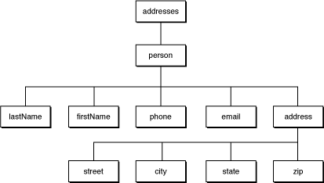

> 导航：[总目录](../../../README.md) · [文档](../../../_indexes/documentation.md) · [事件驱动 XML 编程指南](Introduction%20to%20Event-Driven%20XML%20Programming%20Guide%20for%20Cocoa.md)


[下一篇](Validation%20Tips%20and%20Techniques.md) [上一篇](Using%20Multiple%20Delegates.md)

# 构建 XML 树结构

通常，如果要添加或修改 XML 文档的内容，就必须构建一个静态树结构，完整表示文档中的元素及其他结构。如果要依据规定文档逻辑结构的 DTD（或其他语言模式）验证 XML 文档，树表示同样不可或缺。

大多数开发者希望构建 XML 文档的 DOM 风格树表示时，会使用基于树的解析器，而不是 NSXMLParser 这样的流式解析器。（不过，基于树的解析引擎通常构建在流式解析器之上。）但这并不意味着不能使用 NSXMLParser 实例创建树结构。本文不会深入详述使用 NSXMLParser 构建 XML 树结构的技巧，但会概述一种可采用的常规方法。

任何 XML 文档都可以表示为分层树，其“节点”是与其他元素具有父子关系的元素。每个元素都可以有一个或多个子元素；除根元素外，每个元素都恰好有一个父元素。树以根元素为起点，根元素是树中唯一没有父元素的元素。树的“叶”节点通常是仅含文本的元素，但也可以是混合元素或空元素。

例如，请看下面这段简短的 XML 文档：

```xml
<?xml version="1.0" encoding="UTF-8"?>
<!DOCTYPE addresses SYSTEM "addresses.dtd">
<addresses>
    <person idnum="0123">
        <lastName>Doe</lastName>
        <firstName>John</firstName>
        <phone location="mobile">(201) 345-6789</phone>
        <email>jdoe@foo.com</email>
        <address>
            <street>100 Main Street</street>
            <city>Somewhere</city>
            <state>New Jersey</state>
            <zip>07670</zip>
        </address>
    </person>
</addresses>
```

以下元素节点树表示了该文档：

__图 1__　简单 XML 文档的树表示



使用 NSXMLParser 构建 XML 文档树表示有多种方式。本文介绍一种递归、面向对象的方法，在表示文档元素的对象之间动态转移委托职责。（[使用多个委托](Using%20Multiple%20Delegates.md#apple-f4xwc4dqnrsv64tfmyxwi33df52wszbpgiydambsgi3dolkciffeurcfinba)进一步讨论了这种有策略地切换 NSXMLParser 委托的方式。）从编程角度看，结果是对象的双向链表和对象数组；从抽象角度看，结果则是文档的树表示。

使用这种方法构建树的过程包括以下步骤：

1. 创建一个类，其实例表示 XML 文档的元素。该类应定义元素名称及其父元素（一对一）和子元素（一对多）关系；还应封装与元素关联的属性。为简化后续说明，我们将这个类称为 MyElement。
2. 从应用程序的顶层对象加载 XML 文档，为其创建 NSXMLParser 实例，将顶层对象指定为委托，然后开始解析文档（请参阅 [XML 解析基础](XML%20Parsing%20Basics.md#apple-f4xwc4dqnrsv64tfmyxwi33df52wszbpgiydambsgi3dilkcineusssfivea)）。
3. 解析器首先遇到文档的根元素，并向委托发送 `parser:didStartElement:namespaceURI:qualifiedName:attributes:`。委托创建 MyElement 对象来表示该根元素，并将其父元素设为 `nil`。创建并初始化该对象的方法还会将它设为 NSXMLParser 实例的新委托。
4. 解析器遇到文档的下一个元素（根元素的第一个子元素），再次向委托发送 `parser:didStartElement:namespaceURI:qualifiedName:attributes:`。此时，委托是刚刚创建的、表示根元素的 MyElement 对象。它创建另一个 MyElement 对象来表示新元素（在此过程中，将新对象设为委托，并将自己设为新对象的父元素），然后将新对象添加到自己的子元素列表。
5. 新委托收到下一条 `parser:didStartElement:namespaceURI:qualifiedName:attributes:` 消息，该消息标识它的第一个子元素；新委托会创建该元素，并将其添加到自己的子元素列表。
6. 当解析器遇到包含文本或混合内容的“叶”元素，或者空元素时，沿树的第一个分支进行的递归下降会结束。如果存在混合内容，下降实际上并未真正结束，因为即使委托已针对当前元素接收到 `parser:foundCharacters:`，之后仍会收到 `parser:didStartElement:namespaceURI:qualifiedName:attributes:`。具体处理方式取决于元素类型：

   - 如果是空元素，处理会直接跳到下一步（元素结束标签）。
   - 如果当前元素节点仅关联文本，委托会通过累积文本来响应 `parser:foundCharacters:` 消息（该消息会依次调用多次）。
   - 如果存在混合内容，即使委托收到通知嵌入元素开始标签和结束标签的消息后，仍会继续处理文本。一种处理方式是将文本包装为特殊的文本元素对象，并按正确顺序将其插入该元素的子元素列表。
7. 最后，解析器向委托发送 `parser:didEndElement:namespaceURI:qualifiedName:`，通知它该元素现已完成。委托将新委托设为其父元素，然后返回。
8. 如果父元素还有更多子元素，解析器会向它发送下一条 `parser:didStartElement:namespaceURI:qualifiedName:attributes:` 消息；父 MyElement 对象创建一个 MyElement 实例来表示其下一个子元素（在此过程中，将该实例设为新委托，并将自己设为新 MyElement 的父元素），然后将新创建的对象添加到其子元素列表。不过，如果父元素没有更多子元素可添加到列表（即它收到的是 `parser:didEndElement:namespaceURI:qualifiedName:` 消息），它就会将新委托设为自己的父元素并返回。
9. 此过程会持续进行，直至整个 XML 文档处理完毕且树的所有分支均已构建。

作为树节点（主要表示元素）的对象应能够将自身输出为 XML 代码。应用程序还应实现一种算法，让这些对象按正确的文档顺序输出自身。

[下一篇](Validation%20Tips%20and%20Techniques.md) [上一篇](Using%20Multiple%20Delegates.md)
